# 第六章：基于所有权的资源管理 (OBRM) 深度解析（扩展版）

## 概述

OBRM (Ownership-Based Resource Management)，也称为 RAII (Resource Acquisition Is Initialization)，是 Rust 中管理资源的核心模式。资源的获取发生在对象创建时，释放发生在对象销毁时。本章深入探讨 OBRM 的各个方面，包括构造、析构、泄漏处理以及高级用法。

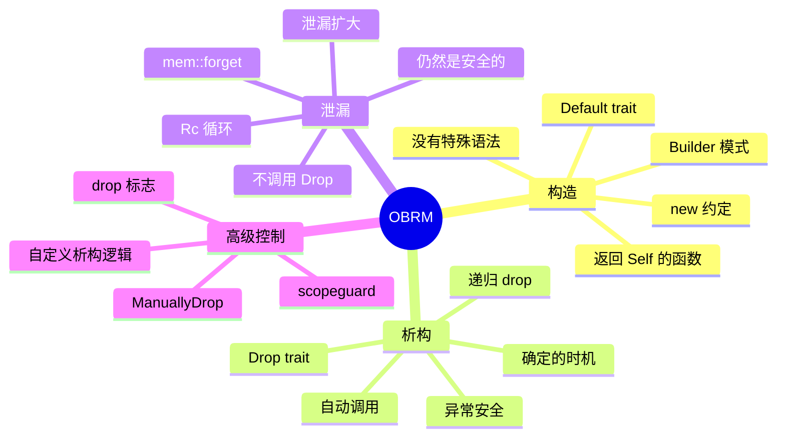

## 6.1 构造函数 (Constructors) 深度解析

### Rust 没有特殊的构造函数

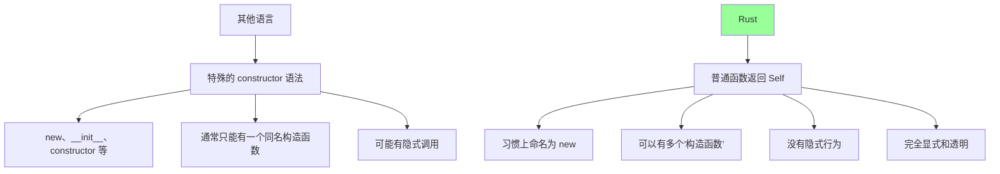

### 构造模式完整指南

```rust
// 基础结构体
struct Connection {
    host: String,
    port: u16,
    timeout: u32,
    retries: u32,
    tls: bool,
    pool_size: usize,
}

impl Connection {
    // 模式 1: 完整参数构造函数
    fn new(host: String, port: u16, timeout: u32, retries: u32, tls: bool, pool_size: usize) -> Self {
        Self { host, port, timeout, retries, tls, pool_size }
    }

    // 模式 2: 必需参数 + 默认值
    fn with_defaults(host: String, port: u16) -> Self {
        Self {
            host,
            port,
            timeout: 30,
            retries: 3,
            tls: true,
            pool_size: 10,
        }
    }

    // 模式 3: 从其他类型转换
    fn from_url(url: &str) -> Result<Self, ParseError> {
        // 解析 URL 并创建连接
        let (host, port) = parse_url(url)?;
        Ok(Self::with_defaults(host, port))
    }

    // 模式 4: 尝试创建（可失败）
    fn try_new(host: &str) -> Result<Self, ConnectionError> {
        // 验证主机名
        if !is_valid_host(host) {
            return Err(ConnectionError::InvalidHost);
        }
        Ok(Self::with_defaults(host.to_string(), 80))
    }
}

// 辅助类型
struct ParseError;
struct ConnectionError;
impl ConnectionError {
    const InvalidHost: Self = ConnectionError;
}
fn parse_url(_: &str) -> Result<(String, u16), ParseError> { Ok(("localhost".into(), 80)) }
fn is_valid_host(_: &str) -> bool { true }
```

### Builder 模式详解

```rust
// 完整的 Builder 模式实现
struct ServerConfig {
    host: String,
    port: u16,
    max_connections: usize,
    timeout_ms: u64,
    tls_cert: Option<String>,
    tls_key: Option<String>,
}

// Builder 是单独的类型
struct ServerConfigBuilder {
    host: Option<String>,
    port: Option<u16>,
    max_connections: usize,
    timeout_ms: u64,
    tls_cert: Option<String>,
    tls_key: Option<String>,
}

impl ServerConfigBuilder {
    fn new() -> Self {
        Self {
            host: None,
            port: None,
            max_connections: 100,
            timeout_ms: 30000,
            tls_cert: None,
            tls_key: None,
        }
    }

    fn host(mut self, host: impl Into<String>) -> Self {
        self.host = Some(host.into());
        self
    }

    fn port(mut self, port: u16) -> Self {
        self.port = Some(port);
        self
    }

    fn max_connections(mut self, max: usize) -> Self {
        self.max_connections = max;
        self
    }

    fn timeout_ms(mut self, timeout: u64) -> Self {
        self.timeout_ms = timeout;
        self
    }

    fn tls(mut self, cert: impl Into<String>, key: impl Into<String>) -> Self {
        self.tls_cert = Some(cert.into());
        self.tls_key = Some(key.into());
        self
    }

    fn build(self) -> Result<ServerConfig, BuildError> {
        let host = self.host.ok_or(BuildError::MissingField("host"))?;
        let port = self.port.ok_or(BuildError::MissingField("port"))?;

        // 验证 TLS 配置
        match (&self.tls_cert, &self.tls_key) {
            (Some(_), None) | (None, Some(_)) => {
                return Err(BuildError::InvalidTls);
            }
            _ => {}
        }

        Ok(ServerConfig {
            host,
            port,
            max_connections: self.max_connections,
            timeout_ms: self.timeout_ms,
            tls_cert: self.tls_cert,
            tls_key: self.tls_key,
        })
    }
}

#[derive(Debug)]
enum BuildError {
    MissingField(&'static str),
    InvalidTls,
}

impl ServerConfig {
    fn builder() -> ServerConfigBuilder {
        ServerConfigBuilder::new()
    }
}

fn builder_usage() -> Result<(), BuildError> {
    let config = ServerConfig::builder()
        .host("localhost")
        .port(8080)
        .max_connections(1000)
        .timeout_ms(5000)
        .tls("/path/to/cert.pem", "/path/to/key.pem")
        .build()?;

    println!("Server configured for {}:{}", config.host, config.port);
    Ok(())
}
```

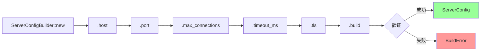

### 类型状态 Builder

```rust
// 使用类型状态确保必需字段在编译时检查
use std::marker::PhantomData;

// 状态标记
struct NotSet;
struct Set;

struct TypedBuilder<HostState, PortState> {
    host: Option<String>,
    port: Option<u16>,
    timeout: u32,
    _host_state: PhantomData<HostState>,
    _port_state: PhantomData<PortState>,
}

impl TypedBuilder<NotSet, NotSet> {
    fn new() -> Self {
        Self {
            host: None,
            port: None,
            timeout: 30,
            _host_state: PhantomData,
            _port_state: PhantomData,
        }
    }
}

impl<P> TypedBuilder<NotSet, P> {
    fn host(self, host: impl Into<String>) -> TypedBuilder<Set, P> {
        TypedBuilder {
            host: Some(host.into()),
            port: self.port,
            timeout: self.timeout,
            _host_state: PhantomData,
            _port_state: PhantomData,
        }
    }
}

impl<H> TypedBuilder<H, NotSet> {
    fn port(self, port: u16) -> TypedBuilder<H, Set> {
        TypedBuilder {
            host: self.host,
            port: Some(port),
            timeout: self.timeout,
            _host_state: PhantomData,
            _port_state: PhantomData,
        }
    }
}

impl<H, P> TypedBuilder<H, P> {
    fn timeout(mut self, timeout: u32) -> Self {
        self.timeout = timeout;
        self
    }
}

// 只有当两个必需字段都设置后才能 build
impl TypedBuilder<Set, Set> {
    fn build(self) -> Config {
        Config {
            host: self.host.unwrap(),
            port: self.port.unwrap(),
            timeout: self.timeout,
        }
    }
}

struct Config {
    host: String,
    port: u16,
    timeout: u32,
}

fn typed_builder_demo() {
    // 这会编译
    let config = TypedBuilder::new()
        .host("localhost")
        .port(8080)
        .timeout(60)
        .build();

    // 这不会编译！缺少 port
    // let config = TypedBuilder::new()
    //     .host("localhost")
    //     .build();  // 错误：build 方法不存在于 TypedBuilder<Set, NotSet>
}
```

### Default trait 深入

```rust
use std::collections::HashMap;

// 手动实现 Default
struct AppConfig {
    name: String,
    version: String,
    debug: bool,
    log_level: LogLevel,
    settings: HashMap<String, String>,
}

#[derive(Clone, Copy)]
enum LogLevel {
    Error,
    Warn,
    Info,
    Debug,
    Trace,
}

impl Default for LogLevel {
    fn default() -> Self {
        LogLevel::Info
    }
}

impl Default for AppConfig {
    fn default() -> Self {
        Self {
            name: String::from("MyApp"),
            version: String::from("1.0.0"),
            debug: false,
            log_level: LogLevel::default(),
            settings: HashMap::new(),
        }
    }
}

// 使用 Default 的各种方式
fn default_usage() {
    // 方式 1: 直接调用
    let config1 = AppConfig::default();

    // 方式 2: 通过 trait
    let config2: AppConfig = Default::default();

    // 方式 3: 结构体更新语法
    let custom_config = AppConfig {
        name: String::from("CustomApp"),
        debug: true,
        ..Default::default()  // 其余字段使用默认值
    };

    // 方式 4: 用于泛型
    fn create_default<T: Default>() -> T {
        T::default()
    }

    let config3: AppConfig = create_default();

    // 方式 5: Option 的 unwrap_or_default
    let maybe_config: Option<AppConfig> = None;
    let config4 = maybe_config.unwrap_or_default();
}

// #[derive(Default)] 的条件
#[derive(Default)]
struct Point {
    x: i32,  // i32 实现了 Default (默认 0)
    y: i32,
}

// 这不能 derive Default，因为 NoDefault 没实现 Default
struct NoDefault(i32);

// struct CannotDerive {
//     value: NoDefault,  // 错误！NoDefault 没实现 Default
// }
```

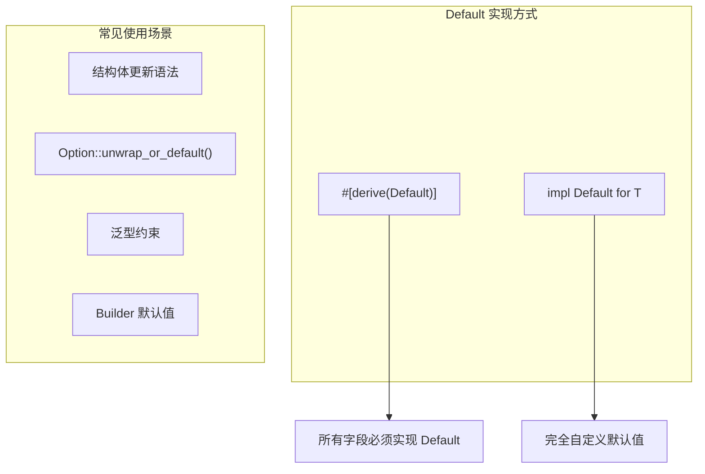

## 6.2 析构函数 (Destructors) 深度解析

### Drop trait 完整理解

```rust
struct Resource {
    name: String,
    handle: i32,
}

impl Resource {
    fn new(name: &str, handle: i32) -> Self {
        println!("[{}] Resource acquired (handle: {})", name, handle);
        Self {
            name: name.to_string(),
            handle,
        }
    }
}

impl Drop for Resource {
    fn drop(&mut self) {
        println!("[{}] Resource released (handle: {})", self.name, self.handle);
        // 实际代码中这里会释放系统资源
        // 例如：close(self.handle)
    }
}

fn drop_demo() {
    println!("=== 进入函数 ===");

    let r1 = Resource::new("First", 1);
    let r2 = Resource::new("Second", 2);

    {
        let r3 = Resource::new("Inner", 3);
        println!("=== 内部作用域 ===");
    }  // r3 在这里被 drop

    println!("=== 继续外部作用域 ===");

}  // r2 然后 r1 被 drop（反序）
```

输出：
```
=== 进入函数 ===
[First] Resource acquired (handle: 1)
[Second] Resource acquired (handle: 2)
[Inner] Resource acquired (handle: 3)
=== 内部作用域 ===
[Inner] Resource released (handle: 3)
=== 继续外部作用域 ===
[Second] Resource released (handle: 2)
[First] Resource released (handle: 1)
```

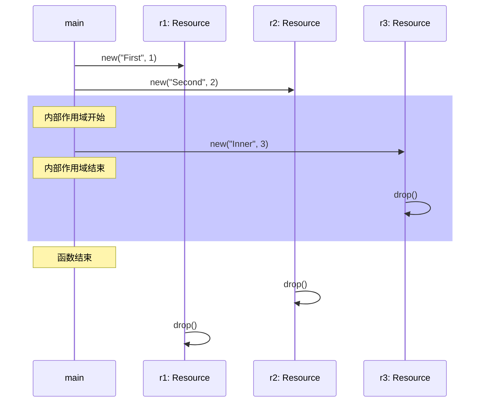

### Drop 顺序详细规则

```rust
struct Named(&'static str);

impl Drop for Named {
    fn drop(&mut self) {
        println!("Dropping {}", self.0);
    }
}

// 规则 1: 变量按声明的逆序 drop
fn rule1_variables() {
    println!("=== 变量逆序 ===");
    let a = Named("a");
    let b = Named("b");
    let c = Named("c");
    // Drop 顺序: c, b, a
}

// 规则 2: 结构体字段按声明顺序 drop
struct Container {
    first: Named,
    second: Named,
    third: Named,
}

impl Drop for Container {
    fn drop(&mut self) {
        println!("Dropping Container (before fields)");
    }
}

fn rule2_struct_fields() {
    println!("=== 结构体字段顺序 ===");
    let c = Container {
        first: Named("first"),
        second: Named("second"),
        third: Named("third"),
    };
    // Drop 顺序: Container, first, second, third
}

// 规则 3: 元组按字段顺序 drop
fn rule3_tuple() {
    println!("=== 元组顺序 ===");
    let t = (Named("0"), Named("1"), Named("2"));
    // Drop 顺序: 0, 1, 2
}

// 规则 4: 数组/Vec 按索引顺序 drop
fn rule4_array() {
    println!("=== 数组顺序 ===");
    let arr = [Named("0"), Named("1"), Named("2")];
    // Drop 顺序: 0, 1, 2
}

// 规则 5: 闭包捕获的变量按捕获顺序 drop
fn rule5_closure() {
    println!("=== 闭包捕获 ===");
    let a = Named("a");
    let b = Named("b");

    let closure = move || {
        println!("Using {} and {}", a.0, b.0);
    };

    closure();
    // 闭包 drop 时，捕获的变量按捕获顺序 drop
}
```

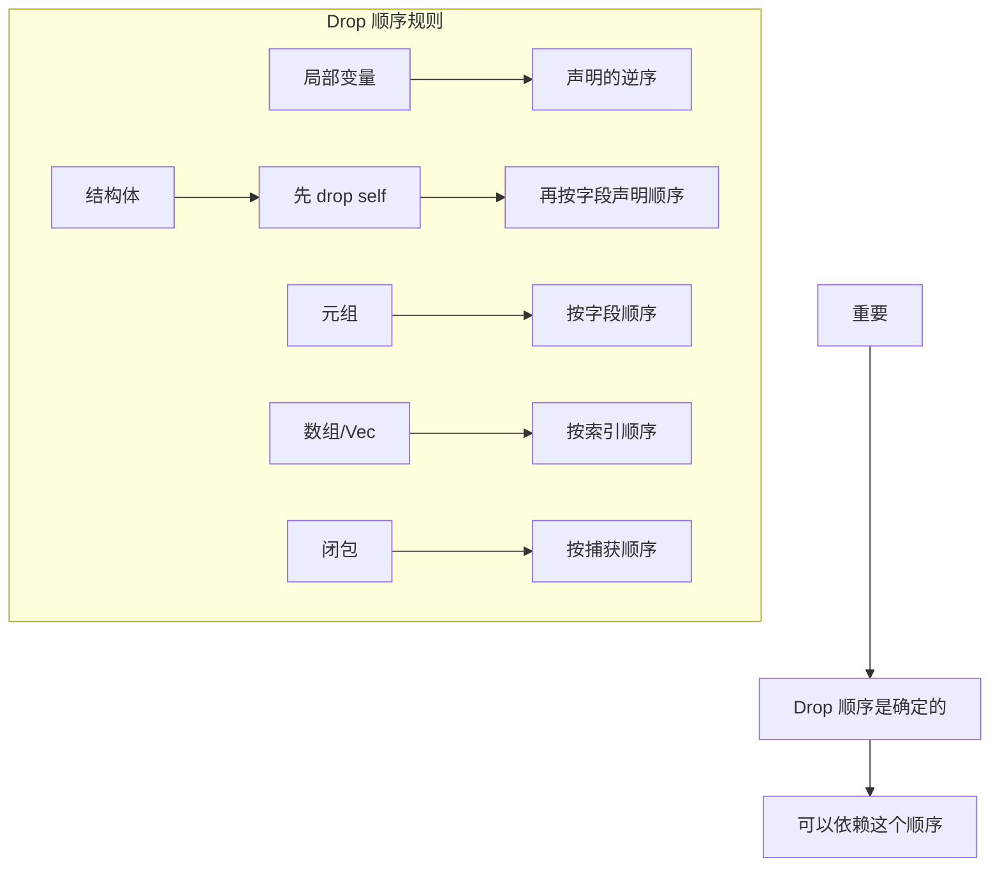

### 递归 Drop

```rust
struct Node {
    value: i32,
    children: Vec<Node>,
}

impl Drop for Node {
    fn drop(&mut self) {
        println!("Dropping node with value: {}", self.value);
        // children 会在这之后自动 drop
    }
}

fn recursive_drop() {
    let tree = Node {
        value: 1,
        children: vec![
            Node {
                value: 2,
                children: vec![
                    Node { value: 4, children: vec![] },
                    Node { value: 5, children: vec![] },
                ],
            },
            Node {
                value: 3,
                children: vec![],
            },
        ],
    };

    // Drop 顺序（深度优先）:
    // 1 (root)
    // 2 (first child)
    // 4 (grandchild)
    // 5 (grandchild)
    // 3 (second child)
}
```

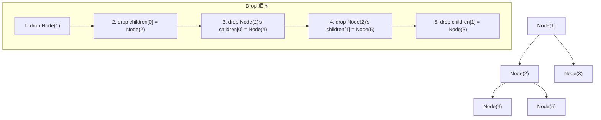

### 不能直接调用 drop 的原因

```rust
struct MyType {
    data: String,
}

impl Drop for MyType {
    fn drop(&mut self) {
        println!("Dropping: {}", self.data);
    }
}

fn why_no_direct_drop() {
    let x = MyType { data: String::from("hello") };

    // 为什么不能 x.drop()?
    // 1. drop 接收 &mut self，但之后 self 仍然"存在"
    // 2. 作用域结束时会再次调用 drop
    // 3. 这会导致 double drop!

    // x.drop();  // 假设可以调用
    // ...
    // } // 这里 x 又被 drop -> double free!

    // 正确做法 1: 使用 std::mem::drop
    let y = MyType { data: String::from("world") };
    drop(y);  // y 被移动进 drop 函数，消耗了所有权

    // 正确做法 2: 创建内部作用域
    {
        let z = MyType { data: String::from("inner") };
    }  // z 在这里被 drop

    println!("继续执行...");
}

// std::mem::drop 的实现
fn my_drop<T>(_x: T) {
    // 什么都不做！
    // T 在函数结束时被 drop
}
```

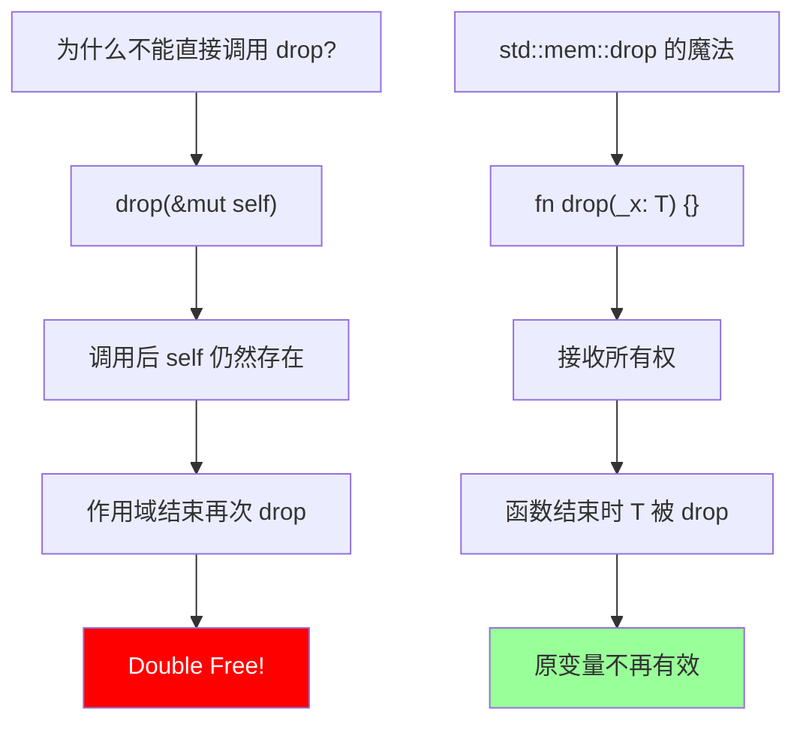

### Drop 与 Copy

```rust
// Copy 类型不能实现 Drop!

#[derive(Copy, Clone)]  // 这可以
struct Point {
    x: i32,
    y: i32,
}

// 这会编译失败!
// impl Drop for Point {
//     fn drop(&mut self) {}
// }
// error: the trait `Copy` cannot be implemented for this type
// because it implements `Drop`

// 为什么？
// Copy 意味着按位复制是安全的
// 如果有 Drop，复制后会有两个值
// 两个值都会被 drop -> 可能 double free 资源

// 解决方案：如果需要析构逻辑，不要实现 Copy
struct ResourceHandle {
    id: u32,
}

impl Drop for ResourceHandle {
    fn drop(&mut self) {
        println!("Releasing handle {}", self.id);
    }
}

// ResourceHandle 不能是 Copy
// 必须显式 clone 或移动
```

## 6.3 内存泄漏 (Leaking) 深度解析

### mem::forget 详解

```rust
use std::mem;

fn forget_demo() {
    // 情况 1: 简单值
    let s = String::from("hello");
    let ptr = s.as_ptr();
    let len = s.len();
    let cap = s.capacity();

    mem::forget(s);  // s 的 drop 不会被调用

    // 堆内存仍然存在！
    // 但是我们丢失了访问它的安全方式
    // 这是内存泄漏

    // 情况 2: 有目的地使用 forget
    let v = vec![1, 2, 3, 4, 5];
    let mut v = mem::ManuallyDrop::new(v);

    let ptr = v.as_mut_ptr();
    let len = v.len();
    let cap = v.capacity();

    // 现在我们可以把这些传给 C 代码
    // 让 C 代码负责释放
}

// forget 的实现（简化）
fn my_forget<T>(t: T) {
    let _ = mem::ManuallyDrop::new(t);
    // ManuallyDrop 包装的值不会自动 drop
    // 函数结束，ManuallyDrop 消失，但内部的 T 没有被 drop
}
```

### 泄漏是安全的 - 深入理解

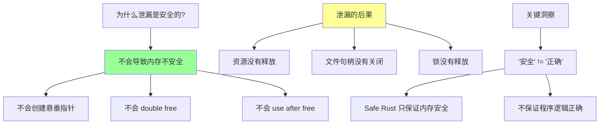

```rust
use std::mem;

// 证明泄漏不会导致 UB
fn leak_is_safe() {
    let s = String::from("hello");
    let ptr = s.as_ptr();

    mem::forget(s);

    // 虽然 s 泄漏了，但:
    // 1. ptr 仍然指向有效内存（只是没人释放它）
    // 2. 没有悬垂指针（内存还在）
    // 3. 没有 double free（drop 只调用 0 次，不是 2 次）

    // 但是！访问 ptr 仍然是 unsafe 的
    // 因为我们需要确保没有别名违规
}

// 与此对比：use after free（真正的 UB）
fn use_after_free_would_be_ub() {
    // let s = String::from("hello");
    // drop(s);  // s 的内存被释放
    // println!("{}", s);  // 编译错误：使用已移动的值

    // 如果我们能绕过检查（unsafe），这会是 UB
}
```

### Rc 循环引用详解

```rust
use std::rc::Rc;
use std::cell::RefCell;

// 经典的循环引用问题
struct Person {
    name: String,
    // 一个人可以有朋友（循环引用可能）
    friends: RefCell<Vec<Rc<Person>>>,
}

impl Person {
    fn new(name: &str) -> Rc<Self> {
        Rc::new(Self {
            name: name.to_string(),
            friends: RefCell::new(Vec::new()),
        })
    }

    fn add_friend(&self, friend: Rc<Person>) {
        self.friends.borrow_mut().push(friend);
    }
}

impl Drop for Person {
    fn drop(&mut self) {
        println!("{} is being dropped", self.name);
    }
}

fn rc_cycle_demo() {
    let alice = Person::new("Alice");
    let bob = Person::new("Bob");

    println!("Initial: Alice rc={}, Bob rc={}",
        Rc::strong_count(&alice), Rc::strong_count(&bob));

    // 创建循环引用
    alice.add_friend(bob.clone());
    bob.add_friend(alice.clone());

    println!("After cycle: Alice rc={}, Bob rc={}",
        Rc::strong_count(&alice), Rc::strong_count(&bob));

    // alice: 2 (alice 变量 + bob.friends)
    // bob: 2 (bob 变量 + alice.friends)

}  // alice 和 bob 变量被销毁
   // alice rc: 2 -> 1 (bob.friends 仍然引用)
   // bob rc: 2 -> 1 (alice.friends 仍然引用)
   // 两者都不会变成 0，永远不会 drop!
   // "Alice is being dropped" 和 "Bob is being dropped" 永远不会打印!
```

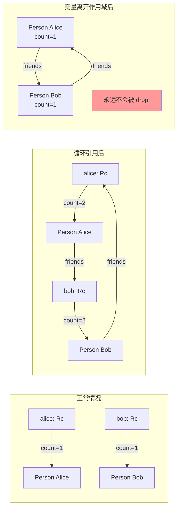

### 使用 Weak 打破循环

```rust
use std::rc::{Rc, Weak};
use std::cell::RefCell;

struct Node {
    value: i32,
    parent: RefCell<Weak<Node>>,      // 使用 Weak 避免循环
    children: RefCell<Vec<Rc<Node>>>,
}

impl Node {
    fn new(value: i32) -> Rc<Self> {
        Rc::new(Self {
            value,
            parent: RefCell::new(Weak::new()),
            children: RefCell::new(Vec::new()),
        })
    }

    fn add_child(parent: &Rc<Node>, child: Rc<Node>) {
        // 子节点的 parent 指向父节点（弱引用）
        *child.parent.borrow_mut() = Rc::downgrade(parent);
        // 父节点的 children 持有子节点（强引用）
        parent.children.borrow_mut().push(child);
    }
}

impl Drop for Node {
    fn drop(&mut self) {
        println!("Dropping node {}", self.value);
    }
}

fn weak_demo() {
    let root = Node::new(1);
    let child1 = Node::new(2);
    let child2 = Node::new(3);

    Node::add_child(&root, child1);
    Node::add_child(&root, child2);

    println!("root strong={}, weak={}",
        Rc::strong_count(&root),
        Rc::weak_count(&root));

    // root: strong=1, weak=2 (两个子节点的 parent)

}  // 所有节点都会被正确 drop!
   // 输出:
   // Dropping node 1
   // Dropping node 2
   // Dropping node 3
```

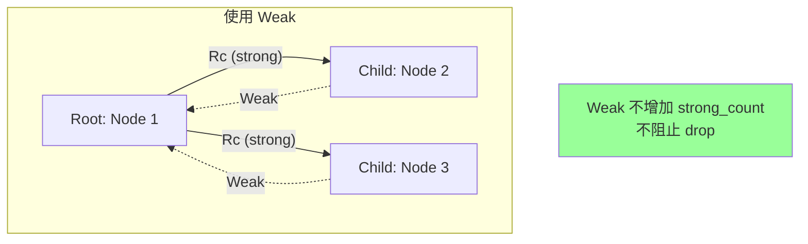

### 泄漏扩大技术

```rust
// 问题：drain 迭代器如果被泄漏会怎样？
fn drain_problem() {
    let mut v = vec![
        String::from("a"),
        String::from("b"),
        String::from("c"),
    ];

    // drain 返回一个迭代器
    // 迭代器持有对 Vec 的可变引用
    let drain = v.drain(..);

    // 如果我们 forget 这个迭代器...
    std::mem::forget(drain);

    // Vec 现在处于什么状态？
    // - 元素可能被部分移出
    // - len 可能不正确
    // 这是一个不一致的状态！
}

// 标准库的解决方案：泄漏扩大
// 在 drain 的实现中，立即将 len 设为 0
// 然后在 Drop 中恢复或完成操作

struct SafeDrain<'a, T> {
    vec: &'a mut Vec<T>,
    iter: std::vec::IntoIter<T>,
    original_len: usize,
}

impl<'a, T> SafeDrain<'a, T> {
    fn new(vec: &'a mut Vec<T>) -> Self {
        let original_len = vec.len();

        // 关键：立即清空 Vec
        // 即使 SafeDrain 被泄漏，Vec 仍然处于一致状态
        let taken = std::mem::take(vec);

        Self {
            vec,
            iter: taken.into_iter(),
            original_len,
        }
    }
}

impl<T> Iterator for SafeDrain<'_, T> {
    type Item = T;

    fn next(&mut self) -> Option<Self::Item> {
        self.iter.next()
    }
}

impl<T> Drop for SafeDrain<'_, T> {
    fn drop(&mut self) {
        // 消耗剩余元素
        for _ in &mut self.iter {}
        // Vec 已经是空的，这是安全的
    }
}
```

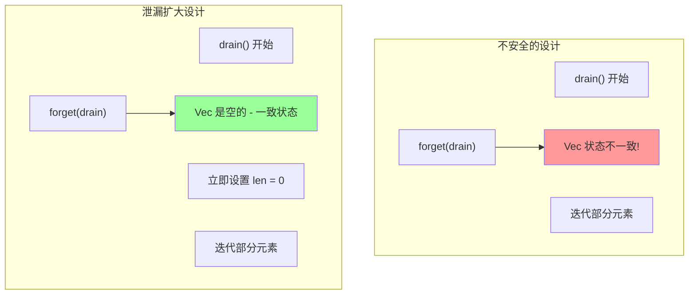

## 6.4 ManuallyDrop 深度解析

### ManuallyDrop 的本质

```rust
use std::mem::ManuallyDrop;

// ManuallyDrop 是一个 union，内部只有一个字段
// #[repr(transparent)]
// pub union ManuallyDrop<T> {
//     value: T,
// }

fn manually_drop_basics() {
    // 创建 ManuallyDrop
    let mut md = ManuallyDrop::new(String::from("hello"));

    // 使用内部值（通过 Deref）
    println!("Length: {}", md.len());
    md.push_str(" world");
    println!("Content: {}", &*md);

    // 三种处理方式

    // 方式 1: 手动 drop（unsafe）
    // unsafe { ManuallyDrop::drop(&mut md); }

    // 方式 2: 取出内部值
    let s = ManuallyDrop::into_inner(md);
    println!("Taken: {}", s);
    // s 现在会正常 drop

    // 方式 3: 什么都不做（泄漏）
    let md2 = ManuallyDrop::new(String::from("leaked"));
    // md2 在作用域结束时不会 drop 内部的 String
}
```

### ManuallyDrop 的安全 API

```rust
use std::mem::ManuallyDrop;

fn safe_api_demo() {
    let mut md = ManuallyDrop::new(vec![1, 2, 3]);

    // Deref 和 DerefMut 是安全的
    println!("First: {}", md[0]);
    md[0] = 10;
    println!("Modified first: {}", md[0]);

    // into_inner 是安全的（消耗 ManuallyDrop）
    let v = ManuallyDrop::into_inner(md);
    // md 不能再使用了

    // 但是 drop 是 unsafe 的！
    let mut md2 = ManuallyDrop::new(vec![4, 5, 6]);

    // 为什么 unsafe？
    // 1. 可能会 double drop
    // 2. drop 后继续使用是 UB

    unsafe {
        ManuallyDrop::drop(&mut md2);
    }

    // 警告：md2 现在包含已 drop 的值
    // 任何访问都是 UB
    // let _ = md2[0];  // UB!
}
```

### ManuallyDrop vs mem::forget

```rust
use std::mem::{self, ManuallyDrop};

fn comparison() {
    // mem::forget: 立即消耗所有权
    let s1 = String::from("forgotten");
    mem::forget(s1);
    // s1 不存在了，无法再访问

    // ManuallyDrop: 包装但保留访问
    let md = ManuallyDrop::new(String::from("wrapped"));
    println!("Can still use: {}", &*md);  // 仍然可以访问！
    // 但 drop 不会自动调用
}

// 使用场景对比
fn use_cases() {
    // mem::forget 适合：
    // - 完全放弃值的所有权
    // - 把值传给外部系统（如 FFI）
    // - 不需要再访问值

    // ManuallyDrop 适合：
    // - 需要继续使用值但控制 drop 时机
    // - union 中的非 Copy 类型
    // - 实现自定义的 drop 逻辑
}
```

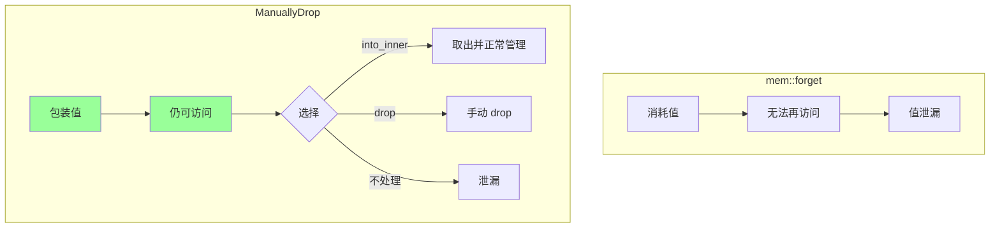

### Union 中的 ManuallyDrop

```rust
use std::mem::ManuallyDrop;

// union 的字段必须是 Copy 或 ManuallyDrop
union StringOrInt {
    string: ManuallyDrop<String>,
    int: i32,
}

// 因为 union 不知道哪个字段是活跃的
// 所以不能自动 drop

struct TaggedUnion {
    tag: Tag,
    data: StringOrInt,
}

enum Tag {
    String,
    Int,
}

impl TaggedUnion {
    fn new_string(s: String) -> Self {
        Self {
            tag: Tag::String,
            data: StringOrInt {
                string: ManuallyDrop::new(s),
            },
        }
    }

    fn new_int(i: i32) -> Self {
        Self {
            tag: Tag::Int,
            data: StringOrInt { int: i },
        }
    }

    fn get_string(&self) -> Option<&str> {
        match self.tag {
            Tag::String => {
                // 安全：我们知道 string 是活跃字段
                Some(unsafe { &*self.data.string })
            }
            Tag::Int => None,
        }
    }
}

impl Drop for TaggedUnion {
    fn drop(&mut self) {
        match self.tag {
            Tag::String => {
                // 必须手动 drop string
                unsafe {
                    ManuallyDrop::drop(&mut self.data.string);
                }
            }
            Tag::Int => {
                // int 是 Copy，不需要 drop
            }
        }
    }
}
```

## 6.5 高级 OBRM 模式

### 作用域守卫 (Scope Guard)

```rust
struct ScopeGuard<F: FnOnce()> {
    callback: Option<F>,
}

impl<F: FnOnce()> ScopeGuard<F> {
    fn new(callback: F) -> Self {
        Self {
            callback: Some(callback),
        }
    }

    // 取消守卫（不执行回调）
    fn dismiss(mut self) {
        self.callback = None;
        // self 在这里被 drop，但 callback 是 None
    }
}

impl<F: FnOnce()> Drop for ScopeGuard<F> {
    fn drop(&mut self) {
        if let Some(callback) = self.callback.take() {
            callback();
        }
    }
}

// 方便的宏
macro_rules! defer {
    ($($body:tt)*) => {
        let _guard = ScopeGuard::new(|| { $($body)* });
    };
}

fn scope_guard_demo() {
    println!("开始");

    defer! {
        println!("这会在作用域结束时执行");
    }

    println!("中间");

    // 条件执行
    let should_cleanup = true;
    let guard = ScopeGuard::new(|| {
        println!("条件清理");
    });

    if !should_cleanup {
        guard.dismiss();
    }

    println!("结束");
}
// 输出:
// 开始
// 中间
// 结束
// 条件清理
// 这会在作用域结束时执行
```

### 延迟初始化

```rust
use std::cell::OnceCell;
use std::sync::OnceLock;

// 单线程延迟初始化
struct LazyConfig {
    config: OnceCell<Config>,
}

struct Config {
    value: String,
}

impl LazyConfig {
    const fn new() -> Self {
        Self {
            config: OnceCell::new(),
        }
    }

    fn get(&self) -> &Config {
        self.config.get_or_init(|| {
            println!("Initializing config (只发生一次)");
            Config {
                value: String::from("loaded"),
            }
        })
    }
}

static LAZY: LazyConfig = LazyConfig::new();

// 多线程延迟初始化
static THREAD_SAFE: OnceLock<String> = OnceLock::new();

fn lazy_init_demo() {
    // 第一次调用初始化
    println!("Value: {}", LAZY.get().value);
    // 第二次调用直接返回
    println!("Value: {}", LAZY.get().value);

    // 多线程安全版本
    let value = THREAD_SAFE.get_or_init(|| {
        String::from("thread safe")
    });
    println!("Thread safe: {}", value);
}
```

### 两阶段初始化

```rust
use std::mem::MaybeUninit;

// 某些类型需要两阶段初始化
struct TwoPhaseInit {
    // 阶段 1: 基础初始化
    id: u32,
    // 阶段 2: 依赖其他字段的初始化
    name: String,
    derived: Option<DerivedData>,
}

struct DerivedData {
    full_name: String,
}

impl TwoPhaseInit {
    fn new(id: u32, name: String) -> Self {
        let mut this = Self {
            id,
            name,
            derived: None,
        };
        // 阶段 2
        this.complete_init();
        this
    }

    fn complete_init(&mut self) {
        self.derived = Some(DerivedData {
            full_name: format!("{}:{}", self.id, self.name),
        });
    }
}

// 使用 MaybeUninit 实现更高效的两阶段初始化
struct EfficientTwoPhase {
    data: [u8; 1024],
    checksum: u32,
}

impl EfficientTwoPhase {
    fn new() -> Self {
        // 阶段 1: 分配但不初始化
        let mut uninit: MaybeUninit<Self> = MaybeUninit::uninit();

        unsafe {
            let ptr = uninit.as_mut_ptr();

            // 阶段 2: 逐步初始化
            // 先初始化 data
            (*ptr).data = [0; 1024];

            // 基于 data 计算 checksum
            let checksum = calculate_checksum(&(*ptr).data);
            (*ptr).checksum = checksum;

            uninit.assume_init()
        }
    }
}

fn calculate_checksum(data: &[u8]) -> u32 {
    data.iter().map(|&b| b as u32).sum()
}
```

## 6.6 Drop 与异常安全

### panic 时的 Drop

```rust
struct PanicDrop {
    name: &'static str,
}

impl Drop for PanicDrop {
    fn drop(&mut self) {
        println!("Dropping: {}", self.name);
    }
}

fn panic_and_drop() {
    let a = PanicDrop { name: "a" };
    let b = PanicDrop { name: "b" };

    // 即使 panic，析构函数仍然会被调用
    panic!("oops");

    // 输出（在 panic 之前）:
    // Dropping: b
    // Dropping: a
}

// Drop 中的 panic
impl Drop for DoublePanic {
    fn drop(&mut self) {
        if std::thread::panicking() {
            // 如果已经在 panic，不要再 panic
            // 否则会 abort
            eprintln!("Already panicking, skip cleanup");
            return;
        }
        // 正常清理
        panic!("drop panic");  // 这会导致 abort!
    }
}

struct DoublePanic;

fn double_panic_demo() {
    let _ = std::panic::catch_unwind(|| {
        let _dp = DoublePanic;
        panic!("first panic");
        // DoublePanic::drop 中如果再 panic，程序 abort
    });
}
```

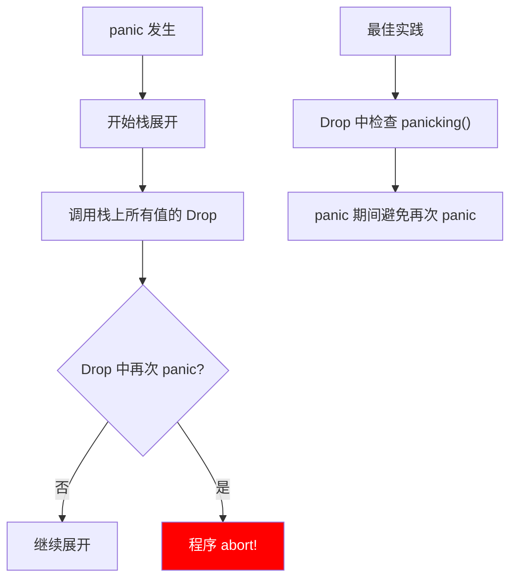

### 异常安全等级

```rust
// 基本保证：panic 后不会有 UB，但可能状态不一致
fn basic_guarantee(v: &mut Vec<String>) {
    v.push(String::from("new"));
    // 如果 push 时发生 panic（比如分配失败）
    // Vec 仍然是有效状态，但可能没有完成预期操作
}

// 强保证：panic 后状态回滚到调用前
fn strong_guarantee(v: &mut Vec<String>, new_items: Vec<String>) {
    // 先准备新数据
    let mut temp = v.clone();
    for item in new_items {
        temp.push(item);  // 如果这里 panic，v 不变
    }

    // 所有操作成功后才替换
    *v = temp;
}

// 无 panic 保证：永远不会 panic
fn nothrow_guarantee(x: i32, y: i32) -> i32 {
    // 基础运算不会 panic
    x.wrapping_add(y)
}
```

## 6.7 实际应用案例

### 文件操作 RAII

```rust
use std::fs::File;
use std::io::{self, BufWriter, Write};

struct TransactionalFile {
    writer: BufWriter<File>,
    path: String,
    temp_path: String,
    committed: bool,
}

impl TransactionalFile {
    fn new(path: &str) -> io::Result<Self> {
        let temp_path = format!("{}.tmp", path);
        let file = File::create(&temp_path)?;

        Ok(Self {
            writer: BufWriter::new(file),
            path: path.to_string(),
            temp_path,
            committed: false,
        })
    }

    fn write(&mut self, data: &[u8]) -> io::Result<()> {
        self.writer.write_all(data)
    }

    fn commit(mut self) -> io::Result<()> {
        self.writer.flush()?;
        std::fs::rename(&self.temp_path, &self.path)?;
        self.committed = true;
        Ok(())
    }
}

impl Drop for TransactionalFile {
    fn drop(&mut self) {
        if !self.committed {
            // 如果没有 commit，删除临时文件
            let _ = std::fs::remove_file(&self.temp_path);
        }
    }
}

fn transactional_file_demo() -> io::Result<()> {
    let mut file = TransactionalFile::new("data.txt")?;

    file.write(b"Hello, ")?;
    file.write(b"World!")?;

    // 只有 commit 成功才会保存文件
    file.commit()?;

    // 如果中途 panic 或返回 Err，临时文件会被删除
    Ok(())
}
```

### 数据库事务 RAII

```rust
struct Transaction<'a> {
    conn: &'a mut Connection,
    committed: bool,
}

struct Connection {
    // 数据库连接
}

impl Connection {
    fn begin_transaction(&mut self) -> Transaction<'_> {
        // 发送 BEGIN 命令
        println!("BEGIN TRANSACTION");
        Transaction {
            conn: self,
            committed: false,
        }
    }
}

impl<'a> Transaction<'a> {
    fn execute(&mut self, sql: &str) -> Result<(), DbError> {
        println!("EXECUTE: {}", sql);
        Ok(())
    }

    fn commit(mut self) -> Result<(), DbError> {
        println!("COMMIT");
        self.committed = true;
        Ok(())
    }
}

impl Drop for Transaction<'_> {
    fn drop(&mut self) {
        if !self.committed {
            println!("ROLLBACK");
            // 发送 ROLLBACK 命令
        }
    }
}

struct DbError;

fn transaction_demo() -> Result<(), DbError> {
    let mut conn = Connection {};
    let mut tx = conn.begin_transaction();

    tx.execute("INSERT INTO users VALUES (1, 'Alice')")?;
    tx.execute("INSERT INTO orders VALUES (1, 1, 100)")?;

    // 如果任何操作失败或 panic，自动 rollback
    tx.commit()
}
```

### 锁守卫扩展

```rust
use std::sync::{Mutex, MutexGuard};
use std::ops::{Deref, DerefMut};

// 带超时的锁守卫
struct TimedMutexGuard<'a, T> {
    guard: MutexGuard<'a, T>,
    acquired_at: std::time::Instant,
    name: &'static str,
}

impl<'a, T> TimedMutexGuard<'a, T> {
    fn new(guard: MutexGuard<'a, T>, name: &'static str) -> Self {
        Self {
            guard,
            acquired_at: std::time::Instant::now(),
            name,
        }
    }
}

impl<T> Deref for TimedMutexGuard<'_, T> {
    type Target = T;

    fn deref(&self) -> &T {
        &self.guard
    }
}

impl<T> DerefMut for TimedMutexGuard<'_, T> {
    fn deref_mut(&mut self) -> &mut T {
        &mut self.guard
    }
}

impl<T> Drop for TimedMutexGuard<'_, T> {
    fn drop(&mut self) {
        let held_for = self.acquired_at.elapsed();
        if held_for.as_millis() > 100 {
            eprintln!(
                "WARNING: Lock '{}' held for {:?}",
                self.name, held_for
            );
        }
    }
}

fn timed_lock_demo() {
    let mutex = Mutex::new(42);

    {
        let guard = TimedMutexGuard::new(
            mutex.lock().unwrap(),
            "my_lock"
        );
        // 使用数据...
        std::thread::sleep(std::time::Duration::from_millis(150));
    }  // 如果持有超过 100ms，会打印警告
}
```

## 6.8 总结

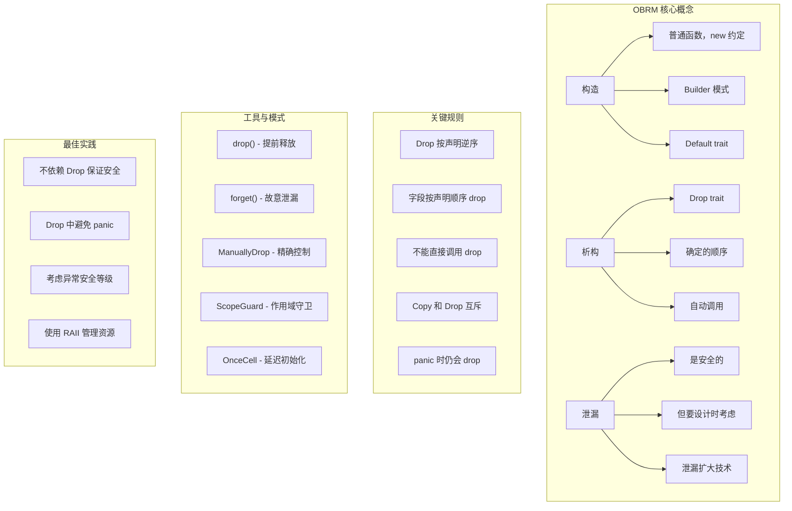

### 核心要点

1. **构造是普通函数**：没有特殊语法，`new` 只是约定，Builder 模式是复杂构造的最佳实践
2. **Drop 是自动且确定的**：作用域结束时按确定顺序调用
3. **泄漏是安全的**：但不要设计依赖 Drop 的安全性，使用泄漏扩大技术
4. **ManuallyDrop 提供精确控制**：当需要控制析构时机时使用
5. **Drop 与 panic**：panic 时仍会 drop，但 Drop 中不要 panic
6. **异常安全**：考虑基本保证、强保证、无 panic 保证

### 检查清单

使用 OBRM 模式时，确保：

- [ ] 资源在构造时获取
- [ ] 资源在析构时释放
- [ ] 不依赖 Drop 来保证内存安全
- [ ] 考虑泄漏情况（mem::forget、Rc 循环）
- [ ] Drop 中检查 `std::thread::panicking()`
- [ ] 需要精确控制时使用 ManuallyDrop
- [ ] 复杂构造使用 Builder 模式
- [ ] 考虑异常安全等级

---

下一章：[栈展开](./07-unwinding.md)
