# 第七章：栈展开与异常安全 (Unwinding and Exception Safety) 深度解析（扩展版）

## 概述

Rust 的错误处理采用分层方案，而 panic 和栈展开是其中重要的一环。理解栈展开对于编写正确的 unsafe 代码至关重要，因为 panic 可以在几乎任何地方发生，你的数据结构必须在 panic 后仍然保持有效状态。

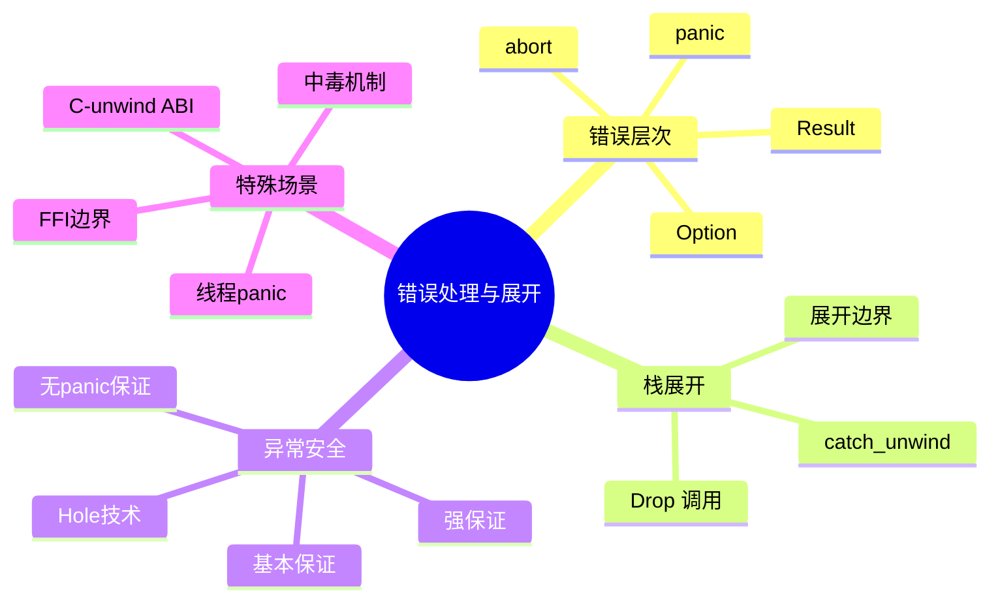

## 7.1 Rust 的错误处理层次详解

### 错误类型选择

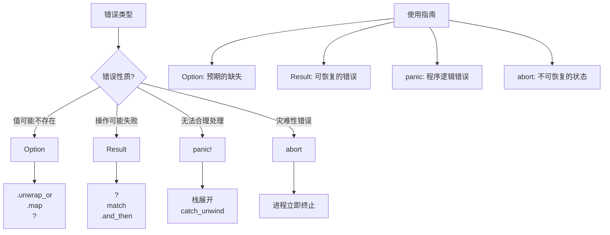

### 何时使用 panic

```rust
// 1. 断言失败（程序逻辑错误）
fn divide(a: i32, b: i32) -> i32 {
    assert!(b != 0, "Division by zero!");
    a / b
}

// 2. 不可达代码
fn process_value(value: i32) -> &'static str {
    match value {
        0 => "zero",
        1 => "one",
        _ => unreachable!("Unexpected value: {}", value),
    }
}

// 3. 未实现的功能
fn advanced_feature() {
    todo!("This feature is not yet implemented");
}

// 4. 索引越界（标准库）
fn get_element(arr: &[i32], index: usize) -> i32 {
    arr[index]  // 如果越界会 panic
}

// 5. unwrap 失败
fn must_have_value(opt: Option<i32>) -> i32 {
    opt.unwrap()  // None 时 panic
}
```

### 错误处理对比

```rust
use std::fs::File;
use std::io::{self, Read};

// Option: 值可能不存在
fn find_user(id: u32) -> Option<User> {
    // 找不到用户是正常情况
    users.get(&id).cloned()
}

// Result: 操作可能失败
fn read_config(path: &str) -> Result<String, io::Error> {
    let mut file = File::open(path)?;
    let mut contents = String::new();
    file.read_to_string(&mut contents)?;
    Ok(contents)
}

// panic: 程序逻辑错误
fn calculate_average(numbers: &[f64]) -> f64 {
    if numbers.is_empty() {
        // 空数组取平均值是程序错误
        panic!("Cannot calculate average of empty slice");
    }
    numbers.iter().sum::<f64>() / numbers.len() as f64
}

// abort: 灾难性错误
fn critical_failure() {
    // 某些情况下必须立即终止
    eprintln!("Critical error: cannot continue");
    std::process::abort();
}

struct User;
static users: std::collections::HashMap<u32, User> = std::collections::HashMap::new();
```

## 7.2 Panic 与栈展开详解

### panic 的行为流程

```rust
fn inner() {
    println!("Inner: about to panic");
    panic!("Something went wrong!");
}

fn middle() {
    let _guard = DropGuard("middle");
    inner();
    println!("Middle: after inner (never reached)");
}

fn outer() {
    let _guard = DropGuard("outer");
    middle();
    println!("Outer: after middle (never reached)");
}

struct DropGuard(&'static str);

impl Drop for DropGuard {
    fn drop(&mut self) {
        println!("DropGuard {} dropped", self.0);
    }
}

fn main() {
    outer();
}

// 输出:
// Inner: about to panic
// thread 'main' panicked at 'Something went wrong!'
// DropGuard middle dropped
// DropGuard outer dropped
```

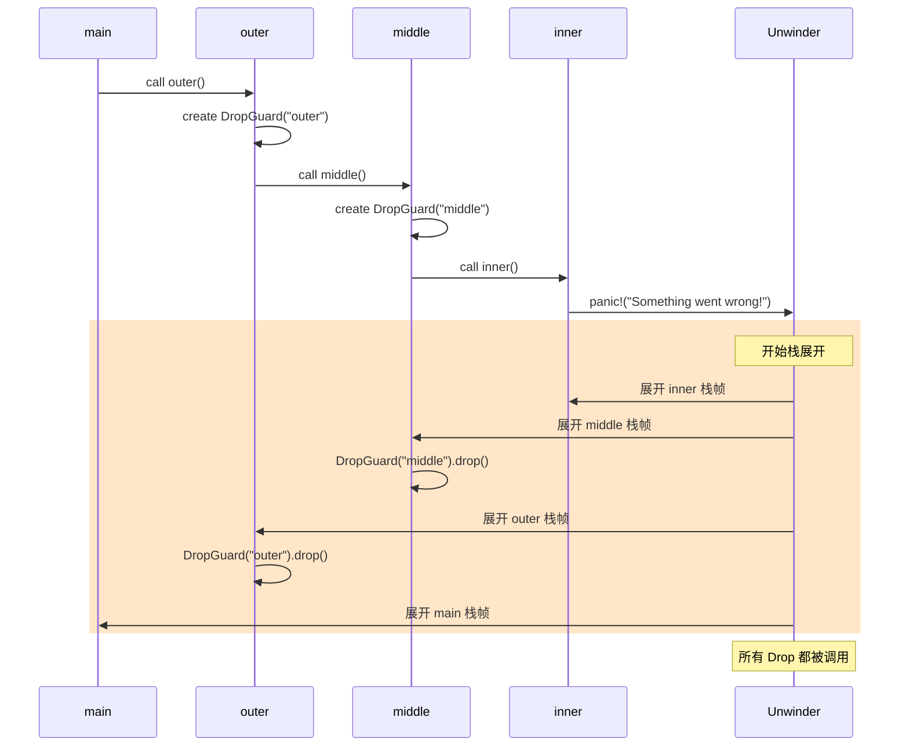

### panic=abort vs panic=unwind

```rust
// Cargo.toml 配置
// [profile.release]
// panic = "abort"  # 或 "unwind"

fn demonstrate_panic_modes() {
    // panic=unwind (默认):
    // - panic 时进行栈展开
    // - 调用所有值的 Drop
    // - 可以被 catch_unwind 捕获
    // - 二进制文件较大（包含展开表）

    // panic=abort:
    // - panic 时立即 abort
    // - 不调用 Drop
    // - 无法捕获
    // - 二进制文件较小
}
```

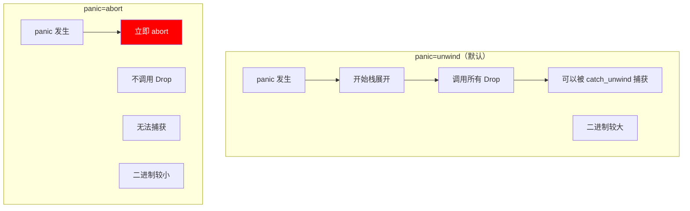

### catch_unwind 详解

```rust
use std::panic::{self, catch_unwind, AssertUnwindSafe};

fn basic_catch() {
    let result = catch_unwind(|| {
        println!("About to panic!");
        panic!("Oh no!");
    });

    match result {
        Ok(value) => println!("Returned: {:?}", value),
        Err(payload) => {
            // 尝试获取 panic 消息
            if let Some(s) = payload.downcast_ref::<&str>() {
                println!("Panic message: {}", s);
            } else if let Some(s) = payload.downcast_ref::<String>() {
                println!("Panic message: {}", s);
            } else {
                println!("Caught unknown panic");
            }
        }
    }

    println!("Continuing after panic...");
}

// 注意：catch_unwind 的闭包必须是 UnwindSafe
fn unwind_safety_example() {
    let mut data = vec![1, 2, 3];

    // 这不会编译！&mut Vec 不是 UnwindSafe
    // let result = catch_unwind(|| {
    //     data.push(4);
    //     panic!("oops");
    // });

    // 使用 AssertUnwindSafe 包装（你在声明：我知道这样做的风险）
    let result = catch_unwind(AssertUnwindSafe(|| {
        data.push(4);
        panic!("oops");
    }));

    // 注意：data 可能处于不一致状态！
    println!("Data after panic: {:?}", data);  // [1, 2, 3, 4]
}
```

### UnwindSafe trait

```rust
use std::panic::{UnwindSafe, RefUnwindSafe, AssertUnwindSafe};
use std::cell::RefCell;
use std::sync::{Mutex, Arc};

// UnwindSafe: 如果 panic 后访问类型是安全的
// RefUnwindSafe: 如果 panic 后通过引用访问是安全的

fn unwind_safe_types() {
    // 这些类型是 UnwindSafe:
    let _: Box<dyn UnwindSafe> = Box::new(42i32);
    let _: Box<dyn UnwindSafe> = Box::new(String::from("hello"));
    let _: Box<dyn UnwindSafe> = Box::new(Vec::<i32>::new());

    // 这些类型不是 UnwindSafe:
    // &mut T - 可变引用
    // &RefCell<T> - 内部可变性
    // &Mutex<T> 是 UnwindSafe（因为有中毒机制）

    // 原因：panic 可能在修改中途发生，留下不一致状态
}

// 为自定义类型实现 UnwindSafe
struct MyType {
    data: Vec<i32>,
}

// 如果你确定类型在 panic 后是安全的
impl UnwindSafe for MyType {}
impl RefUnwindSafe for MyType {}

// 或者使用 AssertUnwindSafe 包装
fn use_assert_unwind_safe() {
    let data = RefCell::new(vec![1, 2, 3]);

    let result = std::panic::catch_unwind(AssertUnwindSafe(|| {
        let mut borrow = data.borrow_mut();
        borrow.push(4);
        // panic 可能在这里发生
    }));
}
```

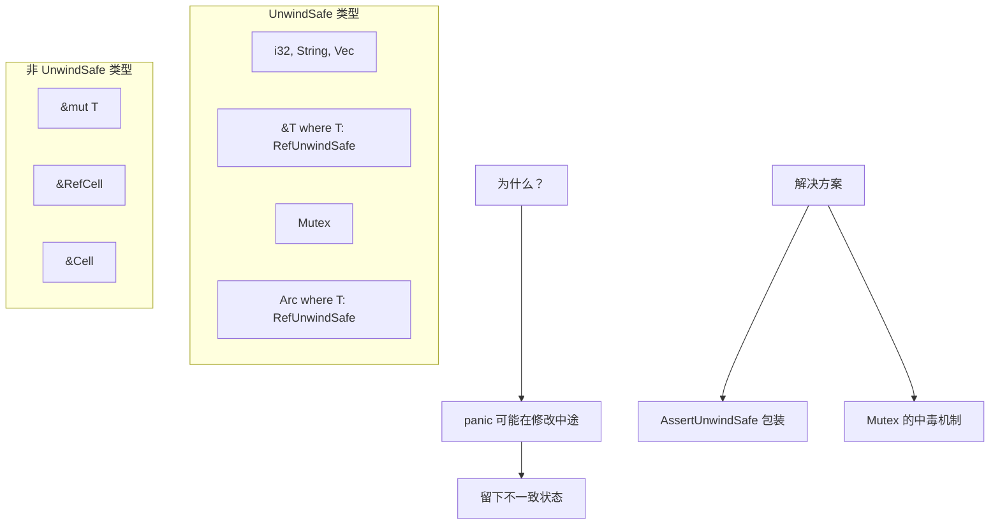

### resume_unwind

```rust
use std::panic::{catch_unwind, resume_unwind, AssertUnwindSafe};

fn catch_and_rethrow() {
    let result = catch_unwind(|| {
        panic!("Original panic");
    });

    if let Err(payload) = result {
        println!("Caught panic, doing cleanup...");

        // 清理工作...

        // 重新传播 panic
        resume_unwind(payload);
    }
}

// 实际用例：在 FFI 边界保存 panic
static mut LAST_PANIC: Option<Box<dyn std::any::Any + Send>> = None;

#[no_mangle]
pub extern "C" fn safe_callback() -> i32 {
    let result = catch_unwind(AssertUnwindSafe(|| {
        might_panic();
        0
    }));

    match result {
        Ok(val) => val,
        Err(payload) => {
            // 保存 panic 以便稍后重新抛出
            unsafe { LAST_PANIC = Some(payload); }
            -1  // 返回错误码
        }
    }
}

#[no_mangle]
pub extern "C" fn check_and_rethrow() {
    unsafe {
        if let Some(payload) = LAST_PANIC.take() {
            resume_unwind(payload);
        }
    }
}

fn might_panic() {}
```

## 7.3 异常安全 (Exception Safety) 深度解析

### 异常安全等级

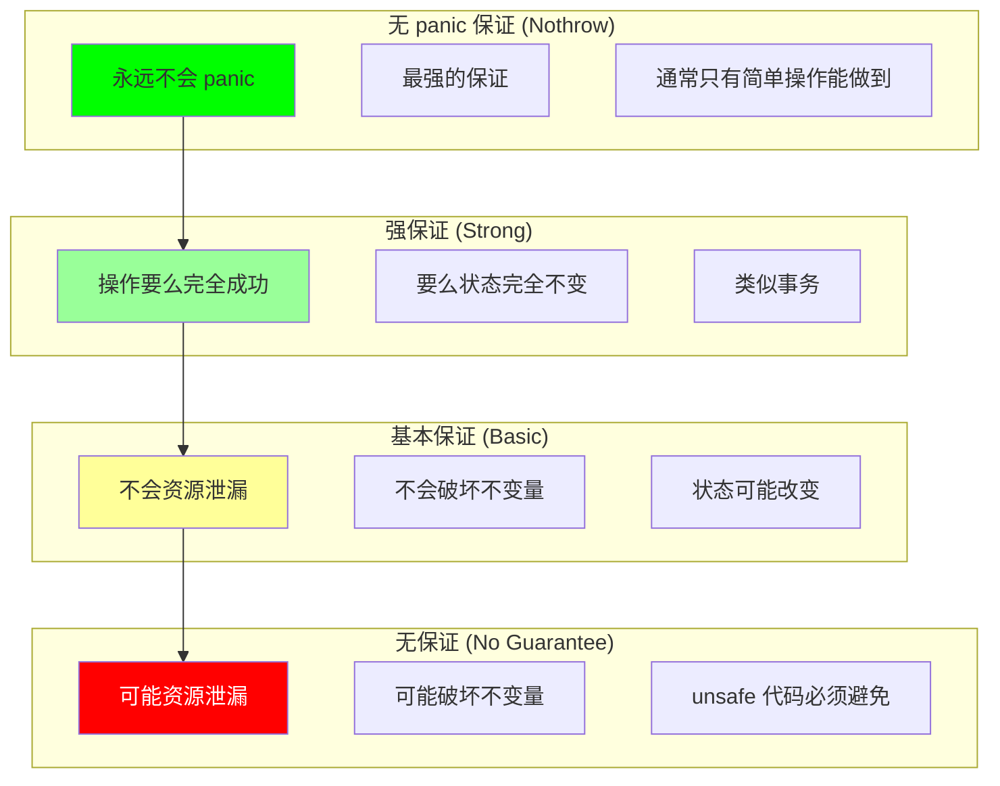

### 基本保证示例

```rust
// 基本保证：panic 后不会资源泄漏，不会破坏不变量
// 但操作可能部分完成

struct BasicGuaranteeVec<T> {
    data: Vec<T>,
}

impl<T: Clone> BasicGuaranteeVec<T> {
    // 这个方法提供基本保证
    fn extend_from_slice(&mut self, slice: &[T]) {
        self.data.reserve(slice.len());
        for item in slice {
            // clone 可能 panic
            self.data.push(item.clone());
        }
        // 如果 panic：
        // - 部分元素被添加
        // - Vec 仍然有效（不变量保持）
        // - 没有内存泄漏
    }
}

// 测试
fn test_basic_guarantee() {
    use std::panic::catch_unwind;

    struct PanicOnThirdClone {
        id: i32,
        clone_count: std::cell::Cell<i32>,
    }

    impl Clone for PanicOnThirdClone {
        fn clone(&self) -> Self {
            let count = self.clone_count.get() + 1;
            self.clone_count.set(count);
            if count >= 3 {
                panic!("Third clone!");
            }
            Self {
                id: self.id,
                clone_count: std::cell::Cell::new(0),
            }
        }
    }

    let source: Vec<PanicOnThirdClone> = (0..5)
        .map(|i| PanicOnThirdClone {
            id: i,
            clone_count: std::cell::Cell::new(0),
        })
        .collect();

    let mut vec = BasicGuaranteeVec { data: Vec::new() };

    let _ = catch_unwind(std::panic::AssertUnwindSafe(|| {
        vec.extend_from_slice(&source);
    }));

    // panic 后，vec.data 包含部分元素，但仍然有效
    println!("Elements added before panic: {}", vec.data.len());
}
```

### 强保证示例

```rust
// 强保证：操作要么完全成功，要么状态完全不变

struct StrongGuaranteeVec<T> {
    data: Vec<T>,
}

impl<T: Clone> StrongGuaranteeVec<T> {
    // 提供强保证的方法
    fn extend_from_slice(&mut self, slice: &[T]) {
        // 先在临时 Vec 中构建
        let mut temp = Vec::with_capacity(slice.len());
        for item in slice {
            temp.push(item.clone());  // panic 时 temp 被 drop，self 不变
        }

        // 所有 clone 成功后才修改 self
        self.data.append(&mut temp);
    }

    // 另一种实现：使用 clone 整个 Vec
    fn extend_from_slice_v2(&mut self, slice: &[T]) {
        // 克隆当前状态
        let mut new_data = self.data.clone();

        // 在克隆上操作
        for item in slice {
            new_data.push(item.clone());
        }

        // 成功后替换（这是无 panic 操作）
        self.data = new_data;
    }
}

// 使用 swap 实现强保证
fn strong_guarantee_swap<T: Clone>(vec: &mut Vec<T>, new_items: &[T]) {
    // 构建新的完整 Vec
    let mut new_vec = vec.clone();
    for item in new_items {
        new_vec.push(item.clone());
    }

    // 原子性替换（不会 panic）
    std::mem::swap(vec, &mut new_vec);
}
```

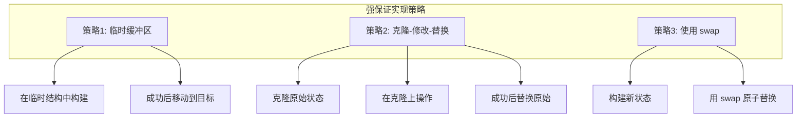

### 无 panic 保证

```rust
// 无 panic 保证的操作

fn nothrow_operations() {
    // 1. 基本算术（wrapping 版本）
    let a: u32 = 100;
    let b = a.wrapping_add(200);  // 不会 panic
    let c = a.wrapping_mul(1000);  // 不会 panic

    // 2. 内存操作
    let mut v = vec![1, 2, 3];
    v.clear();  // 不会 panic
    v.truncate(0);  // 不会 panic

    // 3. Option/Result 的 take
    let mut opt = Some(42);
    let taken = opt.take();  // 不会 panic

    // 4. swap 操作
    let mut x = 1;
    let mut y = 2;
    std::mem::swap(&mut x, &mut y);  // 不会 panic

    // 5. ptr 操作（在安全使用时）
    let ptr = &x as *const i32;
    let _addr = ptr as usize;  // 不会 panic
}

// 使用无 panic 操作实现异常安全
struct SafeContainer<T> {
    data: Option<T>,
}

impl<T> SafeContainer<T> {
    fn new(value: T) -> Self {
        Self { data: Some(value) }
    }

    // 无 panic 保证
    fn take(&mut self) -> Option<T> {
        self.data.take()  // 总是安全的
    }

    // 无 panic 保证
    fn replace(&mut self, value: T) -> Option<T> {
        std::mem::replace(&mut self.data, Some(value))
    }
}
```

### Hole 技术详解

```rust
use std::ptr;
use std::mem::ManuallyDrop;

// Hole 技术：用于在可能 panic 的操作中保持数据结构一致性
struct Hole<'a, T: 'a> {
    data: &'a mut [T],
    // 使用 ManuallyDrop 避免双重释放
    elt: ManuallyDrop<T>,
    pos: usize,
}

impl<'a, T> Hole<'a, T> {
    // 创建 Hole：从指定位置"取出"元素
    unsafe fn new(data: &'a mut [T], pos: usize) -> Self {
        debug_assert!(pos < data.len());
        let elt = ptr::read(&data[pos]);
        Hole {
            data,
            elt: ManuallyDrop::new(elt),
            pos,
        }
    }

    // 获取取出的元素的引用
    fn element(&self) -> &T {
        &self.elt
    }

    // 获取指定位置的元素引用
    fn get(&self, index: usize) -> &T {
        debug_assert!(index != self.pos);
        debug_assert!(index < self.data.len());
        unsafe { self.data.get_unchecked(index) }
    }

    // 将指定位置的元素移动到 hole 位置
    fn move_to(&mut self, index: usize) {
        debug_assert!(index != self.pos);
        debug_assert!(index < self.data.len());
        unsafe {
            let ptr = self.data.as_mut_ptr();
            ptr::copy_nonoverlapping(ptr.add(index), ptr.add(self.pos), 1);
        }
        self.pos = index;
    }
}

impl<T> Drop for Hole<'_, T> {
    fn drop(&mut self) {
        // 无论发生什么，都把元素放回 hole 位置
        unsafe {
            let pos = self.pos;
            ptr::write(&mut self.data[pos], ManuallyDrop::take(&mut self.elt));
        }
    }
}

// 使用 Hole 实现异常安全的堆操作
fn sift_up<T: Ord>(heap: &mut [T], pos: usize) {
    unsafe {
        let mut hole = Hole::new(heap, pos);

        while hole.pos > 0 {
            let parent = (hole.pos - 1) / 2;

            // 这里的比较可能 panic！
            if hole.element() <= hole.get(parent) {
                break;
            }

            hole.move_to(parent);
        }

        // hole 在这里被 drop，元素被放回
    }
}
```

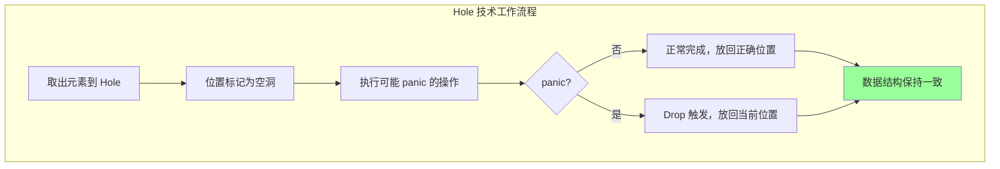

### Guard 模式

```rust
// Guard 模式：另一种异常安全技术
struct SetLenOnDrop<'a> {
    len: &'a mut usize,
    local_len: usize,
}

impl<'a> SetLenOnDrop<'a> {
    fn new(len: &'a mut usize) -> Self {
        let local_len = *len;
        // 立即设置长度为 0（防御性）
        *len = 0;
        Self { len, local_len }
    }

    fn increment(&mut self) {
        self.local_len += 1;
    }

    fn current_len(&self) -> usize {
        self.local_len
    }
}

impl Drop for SetLenOnDrop<'_> {
    fn drop(&mut self) {
        // 无论如何，设置正确的长度
        *self.len = self.local_len;
    }
}

// 使用 Guard 的 Vec 扩展
struct MyVec<T> {
    ptr: *mut T,
    len: usize,
    cap: usize,
}

impl<T: Clone> MyVec<T> {
    fn extend_from_slice(&mut self, slice: &[T]) {
        self.reserve(slice.len());

        // 使用 guard 跟踪长度
        let mut guard = SetLenOnDrop::new(&mut self.len);

        for item in slice {
            unsafe {
                let end = self.ptr.add(guard.current_len());
                ptr::write(end, item.clone());  // 可能 panic
            }
            guard.increment();
        }

        // guard 在这里 drop，设置最终长度
    }

    fn reserve(&mut self, additional: usize) {
        // 简化实现
        let new_cap = self.len + additional;
        if new_cap > self.cap {
            // 重新分配...
        }
    }
}
```

### ScopeGuard 通用实现

```rust
struct ScopeGuard<T, F: FnOnce(T)> {
    value: Option<T>,
    cleanup: Option<F>,
}

impl<T, F: FnOnce(T)> ScopeGuard<T, F> {
    fn new(value: T, cleanup: F) -> Self {
        Self {
            value: Some(value),
            cleanup: Some(cleanup),
        }
    }

    // 取消清理
    fn dismiss(mut self) -> T {
        self.cleanup = None;
        self.value.take().unwrap()
    }

    // 获取值的引用
    fn get(&self) -> &T {
        self.value.as_ref().unwrap()
    }

    // 获取值的可变引用
    fn get_mut(&mut self) -> &mut T {
        self.value.as_mut().unwrap()
    }
}

impl<T, F: FnOnce(T)> Drop for ScopeGuard<T, F> {
    fn drop(&mut self) {
        if let (Some(value), Some(cleanup)) = (self.value.take(), self.cleanup.take()) {
            cleanup(value);
        }
    }
}

// 使用示例
fn use_scope_guard() {
    let mut file_created = false;

    let guard = ScopeGuard::new("temp.txt", |path| {
        // 清理：删除临时文件
        let _ = std::fs::remove_file(path);
        println!("Cleaned up {}", path);
    });

    // 做一些可能 panic 的操作
    file_created = true;
    // std::fs::write(guard.get(), "data")?;

    if file_created {
        // 成功，不需要清理
        let _path = guard.dismiss();
        println!("File kept");
    }
    // 如果没有 dismiss，guard drop 时会清理
}
```

## 7.4 Poison - 中毒机制详解

### Mutex 中毒原理

```rust
use std::sync::{Mutex, Arc};
use std::thread;

fn mutex_poison_demo() {
    let mutex = Arc::new(Mutex::new(vec![1, 2, 3]));

    // 线程 1：修改数据然后 panic
    let mutex_clone = Arc::clone(&mutex);
    let handle = thread::spawn(move || {
        let mut guard = mutex_clone.lock().unwrap();
        guard.push(4);
        println!("Thread 1: added 4");

        // panic 发生在持有锁时
        panic!("Thread 1 panicked!");
    });

    // 等待线程 1 完成（panic）
    let _ = handle.join();

    // 线程 2：尝试获取锁
    let mutex_clone = Arc::clone(&mutex);
    let handle = thread::spawn(move || {
        match mutex_clone.lock() {
            Ok(guard) => {
                println!("Thread 2: got clean lock: {:?}", *guard);
            }
            Err(poisoned) => {
                println!("Thread 2: mutex was poisoned!");

                // 选项 1：获取数据（可能不一致）
                let guard = poisoned.into_inner();
                println!("Thread 2: recovered data: {:?}", *guard);

                // 选项 2：重新初始化
                // 选项 3：传播错误
            }
        }
    });

    handle.join().unwrap();
}
```

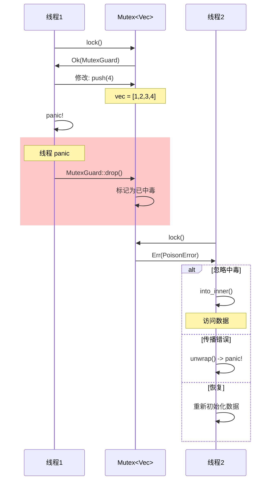

### 清除中毒状态

```rust
use std::sync::{Mutex, PoisonError};

fn clear_poison<T>(mutex: &Mutex<T>) -> bool {
    // 尝试获取锁
    match mutex.lock() {
        Ok(_guard) => {
            // 没有中毒
            true
        }
        Err(poisoned) => {
            // 中毒了，但我们决定清除它
            println!("Clearing poison...");

            // clear_poison 方法在某些版本可用
            // 或者我们可以获取数据并重新验证
            let guard = poisoned.into_inner();

            // 验证数据一致性...
            // 如果数据有效，可以继续使用

            true
        }
    }
}

// 更安全的处理方式
struct SafeMutex<T> {
    inner: Mutex<T>,
}

impl<T: Default> SafeMutex<T> {
    fn new(value: T) -> Self {
        Self {
            inner: Mutex::new(value),
        }
    }

    fn with<F, R>(&self, f: F) -> R
    where
        F: FnOnce(&mut T) -> R,
    {
        let mut guard = match self.inner.lock() {
            Ok(guard) => guard,
            Err(poisoned) => {
                // 自动恢复：使用默认值
                let mut guard = poisoned.into_inner();
                *guard = T::default();
                guard
            }
        };

        f(&mut guard)
    }
}
```

### RwLock 中毒

```rust
use std::sync::RwLock;

fn rwlock_poison_demo() {
    let lock = RwLock::new(vec![1, 2, 3]);

    // 写入时 panic 会导致中毒
    let result = std::panic::catch_unwind(std::panic::AssertUnwindSafe(|| {
        let mut guard = lock.write().unwrap();
        guard.push(4);
        panic!("Writer panicked!");
    }));

    // 之后的读取也会遇到中毒
    match lock.read() {
        Ok(guard) => println!("Read: {:?}", *guard),
        Err(poisoned) => {
            println!("RwLock was poisoned during write!");
            let guard = poisoned.into_inner();
            println!("Recovered data: {:?}", *guard);
        }
    }

    // 注意：读取时 panic 不会导致中毒
    // 因为读取不应该修改数据
}
```

### 中毒与 Condvar

```rust
use std::sync::{Mutex, Condvar, Arc};
use std::thread;
use std::time::Duration;

fn condvar_poison_demo() {
    let pair = Arc::new((Mutex::new(false), Condvar::new()));

    let pair_clone = Arc::clone(&pair);
    thread::spawn(move || {
        let (lock, cvar) = &*pair_clone;

        // 获取锁并修改
        let mut started = lock.lock().unwrap();
        *started = true;

        // 通知等待的线程
        cvar.notify_one();

        // panic!
        panic!("Thread panicked after notify!");
    });

    // 主线程等待
    let (lock, cvar) = &*pair;

    thread::sleep(Duration::from_millis(100));

    // Condvar::wait 也会返回 PoisonError
    let result = lock.lock();
    match result {
        Ok(guard) => {
            let _guard = cvar.wait(guard).unwrap();
        }
        Err(poisoned) => {
            println!("Mutex was poisoned before wait");
        }
    }
}
```

## 7.5 FFI 边界的 Panic 详解

### 跨 FFI panic 的危险

```rust
// 绝对危险！
#[no_mangle]
pub extern "C" fn dangerous_callback(input: i32) -> i32 {
    if input < 0 {
        panic!("Negative input!");  // UB: panic 跨越 FFI 边界
    }
    input * 2
}

// 这会发生什么？
// 1. Rust 尝试展开栈
// 2. 展开信息与 C 代码不兼容
// 3. 程序可能崩溃，可能继续但状态损坏
// 4. 不同平台行为不同
```

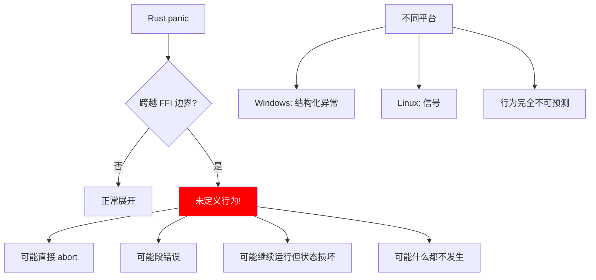

### 正确处理 FFI panic

```rust
use std::panic::{catch_unwind, AssertUnwindSafe};
use std::ffi::CStr;
use std::os::raw::{c_char, c_int};

// 方法 1：返回错误码
#[no_mangle]
pub extern "C" fn safe_process(input: c_int) -> c_int {
    let result = catch_unwind(AssertUnwindSafe(|| {
        if input < 0 {
            panic!("Negative input!");
        }
        input * 2
    }));

    match result {
        Ok(value) => value,
        Err(_) => -1,  // 返回错误码
    }
}

// 方法 2：使用结果结构体
#[repr(C)]
pub struct FFIResult {
    success: bool,
    value: c_int,
    error_code: c_int,
}

#[no_mangle]
pub extern "C" fn safe_process_v2(input: c_int) -> FFIResult {
    let result = catch_unwind(AssertUnwindSafe(|| {
        if input < 0 {
            panic!("Negative input!");
        }
        input * 2
    }));

    match result {
        Ok(value) => FFIResult {
            success: true,
            value,
            error_code: 0,
        },
        Err(_) => FFIResult {
            success: false,
            value: 0,
            error_code: -1,
        },
    }
}

// 方法 3：使用线程本地存储保存错误信息
thread_local! {
    static LAST_ERROR: std::cell::RefCell<Option<String>> = std::cell::RefCell::new(None);
}

#[no_mangle]
pub extern "C" fn safe_process_v3(input: c_int) -> c_int {
    LAST_ERROR.with(|e| e.borrow_mut().take());  // 清除旧错误

    let result = catch_unwind(AssertUnwindSafe(|| {
        if input < 0 {
            panic!("Negative input: {}", input);
        }
        input * 2
    }));

    match result {
        Ok(value) => value,
        Err(payload) => {
            // 保存错误信息
            let msg = if let Some(s) = payload.downcast_ref::<&str>() {
                s.to_string()
            } else if let Some(s) = payload.downcast_ref::<String>() {
                s.clone()
            } else {
                "Unknown panic".to_string()
            };

            LAST_ERROR.with(|e| *e.borrow_mut() = Some(msg));
            -1
        }
    }
}

#[no_mangle]
pub extern "C" fn get_last_error(buffer: *mut c_char, buffer_len: usize) -> c_int {
    LAST_ERROR.with(|e| {
        if let Some(ref msg) = *e.borrow() {
            let bytes = msg.as_bytes();
            let copy_len = std::cmp::min(bytes.len(), buffer_len - 1);

            unsafe {
                std::ptr::copy_nonoverlapping(
                    bytes.as_ptr(),
                    buffer as *mut u8,
                    copy_len,
                );
                *buffer.add(copy_len) = 0;  // null 终止符
            }

            copy_len as c_int
        } else {
            0
        }
    })
}
```

### C-unwind ABI

```rust
// Rust 1.71+: C-unwind ABI 允许展开穿越边界

// 允许 Rust panic 穿越到支持异常的语言（如 C++）
#[no_mangle]
pub extern "C-unwind" fn may_panic() {
    panic!("This panic can unwind through C++ frames!");
}

// 允许外部异常穿越到 Rust
extern "C-unwind" {
    fn cpp_function_that_may_throw();
}

fn call_cpp() {
    unsafe {
        // 如果 C++ 抛出异常，它会穿越到 Rust
        // 并被转换为 Rust panic
        cpp_function_that_may_throw();
    }
}

// 使用 catch_unwind 捕获外部异常
fn safe_call_cpp() {
    let result = catch_unwind(AssertUnwindSafe(|| {
        unsafe {
            cpp_function_that_may_throw();
        }
    }));

    match result {
        Ok(()) => println!("C++ function succeeded"),
        Err(_) => println!("C++ function threw an exception"),
    }
}
```

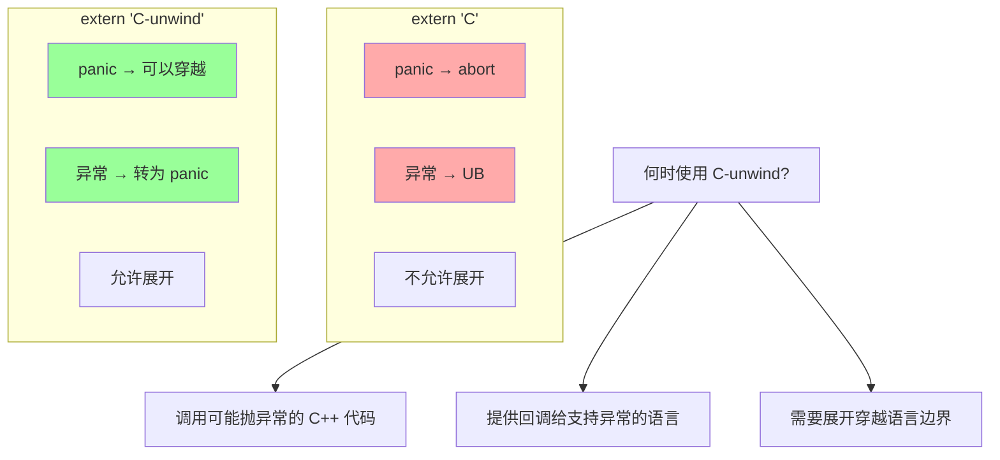

### 回调中的 panic 处理

```rust
// C 代码可能会调用 Rust 回调
extern "C" {
    fn c_function_with_callback(
        callback: extern "C" fn(i32) -> i32,
        input: i32,
    ) -> i32;
}

// 安全的回调实现
extern "C" fn safe_callback(input: i32) -> i32 {
    catch_unwind(AssertUnwindSafe(|| {
        process_input(input)
    })).unwrap_or(-1)
}

fn process_input(input: i32) -> i32 {
    if input < 0 {
        panic!("Invalid input");
    }
    input * 2
}

// 使用
fn call_c_with_callback(input: i32) -> i32 {
    unsafe {
        c_function_with_callback(safe_callback, input)
    }
}
```

## 7.6 线程与 panic

### 线程 panic 的影响

```rust
use std::thread;

fn thread_panic_demo() {
    let handle = thread::spawn(|| {
        panic!("Thread panicked!");
    });

    // join 会返回 Err，包含 panic 信息
    match handle.join() {
        Ok(()) => println!("Thread completed successfully"),
        Err(payload) => {
            println!("Thread panicked!");

            if let Some(s) = payload.downcast_ref::<&str>() {
                println!("Panic message: {}", s);
            }
        }
    }

    println!("Main thread continues...");
}

// 线程 panic 不会影响其他线程
fn independent_threads() {
    let handle1 = thread::spawn(|| {
        thread::sleep(std::time::Duration::from_millis(100));
        println!("Thread 1: still running");
    });

    let handle2 = thread::spawn(|| {
        panic!("Thread 2 panicked!");
    });

    // Thread 2 panic 不会影响 Thread 1
    let _ = handle2.join();
    handle1.join().unwrap();

    println!("Both threads finished");
}
```

### 多线程环境中的 panic 传播

```rust
use std::thread;
use std::sync::mpsc;

fn propagate_panic() {
    let (tx, rx) = mpsc::channel();

    let handle = thread::spawn(move || {
        // 尝试执行任务
        let result = catch_unwind(AssertUnwindSafe(|| {
            // 一些可能 panic 的工作
            do_risky_work()
        }));

        // 发送结果
        tx.send(result).unwrap();
    });

    // 主线程接收结果
    match rx.recv().unwrap() {
        Ok(value) => println!("Success: {:?}", value),
        Err(payload) => {
            println!("Worker panicked, propagating...");
            std::panic::resume_unwind(payload);
        }
    }
}

fn do_risky_work() -> i32 {
    42
}

use std::panic::{catch_unwind, AssertUnwindSafe};
```

## 7.7 panic hook

### 自定义 panic 处理

```rust
use std::panic;

fn custom_panic_hook() {
    // 设置自定义 panic hook
    panic::set_hook(Box::new(|info| {
        // 获取 panic 位置
        let location = info.location().map(|l| {
            format!("{}:{}:{}", l.file(), l.line(), l.column())
        }).unwrap_or_else(|| "unknown".to_string());

        // 获取 panic 消息
        let message = if let Some(s) = info.payload().downcast_ref::<&str>() {
            s.to_string()
        } else if let Some(s) = info.payload().downcast_ref::<String>() {
            s.clone()
        } else {
            "Unknown panic".to_string()
        };

        // 自定义处理
        eprintln!("=== PANIC ===");
        eprintln!("Location: {}", location);
        eprintln!("Message: {}", message);
        eprintln!("=============");

        // 可以记录到日志、发送告警等
    }));

    // 触发 panic
    panic!("Test panic");
}

// 暂时禁用 panic hook
fn temporarily_disable_hook() {
    // 保存原来的 hook
    let prev_hook = panic::take_hook();

    // 设置空 hook
    panic::set_hook(Box::new(|_| {
        // 不做任何事
    }));

    // 执行可能 panic 的代码（静默处理）
    let _ = catch_unwind(|| {
        panic!("Silent panic");
    });

    // 恢复原来的 hook
    panic::set_hook(prev_hook);
}
```

### 记录 panic 信息

```rust
use std::panic;
use std::sync::Mutex;

static PANIC_LOG: Mutex<Vec<String>> = Mutex::new(Vec::new());

fn logging_panic_hook() {
    panic::set_hook(Box::new(|info| {
        let message = format!(
            "Panic at {}: {}",
            info.location().map(|l| l.to_string()).unwrap_or_default(),
            info.payload().downcast_ref::<&str>().unwrap_or(&"unknown")
        );

        // 记录到全局日志
        if let Ok(mut log) = PANIC_LOG.lock() {
            log.push(message.clone());
        }

        // 打印
        eprintln!("{}", message);

        // 可以发送到监控系统
        // send_to_monitoring(&message);
    }));
}

fn get_panic_log() -> Vec<String> {
    PANIC_LOG.lock().unwrap().clone()
}
```

## 7.8 总结

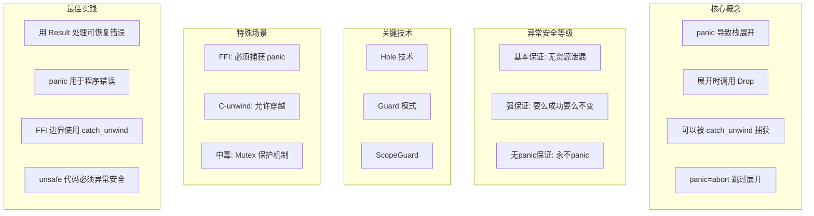

### 核心要点

1. **panic 触发栈展开**：所有 Drop 都会被调用，确保资源清理
2. **catch_unwind 可以捕获 panic**：但应该谨慎使用，主要用于 FFI 边界
3. **异常安全很重要**：unsafe 代码必须考虑 panic 情况，至少提供基本保证
4. **Mutex 中毒是保护机制**：通知其他线程发生了问题，让使用者决定如何处理
5. **FFI 边界必须处理 panic**：使用 catch_unwind 或 C-unwind ABI

### 检查清单

编写可能 panic 的代码时：

- [ ] 确定异常安全等级（基本/强/无panic）
- [ ] 使用 Guard 或 Hole 技术保护数据结构
- [ ] 在 FFI 边界使用 catch_unwind
- [ ] 考虑使用 C-unwind 与 C++ 交互
- [ ] 测试 panic 场景下的行为
- [ ] 文档化函数的异常安全保证

---

下一章：[并发](./08-concurrency.md)
