# 第八章：并发 (Concurrency) 深度解析（扩展版）

## 概述

Rust 对并发采用了独特的方式：通过类型系统在编译时防止数据竞争。核心机制是 `Send` 和 `Sync` trait，以及原子操作。本章深入探讨 Rust 并发的底层机制，包括内存模型、原子操作、同步原语的实现原理。

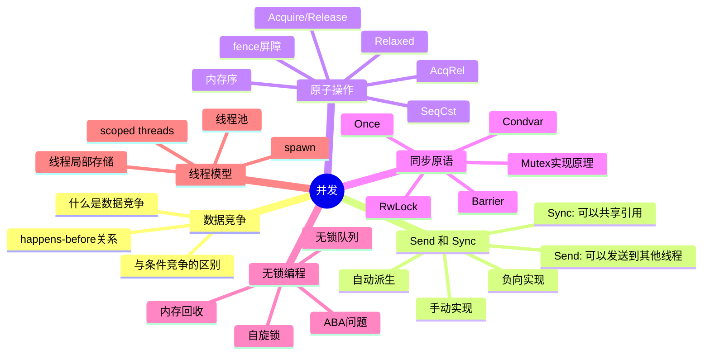

## 8.1 数据竞争 (Data Races) 深度解析

### 什么是数据竞争？

数据竞争是并发程序中最危险的错误之一，它会导致未定义行为。

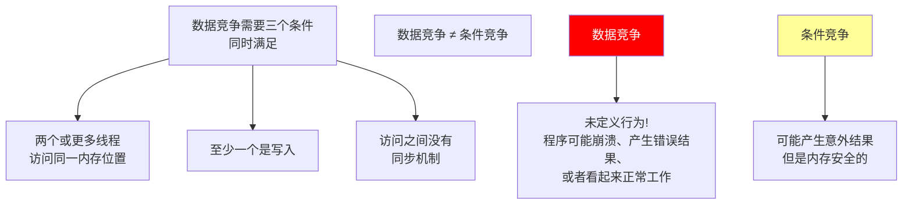

### 数据竞争的危险

```rust
// 危险！数据竞争示例
use std::thread;

static mut COUNTER: i32 = 0;

fn data_race_example() {
    let mut handles = vec![];

    for _ in 0..10 {
        handles.push(thread::spawn(|| {
            for _ in 0..1000 {
                unsafe {
                    // 这是数据竞争！
                    // COUNTER += 1 实际上是三个操作：
                    // 1. 读取 COUNTER
                    // 2. 加 1
                    // 3. 写回 COUNTER
                    COUNTER += 1;
                }
            }
        }));
    }

    for handle in handles {
        handle.join().unwrap();
    }

    unsafe {
        // 结果可能是任何值！
        // 期望是 10000，但实际可能是 3847、5123 或任何数字
        println!("Counter: {}", COUNTER);
    }
}
```

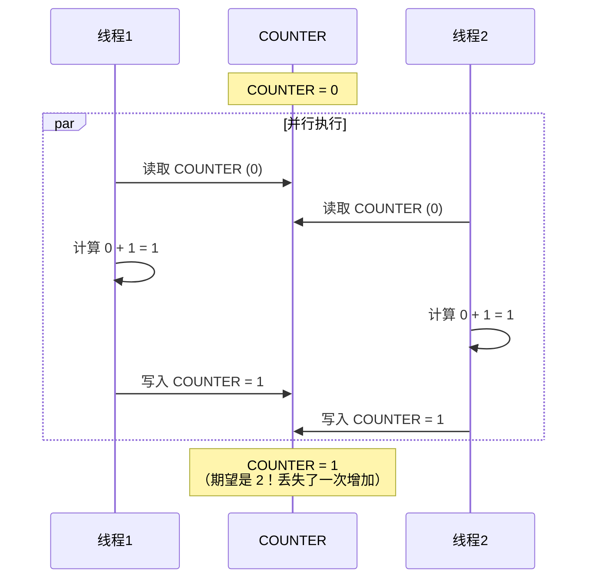

### 条件竞争 vs 数据竞争

```rust
use std::sync::{Arc, Mutex};
use std::thread;

// 这是条件竞争，但不是数据竞争
// 因为使用了 Mutex 同步
fn race_condition_example() {
    let balance = Arc::new(Mutex::new(100));

    let balance1 = Arc::clone(&balance);
    let balance2 = Arc::clone(&balance);

    // 两个线程同时尝试取款
    let t1 = thread::spawn(move || {
        let mut b = balance1.lock().unwrap();
        if *b >= 50 {
            thread::sleep(std::time::Duration::from_millis(1));
            *b -= 50;
            println!("Thread 1 withdrew 50, balance: {}", *b);
        }
    });

    let t2 = thread::spawn(move || {
        let mut b = balance2.lock().unwrap();
        if *b >= 80 {
            thread::sleep(std::time::Duration::from_millis(1));
            *b -= 80;
            println!("Thread 2 withdrew 80, balance: {}", *b);
        }
    });

    t1.join().unwrap();
    t2.join().unwrap();

    // 虽然使用了 Mutex，但业务逻辑仍可能有条件竞争
    // 例如：检查余额和扣款之间的间隙
    // 这是安全的（不是 UB），但可能不是期望的行为
}

// 正确的原子操作方式
use std::sync::atomic::{AtomicI32, Ordering};

fn atomic_withdraw(balance: &AtomicI32, amount: i32) -> bool {
    loop {
        let current = balance.load(Ordering::Acquire);
        if current < amount {
            return false;
        }
        // compare_exchange 确保原子地检查和修改
        match balance.compare_exchange(
            current,
            current - amount,
            Ordering::AcqRel,
            Ordering::Acquire,
        ) {
            Ok(_) => return true,
            Err(_) => continue,  // 重试
        }
    }
}
```

### happens-before 关系

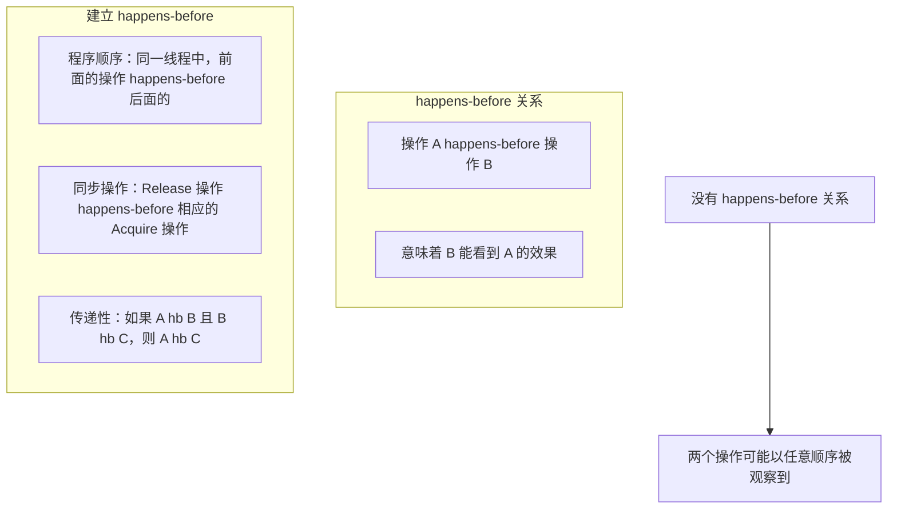

```rust
use std::sync::atomic::{AtomicBool, AtomicI32, Ordering};
use std::thread;

static DATA: AtomicI32 = AtomicI32::new(0);
static READY: AtomicBool = AtomicBool::new(false);

fn happens_before_demo() {
    let writer = thread::spawn(|| {
        DATA.store(42, Ordering::Relaxed);           // A
        READY.store(true, Ordering::Release);        // B (Release)
    });

    let reader = thread::spawn(|| {
        while !READY.load(Ordering::Acquire) {}      // C (Acquire)
        let data = DATA.load(Ordering::Relaxed);     // D
        assert_eq!(data, 42);  // 保证成功！
    });

    writer.join().unwrap();
    reader.join().unwrap();

    // happens-before 链:
    // A hb B (程序顺序)
    // B hb C (Release-Acquire 同步)
    // C hb D (程序顺序)
    // 因此 A hb D，D 能看到 A 写入的 42
}
```

### Rust 如何防止数据竞争

```rust
use std::sync::atomic::{AtomicI32, Ordering};
use std::sync::{Arc, Mutex, RwLock};
use std::thread;

// 方法 1: 原子操作
static COUNTER: AtomicI32 = AtomicI32::new(0);

fn atomic_increment() {
    COUNTER.fetch_add(1, Ordering::SeqCst);
}

// 方法 2: Mutex 保护
fn mutex_example() {
    let counter = Arc::new(Mutex::new(0));
    let mut handles = vec![];

    for _ in 0..10 {
        let counter = Arc::clone(&counter);
        handles.push(thread::spawn(move || {
            for _ in 0..1000 {
                let mut num = counter.lock().unwrap();
                *num += 1;
            }
        }));
    }

    for handle in handles {
        handle.join().unwrap();
    }

    println!("Result: {}", *counter.lock().unwrap());  // 保证是 10000
}

// 方法 3: RwLock（读多写少场景）
fn rwlock_example() {
    let data = Arc::new(RwLock::new(vec![1, 2, 3]));

    // 多个读者
    let readers: Vec<_> = (0..5).map(|i| {
        let data = Arc::clone(&data);
        thread::spawn(move || {
            let read_guard = data.read().unwrap();
            println!("Reader {}: {:?}", i, *read_guard);
        })
    }).collect();

    // 一个写者
    let data_writer = Arc::clone(&data);
    let writer = thread::spawn(move || {
        let mut write_guard = data_writer.write().unwrap();
        write_guard.push(4);
        println!("Writer added 4");
    });

    for r in readers {
        r.join().unwrap();
    }
    writer.join().unwrap();
}
```

## 8.2 Send 和 Sync 深度解析

### 定义与含义

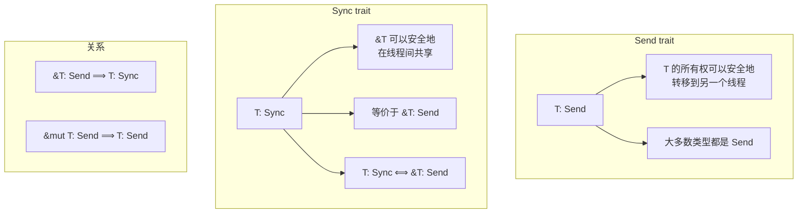

### Send 和 Sync 的语义

```rust
use std::thread;
use std::sync::Arc;
use std::rc::Rc;
use std::cell::{Cell, RefCell};

// Send: 可以安全地移动到另一个线程
fn send_semantics() {
    // i32 是 Send
    let x = 42;
    thread::spawn(move || {
        println!("x = {}", x);  // x 被移动到新线程
    }).join().unwrap();

    // String 是 Send
    let s = String::from("hello");
    thread::spawn(move || {
        println!("s = {}", s);
    }).join().unwrap();

    // Vec 是 Send（如果元素是 Send）
    let v = vec![1, 2, 3];
    thread::spawn(move || {
        println!("v = {:?}", v);
    }).join().unwrap();

    // Rc 不是 Send！
    // let rc = Rc::new(42);
    // thread::spawn(move || {
    //     println!("rc = {}", rc);  // 编译错误！
    // });
}

// Sync: 引用可以安全地在线程间共享
fn sync_semantics() {
    // i32 是 Sync
    let x = 42;
    let x_ref = &x;

    // 可以在多个线程中共享 &i32
    thread::scope(|s| {
        s.spawn(|| println!("Thread 1: {}", x_ref));
        s.spawn(|| println!("Thread 2: {}", x_ref));
    });

    // Cell 不是 Sync！
    let cell = Cell::new(42);
    // thread::scope(|s| {
    //     s.spawn(|| cell.set(100));  // 编译错误！
    //     s.spawn(|| cell.get());
    // });

    // RefCell 不是 Sync！
    let refcell = RefCell::new(42);
    // 不能在多个线程中共享 &RefCell
}
```

### 自动派生规则详解

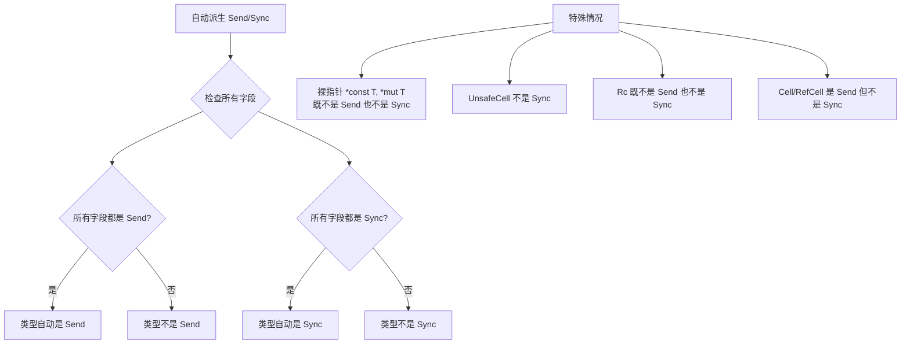

```rust
use std::cell::UnsafeCell;
use std::marker::PhantomData;

// 自动派生示例
struct AutoSendSync {
    a: i32,      // Send + Sync
    b: String,   // Send + Sync
    c: Vec<u8>,  // Send + Sync
}
// AutoSendSync 自动获得 Send + Sync

// 包含非 Send 字段
struct NotSend {
    data: std::rc::Rc<i32>,  // Rc 不是 Send
}
// NotSend 不是 Send

// 包含非 Sync 字段
struct NotSync {
    data: std::cell::Cell<i32>,  // Cell 不是 Sync
}
// NotSync 不是 Sync（但是 Send）

// 包含裸指针
struct HasRawPtr {
    ptr: *mut i32,
}
// HasRawPtr 既不是 Send 也不是 Sync

// 使用 PhantomData 恢复自动派生
struct WithPhantom<T> {
    ptr: *mut T,
    // 表示我们逻辑上拥有 T
    _marker: PhantomData<T>,
}
// 仍然不是 Send/Sync，因为 *mut T 不是
```

### 完整的 Send/Sync 表

| 类型 | Send | Sync | 原因 |
|------|:----:|:----:|------|
| `i32`, `f64`, `bool` 等 | ✓ | ✓ | 基本类型，没有内部状态 |
| `String`, `Vec<T>` | 如果 T: Send | 如果 T: Sync | 拥有数据的容器 |
| `&T` | 如果 T: Sync | 如果 T: Sync | 共享引用需要 Sync |
| `&mut T` | 如果 T: Send | 如果 T: Sync | 可变引用传递所有权 |
| `Box<T>` | 如果 T: Send | 如果 T: Sync | 拥有堆上数据 |
| `Rc<T>` | ✗ | ✗ | 引用计数非原子 |
| `Arc<T>` | 如果 T: Send+Sync | 如果 T: Send+Sync | 原子引用计数 |
| `Cell<T>` | 如果 T: Send | ✗ | 内部可变性，非线程安全 |
| `RefCell<T>` | 如果 T: Send | ✗ | 运行时借用检查，非线程安全 |
| `Mutex<T>` | 如果 T: Send | ✓ | 互斥保护 |
| `RwLock<T>` | 如果 T: Send | 如果 T: Send+Sync | 读写锁保护 |
| `AtomicXxx` | ✓ | ✓ | 原子操作 |
| `*const T`, `*mut T` | ✗ | ✗ | 裸指针，编译器不能验证 |
| `UnsafeCell<T>` | 如果 T: Send | ✗ | 内部可变性的基础 |

### 手动实现 Send/Sync

```rust
use std::ptr::NonNull;

// 自定义智能指针
struct MyBox<T> {
    ptr: NonNull<T>,
}

impl<T> MyBox<T> {
    fn new(value: T) -> Self {
        let ptr = Box::into_raw(Box::new(value));
        MyBox {
            ptr: unsafe { NonNull::new_unchecked(ptr) },
        }
    }

    fn get(&self) -> &T {
        unsafe { self.ptr.as_ref() }
    }
}

impl<T> Drop for MyBox<T> {
    fn drop(&mut self) {
        unsafe {
            drop(Box::from_raw(self.ptr.as_ptr()));
        }
    }
}

// 安全性分析：
// 1. MyBox 独占拥有 T 的所有权
// 2. 没有内部可变性
// 3. 如果 T 可以跨线程移动，MyBox<T> 也可以
// 4. 如果 &T 可以跨线程共享，&MyBox<T> 也可以

unsafe impl<T: Send> Send for MyBox<T> {}
unsafe impl<T: Sync> Sync for MyBox<T> {}

// 使用示例
fn use_my_box() {
    use std::thread;

    let my_box = MyBox::new(42);

    // 因为我们实现了 Send，可以移动到另一个线程
    thread::spawn(move || {
        println!("Value: {}", my_box.get());
    }).join().unwrap();
}
```

### 手动实现的安全要求

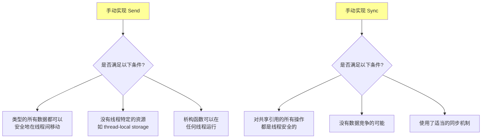

```rust
// 更复杂的例子：线程安全的单例
use std::sync::atomic::{AtomicPtr, Ordering};
use std::ptr;

struct Singleton {
    data: i32,
}

struct SingletonHolder {
    instance: AtomicPtr<Singleton>,
}

impl SingletonHolder {
    const fn new() -> Self {
        SingletonHolder {
            instance: AtomicPtr::new(ptr::null_mut()),
        }
    }

    fn get_or_init(&self, init: impl FnOnce() -> Singleton) -> &Singleton {
        let mut ptr = self.instance.load(Ordering::Acquire);

        if ptr.is_null() {
            let new_instance = Box::into_raw(Box::new(init()));

            match self.instance.compare_exchange(
                ptr::null_mut(),
                new_instance,
                Ordering::AcqRel,
                Ordering::Acquire,
            ) {
                Ok(_) => ptr = new_instance,
                Err(current) => {
                    // 另一个线程先初始化了，释放我们创建的
                    unsafe { drop(Box::from_raw(new_instance)); }
                    ptr = current;
                }
            }
        }

        unsafe { &*ptr }
    }
}

// SingletonHolder 需要是 Sync 才能作为静态变量
// 因为它使用原子操作保护内部状态，是线程安全的
unsafe impl Sync for SingletonHolder {}

static SINGLETON: SingletonHolder = SingletonHolder::new();

fn use_singleton() {
    let instance = SINGLETON.get_or_init(|| Singleton { data: 42 });
    println!("Singleton data: {}", instance.data);
}
```

### 负向实现（opt-out）

```rust
#![feature(negative_impls)]

use std::marker::PhantomData;

// 方法 1: 使用 negative_impls（需要 nightly）
struct ThreadLocal {
    data: i32,
}

impl !Send for ThreadLocal {}
impl !Sync for ThreadLocal {}

// 方法 2: 使用 PhantomData（稳定版可用）
struct NotSendOrSync {
    data: i32,
    // *const () 既不是 Send 也不是 Sync
    _marker: PhantomData<*const ()>,
}

// 方法 3: 包含不满足 Send/Sync 的类型
struct AlsoNotSend {
    data: i32,
    _marker: PhantomData<std::rc::Rc<()>>,  // Rc 不是 Send
}

// 为什么要 opt-out？
// 1. 类型包含线程局部资源
// 2. 类型的语义要求它只能在创建它的线程使用
// 3. FFI 类型可能不是线程安全的
```

## 8.3 原子操作与内存序深度解析

### 为什么需要内存序？

现代计算机系统中，编译器和 CPU 都可能对指令重新排序以提高性能。内存序告诉它们哪些重排是允许的。

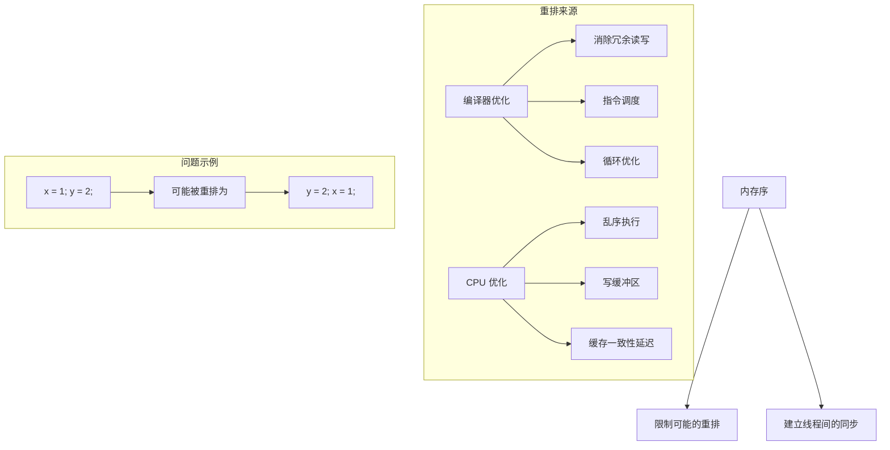

### Rust 的内存序详解

```rust
use std::sync::atomic::Ordering;

// 五种内存序
enum OrderingExplained {
    // 松散序：只保证原子性，没有任何同步效果
    Relaxed,

    // 释放序：阻止之前的读写被重排到此操作之后
    // 用于"发布"数据
    Release,

    // 获取序：阻止之后的读写被重排到此操作之前
    // 用于"获取"数据
    Acquire,

    // 获取-释放序：同时具有 Acquire 和 Release 的效果
    // 用于 read-modify-write 操作
    AcqRel,

    // 顺序一致性：最强的保证
    // 所有线程看到相同的操作顺序
    SeqCst,
}
```

### SeqCst - 顺序一致性

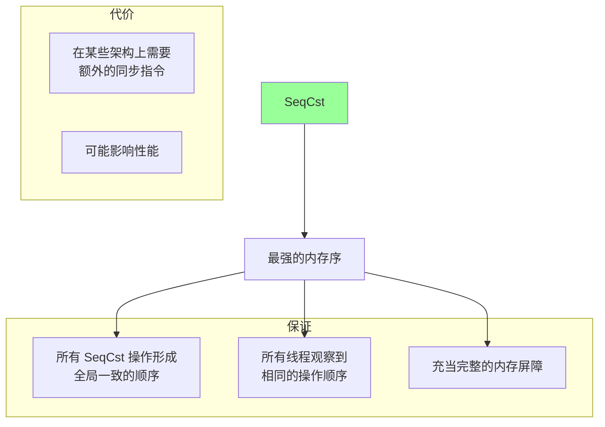

```rust
use std::sync::atomic::{AtomicBool, AtomicI32, Ordering};
use std::thread;

static X: AtomicI32 = AtomicI32::new(0);
static Y: AtomicI32 = AtomicI32::new(0);
static Z: AtomicI32 = AtomicI32::new(0);

fn seqcst_example() {
    // 经典的 IRIW (Independent Reads of Independent Writes) 问题
    // SeqCst 保证所有线程看到相同的写入顺序

    let t1 = thread::spawn(|| {
        X.store(1, Ordering::SeqCst);
    });

    let t2 = thread::spawn(|| {
        Y.store(1, Ordering::SeqCst);
    });

    let t3 = thread::spawn(|| {
        while X.load(Ordering::SeqCst) != 1 {}
        if Y.load(Ordering::SeqCst) == 0 {
            Z.fetch_add(1, Ordering::SeqCst);
        }
    });

    let t4 = thread::spawn(|| {
        while Y.load(Ordering::SeqCst) != 1 {}
        if X.load(Ordering::SeqCst) == 0 {
            Z.fetch_add(1, Ordering::SeqCst);
        }
    });

    t1.join().unwrap();
    t2.join().unwrap();
    t3.join().unwrap();
    t4.join().unwrap();

    // 使用 SeqCst，Z 最多为 1
    // 因为所有线程看到相同的 X 和 Y 的写入顺序
    // 不可能 t3 看到 X=1, Y=0 同时 t4 看到 Y=1, X=0
    assert!(Z.load(Ordering::SeqCst) <= 1);
}
```

### Acquire-Release 语义详解

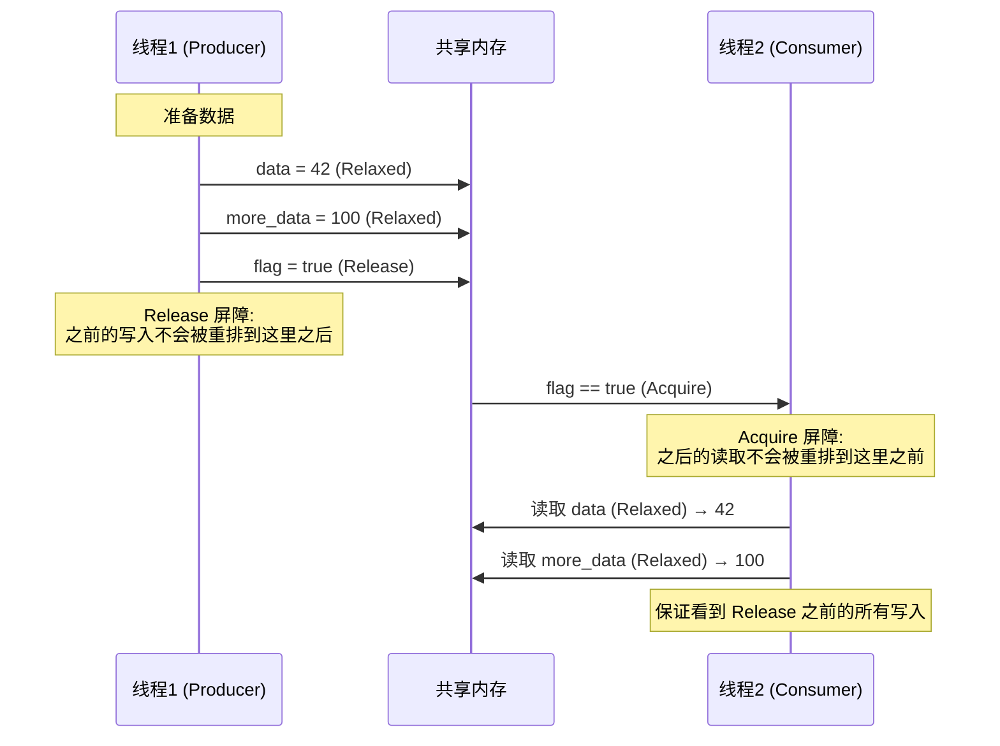

```rust
use std::sync::atomic::{AtomicBool, AtomicI32, AtomicPtr, Ordering};
use std::ptr;
use std::thread;

// Acquire-Release 配对示例
struct Message {
    data: i32,
    extra: String,
}

static MESSAGE: AtomicPtr<Message> = AtomicPtr::new(ptr::null_mut());
static READY: AtomicBool = AtomicBool::new(false);

fn acquire_release_example() {
    let producer = thread::spawn(|| {
        // 准备消息
        let msg = Box::new(Message {
            data: 42,
            extra: String::from("Hello from producer"),
        });

        // 首先存储指针（可以是 Relaxed）
        MESSAGE.store(Box::into_raw(msg), Ordering::Relaxed);

        // 然后设置 ready 标志（Release）
        // 这保证 MESSAGE 的写入对消费者可见
        READY.store(true, Ordering::Release);
    });

    let consumer = thread::spawn(|| {
        // 等待 ready（Acquire）
        while !READY.load(Ordering::Acquire) {
            std::hint::spin_loop();
        }

        // 现在可以安全地读取 MESSAGE
        let msg = MESSAGE.load(Ordering::Relaxed);
        unsafe {
            let msg = &*msg;
            println!("Received: {} - {}", msg.data, msg.extra);

            // 清理
            drop(Box::from_raw(msg as *const Message as *mut Message));
        }
    });

    producer.join().unwrap();
    consumer.join().unwrap();
}

// 更复杂的例子：无锁单生产者单消费者队列
struct SpscQueue<T, const N: usize> {
    buffer: [std::cell::UnsafeCell<Option<T>>; N],
    head: AtomicUsize,  // 消费者读取位置
    tail: AtomicUsize,  // 生产者写入位置
}

use std::sync::atomic::AtomicUsize;
use std::cell::UnsafeCell;

unsafe impl<T: Send, const N: usize> Send for SpscQueue<T, N> {}
unsafe impl<T: Send, const N: usize> Sync for SpscQueue<T, N> {}

impl<T, const N: usize> SpscQueue<T, N> {
    fn push(&self, value: T) -> Result<(), T> {
        let tail = self.tail.load(Ordering::Relaxed);
        let next_tail = (tail + 1) % N;

        // 检查是否满
        if next_tail == self.head.load(Ordering::Acquire) {
            return Err(value);
        }

        // 写入数据
        unsafe {
            (*self.buffer[tail].get()) = Some(value);
        }

        // Release：确保数据写入对消费者可见
        self.tail.store(next_tail, Ordering::Release);
        Ok(())
    }

    fn pop(&self) -> Option<T> {
        let head = self.head.load(Ordering::Relaxed);

        // Acquire：与生产者的 Release 配对
        if head == self.tail.load(Ordering::Acquire) {
            return None;
        }

        // 读取数据
        let value = unsafe {
            (*self.buffer[head].get()).take()
        };

        // Release：告诉生产者这个槽位可用
        self.head.store((head + 1) % N, Ordering::Release);
        value
    }
}
```

### Relaxed - 松散序

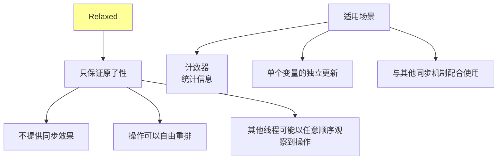

```rust
use std::sync::atomic::{AtomicUsize, Ordering};
use std::thread;
use std::sync::Arc;

// Relaxed 的正确使用：计数器
fn relaxed_counter_example() {
    let counter = Arc::new(AtomicUsize::new(0));
    let mut handles = vec![];

    for _ in 0..10 {
        let counter = Arc::clone(&counter);
        handles.push(thread::spawn(move || {
            for _ in 0..1000 {
                // Relaxed 足够，因为我们只关心最终的总数
                // 不关心中间状态的可见顺序
                counter.fetch_add(1, Ordering::Relaxed);
            }
        }));
    }

    for handle in handles {
        handle.join().unwrap();
    }

    // 最终结果保证是 10000
    println!("Final count: {}", counter.load(Ordering::Relaxed));
}

// Relaxed 的错误使用
static DATA: AtomicUsize = AtomicUsize::new(0);
static FLAG: AtomicBool = AtomicBool::new(false);

fn relaxed_wrong_example() {
    let producer = thread::spawn(|| {
        DATA.store(42, Ordering::Relaxed);
        FLAG.store(true, Ordering::Relaxed);  // 错误！应该用 Release
    });

    let consumer = thread::spawn(|| {
        while !FLAG.load(Ordering::Relaxed) {}  // 错误！应该用 Acquire
        // DATA 的值不确定！可能是 0，可能是 42
        let data = DATA.load(Ordering::Relaxed);
        // 不能假设 data == 42
    });
}
```

### AcqRel - 获取释放序

```rust
use std::sync::atomic::{AtomicUsize, Ordering};

// AcqRel 用于 read-modify-write 操作
// 同时具有 Acquire 和 Release 的效果

fn acqrel_example() {
    let lock = AtomicUsize::new(0);

    // fetch_add 返回旧值，同时原子地增加
    let old = lock.fetch_add(1, Ordering::AcqRel);

    // AcqRel 保证：
    // 1. 此操作之前的读写不会被重排到此操作之后（Release）
    // 2. 此操作之后的读写不会被重排到此操作之前（Acquire）
}

// 使用 AcqRel 实现票据锁
struct TicketLock {
    next_ticket: AtomicUsize,
    now_serving: AtomicUsize,
}

impl TicketLock {
    fn new() -> Self {
        TicketLock {
            next_ticket: AtomicUsize::new(0),
            now_serving: AtomicUsize::new(0),
        }
    }

    fn lock(&self) -> usize {
        // 获取票据（AcqRel 因为我们需要读取旧值并写入新值）
        let my_ticket = self.next_ticket.fetch_add(1, Ordering::Relaxed);

        // 等待轮到我们（Acquire 与 unlock 的 Release 配对）
        while self.now_serving.load(Ordering::Acquire) != my_ticket {
            std::hint::spin_loop();
        }

        my_ticket
    }

    fn unlock(&self) {
        // 服务下一个（Release 确保临界区的修改对下一个持有者可见）
        self.now_serving.fetch_add(1, Ordering::Release);
    }
}
```

### 内存屏障（Fence）

```rust
use std::sync::atomic::{fence, AtomicBool, AtomicI32, Ordering};
use std::thread;

// Fence 可以用来代替单个操作的内存序
static DATA: AtomicI32 = AtomicI32::new(0);
static FLAG: AtomicBool = AtomicBool::new(false);

fn fence_example() {
    let producer = thread::spawn(|| {
        DATA.store(42, Ordering::Relaxed);
        // Release fence：之前的所有写入不会被重排到 fence 之后
        fence(Ordering::Release);
        FLAG.store(true, Ordering::Relaxed);
    });

    let consumer = thread::spawn(|| {
        while !FLAG.load(Ordering::Relaxed) {}
        // Acquire fence：之后的所有读取不会被重排到 fence 之前
        fence(Ordering::Acquire);
        let data = DATA.load(Ordering::Relaxed);
        assert_eq!(data, 42);
    });

    producer.join().unwrap();
    consumer.join().unwrap();
}

// Fence vs 单个操作的内存序
// Fence 影响该线程上所有的原子操作
// 单个操作的内存序只影响那一个操作
```

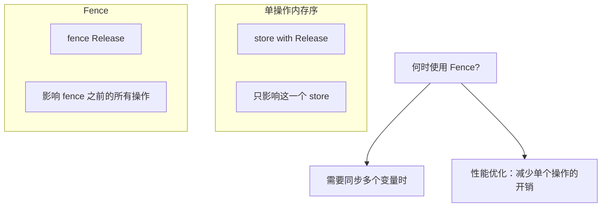

### 自旋锁完整实现

```rust
use std::sync::atomic::{AtomicBool, Ordering};
use std::cell::UnsafeCell;
use std::ops::{Deref, DerefMut};

pub struct SpinLock<T> {
    locked: AtomicBool,
    data: UnsafeCell<T>,
}

// SpinLock 需要 Send + Sync
unsafe impl<T: Send> Send for SpinLock<T> {}
unsafe impl<T: Send> Sync for SpinLock<T> {}

pub struct SpinLockGuard<'a, T> {
    lock: &'a SpinLock<T>,
}

impl<T> SpinLock<T> {
    pub const fn new(data: T) -> Self {
        SpinLock {
            locked: AtomicBool::new(false),
            data: UnsafeCell::new(data),
        }
    }

    pub fn lock(&self) -> SpinLockGuard<'_, T> {
        // 尝试获取锁
        while self.locked
            .compare_exchange_weak(
                false,
                true,
                Ordering::Acquire,  // 成功：获取锁，需要看到之前的修改
                Ordering::Relaxed,  // 失败：只需要知道失败了
            )
            .is_err()
        {
            // 自旋等待
            // 在等待时使用 load 而不是 compare_exchange
            // 减少缓存行争用
            while self.locked.load(Ordering::Relaxed) {
                std::hint::spin_loop();  // 提示 CPU 我们在自旋
            }
        }

        SpinLockGuard { lock: self }
    }

    pub fn try_lock(&self) -> Option<SpinLockGuard<'_, T>> {
        if self.locked
            .compare_exchange(
                false,
                true,
                Ordering::Acquire,
                Ordering::Relaxed,
            )
            .is_ok()
        {
            Some(SpinLockGuard { lock: self })
        } else {
            None
        }
    }
}

impl<T> Deref for SpinLockGuard<'_, T> {
    type Target = T;

    fn deref(&self) -> &T {
        unsafe { &*self.lock.data.get() }
    }
}

impl<T> DerefMut for SpinLockGuard<'_, T> {
    fn deref_mut(&mut self) -> &mut T {
        unsafe { &mut *self.lock.data.get() }
    }
}

impl<T> Drop for SpinLockGuard<'_, T> {
    fn drop(&mut self) {
        // Release：确保临界区的修改对下一个持有者可见
        self.lock.locked.store(false, Ordering::Release);
    }
}

// 使用示例
fn spinlock_demo() {
    use std::sync::Arc;
    use std::thread;

    let lock = Arc::new(SpinLock::new(0));
    let mut handles = vec![];

    for _ in 0..10 {
        let lock = Arc::clone(&lock);
        handles.push(thread::spawn(move || {
            for _ in 0..1000 {
                let mut guard = lock.lock();
                *guard += 1;
            }
        }));
    }

    for handle in handles {
        handle.join().unwrap();
    }

    println!("Final value: {}", *lock.lock());  // 10000
}
```

## 8.4 同步原语深度解析

### Mutex 实现原理

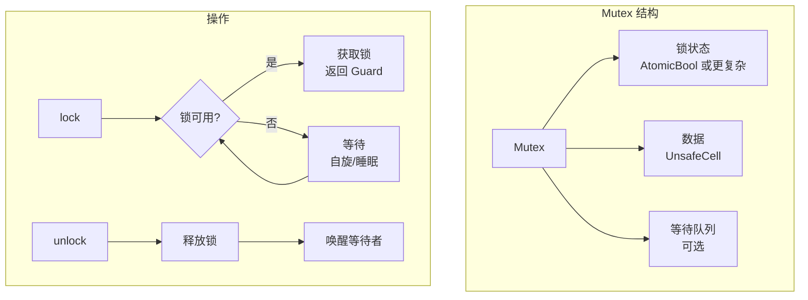

```rust
use std::sync::atomic::{AtomicU32, Ordering};
use std::cell::UnsafeCell;
use std::ops::{Deref, DerefMut};

// 简化的 Mutex 实现（不含等待队列）
pub struct SimpleMutex<T> {
    // 0 = unlocked, 1 = locked
    state: AtomicU32,
    data: UnsafeCell<T>,
}

unsafe impl<T: Send> Send for SimpleMutex<T> {}
unsafe impl<T: Send> Sync for SimpleMutex<T> {}

pub struct SimpleMutexGuard<'a, T> {
    mutex: &'a SimpleMutex<T>,
}

impl<T> SimpleMutex<T> {
    pub const fn new(data: T) -> Self {
        SimpleMutex {
            state: AtomicU32::new(0),
            data: UnsafeCell::new(data),
        }
    }

    pub fn lock(&self) -> SimpleMutexGuard<'_, T> {
        // 快速路径：尝试直接获取
        if self.state
            .compare_exchange(0, 1, Ordering::Acquire, Ordering::Relaxed)
            .is_ok()
        {
            return SimpleMutexGuard { mutex: self };
        }

        // 慢速路径：自旋等待
        loop {
            // 等待锁被释放
            while self.state.load(Ordering::Relaxed) != 0 {
                std::hint::spin_loop();
            }

            // 尝试获取
            if self.state
                .compare_exchange(0, 1, Ordering::Acquire, Ordering::Relaxed)
                .is_ok()
            {
                return SimpleMutexGuard { mutex: self };
            }
        }
    }
}

impl<T> Deref for SimpleMutexGuard<'_, T> {
    type Target = T;
    fn deref(&self) -> &T {
        unsafe { &*self.mutex.data.get() }
    }
}

impl<T> DerefMut for SimpleMutexGuard<'_, T> {
    fn deref_mut(&mut self) -> &mut T {
        unsafe { &mut *self.mutex.data.get() }
    }
}

impl<T> Drop for SimpleMutexGuard<'_, T> {
    fn drop(&mut self) {
        self.mutex.state.store(0, Ordering::Release);
    }
}
```

### Condvar 使用模式

```rust
use std::sync::{Arc, Mutex, Condvar};
use std::thread;
use std::collections::VecDeque;

// 有界缓冲区（生产者-消费者问题）
struct BoundedBuffer<T> {
    buffer: Mutex<VecDeque<T>>,
    not_empty: Condvar,
    not_full: Condvar,
    capacity: usize,
}

impl<T> BoundedBuffer<T> {
    fn new(capacity: usize) -> Self {
        BoundedBuffer {
            buffer: Mutex::new(VecDeque::with_capacity(capacity)),
            not_empty: Condvar::new(),
            not_full: Condvar::new(),
            capacity,
        }
    }

    fn push(&self, item: T) {
        let mut buffer = self.buffer.lock().unwrap();

        // 等待直到有空间
        while buffer.len() == self.capacity {
            buffer = self.not_full.wait(buffer).unwrap();
        }

        buffer.push_back(item);

        // 通知消费者
        self.not_empty.notify_one();
    }

    fn pop(&self) -> T {
        let mut buffer = self.buffer.lock().unwrap();

        // 等待直到有数据
        while buffer.is_empty() {
            buffer = self.not_empty.wait(buffer).unwrap();
        }

        let item = buffer.pop_front().unwrap();

        // 通知生产者
        self.not_full.notify_one();

        item
    }
}

fn bounded_buffer_demo() {
    let buffer = Arc::new(BoundedBuffer::new(5));

    // 生产者
    let buffer_p = Arc::clone(&buffer);
    let producer = thread::spawn(move || {
        for i in 0..20 {
            buffer_p.push(i);
            println!("Produced: {}", i);
        }
    });

    // 消费者
    let buffer_c = Arc::clone(&buffer);
    let consumer = thread::spawn(move || {
        for _ in 0..20 {
            let item = buffer_c.pop();
            println!("Consumed: {}", item);
            thread::sleep(std::time::Duration::from_millis(50));
        }
    });

    producer.join().unwrap();
    consumer.join().unwrap();
}
```

### Barrier 同步

```rust
use std::sync::{Arc, Barrier};
use std::thread;

fn barrier_demo() {
    let num_threads = 5;
    let barrier = Arc::new(Barrier::new(num_threads));
    let mut handles = vec![];

    for i in 0..num_threads {
        let barrier = Arc::clone(&barrier);
        handles.push(thread::spawn(move || {
            println!("Thread {} starting phase 1", i);
            thread::sleep(std::time::Duration::from_millis(100 * i as u64));
            println!("Thread {} finished phase 1", i);

            // 等待所有线程完成 phase 1
            barrier.wait();

            println!("Thread {} starting phase 2", i);
            thread::sleep(std::time::Duration::from_millis(50));
            println!("Thread {} finished phase 2", i);

            // 再次同步
            barrier.wait();

            println!("Thread {} done", i);
        }));
    }

    for handle in handles {
        handle.join().unwrap();
    }
}
```

### Once 一次性初始化

```rust
use std::sync::Once;

static INIT: Once = Once::new();
static mut CONFIG: Option<Config> = None;

struct Config {
    setting: String,
}

fn get_config() -> &'static Config {
    INIT.call_once(|| {
        println!("Initializing config...");
        unsafe {
            CONFIG = Some(Config {
                setting: String::from("default"),
            });
        }
    });

    unsafe { CONFIG.as_ref().unwrap() }
}

// 更好的方式：使用 OnceLock（Rust 1.70+）
use std::sync::OnceLock;

static CONFIG2: OnceLock<Config> = OnceLock::new();

fn get_config2() -> &'static Config {
    CONFIG2.get_or_init(|| {
        println!("Initializing config2...");
        Config {
            setting: String::from("default"),
        }
    })
}
```

## 8.5 无锁编程进阶

### ABA 问题

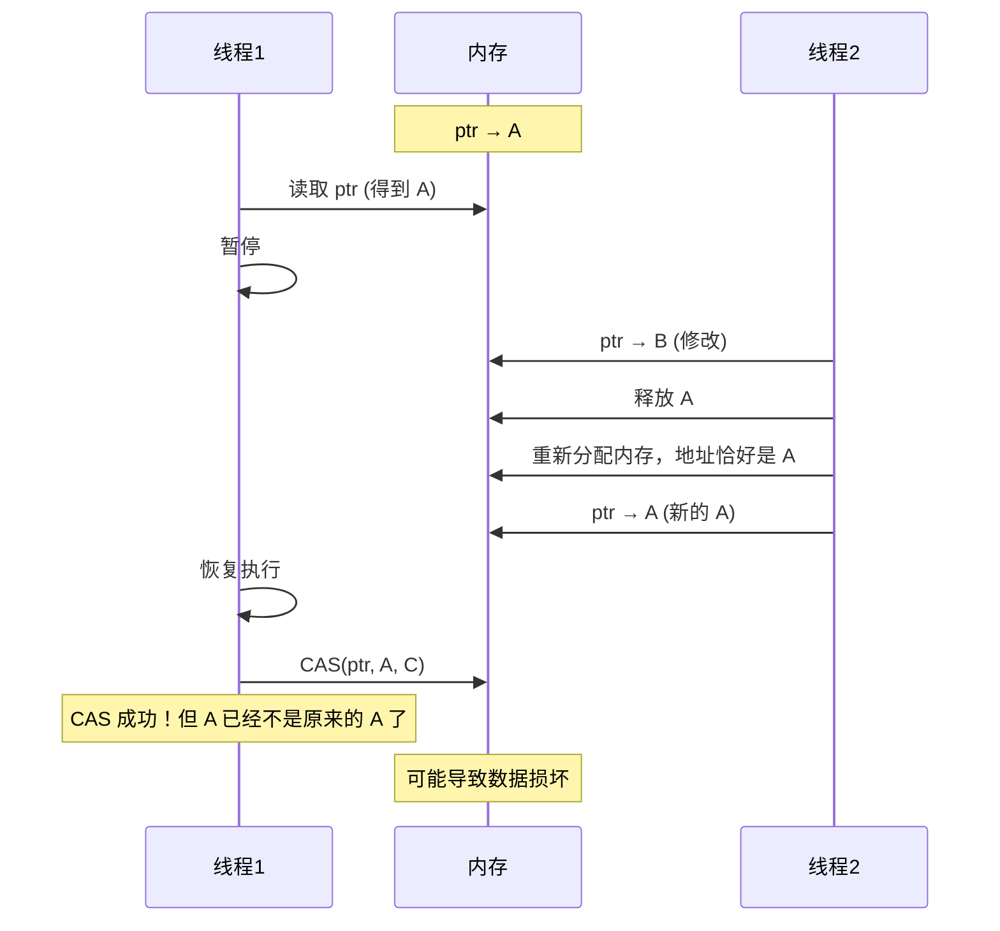

```rust
use std::sync::atomic::{AtomicPtr, AtomicUsize, Ordering};
use std::ptr;

// 解决 ABA 问题：使用版本号
struct VersionedPtr<T> {
    ptr: AtomicUsize,  // 低位是指针，高位是版本号
    _marker: std::marker::PhantomData<T>,
}

impl<T> VersionedPtr<T> {
    const VERSION_BITS: usize = 16;
    const PTR_MASK: usize = (1 << (usize::BITS as usize - Self::VERSION_BITS)) - 1;

    fn new(ptr: *mut T) -> Self {
        VersionedPtr {
            ptr: AtomicUsize::new(ptr as usize),
            _marker: std::marker::PhantomData,
        }
    }

    fn load(&self, ordering: Ordering) -> (*mut T, usize) {
        let combined = self.ptr.load(ordering);
        let ptr = (combined & Self::PTR_MASK) as *mut T;
        let version = combined >> (usize::BITS as usize - Self::VERSION_BITS);
        (ptr, version)
    }

    fn compare_exchange(
        &self,
        current_ptr: *mut T,
        current_version: usize,
        new_ptr: *mut T,
        success: Ordering,
        failure: Ordering,
    ) -> Result<(*mut T, usize), (*mut T, usize)> {
        let current = (current_version << (usize::BITS as usize - Self::VERSION_BITS))
            | (current_ptr as usize);
        let new_version = current_version.wrapping_add(1);
        let new = (new_version << (usize::BITS as usize - Self::VERSION_BITS))
            | (new_ptr as usize);

        match self.ptr.compare_exchange(current, new, success, failure) {
            Ok(_) => Ok((new_ptr, new_version)),
            Err(actual) => {
                let ptr = (actual & Self::PTR_MASK) as *mut T;
                let version = actual >> (usize::BITS as usize - Self::VERSION_BITS);
                Err((ptr, version))
            }
        }
    }
}
```

### 无锁栈实现

```rust
use std::sync::atomic::{AtomicPtr, Ordering};
use std::ptr;

struct Node<T> {
    data: T,
    next: *mut Node<T>,
}

pub struct LockFreeStack<T> {
    head: AtomicPtr<Node<T>>,
}

impl<T> LockFreeStack<T> {
    pub fn new() -> Self {
        LockFreeStack {
            head: AtomicPtr::new(ptr::null_mut()),
        }
    }

    pub fn push(&self, data: T) {
        let new_node = Box::into_raw(Box::new(Node {
            data,
            next: ptr::null_mut(),
        }));

        loop {
            let old_head = self.head.load(Ordering::Relaxed);

            // 设置新节点的 next 指向当前头部
            unsafe {
                (*new_node).next = old_head;
            }

            // CAS：尝试将新节点设为头部
            if self.head
                .compare_exchange_weak(
                    old_head,
                    new_node,
                    Ordering::Release,  // 成功：发布新节点
                    Ordering::Relaxed,  // 失败：重试
                )
                .is_ok()
            {
                break;
            }
        }
    }

    pub fn pop(&self) -> Option<T> {
        loop {
            let old_head = self.head.load(Ordering::Acquire);

            if old_head.is_null() {
                return None;
            }

            let next = unsafe { (*old_head).next };

            // CAS：尝试将 next 设为新头部
            if self.head
                .compare_exchange_weak(
                    old_head,
                    next,
                    Ordering::AcqRel,
                    Ordering::Acquire,
                )
                .is_ok()
            {
                // 成功弹出
                let data = unsafe {
                    let node = Box::from_raw(old_head);
                    node.data
                };
                return Some(data);
            }
        }
    }
}

impl<T> Drop for LockFreeStack<T> {
    fn drop(&mut self) {
        while self.pop().is_some() {}
    }
}

// 注意：这个实现有 ABA 问题！
// 在实际使用中应该使用 crossbeam 等库提供的实现
```

### 使用 crossbeam 的无锁数据结构

```rust
// crossbeam 提供了经过充分测试的无锁数据结构
use crossbeam::queue::ArrayQueue;
use crossbeam::queue::SegQueue;
use std::sync::Arc;
use std::thread;

fn crossbeam_demo() {
    // 有界队列
    let array_queue = Arc::new(ArrayQueue::new(10));

    // 生产者
    let q = Arc::clone(&array_queue);
    let producer = thread::spawn(move || {
        for i in 0..20 {
            while q.push(i).is_err() {
                thread::yield_now();
            }
            println!("Pushed: {}", i);
        }
    });

    // 消费者
    let q = Arc::clone(&array_queue);
    let consumer = thread::spawn(move || {
        for _ in 0..20 {
            loop {
                if let Some(item) = q.pop() {
                    println!("Popped: {}", item);
                    break;
                }
                thread::yield_now();
            }
        }
    });

    producer.join().unwrap();
    consumer.join().unwrap();

    // 无界队列
    let seg_queue: SegQueue<i32> = SegQueue::new();
    seg_queue.push(1);
    seg_queue.push(2);
    println!("Popped: {:?}", seg_queue.pop());
}
```

## 8.6 线程模型与线程池

### Scoped Threads

```rust
use std::thread;

fn scoped_threads_demo() {
    let mut data = vec![1, 2, 3, 4, 5];

    // scoped threads 可以借用栈上的数据
    thread::scope(|s| {
        // 分割数据
        let (left, right) = data.split_at_mut(2);

        s.spawn(|| {
            for x in left.iter_mut() {
                *x *= 2;
            }
        });

        s.spawn(|| {
            for x in right.iter_mut() {
                *x *= 3;
            }
        });
    });  // 所有 scoped threads 在这里被 join

    println!("Result: {:?}", data);  // [2, 4, 9, 12, 15]
}

// 对比普通 spawn：需要 'static 生命周期或 Arc
fn normal_spawn_needs_ownership() {
    let data = vec![1, 2, 3];

    // 必须移动所有权
    let handle = thread::spawn(move || {
        println!("{:?}", data);
    });

    // data 已经被移动，不能再使用
    // println!("{:?}", data);  // 错误！

    handle.join().unwrap();
}
```

### 线程局部存储

```rust
use std::cell::RefCell;
use std::thread;

// 使用 thread_local! 宏
thread_local! {
    static COUNTER: RefCell<u32> = RefCell::new(0);
    static NAME: RefCell<String> = RefCell::new(String::new());
}

fn thread_local_demo() {
    // 主线程
    COUNTER.with(|c| {
        *c.borrow_mut() = 1;
    });
    NAME.with(|n| {
        *n.borrow_mut() = String::from("main");
    });

    let handle = thread::spawn(|| {
        // 新线程有自己的 COUNTER 和 NAME
        COUNTER.with(|c| {
            *c.borrow_mut() = 100;
            println!("Thread COUNTER: {}", c.borrow());
        });
        NAME.with(|n| {
            *n.borrow_mut() = String::from("worker");
            println!("Thread NAME: {}", n.borrow());
        });
    });

    handle.join().unwrap();

    // 主线程的值不受影响
    COUNTER.with(|c| {
        println!("Main COUNTER: {}", c.borrow());  // 1
    });
}

// LocalKey 的方法
fn thread_local_methods() {
    thread_local! {
        static VALUE: RefCell<i32> = RefCell::new(42);
    }

    // with: 访问值
    VALUE.with(|v| {
        println!("Value: {}", *v.borrow());
    });

    // 使用 with_borrow 和 with_borrow_mut (Rust 1.73+)
    // VALUE.with_borrow(|v| println!("Value: {}", v));
    // VALUE.with_borrow_mut(|v| *v = 100);
}
```

### 简单线程池实现

```rust
use std::sync::{mpsc, Arc, Mutex};
use std::thread;

type Job = Box<dyn FnOnce() + Send + 'static>;

enum Message {
    NewJob(Job),
    Terminate,
}

struct ThreadPool {
    workers: Vec<Worker>,
    sender: Option<mpsc::Sender<Message>>,
}

struct Worker {
    id: usize,
    thread: Option<thread::JoinHandle<()>>,
}

impl ThreadPool {
    fn new(size: usize) -> Self {
        assert!(size > 0);

        let (sender, receiver) = mpsc::channel();
        let receiver = Arc::new(Mutex::new(receiver));

        let mut workers = Vec::with_capacity(size);

        for id in 0..size {
            workers.push(Worker::new(id, Arc::clone(&receiver)));
        }

        ThreadPool {
            workers,
            sender: Some(sender),
        }
    }

    fn execute<F>(&self, f: F)
    where
        F: FnOnce() + Send + 'static,
    {
        let job = Box::new(f);
        self.sender.as_ref().unwrap().send(Message::NewJob(job)).unwrap();
    }
}

impl Drop for ThreadPool {
    fn drop(&mut self) {
        // 发送终止消息
        for _ in &self.workers {
            self.sender.as_ref().unwrap().send(Message::Terminate).unwrap();
        }

        drop(self.sender.take());

        // 等待所有 worker 完成
        for worker in &mut self.workers {
            println!("Shutting down worker {}", worker.id);
            if let Some(thread) = worker.thread.take() {
                thread.join().unwrap();
            }
        }
    }
}

impl Worker {
    fn new(id: usize, receiver: Arc<Mutex<mpsc::Receiver<Message>>>) -> Self {
        let thread = thread::spawn(move || loop {
            let message = receiver.lock().unwrap().recv().unwrap();

            match message {
                Message::NewJob(job) => {
                    println!("Worker {} got a job; executing.", id);
                    job();
                }
                Message::Terminate => {
                    println!("Worker {} was told to terminate.", id);
                    break;
                }
            }
        });

        Worker {
            id,
            thread: Some(thread),
        }
    }
}

fn thread_pool_demo() {
    let pool = ThreadPool::new(4);

    for i in 0..8 {
        pool.execute(move || {
            println!("Task {} running on {:?}", i, thread::current().id());
            thread::sleep(std::time::Duration::from_millis(100));
        });
    }

    // pool 被 drop 时会等待所有任务完成
}
```

## 8.7 实现自定义并发类型

### 完整的 Carton 示例

```rust
use std::ptr::NonNull;
use std::ops::{Deref, DerefMut};
use std::alloc::{alloc, dealloc, Layout};

/// 一个简化的 Box 实现，用于演示 Send 和 Sync
pub struct Carton<T> {
    ptr: NonNull<T>,
}

impl<T> Carton<T> {
    pub fn new(value: T) -> Self {
        // 分配内存
        let layout = Layout::new::<T>();
        let ptr = unsafe {
            let raw = alloc(layout) as *mut T;
            if raw.is_null() {
                std::alloc::handle_alloc_error(layout);
            }
            // 写入值
            raw.write(value);
            NonNull::new_unchecked(raw)
        };

        Carton { ptr }
    }

    pub fn into_inner(self) -> T {
        let value = unsafe { self.ptr.as_ptr().read() };
        // 释放内存但不调用 Drop
        let layout = Layout::new::<T>();
        unsafe {
            dealloc(self.ptr.as_ptr() as *mut u8, layout);
        }
        std::mem::forget(self);
        value
    }
}

impl<T> Deref for Carton<T> {
    type Target = T;

    fn deref(&self) -> &T {
        unsafe { self.ptr.as_ref() }
    }
}

impl<T> DerefMut for Carton<T> {
    fn deref_mut(&mut self) -> &mut T {
        unsafe { self.ptr.as_mut() }
    }
}

impl<T> Drop for Carton<T> {
    fn drop(&mut self) {
        unsafe {
            // 调用 T 的析构函数
            std::ptr::drop_in_place(self.ptr.as_ptr());
            // 释放内存
            dealloc(self.ptr.as_ptr() as *mut u8, Layout::new::<T>());
        }
    }
}

// 安全性分析：
// 1. Carton 拥有 T 的唯一所有权
// 2. 没有内部可变性（没有 UnsafeCell）
// 3. 所有访问都通过 &self 或 &mut self
// 4. 如果 T: Send，移动 Carton<T> 到另一个线程是安全的
// 5. 如果 T: Sync，共享 &Carton<T> 是安全的

unsafe impl<T: Send> Send for Carton<T> {}
unsafe impl<T: Sync> Sync for Carton<T> {}

#[cfg(test)]
mod tests {
    use super::*;
    use std::thread;
    use std::sync::Arc;

    #[test]
    fn test_carton_basic() {
        let carton = Carton::new(42);
        assert_eq!(*carton, 42);
    }

    #[test]
    fn test_carton_send() {
        let carton = Carton::new(String::from("hello"));

        let handle = thread::spawn(move || {
            assert_eq!(&*carton, "hello");
        });

        handle.join().unwrap();
    }

    #[test]
    fn test_carton_sync() {
        let carton = Arc::new(Carton::new(42));

        thread::scope(|s| {
            let c = &carton;
            s.spawn(move || {
                assert_eq!(**c, 42);
            });
            s.spawn(move || {
                assert_eq!(**c, 42);
            });
        });
    }
}
```

### 自定义原子类型

```rust
use std::sync::atomic::{AtomicU64, Ordering};

/// 原子浮点数（通过位转换实现）
pub struct AtomicF64 {
    bits: AtomicU64,
}

impl AtomicF64 {
    pub const fn new(value: f64) -> Self {
        AtomicF64 {
            bits: AtomicU64::new(value.to_bits()),
        }
    }

    pub fn load(&self, ordering: Ordering) -> f64 {
        f64::from_bits(self.bits.load(ordering))
    }

    pub fn store(&self, value: f64, ordering: Ordering) {
        self.bits.store(value.to_bits(), ordering);
    }

    pub fn swap(&self, value: f64, ordering: Ordering) -> f64 {
        f64::from_bits(self.bits.swap(value.to_bits(), ordering))
    }

    pub fn compare_exchange(
        &self,
        current: f64,
        new: f64,
        success: Ordering,
        failure: Ordering,
    ) -> Result<f64, f64> {
        match self.bits.compare_exchange(
            current.to_bits(),
            new.to_bits(),
            success,
            failure,
        ) {
            Ok(bits) => Ok(f64::from_bits(bits)),
            Err(bits) => Err(f64::from_bits(bits)),
        }
    }

    /// 原子加法
    pub fn fetch_add(&self, val: f64, ordering: Ordering) -> f64 {
        loop {
            let current = self.load(Ordering::Relaxed);
            let new = current + val;
            match self.compare_exchange(
                current,
                new,
                ordering,
                Ordering::Relaxed,
            ) {
                Ok(v) => return v,
                Err(_) => continue,
            }
        }
    }
}

// AtomicF64 可以安全地跨线程共享
unsafe impl Send for AtomicF64 {}
unsafe impl Sync for AtomicF64 {}
```

## 8.8 总结

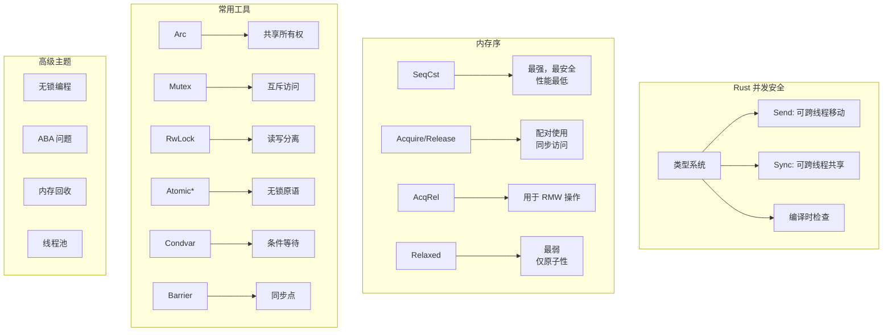

### 核心要点

1. **数据竞争是 UB**：Rust 在编译时通过 Send/Sync 防止，这是 Rust 的核心安全保证
2. **Send 和 Sync 自动派生**：理解哪些类型是/不是 Send/Sync 很重要
3. **内存序选择**：不确定时使用 SeqCst，了解语义后可以使用更弱的序
4. **Acquire/Release 配对**：Release 发布数据，Acquire 获取数据
5. **无锁编程很难**：优先使用 std 或 crossbeam 提供的数据结构
6. **线程安全的代价**：原子操作和锁都有开销，需要权衡

### 内存序选择指南

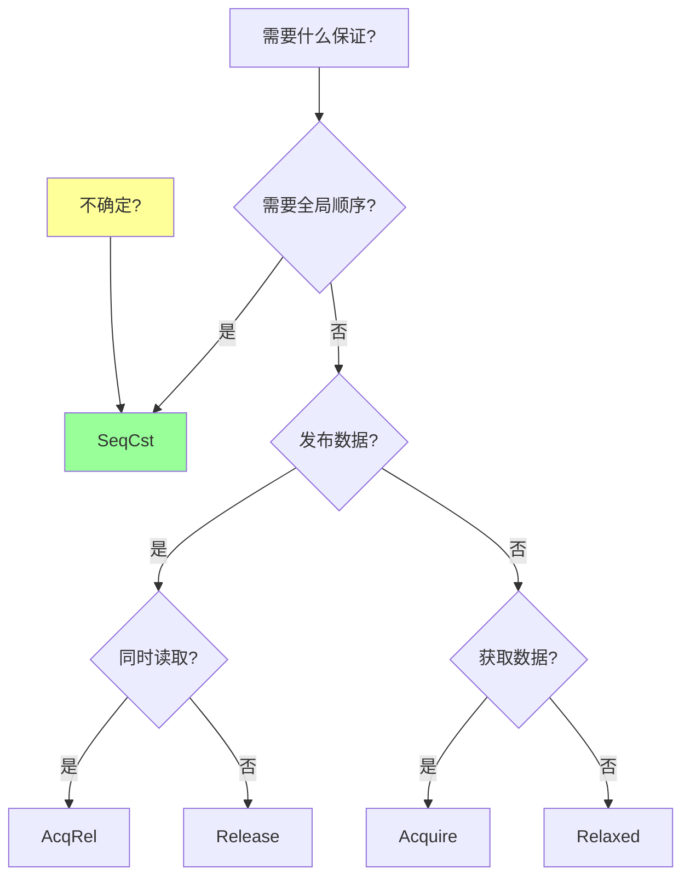

### 检查清单

编写并发代码时，确保：

- [ ] 理解 Send 和 Sync 的含义
- [ ] 正确选择同步原语（Mutex vs RwLock vs Atomic）
- [ ] 正确选择内存序
- [ ] 避免死锁（一致的锁获取顺序）
- [ ] 处理线程 panic（poisoned mutex）
- [ ] 考虑性能影响
- [ ] 使用 Miri 或 loom 测试并发代码

---

下一章：[实现 Vec](./09-vec.md)
