# 第九章：实现 Vec (Implementing Vec) 深度解析（扩展版）

## 概述

从零实现 `Vec` 是理解 Rust unsafe 编程的最佳实践。本章将展示如何处理内存分配、泛型、迭代器等核心问题，并深入探讨每个细节背后的设计考量。

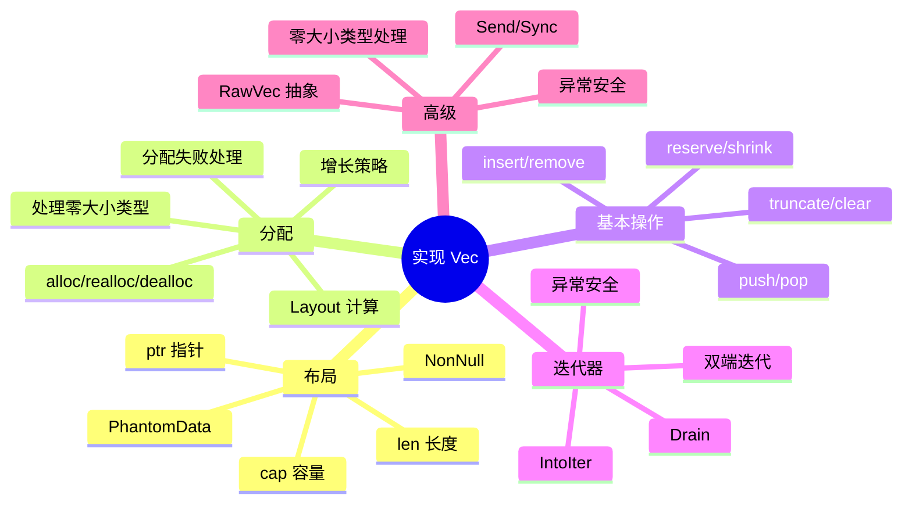

## 9.1 布局设计深度解析

### Vec 的内部结构

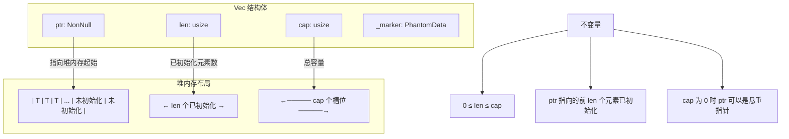

### 完整的 Vec 定义

```rust
use std::ptr::NonNull;
use std::marker::PhantomData;
use std::alloc::{self, Layout};
use std::mem;
use std::ptr;
use std::ops::{Deref, DerefMut};

pub struct Vec<T> {
    ptr: NonNull<T>,
    cap: usize,
    len: usize,
    _marker: PhantomData<T>,
}

// Vec 需要实现 Send 和 Sync
// 如果 T: Send，Vec<T>: Send
// 如果 T: Sync，Vec<T>: Sync
unsafe impl<T: Send> Send for Vec<T> {}
unsafe impl<T: Sync> Sync for Vec<T> {}
```

### 为什么使用 NonNull？

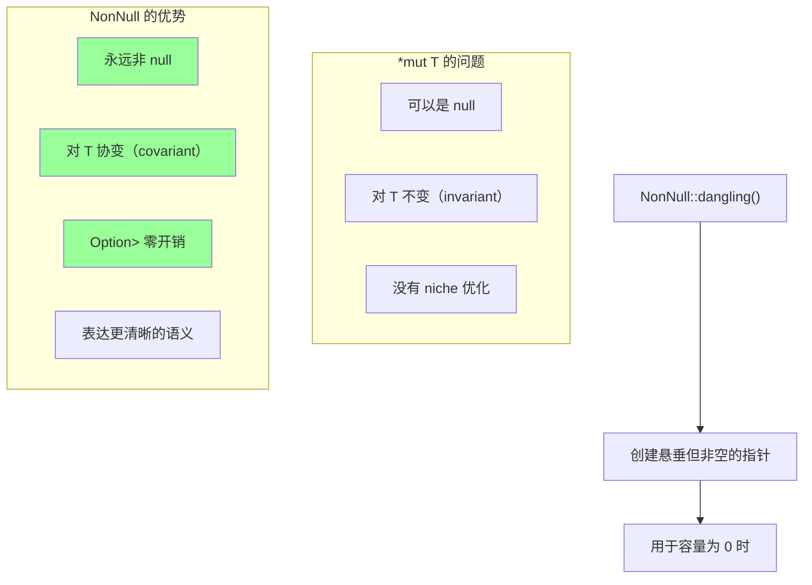

```rust
use std::ptr::NonNull;

fn nonnull_demo() {
    // NonNull 永远非空
    let mut x = 42;
    let ptr = NonNull::new(&mut x as *mut i32).unwrap();

    // 悬垂指针（用于空 Vec）
    let dangling: NonNull<i32> = NonNull::dangling();

    // NonNull 对 T 是协变的
    // 这意味着 NonNull<&'static str> 可以赋值给 NonNull<&'a str>

    // Option<NonNull<T>> 与 NonNull<T> 大小相同
    assert_eq!(
        std::mem::size_of::<Option<NonNull<i32>>>(),
        std::mem::size_of::<NonNull<i32>>()
    );

    // 与 *mut T 对比
    assert_eq!(
        std::mem::size_of::<Option<*mut i32>>(),
        std::mem::size_of::<*mut i32>() * 2  // Option 需要额外空间
    );
}
```

### PhantomData 的作用详解

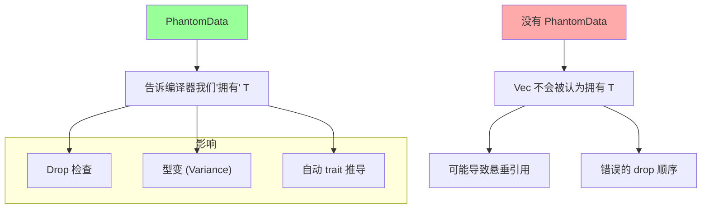

```rust
use std::marker::PhantomData;
use std::ptr::NonNull;

// 错误示例：没有 PhantomData
struct BadVec<T> {
    ptr: NonNull<T>,
    len: usize,
    cap: usize,
    // 编译器不知道我们拥有 T
}

// 正确示例：使用 PhantomData
struct GoodVec<T> {
    ptr: NonNull<T>,
    len: usize,
    cap: usize,
    _marker: PhantomData<T>,  // 声明所有权
}

// PhantomData 的不同用法
struct Examples<T> {
    // PhantomData<T> - 表示拥有 T，对 T 协变
    _owns_t: PhantomData<T>,

    // PhantomData<*const T> - 不拥有 T，对 T 协变
    _ref_t: PhantomData<*const T>,

    // PhantomData<fn(T)> - 不拥有 T，对 T 逆变
    _contra_t: PhantomData<fn(T)>,

    // PhantomData<fn(T) -> T> - 不拥有 T，对 T 不变
    _invar_t: PhantomData<fn(T) -> T>,
}

// Vec 使用 PhantomData<T> 的效果：
// 1. Vec<T> 对 T 协变
//    Vec<&'static str> 可以当作 Vec<&'a str> 使用
// 2. Drop 检查知道 Vec 会 drop T
//    防止悬垂引用
// 3. 如果 T: Send，Vec<T>: Send
//    如果 T: Sync，Vec<T>: Sync
```

### 内存布局可视化

```rust
// Vec<i32> 的内存布局示例
fn memory_layout_demo() {
    // 假设我们有一个包含 [1, 2, 3] 的 Vec，容量为 4
    //
    // 栈上的 Vec<i32>:
    // +-------+-------+-------+-------+
    // |  ptr  |  len  |  cap  |phantom|
    // | 8字节 | 8字节 | 8字节 | 0字节 |
    // +-------+-------+-------+-------+
    //    |       3       4
    //    v
    // 堆上的数据:
    // +---+---+---+---+
    // | 1 | 2 | 3 | ? |
    // +---+---+---+---+
    //   ↑ 已初始化 ↑   ↑ 未初始化
    //   └── len=3 ──┘   cap=4

    let v = vec![1i32, 2, 3];
    println!("Vec size on stack: {} bytes", std::mem::size_of_val(&v));
    // 在 64 位系统上：24 字节 (ptr + len + cap)

    println!("ptr: {:p}", v.as_ptr());
    println!("len: {}", v.len());
    println!("cap: {}", v.capacity());
}
```

## 9.2 内存分配深度解析

### Layout 计算

```rust
use std::alloc::Layout;

fn layout_demo() {
    // Layout 描述内存块的大小和对齐要求

    // 创建单个元素的 Layout
    let layout_i32 = Layout::new::<i32>();
    println!("i32: size={}, align={}", layout_i32.size(), layout_i32.align());
    // i32: size=4, align=4

    // 创建数组的 Layout
    let layout_arr = Layout::array::<i32>(10).unwrap();
    println!("[i32; 10]: size={}, align={}",
        layout_arr.size(), layout_arr.align());
    // [i32; 10]: size=40, align=4

    // Layout::array 可能失败的情况：
    // 1. 总大小超过 isize::MAX
    // 2. 元素数量过多导致溢出

    let huge = Layout::array::<u8>(isize::MAX as usize + 1);
    assert!(huge.is_err());  // 太大了

    // 计算对齐后的大小
    let layout = Layout::from_size_align(5, 4).unwrap();
    println!("Size 5, align 4: padded size = {}",
        layout.pad_to_align().size());  // 8
}
```

### 完整的分配策略

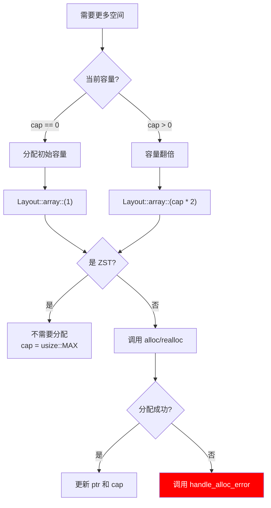

```rust
use std::alloc::{self, Layout};
use std::ptr::NonNull;

impl<T> Vec<T> {
    pub fn new() -> Self {
        // ZST 的容量设为 usize::MAX
        let cap = if mem::size_of::<T>() == 0 {
            usize::MAX
        } else {
            0
        };

        Vec {
            ptr: NonNull::dangling(),
            len: 0,
            cap,
            _marker: PhantomData,
        }
    }

    pub fn with_capacity(capacity: usize) -> Self {
        if mem::size_of::<T>() == 0 {
            return Vec::new();  // ZST 不需要分配
        }

        if capacity == 0 {
            return Vec::new();
        }

        let layout = Layout::array::<T>(capacity)
            .expect("capacity overflow");

        // 确保不超过 isize::MAX
        assert!(
            layout.size() <= isize::MAX as usize,
            "Allocation too large"
        );

        let ptr = unsafe { alloc::alloc(layout) };

        let ptr = match NonNull::new(ptr as *mut T) {
            Some(p) => p,
            None => alloc::handle_alloc_error(layout),
        };

        Vec {
            ptr,
            len: 0,
            cap: capacity,
            _marker: PhantomData,
        }
    }

    fn grow(&mut self) {
        // ZST 不需要增长
        if mem::size_of::<T>() == 0 {
            return;
        }

        let (new_cap, new_layout) = if self.cap == 0 {
            (1, Layout::array::<T>(1).unwrap())
        } else {
            // 容量翻倍，但不超过 isize::MAX
            let new_cap = self.cap.checked_mul(2).expect("capacity overflow");
            let new_layout = Layout::array::<T>(new_cap)
                .expect("capacity overflow");
            (new_cap, new_layout)
        };

        // 确保新布局不超过 isize::MAX
        assert!(
            new_layout.size() <= isize::MAX as usize,
            "Allocation too large"
        );

        let new_ptr = if self.cap == 0 {
            unsafe { alloc::alloc(new_layout) }
        } else {
            let old_layout = Layout::array::<T>(self.cap).unwrap();
            let old_ptr = self.ptr.as_ptr() as *mut u8;
            unsafe { alloc::realloc(old_ptr, old_layout, new_layout.size()) }
        };

        // 处理分配失败
        self.ptr = match NonNull::new(new_ptr as *mut T) {
            Some(p) => p,
            None => alloc::handle_alloc_error(new_layout),
        };
        self.cap = new_cap;
    }

    // 增长到至少指定容量
    fn grow_to(&mut self, min_cap: usize) {
        if mem::size_of::<T>() == 0 {
            return;
        }

        // 计算新容量：至少翻倍，至少达到 min_cap
        let new_cap = std::cmp::max(
            self.cap.checked_mul(2).unwrap_or(min_cap),
            min_cap
        );

        let new_layout = Layout::array::<T>(new_cap)
            .expect("capacity overflow");

        assert!(new_layout.size() <= isize::MAX as usize);

        let new_ptr = if self.cap == 0 {
            unsafe { alloc::alloc(new_layout) }
        } else {
            let old_layout = Layout::array::<T>(self.cap).unwrap();
            let old_ptr = self.ptr.as_ptr() as *mut u8;
            unsafe { alloc::realloc(old_ptr, old_layout, new_layout.size()) }
        };

        self.ptr = match NonNull::new(new_ptr as *mut T) {
            Some(p) => p,
            None => alloc::handle_alloc_error(new_layout),
        };
        self.cap = new_cap;
    }
}
```

### reserve 和 shrink_to_fit

```rust
impl<T> Vec<T> {
    /// 确保至少有 additional 个额外空间
    pub fn reserve(&mut self, additional: usize) {
        let required = self.len.checked_add(additional)
            .expect("capacity overflow");

        if required > self.cap {
            self.grow_to(required);
        }
    }

    /// 精确预留指定容量
    pub fn reserve_exact(&mut self, additional: usize) {
        let required = self.len.checked_add(additional)
            .expect("capacity overflow");

        if required > self.cap {
            // 不翻倍，精确分配所需容量
            if mem::size_of::<T>() == 0 {
                return;
            }

            let new_layout = Layout::array::<T>(required)
                .expect("capacity overflow");

            assert!(new_layout.size() <= isize::MAX as usize);

            let new_ptr = if self.cap == 0 {
                unsafe { alloc::alloc(new_layout) }
            } else {
                let old_layout = Layout::array::<T>(self.cap).unwrap();
                let old_ptr = self.ptr.as_ptr() as *mut u8;
                unsafe { alloc::realloc(old_ptr, old_layout, new_layout.size()) }
            };

            self.ptr = match NonNull::new(new_ptr as *mut T) {
                Some(p) => p,
                None => alloc::handle_alloc_error(new_layout),
            };
            self.cap = required;
        }
    }

    /// 缩减容量到当前长度
    pub fn shrink_to_fit(&mut self) {
        if mem::size_of::<T>() == 0 || self.cap == self.len {
            return;
        }

        if self.len == 0 {
            // 完全释放内存
            let layout = Layout::array::<T>(self.cap).unwrap();
            unsafe {
                alloc::dealloc(self.ptr.as_ptr() as *mut u8, layout);
            }
            self.ptr = NonNull::dangling();
            self.cap = 0;
        } else {
            // 重新分配到精确大小
            let new_layout = Layout::array::<T>(self.len).unwrap();
            let old_layout = Layout::array::<T>(self.cap).unwrap();
            let old_ptr = self.ptr.as_ptr() as *mut u8;

            let new_ptr = unsafe {
                alloc::realloc(old_ptr, old_layout, new_layout.size())
            };

            self.ptr = match NonNull::new(new_ptr as *mut T) {
                Some(p) => p,
                None => alloc::handle_alloc_error(new_layout),
            };
            self.cap = self.len;
        }
    }
}
```

### 分配增长可视化

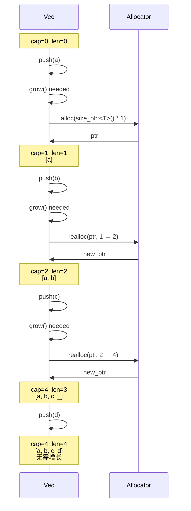

## 9.3 Push 和 Pop 深度解析

### Push 的完整实现

```rust
impl<T> Vec<T> {
    pub fn push(&mut self, elem: T) {
        // 检查是否需要增长
        if self.len == self.cap {
            self.grow();
        }

        unsafe {
            // ptr::write 将值移动到目标位置
            // 不会读取目标位置（因为那里是未初始化的）
            // 不会 drop 目标位置的旧值
            ptr::write(self.ptr.as_ptr().add(self.len), elem);
        }

        // 只有写入成功后才增加长度
        // 这保证了异常安全：如果 grow() panic，Vec 仍然有效
        self.len += 1;
    }
}
```

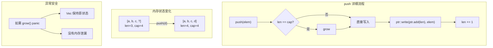

### Pop 的完整实现

```rust
impl<T> Vec<T> {
    pub fn pop(&mut self) -> Option<T> {
        if self.len == 0 {
            None
        } else {
            // 先减少长度
            self.len -= 1;
            unsafe {
                // ptr::read 创建值的按位副本
                // 原位置变为"未初始化"状态
                Some(ptr::read(self.ptr.as_ptr().add(self.len)))
            }
        }
    }
}
```

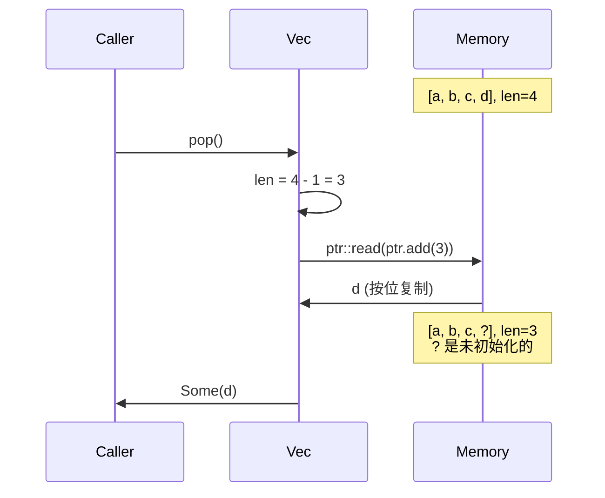

### push 和 pop 的边界情况

```rust
impl<T> Vec<T> {
    /// 尝试 push，如果分配失败返回 Err
    pub fn try_push(&mut self, elem: T) -> Result<(), T> {
        if self.len == self.cap {
            // 尝试增长，如果失败返回元素
            if let Err(()) = self.try_grow() {
                return Err(elem);
            }
        }

        unsafe {
            ptr::write(self.ptr.as_ptr().add(self.len), elem);
        }
        self.len += 1;
        Ok(())
    }

    fn try_grow(&mut self) -> Result<(), ()> {
        if mem::size_of::<T>() == 0 {
            return Ok(());
        }

        let (new_cap, new_layout) = if self.cap == 0 {
            (1, Layout::array::<T>(1).map_err(|_| ())?)
        } else {
            let new_cap = self.cap.checked_mul(2).ok_or(())?;
            let new_layout = Layout::array::<T>(new_cap).map_err(|_| ())?;
            (new_cap, new_layout)
        };

        if new_layout.size() > isize::MAX as usize {
            return Err(());
        }

        let new_ptr = if self.cap == 0 {
            unsafe { alloc::alloc(new_layout) }
        } else {
            let old_layout = Layout::array::<T>(self.cap).unwrap();
            let old_ptr = self.ptr.as_ptr() as *mut u8;
            unsafe { alloc::realloc(old_ptr, old_layout, new_layout.size()) }
        };

        match NonNull::new(new_ptr as *mut T) {
            Some(p) => {
                self.ptr = p;
                self.cap = new_cap;
                Ok(())
            }
            None => Err(()),
        }
    }

    /// 返回最后一个元素的引用（不移除）
    pub fn last(&self) -> Option<&T> {
        if self.len == 0 {
            None
        } else {
            Some(unsafe { &*self.ptr.as_ptr().add(self.len - 1) })
        }
    }

    /// 返回最后一个元素的可变引用
    pub fn last_mut(&mut self) -> Option<&mut T> {
        if self.len == 0 {
            None
        } else {
            Some(unsafe { &mut *self.ptr.as_ptr().add(self.len - 1) })
        }
    }
}
```

## 9.4 Insert 和 Remove 深度解析

### Insert 的完整实现

```rust
impl<T> Vec<T> {
    pub fn insert(&mut self, index: usize, elem: T) {
        // 允许 index == len（相当于 push）
        assert!(index <= self.len, "index out of bounds");

        // 检查是否需要增长
        if self.cap == self.len {
            self.grow();
        }

        unsafe {
            // 将 [index..len] 移动到 [index+1..len+1]
            // 使用 ptr::copy 因为源和目标可能重叠
            ptr::copy(
                self.ptr.as_ptr().add(index),      // 源
                self.ptr.as_ptr().add(index + 1),  // 目标
                self.len - index,                   // 元素数量
            );

            // 写入新元素
            ptr::write(self.ptr.as_ptr().add(index), elem);
        }

        self.len += 1;
    }
}
```

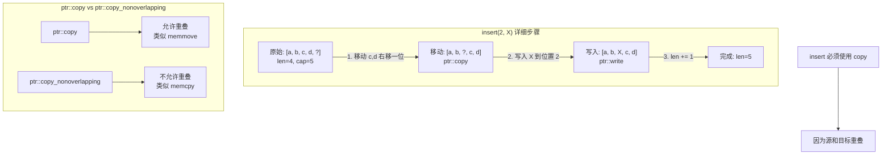

### Remove 的完整实现

```rust
impl<T> Vec<T> {
    pub fn remove(&mut self, index: usize) -> T {
        assert!(index < self.len, "index out of bounds");

        unsafe {
            // 先减少长度
            self.len -= 1;

            // 读取要移除的元素
            let result = ptr::read(self.ptr.as_ptr().add(index));

            // 将 [index+1..] 移动到 [index..]
            ptr::copy(
                self.ptr.as_ptr().add(index + 1),  // 源
                self.ptr.as_ptr().add(index),      // 目标
                self.len - index,                   // 元素数量
            );

            result
        }
    }

    /// 移除并返回最后一个元素（更高效）
    pub fn swap_remove(&mut self, index: usize) -> T {
        assert!(index < self.len, "index out of bounds");

        unsafe {
            let last_index = self.len - 1;

            // 交换目标元素和最后一个元素
            let ptr = self.ptr.as_ptr();
            ptr::swap(ptr.add(index), ptr.add(last_index));

            // 然后 pop
            self.pop().unwrap()
        }
    }
}
```

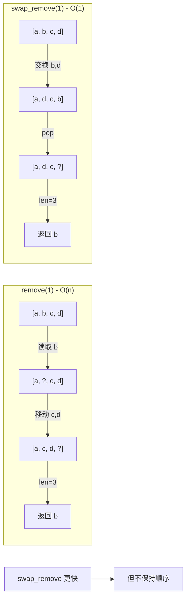

### truncate 和 clear

```rust
impl<T> Vec<T> {
    /// 截断到指定长度
    pub fn truncate(&mut self, len: usize) {
        // 异常安全版本
        // 使用 scope guard 确保即使 drop panic 也能正确处理
        while self.len > len {
            self.pop();
        }
    }

    /// 更高效但更复杂的 truncate
    pub fn truncate_efficient(&mut self, len: usize) {
        if len >= self.len {
            return;
        }

        // 需要 drop 的元素范围
        let remaining_len = self.len - len;
        let s = unsafe {
            std::slice::from_raw_parts_mut(
                self.ptr.as_ptr().add(len),
                remaining_len
            )
        };

        // 先设置长度（异常安全）
        self.len = len;

        // 然后 drop 元素
        unsafe {
            ptr::drop_in_place(s);
        }
    }

    /// 清空所有元素
    pub fn clear(&mut self) {
        self.truncate(0);
    }
}
```

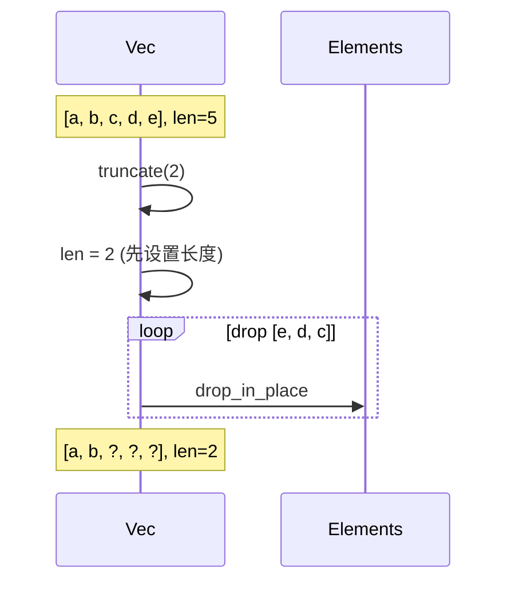

## 9.5 Dealloc 和 Drop 深度解析

### Drop 的完整实现

```rust
impl<T> Drop for Vec<T> {
    fn drop(&mut self) {
        if self.cap != 0 {
            // 首先 drop 所有元素
            // 使用 pop 确保异常安全
            while let Some(_) = self.pop() {}

            // 只有非 ZST 才需要释放内存
            if mem::size_of::<T>() != 0 {
                let layout = Layout::array::<T>(self.cap).unwrap();
                unsafe {
                    alloc::dealloc(self.ptr.as_ptr() as *mut u8, layout);
                }
            }
        }
    }
}
```

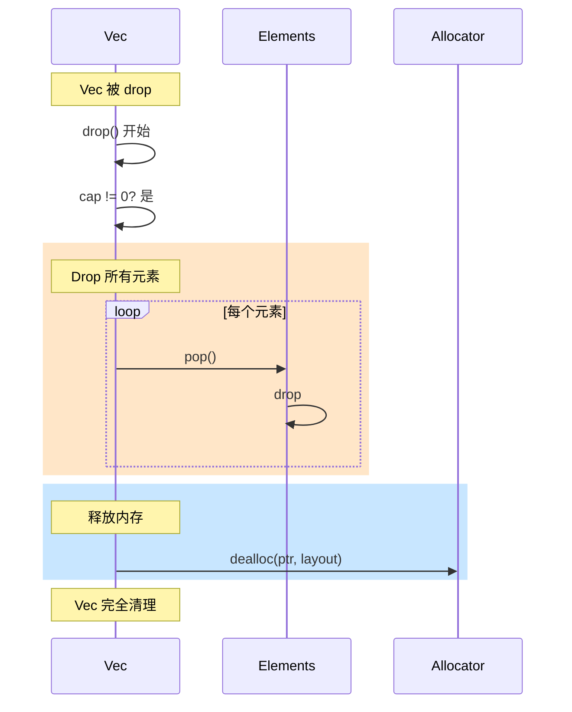

### 异常安全的 Drop

```rust
impl<T> Drop for Vec<T> {
    fn drop(&mut self) {
        if self.cap == 0 {
            return;
        }

        // 更高效的 drop：使用 drop_in_place
        // 但需要处理 panic 情况
        struct DropGuard<'a, T> {
            vec: &'a mut Vec<T>,
        }

        impl<T> Drop for DropGuard<'_, T> {
            fn drop(&mut self) {
                // 即使元素的 drop panic，也要释放内存
                if self.vec.cap != 0 && mem::size_of::<T>() != 0 {
                    let layout = Layout::array::<T>(self.vec.cap).unwrap();
                    unsafe {
                        alloc::dealloc(
                            self.vec.ptr.as_ptr() as *mut u8,
                            layout
                        );
                    }
                }
            }
        }

        // 创建 guard
        let guard = DropGuard { vec: self };

        // drop 所有元素
        unsafe {
            ptr::drop_in_place(std::slice::from_raw_parts_mut(
                guard.vec.ptr.as_ptr(),
                guard.vec.len,
            ));
        }

        // guard 的 drop 会释放内存
        // 即使 drop_in_place panic，guard 也会运行
    }
}
```

## 9.6 Deref 和切片操作

### Deref 实现

```rust
impl<T> Deref for Vec<T> {
    type Target = [T];

    fn deref(&self) -> &[T] {
        unsafe {
            std::slice::from_raw_parts(self.ptr.as_ptr(), self.len)
        }
    }
}

impl<T> DerefMut for Vec<T> {
    fn deref_mut(&mut self) -> &mut [T] {
        unsafe {
            std::slice::from_raw_parts_mut(self.ptr.as_ptr(), self.len)
        }
    }
}
```

### 索引操作

```rust
use std::ops::{Index, IndexMut};

impl<T> Index<usize> for Vec<T> {
    type Output = T;

    fn index(&self, index: usize) -> &T {
        &(**self)[index]  // 通过 Deref 到切片，然后索引
    }
}

impl<T> IndexMut<usize> for Vec<T> {
    fn index_mut(&mut self, index: usize) -> &mut T {
        &mut (**self)[index]
    }
}

// 也可以直接实现
impl<T> Vec<T> {
    pub fn get(&self, index: usize) -> Option<&T> {
        if index < self.len {
            Some(unsafe { &*self.ptr.as_ptr().add(index) })
        } else {
            None
        }
    }

    pub fn get_mut(&mut self, index: usize) -> Option<&mut T> {
        if index < self.len {
            Some(unsafe { &mut *self.ptr.as_ptr().add(index) })
        } else {
            None
        }
    }
}
```

### 其他切片方法

```rust
impl<T> Vec<T> {
    pub fn len(&self) -> usize {
        self.len
    }

    pub fn capacity(&self) -> usize {
        self.cap
    }

    pub fn is_empty(&self) -> bool {
        self.len == 0
    }

    pub fn as_ptr(&self) -> *const T {
        self.ptr.as_ptr()
    }

    pub fn as_mut_ptr(&mut self) -> *mut T {
        self.ptr.as_ptr()
    }

    pub fn as_slice(&self) -> &[T] {
        self
    }

    pub fn as_mut_slice(&mut self) -> &mut [T] {
        self
    }

    pub fn first(&self) -> Option<&T> {
        if self.len == 0 {
            None
        } else {
            Some(unsafe { &*self.ptr.as_ptr() })
        }
    }

    pub fn first_mut(&mut self) -> Option<&mut T> {
        if self.len == 0 {
            None
        } else {
            Some(unsafe { &mut *self.ptr.as_ptr() })
        }
    }
}
```

## 9.7 IntoIter 迭代器深度解析

### IntoIter 结构

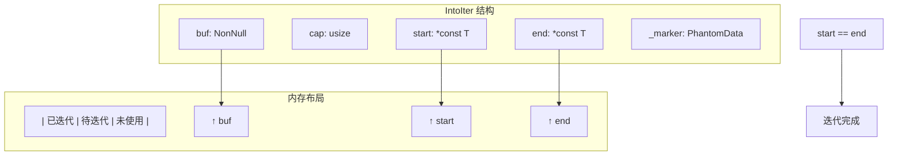

### 完整的 IntoIter 实现

```rust
use std::mem::ManuallyDrop;

pub struct IntoIter<T> {
    buf: NonNull<T>,    // 原始缓冲区指针（用于释放）
    cap: usize,         // 原始容量（用于释放）
    start: *const T,    // 当前迭代位置（前向）
    end: *const T,      // 结束位置（后向迭代用）
    _marker: PhantomData<T>,
}

impl<T> IntoIterator for Vec<T> {
    type Item = T;
    type IntoIter = IntoIter<T>;

    fn into_iter(self) -> IntoIter<T> {
        // 使用 ManuallyDrop 防止 Vec 的 drop 被调用
        // 因为我们要接管内存的所有权
        let vec = ManuallyDrop::new(self);

        let ptr = vec.ptr;
        let cap = vec.cap;
        let len = vec.len;

        unsafe {
            IntoIter {
                buf: ptr,
                cap,
                start: ptr.as_ptr(),
                end: if cap == 0 {
                    // 空 Vec 的特殊处理
                    ptr.as_ptr()
                } else {
                    ptr.as_ptr().add(len)
                },
                _marker: PhantomData,
            }
        }
    }
}

impl<T> Iterator for IntoIter<T> {
    type Item = T;

    fn next(&mut self) -> Option<T> {
        if self.start == self.end {
            None
        } else {
            unsafe {
                // 读取当前元素
                let result = ptr::read(self.start);
                // 前进到下一个
                self.start = self.start.offset(1);
                Some(result)
            }
        }
    }

    fn size_hint(&self) -> (usize, Option<usize>) {
        let len = self.len();
        (len, Some(len))
    }

    fn count(self) -> usize {
        self.len()
    }
}

impl<T> ExactSizeIterator for IntoIter<T> {
    fn len(&self) -> usize {
        let elem_size = mem::size_of::<T>();
        if elem_size == 0 {
            // ZST：使用指针值作为计数器
            (self.end as usize).wrapping_sub(self.start as usize)
        } else {
            let byte_diff = (self.end as usize) - (self.start as usize);
            byte_diff / elem_size
        }
    }
}

impl<T> DoubleEndedIterator for IntoIter<T> {
    fn next_back(&mut self) -> Option<T> {
        if self.start == self.end {
            None
        } else {
            unsafe {
                // 后退到前一个
                self.end = self.end.offset(-1);
                // 读取
                Some(ptr::read(self.end))
            }
        }
    }
}
```

### IntoIter 的 Drop

```rust
impl<T> Drop for IntoIter<T> {
    fn drop(&mut self) {
        // 首先 drop 所有剩余未迭代的元素
        // 通过迭代消耗它们
        for _ in &mut *self {}

        // 然后释放内存
        if self.cap != 0 && mem::size_of::<T>() != 0 {
            let layout = Layout::array::<T>(self.cap).unwrap();
            unsafe {
                alloc::dealloc(self.buf.as_ptr() as *mut u8, layout);
            }
        }
    }
}
```

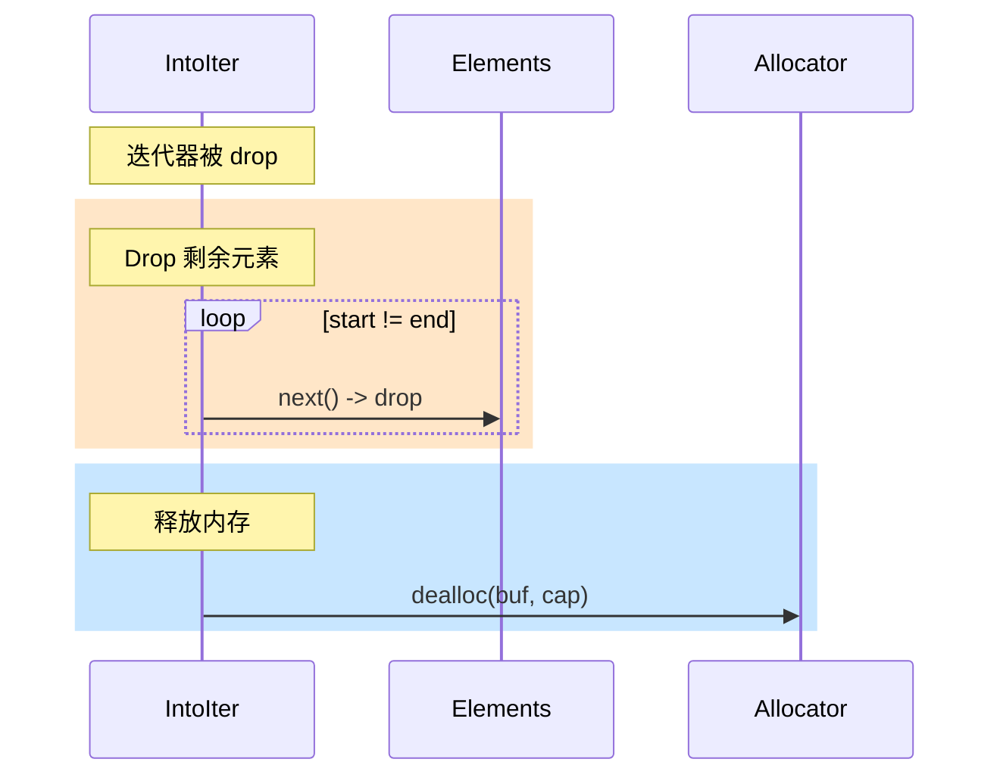

### IntoIter 的 Send 和 Sync

```rust
// IntoIter 拥有元素，所以遵循 T 的 Send/Sync
unsafe impl<T: Send> Send for IntoIter<T> {}
unsafe impl<T: Sync> Sync for IntoIter<T> {}
```

## 9.8 Drain 迭代器

### Drain 的设计

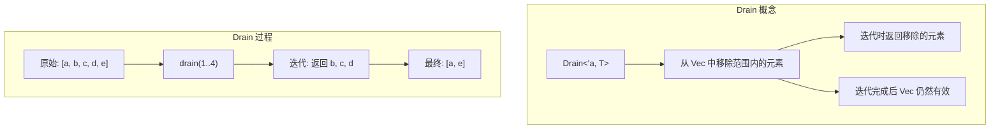

### Drain 结构

```rust
pub struct Drain<'a, T: 'a> {
    vec: NonNull<Vec<T>>,        // 指向原 Vec
    iter: std::slice::Iter<'a, T>,  // 范围内元素的迭代器
    tail_start: usize,            // 范围后元素的起始索引
    tail_len: usize,              // 范围后元素的数量
    _marker: PhantomData<&'a mut Vec<T>>,
}

impl<T> Vec<T> {
    pub fn drain<R>(&mut self, range: R) -> Drain<'_, T>
    where
        R: std::ops::RangeBounds<usize>,
    {
        use std::ops::Bound;

        let len = self.len;
        let start = match range.start_bound() {
            Bound::Included(&n) => n,
            Bound::Excluded(&n) => n + 1,
            Bound::Unbounded => 0,
        };
        let end = match range.end_bound() {
            Bound::Included(&n) => n + 1,
            Bound::Excluded(&n) => n,
            Bound::Unbounded => len,
        };

        assert!(start <= end);
        assert!(end <= len);

        unsafe {
            // 设置 Vec 长度为 start
            // 这样如果 Drain 被泄漏，Vec 仍然有效
            self.len = start;

            let range_slice = std::slice::from_raw_parts(
                self.ptr.as_ptr().add(start),
                end - start,
            );

            Drain {
                vec: NonNull::new_unchecked(self as *mut Vec<T>),
                iter: range_slice.iter(),
                tail_start: end,
                tail_len: len - end,
                _marker: PhantomData,
            }
        }
    }
}
```

### Drain 的 Iterator 实现

```rust
impl<'a, T> Iterator for Drain<'a, T> {
    type Item = T;

    fn next(&mut self) -> Option<T> {
        self.iter.next().map(|ptr| unsafe { ptr::read(ptr) })
    }

    fn size_hint(&self) -> (usize, Option<usize>) {
        self.iter.size_hint()
    }
}

impl<'a, T> DoubleEndedIterator for Drain<'a, T> {
    fn next_back(&mut self) -> Option<T> {
        self.iter.next_back().map(|ptr| unsafe { ptr::read(ptr) })
    }
}

impl<'a, T> ExactSizeIterator for Drain<'a, T> {}
```

### Drain 的 Drop（关键！）

```rust
impl<'a, T> Drop for Drain<'a, T> {
    fn drop(&mut self) {
        // 首先 drop 所有剩余未迭代的元素
        while let Some(_) = self.next() {}

        // 然后移动尾部元素填补空白
        if self.tail_len > 0 {
            unsafe {
                let vec = self.vec.as_mut();
                let start = vec.len;

                ptr::copy(
                    vec.ptr.as_ptr().add(self.tail_start),
                    vec.ptr.as_ptr().add(start),
                    self.tail_len,
                );

                vec.len = start + self.tail_len;
            }
        }
    }
}
```

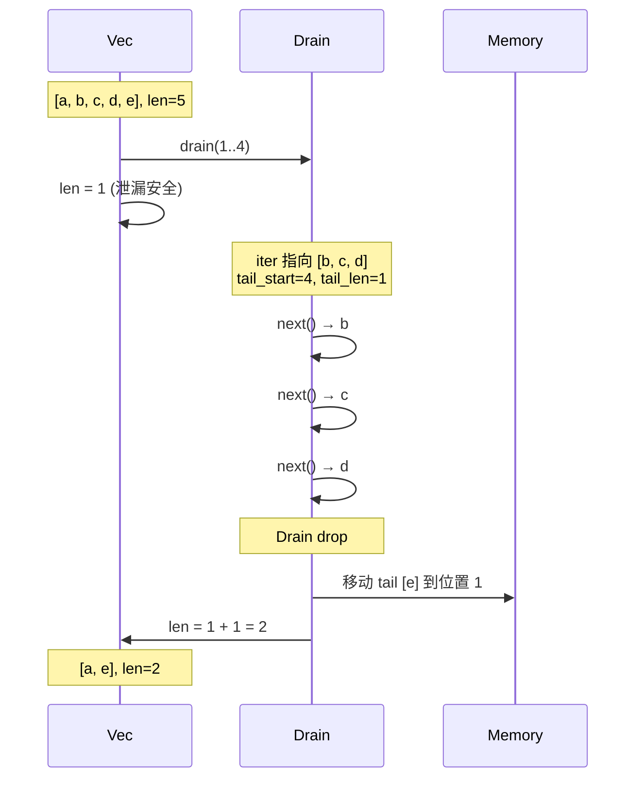

### Drain 的泄漏安全

```rust
// 如果 Drain 被泄漏（mem::forget），Vec 仍然有效
fn drain_leak_safety() {
    let mut v = vec![1, 2, 3, 4, 5];

    {
        let drain = v.drain(1..4);
        // 假设这里发生了泄漏
        std::mem::forget(drain);
    }

    // v.len 已经被设为 1
    // 所以 v 仍然是有效的 [1]
    // 但元素 2, 3, 4 被泄漏了
    // 元素 5 也被泄漏了（因为 tail 没有移动）

    assert_eq!(v.len(), 1);
    assert_eq!(v[0], 1);
}
```

## 9.9 处理零大小类型 (ZST) 深度解析

### ZST 的特殊性

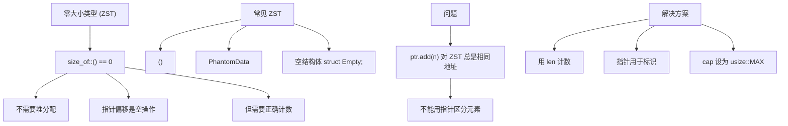

### ZST 安全的完整实现

```rust
impl<T> Vec<T> {
    pub fn new() -> Self {
        let cap = if mem::size_of::<T>() == 0 {
            usize::MAX  // ZST 可以存储"无限"个
        } else {
            0
        };

        Vec {
            ptr: NonNull::dangling(),
            len: 0,
            cap,
            _marker: PhantomData,
        }
    }

    fn is_zst() -> bool {
        mem::size_of::<T>() == 0
    }

    fn grow(&mut self) {
        if Self::is_zst() {
            // ZST 不需要增长，cap 已经是 usize::MAX
            return;
        }

        // 正常类型的增长逻辑...
        let (new_cap, new_layout) = if self.cap == 0 {
            (1, Layout::array::<T>(1).unwrap())
        } else {
            let new_cap = self.cap.checked_mul(2).expect("capacity overflow");
            (new_cap, Layout::array::<T>(new_cap).unwrap())
        };

        assert!(new_layout.size() <= isize::MAX as usize);

        let new_ptr = if self.cap == 0 {
            unsafe { alloc::alloc(new_layout) }
        } else {
            let old_layout = Layout::array::<T>(self.cap).unwrap();
            let old_ptr = self.ptr.as_ptr() as *mut u8;
            unsafe { alloc::realloc(old_ptr, old_layout, new_layout.size()) }
        };

        self.ptr = match NonNull::new(new_ptr as *mut T) {
            Some(p) => p,
            None => alloc::handle_alloc_error(new_layout),
        };
        self.cap = new_cap;
    }

    pub fn push(&mut self, elem: T) {
        if Self::is_zst() {
            // ZST: 检查溢出
            assert!(self.len < usize::MAX, "capacity overflow");
            self.len += 1;
            // 不需要存储元素，因为它是零大小的
            mem::forget(elem);
            return;
        }

        if self.len == self.cap {
            self.grow();
        }

        unsafe {
            ptr::write(self.ptr.as_ptr().add(self.len), elem);
        }
        self.len += 1;
    }

    pub fn pop(&mut self) -> Option<T> {
        if self.len == 0 {
            None
        } else {
            self.len -= 1;

            if Self::is_zst() {
                // ZST: 创建一个新实例
                // 安全：ZST 的任何位模式都是有效的
                Some(unsafe { mem::zeroed() })
            } else {
                unsafe {
                    Some(ptr::read(self.ptr.as_ptr().add(self.len)))
                }
            }
        }
    }
}

impl<T> Drop for Vec<T> {
    fn drop(&mut self) {
        if Self::is_zst() {
            // ZST 不需要 drop 元素（它们是零大小的）
            // 也不需要释放内存
            return;
        }

        if self.cap != 0 {
            while let Some(_) = self.pop() {}

            let layout = Layout::array::<T>(self.cap).unwrap();
            unsafe {
                alloc::dealloc(self.ptr.as_ptr() as *mut u8, layout);
            }
        }
    }
}
```

### ZST 的 IntoIter

```rust
impl<T> Iterator for IntoIter<T> {
    type Item = T;

    fn next(&mut self) -> Option<T> {
        if self.start == self.end {
            None
        } else if mem::size_of::<T>() == 0 {
            // ZST: 使用指针值作为计数器
            self.start = (self.start as usize + 1) as *const T;
            Some(unsafe { mem::zeroed() })
        } else {
            unsafe {
                let result = ptr::read(self.start);
                self.start = self.start.offset(1);
                Some(result)
            }
        }
    }
}

impl<T> DoubleEndedIterator for IntoIter<T> {
    fn next_back(&mut self) -> Option<T> {
        if self.start == self.end {
            None
        } else if mem::size_of::<T>() == 0 {
            // ZST: 使用指针值作为计数器
            self.end = (self.end as usize - 1) as *const T;
            Some(unsafe { mem::zeroed() })
        } else {
            unsafe {
                self.end = self.end.offset(-1);
                Some(ptr::read(self.end))
            }
        }
    }
}
```

### ZST 示例

```rust
fn zst_demo() {
    // 空结构体是 ZST
    struct Empty;

    let mut v: Vec<Empty> = Vec::new();
    assert_eq!(mem::size_of::<Empty>(), 0);

    // 可以存储很多 ZST
    for _ in 0..1000 {
        v.push(Empty);
    }

    assert_eq!(v.len(), 1000);
    assert_eq!(v.capacity(), usize::MAX);

    // 弹出
    let _ = v.pop();
    assert_eq!(v.len(), 999);

    // 迭代
    for _ in v.into_iter().take(10) {
        // 每次迭代都会创建一个新的 Empty
    }

    // () 也是 ZST
    let units: Vec<()> = vec![(), (), ()];
    assert_eq!(units.len(), 3);
    assert_eq!(mem::size_of_val(&units), mem::size_of::<Vec<()>>());
}
```

## 9.10 RawVec 抽象

### 分离分配逻辑的好处

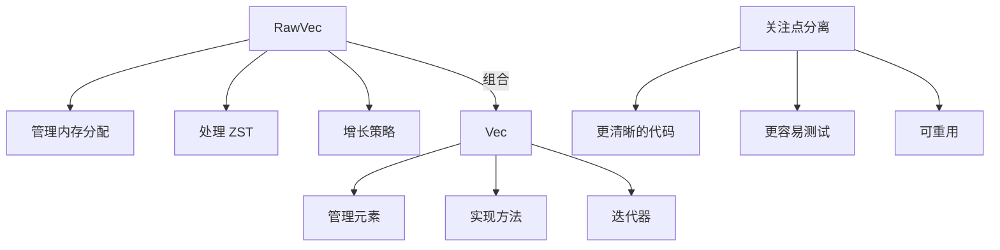

### 完整的 RawVec 实现

```rust
struct RawVec<T> {
    ptr: NonNull<T>,
    cap: usize,
    _marker: PhantomData<T>,
}

impl<T> RawVec<T> {
    const IS_ZST: bool = mem::size_of::<T>() == 0;

    fn new() -> Self {
        let cap = if Self::IS_ZST { usize::MAX } else { 0 };
        RawVec {
            ptr: NonNull::dangling(),
            cap,
            _marker: PhantomData,
        }
    }

    fn with_capacity(capacity: usize) -> Self {
        if Self::IS_ZST {
            return Self::new();
        }

        if capacity == 0 {
            return Self::new();
        }

        let layout = Layout::array::<T>(capacity).expect("capacity overflow");
        assert!(layout.size() <= isize::MAX as usize);

        let ptr = unsafe { alloc::alloc(layout) };
        let ptr = match NonNull::new(ptr as *mut T) {
            Some(p) => p,
            None => alloc::handle_alloc_error(layout),
        };

        RawVec {
            ptr,
            cap: capacity,
            _marker: PhantomData,
        }
    }

    fn grow(&mut self) {
        if Self::IS_ZST {
            return;
        }

        let (new_cap, new_layout) = if self.cap == 0 {
            (1, Layout::array::<T>(1).unwrap())
        } else {
            let new_cap = self.cap.checked_mul(2).expect("capacity overflow");
            (new_cap, Layout::array::<T>(new_cap).unwrap())
        };

        assert!(new_layout.size() <= isize::MAX as usize);

        let new_ptr = if self.cap == 0 {
            unsafe { alloc::alloc(new_layout) }
        } else {
            let old_layout = Layout::array::<T>(self.cap).unwrap();
            unsafe {
                alloc::realloc(
                    self.ptr.as_ptr() as *mut u8,
                    old_layout,
                    new_layout.size(),
                )
            }
        };

        self.ptr = match NonNull::new(new_ptr as *mut T) {
            Some(p) => p,
            None => alloc::handle_alloc_error(new_layout),
        };
        self.cap = new_cap;
    }

    fn grow_to(&mut self, min_cap: usize) {
        if Self::IS_ZST || min_cap <= self.cap {
            return;
        }

        let new_cap = std::cmp::max(
            self.cap.checked_mul(2).unwrap_or(min_cap),
            min_cap,
        );

        let new_layout = Layout::array::<T>(new_cap).expect("capacity overflow");
        assert!(new_layout.size() <= isize::MAX as usize);

        let new_ptr = if self.cap == 0 {
            unsafe { alloc::alloc(new_layout) }
        } else {
            let old_layout = Layout::array::<T>(self.cap).unwrap();
            unsafe {
                alloc::realloc(
                    self.ptr.as_ptr() as *mut u8,
                    old_layout,
                    new_layout.size(),
                )
            }
        };

        self.ptr = match NonNull::new(new_ptr as *mut T) {
            Some(p) => p,
            None => alloc::handle_alloc_error(new_layout),
        };
        self.cap = new_cap;
    }
}

impl<T> Drop for RawVec<T> {
    fn drop(&mut self) {
        if Self::IS_ZST || self.cap == 0 {
            return;
        }

        let layout = Layout::array::<T>(self.cap).unwrap();
        unsafe {
            alloc::dealloc(self.ptr.as_ptr() as *mut u8, layout);
        }
    }
}

// RawVec 的 Send 和 Sync
unsafe impl<T: Send> Send for RawVec<T> {}
unsafe impl<T: Sync> Sync for RawVec<T> {}
```

### 使用 RawVec 的 Vec

```rust
pub struct Vec<T> {
    buf: RawVec<T>,
    len: usize,
}

impl<T> Vec<T> {
    pub fn new() -> Self {
        Vec {
            buf: RawVec::new(),
            len: 0,
        }
    }

    pub fn with_capacity(capacity: usize) -> Self {
        Vec {
            buf: RawVec::with_capacity(capacity),
            len: 0,
        }
    }

    fn ptr(&self) -> *mut T {
        self.buf.ptr.as_ptr()
    }

    fn cap(&self) -> usize {
        self.buf.cap
    }

    pub fn push(&mut self, elem: T) {
        if self.len == self.cap() {
            self.buf.grow();
        }

        unsafe {
            ptr::write(self.ptr().add(self.len), elem);
        }
        self.len += 1;
    }

    pub fn pop(&mut self) -> Option<T> {
        if self.len == 0 {
            None
        } else {
            self.len -= 1;
            unsafe { Some(ptr::read(self.ptr().add(self.len))) }
        }
    }

    pub fn reserve(&mut self, additional: usize) {
        let required = self.len.checked_add(additional).expect("capacity overflow");
        if required > self.cap() {
            self.buf.grow_to(required);
        }
    }

    // ... 其他方法
}

impl<T> Drop for Vec<T> {
    fn drop(&mut self) {
        while let Some(_) = self.pop() {}
        // RawVec 的 drop 会处理内存释放
    }
}
```

## 9.11 完整的 Vec 实现

### 汇总所有代码

```rust
#![allow(dead_code)]

use std::alloc::{self, Layout};
use std::marker::PhantomData;
use std::mem::{self, ManuallyDrop};
use std::ops::{Deref, DerefMut, Index, IndexMut};
use std::ptr::{self, NonNull};

// ==================== RawVec ====================

struct RawVec<T> {
    ptr: NonNull<T>,
    cap: usize,
    _marker: PhantomData<T>,
}

unsafe impl<T: Send> Send for RawVec<T> {}
unsafe impl<T: Sync> Sync for RawVec<T> {}

impl<T> RawVec<T> {
    const IS_ZST: bool = mem::size_of::<T>() == 0;

    fn new() -> Self {
        let cap = if Self::IS_ZST { usize::MAX } else { 0 };
        RawVec {
            ptr: NonNull::dangling(),
            cap,
            _marker: PhantomData,
        }
    }

    fn with_capacity(capacity: usize) -> Self {
        if Self::IS_ZST || capacity == 0 {
            return Self::new();
        }

        let layout = Layout::array::<T>(capacity).expect("capacity overflow");
        assert!(layout.size() <= isize::MAX as usize);

        let ptr = unsafe { alloc::alloc(layout) };
        let ptr = match NonNull::new(ptr as *mut T) {
            Some(p) => p,
            None => alloc::handle_alloc_error(layout),
        };

        RawVec { ptr, cap: capacity, _marker: PhantomData }
    }

    fn grow(&mut self) {
        if Self::IS_ZST { return; }

        let (new_cap, new_layout) = if self.cap == 0 {
            (1, Layout::array::<T>(1).unwrap())
        } else {
            let new_cap = self.cap.checked_mul(2).expect("capacity overflow");
            (new_cap, Layout::array::<T>(new_cap).unwrap())
        };

        assert!(new_layout.size() <= isize::MAX as usize);

        let new_ptr = if self.cap == 0 {
            unsafe { alloc::alloc(new_layout) }
        } else {
            let old_layout = Layout::array::<T>(self.cap).unwrap();
            unsafe { alloc::realloc(self.ptr.as_ptr() as *mut u8, old_layout, new_layout.size()) }
        };

        self.ptr = match NonNull::new(new_ptr as *mut T) {
            Some(p) => p,
            None => alloc::handle_alloc_error(new_layout),
        };
        self.cap = new_cap;
    }
}

impl<T> Drop for RawVec<T> {
    fn drop(&mut self) {
        if !Self::IS_ZST && self.cap != 0 {
            let layout = Layout::array::<T>(self.cap).unwrap();
            unsafe { alloc::dealloc(self.ptr.as_ptr() as *mut u8, layout); }
        }
    }
}

// ==================== Vec ====================

pub struct Vec<T> {
    buf: RawVec<T>,
    len: usize,
}

unsafe impl<T: Send> Send for Vec<T> {}
unsafe impl<T: Sync> Sync for Vec<T> {}

impl<T> Vec<T> {
    pub fn new() -> Self {
        Vec { buf: RawVec::new(), len: 0 }
    }

    pub fn with_capacity(capacity: usize) -> Self {
        Vec { buf: RawVec::with_capacity(capacity), len: 0 }
    }

    pub fn len(&self) -> usize { self.len }
    pub fn capacity(&self) -> usize { self.buf.cap }
    pub fn is_empty(&self) -> bool { self.len == 0 }

    fn ptr(&self) -> *mut T { self.buf.ptr.as_ptr() }

    pub fn push(&mut self, elem: T) {
        if self.len == self.buf.cap { self.buf.grow(); }
        unsafe { ptr::write(self.ptr().add(self.len), elem); }
        self.len += 1;
    }

    pub fn pop(&mut self) -> Option<T> {
        if self.len == 0 {
            None
        } else {
            self.len -= 1;
            unsafe { Some(ptr::read(self.ptr().add(self.len))) }
        }
    }

    pub fn insert(&mut self, index: usize, elem: T) {
        assert!(index <= self.len);
        if self.buf.cap == self.len { self.buf.grow(); }
        unsafe {
            ptr::copy(self.ptr().add(index), self.ptr().add(index + 1), self.len - index);
            ptr::write(self.ptr().add(index), elem);
        }
        self.len += 1;
    }

    pub fn remove(&mut self, index: usize) -> T {
        assert!(index < self.len);
        self.len -= 1;
        unsafe {
            let result = ptr::read(self.ptr().add(index));
            ptr::copy(self.ptr().add(index + 1), self.ptr().add(index), self.len - index);
            result
        }
    }
}

impl<T> Drop for Vec<T> {
    fn drop(&mut self) {
        while let Some(_) = self.pop() {}
    }
}

impl<T> Deref for Vec<T> {
    type Target = [T];
    fn deref(&self) -> &[T] {
        unsafe { std::slice::from_raw_parts(self.ptr(), self.len) }
    }
}

impl<T> DerefMut for Vec<T> {
    fn deref_mut(&mut self) -> &mut [T] {
        unsafe { std::slice::from_raw_parts_mut(self.ptr(), self.len) }
    }
}

// ==================== IntoIter ====================

pub struct IntoIter<T> {
    _buf: RawVec<T>,
    start: *const T,
    end: *const T,
}

unsafe impl<T: Send> Send for IntoIter<T> {}
unsafe impl<T: Sync> Sync for IntoIter<T> {}

impl<T> IntoIterator for Vec<T> {
    type Item = T;
    type IntoIter = IntoIter<T>;

    fn into_iter(self) -> IntoIter<T> {
        let vec = ManuallyDrop::new(self);
        let ptr = vec.ptr();
        let cap = vec.buf.cap;
        let len = vec.len;

        IntoIter {
            _buf: RawVec { ptr: vec.buf.ptr, cap, _marker: PhantomData },
            start: ptr,
            end: if cap == 0 { ptr } else { unsafe { ptr.add(len) } },
        }
    }
}

impl<T> Iterator for IntoIter<T> {
    type Item = T;
    fn next(&mut self) -> Option<T> {
        if self.start == self.end {
            None
        } else {
            unsafe {
                let result = ptr::read(self.start);
                self.start = self.start.offset(1);
                Some(result)
            }
        }
    }

    fn size_hint(&self) -> (usize, Option<usize>) {
        let len = (self.end as usize - self.start as usize) / mem::size_of::<T>();
        (len, Some(len))
    }
}

impl<T> DoubleEndedIterator for IntoIter<T> {
    fn next_back(&mut self) -> Option<T> {
        if self.start == self.end {
            None
        } else {
            unsafe {
                self.end = self.end.offset(-1);
                Some(ptr::read(self.end))
            }
        }
    }
}

impl<T> Drop for IntoIter<T> {
    fn drop(&mut self) {
        for _ in &mut *self {}
    }
}

// ==================== 测试 ====================

#[cfg(test)]
mod tests {
    use super::*;

    #[test]
    fn test_basic() {
        let mut v = Vec::new();
        v.push(1);
        v.push(2);
        v.push(3);
        assert_eq!(v.len(), 3);
        assert_eq!(v.pop(), Some(3));
        assert_eq!(v.pop(), Some(2));
        assert_eq!(v.pop(), Some(1));
        assert_eq!(v.pop(), None);
    }

    #[test]
    fn test_insert_remove() {
        let mut v = Vec::new();
        v.push(1);
        v.push(3);
        v.insert(1, 2);
        assert_eq!(&*v, &[1, 2, 3]);
        assert_eq!(v.remove(1), 2);
        assert_eq!(&*v, &[1, 3]);
    }

    #[test]
    fn test_into_iter() {
        let mut v = Vec::new();
        v.push(1);
        v.push(2);
        v.push(3);

        let mut iter = v.into_iter();
        assert_eq!(iter.next(), Some(1));
        assert_eq!(iter.next_back(), Some(3));
        assert_eq!(iter.next(), Some(2));
        assert_eq!(iter.next(), None);
    }

    #[test]
    fn test_zst() {
        let mut v: Vec<()> = Vec::new();
        v.push(());
        v.push(());
        v.push(());
        assert_eq!(v.len(), 3);
        assert_eq!(v.capacity(), usize::MAX);
    }
}
```

## 9.12 总结

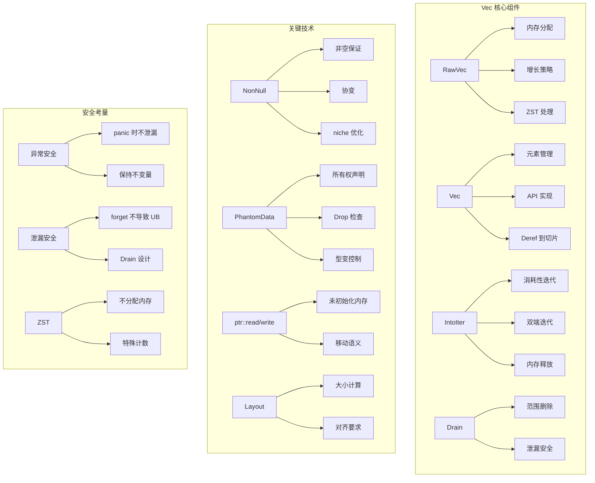

### 核心要点

1. **使用 NonNull 和 PhantomData**：正确表达所有权和型变语义
2. **分离 RawVec**：内存管理与元素管理分离，代码更清晰
3. **处理 ZST**：零大小类型需要特殊处理，不能依赖指针偏移
4. **异常安全**：每个操作后 Vec 都应处于有效状态
5. **泄漏安全**：即使迭代器被 forget，原集合也应该有效
6. **正确实现 Drop**：先 drop 元素，再释放内存
7. **Send/Sync**：正确实现线程安全 trait

### 设计决策总结

| 决策 | 选择 | 原因 |
|------|------|------|
| 指针类型 | NonNull<T> | 非空保证 + 协变 + niche 优化 |
| 所有权标记 | PhantomData<T> | 告诉编译器拥有 T |
| 增长策略 | 容量翻倍 | 均摊 O(1) push |
| ZST 容量 | usize::MAX | 不需要分配，无限容量 |
| Drop 顺序 | 先元素后内存 | 避免 use-after-free |

### 检查清单

实现类似 Vec 的数据结构时，确保：

- [ ] 使用 NonNull 而不是 *mut T
- [ ] 添加 PhantomData 声明所有权
- [ ] 正确处理 ZST
- [ ] 实现 Send 和 Sync（如果适用）
- [ ] 异常安全：panic 时不泄漏内存
- [ ] 泄漏安全：forget 不导致 UB
- [ ] 正确的 Drop 实现
- [ ] 检查分配大小不超过 isize::MAX
- [ ] 处理分配失败
- [ ] 迭代器正确释放内存

---

下一章：[实现 Arc](./10-arc.md)
