# 第十章：实现 Arc (Implementing Arc) 深度解析（扩展版）

## 概述

`Arc`（Atomic Reference Counting，原子引用计数）是 Rust 中用于线程间共享数据的核心类型。实现 Arc 需要深入理解原子操作、内存序和 unsafe Rust。本章从零开始实现一个完整的 Arc，并探讨其背后的设计决策。

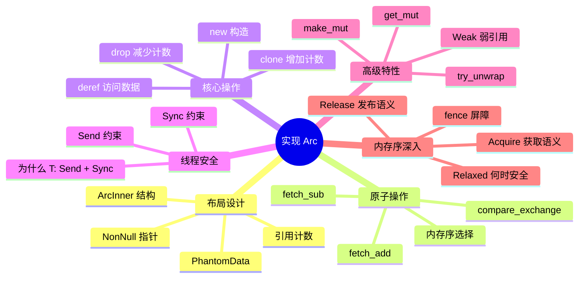

## 10.1 Arc vs Rc：理解差异

### 为什么需要 Arc？

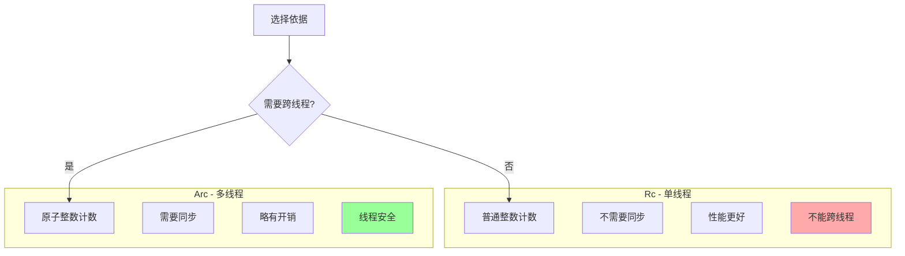

### 引用计数对比

```rust
use std::cell::Cell;
use std::sync::atomic::{AtomicUsize, Ordering};

// Rc 的计数器（简化）
struct RcCounter {
    count: Cell<usize>,  // 非原子，不能跨线程
}

impl RcCounter {
    fn increment(&self) {
        let old = self.count.get();
        self.count.set(old + 1);  // 不是原子操作！
        // 在这两行之间如果有另一个线程也执行 increment
        // 就会导致计数丢失（数据竞争）
    }

    fn decrement(&self) -> usize {
        let old = self.count.get();
        self.count.set(old - 1);
        old
    }
}

// Arc 的计数器
struct ArcCounter {
    count: AtomicUsize,  // 原子，线程安全
}

impl ArcCounter {
    fn increment(&self) {
        // 原子操作，即使多线程同时执行也是安全的
        self.count.fetch_add(1, Ordering::Relaxed);
    }

    fn decrement(&self) -> usize {
        self.count.fetch_sub(1, Ordering::Release)
    }
}

// 演示为什么 Rc 不能跨线程
fn rc_not_send() {
    use std::rc::Rc;

    let rc = Rc::new(42);

    // 编译错误！Rc 不是 Send
    // std::thread::spawn(move || {
    //     println!("{}", rc);
    // });

    // 但 Arc 可以
    use std::sync::Arc;
    let arc = Arc::new(42);

    std::thread::spawn(move || {
        println!("{}", arc);  // OK
    }).join().unwrap();
}
```

## 10.2 Arc 的内存布局详解

### 完整的结构定义

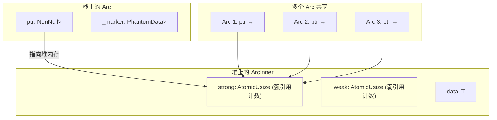

### 详细的结构实现

```rust
use std::sync::atomic::{AtomicUsize, Ordering};
use std::ptr::NonNull;
use std::marker::PhantomData;
use std::alloc::{self, Layout};
use std::mem;

// 堆上的数据结构
#[repr(C)]  // 确保字段顺序和对齐
struct ArcInner<T> {
    // 强引用计数：有多少个 Arc 指向这个数据
    strong: AtomicUsize,

    // 弱引用计数：有多少个 Weak + 1（如果 strong > 0）
    // 完整实现需要这个，简化版本可以省略
    weak: AtomicUsize,

    // 实际的数据
    data: T,
}

// Arc 本身只是一个指针
pub struct Arc<T> {
    // NonNull 保证非空，并且是协变的
    ptr: NonNull<ArcInner<T>>,

    // PhantomData 告诉编译器我们"拥有" ArcInner<T>
    // 这影响 Drop 检查和型变
    _marker: PhantomData<ArcInner<T>>,
}

// Weak 引用（可选实现）
pub struct Weak<T> {
    ptr: NonNull<ArcInner<T>>,
    _marker: PhantomData<ArcInner<T>>,
}
```

### 为什么使用 NonNull？

```rust
use std::ptr::NonNull;

fn nonnull_benefits() {
    // 1. 非空保证
    // NonNull<T> 永远不能是 null
    // 这让编译器可以进行优化

    // 2. 协变性
    // NonNull<T> 对 T 是协变的
    // 这意味着 NonNull<&'static str> 可以用于 NonNull<&'a str>

    // 3. niche 优化
    // Option<NonNull<T>> 与 NonNull<T> 大小相同
    assert_eq!(
        std::mem::size_of::<Option<NonNull<i32>>>(),
        std::mem::size_of::<NonNull<i32>>()
    );

    // 对比 *mut T
    // Option<*mut T> 需要额外空间
    assert_eq!(
        std::mem::size_of::<Option<*mut i32>>(),
        std::mem::size_of::<*mut i32>() * 2  // 16 字节 vs 8 字节
    );
}
```

### PhantomData 的作用

```rust
use std::marker::PhantomData;
use std::ptr::NonNull;

// 没有 PhantomData 的问题
struct BadArc<T> {
    ptr: NonNull<ArcInner<T>>,
    // 编译器不知道我们"拥有" T
}

// 使用 PhantomData
struct GoodArc<T> {
    ptr: NonNull<ArcInner<T>>,
    _marker: PhantomData<ArcInner<T>>,  // 声明所有权
}

// PhantomData 的影响：

// 1. Drop 检查
// 编译器知道 GoodArc drop 时可能 drop T
// 这影响借用检查

// 2. 型变（Variance）
// PhantomData<ArcInner<T>> 使得 Arc<T> 对 T 协变
// Arc<&'static str> 可以赋值给 Arc<&'a str>

// 3. 自动 trait
// 如果 T: Send + Sync，PhantomData<T> 也是 Send + Sync
// 但我们手动实现，所以这不重要

// 为什么是 PhantomData<ArcInner<T>> 而不是 PhantomData<T>?
// 因为我们拥有的是整个 ArcInner，不只是 T
// 这影响 Drop 顺序和型变

struct ArcInner<T> {
    strong: std::sync::atomic::AtomicUsize,
    weak: std::sync::atomic::AtomicUsize,
    data: T,
}
```

## 10.3 构造函数详解

### 基本构造

```rust
use std::sync::atomic::AtomicUsize;
use std::ptr::NonNull;
use std::marker::PhantomData;

struct ArcInner<T> {
    strong: AtomicUsize,
    data: T,
}

pub struct Arc<T> {
    ptr: NonNull<ArcInner<T>>,
    _marker: PhantomData<ArcInner<T>>,
}

impl<T> Arc<T> {
    pub fn new(data: T) -> Arc<T> {
        // 1. 在堆上分配 ArcInner
        let inner = Box::new(ArcInner {
            strong: AtomicUsize::new(1),  // 初始计数为 1
            data,
        });

        // 2. 将 Box 转换为裸指针
        // Box::into_raw 消耗 Box，返回裸指针
        // 内存不会被释放
        let raw_ptr: *mut ArcInner<T> = Box::into_raw(inner);

        // 3. 包装成 NonNull
        Arc {
            ptr: unsafe {
                // 安全：Box::into_raw 返回非空指针
                NonNull::new_unchecked(raw_ptr)
            },
            _marker: PhantomData,
        }
    }
}
```

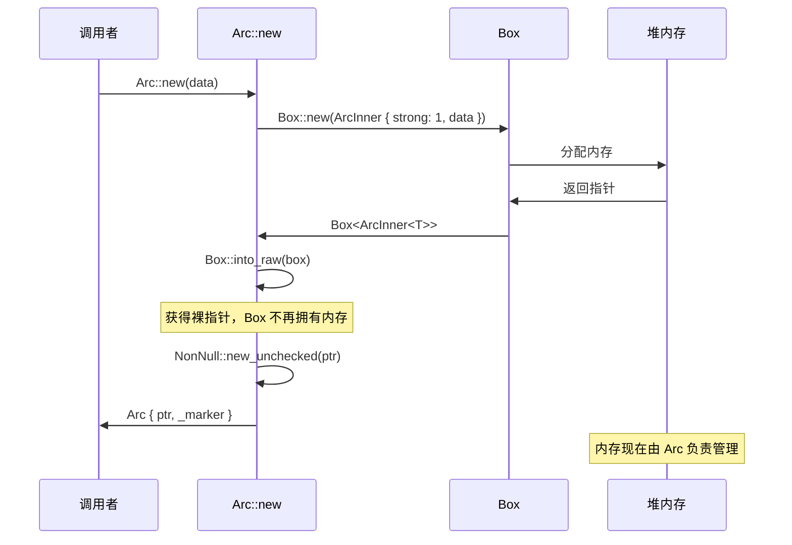

### 更高效的构造（直接分配）

```rust
use std::alloc::{self, Layout};
use std::sync::atomic::AtomicUsize;
use std::ptr::{self, NonNull};
use std::marker::PhantomData;
use std::mem;

struct ArcInner<T> {
    strong: AtomicUsize,
    data: T,
}

pub struct Arc<T> {
    ptr: NonNull<ArcInner<T>>,
    _marker: PhantomData<ArcInner<T>>,
}

impl<T> Arc<T> {
    // 使用全局分配器直接分配
    pub fn new_with_alloc(data: T) -> Arc<T> {
        let layout = Layout::new::<ArcInner<T>>();

        let ptr = unsafe {
            let raw = alloc::alloc(layout) as *mut ArcInner<T>;

            if raw.is_null() {
                alloc::handle_alloc_error(layout);
            }

            // 初始化字段
            ptr::write(&mut (*raw).strong, AtomicUsize::new(1));
            ptr::write(&mut (*raw).data, data);

            NonNull::new_unchecked(raw)
        };

        Arc {
            ptr,
            _marker: PhantomData,
        }
    }

    // 从 Box 创建（避免额外分配）
    pub fn from_box(boxed: Box<T>) -> Arc<T> {
        // 这需要重新分配，因为 Box<T> 和 ArcInner<T> 布局不同
        Arc::new(*boxed)
    }

    // try_new: 分配失败返回 None
    pub fn try_new(data: T) -> Option<Arc<T>> {
        let layout = Layout::new::<ArcInner<T>>();

        let ptr = unsafe {
            let raw = alloc::alloc(layout) as *mut ArcInner<T>;

            if raw.is_null() {
                return None;
            }

            ptr::write(&mut (*raw).strong, AtomicUsize::new(1));
            ptr::write(&mut (*raw).data, data);

            NonNull::new_unchecked(raw)
        };

        Some(Arc {
            ptr,
            _marker: PhantomData,
        })
    }
}
```

### 使用 Default

```rust
impl<T: Default> Default for Arc<T> {
    fn default() -> Self {
        Arc::new(T::default())
    }
}

// 使用示例
fn default_arc() {
    let arc: Arc<Vec<i32>> = Arc::default();  // Arc<Vec::new()>
    println!("Default vec: {:?}", &*arc);
}
```

## 10.4 Deref 实现详解

### 基本实现

```rust
use std::ops::Deref;

impl<T> Deref for Arc<T> {
    type Target = T;

    fn deref(&self) -> &T {
        // 获取 ArcInner 的引用
        let inner = unsafe { self.ptr.as_ref() };

        // 返回数据的引用
        &inner.data
    }
}

// 使用示例
fn deref_usage() {
    let arc = Arc::new(String::from("hello"));

    // 自动解引用
    println!("Length: {}", arc.len());  // 调用 String::len

    // 显式解引用
    let s: &String = &*arc;
    println!("String: {}", s);

    // 方法调用
    println!("Uppercase: {}", arc.to_uppercase());
}
```

### 为什么没有 DerefMut？

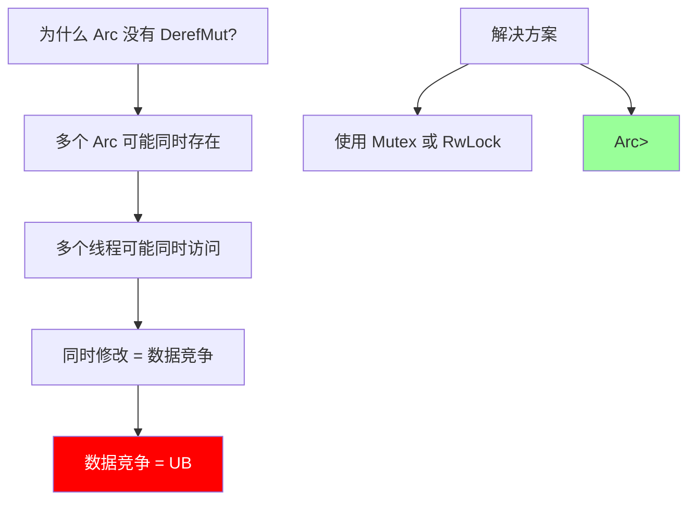

```rust
use std::sync::{Arc, Mutex, RwLock};

// 需要修改时，使用内部可变性
fn arc_mutation() {
    // 方案 1: Arc<Mutex<T>>
    let data = Arc::new(Mutex::new(vec![1, 2, 3]));

    let data_clone = Arc::clone(&data);
    std::thread::spawn(move || {
        let mut guard = data_clone.lock().unwrap();
        guard.push(4);
    }).join().unwrap();

    println!("{:?}", data.lock().unwrap());  // [1, 2, 3, 4]

    // 方案 2: Arc<RwLock<T>>（读多写少场景）
    let data = Arc::new(RwLock::new(vec![1, 2, 3]));

    // 多个读者
    {
        let read_guard = data.read().unwrap();
        println!("{:?}", *read_guard);
    }

    // 一个写者
    {
        let mut write_guard = data.write().unwrap();
        write_guard.push(4);
    }
}
```

## 10.5 Clone 实现深度解析

### 引用计数增加

```rust
use std::sync::atomic::Ordering;

impl<T> Clone for Arc<T> {
    fn clone(&self) -> Arc<T> {
        // 获取 inner 引用
        let inner = unsafe { self.ptr.as_ref() };

        // 原子增加引用计数
        // 使用 Relaxed 因为我们不需要与其他操作同步
        let old_count = inner.strong.fetch_add(1, Ordering::Relaxed);

        // 防止溢出
        // 如果计数接近 isize::MAX，可能会溢出变成负数
        // isize::MAX 足够大，正常使用不会达到
        if old_count >= isize::MAX as usize {
            // abort 而不是 panic，因为 panic 可能导致计数不一致
            std::process::abort();
        }

        // 创建新的 Arc，指向相同的内存
        Arc {
            ptr: self.ptr,
            _marker: PhantomData,
        }
    }
}
```

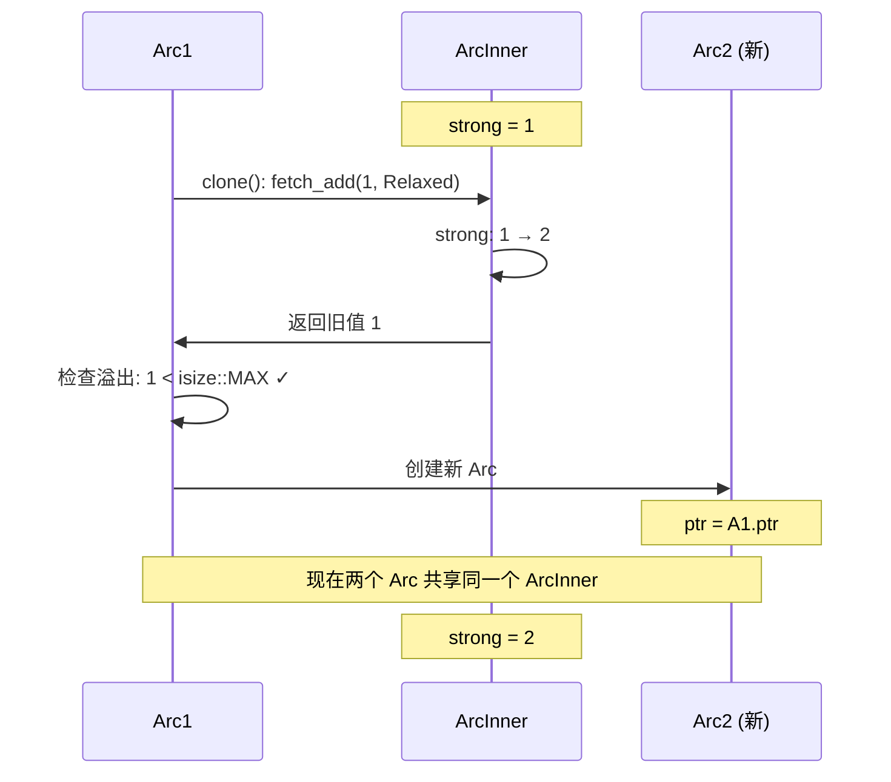

### 为什么 Clone 使用 Relaxed？

```rust
use std::sync::atomic::Ordering;

fn why_relaxed_for_clone() {
    // Relaxed 只保证原子性，不提供同步

    // 为什么这对 clone 是安全的？

    // 1. 我们只是增加计数
    //    不是在"发布"新数据给其他线程

    // 2. 数据已经存在并且有效
    //    clone 发生时，原 Arc 保证数据是有效的

    // 3. 新 Arc 会看到相同的数据
    //    因为数据的地址没变

    // 4. 不存在需要同步的"之前的写入"
    //    clone 不修改数据，只修改计数

    // 对比：如果我们在 clone 中"发布"了新数据
    // 那就需要 Release 来确保数据对其他线程可见
}

// 示意性代码展示为什么 Relaxed 足够
fn clone_safety_analysis() {
    use std::sync::Arc;

    let arc1 = Arc::new(42);

    // 线程 1 clone
    let arc1_clone = arc1.clone();

    // 此时：
    // - strong = 2
    // - arc1 和 arc1_clone 都指向同一个 42
    // - 42 在 clone 之前就存在了
    // - 没有"新数据"需要同步

    // 即使另一个线程同时 clone，也是安全的
    // 因为 fetch_add 是原子的
}
```

### 溢出检查的必要性

```rust
fn overflow_prevention() {
    // 为什么检查溢出？

    // 假设 strong 是 usize::MAX
    // fetch_add(1) 会导致溢出，变成 0

    // 如果 strong 变成 0，然后 drop 会认为这是最后一个引用
    // 内存被释放，但实际上还有其他 Arc！

    // 使用 isize::MAX 而不是 usize::MAX
    // 因为：
    // 1. isize::MAX 仍然是一个巨大的数字（约 9 * 10^18）
    // 2. 这给了我们一些余量
    // 3. 某些内部实现可能使用有符号算术

    // 为什么 abort 而不是 panic？
    // panic 会 unwind，可能导致 drop 被调用
    // 这可能使引用计数处于不一致状态
    // abort 立即终止，更安全
}
```

## 10.6 Drop 实现深度解析

### 完整的 Drop 实现

```rust
use std::sync::atomic::{self, AtomicUsize, Ordering};

impl<T> Drop for Arc<T> {
    fn drop(&mut self) {
        // 获取 inner 引用
        let inner = unsafe { self.ptr.as_ref() };

        // 原子减少引用计数
        // 使用 Release 确保之前的所有访问在此之前完成
        let old_count = inner.strong.fetch_sub(1, Ordering::Release);

        // 如果还有其他引用，直接返回
        if old_count != 1 {
            return;
        }

        // 我们是最后一个引用

        // Acquire fence：与其他线程的 Release 同步
        // 确保我们能看到所有其他线程对数据的修改
        atomic::fence(Ordering::Acquire);

        // 现在安全地释放内存
        unsafe {
            // Box::from_raw 重新获取所有权，然后 drop Box
            drop(Box::from_raw(self.ptr.as_ptr()));
        }
    }
}
```

### 内存序详解

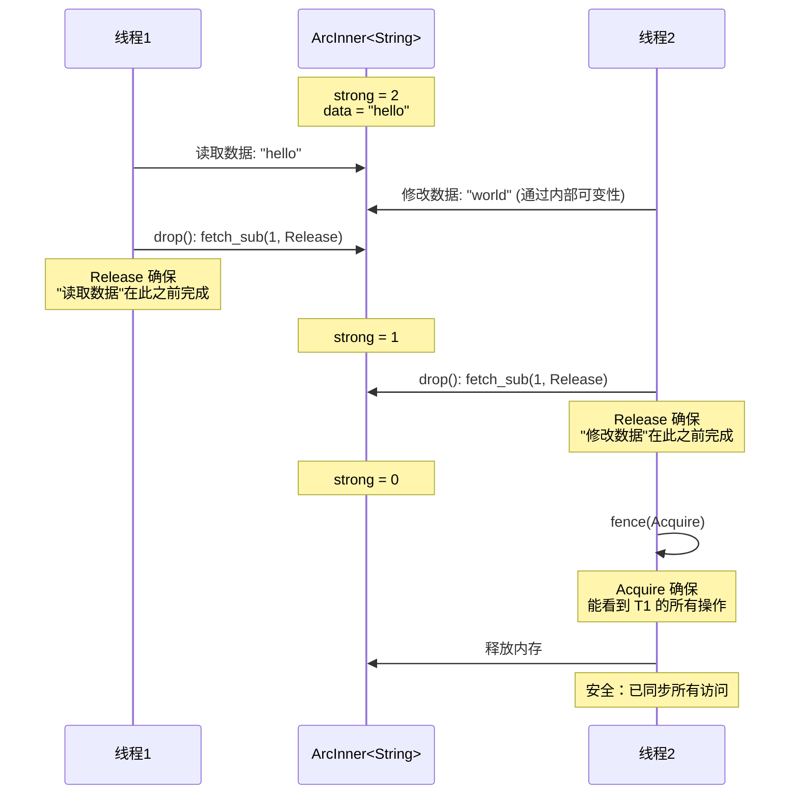

### 为什么需要 Release-Acquire？

```rust
use std::sync::atomic::Ordering;

fn why_release_acquire() {
    // 场景：两个线程共享 Arc<String>

    // 线程 1:
    // 1. 读取字符串
    // 2. drop Arc

    // 线程 2:
    // 1. 修改字符串（通过内部可变性）
    // 2. drop Arc

    // 问题：谁最后 drop？最后 drop 的线程释放内存
    // 释放前，需要确保所有操作都完成了

    // Release (fetch_sub):
    // - 确保"在此 Release 之前的所有操作"不会被重排到"此 Release 之后"
    // - 效果：每个线程的最后访问在 fetch_sub 之前完成

    // Acquire (fence):
    // - 确保"在此 Acquire 之后的所有操作"不会被重排到"此 Acquire 之前"
    // - 效果：最后一个线程能看到所有其他线程的操作

    // 组合效果：
    // - 所有访问 → Release → ... → Acquire → 释放内存
    // - 保证释放内存时，所有访问都已完成
}

// 错误示例：只用 Relaxed
fn wrong_drop() {
    // 这是错误的！
    // if inner.strong.fetch_sub(1, Ordering::Relaxed) != 1 {
    //     return;
    // }
    // // 没有 fence
    // unsafe { drop(Box::from_raw(ptr)); }

    // 问题：
    // 1. 其他线程的写入可能还没完成
    // 2. 我们可能释放还在被使用的内存
    // 3. 导致 use-after-free
}
```

### 为什么用 fence 而不是 AcqRel？

```rust
use std::sync::atomic::{fence, Ordering};

fn fence_vs_acqrel() {
    // 方案 A: 使用 AcqRel
    // inner.strong.fetch_sub(1, Ordering::AcqRel);
    // 问题：每次 drop 都有 Acquire 开销，即使不是最后一个

    // 方案 B: Release + fence (标准库使用)
    // inner.strong.fetch_sub(1, Ordering::Release);
    // if old_count == 1 {
    //     fence(Ordering::Acquire);
    // }
    // 优点：只有最后一个 drop 需要 Acquire 开销

    // 性能差异在高竞争场景下显著
    // 大多数 drop 不是最后一个，避免了不必要的同步
}
```

### Drop 的异常安全

```rust
impl<T> Drop for Arc<T> {
    fn drop(&mut self) {
        let inner = unsafe { self.ptr.as_ref() };

        if inner.strong.fetch_sub(1, Ordering::Release) != 1 {
            return;
        }

        atomic::fence(Ordering::Acquire);

        // 关于异常安全：
        // 1. 如果 T::drop panic，Arc 的 drop 已经完成了计数减少
        // 2. 计数已经是 0，不会有其他 Arc 访问这个数据
        // 3. panic 会 unwind，但内存状态是一致的

        unsafe {
            // Box::from_raw + drop 会调用 T::drop
            // 如果 T::drop panic，内存可能泄漏
            // 但不会有安全问题
            drop(Box::from_raw(self.ptr.as_ptr()));
        }
    }
}

// 更安全的实现（处理 panic）
fn safer_drop<T>(ptr: NonNull<ArcInner<T>>) {
    let inner = unsafe { ptr.as_ref() };

    if inner.strong.fetch_sub(1, Ordering::Release) != 1 {
        return;
    }

    atomic::fence(Ordering::Acquire);

    // 使用 drop_in_place 而不是 Box::from_raw
    // 这样即使 T::drop panic，我们仍可以释放内存
    unsafe {
        // 先 drop 数据
        std::ptr::drop_in_place(&mut (*ptr.as_ptr()).data);

        // 然后释放内存
        let layout = std::alloc::Layout::new::<ArcInner<T>>();
        std::alloc::dealloc(ptr.as_ptr() as *mut u8, layout);
    }
}

use std::sync::atomic::{self, AtomicUsize};
use std::ptr::NonNull;
use std::marker::PhantomData;

struct ArcInner<T> {
    strong: AtomicUsize,
    data: T,
}
```

## 10.7 Send 和 Sync 实现

### 为什么 T 需要 Send + Sync？

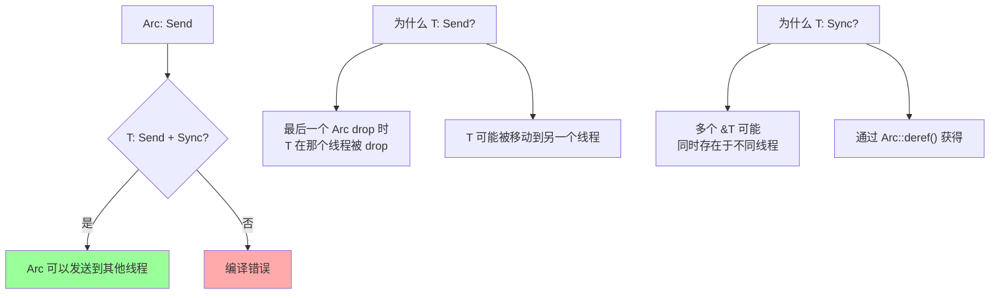

### 实现

```rust
use std::sync::atomic::AtomicUsize;
use std::ptr::NonNull;
use std::marker::PhantomData;

struct ArcInner<T> {
    strong: AtomicUsize,
    data: T,
}

pub struct Arc<T> {
    ptr: NonNull<ArcInner<T>>,
    _marker: PhantomData<ArcInner<T>>,
}

// Arc<T> 是 Send 如果 T: Send + Sync
// 我们可以把 Arc 发送到另一个线程
unsafe impl<T: Send + Sync> Send for Arc<T> {}

// Arc<T> 是 Sync 如果 T: Send + Sync
// 多个线程可以同时持有 &Arc<T> 并 clone
unsafe impl<T: Send + Sync> Sync for Arc<T> {}

// 解释：
// 1. T: Send
//    - 当最后一个 Arc drop 时，T 被 drop
//    - 这可能发生在任何线程
//    - 所以 T 必须能被发送到其他线程

// 2. T: Sync
//    - 多个 Arc 可以同时存在
//    - 通过 Deref，每个 Arc 都可以获得 &T
//    - 这些 &T 可能在不同线程
//    - 所以 &T 必须是 Send（等价于 T: Sync）
```

### 反例：为什么 Rc 不是 Send

```rust
use std::rc::Rc;
use std::cell::RefCell;

fn rc_not_send() {
    let rc = Rc::new(RefCell::new(42));

    // 如果 Rc 是 Send，这会编译：
    // std::thread::spawn(move || {
    //     *rc.borrow_mut() += 1;  // 数据竞争！
    // });

    // 另一个线程也可能：
    // *rc.borrow_mut() += 1;  // 同时修改！

    // 因为 Rc 的计数不是原子的
    // 多线程同时 clone/drop 会导致计数错误
    // 进而导致 double free 或内存泄漏
}

// Arc 没有这个问题，因为计数是原子的
fn arc_is_send() {
    use std::sync::{Arc, Mutex};

    let arc = Arc::new(Mutex::new(42));

    let arc_clone = Arc::clone(&arc);
    std::thread::spawn(move || {
        *arc_clone.lock().unwrap() += 1;  // 安全！
    }).join().unwrap();

    println!("{}", *arc.lock().unwrap());  // 43
}
```

### 特殊情况

```rust
use std::sync::Arc;

// 即使 T 不是 Sync，Arc<Mutex<T>> 仍然是 Send + Sync
fn arc_mutex_special() {
    use std::sync::Mutex;
    use std::cell::Cell;

    // Cell 不是 Sync
    // 但 Mutex<Cell<i32>> 是 Sync
    // 所以 Arc<Mutex<Cell<i32>>> 是 Send + Sync

    let arc = Arc::new(Mutex::new(Cell::new(42)));

    let arc_clone = Arc::clone(&arc);
    std::thread::spawn(move || {
        let guard = arc_clone.lock().unwrap();
        guard.set(100);
    }).join().unwrap();

    println!("{}", arc.lock().unwrap().get());  // 100
}

// 为什么？
// Mutex<T> 是 Sync 只要 T: Send
// 因为 Mutex 确保同一时间只有一个线程能访问 T
// 即使 T 不是 Sync，也没有并发访问
```

## 10.8 完整实现（带 Weak）

### Weak 引用的设计

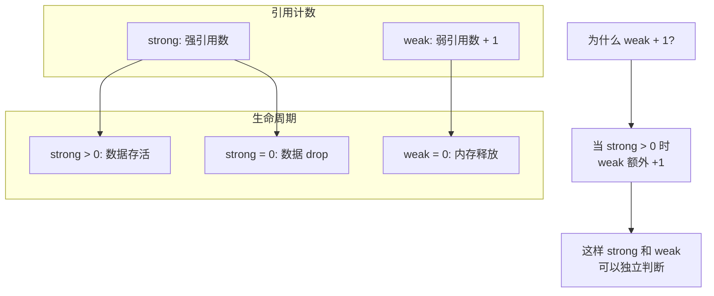

### 完整代码

```rust
use std::sync::atomic::{self, AtomicUsize, Ordering};
use std::ptr::NonNull;
use std::marker::PhantomData;
use std::ops::Deref;

// 堆上的数据
struct ArcInner<T> {
    strong: AtomicUsize,
    weak: AtomicUsize,
    data: T,
}

// 强引用
pub struct Arc<T> {
    ptr: NonNull<ArcInner<T>>,
    _marker: PhantomData<ArcInner<T>>,
}

// 弱引用
pub struct Weak<T> {
    ptr: NonNull<ArcInner<T>>,
    _marker: PhantomData<ArcInner<T>>,
}

impl<T> Arc<T> {
    pub fn new(data: T) -> Arc<T> {
        let inner = Box::new(ArcInner {
            strong: AtomicUsize::new(1),
            weak: AtomicUsize::new(1),  // 表示"有强引用存在"
            data,
        });

        Arc {
            ptr: unsafe { NonNull::new_unchecked(Box::into_raw(inner)) },
            _marker: PhantomData,
        }
    }

    fn inner(&self) -> &ArcInner<T> {
        unsafe { self.ptr.as_ref() }
    }

    // 获取强引用计数
    pub fn strong_count(&self) -> usize {
        self.inner().strong.load(Ordering::SeqCst)
    }

    // 获取弱引用计数（减去那个额外的 1）
    pub fn weak_count(&self) -> usize {
        let weak = self.inner().weak.load(Ordering::SeqCst);
        if weak == 1 {
            0  // 只有那个"额外的 1"
        } else {
            weak - 1
        }
    }

    // 创建弱引用
    pub fn downgrade(this: &Arc<T>) -> Weak<T> {
        let inner = this.inner();

        // 增加弱引用计数
        let old_weak = inner.weak.fetch_add(1, Ordering::Relaxed);

        if old_weak >= isize::MAX as usize {
            std::process::abort();
        }

        Weak {
            ptr: this.ptr,
            _marker: PhantomData,
        }
    }

    // 尝试获取独占访问
    pub fn get_mut(this: &mut Arc<T>) -> Option<&mut T> {
        // 只有一个强引用且没有弱引用时才能获取
        let inner = this.inner();

        if inner.strong.load(Ordering::Acquire) == 1
            && inner.weak.load(Ordering::Acquire) == 1
        {
            // 安全：我们是唯一的所有者
            Some(unsafe { &mut (*this.ptr.as_ptr()).data })
        } else {
            None
        }
    }

    // 尝试解包（如果是唯一引用）
    pub fn try_unwrap(this: Arc<T>) -> Result<T, Arc<T>> {
        let inner = unsafe { this.ptr.as_ref() };

        // 尝试将 strong 从 1 改为 0
        if inner.strong.compare_exchange(
            1,
            0,
            Ordering::Acquire,  // 成功：需要看到其他修改
            Ordering::Relaxed,  // 失败：只需知道失败了
        ).is_err() {
            return Err(this);
        }

        // 成功：我们是唯一的强引用

        // 阻止 this 的 drop
        let ptr = this.ptr;
        std::mem::forget(this);

        // 读取数据
        let data = unsafe {
            std::ptr::read(&(*ptr.as_ptr()).data)
        };

        // 减少 weak 计数（那个"额外的 1"）
        let inner = unsafe { ptr.as_ref() };
        if inner.weak.fetch_sub(1, Ordering::Release) == 1 {
            atomic::fence(Ordering::Acquire);
            // 没有弱引用了，释放内存
            unsafe {
                let _ = Box::from_raw(ptr.as_ptr());
            }
        }

        Ok(data)
    }
}

impl<T> Weak<T> {
    // 尝试升级为强引用
    pub fn upgrade(&self) -> Option<Arc<T>> {
        let inner = unsafe { self.ptr.as_ref() };

        loop {
            let strong = inner.strong.load(Ordering::Acquire);

            if strong == 0 {
                return None;  // 数据已经被释放
            }

            // 尝试增加强引用计数
            if inner.strong.compare_exchange_weak(
                strong,
                strong + 1,
                Ordering::AcqRel,
                Ordering::Relaxed,
            ).is_ok() {
                return Some(Arc {
                    ptr: self.ptr,
                    _marker: PhantomData,
                });
            }
        }
    }

    // 获取强引用计数
    pub fn strong_count(&self) -> usize {
        unsafe { self.ptr.as_ref() }.strong.load(Ordering::SeqCst)
    }
}

impl<T> Deref for Arc<T> {
    type Target = T;

    fn deref(&self) -> &T {
        &self.inner().data
    }
}

impl<T> Clone for Arc<T> {
    fn clone(&self) -> Arc<T> {
        let old_count = self.inner().strong.fetch_add(1, Ordering::Relaxed);

        if old_count >= isize::MAX as usize {
            std::process::abort();
        }

        Arc {
            ptr: self.ptr,
            _marker: PhantomData,
        }
    }
}

impl<T> Clone for Weak<T> {
    fn clone(&self) -> Weak<T> {
        let inner = unsafe { self.ptr.as_ref() };
        let old_count = inner.weak.fetch_add(1, Ordering::Relaxed);

        if old_count >= isize::MAX as usize {
            std::process::abort();
        }

        Weak {
            ptr: self.ptr,
            _marker: PhantomData,
        }
    }
}

impl<T> Drop for Arc<T> {
    fn drop(&mut self) {
        let inner = self.inner();

        if inner.strong.fetch_sub(1, Ordering::Release) != 1 {
            return;
        }

        atomic::fence(Ordering::Acquire);

        // Drop 数据
        unsafe {
            std::ptr::drop_in_place(&mut (*self.ptr.as_ptr()).data);
        }

        // 减少 weak 计数（那个"额外的 1"）
        if inner.weak.fetch_sub(1, Ordering::Release) == 1 {
            atomic::fence(Ordering::Acquire);
            // 没有弱引用了，释放内存
            unsafe {
                let layout = std::alloc::Layout::new::<ArcInner<T>>();
                std::alloc::dealloc(self.ptr.as_ptr() as *mut u8, layout);
            }
        }
    }
}

impl<T> Drop for Weak<T> {
    fn drop(&mut self) {
        let inner = unsafe { self.ptr.as_ref() };

        if inner.weak.fetch_sub(1, Ordering::Release) == 1 {
            atomic::fence(Ordering::Acquire);
            // 最后一个弱引用，释放内存
            unsafe {
                let layout = std::alloc::Layout::new::<ArcInner<T>>();
                std::alloc::dealloc(self.ptr.as_ptr() as *mut u8, layout);
            }
        }
    }
}

unsafe impl<T: Send + Sync> Send for Arc<T> {}
unsafe impl<T: Send + Sync> Sync for Arc<T> {}

// Weak 的要求更宽松
unsafe impl<T: Send + Sync> Send for Weak<T> {}
unsafe impl<T: Send + Sync> Sync for Weak<T> {}
```

### 使用示例

```rust
fn weak_example() {
    // 创建 Arc
    let arc = Arc::new(String::from("hello"));
    println!("strong: {}, weak: {}", Arc::strong_count(&arc), Arc::weak_count(&arc));
    // strong: 1, weak: 0

    // 创建弱引用
    let weak = Arc::downgrade(&arc);
    println!("strong: {}, weak: {}", Arc::strong_count(&arc), Arc::weak_count(&arc));
    // strong: 1, weak: 1

    // 升级弱引用
    if let Some(arc2) = weak.upgrade() {
        println!("Upgraded: {}", *arc2);
        println!("strong: {}", Arc::strong_count(&arc2));
        // strong: 2
    }

    // drop 所有强引用
    drop(arc);

    // 现在升级会失败
    assert!(weak.upgrade().is_none());
    println!("Weak cannot upgrade after all Arcs dropped");
}

// 用弱引用打破循环引用
fn break_cycle() {
    struct Node {
        value: i32,
        parent: Option<Weak<Node>>,
        children: Vec<Arc<Node>>,
    }

    let root = Arc::new(Node {
        value: 0,
        parent: None,
        children: vec![],
    });

    // 如果 parent 使用 Arc，就会形成循环引用
    // 父节点指向子节点（Arc）
    // 子节点指向父节点（Weak）
    // 这样不会循环
}
```

## 10.9 高级操作

### make_mut - COW (Copy on Write)

```rust
impl<T: Clone> Arc<T> {
    // 获取可变引用，必要时复制
    pub fn make_mut(this: &mut Arc<T>) -> &mut T {
        // 如果我们是唯一所有者，直接获取可变引用
        if Arc::get_mut(this).is_some() {
            // 安全：get_mut 已经确认我们是唯一所有者
            return unsafe { &mut (*this.ptr.as_ptr()).data };
        }

        // 我们不是唯一所有者，需要复制
        let new_data = (**this).clone();
        *this = Arc::new(new_data);

        // 现在我们是唯一所有者
        Arc::get_mut(this).unwrap()
    }
}

fn make_mut_example() {
    let mut arc1 = Arc::new(String::from("hello"));
    let arc2 = Arc::clone(&arc1);

    println!("Before: arc1 = {}, arc2 = {}", *arc1, *arc2);
    // Before: arc1 = hello, arc2 = hello

    // make_mut 会复制，因为有两个引用
    Arc::make_mut(&mut arc1).push_str(" world");

    println!("After: arc1 = {}, arc2 = {}", *arc1, *arc2);
    // After: arc1 = hello world, arc2 = hello

    // arc1 和 arc2 现在指向不同的数据

    // 如果只有一个引用，不会复制
    drop(arc2);
    let arc3 = Arc::clone(&arc1);
    drop(arc3);

    // 只有 arc1 了
    Arc::make_mut(&mut arc1).push_str("!");
    // 没有复制
}
```

### ptr_eq - 指针比较

```rust
impl<T> Arc<T> {
    // 检查两个 Arc 是否指向同一个内存
    pub fn ptr_eq(this: &Arc<T>, other: &Arc<T>) -> bool {
        this.ptr.as_ptr() == other.ptr.as_ptr()
    }
}

fn ptr_eq_example() {
    let arc1 = Arc::new(42);
    let arc2 = Arc::clone(&arc1);
    let arc3 = Arc::new(42);

    // arc1 和 arc2 指向同一内存
    assert!(Arc::ptr_eq(&arc1, &arc2));

    // arc1 和 arc3 指向不同内存，即使值相同
    assert!(!Arc::ptr_eq(&arc1, &arc3));
}
```

### as_ptr - 获取裸指针

```rust
impl<T> Arc<T> {
    pub fn as_ptr(this: &Arc<T>) -> *const T {
        &this.inner().data as *const T
    }
}
```

## 10.10 性能考虑

### 原子操作的开销

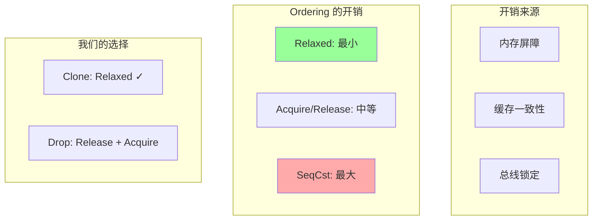

### 与 Rc 的性能比较

```rust
use std::time::Instant;

fn benchmark() {
    const ITERATIONS: usize = 10_000_000;

    // Rc 性能
    {
        use std::rc::Rc;
        let start = Instant::now();
        let rc = Rc::new(42);
        for _ in 0..ITERATIONS {
            let _ = Rc::clone(&rc);
        }
        println!("Rc clone: {:?}", start.elapsed());
    }

    // Arc 性能
    {
        use std::sync::Arc;
        let start = Instant::now();
        let arc = Arc::new(42);
        for _ in 0..ITERATIONS {
            let _ = Arc::clone(&arc);
        }
        println!("Arc clone: {:?}", start.elapsed());
    }

    // Arc 通常慢 2-5 倍
    // 但在多线程环境下是必需的
}
```

### 减少引用计数操作

```rust
use std::sync::Arc;

// 不好：频繁 clone
fn bad_pattern(data: Arc<Vec<i32>>) {
    for _ in 0..1000 {
        process(Arc::clone(&data));
    }
}

// 好：传递引用
fn good_pattern(data: &Arc<Vec<i32>>) {
    for _ in 0..1000 {
        process_ref(data);
    }
}

fn process(data: Arc<Vec<i32>>) {
    println!("{:?}", &*data);
}

fn process_ref(data: &Arc<Vec<i32>>) {
    println!("{:?}", &**data);
}
```

## 10.11 测试

```rust
#[cfg(test)]
mod tests {
    use super::*;
    use std::sync::atomic::AtomicUsize;
    use std::sync::atomic::Ordering::SeqCst;

    #[test]
    fn test_basic() {
        let arc = Arc::new(42);
        assert_eq!(*arc, 42);
    }

    #[test]
    fn test_clone() {
        let arc1 = Arc::new(42);
        let arc2 = Arc::clone(&arc1);

        assert_eq!(*arc1, 42);
        assert_eq!(*arc2, 42);
        assert_eq!(Arc::strong_count(&arc1), 2);
    }

    #[test]
    fn test_drop() {
        static DROP_COUNT: AtomicUsize = AtomicUsize::new(0);

        struct DropCounter;

        impl Drop for DropCounter {
            fn drop(&mut self) {
                DROP_COUNT.fetch_add(1, SeqCst);
            }
        }

        {
            let arc1 = Arc::new(DropCounter);
            let arc2 = Arc::clone(&arc1);
            let arc3 = Arc::clone(&arc2);

            assert_eq!(DROP_COUNT.load(SeqCst), 0);
        }

        assert_eq!(DROP_COUNT.load(SeqCst), 1);
    }

    #[test]
    fn test_weak() {
        let arc = Arc::new(42);
        let weak = Arc::downgrade(&arc);

        assert_eq!(Arc::strong_count(&arc), 1);
        assert_eq!(Arc::weak_count(&arc), 1);

        // 升级成功
        assert_eq!(*weak.upgrade().unwrap(), 42);

        drop(arc);

        // 升级失败
        assert!(weak.upgrade().is_none());
    }

    #[test]
    fn test_try_unwrap() {
        let arc = Arc::new(String::from("hello"));

        // 有多个引用时失败
        let arc2 = Arc::clone(&arc);
        let result = Arc::try_unwrap(arc);
        assert!(result.is_err());
        let arc = result.unwrap_err();

        drop(arc2);

        // 只有一个引用时成功
        let s = Arc::try_unwrap(arc).unwrap();
        assert_eq!(s, "hello");
    }

    #[test]
    fn test_thread_safety() {
        let arc = Arc::new(AtomicUsize::new(0));
        let mut handles = vec![];

        for _ in 0..10 {
            let arc_clone = Arc::clone(&arc);
            handles.push(std::thread::spawn(move || {
                for _ in 0..1000 {
                    arc_clone.fetch_add(1, SeqCst);
                }
            }));
        }

        for handle in handles {
            handle.join().unwrap();
        }

        assert_eq!(arc.load(SeqCst), 10000);
    }
}
```

## 10.12 与标准库的区别

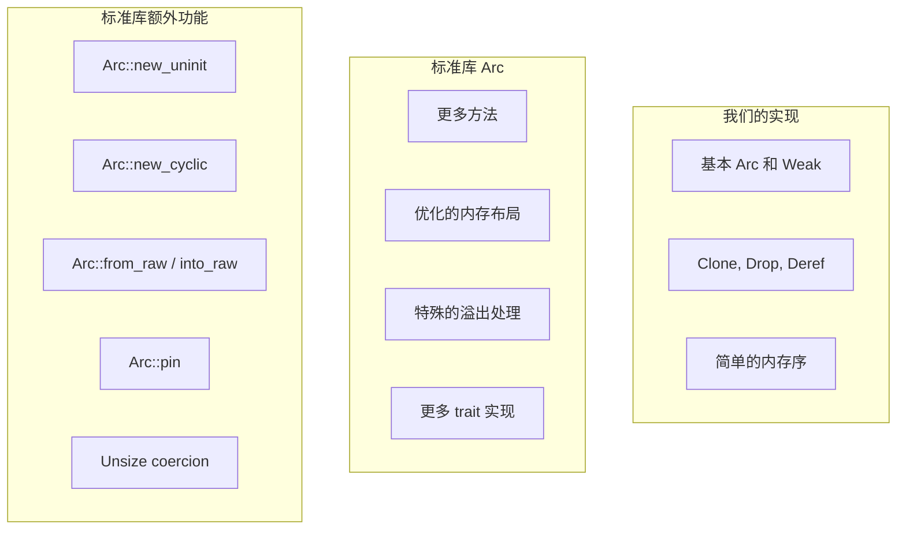

### 标准库特有功能

```rust
use std::sync::Arc;

fn std_arc_features() {
    // new_cyclic: 创建自引用结构
    // struct SelfRef {
    //     data: i32,
    //     self_ref: Weak<SelfRef>,
    // }
    // let arc = Arc::new_cyclic(|weak| SelfRef {
    //     data: 42,
    //     self_ref: weak.clone(),
    // });

    // from_raw / into_raw: FFI 互操作
    let arc = Arc::new(42);
    let raw = Arc::into_raw(arc);
    // ... 传递给 C ...
    let arc = unsafe { Arc::from_raw(raw) };

    // 自动 Unsize coercion
    let arc: Arc<[i32; 3]> = Arc::new([1, 2, 3]);
    let arc: Arc<[i32]> = arc;  // 转换为动态大小类型
}
```

## 10.13 总结

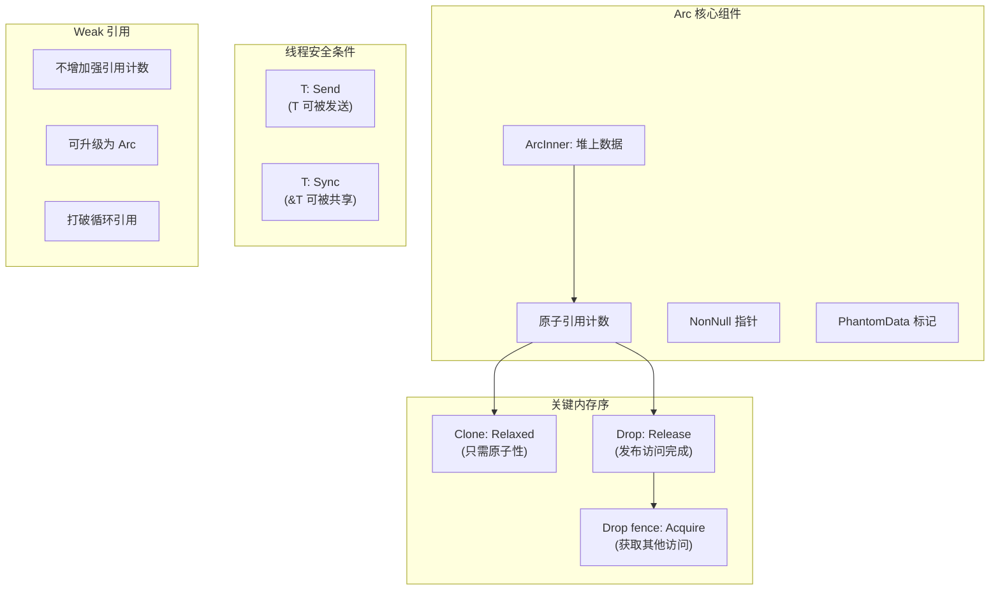

### 核心要点

1. **原子引用计数**：所有 Arc 共享一个原子计数器，确保线程安全
2. **内存序选择**：
   - Clone 用 Relaxed（不需同步）
   - Drop 用 Release（发布访问完成）
   - 最后 Drop 用 Acquire fence（获取所有修改）
3. **T: Send + Sync**：因为 T 可能在任意线程被访问和 drop
4. **Weak 引用**：不保持数据存活，用于打破循环引用
5. **PhantomData**：正确表达所有权和型变

### 设计决策总结

| 决策 | 选择 | 原因 |
|------|------|------|
| 计数器位置 | 堆上 | 所有 Arc 共享同一计数器 |
| 计数器类型 | AtomicUsize | 线程安全 |
| Clone 内存序 | Relaxed | 只需原子性，不需同步 |
| Drop 内存序 | Release + Acquire | 确保访问完成后再释放 |
| 指针类型 | NonNull | 非空保证 + 协变 + niche |
| T 约束 | Send + Sync | 多线程访问需求 |

### 检查清单

实现 Arc 时，确保：

- [ ] 使用原子整数作为引用计数
- [ ] Clone 使用 Relaxed ordering
- [ ] Drop 使用 Release ordering
- [ ] 最后一个 Drop 使用 Acquire fence
- [ ] 检查引用计数溢出
- [ ] 正确实现 Send 和 Sync
- [ ] 使用 NonNull 和 PhantomData
- [ ] 处理好弱引用（如果实现）
- [ ] 考虑异常安全

---

下一章：[FFI](./11-ffi.md)
