# 第十一章：外部函数接口 (FFI) 深度解析（扩展版）

## 概述

FFI (Foreign Function Interface) 允许 Rust 与其他语言（主要是 C）进行交互。这是 unsafe Rust 最常见的应用场景之一。掌握 FFI 对于利用现有 C 库、与系统 API 交互、以及创建可被其他语言调用的 Rust 库都至关重要。

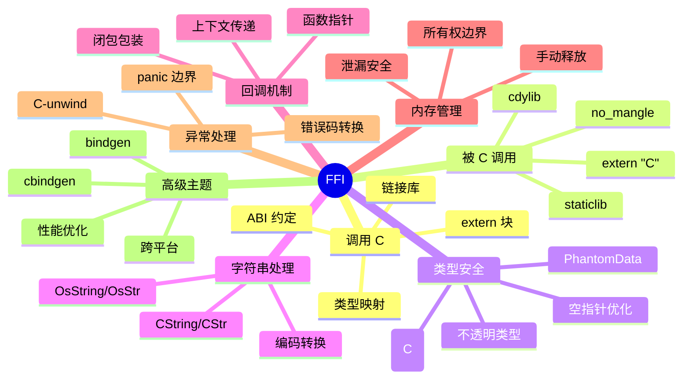

## 11.1 从 Rust 调用 C 详解

### extern 块的完整语法

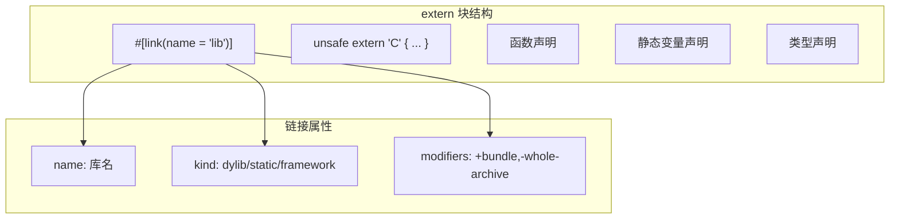

```rust
use std::os::raw::{c_char, c_int, c_void};

// 完整的 extern 块示例
#[link(name = "mylib")]
unsafe extern "C" {
    // 函数声明
    fn c_function(arg: c_int) -> c_int;

    // 可变参数函数（如 printf）
    fn printf(format: *const c_char, ...) -> c_int;

    // 静态变量
    static errno: c_int;

    // 可变静态变量
    static mut global_state: c_int;
}

// 不同的链接类型
#[link(name = "static_lib", kind = "static")]
unsafe extern "C" {
    fn from_static_lib();
}

#[link(name = "framework_name", kind = "framework")]  // macOS
unsafe extern "C" {
    fn from_framework();
}

// 条件链接
#[cfg_attr(target_os = "linux", link(name = "rt"))]
#[cfg_attr(target_os = "macos", link(name = "System"))]
unsafe extern "C" {
    fn clock_gettime();
}
```

### 为什么 extern 是 unsafe？

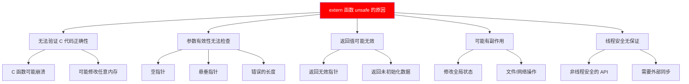

```rust
// 示例：各种不安全的情况

unsafe extern "C" {
    // 1. 可能返回空指针
    fn get_data() -> *mut c_void;

    // 2. 可能修改通过指针传入的数据
    fn modify_buffer(buf: *mut u8, len: usize);

    // 3. 可能不是线程安全的
    fn not_thread_safe_func();

    // 4. 可能有隐藏的副作用
    fn function_with_side_effects();
}

// 安全封装需要处理所有这些情况
fn safe_get_data() -> Option<Box<[u8]>> {
    unsafe {
        let ptr = get_data();
        if ptr.is_null() {
            None
        } else {
            // 假设我们知道数据大小
            let slice = std::slice::from_raw_parts(ptr as *const u8, 100);
            Some(slice.to_vec().into_boxed_slice())
        }
    }
}
```

### ABI 约定详解

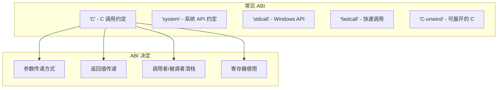

```rust
// 不同 ABI 示例

// 标准 C ABI（跨平台）
extern "C" fn c_abi_func(a: i32, b: i32) -> i32 {
    a + b
}

// 系统 ABI（Windows 上是 stdcall，其他平台是 C）
extern "system" fn system_abi_func(a: i32) -> i32 {
    a * 2
}

// Windows stdcall（用于 Win32 API）
#[cfg(windows)]
extern "stdcall" fn win32_callback(hwnd: *mut c_void, msg: u32) -> i32 {
    0
}

// C-unwind：允许 panic 穿越（Rust 1.71+）
extern "C-unwind" fn may_unwind() {
    panic!("This can propagate through C frames");
}

// Rust ABI（默认，不稳定，不用于 FFI）
fn rust_abi_func(a: i32) -> i32 {
    a
}
```

### 链接器配置详解

```rust
// build.rs 示例：复杂的链接配置
fn main() {
    // 添加库搜索路径
    println!("cargo:rustc-link-search=native=/usr/local/lib");
    println!("cargo:rustc-link-search=native=/opt/mylib/lib");

    // 链接库
    println!("cargo:rustc-link-lib=dylib=mylib");       // 动态库
    println!("cargo:rustc-link-lib=static=mystaticlib"); // 静态库

    // 条件链接
    #[cfg(target_os = "linux")]
    {
        println!("cargo:rustc-link-lib=pthread");
        println!("cargo:rustc-link-lib=dl");
    }

    #[cfg(target_os = "macos")]
    {
        println!("cargo:rustc-link-lib=framework=Security");
        println!("cargo:rustc-link-lib=framework=CoreFoundation");
    }

    #[cfg(target_os = "windows")]
    {
        println!("cargo:rustc-link-lib=user32");
        println!("cargo:rustc-link-lib=kernel32");
    }

    // 重新运行条件
    println!("cargo:rerun-if-changed=build.rs");
    println!("cargo:rerun-if-env-changed=MYLIB_PATH");
}
```

## 11.2 创建安全封装详解

### 封装策略

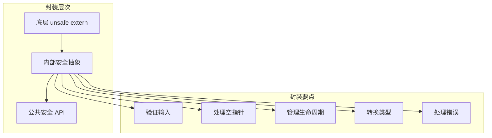

### 完整的封装示例

```rust
use std::ffi::{CStr, CString};
use std::os::raw::{c_char, c_int, c_void};
use std::ptr;

// 底层 C 函数声明
mod ffi {
    use super::*;

    #[link(name = "mylib")]
    unsafe extern "C" {
        pub fn mylib_init() -> c_int;
        pub fn mylib_cleanup();

        pub fn mylib_create_context() -> *mut c_void;
        pub fn mylib_destroy_context(ctx: *mut c_void);

        pub fn mylib_process(
            ctx: *mut c_void,
            input: *const u8,
            input_len: usize,
            output: *mut u8,
            output_len: *mut usize,
        ) -> c_int;

        pub fn mylib_get_error() -> *const c_char;
    }
}

// 错误类型
#[derive(Debug)]
pub enum Error {
    InitFailed,
    ProcessFailed(String),
    NullPointer,
    InvalidData,
}

impl std::fmt::Display for Error {
    fn fmt(&self, f: &mut std::fmt::Formatter<'_>) -> std::fmt::Result {
        match self {
            Error::InitFailed => write!(f, "Library initialization failed"),
            Error::ProcessFailed(msg) => write!(f, "Processing failed: {}", msg),
            Error::NullPointer => write!(f, "Null pointer returned"),
            Error::InvalidData => write!(f, "Invalid data"),
        }
    }
}

impl std::error::Error for Error {}

// 安全封装：库初始化
pub struct Library {
    _private: (),  // 防止外部构造
}

impl Library {
    pub fn init() -> Result<Self, Error> {
        unsafe {
            if ffi::mylib_init() != 0 {
                return Err(Error::InitFailed);
            }
        }
        Ok(Library { _private: () })
    }
}

impl Drop for Library {
    fn drop(&mut self) {
        unsafe {
            ffi::mylib_cleanup();
        }
    }
}

// 安全封装：上下文
pub struct Context {
    ptr: *mut c_void,
}

impl Context {
    pub fn new(_lib: &Library) -> Result<Self, Error> {
        unsafe {
            let ptr = ffi::mylib_create_context();
            if ptr.is_null() {
                return Err(Error::NullPointer);
            }
            Ok(Context { ptr })
        }
    }

    pub fn process(&mut self, input: &[u8]) -> Result<Vec<u8>, Error> {
        unsafe {
            // 准备输出缓冲区
            let mut output = vec![0u8; input.len() * 2];  // 假设最大扩展 2 倍
            let mut output_len = output.len();

            let result = ffi::mylib_process(
                self.ptr,
                input.as_ptr(),
                input.len(),
                output.as_mut_ptr(),
                &mut output_len,
            );

            if result != 0 {
                // 获取错误信息
                let error_ptr = ffi::mylib_get_error();
                let error_msg = if error_ptr.is_null() {
                    "Unknown error".to_string()
                } else {
                    CStr::from_ptr(error_ptr)
                        .to_string_lossy()
                        .into_owned()
                };
                return Err(Error::ProcessFailed(error_msg));
            }

            output.truncate(output_len);
            Ok(output)
        }
    }
}

impl Drop for Context {
    fn drop(&mut self) {
        unsafe {
            ffi::mylib_destroy_context(self.ptr);
        }
    }
}

// Context 是线程安全的（如果 C 库是线程安全的）
unsafe impl Send for Context {}
// 如果 C 库支持并发访问
// unsafe impl Sync for Context {}

// 使用示例
fn example() -> Result<(), Error> {
    let lib = Library::init()?;
    let mut ctx = Context::new(&lib)?;

    let input = b"Hello, World!";
    let output = ctx.process(input)?;

    println!("Output: {:?}", output);
    Ok(())
}
```

### 生命周期管理

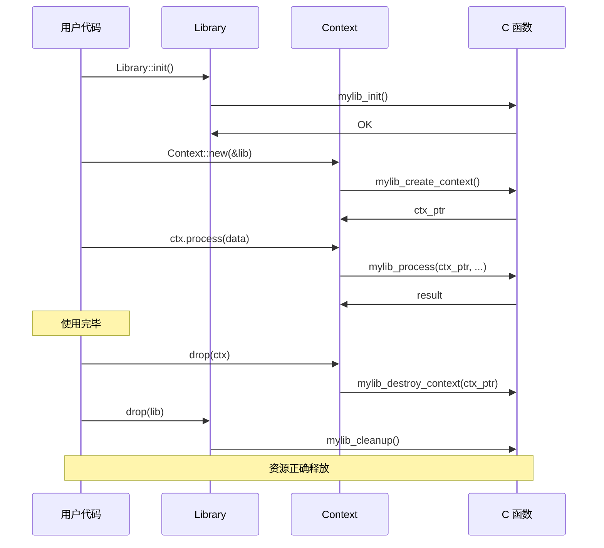

```rust
// 使用 PhantomData 表达生命周期依赖
use std::marker::PhantomData;

pub struct BorrowedData<'a> {
    ptr: *const u8,
    len: usize,
    _marker: PhantomData<&'a [u8]>,
}

impl<'a> BorrowedData<'a> {
    pub fn new(data: &'a [u8]) -> Self {
        BorrowedData {
            ptr: data.as_ptr(),
            len: data.len(),
            _marker: PhantomData,
        }
    }

    pub fn as_slice(&self) -> &'a [u8] {
        unsafe { std::slice::from_raw_parts(self.ptr, self.len) }
    }
}

// 带生命周期的 FFI 封装
pub struct Parser<'a> {
    handle: *mut c_void,
    _marker: PhantomData<&'a [u8]>,
}

impl<'a> Parser<'a> {
    pub fn new(data: &'a [u8]) -> Result<Self, Error> {
        unsafe {
            // 假设 C 函数保存了指针
            let handle = parser_create(data.as_ptr(), data.len());
            if handle.is_null() {
                return Err(Error::NullPointer);
            }
            Ok(Parser {
                handle,
                _marker: PhantomData,
            })
        }
    }

    // Parser 的生命周期 'a 确保 data 在 Parser 存在期间有效
}

unsafe extern "C" {
    fn parser_create(data: *const u8, len: usize) -> *mut c_void;
}
```

## 11.3 被 C 调用详解

### 导出函数的完整指南

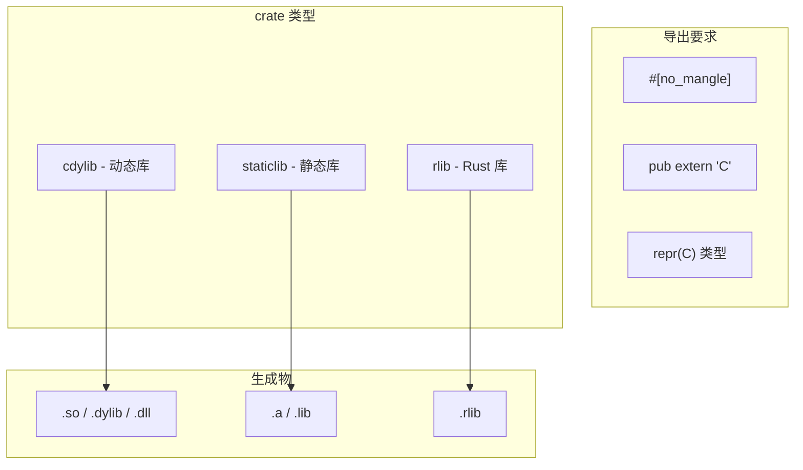

```rust
// lib.rs - 完整的可导出库示例

use std::ffi::{CStr, CString};
use std::os::raw::{c_char, c_int, c_void};
use std::ptr;
use std::panic;
use std::slice;

// ============ 基本函数导出 ============

/// 简单函数导出
#[unsafe(no_mangle)]
pub extern "C" fn add(a: c_int, b: c_int) -> c_int {
    a.saturating_add(b)
}

/// 带错误处理的函数
#[unsafe(no_mangle)]
pub extern "C" fn divide(a: c_int, b: c_int, result: *mut c_int) -> c_int {
    if result.is_null() {
        return -1;  // 错误：空指针
    }
    if b == 0 {
        return -2;  // 错误：除以零
    }

    unsafe {
        *result = a / b;
    }
    0  // 成功
}

// ============ 字符串处理 ============

/// 返回静态字符串
#[unsafe(no_mangle)]
pub extern "C" fn get_version() -> *const c_char {
    // 静态字符串，永远有效
    static VERSION: &[u8] = b"1.0.0\0";
    VERSION.as_ptr() as *const c_char
}

/// 处理输入字符串
#[unsafe(no_mangle)]
pub extern "C" fn string_length(s: *const c_char) -> c_int {
    if s.is_null() {
        return -1;
    }

    unsafe {
        CStr::from_ptr(s).to_bytes().len() as c_int
    }
}

/// 返回分配的字符串（调用者需要释放）
#[unsafe(no_mangle)]
pub extern "C" fn create_greeting(name: *const c_char) -> *mut c_char {
    if name.is_null() {
        return ptr::null_mut();
    }

    let name_str = unsafe {
        match CStr::from_ptr(name).to_str() {
            Ok(s) => s,
            Err(_) => return ptr::null_mut(),
        }
    };

    let greeting = format!("Hello, {}!", name_str);

    match CString::new(greeting) {
        Ok(cstr) => cstr.into_raw(),
        Err(_) => ptr::null_mut(),
    }
}

/// 释放由 Rust 分配的字符串
#[unsafe(no_mangle)]
pub extern "C" fn free_string(s: *mut c_char) {
    if !s.is_null() {
        unsafe {
            drop(CString::from_raw(s));
        }
    }
}

// ============ 缓冲区处理 ============

/// 处理字节缓冲区
#[unsafe(no_mangle)]
pub extern "C" fn process_buffer(
    input: *const u8,
    input_len: usize,
    output: *mut u8,
    output_cap: usize,
    output_len: *mut usize,
) -> c_int {
    // 参数验证
    if input.is_null() || output.is_null() || output_len.is_null() {
        return -1;
    }

    unsafe {
        let input_slice = slice::from_raw_parts(input, input_len);

        // 处理数据（示例：转换为大写）
        let processed: Vec<u8> = input_slice
            .iter()
            .map(|&b| b.to_ascii_uppercase())
            .collect();

        if processed.len() > output_cap {
            return -2;  // 缓冲区太小
        }

        ptr::copy_nonoverlapping(
            processed.as_ptr(),
            output,
            processed.len(),
        );
        *output_len = processed.len();
    }

    0
}

// ============ 结构体导出 ============

/// C 兼容的结构体
#[repr(C)]
pub struct Point {
    pub x: f64,
    pub y: f64,
}

#[unsafe(no_mangle)]
pub extern "C" fn point_create(x: f64, y: f64) -> Point {
    Point { x, y }
}

#[unsafe(no_mangle)]
pub extern "C" fn point_distance(p1: *const Point, p2: *const Point) -> f64 {
    if p1.is_null() || p2.is_null() {
        return -1.0;
    }

    unsafe {
        let dx = (*p2).x - (*p1).x;
        let dy = (*p2).y - (*p1).y;
        (dx * dx + dy * dy).sqrt()
    }
}

// ============ 不透明类型 ============

/// 内部状态（对 C 隐藏）
pub struct InternalState {
    data: Vec<u8>,
    counter: usize,
}

/// 对 C 暴露的不透明句柄
pub type StateHandle = *mut InternalState;

#[unsafe(no_mangle)]
pub extern "C" fn state_create() -> StateHandle {
    let state = Box::new(InternalState {
        data: Vec::new(),
        counter: 0,
    });
    Box::into_raw(state)
}

#[unsafe(no_mangle)]
pub extern "C" fn state_destroy(handle: StateHandle) {
    if !handle.is_null() {
        unsafe {
            drop(Box::from_raw(handle));
        }
    }
}

#[unsafe(no_mangle)]
pub extern "C" fn state_push(handle: StateHandle, value: u8) -> c_int {
    if handle.is_null() {
        return -1;
    }

    unsafe {
        (*handle).data.push(value);
        (*handle).counter += 1;
    }
    0
}

#[unsafe(no_mangle)]
pub extern "C" fn state_get_count(handle: StateHandle) -> c_int {
    if handle.is_null() {
        return -1;
    }

    unsafe { (*handle).counter as c_int }
}

// ============ Panic 安全 ============

#[unsafe(no_mangle)]
pub extern "C" fn safe_operation(value: c_int) -> c_int {
    let result = panic::catch_unwind(|| {
        // 可能 panic 的操作
        if value < 0 {
            panic!("Negative value!");
        }
        value * 2
    });

    match result {
        Ok(v) => v,
        Err(_) => -1,  // 发生了 panic
    }
}
```

### 对应的 C 头文件

```c
// mylib.h
#ifndef MYLIB_H
#define MYLIB_H

#include <stdint.h>
#include <stddef.h>

#ifdef __cplusplus
extern "C" {
#endif

// 基本函数
int32_t add(int32_t a, int32_t b);
int32_t divide(int32_t a, int32_t b, int32_t* result);

// 字符串处理
const char* get_version(void);
int32_t string_length(const char* s);
char* create_greeting(const char* name);
void free_string(char* s);

// 缓冲区处理
int32_t process_buffer(
    const uint8_t* input,
    size_t input_len,
    uint8_t* output,
    size_t output_cap,
    size_t* output_len
);

// 结构体
typedef struct {
    double x;
    double y;
} Point;

Point point_create(double x, double y);
double point_distance(const Point* p1, const Point* p2);

// 不透明类型
typedef struct InternalState InternalState;
typedef InternalState* StateHandle;

StateHandle state_create(void);
void state_destroy(StateHandle handle);
int32_t state_push(StateHandle handle, uint8_t value);
int32_t state_get_count(StateHandle handle);

// Panic 安全
int32_t safe_operation(int32_t value);

#ifdef __cplusplus
}
#endif

#endif // MYLIB_H
```

### Cargo.toml 配置

```toml
[package]
name = "mylib"
version = "1.0.0"
edition = "2021"

[lib]
# 生成 C 动态库
crate-type = ["cdylib", "staticlib"]

[dependencies]
libc = "0.2"

[profile.release]
# 优化设置
lto = true
codegen-units = 1
opt-level = 3
```

## 11.4 类型映射详解

### 完整的类型对应表

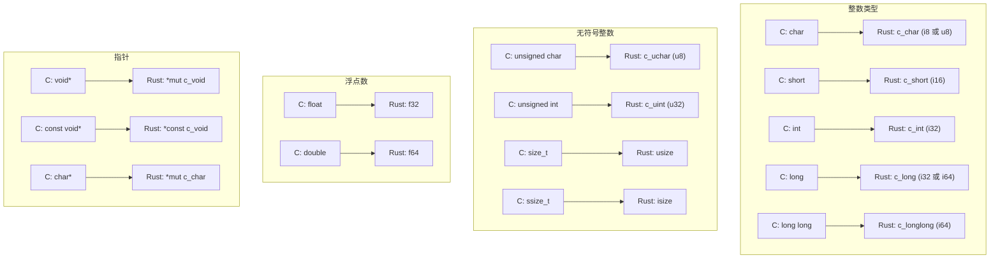

### 固定大小整数

```rust
use std::os::raw::*;

// 平台相关类型（大小可能变化）
fn platform_dependent_types() {
    let _: c_char;   // 可能是 i8 或 u8
    let _: c_short;  // 至少 16 位
    let _: c_int;    // 至少 16 位，通常 32 位
    let _: c_long;   // 至少 32 位，64 位系统可能是 64 位
    let _: c_longlong; // 至少 64 位
}

// 固定大小类型（推荐用于 FFI）
fn fixed_size_types() {
    let _: i8;   // 精确 8 位
    let _: i16;  // 精确 16 位
    let _: i32;  // 精确 32 位
    let _: i64;  // 精确 64 位

    let _: u8;
    let _: u16;
    let _: u32;
    let _: u64;
}

// C 的 <stdint.h> 类型
// int8_t  -> i8
// int16_t -> i16
// int32_t -> i32
// int64_t -> i64
// uint8_t -> u8
// 等等

// 示例：使用固定大小类型的 FFI
unsafe extern "C" {
    fn process_data(
        input: *const u8,    // uint8_t*
        len: u32,            // uint32_t
        flags: u64,          // uint64_t
    ) -> i32;                // int32_t
}
```

### repr(C) 结构体详解

```rust
// 默认 Rust 布局（不能用于 FFI）
struct RustLayout {
    a: u8,
    b: u32,
    c: u8,
}
// Rust 可能重排字段以优化大小

// C 布局（可以用于 FFI）
#[repr(C)]
struct CLayout {
    a: u8,     // 偏移 0
    // 3 字节填充
    b: u32,    // 偏移 4
    c: u8,     // 偏移 8
    // 3 字节填充
}
// 总大小：12 字节

// 紧凑布局
#[repr(C, packed)]
struct PackedLayout {
    a: u8,     // 偏移 0
    b: u32,    // 偏移 1
    c: u8,     // 偏移 5
}
// 总大小：6 字节（但可能导致未对齐访问）

// 指定对齐
#[repr(C, align(16))]
struct AlignedLayout {
    data: [u8; 32],
}
// 保证 16 字节对齐

fn demonstrate_layout() {
    println!("RustLayout size: {}", std::mem::size_of::<RustLayout>());
    println!("CLayout size: {}", std::mem::size_of::<CLayout>());
    println!("PackedLayout size: {}", std::mem::size_of::<PackedLayout>());
    println!("AlignedLayout align: {}", std::mem::align_of::<AlignedLayout>());
}
```

### 枚举的 FFI 表示

```rust
// C 风格枚举
#[repr(C)]
enum Color {
    Red = 0,
    Green = 1,
    Blue = 2,
}

// 指定底层类型
#[repr(u8)]
enum SmallEnum {
    A = 0,
    B = 1,
    C = 2,
}

#[repr(i32)]
enum ErrorCode {
    Success = 0,
    InvalidArg = -1,
    OutOfMemory = -2,
    IoError = -3,
}

// 带数据的枚举不能直接用于 FFI
// 需要手动转换

// 不能用于 FFI！
enum RustEnum {
    None,
    Some(i32),
    Many(Vec<i32>),
}

// 手动实现 FFI 兼容版本
#[repr(C)]
struct FfiOption {
    has_value: bool,
    value: i32,
}

impl From<Option<i32>> for FfiOption {
    fn from(opt: Option<i32>) -> Self {
        match opt {
            Some(v) => FfiOption { has_value: true, value: v },
            None => FfiOption { has_value: false, value: 0 },
        }
    }
}

impl From<FfiOption> for Option<i32> {
    fn from(ffi: FfiOption) -> Self {
        if ffi.has_value {
            Some(ffi.value)
        } else {
            None
        }
    }
}
```

### 联合体

```rust
// C 风格联合体
#[repr(C)]
union Value {
    i: i32,
    f: f32,
    b: [u8; 4],
}

// 带标签的联合体（手动实现）
#[repr(C)]
struct TaggedValue {
    tag: ValueTag,
    value: Value,
}

#[repr(u8)]
enum ValueTag {
    Int = 0,
    Float = 1,
    Bytes = 2,
}

impl TaggedValue {
    fn new_int(i: i32) -> Self {
        TaggedValue {
            tag: ValueTag::Int,
            value: Value { i },
        }
    }

    fn new_float(f: f32) -> Self {
        TaggedValue {
            tag: ValueTag::Float,
            value: Value { f },
        }
    }

    fn get(&self) -> ValueKind {
        unsafe {
            match self.tag {
                ValueTag::Int => ValueKind::Int(self.value.i),
                ValueTag::Float => ValueKind::Float(self.value.f),
                ValueTag::Bytes => ValueKind::Bytes(self.value.b),
            }
        }
    }
}

enum ValueKind {
    Int(i32),
    Float(f32),
    Bytes([u8; 4]),
}
```

## 11.5 字符串处理详解

### 字符串类型对比

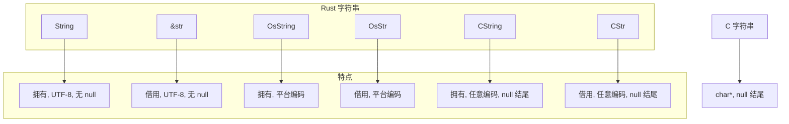

### CString 和 CStr 详解

```rust
use std::ffi::{CStr, CString, NulError};
use std::os::raw::c_char;

// ============ CString：拥有的 C 字符串 ============

fn cstring_examples() -> Result<(), NulError> {
    // 从 &str 创建
    let s1 = CString::new("Hello")?;

    // 从 String 创建
    let rust_string = String::from("World");
    let s2 = CString::new(rust_string)?;

    // 从 Vec<u8> 创建
    let bytes = vec![72, 101, 108, 108, 111];  // "Hello"
    let s3 = CString::new(bytes)?;

    // 注意：包含 null 字节会失败
    let result = CString::new("Hello\0World");
    assert!(result.is_err());

    // 获取 C 指针
    let ptr: *const c_char = s1.as_ptr();

    // 转换为字节（不含 null 终止符）
    let bytes: &[u8] = s1.as_bytes();

    // 转换为字节（含 null 终止符）
    let bytes_with_nul: &[u8] = s1.as_bytes_with_nul();

    // 消耗并返回裸指针（调用者负责释放）
    let raw: *mut c_char = s1.into_raw();

    // 从裸指针重建（用于释放）
    unsafe {
        let _ = CString::from_raw(raw);
    }

    Ok(())
}

// ============ CStr：借用的 C 字符串 ============

fn cstr_examples() {
    // 从字面量创建（编译时检查）
    let s1: &CStr = c"Hello, World!";

    // 从裸指针创建（unsafe）
    unsafe {
        let ptr: *const c_char = s1.as_ptr();
        let s2: &CStr = CStr::from_ptr(ptr);
    }

    // 从字节切片创建（运行时检查）
    let bytes = b"Hello\0";
    let s3 = CStr::from_bytes_with_nul(bytes).unwrap();

    // 转换为 &str（可能失败，如果不是有效 UTF-8）
    match s1.to_str() {
        Ok(s) => println!("Valid UTF-8: {}", s),
        Err(_) => println!("Invalid UTF-8"),
    }

    // 有损转换（替换无效字节）
    let lossy: std::borrow::Cow<str> = s1.to_string_lossy();
    println!("Lossy: {}", lossy);
}

// ============ FFI 中的字符串处理 ============

unsafe extern "C" {
    fn c_print(s: *const c_char);
    fn c_get_string() -> *const c_char;
    fn c_get_mutable_string() -> *mut c_char;
    fn c_free(ptr: *mut c_char);
}

// Rust -> C
fn send_string_to_c(s: &str) {
    // 创建 CString
    let cstring = match CString::new(s) {
        Ok(cs) => cs,
        Err(_) => {
            // 处理包含 null 的情况
            let filtered: String = s.chars()
                .filter(|&c| c != '\0')
                .collect();
            CString::new(filtered).unwrap()
        }
    };

    unsafe {
        c_print(cstring.as_ptr());
    }
    // cstring 在这里被 drop，内存被释放
}

// C -> Rust（借用）
fn receive_string_from_c_borrowed() -> Option<String> {
    unsafe {
        let ptr = c_get_string();
        if ptr.is_null() {
            return None;
        }

        // 创建借用（不拥有内存）
        let cstr = CStr::from_ptr(ptr);

        // 转换为 String（复制数据）
        cstr.to_str().ok().map(String::from)
    }
}

// C -> Rust（拥有）
fn receive_string_from_c_owned() -> Option<String> {
    unsafe {
        let ptr = c_get_mutable_string();
        if ptr.is_null() {
            return None;
        }

        // 获取长度
        let cstr = CStr::from_ptr(ptr);
        let len = cstr.to_bytes().len();

        // 复制数据
        let mut bytes = vec![0u8; len];
        std::ptr::copy_nonoverlapping(
            ptr as *const u8,
            bytes.as_mut_ptr(),
            len,
        );

        // 释放 C 分配的内存
        c_free(ptr);

        // 转换为 String
        String::from_utf8(bytes).ok()
    }
}
```

### OsString 用于路径

```rust
use std::ffi::{OsStr, OsString};
use std::path::Path;

fn path_ffi_example() {
    // OsString 用于与操作系统交互
    let path = Path::new("/tmp/测试文件.txt");

    // Unix: OsStr 是 [u8]
    // Windows: OsStr 是 [u16]（WTF-8 编码）

    #[cfg(unix)]
    {
        use std::os::unix::ffi::OsStrExt;

        let bytes: &[u8] = path.as_os_str().as_bytes();
        println!("Path bytes: {:?}", bytes);
    }

    #[cfg(windows)]
    {
        use std::os::windows::ffi::OsStrExt;

        let wide: Vec<u16> = path.as_os_str()
            .encode_wide()
            .collect();
        println!("Path wide chars: {:?}", wide);
    }
}

// 与 C 的路径 API 交互
#[cfg(unix)]
fn unix_path_ffi(path: &Path) {
    use std::os::unix::ffi::OsStrExt;
    use std::ffi::CString;

    // 转换为 C 字符串
    let cpath = CString::new(path.as_os_str().as_bytes())
        .expect("Path contains null byte");

    unsafe {
        // 调用 C 函数
        libc::open(cpath.as_ptr(), libc::O_RDONLY);
    }
}

#[cfg(windows)]
fn windows_path_ffi(path: &Path) {
    use std::os::windows::ffi::OsStrExt;

    // 转换为宽字符串（null 终止）
    let wide: Vec<u16> = path.as_os_str()
        .encode_wide()
        .chain(std::iter::once(0))
        .collect();

    unsafe {
        // 调用 Windows API
        // CreateFileW(wide.as_ptr(), ...);
    }
}
```

## 11.6 回调函数详解

### 函数指针类型

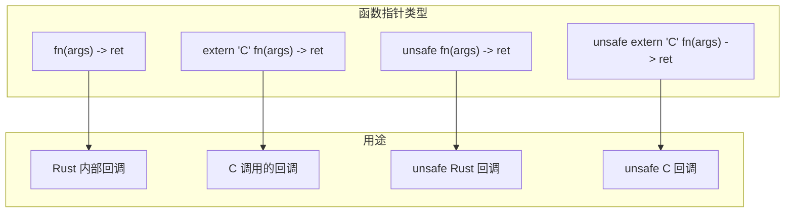

```rust
use std::os::raw::{c_int, c_void};

// 各种回调类型
type RustCallback = fn(i32) -> i32;
type CCallback = extern "C" fn(c_int) -> c_int;
type UnsafeCCallback = unsafe extern "C" fn(c_int) -> c_int;
type CallbackWithData = extern "C" fn(*mut c_void, c_int) -> c_int;

// 简单 C 回调
extern "C" fn simple_callback(value: c_int) -> c_int {
    println!("Callback called with: {}", value);
    value * 2
}

// 带用户数据的回调
struct CallbackContext {
    multiplier: i32,
    count: i32,
}

unsafe extern "C" fn callback_with_context(
    user_data: *mut c_void,
    value: c_int,
) -> c_int {
    if user_data.is_null() {
        return -1;
    }

    let ctx = &mut *(user_data as *mut CallbackContext);
    ctx.count += 1;
    value * ctx.multiplier as c_int
}

// C 库接口
unsafe extern "C" {
    fn register_callback(cb: extern "C" fn(c_int) -> c_int);
    fn register_callback_with_data(
        cb: unsafe extern "C" fn(*mut c_void, c_int) -> c_int,
        user_data: *mut c_void,
    );
    fn trigger_callbacks();
}

// 使用示例
fn callback_usage() {
    unsafe {
        // 注册简单回调
        register_callback(simple_callback);

        // 注册带上下文的回调
        let mut ctx = CallbackContext {
            multiplier: 10,
            count: 0,
        };
        register_callback_with_data(
            callback_with_context,
            &mut ctx as *mut CallbackContext as *mut c_void,
        );

        // 触发回调
        trigger_callbacks();

        println!("Callback was called {} times", ctx.count);
    }
}
```

### 闭包作为回调

```rust
use std::os::raw::{c_int, c_void};

// 将闭包转换为 C 回调

// 方法 1：使用 trampoline 函数
struct ClosureHolder<F> {
    closure: F,
}

// trampoline 函数
unsafe extern "C" fn closure_trampoline<F>(
    user_data: *mut c_void,
    arg: c_int,
) -> c_int
where
    F: FnMut(i32) -> i32,
{
    let holder = &mut *(user_data as *mut ClosureHolder<F>);
    (holder.closure)(arg as i32) as c_int
}

fn register_closure<F>(mut closure: F)
where
    F: FnMut(i32) -> i32 + 'static,
{
    let mut holder = Box::new(ClosureHolder { closure });

    unsafe {
        register_callback_with_data(
            closure_trampoline::<F>,
            holder.as_mut() as *mut ClosureHolder<F> as *mut c_void,
        );
    }

    // 注意：holder 的生命周期管理很重要！
    // 这里我们泄漏它以保持有效
    Box::leak(holder);
}

// 方法 2：使用 Box<dyn FnMut>
type DynCallback = Box<dyn FnMut(i32) -> i32>;

unsafe extern "C" fn dyn_closure_trampoline(
    user_data: *mut c_void,
    arg: c_int,
) -> c_int {
    let callback = &mut *(user_data as *mut DynCallback);
    callback(arg as i32) as c_int
}

fn register_dyn_closure<F>(closure: F)
where
    F: FnMut(i32) -> i32 + 'static,
{
    let boxed: DynCallback = Box::new(closure);
    let raw = Box::into_raw(Box::new(boxed));

    unsafe {
        register_callback_with_data(
            dyn_closure_trampoline,
            raw as *mut c_void,
        );
    }
}

// 方法 3：安全的回调管理器
struct CallbackManager {
    callbacks: Vec<Box<dyn FnMut(i32) -> i32>>,
}

impl CallbackManager {
    fn new() -> Self {
        CallbackManager {
            callbacks: Vec::new(),
        }
    }

    fn add_callback<F>(&mut self, callback: F) -> usize
    where
        F: FnMut(i32) -> i32 + 'static,
    {
        let index = self.callbacks.len();
        self.callbacks.push(Box::new(callback));
        index
    }

    fn call(&mut self, index: usize, arg: i32) -> Option<i32> {
        self.callbacks.get_mut(index).map(|cb| cb(arg))
    }
}

// 使用闭包的完整示例
fn closure_callback_example() {
    let mut counter = 0;

    // 使用闭包捕获环境
    register_closure(move |x| {
        counter += 1;
        println!("Call #{}: {}", counter, x);
        x * counter
    });
}
```

### 异步回调处理

```rust
use std::sync::{Arc, Mutex};
use std::os::raw::{c_int, c_void};

// 线程安全的回调上下文
struct AsyncContext {
    results: Arc<Mutex<Vec<i32>>>,
}

unsafe extern "C" fn async_callback(
    user_data: *mut c_void,
    result: c_int,
) {
    if user_data.is_null() {
        return;
    }

    let ctx = &*(user_data as *const AsyncContext);
    if let Ok(mut results) = ctx.results.lock() {
        results.push(result as i32);
    }
}

fn async_operation_example() {
    let results = Arc::new(Mutex::new(Vec::new()));
    let ctx = Box::new(AsyncContext {
        results: Arc::clone(&results),
    });

    unsafe {
        // 假设这个 C 函数会在另一个线程调用回调
        // start_async_operation(
        //     async_callback,
        //     Box::into_raw(ctx) as *mut c_void,
        // );
    }

    // 等待结果...
    std::thread::sleep(std::time::Duration::from_secs(1));

    let final_results = results.lock().unwrap();
    println!("Results: {:?}", *final_results);
}
```

## 11.7 空指针优化详解

### Option 与 FFI

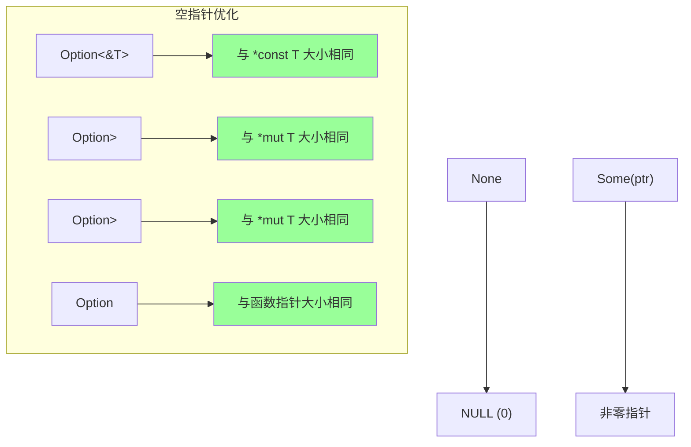

```rust
use std::ptr::NonNull;
use std::os::raw::c_void;

// 空指针优化的类型
fn niche_optimization_demo() {
    // 这些类型与裸指针大小相同
    assert_eq!(
        std::mem::size_of::<Option<&i32>>(),
        std::mem::size_of::<*const i32>()
    );

    assert_eq!(
        std::mem::size_of::<Option<Box<i32>>>(),
        std::mem::size_of::<*mut i32>()
    );

    assert_eq!(
        std::mem::size_of::<Option<NonNull<i32>>>(),
        std::mem::size_of::<*mut i32>()
    );

    assert_eq!(
        std::mem::size_of::<Option<extern "C" fn()>>(),
        std::mem::size_of::<extern "C" fn()>()
    );

    // 非引用类型不能优化
    assert_ne!(
        std::mem::size_of::<Option<i32>>(),
        std::mem::size_of::<i32>()
    );
}

// FFI 中使用 Option
#[unsafe(no_mangle)]
pub extern "C" fn process_optional_callback(
    callback: Option<extern "C" fn(i32) -> i32>,
) -> i32 {
    match callback {
        Some(cb) => cb(42),
        None => -1,
    }
}

// C 端可以传 NULL
// int result = process_optional_callback(NULL);  // 返回 -1
// int result = process_optional_callback(my_callback);  // 调用回调

// Option<NonNull<T>> 用于可能为空的指针
#[unsafe(no_mangle)]
pub extern "C" fn process_optional_ptr(
    ptr: Option<NonNull<c_void>>,
) -> i32 {
    match ptr {
        Some(p) => {
            // p 保证非空
            unsafe {
                let data = p.as_ptr() as *const i32;
                *data
            }
        }
        None => 0,
    }
}

// 安全封装：可选回调
pub struct OptionalCallback {
    callback: Option<extern "C" fn(i32) -> i32>,
}

impl OptionalCallback {
    pub fn new(cb: Option<extern "C" fn(i32) -> i32>) -> Self {
        OptionalCallback { callback: cb }
    }

    pub fn call(&self, arg: i32) -> Option<i32> {
        self.callback.map(|cb| cb(arg))
    }

    pub fn is_set(&self) -> bool {
        self.callback.is_some()
    }
}
```

### NonNull 用于 FFI

```rust
use std::ptr::NonNull;
use std::marker::PhantomData;

// 使用 NonNull 的安全包装
pub struct SafeHandle<T> {
    ptr: NonNull<T>,
    _marker: PhantomData<T>,
}

impl<T> SafeHandle<T> {
    /// 从裸指针创建，如果是 null 则返回 None
    pub fn new(ptr: *mut T) -> Option<Self> {
        NonNull::new(ptr).map(|p| SafeHandle {
            ptr: p,
            _marker: PhantomData,
        })
    }

    /// 不检查的创建（调用者保证非空）
    pub unsafe fn new_unchecked(ptr: *mut T) -> Self {
        SafeHandle {
            ptr: NonNull::new_unchecked(ptr),
            _marker: PhantomData,
        }
    }

    pub fn as_ptr(&self) -> *mut T {
        self.ptr.as_ptr()
    }

    pub fn get(&self) -> &T {
        unsafe { self.ptr.as_ref() }
    }

    pub fn get_mut(&mut self) -> &mut T {
        unsafe { self.ptr.as_mut() }
    }
}

// 与 Option 组合使用
pub fn process_handles(handles: &[Option<SafeHandle<i32>>]) {
    for handle in handles {
        if let Some(h) = handle {
            println!("Value: {}", h.get());
        }
    }
}
```

## 11.8 不透明类型详解

### 设计模式

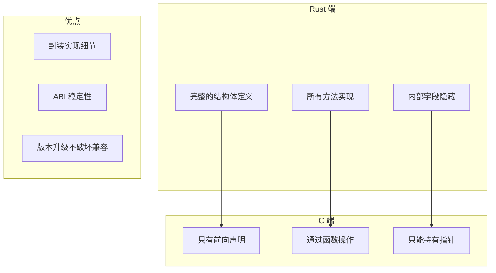

```rust
use std::os::raw::{c_char, c_int, c_void};
use std::ffi::CStr;

// ============ Rust 端完整实现 ============

/// 内部数据结构
pub struct Database {
    connection_string: String,
    pool_size: usize,
    queries_executed: u64,
    // 可以有任意复杂的内部状态
}

impl Database {
    pub fn new(connection_string: &str, pool_size: usize) -> Self {
        Database {
            connection_string: connection_string.to_string(),
            pool_size,
            queries_executed: 0,
        }
    }

    pub fn execute(&mut self, query: &str) -> Result<Vec<String>, String> {
        self.queries_executed += 1;
        // 实际执行查询...
        Ok(vec![format!("Result for: {}", query)])
    }

    pub fn get_stats(&self) -> (u64, usize) {
        (self.queries_executed, self.pool_size)
    }
}

// ============ FFI 接口 ============

/// 不透明类型的句柄
pub type DbHandle = *mut Database;

/// 创建数据库连接
#[unsafe(no_mangle)]
pub extern "C" fn db_create(
    connection_string: *const c_char,
    pool_size: c_int,
) -> DbHandle {
    if connection_string.is_null() {
        return std::ptr::null_mut();
    }

    let conn_str = unsafe {
        match CStr::from_ptr(connection_string).to_str() {
            Ok(s) => s,
            Err(_) => return std::ptr::null_mut(),
        }
    };

    if pool_size <= 0 {
        return std::ptr::null_mut();
    }

    let db = Box::new(Database::new(conn_str, pool_size as usize));
    Box::into_raw(db)
}

/// 销毁数据库连接
#[unsafe(no_mangle)]
pub extern "C" fn db_destroy(handle: DbHandle) {
    if !handle.is_null() {
        unsafe {
            drop(Box::from_raw(handle));
        }
    }
}

/// 执行查询
#[unsafe(no_mangle)]
pub extern "C" fn db_execute(
    handle: DbHandle,
    query: *const c_char,
) -> c_int {
    if handle.is_null() || query.is_null() {
        return -1;
    }

    let query_str = unsafe {
        match CStr::from_ptr(query).to_str() {
            Ok(s) => s,
            Err(_) => return -1,
        }
    };

    unsafe {
        match (*handle).execute(query_str) {
            Ok(_) => 0,
            Err(_) => -1,
        }
    }
}

/// 获取统计信息
#[unsafe(no_mangle)]
pub extern "C" fn db_get_query_count(handle: DbHandle) -> c_int {
    if handle.is_null() {
        return -1;
    }

    unsafe {
        let (count, _) = (*handle).get_stats();
        count as c_int
    }
}
```

### 对应的 C 头文件

```c
// database.h
#ifndef DATABASE_H
#define DATABASE_H

#include <stdint.h>

// 前向声明 - C 端看不到内部结构
typedef struct Database Database;
typedef Database* DbHandle;

// API 函数
DbHandle db_create(const char* connection_string, int32_t pool_size);
void db_destroy(DbHandle handle);
int32_t db_execute(DbHandle handle, const char* query);
int32_t db_get_query_count(DbHandle handle);

#endif
```

### 使用 PhantomData 防止直接构造

```rust
use std::marker::PhantomData;
use core::marker::PhantomPinned;

/// 真正不透明的类型
/// C 端无法创建、复制或移动此类型的值
#[repr(C)]
pub struct OpaqueType {
    /// 私有的零大小字段
    _data: (),
    /// 确保类型是 !Send, !Sync, !Unpin
    _marker: PhantomData<(*mut u8, PhantomPinned)>,
}

// 由于所有字段都是私有的，C 端：
// 1. 不能直接创建实例
// 2. 不能复制实例
// 3. 只能持有指针

// Rust 端可以定义真正的内部结构
struct OpaqueInternal {
    data: Vec<u8>,
    counter: i32,
}

// FFI 函数使用指针转换
#[unsafe(no_mangle)]
pub extern "C" fn opaque_create() -> *mut OpaqueType {
    let internal = Box::new(OpaqueInternal {
        data: Vec::new(),
        counter: 0,
    });
    Box::into_raw(internal) as *mut OpaqueType
}

#[unsafe(no_mangle)]
pub extern "C" fn opaque_destroy(ptr: *mut OpaqueType) {
    if !ptr.is_null() {
        unsafe {
            drop(Box::from_raw(ptr as *mut OpaqueInternal));
        }
    }
}

#[unsafe(no_mangle)]
pub extern "C" fn opaque_get_counter(ptr: *const OpaqueType) -> c_int {
    if ptr.is_null() {
        return -1;
    }
    unsafe {
        let internal = &*(ptr as *const OpaqueInternal);
        internal.counter
    }
}
```

## 11.9 Panic 与 FFI 详解

### Panic 边界

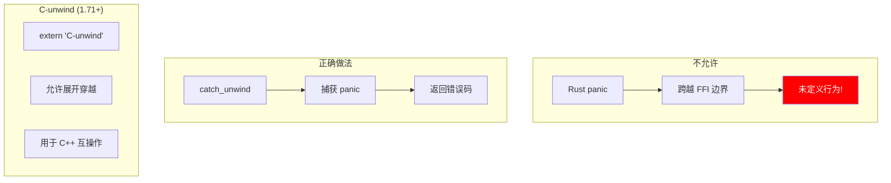

```rust
use std::panic::{self, catch_unwind, AssertUnwindSafe};
use std::os::raw::c_int;

// ============ 错误处理模式 ============

/// 错误码
#[repr(C)]
pub enum ErrorCode {
    Success = 0,
    NullPointer = -1,
    InvalidArgument = -2,
    InternalError = -3,
    Panicked = -100,
}

/// 带错误码的结果
#[repr(C)]
pub struct FfiResult {
    pub code: ErrorCode,
    pub value: c_int,
}

impl FfiResult {
    fn success(value: c_int) -> Self {
        FfiResult {
            code: ErrorCode::Success,
            value,
        }
    }

    fn error(code: ErrorCode) -> Self {
        FfiResult {
            code,
            value: 0,
        }
    }
}

// ============ 安全包装宏 ============

/// 包装可能 panic 的代码
macro_rules! ffi_try {
    ($expr:expr) => {
        match catch_unwind(AssertUnwindSafe(|| $expr)) {
            Ok(result) => result,
            Err(_) => return FfiResult::error(ErrorCode::Panicked),
        }
    };
}

/// 导出函数示例
#[unsafe(no_mangle)]
pub extern "C" fn safe_divide(a: c_int, b: c_int) -> FfiResult {
    ffi_try!({
        if b == 0 {
            return FfiResult::error(ErrorCode::InvalidArgument);
        }
        FfiResult::success(a / b)
    })
}

// ============ 详细的错误信息 ============

use std::cell::RefCell;

thread_local! {
    static LAST_ERROR: RefCell<Option<String>> = RefCell::new(None);
}

fn set_last_error(msg: String) {
    LAST_ERROR.with(|e| {
        *e.borrow_mut() = Some(msg);
    });
}

fn clear_last_error() {
    LAST_ERROR.with(|e| {
        *e.borrow_mut() = None;
    });
}

#[unsafe(no_mangle)]
pub extern "C" fn get_last_error_length() -> c_int {
    LAST_ERROR.with(|e| {
        e.borrow().as_ref().map_or(0, |s| s.len() as c_int + 1)
    })
}

#[unsafe(no_mangle)]
pub extern "C" fn get_last_error(buffer: *mut c_char, length: c_int) -> c_int {
    if buffer.is_null() {
        return -1;
    }

    LAST_ERROR.with(|e| {
        if let Some(ref msg) = *e.borrow() {
            let msg_bytes = msg.as_bytes();
            let copy_len = std::cmp::min(msg_bytes.len(), length as usize - 1);

            unsafe {
                std::ptr::copy_nonoverlapping(
                    msg_bytes.as_ptr(),
                    buffer as *mut u8,
                    copy_len,
                );
                *buffer.add(copy_len) = 0;  // null 终止
            }

            copy_len as c_int
        } else {
            0
        }
    })
}

/// 带详细错误信息的函数
#[unsafe(no_mangle)]
pub extern "C" fn complex_operation(input: c_int) -> c_int {
    clear_last_error();

    let result = catch_unwind(AssertUnwindSafe(|| {
        if input < 0 {
            set_last_error("Input must be non-negative".to_string());
            return Err(ErrorCode::InvalidArgument);
        }

        if input > 1000 {
            set_last_error(format!("Input {} exceeds maximum of 1000", input));
            return Err(ErrorCode::InvalidArgument);
        }

        Ok(input * 2)
    }));

    match result {
        Ok(Ok(value)) => value,
        Ok(Err(code)) => code as c_int,
        Err(payload) => {
            // 捕获 panic 信息
            let msg = if let Some(s) = payload.downcast_ref::<&str>() {
                s.to_string()
            } else if let Some(s) = payload.downcast_ref::<String>() {
                s.clone()
            } else {
                "Unknown panic".to_string()
            };
            set_last_error(msg);
            ErrorCode::Panicked as c_int
        }
    }
}
```

### C-unwind ABI

```rust
// Rust 1.71+ 支持 C-unwind

/// 允许 panic 穿越边界
#[unsafe(no_mangle)]
pub extern "C-unwind" fn may_panic_through_c() {
    panic!("This panic can unwind through C frames");
}

/// 调用可能抛异常的 C++ 代码
extern "C-unwind" {
    fn cpp_function_that_throws();
}

fn call_cpp_safely() {
    let result = catch_unwind(AssertUnwindSafe(|| {
        unsafe {
            cpp_function_that_throws();
        }
    }));

    match result {
        Ok(()) => println!("C++ function completed"),
        Err(_) => println!("C++ function threw an exception"),
    }
}

// 回调场景
extern "C-unwind" fn rust_callback_for_cpp(value: c_int) -> c_int {
    if value < 0 {
        panic!("Negative value not allowed");
    }
    value * 2
}

extern "C" {
    fn register_cpp_callback(cb: extern "C-unwind" fn(c_int) -> c_int);
}
```

### panic 与 abort

```rust
// 在 Cargo.toml 中配置
// [profile.release]
// panic = "abort"

// 代码中检查 panic 策略
fn demonstrate_panic_strategy() {
    // 检查当前 panic 策略
    #[cfg(panic = "unwind")]
    {
        println!("Using unwind strategy - can catch panics");
    }

    #[cfg(panic = "abort")]
    {
        println!("Using abort strategy - panics terminate immediately");
    }

    // 条件编译 FFI 代码
    #[cfg(panic = "unwind")]
    {
        // 可以使用 catch_unwind
        let _ = catch_unwind(|| {
            // ...
        });
    }

    #[cfg(panic = "abort")]
    {
        // 不需要 catch_unwind，panic 会直接 abort
    }
}
```

## 11.10 全局变量详解

### 访问 C 全局变量

```rust
use std::os::raw::{c_char, c_int};

// 只读全局变量
#[link(name = "c_lib")]
unsafe extern "C" {
    static VERSION: c_int;
    static BUILD_DATE: *const c_char;
}

fn read_globals() {
    unsafe {
        println!("Version: {}", VERSION);

        if !BUILD_DATE.is_null() {
            let date = std::ffi::CStr::from_ptr(BUILD_DATE);
            println!("Build date: {:?}", date);
        }
    }
}

// 可变全局变量
#[link(name = "c_lib")]
unsafe extern "C" {
    static mut error_code: c_int;
    static mut error_message: *const c_char;
}

fn handle_error() {
    unsafe {
        if error_code != 0 {
            println!("Error code: {}", error_code);

            if !error_message.is_null() {
                let msg = std::ffi::CStr::from_ptr(error_message);
                println!("Error message: {:?}", msg);
            }

            // 重置
            error_code = 0;
            error_message = std::ptr::null();
        }
    }
}
```

### 导出 Rust 全局变量

```rust
use std::sync::atomic::{AtomicI32, Ordering};

// 导出原子全局变量
#[unsafe(no_mangle)]
pub static RUST_VERSION: i32 = 1;

// 导出可变全局变量（需要 mut，不推荐）
#[unsafe(no_mangle)]
pub static mut RUST_COUNTER: i32 = 0;

// 推荐：使用原子类型
#[unsafe(no_mangle)]
pub static ATOMIC_COUNTER: AtomicI32 = AtomicI32::new(0);

#[unsafe(no_mangle)]
pub extern "C" fn increment_counter() -> i32 {
    ATOMIC_COUNTER.fetch_add(1, Ordering::SeqCst)
}

#[unsafe(no_mangle)]
pub extern "C" fn get_counter() -> i32 {
    ATOMIC_COUNTER.load(Ordering::SeqCst)
}

// 使用 OnceLock 延迟初始化
use std::sync::OnceLock;

static LAZY_DATA: OnceLock<Vec<i32>> = OnceLock::new();

#[unsafe(no_mangle)]
pub extern "C" fn init_lazy_data() {
    LAZY_DATA.get_or_init(|| {
        vec![1, 2, 3, 4, 5]
    });
}

#[unsafe(no_mangle)]
pub extern "C" fn get_lazy_data_sum() -> i32 {
    LAZY_DATA.get()
        .map(|v| v.iter().sum())
        .unwrap_or(-1)
}
```

## 11.11 高级主题

### bindgen 自动生成绑定

```rust
// build.rs
fn main() {
    // 使用 bindgen 生成绑定
    println!("cargo:rerun-if-changed=wrapper.h");

    let bindings = bindgen::Builder::default()
        .header("wrapper.h")
        // 只生成特定函数
        .allowlist_function("my_.*")
        // 只生成特定类型
        .allowlist_type("My.*")
        // 使用 Rust 枚举
        .rustified_enum("MyEnum")
        // 派生 trait
        .derive_debug(true)
        .derive_default(true)
        // 生成
        .generate()
        .expect("Unable to generate bindings");

    // 写入文件
    let out_path = std::path::PathBuf::from(std::env::var("OUT_DIR").unwrap());
    bindings
        .write_to_file(out_path.join("bindings.rs"))
        .expect("Couldn't write bindings!");
}
```

```rust
// lib.rs
#![allow(non_upper_case_globals)]
#![allow(non_camel_case_types)]
#![allow(non_snake_case)]

// 包含生成的绑定
include!(concat!(env!("OUT_DIR"), "/bindings.rs"));
```

### cbindgen 生成 C 头文件

```toml
# cbindgen.toml
language = "C"
header = "/* Auto-generated header */"
include_guard = "MY_LIB_H"
autogen_warning = "/* Warning: this file is auto-generated */"

[export]
include = ["my_function", "MyStruct"]

[enum]
rename_variants = "ScreamingSnakeCase"

[struct]
derive_eq = true
```

```rust
// build.rs
fn main() {
    let crate_dir = std::env::var("CARGO_MANIFEST_DIR").unwrap();

    cbindgen::Builder::new()
        .with_crate(&crate_dir)
        .with_config(cbindgen::Config::from_file("cbindgen.toml").unwrap())
        .generate()
        .expect("Unable to generate bindings")
        .write_to_file("include/my_lib.h");
}
```

### 跨平台考虑

```rust
// 平台特定的类型
#[cfg(target_os = "windows")]
mod platform {
    pub type Handle = *mut std::os::raw::c_void;
    pub type ErrorCode = u32;  // DWORD

    #[link(name = "kernel32")]
    unsafe extern "system" {
        pub fn GetLastError() -> ErrorCode;
        pub fn CloseHandle(handle: Handle) -> i32;
    }
}

#[cfg(target_os = "linux")]
mod platform {
    pub type Handle = std::os::raw::c_int;  // file descriptor
    pub type ErrorCode = std::os::raw::c_int;

    unsafe extern "C" {
        pub fn close(fd: Handle) -> std::os::raw::c_int;
    }

    pub fn get_last_error() -> ErrorCode {
        unsafe { *libc::__errno_location() }
    }
}

#[cfg(target_os = "macos")]
mod platform {
    pub type Handle = std::os::raw::c_int;
    pub type ErrorCode = std::os::raw::c_int;

    unsafe extern "C" {
        pub fn close(fd: Handle) -> std::os::raw::c_int;
    }

    pub fn get_last_error() -> ErrorCode {
        unsafe { *libc::__error() }
    }
}

// 跨平台 API
pub fn close_handle(handle: platform::Handle) -> Result<(), platform::ErrorCode> {
    #[cfg(target_os = "windows")]
    unsafe {
        if platform::CloseHandle(handle) == 0 {
            return Err(platform::GetLastError());
        }
    }

    #[cfg(any(target_os = "linux", target_os = "macos"))]
    unsafe {
        if platform::close(handle) == -1 {
            return Err(platform::get_last_error());
        }
    }

    Ok(())
}
```

### 性能优化

```rust
// 减少 FFI 调用开销

// 1. 批量处理
#[unsafe(no_mangle)]
pub extern "C" fn process_batch(
    items: *const i32,
    len: usize,
    results: *mut i32,
) -> c_int {
    if items.is_null() || results.is_null() {
        return -1;
    }

    unsafe {
        let input = std::slice::from_raw_parts(items, len);
        let output = std::slice::from_raw_parts_mut(results, len);

        for (i, &item) in input.iter().enumerate() {
            output[i] = item * 2;
        }
    }

    0
}

// 2. 避免不必要的复制
#[unsafe(no_mangle)]
pub extern "C" fn process_in_place(
    data: *mut i32,
    len: usize,
) -> c_int {
    if data.is_null() {
        return -1;
    }

    unsafe {
        let slice = std::slice::from_raw_parts_mut(data, len);
        for item in slice.iter_mut() {
            *item *= 2;
        }
    }

    0
}

// 3. 使用内联提示
#[inline(always)]
fn fast_computation(x: i32) -> i32 {
    x * 2 + 1
}

#[unsafe(no_mangle)]
pub extern "C" fn optimized_function(x: c_int) -> c_int {
    fast_computation(x as i32) as c_int
}
```

## 11.12 完整示例：图像处理库

```rust
// 一个完整的 FFI 库示例

use std::os::raw::{c_char, c_int, c_uint};
use std::ptr;
use std::slice;
use std::panic::catch_unwind;
use std::panic::AssertUnwindSafe;

// ============ 类型定义 ============

#[repr(C)]
pub struct Image {
    width: c_uint,
    height: c_uint,
    channels: c_uint,
    data: *mut u8,
}

#[repr(C)]
pub enum ImageFormat {
    RGB = 0,
    RGBA = 1,
    Grayscale = 2,
}

#[repr(C)]
pub enum ImageError {
    Success = 0,
    NullPointer = -1,
    InvalidDimensions = -2,
    AllocationFailed = -3,
    InternalError = -100,
}

// ============ 内部实现 ============

impl Image {
    fn new(width: u32, height: u32, channels: u32) -> Option<Self> {
        if width == 0 || height == 0 || channels == 0 {
            return None;
        }

        let size = (width as usize)
            .checked_mul(height as usize)?
            .checked_mul(channels as usize)?;

        let mut data = vec![0u8; size];
        let ptr = data.as_mut_ptr();
        std::mem::forget(data);

        Some(Image {
            width,
            height,
            channels,
            data: ptr,
        })
    }

    fn data_slice(&self) -> &[u8] {
        let size = (self.width as usize)
            * (self.height as usize)
            * (self.channels as usize);
        unsafe { slice::from_raw_parts(self.data, size) }
    }

    fn data_slice_mut(&mut self) -> &mut [u8] {
        let size = (self.width as usize)
            * (self.height as usize)
            * (self.channels as usize);
        unsafe { slice::from_raw_parts_mut(self.data, size) }
    }
}

impl Drop for Image {
    fn drop(&mut self) {
        if !self.data.is_null() {
            let size = (self.width as usize)
                * (self.height as usize)
                * (self.channels as usize);
            unsafe {
                drop(Vec::from_raw_parts(self.data, size, size));
            }
        }
    }
}

// ============ FFI 接口 ============

#[unsafe(no_mangle)]
pub extern "C" fn image_create(
    width: c_uint,
    height: c_uint,
    format: ImageFormat,
) -> *mut Image {
    let channels = match format {
        ImageFormat::RGB => 3,
        ImageFormat::RGBA => 4,
        ImageFormat::Grayscale => 1,
    };

    match Image::new(width, height, channels) {
        Some(img) => Box::into_raw(Box::new(img)),
        None => ptr::null_mut(),
    }
}

#[unsafe(no_mangle)]
pub extern "C" fn image_destroy(img: *mut Image) {
    if !img.is_null() {
        unsafe {
            drop(Box::from_raw(img));
        }
    }
}

#[unsafe(no_mangle)]
pub extern "C" fn image_get_width(img: *const Image) -> c_int {
    if img.is_null() {
        return -1;
    }
    unsafe { (*img).width as c_int }
}

#[unsafe(no_mangle)]
pub extern "C" fn image_get_height(img: *const Image) -> c_int {
    if img.is_null() {
        return -1;
    }
    unsafe { (*img).height as c_int }
}

#[unsafe(no_mangle)]
pub extern "C" fn image_fill(img: *mut Image, value: u8) -> ImageError {
    if img.is_null() {
        return ImageError::NullPointer;
    }

    let result = catch_unwind(AssertUnwindSafe(|| {
        unsafe {
            (*img).data_slice_mut().fill(value);
        }
    }));

    match result {
        Ok(()) => ImageError::Success,
        Err(_) => ImageError::InternalError,
    }
}

#[unsafe(no_mangle)]
pub extern "C" fn image_invert(img: *mut Image) -> ImageError {
    if img.is_null() {
        return ImageError::NullPointer;
    }

    let result = catch_unwind(AssertUnwindSafe(|| {
        unsafe {
            for byte in (*img).data_slice_mut() {
                *byte = 255 - *byte;
            }
        }
    }));

    match result {
        Ok(()) => ImageError::Success,
        Err(_) => ImageError::InternalError,
    }
}

#[unsafe(no_mangle)]
pub extern "C" fn image_copy_data(
    img: *const Image,
    buffer: *mut u8,
    buffer_len: usize,
) -> ImageError {
    if img.is_null() || buffer.is_null() {
        return ImageError::NullPointer;
    }

    let result = catch_unwind(AssertUnwindSafe(|| {
        unsafe {
            let data = (*img).data_slice();
            if buffer_len < data.len() {
                return ImageError::InvalidDimensions;
            }
            ptr::copy_nonoverlapping(data.as_ptr(), buffer, data.len());
            ImageError::Success
        }
    }));

    match result {
        Ok(err) => err,
        Err(_) => ImageError::InternalError,
    }
}
```

## 11.13 总结

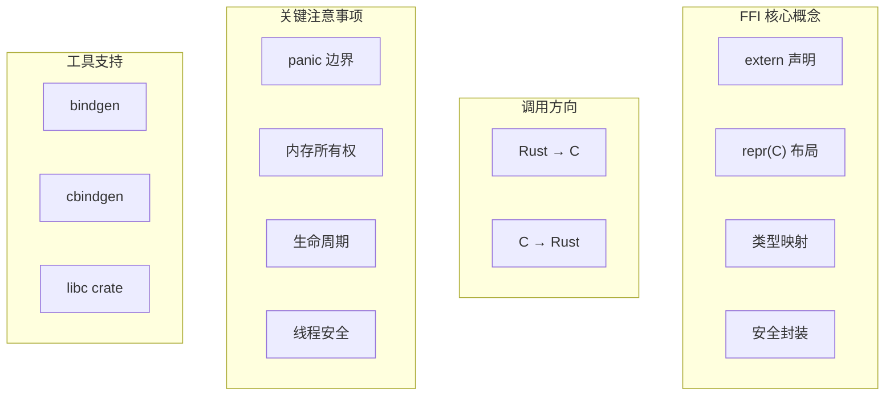

### 核心要点

1. **所有 FFI 调用都是 unsafe**：Rust 无法验证外部代码的正确性
2. **使用 repr(C)**：确保结构体内存布局与 C 兼容
3. **panic 绝不能跨越 FFI 边界**：使用 catch_unwind 捕获，或使用 C-unwind
4. **创建安全封装**：在底层 unsafe 代码之上提供安全的 Rust API
5. **注意字符串转换**：Rust String ≠ C string，使用 CString/CStr
6. **管理内存所有权**：明确谁分配、谁释放
7. **处理空指针**：利用 Option 和空指针优化

### 设计决策总结

| 场景 | 推荐做法 | 原因 |
|------|----------|------|
| 结构体 FFI | repr(C) | 确保布局兼容 |
| 枚举 FFI | repr(C) 或 repr(i32) | C 兼容的大小 |
| 字符串传递 | CString/CStr | null 终止 + 编码处理 |
| 可空指针 | Option<NonNull<T>> | 空指针优化 |
| 错误处理 | 错误码 + thread-local 错误信息 | C 兼容 |
| Panic 处理 | catch_unwind | 防止 UB |
| 不透明类型 | 前向声明 + 函数操作 | 封装实现 |
| 回调 | extern "C" fn + 用户数据 | C 兼容 |

### 检查清单

编写 FFI 代码时，确保：

- [ ] 使用 repr(C) 声明 FFI 结构体
- [ ] 使用正确的 C 类型（c_int, c_char 等）
- [ ] 处理空指针情况
- [ ] 使用 catch_unwind 包装可能 panic 的代码
- [ ] 正确管理内存所有权
- [ ] 测试跨语言边界的行为
- [ ] 提供清晰的头文件/文档
- [ ] 考虑跨平台兼容性

---

恭喜完成 Rust 死灵书的学习！这些知识将帮助你编写更安全、更高效的 unsafe 代码和 FFI 绑定。
