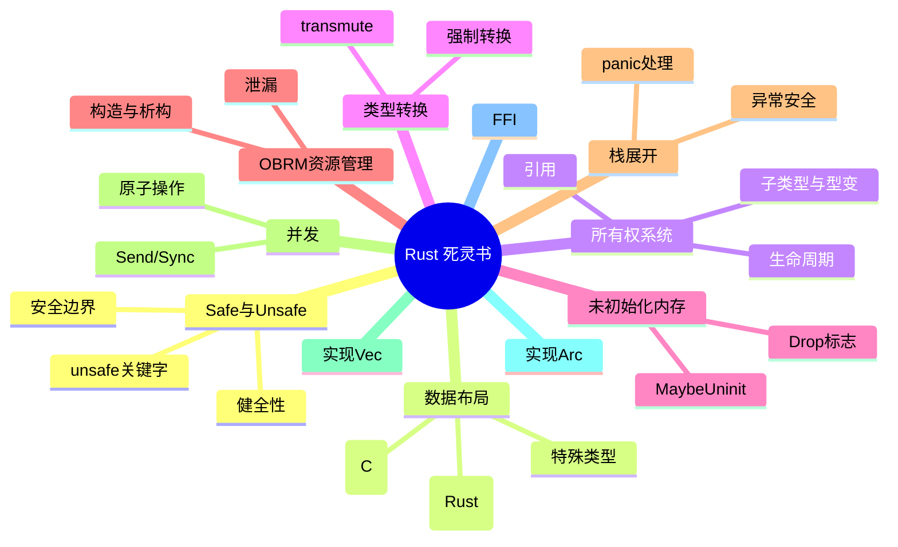
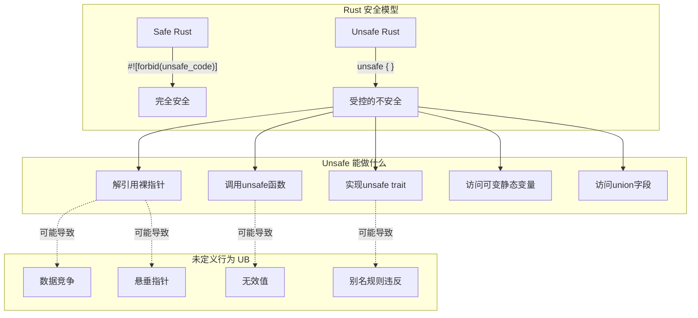

# Rust 死灵书 (Rustonomicon) 深度解析

> **The Dark Arts of Unsafe Rust - Unsafe Rust 的黑魔法**

本文档是对 Rust Nomicon（Rust 死灵书）的深度中文解析，通过图文并茂的方式帮助你理解 Unsafe Rust 的核心概念。

## 目录

| 专题 | 描述 | 链接 |
|------|------|------|
| 1. Safe与Unsafe | 理解Rust的安全边界 | [safe-unsafe.md](./01-safe-unsafe.md) |
| 2. 数据布局 | 内存中的数据表示 | [data-layout.md](./02-data-layout.md) |
| 3. 所有权系统 | 所有权、借用与生命周期 | [ownership.md](./03-ownership.md) |
| 4. 类型转换 | 安全与不安全的类型转换 | [conversions.md](./04-conversions.md) |
| 5. 未初始化内存 | 处理未初始化的数据 | [uninitialized.md](./05-uninitialized.md) |
| 6. OBRM资源管理 | 基于所有权的资源管理 | [obrm.md](./06-obrm.md) |
| 7. 栈展开 | panic与异常安全 | [unwinding.md](./07-unwinding.md) |
| 8. 并发 | 线程安全与原子操作 | [concurrency.md](./08-concurrency.md) |
| 9. 实现Vec | 从零实现动态数组 | [vec.md](./09-vec.md) |
| 10. 实现Arc | 原子引用计数 | [arc.md](./10-arc.md) |
| 11. FFI | 外部函数接口 | [ffi.md](./11-ffi.md) |

## 核心概念总览

## 阅读建议

1. **先决条件**: 熟悉 Rust 基础语法和所有权系统
2. **阅读顺序**: 建议按目录顺序阅读，概念循序渐进
3. **实践建议**: 在安全的环境中尝试示例代码
4. **警告**: 永远不要在生产代码中盲目使用 unsafe

---

*本文档基于 Rust Nomicon 原始内容，进行了深度解析和可视化增强。*
