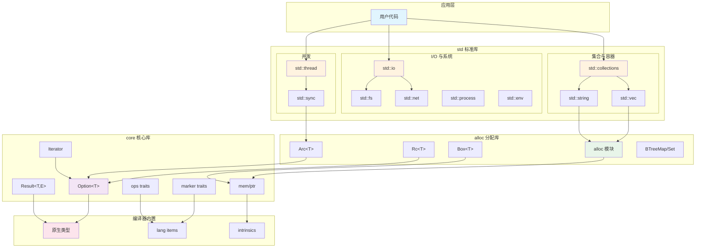
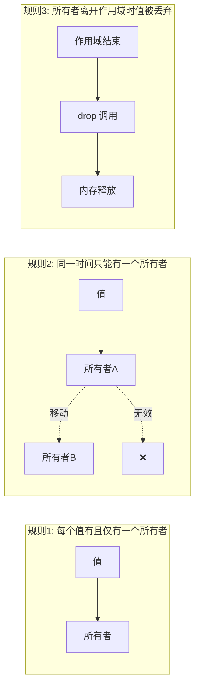
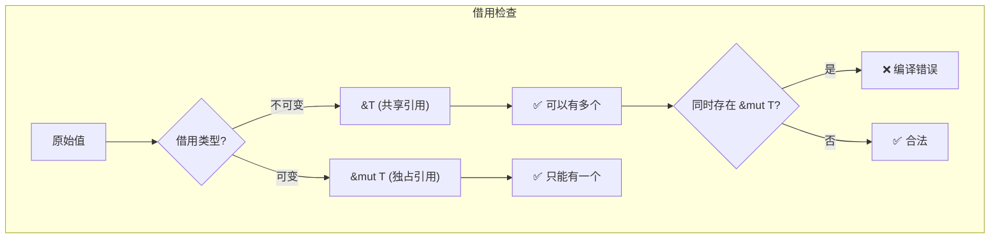
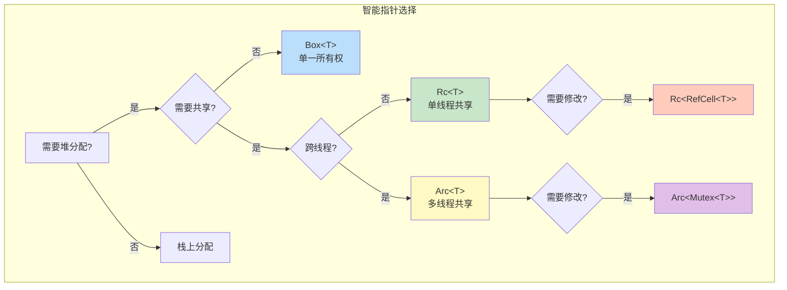

# Rust 标准库 (std) 深度分析文档

> 基于 Rust 1.90.0 版本 | 文档生成日期: 2025-11-30

## 📚 文档导航

| 分类 | 文档 | 描述 |
|------|------|------|
| **概述** | [架构总览](overview/architecture.md) | std/core/alloc 分层架构 |
| | [内存模型](overview/memory-model.md) | 所有权、借用、生命周期 |
| | [类型系统](overview/type-system.md) | Trait、泛型、关联类型 |
| **模块** | [集合类型](modules/collections.md) | Vec、HashMap、BTreeMap 等 |
| | [并发编程](modules/concurrency.md) | 线程、同步原语、通道 |
| | [I/O 系统](modules/io.md) | Read、Write、文件、网络 |
| | [错误处理](modules/error-handling.md) | Option、Result、Error trait |
| | [迭代器](modules/iterator.md) | Iterator trait 与适配器 |
| **原生类型** | [原生类型](primitives/primitives.md) | 标量、复合、指针类型 |
| **高级** | [智能指针](advanced/smart-pointers.md) | Box、Rc、Arc、Cell 等 |
| | [异步编程](advanced/async.md) | Future、async/await |

---

## 🏗️ Rust 标准库架构总览



---

## 📦 模块分类

### 核心类型模块

| 模块 | 描述 | 关键类型 |
|------|------|----------|
| `option` | 可选值 | `Option<T>`, `Some`, `None` |
| `result` | 错误处理 | `Result<T,E>`, `Ok`, `Err` |
| `iter` | 迭代器 | `Iterator`, `IntoIterator` |
| `cmp` | 比较 | `Eq`, `Ord`, `PartialEq`, `PartialOrd` |
| `convert` | 类型转换 | `From`, `Into`, `TryFrom`, `TryInto` |
| `default` | 默认值 | `Default` |
| `clone` | 克隆 | `Clone` |

### 数据结构模块

| 模块 | 描述 | 关键类型 |
|------|------|----------|
| `vec` | 动态数组 | `Vec<T>` |
| `string` | UTF-8 字符串 | `String` |
| `collections` | 集合容器 | `HashMap`, `BTreeMap`, `VecDeque` 等 |
| `boxed` | 堆分配 | `Box<T>` |
| `rc` | 引用计数 | `Rc<T>`, `Weak<T>` |
| `sync` | 同步共享 | `Arc<T>`, `Mutex<T>`, `RwLock<T>` |
| `cell` | 内部可变性 | `Cell<T>`, `RefCell<T>` |

### I/O 与系统模块

| 模块 | 描述 | 关键类型 |
|------|------|----------|
| `io` | I/O trait 和工具 | `Read`, `Write`, `BufReader` |
| `fs` | 文件系统 | `File`, `OpenOptions` |
| `net` | 网络 | `TcpStream`, `UdpSocket` |
| `path` | 路径 | `Path`, `PathBuf` |
| `env` | 环境变量 | `var()`, `args()` |
| `process` | 进程 | `Command`, `Child` |
| `thread` | 线程 | `spawn()`, `JoinHandle` |
| `time` | 时间 | `Duration`, `Instant` |

---

## 🔑 核心概念速查

### 所有权三原则



### 借用规则



### 智能指针对比



---

## 📊 类型大小参考 (64位系统)

| 类型 | 大小 (字节) | 说明 |
|------|------------|------|
| `i8` / `u8` / `bool` | 1 | 最小整数/布尔 |
| `i16` / `u16` | 2 | 短整数 |
| `i32` / `u32` / `f32` | 4 | 默认整数/单精度浮点 |
| `i64` / `u64` / `f64` | 8 | 长整数/双精度浮点 |
| `i128` / `u128` | 16 | 超长整数 |
| `char` | 4 | Unicode 标量值 |
| `usize` / `isize` | 8 | 指针大小整数 |
| `&T` / `*const T` | 8 | 瘦指针 |
| `&[T]` / `&str` | 16 | 胖指针 (ptr + len) |
| `&dyn Trait` | 16 | trait 对象 (ptr + vtable) |
| `Box<T>` | 8 | 堆指针 |
| `Vec<T>` | 24 | ptr + len + capacity |
| `String` | 24 | 同 `Vec<u8>` |
| `Option<&T>` | 8 | 空指针优化 |
| `Result<T, E>` | max(T,E) + tag | 根据类型变化 |

---

## 🚀 快速参考

### 常用宏

```rust
// 输出
println!("格式化: {}, {:?}, {:#?}", val, debug, pretty);
eprintln!("错误输出");
dbg!(expression);  // 调试打印

// 格式化
format!("Hello, {}!", name);
write!(buf, "text")?;

// 集合
vec![1, 2, 3];
assert_eq!(a, b);
assert!(condition);

// 错误处理
panic!("崩溃消息");
todo!();
unimplemented!();
unreachable!();
```

### 常用 trait 方法

```rust
// Clone
let b = a.clone();

// Default
let d = MyType::default();

// From/Into
let s: String = "hello".into();
let s = String::from("hello");

// Iterator
iter.map(f).filter(p).collect::<Vec<_>>();
iter.fold(init, f);
iter.find(p);

// Option
opt.unwrap_or(default);
opt.map(f);
opt.and_then(f);
opt?;  // 提前返回

// Result
res.map_err(f);
res.ok();
res?;  // 传播错误
```

---

## 📁 文档目录结构

```
std/
├── README.md                    # 本文件
├── overview/
│   ├── architecture.md          # 架构详解
│   ├── memory-model.md          # 内存模型
│   └── type-system.md           # 类型系统
├── modules/
│   ├── collections.md           # 集合类型
│   ├── concurrency.md           # 并发编程
│   ├── io.md                    # I/O 系统
│   ├── error-handling.md        # 错误处理
│   └── iterator.md              # 迭代器
├── primitives/
│   └── primitives.md            # 原生类型
└── advanced/
    ├── smart-pointers.md        # 智能指针
    └── async.md                 # 异步编程
```
