# Rust 异步编程详解

## 1. 异步概览

Rust 的异步模型基于 Future trait，提供零成本异步抽象。

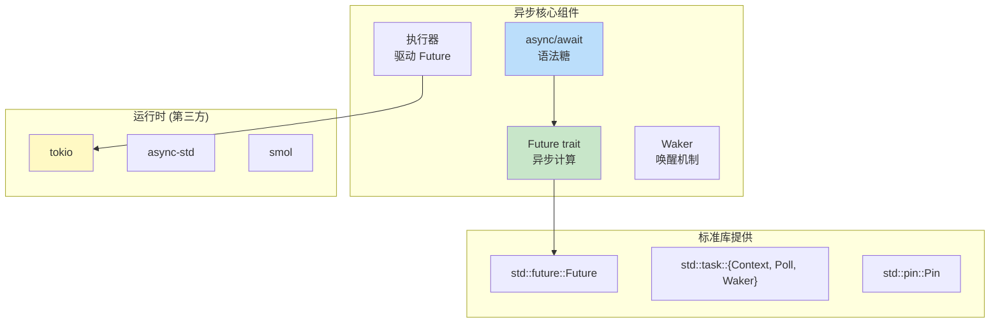
```mermaid
graph TB
    subgraph "异步核心组件"
        FUTURE["Future trait<br/>异步计算"]
        ASYNC["async/await<br/>语法糖"]
        EXECUTOR["执行器<br/>驱动 Future"]
        WAKER["Waker<br/>唤醒机制"]
    end

    subgraph "标准库提供"
        STD_FUTURE["std::future::Future"]
        STD_TASK["std::task::{Context, Poll, Waker}"]
        STD_PIN["std::pin::Pin"]
    end

    subgraph "运行时 (第三方)"
        TOKIO["tokio"]
        ASYNC_STD["async-std"]
        SMOL["smol"]
    end

    FUTURE --> STD_FUTURE
    ASYNC --> FUTURE
    EXECUTOR --> TOKIO

    style FUTURE fill:#c8e6c9
    style ASYNC fill:#bbdefb
    style TOKIO fill:#fff9c4
```

---

## 2. Future Trait

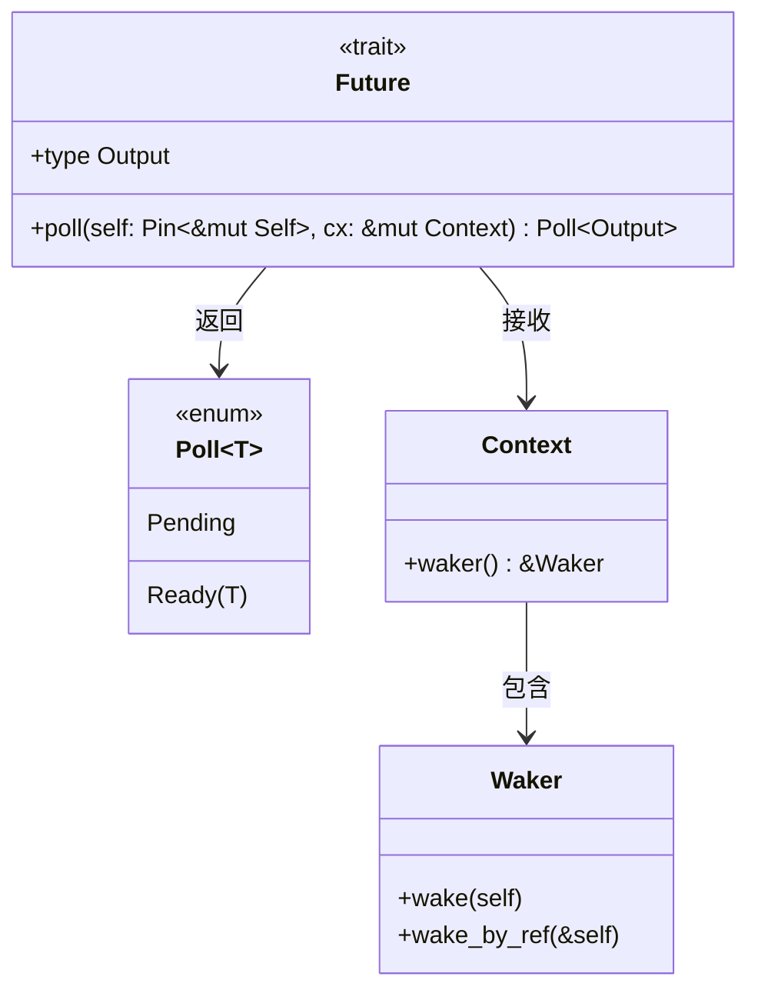
```mermaid
classDiagram
    class Future {
        <<trait>>
        +type Output
        +poll(self: Pin~&mut Self~, cx: &mut Context) Poll~Output~
    }

    class Poll~T~ {
        <<enum>>
        Ready(T)
        Pending
    }

    class Context {
        +waker() &Waker
    }

    class Waker {
        +wake(self)
        +wake_by_ref(&self)
    }

    Future --> Poll : 返回
    Future --> Context : 接收
    Context --> Waker : 包含
```

### Future 状态机

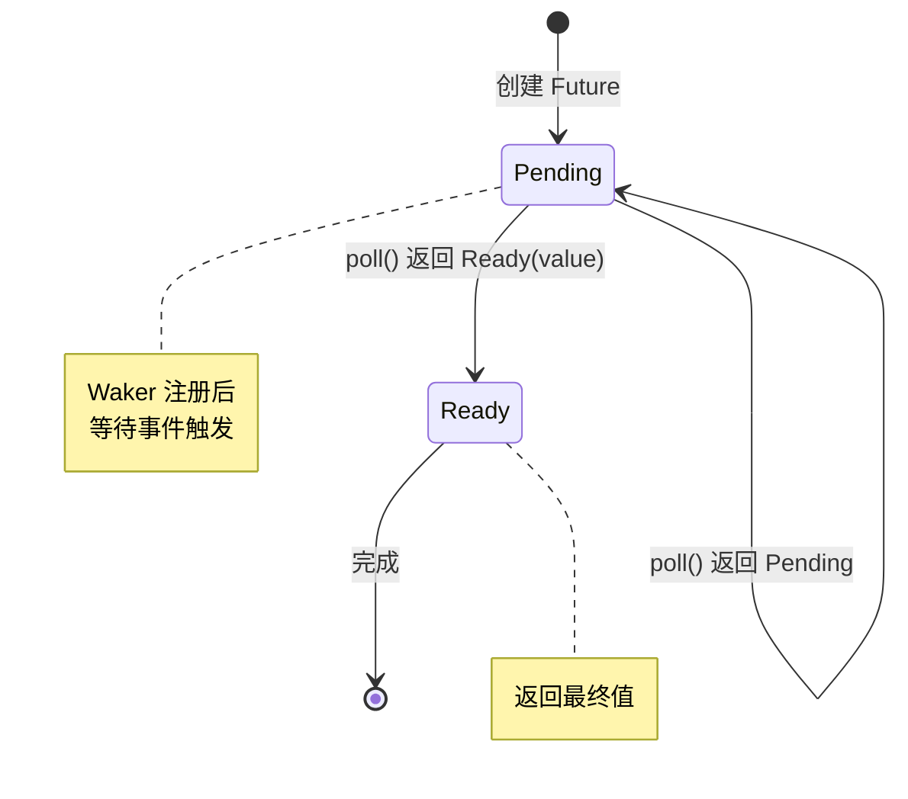
```mermaid
stateDiagram-v2
    [*] --> Pending: 创建 Future

    Pending --> Pending: poll() 返回 Pending
    Pending --> Ready: poll() 返回 Ready(value)

    Ready --> [*]: 完成

    note right of Pending: Waker 注册后<br/>等待事件触发
    note right of Ready: 返回最终值
```

---

## 3. async/await 语法

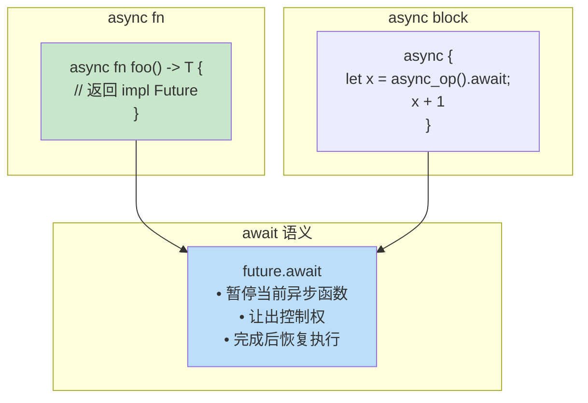
```mermaid
graph TB
    subgraph "async fn"
        ASYNC_FN["async fn foo() -> T {<br/>    // 返回 impl Future<Output=T><br/>}"]
    end

    subgraph "async block"
        ASYNC_BLOCK["async {<br/>    let x = async_op().await;<br/>    x + 1<br/>}"]
    end

    subgraph "await 语义"
        AWAIT["future.await<br/>• 暂停当前异步函数<br/>• 让出控制权<br/>• 完成后恢复执行"]
    end

    ASYNC_FN --> AWAIT
    ASYNC_BLOCK --> AWAIT

    style ASYNC_FN fill:#c8e6c9
    style AWAIT fill:#bbdefb
```

### async fn 展开

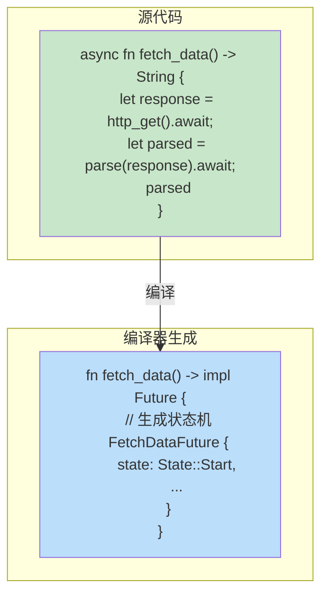
```mermaid
graph TB
    subgraph "源代码"
        SOURCE["async fn fetch_data() -> String {<br/>    let response = http_get().await;<br/>    let parsed = parse(response).await;<br/>    parsed<br/>}"]
    end

    subgraph "编译器生成"
        GENERATED["fn fetch_data() -> impl Future<Output=String> {<br/>    // 生成状态机<br/>    FetchDataFuture {<br/>        state: State::Start,<br/>        ...<br/>    }<br/>}"]
    end

    SOURCE -->|编译| GENERATED

    style SOURCE fill:#c8e6c9
    style GENERATED fill:#bbdefb
```

---

## 4. 执行器与运行时

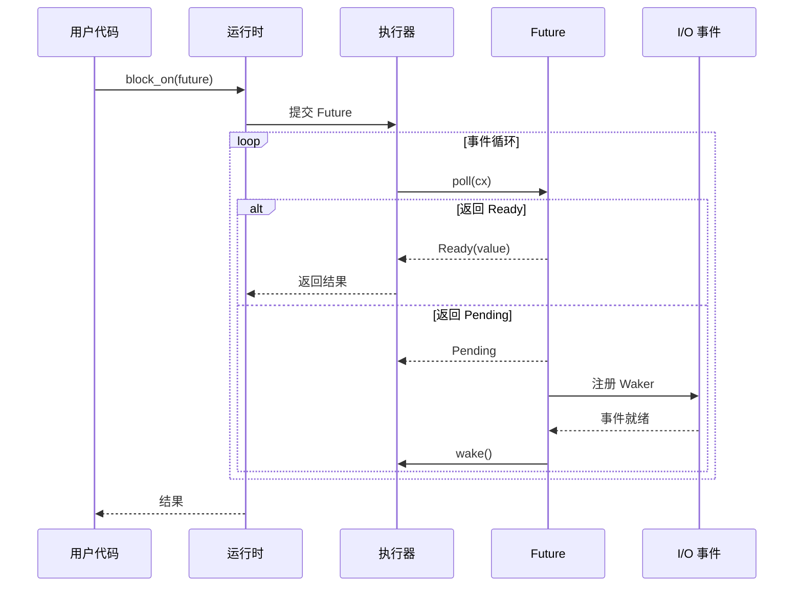
```mermaid
sequenceDiagram
    participant User as 用户代码
    participant Runtime as 运行时
    participant Executor as 执行器
    participant Future as Future
    participant IO as I/O 事件

    User->>Runtime: block_on(future)
    Runtime->>Executor: 提交 Future

    loop 事件循环
        Executor->>Future: poll(cx)

        alt 返回 Ready
            Future-->>Executor: Ready(value)
            Executor-->>Runtime: 返回结果
        else 返回 Pending
            Future-->>Executor: Pending
            Future->>IO: 注册 Waker
            IO-->>Future: 事件就绪
            Future->>Executor: wake()
        end
    end

    Runtime-->>User: 结果
```

### Tokio 运行时

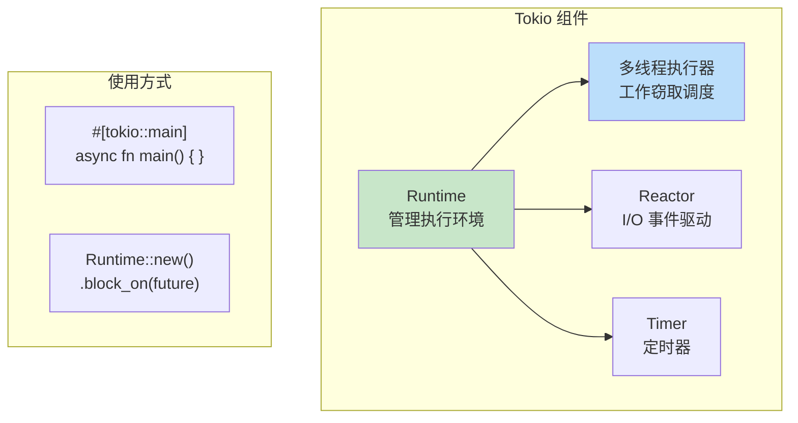
```mermaid
graph TB
    subgraph "Tokio 组件"
        RUNTIME["Runtime<br/>管理执行环境"]
        EXECUTOR["多线程执行器<br/>工作窃取调度"]
        REACTOR["Reactor<br/>I/O 事件驱动"]
        TIMER["Timer<br/>定时器"]
    end

    subgraph "使用方式"
        MACRO["#[tokio::main]<br/>async fn main() { }"]
        MANUAL["Runtime::new()<br/>.block_on(future)"]
    end

    RUNTIME --> EXECUTOR
    RUNTIME --> REACTOR
    RUNTIME --> TIMER

    style RUNTIME fill:#c8e6c9
    style EXECUTOR fill:#bbdefb
```

---

## 5. Pin 与自引用

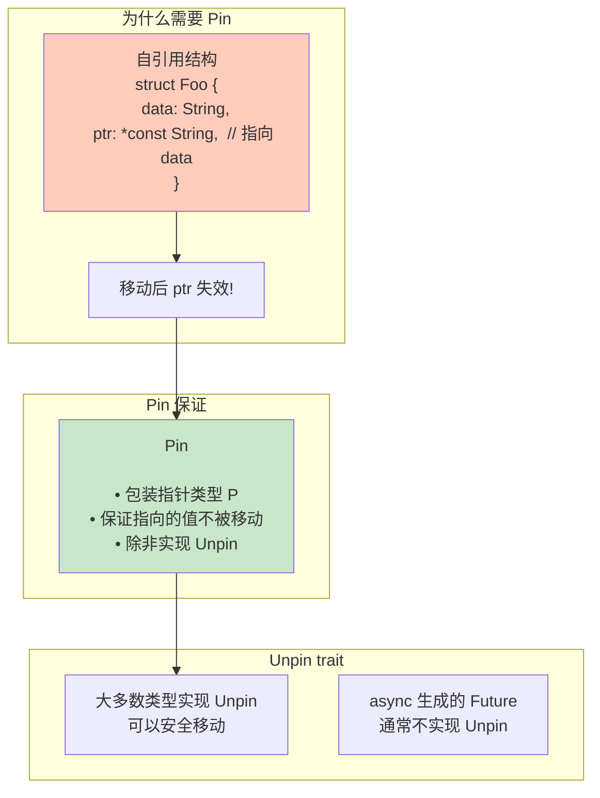
```mermaid
graph TB
    subgraph "为什么需要 Pin"
        SELF_REF["自引用结构<br/>struct Foo {<br/>    data: String,<br/>    ptr: *const String,  // 指向 data<br/>}"]
        MOVE_PROBLEM["移动后 ptr 失效!"]
    end

    subgraph "Pin 保证"
        PIN["Pin<P><br/>• 包装指针类型 P<br/>• 保证指向的值不被移动<br/>• 除非实现 Unpin"]
    end

    subgraph "Unpin trait"
        UNPIN["大多数类型实现 Unpin<br/>可以安全移动"]
        NOT_UNPIN["async 生成的 Future<br/>通常不实现 Unpin"]
    end

    SELF_REF --> MOVE_PROBLEM
    MOVE_PROBLEM --> PIN
    PIN --> UNPIN

    style SELF_REF fill:#ffccbc
    style PIN fill:#c8e6c9
```

### Pin 使用

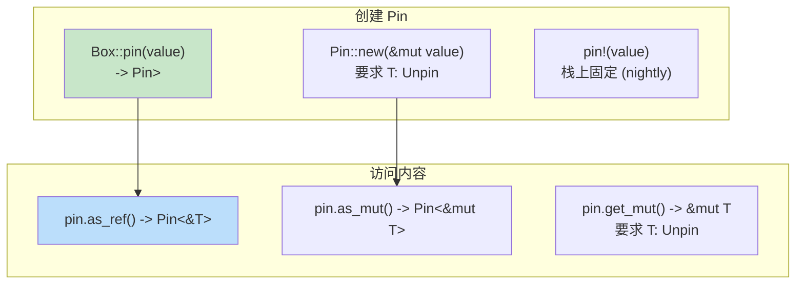
```mermaid
graph TB
    subgraph "创建 Pin"
        BOX_PIN["Box::pin(value)<br/>-> Pin<Box<T>>"]
        PIN_NEW["Pin::new(&mut value)<br/>要求 T: Unpin"]
        PIN_MACRO["pin!(value)<br/>栈上固定 (nightly)"]
    end

    subgraph "访问内容"
        DEREF["pin.as_ref() -> Pin<&T>"]
        DEREF_MUT["pin.as_mut() -> Pin<&mut T>"]
        GET_MUT["pin.get_mut() -> &mut T<br/>要求 T: Unpin"]
    end

    BOX_PIN --> DEREF
    PIN_NEW --> DEREF_MUT

    style BOX_PIN fill:#c8e6c9
    style DEREF fill:#bbdefb
```

---

## 6. 异步 I/O 模式

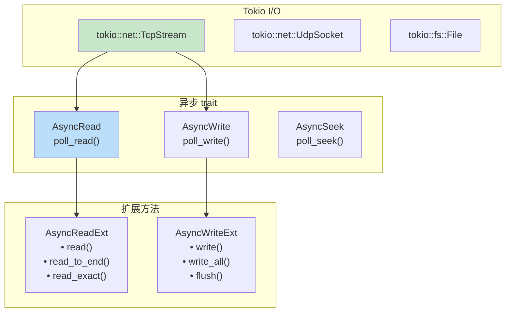
```mermaid
graph TB
    subgraph "Tokio I/O"
        TCP["tokio::net::TcpStream"]
        UDP["tokio::net::UdpSocket"]
        FILE["tokio::fs::File"]
    end

    subgraph "异步 trait"
        ASYNC_READ["AsyncRead<br/>poll_read()"]
        ASYNC_WRITE["AsyncWrite<br/>poll_write()"]
        ASYNC_SEEK["AsyncSeek<br/>poll_seek()"]
    end

    subgraph "扩展方法"
        READ_EXT["AsyncReadExt<br/>• read()<br/>• read_to_end()<br/>• read_exact()"]
        WRITE_EXT["AsyncWriteExt<br/>• write()<br/>• write_all()<br/>• flush()"]
    end

    TCP --> ASYNC_READ
    TCP --> ASYNC_WRITE
    ASYNC_READ --> READ_EXT
    ASYNC_WRITE --> WRITE_EXT

    style TCP fill:#c8e6c9
    style ASYNC_READ fill:#bbdefb
```

---

## 7. 并发模式

### spawn 并发任务

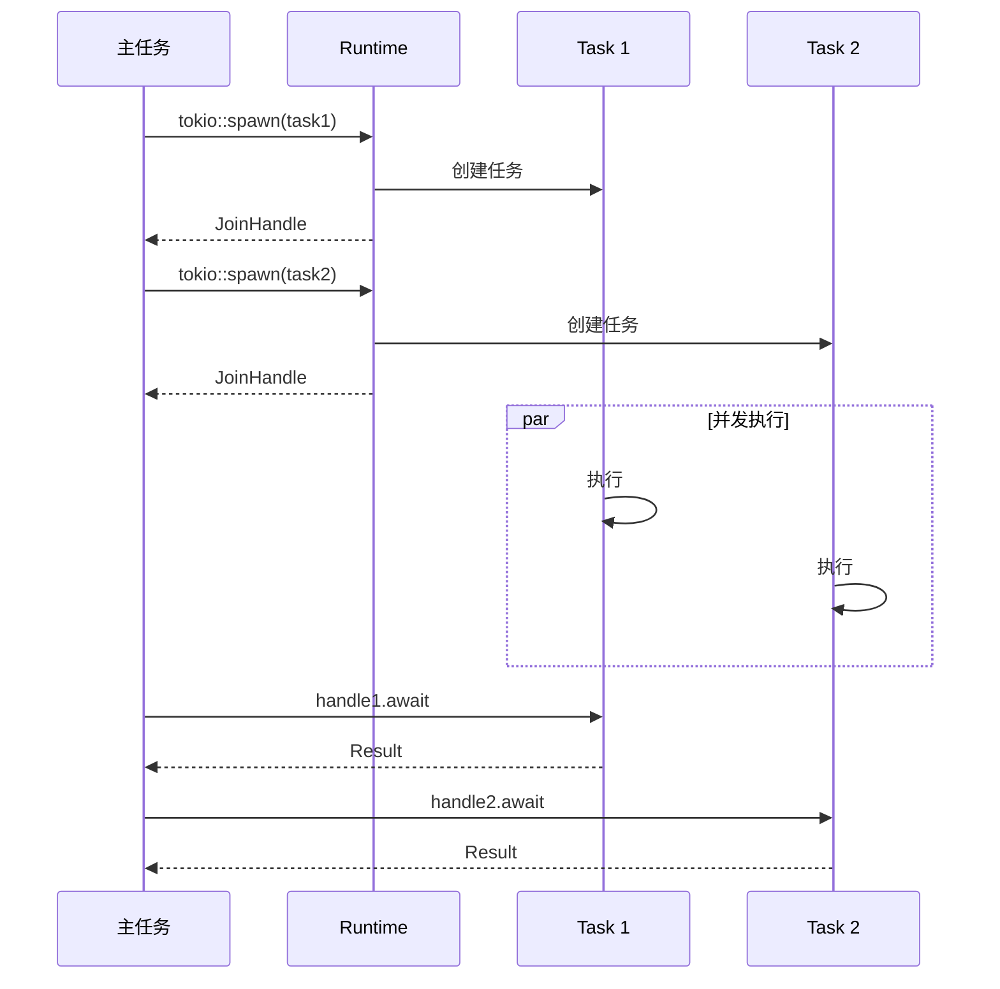
```mermaid
sequenceDiagram
    participant Main as 主任务
    participant RT as Runtime
    participant T1 as Task 1
    participant T2 as Task 2

    Main->>RT: tokio::spawn(task1)
    RT->>T1: 创建任务
    RT-->>Main: JoinHandle

    Main->>RT: tokio::spawn(task2)
    RT->>T2: 创建任务
    RT-->>Main: JoinHandle

    par 并发执行
        T1->>T1: 执行
        T2->>T2: 执行
    end

    Main->>T1: handle1.await
    T1-->>Main: Result

    Main->>T2: handle2.await
    T2-->>Main: Result
```

### join! 并发等待

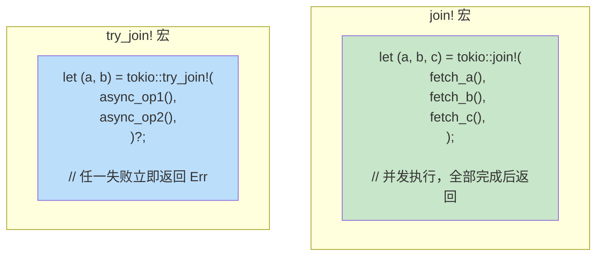
```mermaid
graph TB
    subgraph "join! 宏"
        JOIN["let (a, b, c) = tokio::join!(<br/>    fetch_a(),<br/>    fetch_b(),<br/>    fetch_c(),<br/>);<br/><br/>// 并发执行，全部完成后返回"]
    end

    subgraph "try_join! 宏"
        TRY_JOIN["let (a, b) = tokio::try_join!(<br/>    async_op1(),<br/>    async_op2(),<br/>)?;<br/><br/>// 任一失败立即返回 Err"]
    end

    style JOIN fill:#c8e6c9
    style TRY_JOIN fill:#bbdefb
```

### select! 竞争

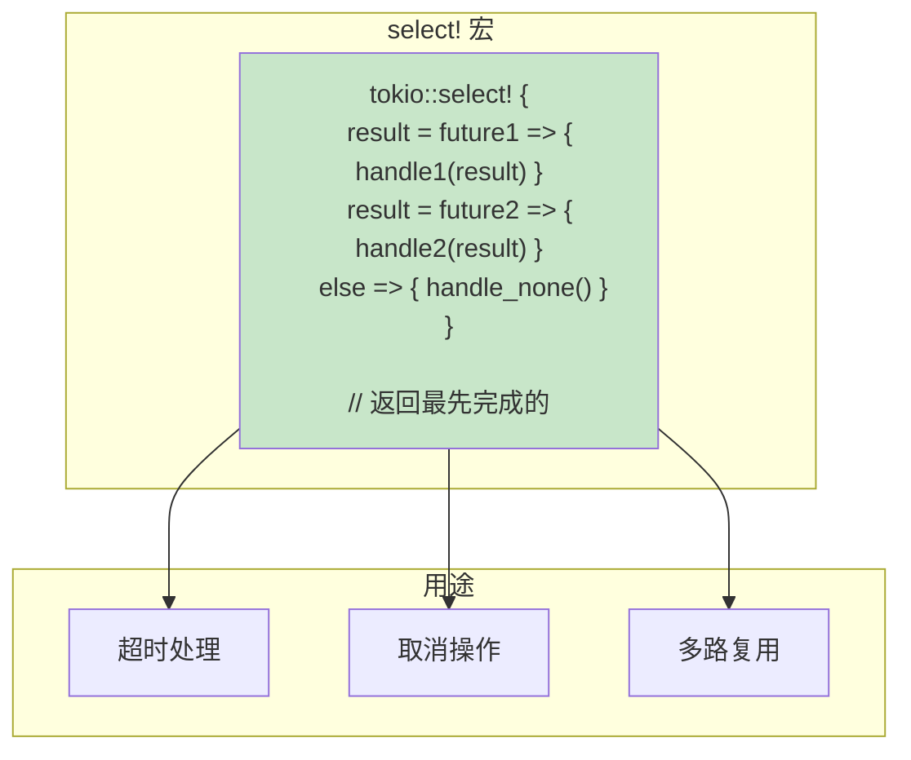
```mermaid
graph TB
    subgraph "select! 宏"
        SELECT["tokio::select! {<br/>    result = future1 => { handle1(result) }<br/>    result = future2 => { handle2(result) }<br/>    else => { handle_none() }<br/>}<br/><br/>// 返回最先完成的"]
    end

    subgraph "用途"
        TIMEOUT["超时处理"]
        CANCEL["取消操作"]
        MULTIPLEX["多路复用"]
    end

    SELECT --> TIMEOUT
    SELECT --> CANCEL
    SELECT --> MULTIPLEX

    style SELECT fill:#c8e6c9
```

---

## 8. 通道 (Channel)

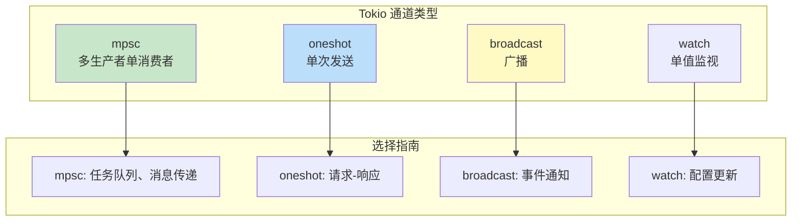
```mermaid
graph TB
    subgraph "Tokio 通道类型"
        MPSC["mpsc<br/>多生产者单消费者"]
        ONESHOT["oneshot<br/>单次发送"]
        BROADCAST["broadcast<br/>广播"]
        WATCH["watch<br/>单值监视"]
    end

    subgraph "选择指南"
        MPSC_USE["mpsc: 任务队列、消息传递"]
        ONESHOT_USE["oneshot: 请求-响应"]
        BROADCAST_USE["broadcast: 事件通知"]
        WATCH_USE["watch: 配置更新"]
    end

    MPSC --> MPSC_USE
    ONESHOT --> ONESHOT_USE
    BROADCAST --> BROADCAST_USE
    WATCH --> WATCH_USE

    style MPSC fill:#c8e6c9
    style ONESHOT fill:#bbdefb
    style BROADCAST fill:#fff9c4
```

### mpsc 使用

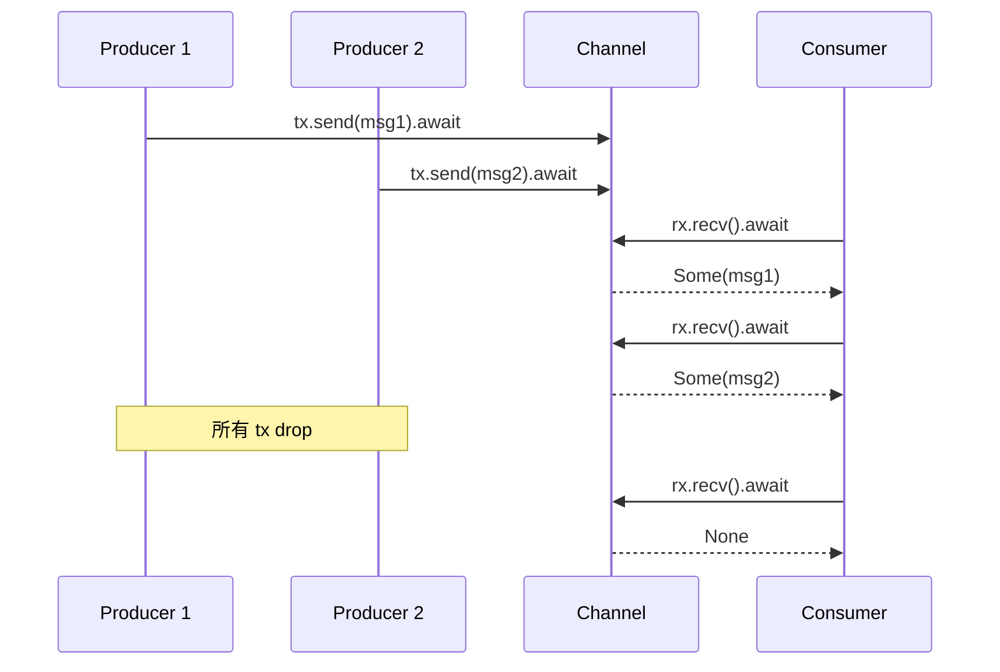
```mermaid
sequenceDiagram
    participant P1 as Producer 1
    participant P2 as Producer 2
    participant Chan as Channel
    participant C as Consumer

    P1->>Chan: tx.send(msg1).await
    P2->>Chan: tx.send(msg2).await

    C->>Chan: rx.recv().await
    Chan-->>C: Some(msg1)

    C->>Chan: rx.recv().await
    Chan-->>C: Some(msg2)

    Note over P1,P2: 所有 tx drop
    C->>Chan: rx.recv().await
    Chan-->>C: None
```

---

## 9. 同步原语

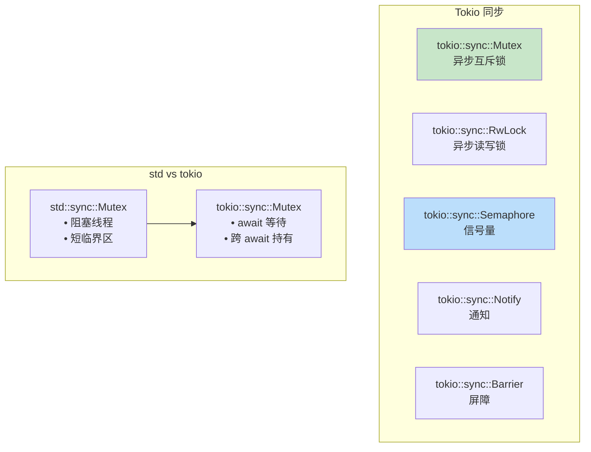
```mermaid
graph TB
    subgraph "Tokio 同步"
        MUTEX["tokio::sync::Mutex<br/>异步互斥锁"]
        RWLOCK["tokio::sync::RwLock<br/>异步读写锁"]
        SEMAPHORE["tokio::sync::Semaphore<br/>信号量"]
        NOTIFY["tokio::sync::Notify<br/>通知"]
        BARRIER["tokio::sync::Barrier<br/>屏障"]
    end

    subgraph "std vs tokio"
        STD_MUTEX["std::sync::Mutex<br/>• 阻塞线程<br/>• 短临界区"]
        TOKIO_MUTEX["tokio::sync::Mutex<br/>• await 等待<br/>• 跨 await 持有"]
    end

    STD_MUTEX --> TOKIO_MUTEX

    style MUTEX fill:#c8e6c9
    style SEMAPHORE fill:#bbdefb
```

---

## 10. 错误处理

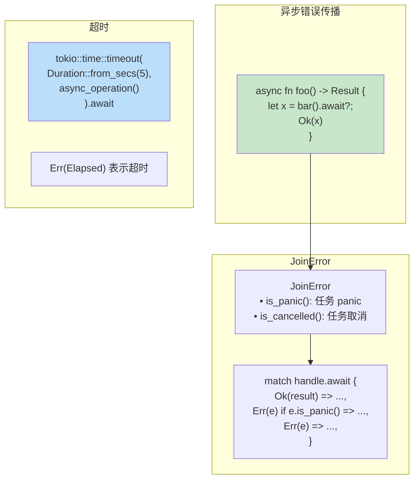
```mermaid
graph TB
    subgraph "异步错误传播"
        QUESTION["async fn foo() -> Result<T, E> {<br/>    let x = bar().await?;<br/>    Ok(x)<br/>}"]
    end

    subgraph "JoinError"
        JOIN_ERR["JoinError<br/>• is_panic(): 任务 panic<br/>• is_cancelled(): 任务取消"]
        HANDLE["match handle.await {<br/>    Ok(result) => ...,<br/>    Err(e) if e.is_panic() => ...,<br/>    Err(e) => ...,<br/>}"]
    end

    subgraph "超时"
        TIMEOUT["tokio::time::timeout(<br/>    Duration::from_secs(5),<br/>    async_operation()<br/>).await"]
        TIMEOUT_ERR["Err(Elapsed) 表示超时"]
    end

    QUESTION --> JOIN_ERR
    JOIN_ERR --> HANDLE

    style QUESTION fill:#c8e6c9
    style TIMEOUT fill:#bbdefb
```

---

## 11. 生命周期与 Send

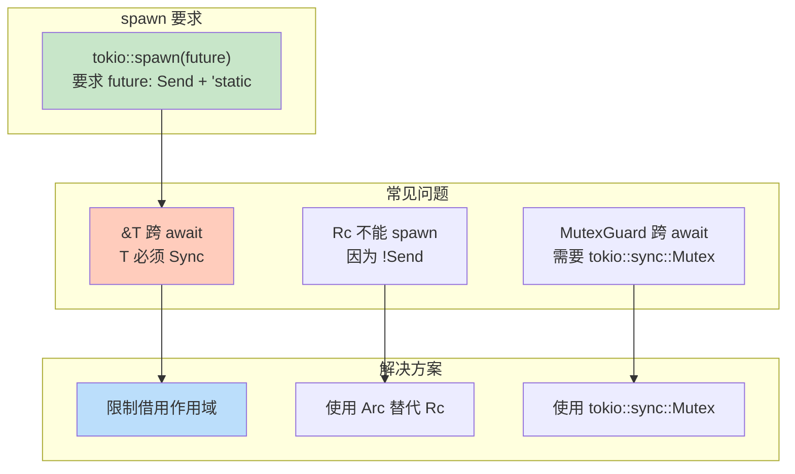
```mermaid
graph TB
    subgraph "spawn 要求"
        REQ["tokio::spawn(future)<br/>要求 future: Send + 'static"]
    end

    subgraph "常见问题"
        PROBLEM1["&T 跨 await<br/>T 必须 Sync"]
        PROBLEM2["Rc 不能 spawn<br/>因为 !Send"]
        PROBLEM3["MutexGuard 跨 await<br/>需要 tokio::sync::Mutex"]
    end

    subgraph "解决方案"
        SOL1["限制借用作用域"]
        SOL2["使用 Arc 替代 Rc"]
        SOL3["使用 tokio::sync::Mutex"]
    end

    REQ --> PROBLEM1
    PROBLEM1 --> SOL1
    PROBLEM2 --> SOL2
    PROBLEM3 --> SOL3

    style REQ fill:#c8e6c9
    style PROBLEM1 fill:#ffccbc
    style SOL1 fill:#bbdefb
```

### 跨 await 借用

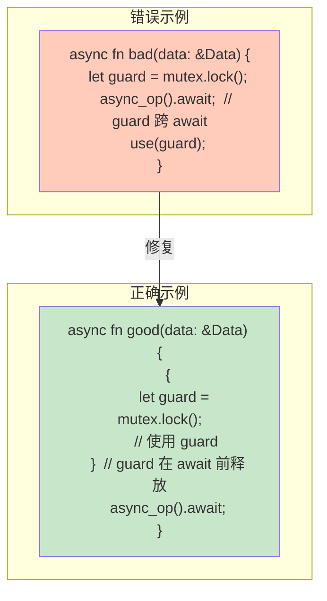
```mermaid
graph TB
    subgraph "错误示例"
        BAD["async fn bad(data: &Data) {<br/>    let guard = mutex.lock();<br/>    async_op().await;  // guard 跨 await<br/>    use(guard);<br/>}"]
    end

    subgraph "正确示例"
        GOOD["async fn good(data: &Data) {<br/>    {<br/>        let guard = mutex.lock();<br/>        // 使用 guard<br/>    }  // guard 在 await 前释放<br/>    async_op().await;<br/>}"]
    end

    BAD -->|修复| GOOD

    style BAD fill:#ffccbc
    style GOOD fill:#c8e6c9
```

---

## 12. 最佳实践

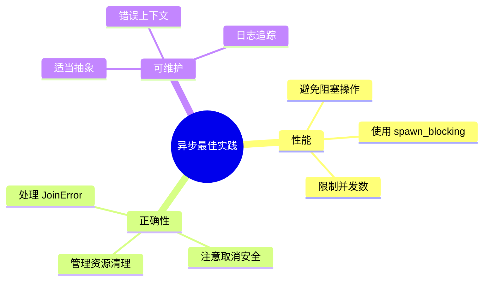
```mermaid
mindmap
    root((异步最佳实践))
        性能
            避免阻塞操作
            使用 spawn_blocking
            限制并发数
        正确性
            处理 JoinError
            注意取消安全
            管理资源清理
        可维护
            适当抽象
            错误上下文
            日志追踪
```

### 选择指南

| 场景 | 推荐 |
|------|------|
| CPU 密集计算 | `spawn_blocking` |
| I/O 操作 | async/await |
| 并发请求 | `join!` 或 `FuturesUnordered` |
| 超时控制 | `tokio::time::timeout` |
| 请求-响应 | `oneshot` 通道 |
| 生产者-消费者 | `mpsc` 通道 |
| 共享状态 | `Arc<Mutex<T>>` 或消息传递 |

```mermaid
flowchart TD
    START[异步任务] --> Q1{阻塞操作?}

    Q1 -->|是| BLOCKING["spawn_blocking()"]
    Q1 -->|否| Q2{需要并发?}

    Q2 -->|否| AWAIT["直接 .await"]
    Q2 -->|是| Q3{独立任务?}

    Q3 -->|是| SPAWN["tokio::spawn()"]
    Q3 -->|否| JOIN["join!/select!"]

    style AWAIT fill:#c8e6c9
    style SPAWN fill:#bbdefb
    style BLOCKING fill:#fff9c4
```
