# Rust 智能指针详解

## 1. 智能指针概览

智能指针是实现了 `Deref` 和 `Drop` trait 的数据结构。

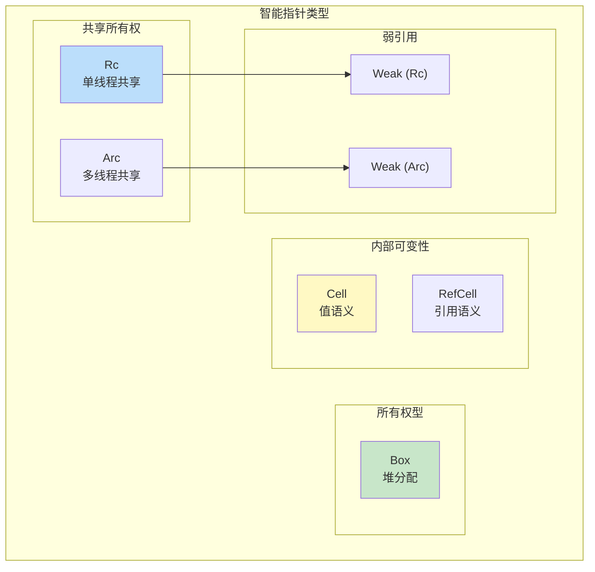
```mermaid
graph TB
    subgraph "智能指针类型"
        subgraph "所有权型"
            BOX["Box<T><br/>堆分配"]
        end

        subgraph "共享所有权"
            RC["Rc<T><br/>单线程共享"]
            ARC["Arc<T><br/>多线程共享"]
        end

        subgraph "内部可变性"
            CELL["Cell<T><br/>值语义"]
            REFCELL["RefCell<T><br/>引用语义"]
        end

        subgraph "弱引用"
            WEAK_RC["Weak<T> (Rc)"]
            WEAK_ARC["Weak<T> (Arc)"]
        end
    end

    RC --> WEAK_RC
    ARC --> WEAK_ARC

    style BOX fill:#c8e6c9
    style RC fill:#bbdefb
    style CELL fill:#fff9c4
```

---

## 2. Box<T>

Box 提供最简单的堆分配。

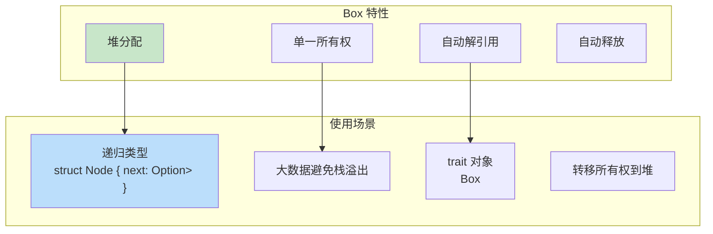
```mermaid
graph TB
    subgraph "Box 特性"
        HEAP["堆分配"]
        SINGLE["单一所有权"]
        DEREF["自动解引用"]
        DROP["自动释放"]
    end

    subgraph "使用场景"
        RECURSIVE["递归类型<br/>struct Node { next: Option<Box<Node>> }"]
        LARGE["大数据避免栈溢出"]
        TRAIT_OBJ["trait 对象<br/>Box<dyn Trait>"]
        TRANSFER["转移所有权到堆"]
    end

    HEAP --> RECURSIVE
    SINGLE --> LARGE
    DEREF --> TRAIT_OBJ

    style HEAP fill:#c8e6c9
    style RECURSIVE fill:#bbdefb
```

### Box 内存布局

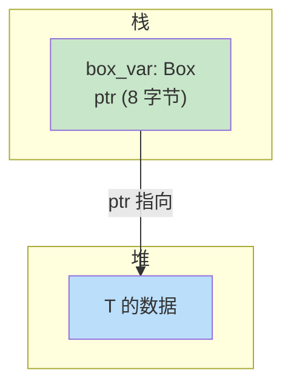
```mermaid
graph TB
    subgraph "栈"
        BOX_VAR["box_var: Box<T><br/>ptr (8 字节)"]
    end

    subgraph "堆"
        DATA["T 的数据"]
    end

    BOX_VAR -->|ptr 指向| DATA

    style BOX_VAR fill:#c8e6c9
    style DATA fill:#bbdefb
```

### Box 方法

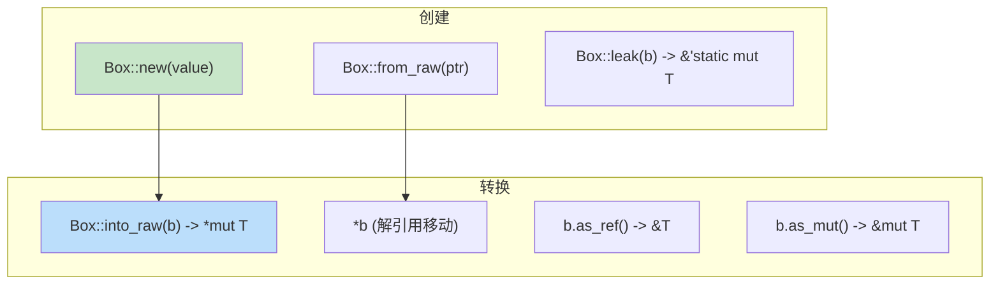
```mermaid
graph TB
    subgraph "创建"
        NEW["Box::new(value)"]
        FROM_RAW["Box::from_raw(ptr)"]
        LEAK["Box::leak(b) -> &'static mut T"]
    end

    subgraph "转换"
        INTO_RAW["Box::into_raw(b) -> *mut T"]
        INTO_INNER["*b (解引用移动)"]
        AS_REF["b.as_ref() -> &T"]
        AS_MUT["b.as_mut() -> &mut T"]
    end

    NEW --> INTO_RAW
    FROM_RAW --> INTO_INNER

    style NEW fill:#c8e6c9
    style INTO_RAW fill:#bbdefb
```

---

## 3. Rc<T> 引用计数

Rc 允许单线程内多个所有者。

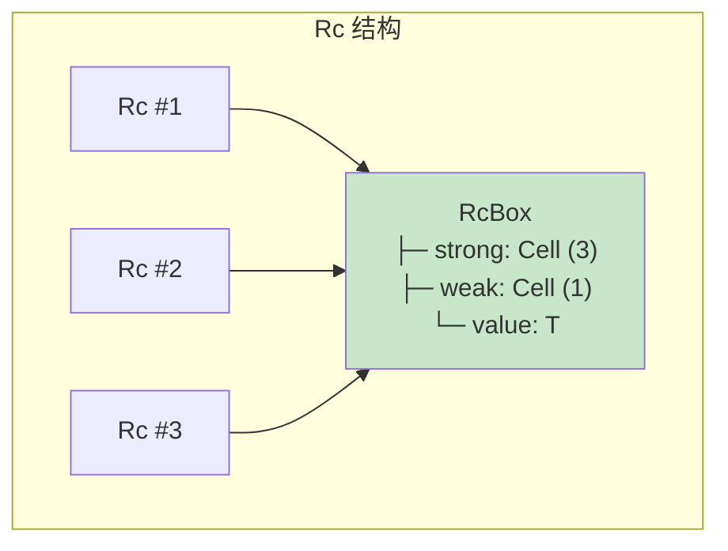
```mermaid
graph TB
    subgraph "Rc 结构"
        RC1["Rc<T> #1"]
        RC2["Rc<T> #2"]
        RC3["Rc<T> #3"]

        INNER["RcBox<T><br/>├─ strong: Cell<usize> (3)<br/>├─ weak: Cell<usize> (1)<br/>└─ value: T"]
    end

    RC1 --> INNER
    RC2 --> INNER
    RC3 --> INNER

    style INNER fill:#c8e6c9
```

### Rc 生命周期

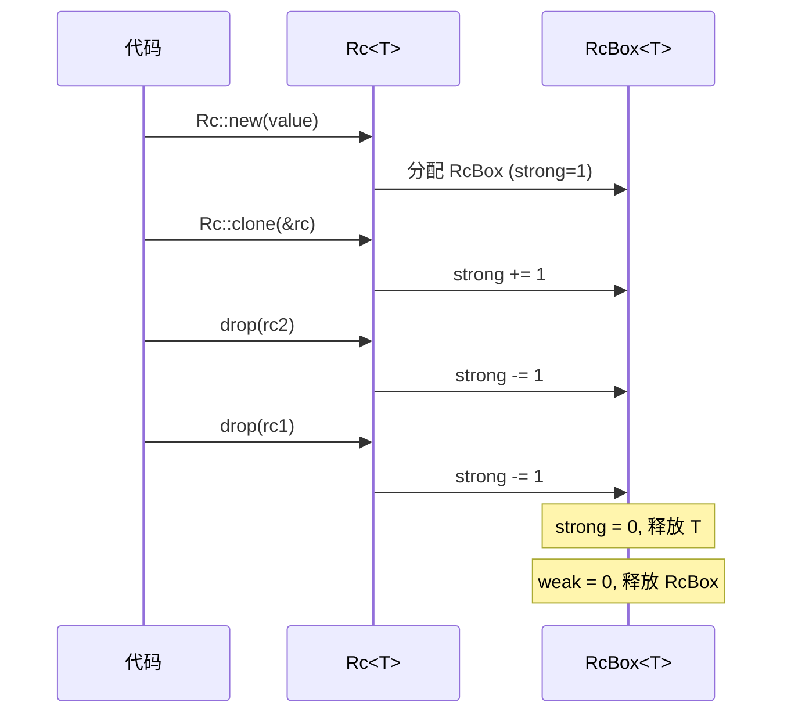
```mermaid
sequenceDiagram
    participant Code as 代码
    participant RC as Rc<T>
    participant Data as RcBox<T>

    Code->>RC: Rc::new(value)
    RC->>Data: 分配 RcBox (strong=1)

    Code->>RC: Rc::clone(&rc)
    RC->>Data: strong += 1

    Code->>RC: drop(rc2)
    RC->>Data: strong -= 1

    Code->>RC: drop(rc1)
    RC->>Data: strong -= 1
    Note over Data: strong = 0, 释放 T
    Note over Data: weak = 0, 释放 RcBox
```

### Rc 方法

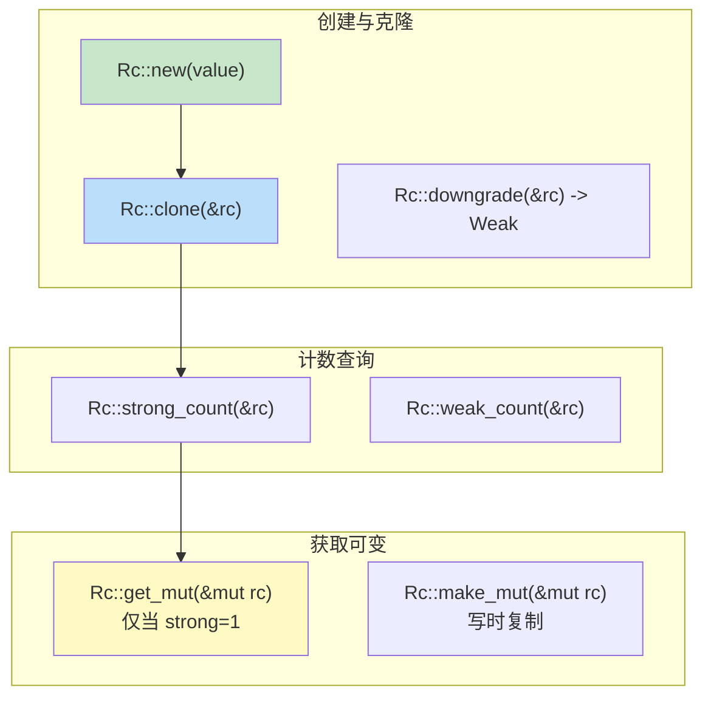
```mermaid
graph TB
    subgraph "创建与克隆"
        NEW["Rc::new(value)"]
        CLONE["Rc::clone(&rc)"]
        DOWNGRADE["Rc::downgrade(&rc) -> Weak"]
    end

    subgraph "计数查询"
        STRONG["Rc::strong_count(&rc)"]
        WEAK["Rc::weak_count(&rc)"]
    end

    subgraph "获取可变"
        GET_MUT["Rc::get_mut(&mut rc)<br/>仅当 strong=1"]
        MAKE_MUT["Rc::make_mut(&mut rc)<br/>写时复制"]
    end

    NEW --> CLONE
    CLONE --> STRONG
    STRONG --> GET_MUT

    style NEW fill:#c8e6c9
    style CLONE fill:#bbdefb
    style GET_MUT fill:#fff9c4
```

---

## 4. Arc<T> 原子引用计数

Arc 是 Rc 的线程安全版本。

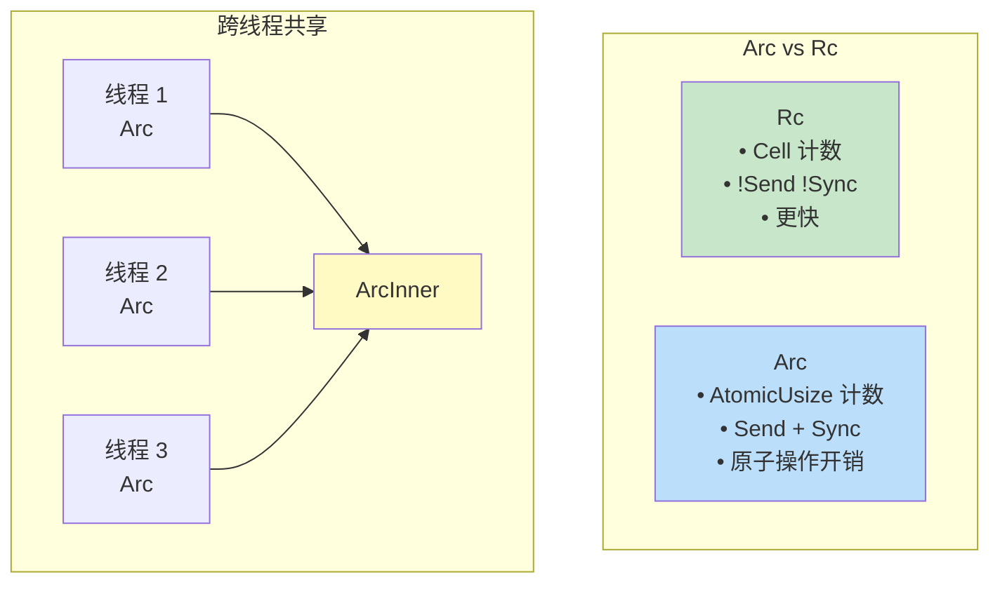
```mermaid
graph TB
    subgraph "Arc vs Rc"
        RC_PROP["Rc<T><br/>• Cell<usize> 计数<br/>• !Send !Sync<br/>• 更快"]
        ARC_PROP["Arc<T><br/>• AtomicUsize 计数<br/>• Send + Sync<br/>• 原子操作开销"]
    end

    subgraph "跨线程共享"
        THREAD1["线程 1<br/>Arc<T>"]
        THREAD2["线程 2<br/>Arc<T>"]
        THREAD3["线程 3<br/>Arc<T>"]
        DATA["ArcInner<T>"]
    end

    THREAD1 --> DATA
    THREAD2 --> DATA
    THREAD3 --> DATA

    style RC_PROP fill:#c8e6c9
    style ARC_PROP fill:#bbdefb
    style DATA fill:#fff9c4
```

### Arc + Mutex 模式

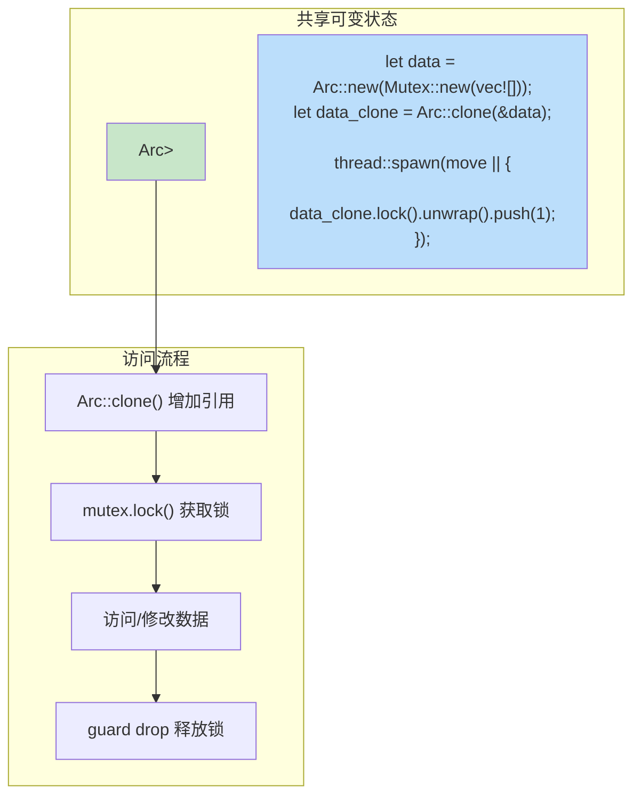
```mermaid
graph TB
    subgraph "共享可变状态"
        ARC["Arc<Mutex<T>>"]
        PATTERN["let data = Arc::new(Mutex::new(vec![]));<br/>let data_clone = Arc::clone(&data);<br/><br/>thread::spawn(move || {<br/>    data_clone.lock().unwrap().push(1);<br/>});"]
    end

    subgraph "访问流程"
        CLONE["Arc::clone() 增加引用"]
        LOCK["mutex.lock() 获取锁"]
        ACCESS["访问/修改数据"]
        UNLOCK["guard drop 释放锁"]
    end

    ARC --> CLONE
    CLONE --> LOCK
    LOCK --> ACCESS
    ACCESS --> UNLOCK

    style ARC fill:#c8e6c9
    style PATTERN fill:#bbdefb
```

---

## 5. Weak<T> 弱引用

Weak 不阻止值被释放，避免循环引用。

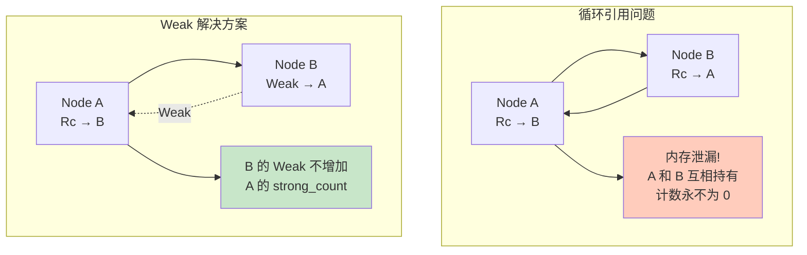
```mermaid
graph TB
    subgraph "循环引用问题"
        A["Node A<br/>Rc → B"]
        B["Node B<br/>Rc → A"]
        LEAK["内存泄漏!<br/>A 和 B 互相持有<br/>计数永不为 0"]
    end

    subgraph "Weak 解决方案"
        A2["Node A<br/>Rc → B"]
        B2["Node B<br/>Weak → A"]
        OK["B 的 Weak 不增加<br/>A 的 strong_count"]
    end

    A --> B
    B --> A
    A --> LEAK

    A2 --> B2
    B2 -.->|Weak| A2
    A2 --> OK

    style LEAK fill:#ffccbc
    style OK fill:#c8e6c9
```

### Weak 使用

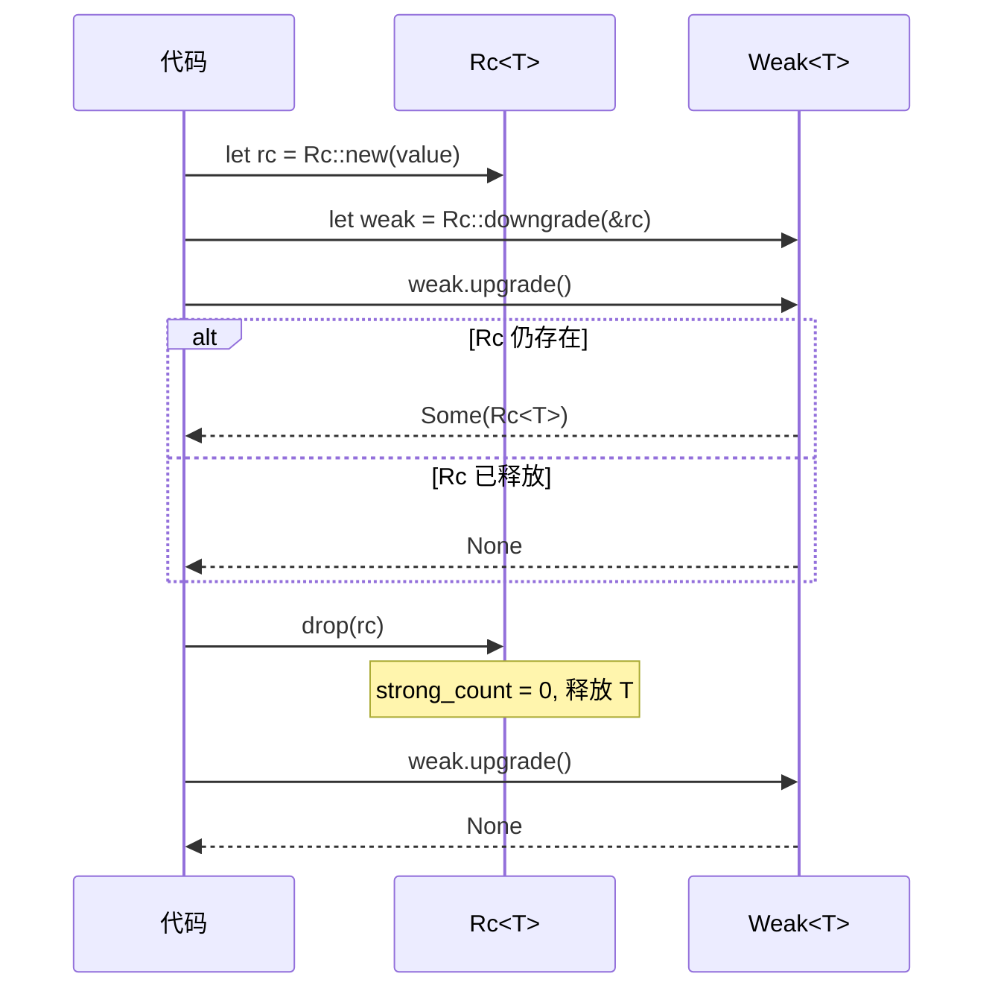
```mermaid
sequenceDiagram
    participant Code as 代码
    participant Rc as Rc<T>
    participant Weak as Weak<T>

    Code->>Rc: let rc = Rc::new(value)
    Code->>Weak: let weak = Rc::downgrade(&rc)

    Code->>Weak: weak.upgrade()
    alt Rc 仍存在
        Weak-->>Code: Some(Rc<T>)
    else Rc 已释放
        Weak-->>Code: None
    end

    Code->>Rc: drop(rc)
    Note over Rc: strong_count = 0, 释放 T

    Code->>Weak: weak.upgrade()
    Weak-->>Code: None
```

---

## 6. Cell<T> 内部可变性

Cell 提供值语义的内部可变性。

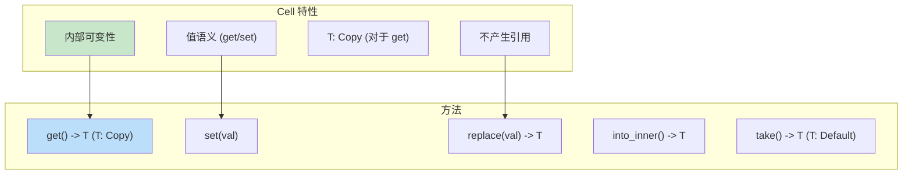
```mermaid
graph TB
    subgraph "Cell 特性"
        INTERIOR["内部可变性"]
        VALUE["值语义 (get/set)"]
        COPY_REQ["T: Copy (对于 get)"]
        NO_REF["不产生引用"]
    end

    subgraph "方法"
        GET["get() -> T (T: Copy)"]
        SET["set(val)"]
        REPLACE["replace(val) -> T"]
        INTO_INNER["into_inner() -> T"]
        TAKE["take() -> T (T: Default)"]
    end

    INTERIOR --> GET
    VALUE --> SET
    NO_REF --> REPLACE

    style INTERIOR fill:#c8e6c9
    style GET fill:#bbdefb
```

### Cell 使用场景

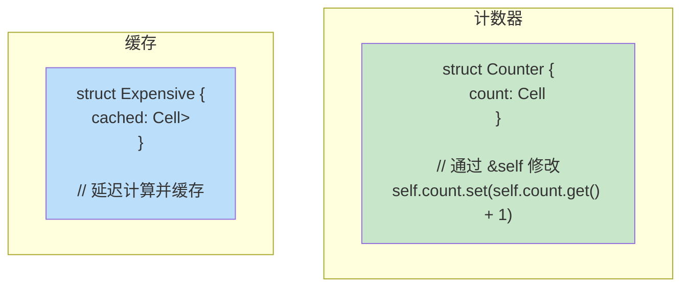
```mermaid
graph TB
    subgraph "计数器"
        COUNTER["struct Counter {<br/>    count: Cell<usize><br/>}<br/><br/>// 通过 &self 修改<br/>self.count.set(self.count.get() + 1)"]
    end

    subgraph "缓存"
        CACHE["struct Expensive {<br/>    cached: Cell<Option<Value>><br/>}<br/><br/>// 延迟计算并缓存"]
    end

    style COUNTER fill:#c8e6c9
    style CACHE fill:#bbdefb
```

---

## 7. RefCell<T> 运行时借用检查

RefCell 提供引用语义的内部可变性。

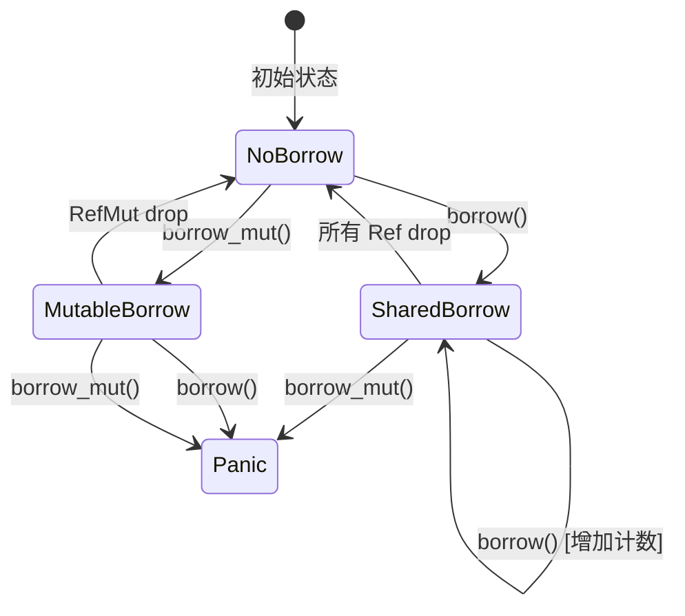
```mermaid
stateDiagram-v2
    [*] --> NoBorrow: 初始状态

    NoBorrow --> SharedBorrow: borrow()
    NoBorrow --> MutableBorrow: borrow_mut()

    SharedBorrow --> SharedBorrow: borrow() [增加计数]
    SharedBorrow --> NoBorrow: 所有 Ref drop

    MutableBorrow --> NoBorrow: RefMut drop

    SharedBorrow --> Panic: borrow_mut()
    MutableBorrow --> Panic: borrow()
    MutableBorrow --> Panic: borrow_mut()
```

### RefCell 方法

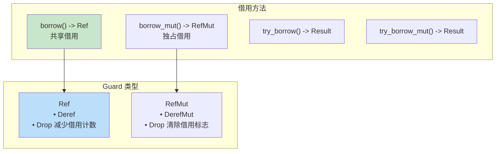
```mermaid
graph TB
    subgraph "借用方法"
        BORROW["borrow() -> Ref<T><br/>共享借用"]
        BORROW_MUT["borrow_mut() -> RefMut<T><br/>独占借用"]
        TRY_BORROW["try_borrow() -> Result<Ref>"]
        TRY_BORROW_MUT["try_borrow_mut() -> Result<RefMut>"]
    end

    subgraph "Guard 类型"
        REF["Ref<T><br/>• Deref<Target=T><br/>• Drop 减少借用计数"]
        REF_MUT["RefMut<T><br/>• DerefMut<Target=T><br/>• Drop 清除借用标志"]
    end

    BORROW --> REF
    BORROW_MUT --> REF_MUT

    style BORROW fill:#c8e6c9
    style REF fill:#bbdefb
```

### Rc<RefCell<T>> 模式

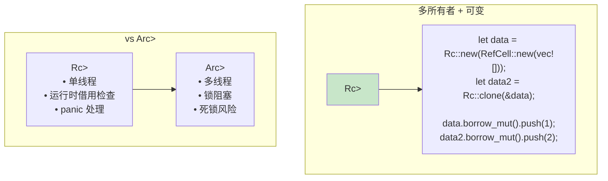
```mermaid
graph TB
    subgraph "多所有者 + 可变"
        PATTERN["Rc<RefCell<T>>"]
        USE["let data = Rc::new(RefCell::new(vec![]));<br/>let data2 = Rc::clone(&data);<br/><br/>data.borrow_mut().push(1);<br/>data2.borrow_mut().push(2);"]
    end

    subgraph "vs Arc<Mutex<T>>"
        RC_REFCELL["Rc<RefCell<T>><br/>• 单线程<br/>• 运行时借用检查<br/>• panic 处理"]
        ARC_MUTEX["Arc<Mutex<T>><br/>• 多线程<br/>• 锁阻塞<br/>• 死锁风险"]
    end

    PATTERN --> USE
    RC_REFCELL --> ARC_MUTEX

    style PATTERN fill:#c8e6c9
```

---

## 8. Cow<'a, T> 写时复制

Cow 延迟克隆，只在需要修改时才克隆。

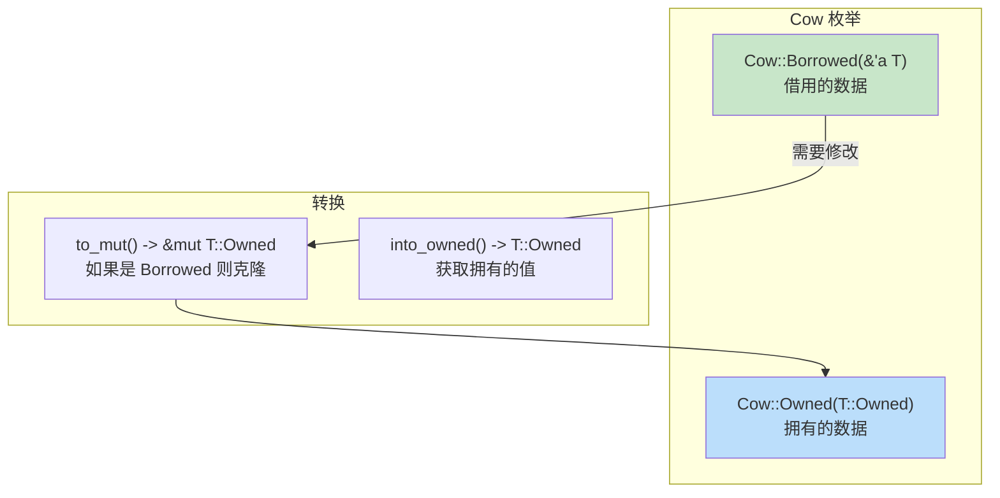
```mermaid
graph TB
    subgraph "Cow 枚举"
        BORROWED["Cow::Borrowed(&'a T)<br/>借用的数据"]
        OWNED["Cow::Owned(T::Owned)<br/>拥有的数据"]
    end

    subgraph "转换"
        TO_MUT["to_mut() -> &mut T::Owned<br/>如果是 Borrowed 则克隆"]
        INTO_OWNED["into_owned() -> T::Owned<br/>获取拥有的值"]
    end

    BORROWED -->|需要修改| TO_MUT
    TO_MUT --> OWNED

    style BORROWED fill:#c8e6c9
    style OWNED fill:#bbdefb
```

### Cow 使用场景

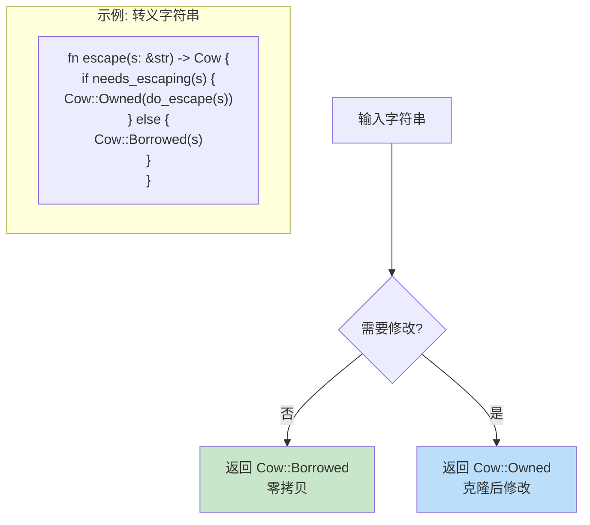
```mermaid
flowchart TD
    INPUT[输入字符串] --> CHECK{需要修改?}

    CHECK -->|否| BORROWED["返回 Cow::Borrowed<br/>零拷贝"]
    CHECK -->|是| OWNED["返回 Cow::Owned<br/>克隆后修改"]

    subgraph "示例: 转义字符串"
        FN["fn escape(s: &str) -> Cow<str> {<br/>    if needs_escaping(s) {<br/>        Cow::Owned(do_escape(s))<br/>    } else {<br/>        Cow::Borrowed(s)<br/>    }<br/>}"]
    end

    style BORROWED fill:#c8e6c9
    style OWNED fill:#bbdefb
```

---

## 9. 智能指针选择指南

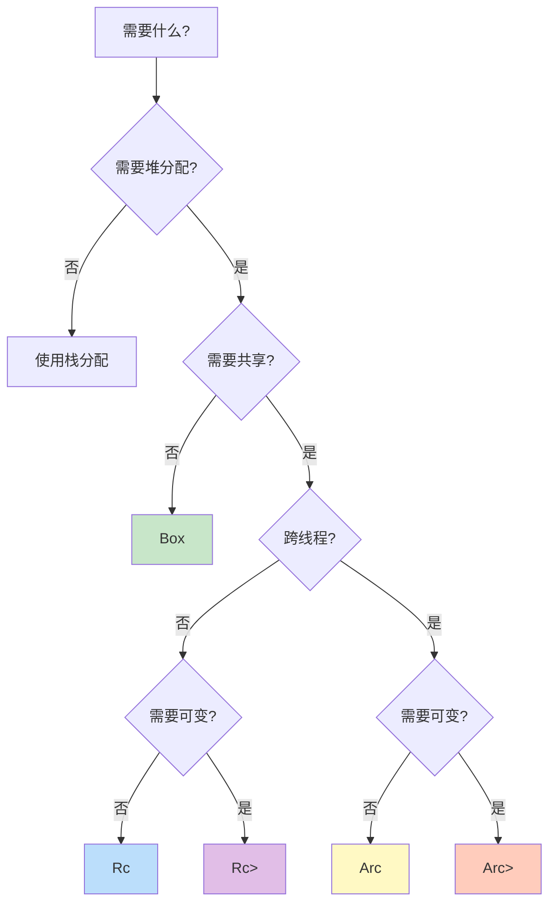
```mermaid
flowchart TD
    START[需要什么?] --> Q1{需要堆分配?}

    Q1 -->|否| STACK[使用栈分配]
    Q1 -->|是| Q2{需要共享?}

    Q2 -->|否| BOX[Box<T>]
    Q2 -->|是| Q3{跨线程?}

    Q3 -->|否| Q4{需要可变?}
    Q3 -->|是| Q5{需要可变?}

    Q4 -->|否| RC[Rc<T>]
    Q4 -->|是| RC_REFCELL[Rc<RefCell<T>>]

    Q5 -->|否| ARC[Arc<T>]
    Q5 -->|是| ARC_MUTEX[Arc<Mutex<T>>]

    style BOX fill:#c8e6c9
    style RC fill:#bbdefb
    style ARC fill:#fff9c4
    style RC_REFCELL fill:#e1bee7
    style ARC_MUTEX fill:#ffccbc
```

### 比较总结

| 类型 | 线程安全 | 多所有者 | 内部可变 | 性能 |
|------|---------|---------|---------|------|
| `Box<T>` | 若 T: Send | 否 | 否 | 最快 |
| `Rc<T>` | 否 | 是 | 否 | 快 |
| `Arc<T>` | 是 | 是 | 否 | 原子操作 |
| `Cell<T>` | 否 | 否 | 是 | 快 |
| `RefCell<T>` | 否 | 否 | 是 | 运行时检查 |
| `Mutex<T>` | 是 | 否 | 是 | 锁开销 |

---

## 10. Deref 强制转换

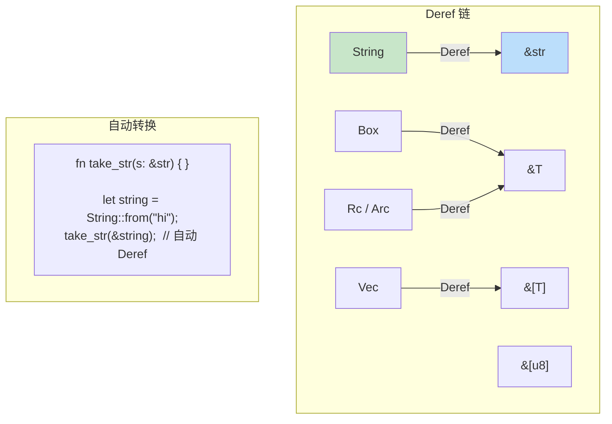
```mermaid
graph TB
    subgraph "Deref 链"
        STRING["String"]
        STR["&str"]
        U8_SLICE["&[u8]"]

        BOX_T["Box<T>"]
        T_REF["&T"]

        VEC_T["Vec<T>"]
        SLICE_T["&[T]"]

        RC_T["Rc<T> / Arc<T>"]
    end

    STRING -->|Deref| STR
    BOX_T -->|Deref| T_REF
    VEC_T -->|Deref| SLICE_T
    RC_T -->|Deref| T_REF

    subgraph "自动转换"
        EXAMPLE["fn take_str(s: &str) { }<br/><br/>let string = String::from(&quot;hi&quot;);<br/>take_str(&string);  // 自动 Deref"]
    end

    style STRING fill:#c8e6c9
    style STR fill:#bbdefb
```

### Deref 与方法解析

```mermaid
flowchart TD
    CALL["value.method()"] --> CHECK1{value 有 method?}

    CHECK1 -->|是| DONE1[调用 value.method()]
    CHECK1 -->|否| DEREF["尝试 *value (Deref)"]

    DEREF --> CHECK2{*value 有 method?}
    CHECK2 -->|是| DONE2[调用 (*value).method()]
    CHECK2 -->|否| DEREF2["继续 Deref"]

    DEREF2 --> CONTINUE["重复直到找到或失败"]

    style CALL fill:#c8e6c9
    style DONE1 fill:#bbdefb
```
