# Rust 集合类型详解

## 1. 集合类型总览

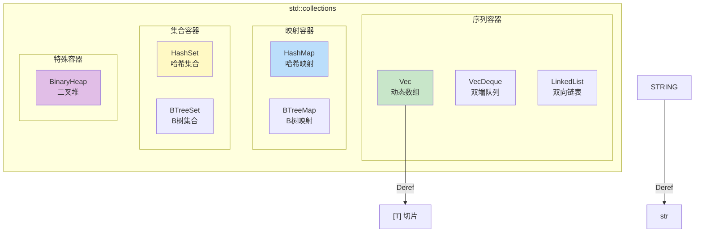

### 选择指南

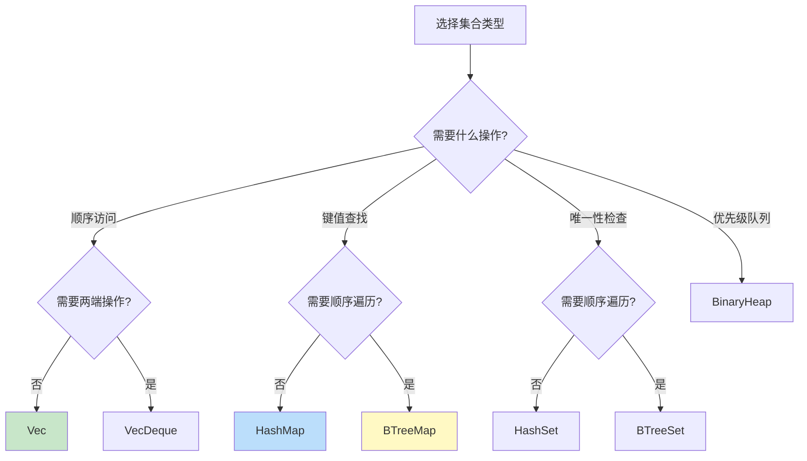

---

## 2. Vec<T> 动态数组

Vec 是最常用的集合类型，提供连续内存的动态数组。

### 内存布局

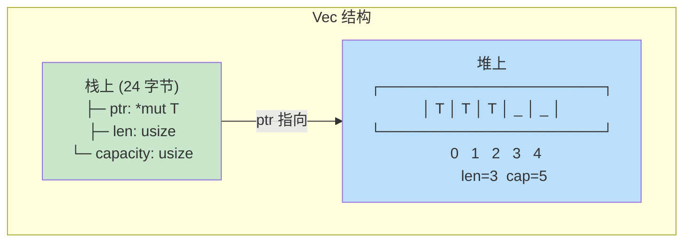

### 容量增长策略

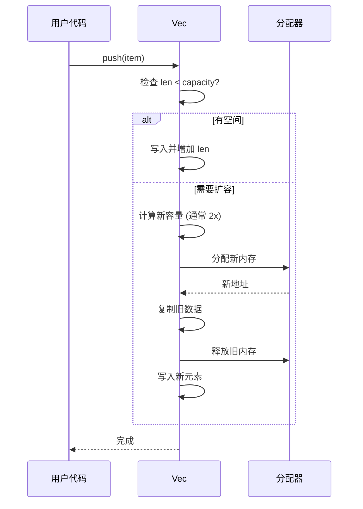

### 常用方法

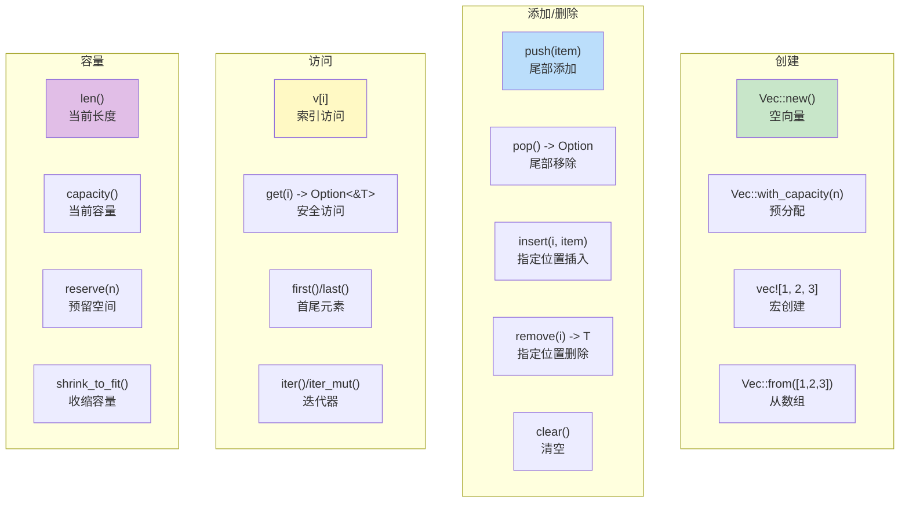

### 性能特性

| 操作 | 平均复杂度 | 最坏复杂度 | 说明 |
|------|-----------|-----------|------|
| push | O(1)* | O(n) | 摊还 O(1)，扩容时 O(n) |
| pop | O(1) | O(1) | |
| insert | O(n) | O(n) | 需要移动元素 |
| remove | O(n) | O(n) | 需要移动元素 |
| get/index | O(1) | O(1) | |
| contains | O(n) | O(n) | 线性搜索 |

---

## 3. String 字符串

String 是 UTF-8 编码的动态字符串，本质是 `Vec<u8>` 的包装。

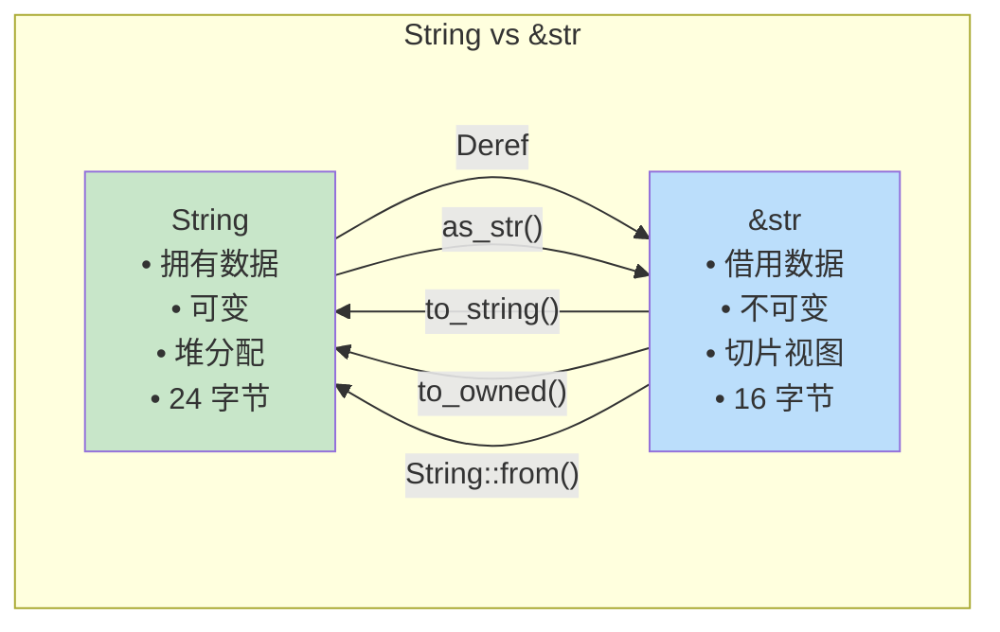

### 字符串索引

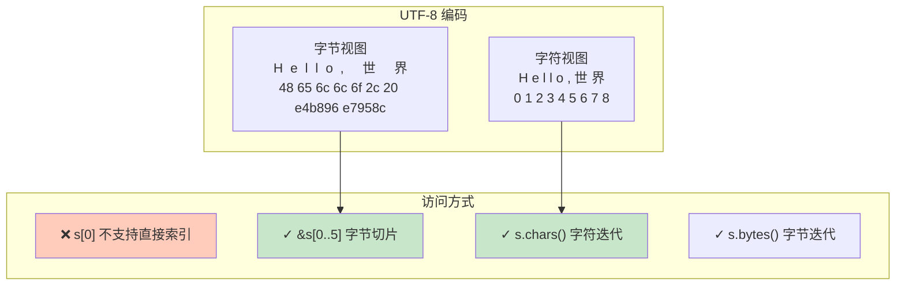

---

## 4. HashMap<K, V>

HashMap 提供 O(1) 平均复杂度的键值存储。

### 内部结构

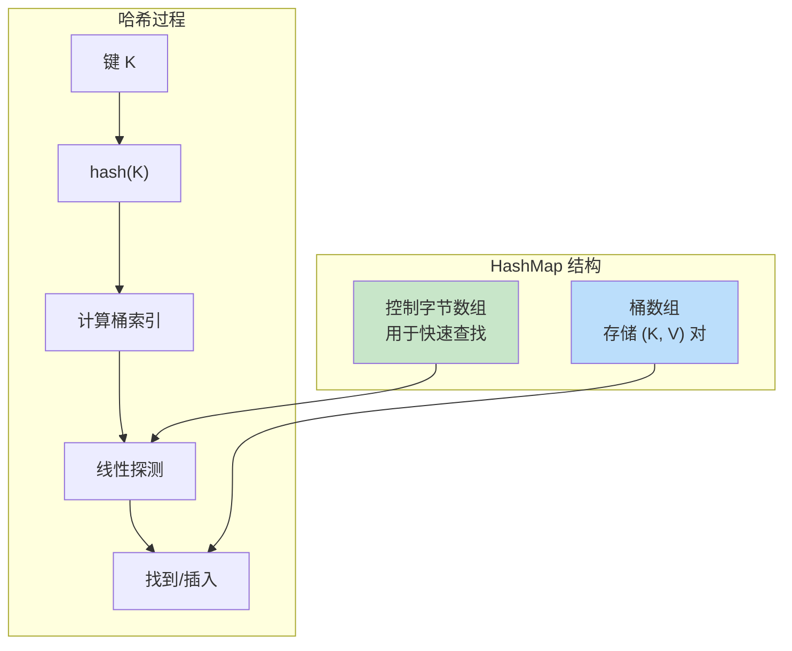

### 使用要求

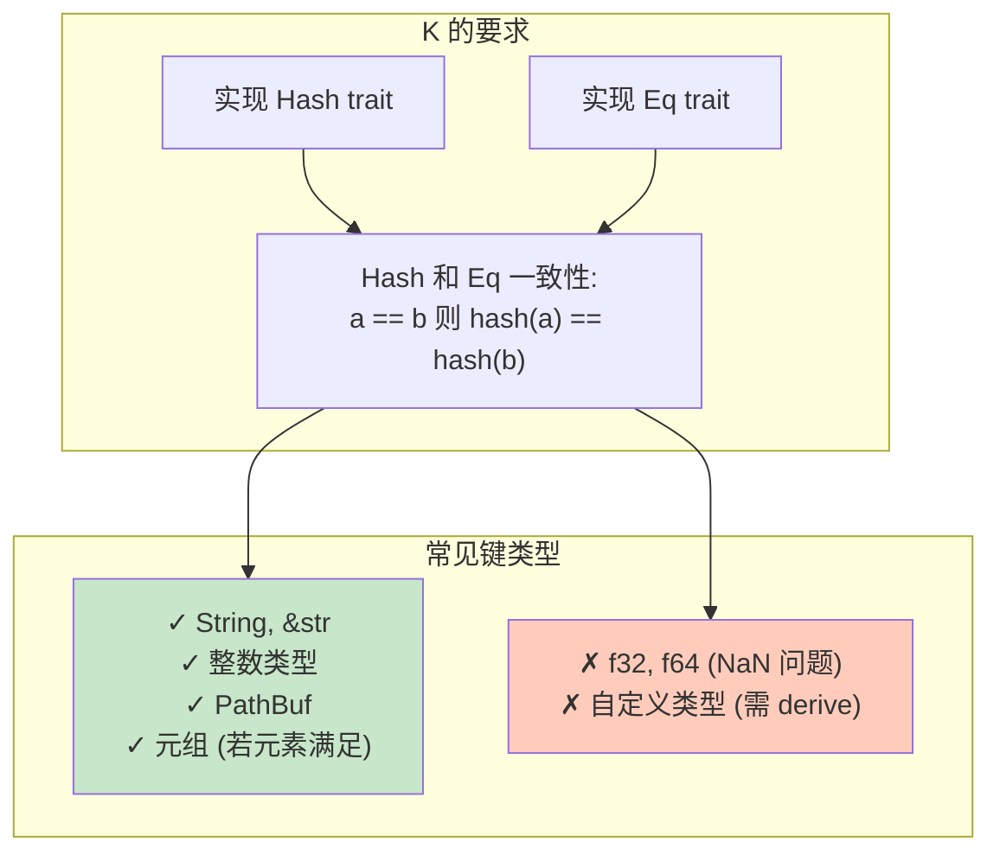

### Entry API

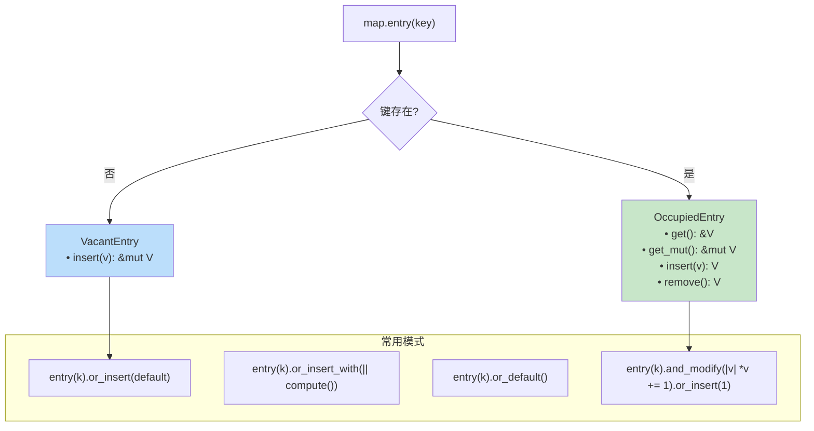

### 性能特性

| 操作 | 平均复杂度 | 最坏复杂度 |
|------|-----------|-----------|
| get | O(1) | O(n) |
| insert | O(1) | O(n) |
| remove | O(1) | O(n) |
| contains_key | O(1) | O(n) |
| 遍历 | O(capacity) | O(capacity) |

---

## 5. BTreeMap<K, V>

BTreeMap 使用 B 树实现有序映射。

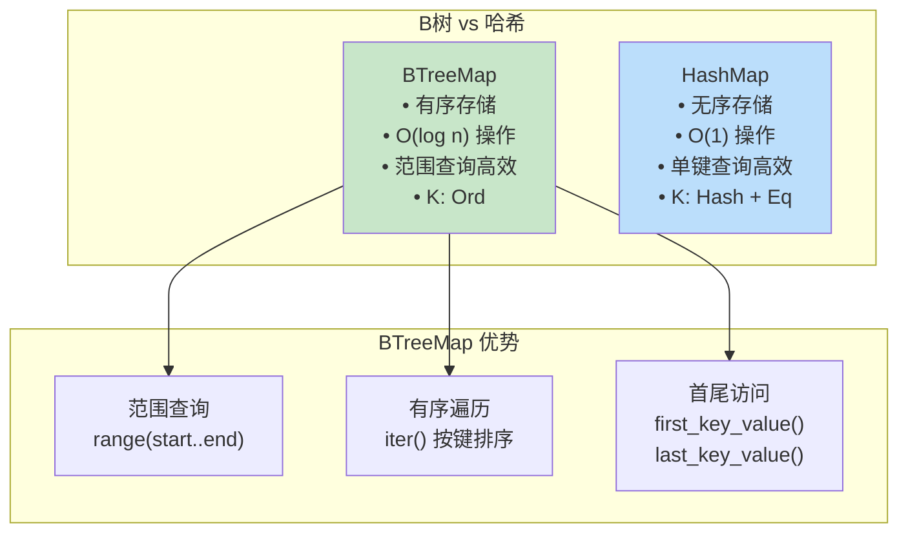

### B树结构

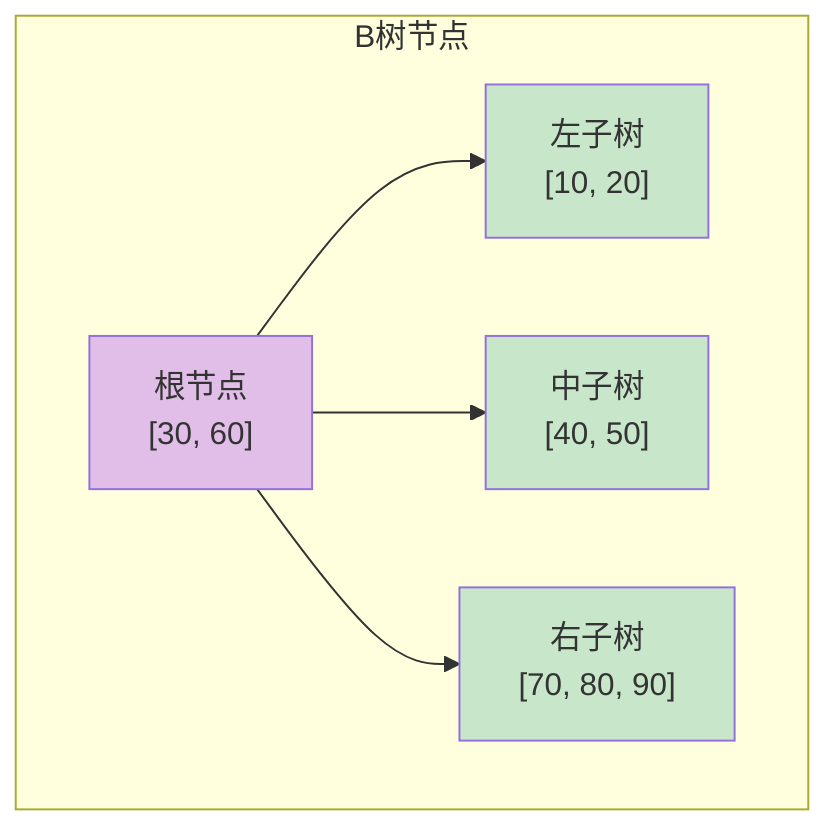

---

## 6. HashSet<T> 和 BTreeSet<T>

集合类型用于存储唯一值。

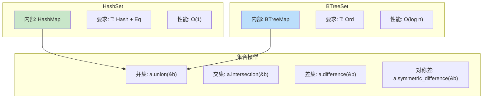

### 集合运算示意

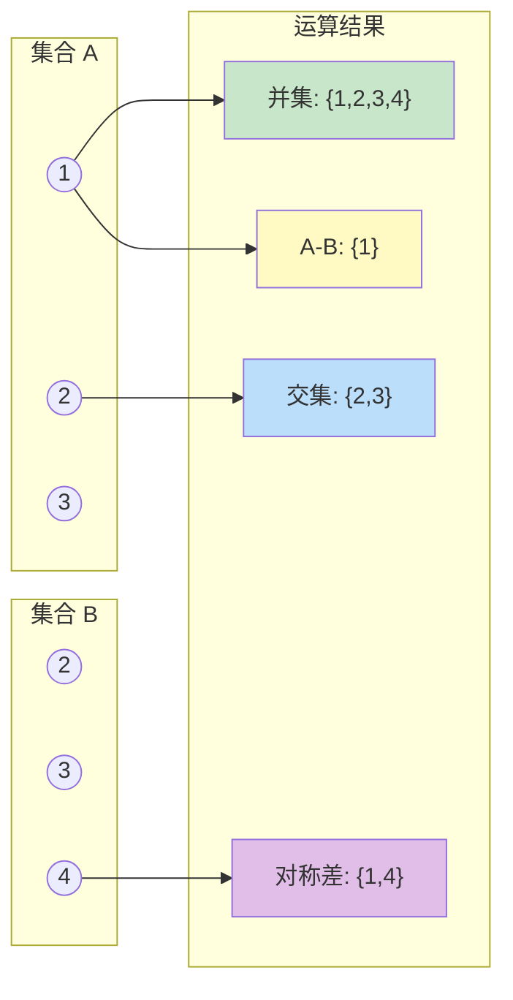

---

## 7. VecDeque<T> 双端队列

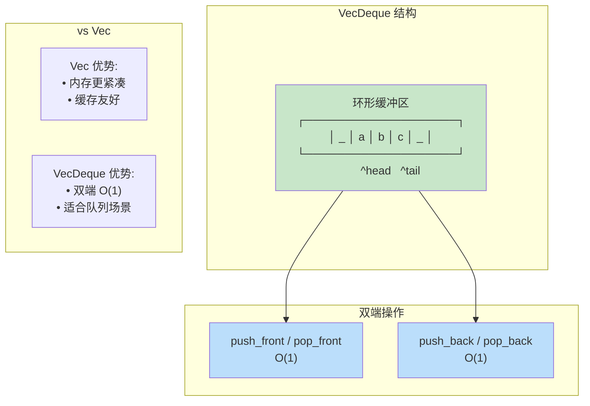

---

## 8. BinaryHeap<T> 二叉堆

BinaryHeap 是最大堆实现，适用于优先队列。

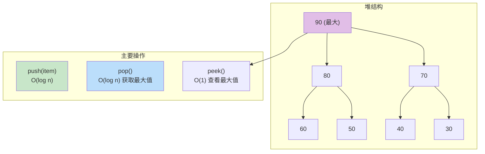

### 最小堆实现

```rust
use std::cmp::Reverse;
use std::collections::BinaryHeap;

// 使用 Reverse 包装实现最小堆
let mut min_heap = BinaryHeap::new();
min_heap.push(Reverse(5));
min_heap.push(Reverse(1));
min_heap.push(Reverse(3));

assert_eq!(min_heap.pop(), Some(Reverse(1))); // 最小值
```

---

## 9. 集合性能对比

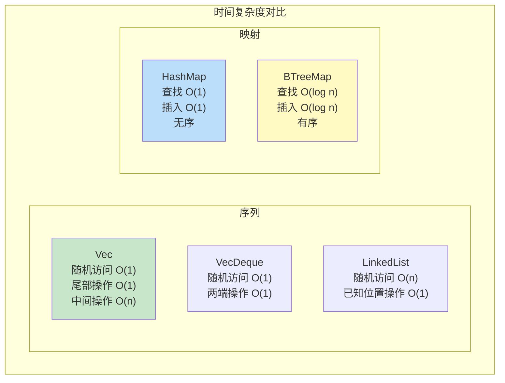

### 选择总结

| 场景 | 推荐类型 | 原因 |
|------|----------|------|
| 动态数组 | `Vec<T>` | 默认选择，性能最优 |
| FIFO 队列 | `VecDeque<T>` | 双端 O(1) |
| 键值存储 | `HashMap<K,V>` | O(1) 查找 |
| 有序键值 | `BTreeMap<K,V>` | 范围查询 |
| 唯一值集合 | `HashSet<T>` | O(1) 查找 |
| 有序集合 | `BTreeSet<T>` | 范围操作 |
| 优先队列 | `BinaryHeap<T>` | O(log n) 取最值 |
| 频繁中间插删 | `LinkedList<T>` | O(1) 已知位置操作 |

---

## 10. 迭代器与集合

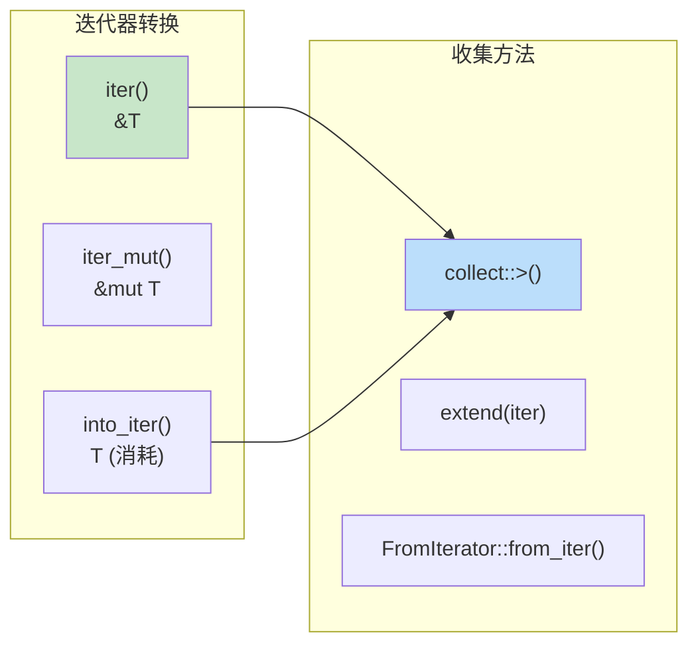

### 常用迭代模式

```rust
// 过滤并收集
let evens: Vec<_> = v.iter()
    .filter(|x| *x % 2 == 0)
    .collect();

// 转换类型
let strings: Vec<String> = nums.iter()
    .map(|n| n.to_string())
    .collect();

// 构建 HashMap
let map: HashMap<_, _> = pairs.into_iter().collect();

// 分组 (需要 itertools)
let groups: HashMap<_, Vec<_>> = items.iter()
    .map(|x| (x.category, x))
    .into_group_map();
```
