# Rust 并发编程详解

## 1. 并发模型概览

Rust 的并发安全建立在类型系统之上，通过 Send 和 Sync trait 在编译时保证线程安全。

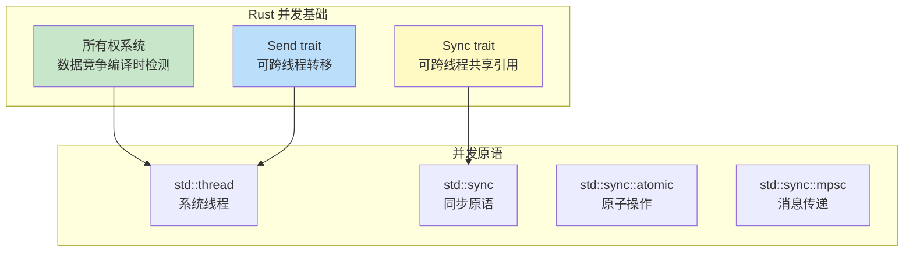

---

## 2. 线程 (std::thread)

### 创建与管理

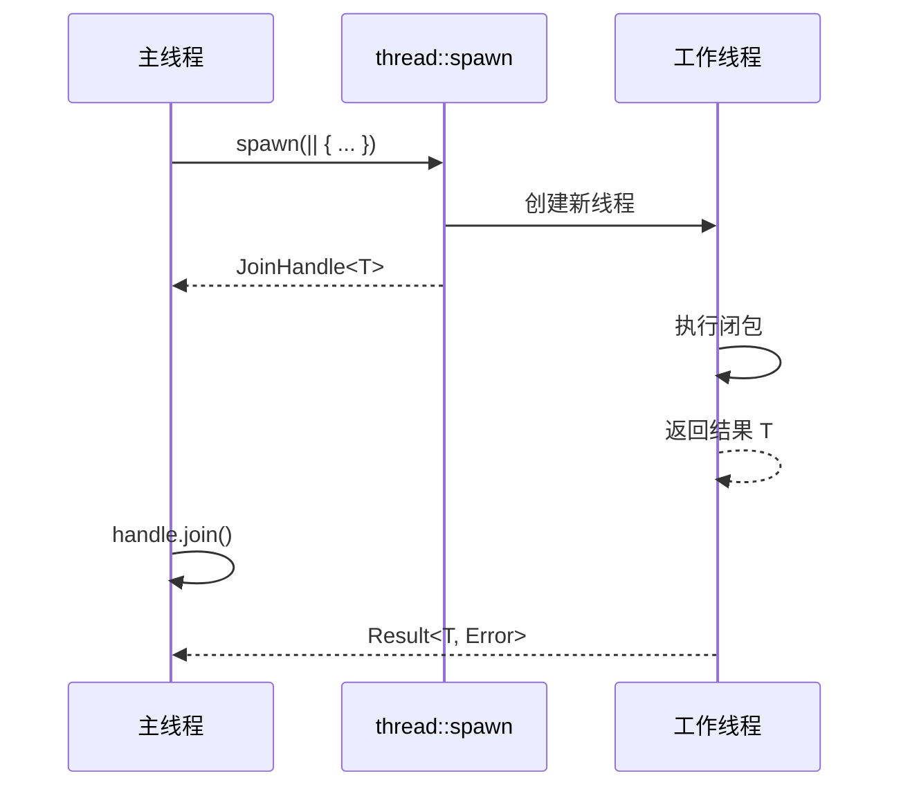

### 线程 API

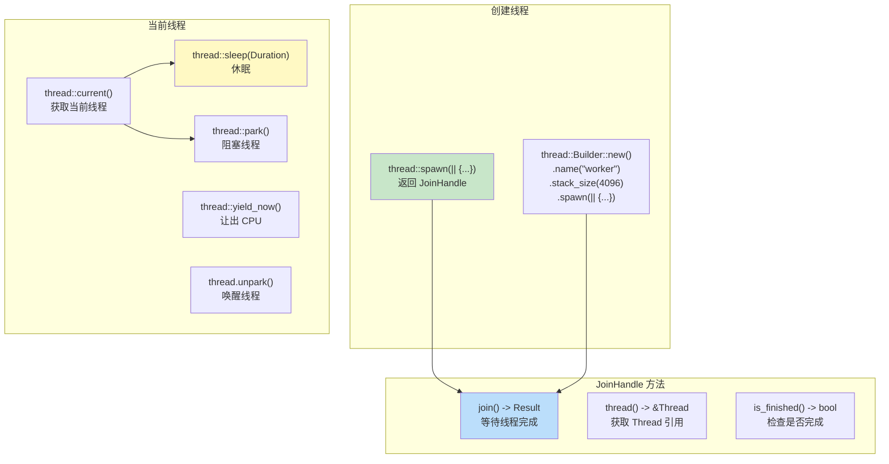

### 数据传递

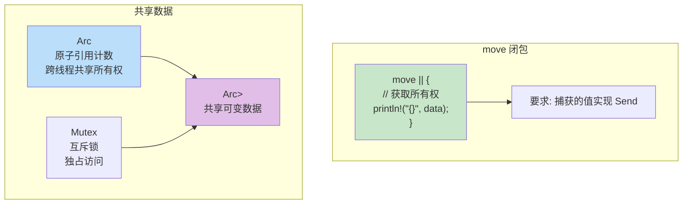

---

## 3. 互斥锁 Mutex<T>

Mutex 提供互斥访问，同一时间只有一个线程可以访问数据。

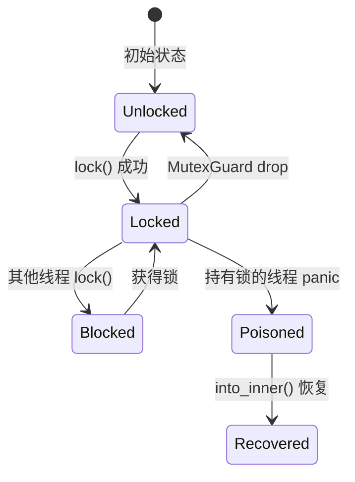

### Mutex 使用模式

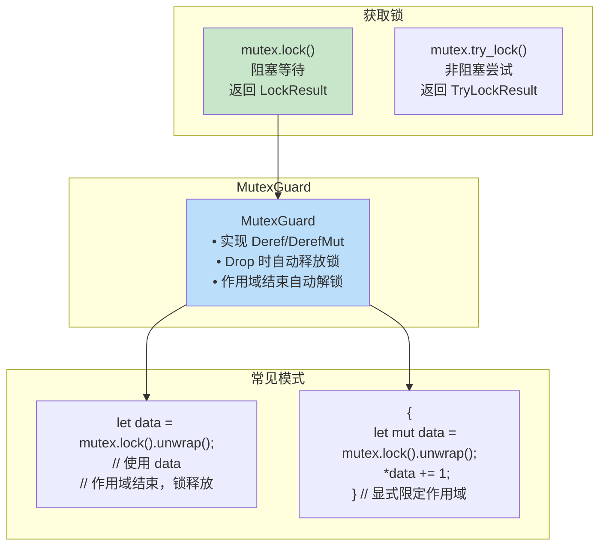

### 死锁预防

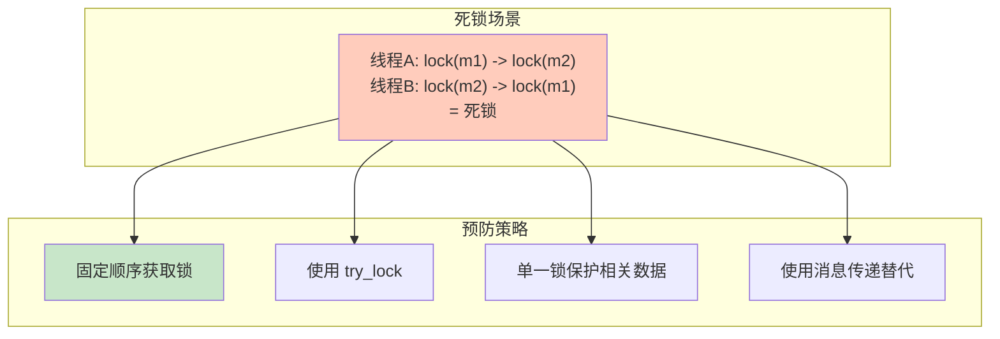

---

## 4. 读写锁 RwLock<T>

RwLock 允许多读单写，适合读多写少的场景。

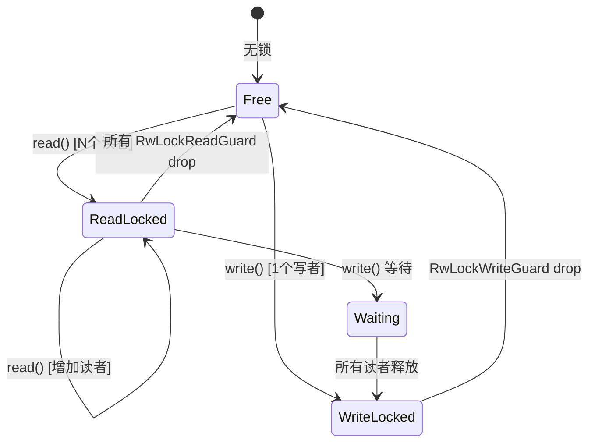

### RwLock vs Mutex

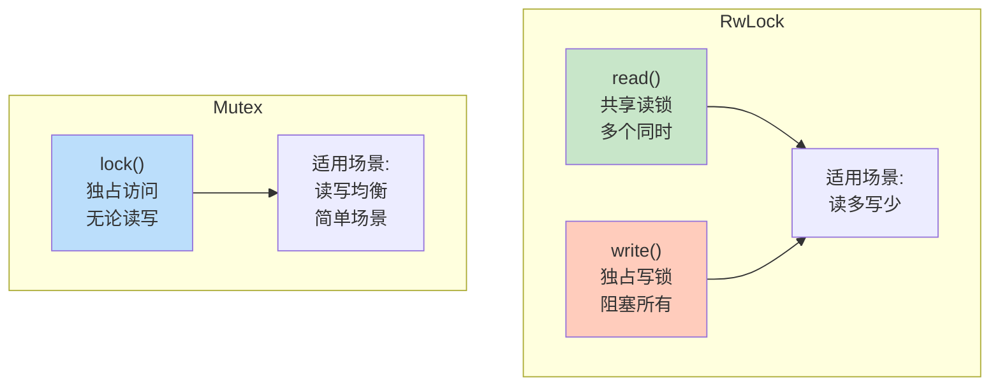

---

## 5. 原子类型 (std::sync::atomic)

原子操作提供无锁的线程安全原语。

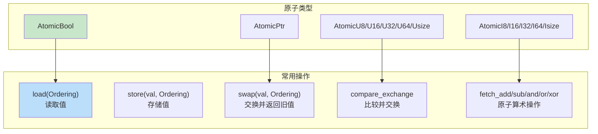

### 内存顺序

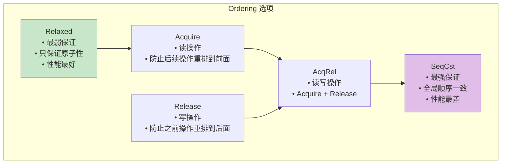

### 使用示例

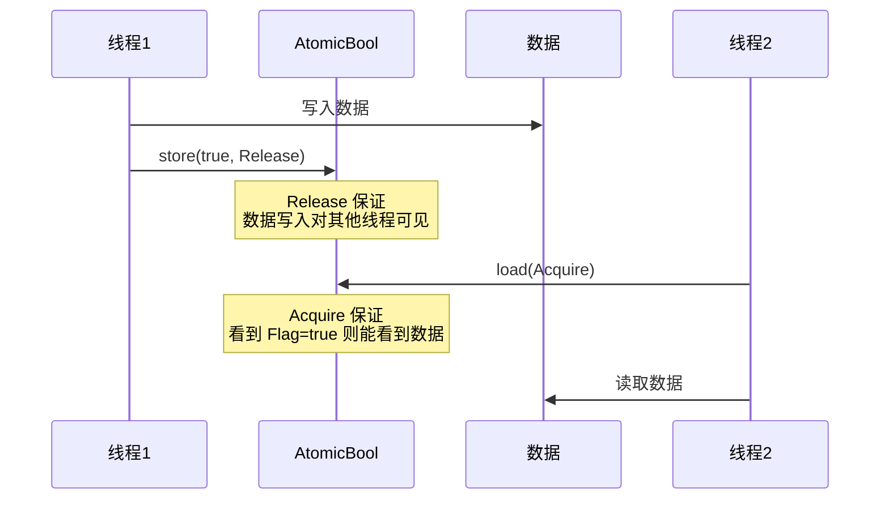

---

## 6. 通道 (std::sync::mpsc)

MPSC (Multiple Producer, Single Consumer) 通道实现消息传递。

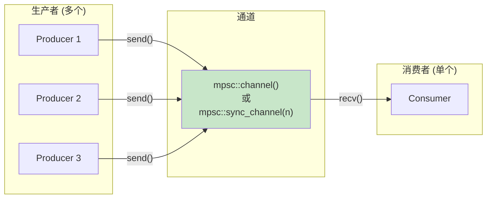

### 通道类型

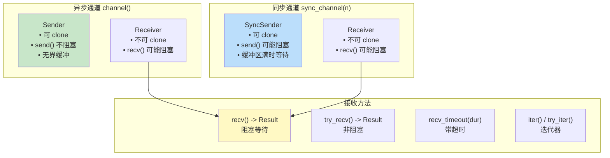

### 通道状态

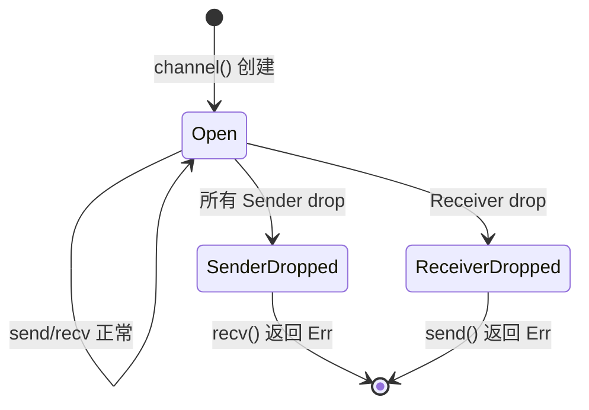

---

## 7. Arc<T> 原子引用计数

Arc 允许多个所有者跨线程共享数据。

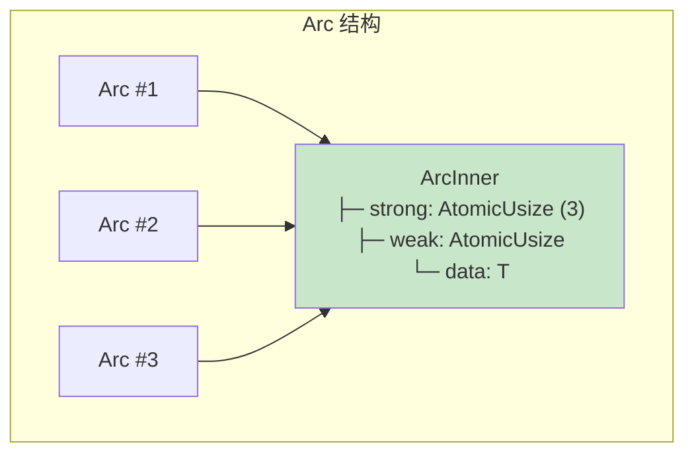

### Arc vs Rc

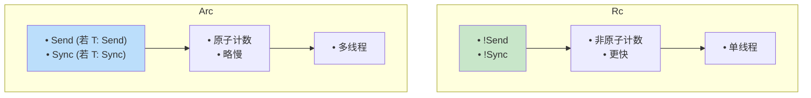

### 常见组合

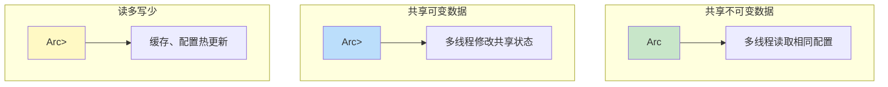

---

## 8. 条件变量 Condvar

Condvar 用于线程间等待和通知。

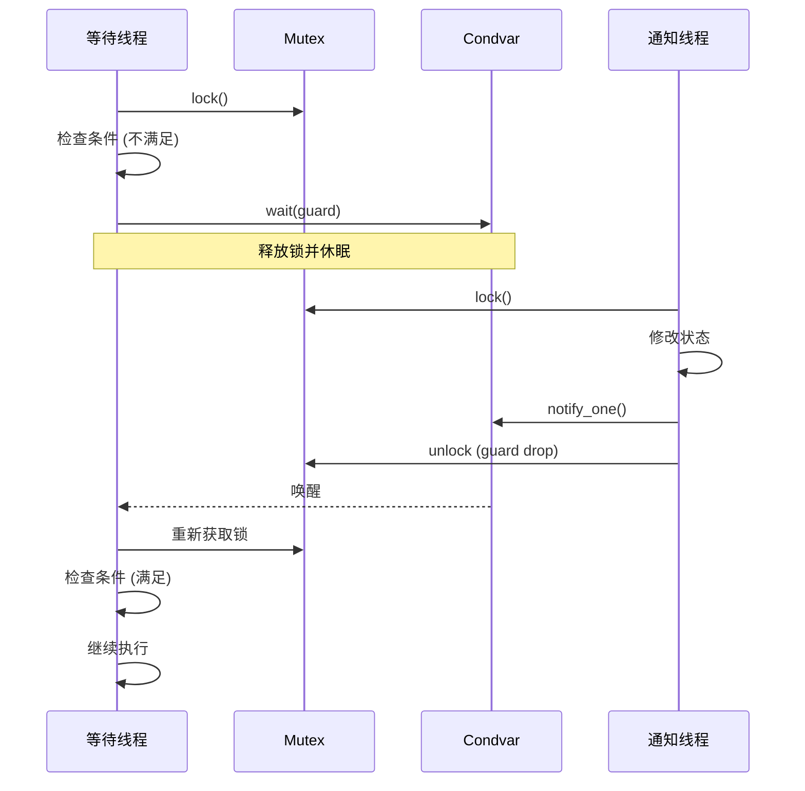

### Condvar API

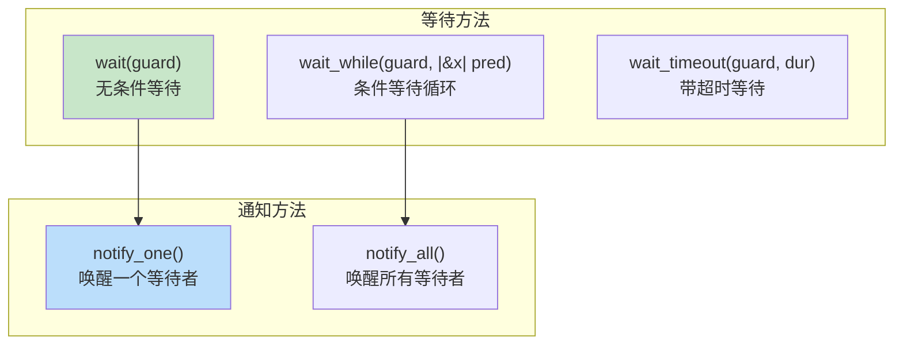

---

## 9. 屏障 Barrier

Barrier 让多个线程在某点同步。

```mermaid
sequenceDiagram
    participant T1 as 线程1
    participant T2 as 线程2
    participant T3 as 线程3
    participant B as Barrier(3)

    par 并行执行
        T1->>T1: 工作阶段1
        T2->>T2: 工作阶段1
        T3->>T3: 工作阶段1
    end

    T1->>B: wait()
    Note over T1,B: T1 等待
    T2->>B: wait()
    Note over T2,B: T2 等待
    T3->>B: wait()
    Note over T3,B: 全部到达，释放

    par 并行继续
        T1->>T1: 工作阶段2
        T2->>T2: 工作阶段2
        T3->>T3: 工作阶段2
    end
```

---

## 10. Once 单次初始化

Once 保证代码只执行一次，适用于全局初始化。

```mermaid
graph TB
    subgraph "Once 状态"
        INCOMPLETE["Incomplete<br/>未初始化"]
        RUNNING["Running<br/>正在初始化"]
        COMPLETE["Complete<br/>已完成"]
    end

    INCOMPLETE -->|"call_once()"| RUNNING
    RUNNING -->|完成| COMPLETE
    COMPLETE -->|"再次 call_once()"| COMPLETE

    subgraph "OnceLock<T>"
        ONCELOCK["OnceLock<T><br/>• 类型安全的单次初始化<br/>• get_or_init(|| value)<br/>• get() -> Option<&T>"]
    end

    style COMPLETE fill:#c8e6c9
    style ONCELOCK fill:#bbdefb
```

---

## 11. 并发模式总结

```mermaid
mindmap
    root((并发模式))
        共享状态
            Arc + Mutex
            Arc + RwLock
            Atomic 类型
        消息传递
            mpsc 通道
            crossbeam 通道
        同步原语
            Barrier 屏障
            Condvar 条件变量
            Once 单次初始化
        无锁编程
            Atomic 操作
            CAS 循环
```

### 选择指南

| 场景 | 推荐方案 | 原因 |
|------|----------|------|
| 简单计数器 | `AtomicUsize` | 无锁，高性能 |
| 共享配置 (只读) | `Arc<T>` | 无需锁 |
| 共享可变状态 | `Arc<Mutex<T>>` | 简单直接 |
| 读多写少 | `Arc<RwLock<T>>` | 允许并发读 |
| 生产者-消费者 | `mpsc::channel` | 解耦，避免锁 |
| 多生产者多消费者 | `crossbeam::channel` | 标准库不支持 |
| 全局单例 | `OnceLock<T>` | 线程安全初始化 |
| 阶段同步 | `Barrier` | 等待所有线程 |

```mermaid
flowchart TD
    START[并发需求] --> Q1{需要共享数据?}

    Q1 -->|否| CHANNEL[使用 Channel<br/>消息传递]
    Q1 -->|是| Q2{需要修改?}

    Q2 -->|否| ARC[Arc<T>]
    Q2 -->|是| Q3{数据简单?}

    Q3 -->|是| ATOMIC[Atomic 类型]
    Q3 -->|否| Q4{读多写少?}

    Q4 -->|是| RWLOCK[Arc<RwLock<T>>]
    Q4 -->|否| MUTEX[Arc<Mutex<T>>]

    style CHANNEL fill:#c8e6c9
    style ARC fill:#bbdefb
    style ATOMIC fill:#fff9c4
    style MUTEX fill:#e1bee7
```
