# Rust 错误处理详解

## 1. 错误处理概览

Rust 使用 `Option` 和 `Result` 类型进行错误处理，无异常机制。

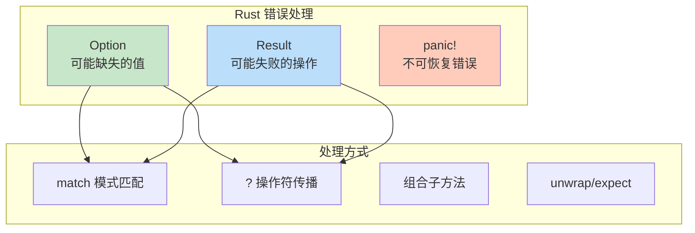

---

## 2. Option<T>

Option 表示可能存在或缺失的值。

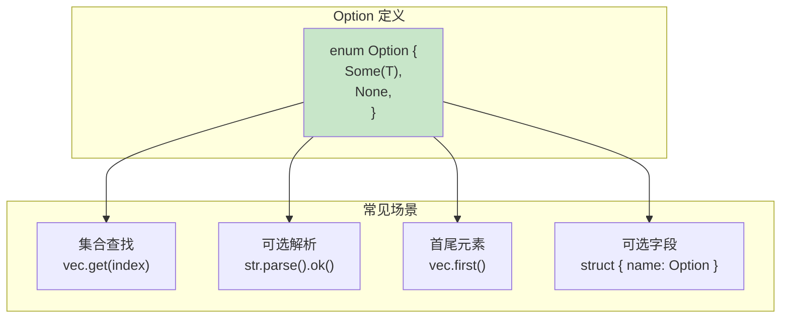

### Option 方法

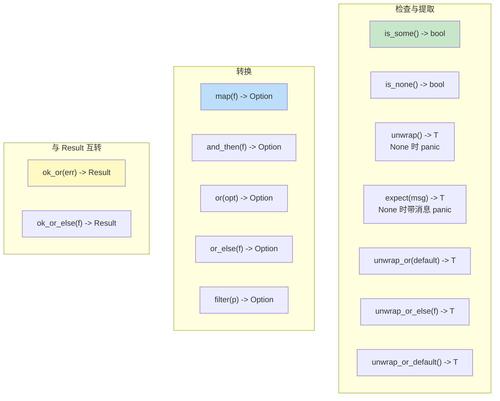

### Option 链式处理

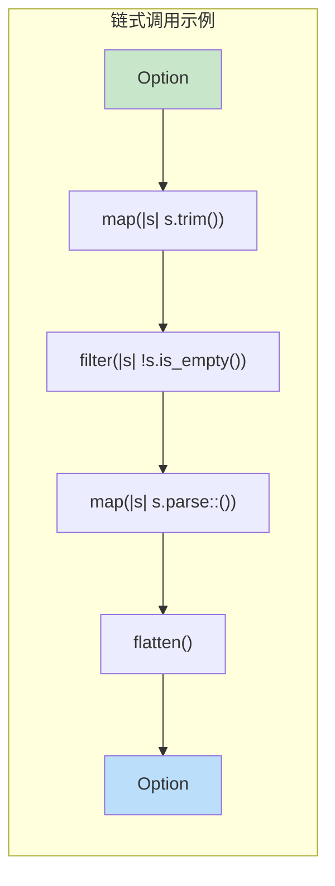

---

## 3. Result<T, E>

Result 表示可能成功或失败的操作。

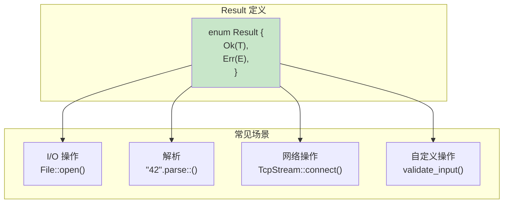

### Result 方法

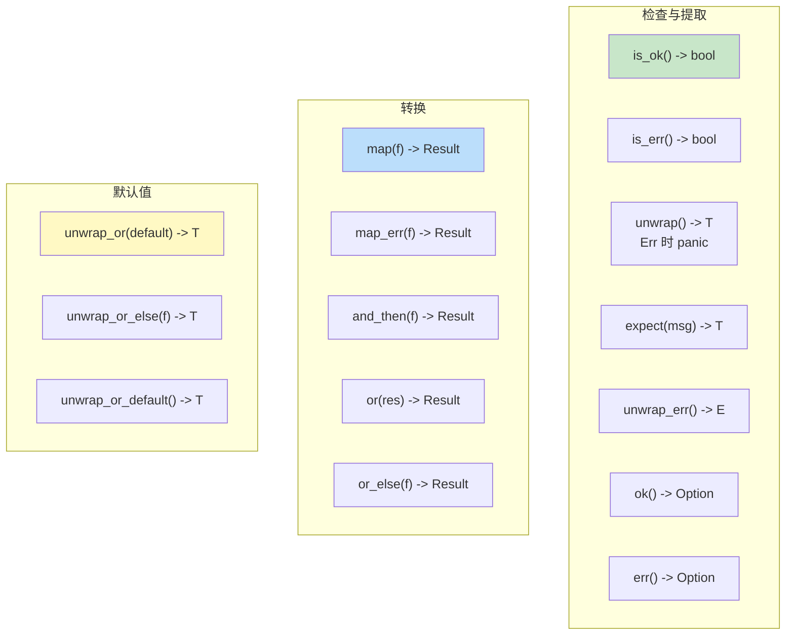

---

## 4. ? 操作符

? 操作符简化错误传播。

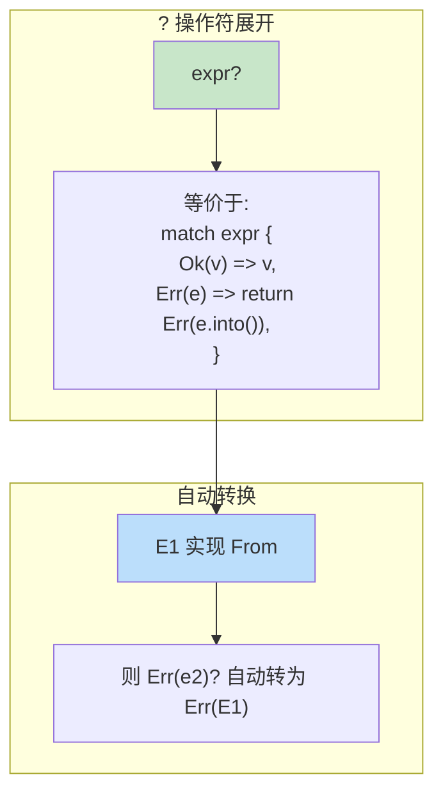

### ? 在不同上下文

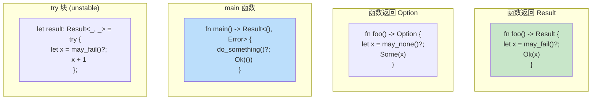

---

## 5. 自定义错误类型

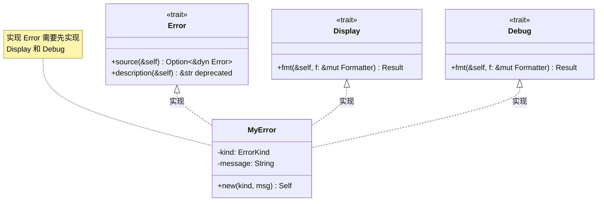

### 错误类型设计

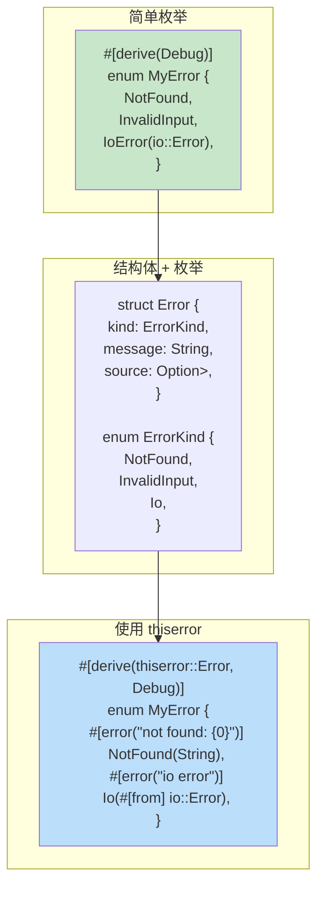

---

## 6. 错误转换

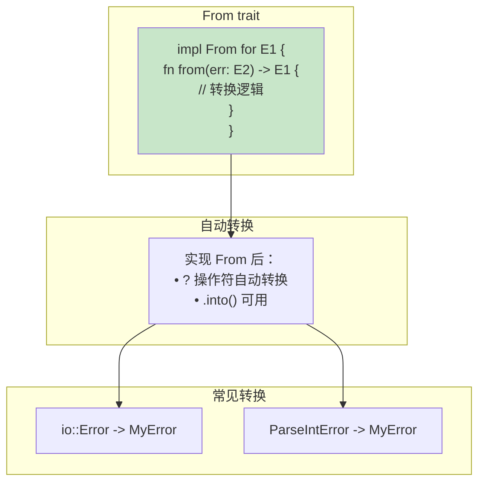

### 错误链

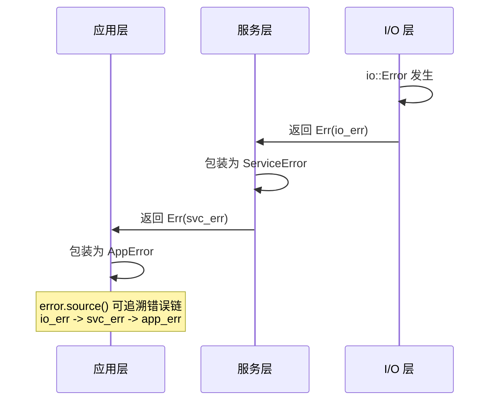

---

## 7. panic! 与 catch_unwind

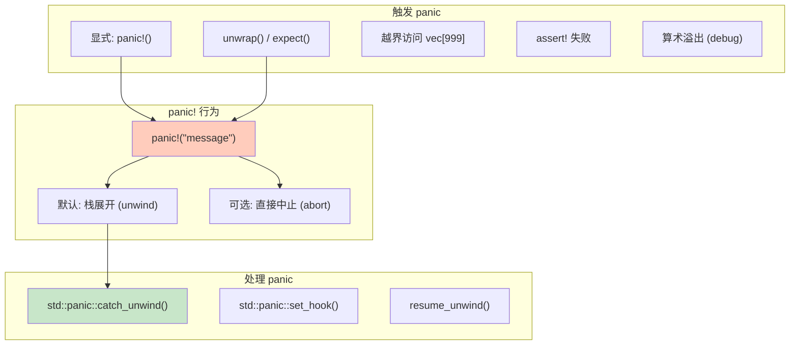

### 何时使用 panic

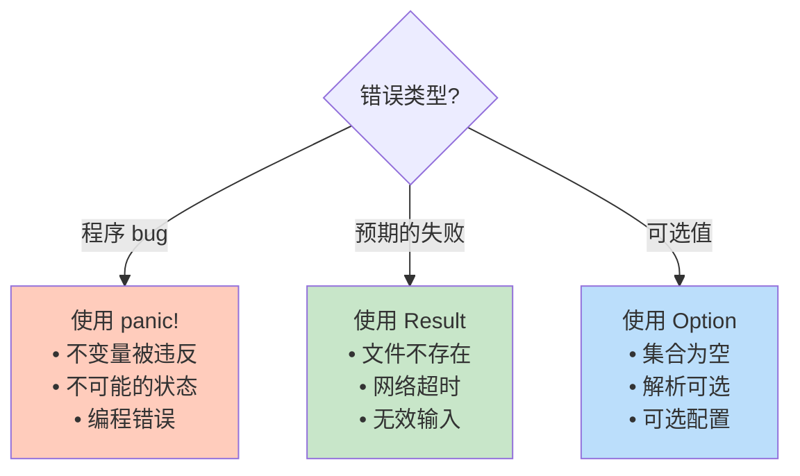

---

## 8. 错误处理最佳实践

```mermaid
mindmap
    root((错误处理))
        库代码
            返回 Result
            定义清晰的错误类型
            实现 Error trait
            提供错误转换
        应用代码
            在边界处理错误
            提供用户友好消息
            记录详细错误信息
            考虑使用 anyhow
        测试代码
            unwrap() 可接受
            使用 ? 在测试函数
            #[should_panic] 测试
```

### 常用 crate

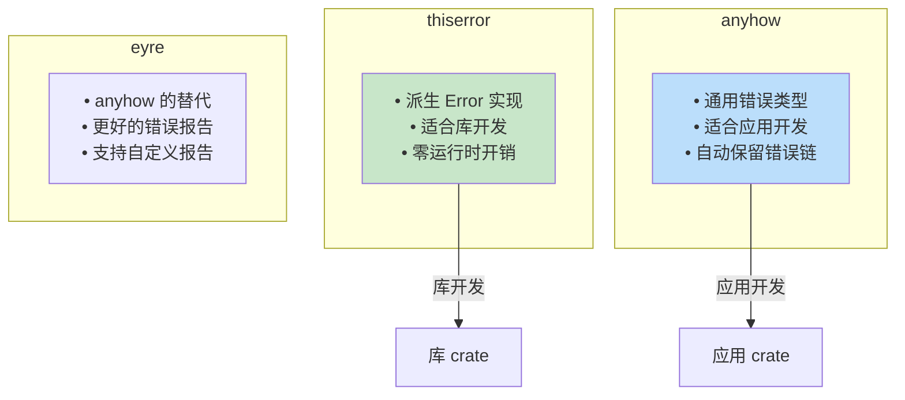

---

## 9. 常见模式

### 组合多个 Result

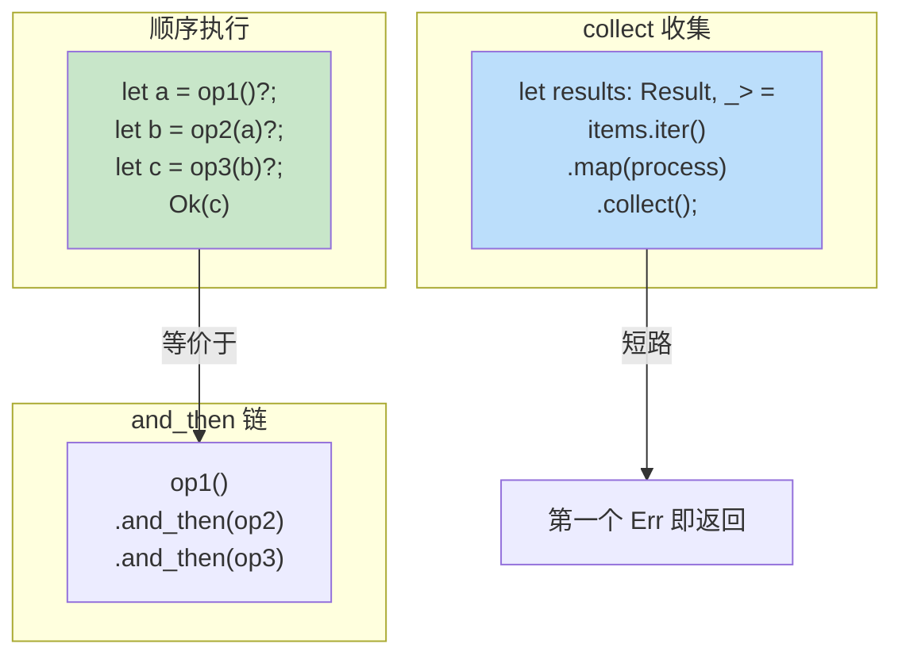

### 提供上下文

```rust
// 使用 map_err 添加上下文
fs::read_to_string(path)
    .map_err(|e| format!("failed to read {}: {}", path, e))?;

// 使用 anyhow context
use anyhow::Context;
fs::read_to_string(path)
    .context(format!("failed to read {}", path))?;
```

---

## 10. Result 与 Option 互转

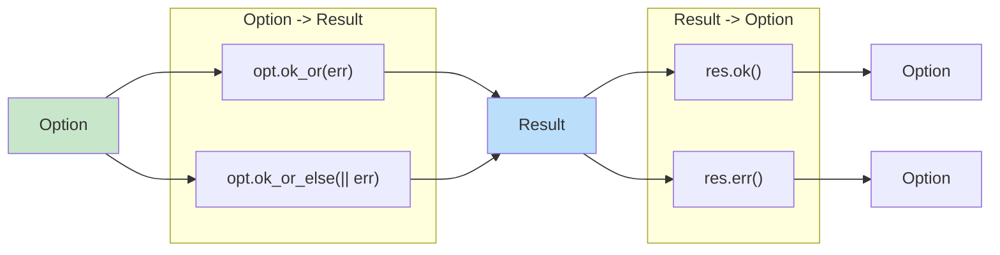
