# Rust I/O 系统详解

## 1. I/O 系统概览

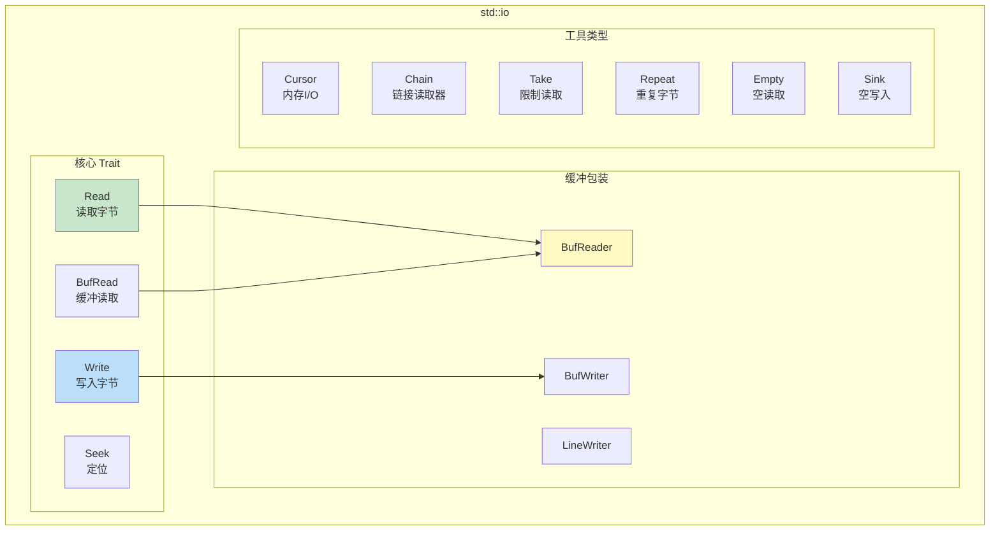
```mermaid
graph TB
    subgraph "std::io"
        subgraph "核心 Trait"
            READ["Read<br/>读取字节"]
            WRITE["Write<br/>写入字节"]
            SEEK["Seek<br/>定位"]
            BUFREAD["BufRead<br/>缓冲读取"]
        end

        subgraph "缓冲包装"
            BUFREADER["BufReader<T>"]
            BUFWRITER["BufWriter<T>"]
            LINEWRITER["LineWriter<T>"]
        end

        subgraph "工具类型"
            CURSOR["Cursor<T><br/>内存I/O"]
            CHAIN["Chain<T,U><br/>链接读取器"]
            TAKE["Take<T><br/>限制读取"]
            REPEAT["Repeat<br/>重复字节"]
            EMPTY["Empty<br/>空读取"]
            SINK["Sink<br/>空写入"]
        end
    end

    READ --> BUFREADER
    WRITE --> BUFWRITER
    BUFREAD --> BUFREADER

    style READ fill:#c8e6c9
    style WRITE fill:#bbdefb
    style BUFREADER fill:#fff9c4
```

---

## 2. Read Trait

Read trait 定义字节流读取接口。

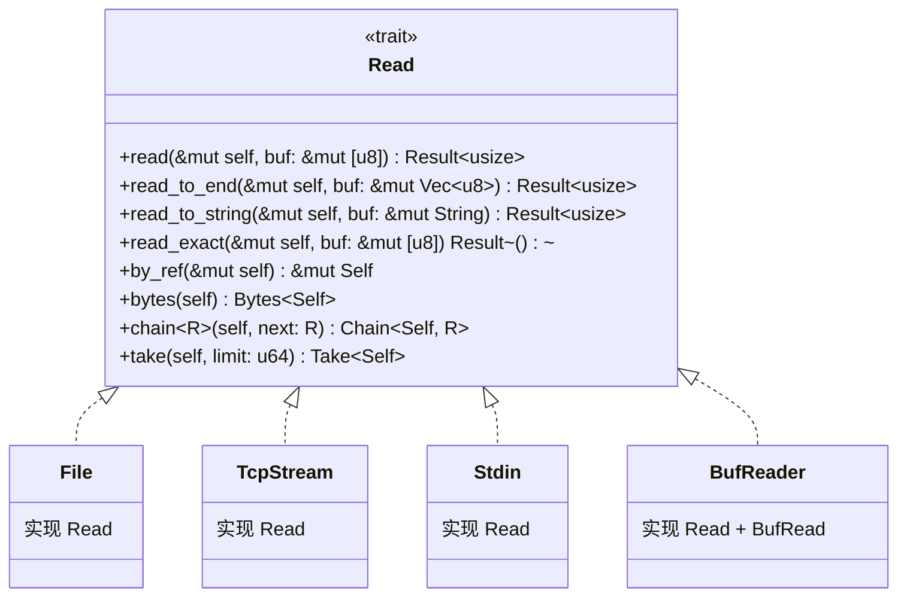
```mermaid
classDiagram
    class Read {
        <<trait>>
        +read(&mut self, buf: &mut [u8]) Result~usize~
        +read_to_end(&mut self, buf: &mut Vec~u8~) Result~usize~
        +read_to_string(&mut self, buf: &mut String) Result~usize~
        +read_exact(&mut self, buf: &mut [u8]) Result~()~
        +by_ref(&mut self) &mut Self
        +bytes(self) Bytes~Self~
        +chain~R~(self, next: R) Chain~Self, R~
        +take(self, limit: u64) Take~Self~
    }

    class File {
        实现 Read
    }

    class TcpStream {
        实现 Read
    }

    class Stdin {
        实现 Read
    }

    class BufReader {
        实现 Read + BufRead
    }

    Read <|.. File
    Read <|.. TcpStream
    Read <|.. Stdin
    Read <|.. BufReader
```

### 读取模式

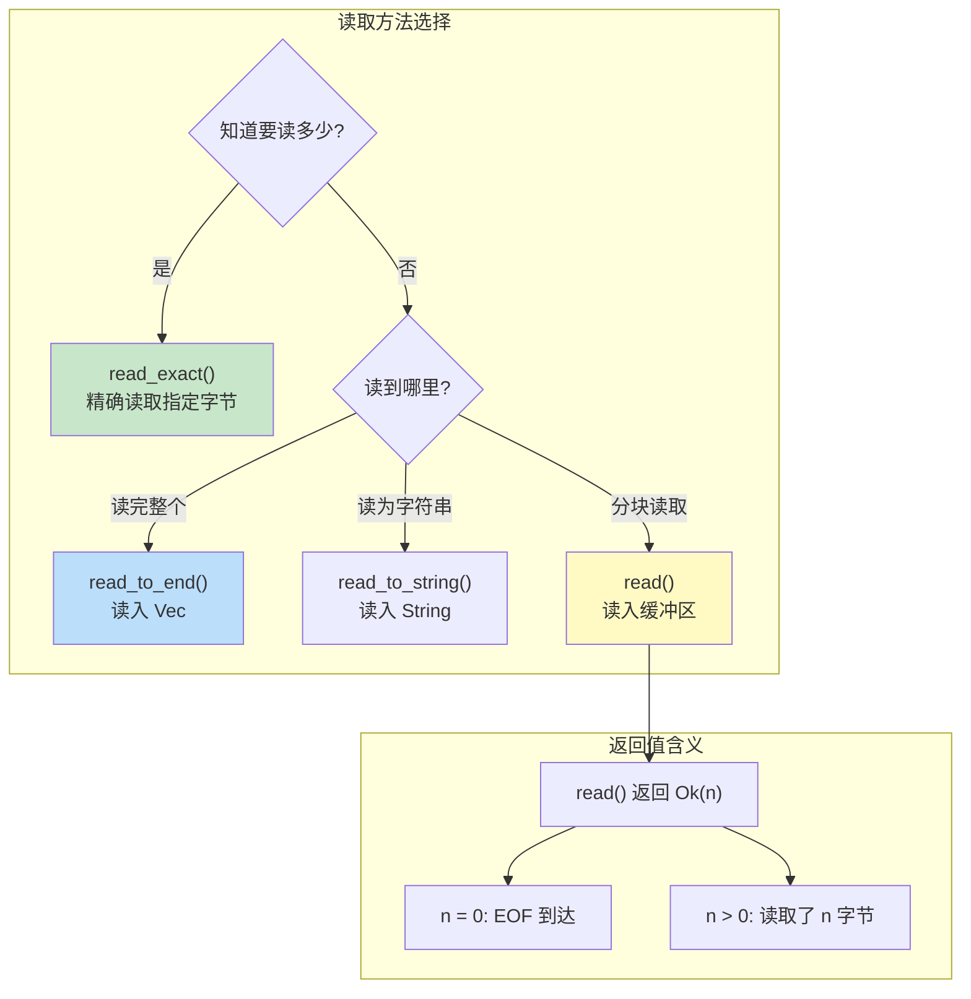
```mermaid
flowchart TD
    subgraph "读取方法选择"
        Q1{知道要读多少?}
        Q1 -->|是| EXACT["read_exact()<br/>精确读取指定字节"]
        Q1 -->|否| Q2{读到哪里?}

        Q2 -->|读完整个| TO_END["read_to_end()<br/>读入 Vec<u8>"]
        Q2 -->|读为字符串| TO_STRING["read_to_string()<br/>读入 String"]
        Q2 -->|分块读取| READ["read()<br/>读入缓冲区"]
    end

    subgraph "返回值含义"
        RET["read() 返回 Ok(n)"]
        N0["n = 0: EOF 到达"]
        N_POS["n > 0: 读取了 n 字节"]
    end

    READ --> RET
    RET --> N0
    RET --> N_POS

    style EXACT fill:#c8e6c9
    style TO_END fill:#bbdefb
    style READ fill:#fff9c4
```

---

## 3. Write Trait

Write trait 定义字节流写入接口。

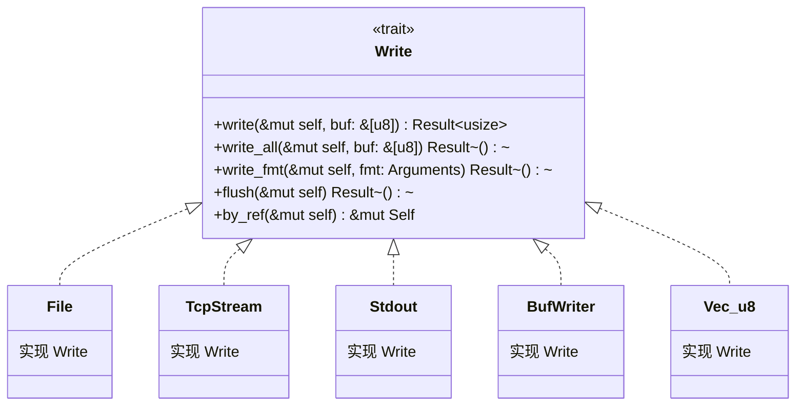
```mermaid
classDiagram
    class Write {
        <<trait>>
        +write(&mut self, buf: &[u8]) Result~usize~
        +write_all(&mut self, buf: &[u8]) Result~()~
        +write_fmt(&mut self, fmt: Arguments) Result~()~
        +flush(&mut self) Result~()~
        +by_ref(&mut self) &mut Self
    }

    class File {
        实现 Write
    }

    class TcpStream {
        实现 Write
    }

    class Stdout {
        实现 Write
    }

    class BufWriter {
        实现 Write
    }

    class Vec_u8 {
        实现 Write
    }

    Write <|.. File
    Write <|.. TcpStream
    Write <|.. Stdout
    Write <|.. BufWriter
    Write <|.. Vec_u8
```

### 写入模式

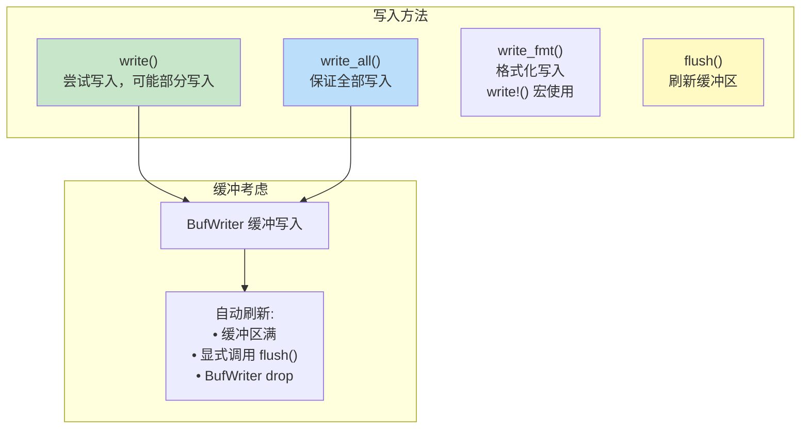
```mermaid
graph TB
    subgraph "写入方法"
        WRITE["write()<br/>尝试写入，可能部分写入"]
        WRITE_ALL["write_all()<br/>保证全部写入"]
        WRITE_FMT["write_fmt()<br/>格式化写入<br/>write!() 宏使用"]
        FLUSH["flush()<br/>刷新缓冲区"]
    end

    subgraph "缓冲考虑"
        BUFFER["BufWriter 缓冲写入"]
        AUTO_FLUSH["自动刷新:<br/>• 缓冲区满<br/>• 显式调用 flush()<br/>• BufWriter drop"]
    end

    WRITE --> BUFFER
    WRITE_ALL --> BUFFER
    BUFFER --> AUTO_FLUSH

    style WRITE fill:#c8e6c9
    style WRITE_ALL fill:#bbdefb
    style FLUSH fill:#fff9c4
```

---

## 4. BufRead Trait

BufRead 提供缓冲读取功能，支持按行读取。

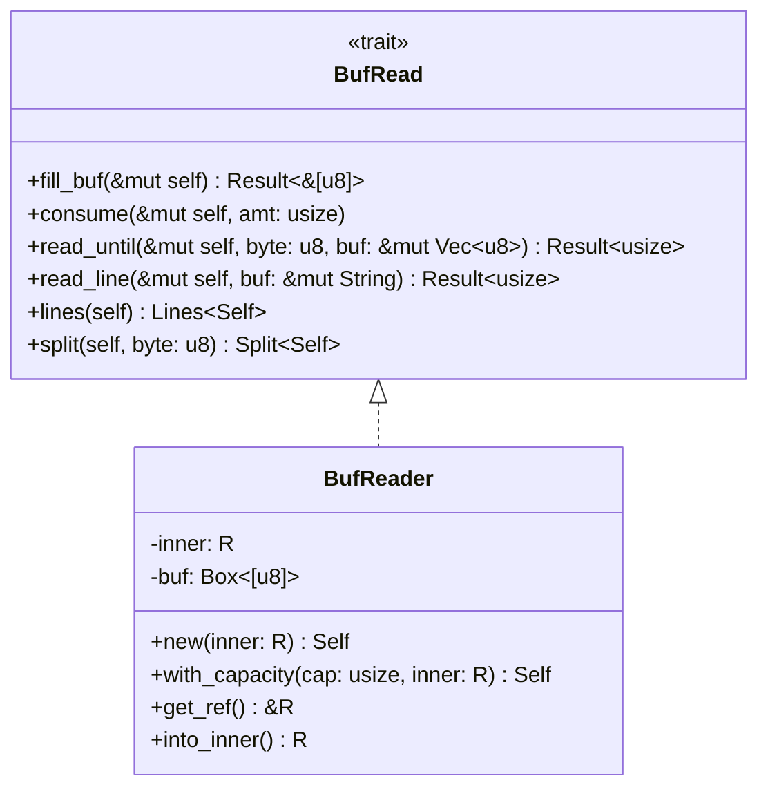
```mermaid
classDiagram
    class BufRead {
        <<trait>>
        +fill_buf(&mut self) Result~&[u8]~
        +consume(&mut self, amt: usize)
        +read_until(&mut self, byte: u8, buf: &mut Vec~u8~) Result~usize~
        +read_line(&mut self, buf: &mut String) Result~usize~
        +lines(self) Lines~Self~
        +split(self, byte: u8) Split~Self~
    }

    class BufReader {
        -inner: R
        -buf: Box~[u8]~
        +new(inner: R) Self
        +with_capacity(cap: usize, inner: R) Self
        +get_ref() &R
        +into_inner() R
    }

    BufRead <|.. BufReader
```

### 按行读取

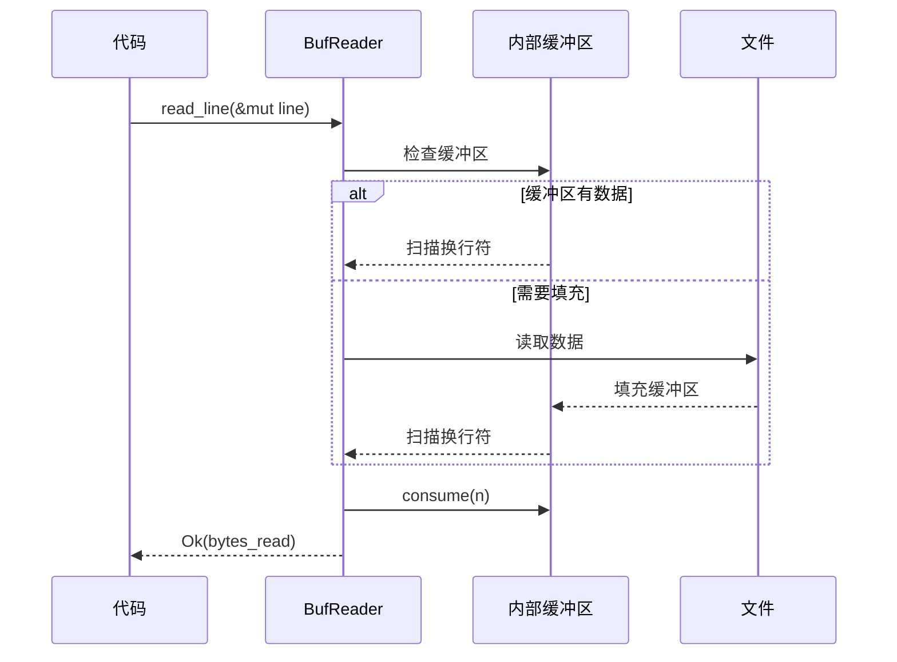
```mermaid
sequenceDiagram
    participant Code as 代码
    participant BR as BufReader
    participant Buffer as 内部缓冲区
    participant File as 文件

    Code->>BR: read_line(&mut line)
    BR->>Buffer: 检查缓冲区

    alt 缓冲区有数据
        Buffer-->>BR: 扫描换行符
    else 需要填充
        BR->>File: 读取数据
        File-->>Buffer: 填充缓冲区
        Buffer-->>BR: 扫描换行符
    end

    BR->>Buffer: consume(n)
    BR-->>Code: Ok(bytes_read)
```

---

## 5. Seek Trait

Seek trait 支持在流中定位。

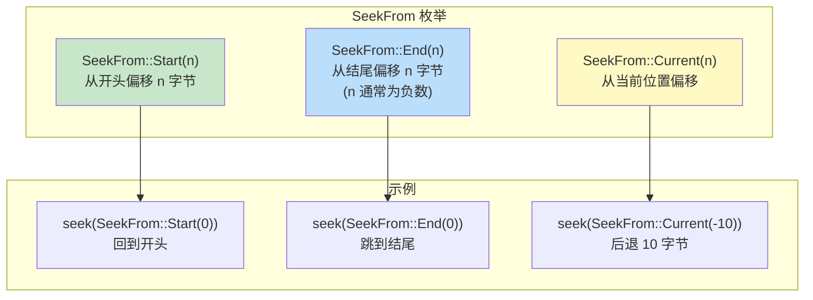
```mermaid
graph TB
    subgraph "SeekFrom 枚举"
        START["SeekFrom::Start(n)<br/>从开头偏移 n 字节"]
        END["SeekFrom::End(n)<br/>从结尾偏移 n 字节<br/>(n 通常为负数)"]
        CURRENT["SeekFrom::Current(n)<br/>从当前位置偏移"]
    end

    subgraph "示例"
        EX1["seek(SeekFrom::Start(0))<br/>回到开头"]
        EX2["seek(SeekFrom::End(0))<br/>跳到结尾"]
        EX3["seek(SeekFrom::Current(-10))<br/>后退 10 字节"]
    end

    START --> EX1
    END --> EX2
    CURRENT --> EX3

    style START fill:#c8e6c9
    style END fill:#bbdefb
    style CURRENT fill:#fff9c4
```

---

## 6. 标准输入输出

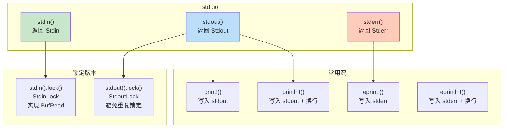
```mermaid
graph TB
    subgraph "std::io"
        STDIN["stdin()<br/>返回 Stdin"]
        STDOUT["stdout()<br/>返回 Stdout"]
        STDERR["stderr()<br/>返回 Stderr"]
    end

    subgraph "锁定版本"
        STDIN_LOCK["stdin().lock()<br/>StdinLock<br/>实现 BufRead"]
        STDOUT_LOCK["stdout().lock()<br/>StdoutLock<br/>避免重复锁定"]
    end

    subgraph "常用宏"
        PRINT["print!()<br/>写入 stdout"]
        PRINTLN["println!()<br/>写入 stdout + 换行"]
        EPRINT["eprint!()<br/>写入 stderr"]
        EPRINTLN["eprintln!()<br/>写入 stderr + 换行"]
    end

    STDIN --> STDIN_LOCK
    STDOUT --> STDOUT_LOCK
    STDOUT --> PRINT
    STDOUT --> PRINTLN
    STDERR --> EPRINT

    style STDIN fill:#c8e6c9
    style STDOUT fill:#bbdefb
    style STDERR fill:#ffccbc
```

### 高效读取 stdin

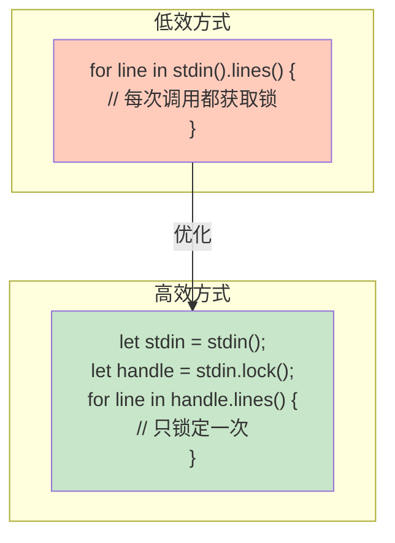
```mermaid
flowchart TD
    subgraph "低效方式"
        SLOW["for line in stdin().lines() {<br/>    // 每次调用都获取锁<br/>}"]
    end

    subgraph "高效方式"
        FAST["let stdin = stdin();<br/>let handle = stdin.lock();<br/>for line in handle.lines() {<br/>    // 只锁定一次<br/>}"]
    end

    SLOW -->|优化| FAST

    style SLOW fill:#ffccbc
    style FAST fill:#c8e6c9
```

---

## 7. 文件系统 (std::fs)

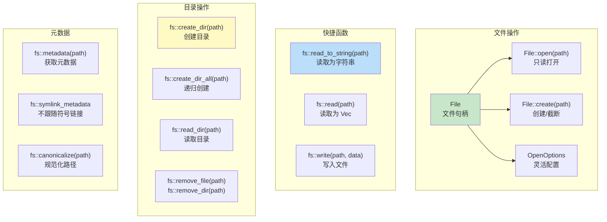
```mermaid
graph TB
    subgraph "文件操作"
        FILE["File<br/>文件句柄"]
        OPEN["File::open(path)<br/>只读打开"]
        CREATE["File::create(path)<br/>创建/截断"]
        OPTIONS["OpenOptions<br/>灵活配置"]
    end

    subgraph "快捷函数"
        READ_STR["fs::read_to_string(path)<br/>读取为字符串"]
        READ_BYTES["fs::read(path)<br/>读取为 Vec<u8>"]
        WRITE["fs::write(path, data)<br/>写入文件"]
    end

    subgraph "目录操作"
        CREATE_DIR["fs::create_dir(path)<br/>创建目录"]
        CREATE_DIR_ALL["fs::create_dir_all(path)<br/>递归创建"]
        READ_DIR["fs::read_dir(path)<br/>读取目录"]
        REMOVE["fs::remove_file(path)<br/>fs::remove_dir(path)"]
    end

    subgraph "元数据"
        METADATA["fs::metadata(path)<br/>获取元数据"]
        SYMLINK["fs::symlink_metadata<br/>不跟随符号链接"]
        CANONICALIZE["fs::canonicalize(path)<br/>规范化路径"]
    end

    FILE --> OPEN
    FILE --> CREATE
    FILE --> OPTIONS

    style FILE fill:#c8e6c9
    style READ_STR fill:#bbdefb
    style CREATE_DIR fill:#fff9c4
```

### OpenOptions 配置

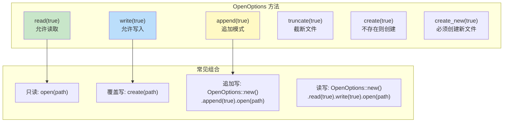
```mermaid
graph TB
    subgraph "OpenOptions 方法"
        OPT_READ["read(true)<br/>允许读取"]
        OPT_WRITE["write(true)<br/>允许写入"]
        OPT_APPEND["append(true)<br/>追加模式"]
        OPT_TRUNCATE["truncate(true)<br/>截断文件"]
        OPT_CREATE["create(true)<br/>不存在则创建"]
        OPT_CREATE_NEW["create_new(true)<br/>必须创建新文件"]
    end

    subgraph "常见组合"
        COMBO1["只读: open(path)"]
        COMBO2["覆盖写: create(path)"]
        COMBO3["追加写: OpenOptions::new()<br/>.append(true).open(path)"]
        COMBO4["读写: OpenOptions::new()<br/>.read(true).write(true).open(path)"]
    end

    OPT_READ --> COMBO1
    OPT_WRITE --> COMBO2
    OPT_APPEND --> COMBO3

    style OPT_READ fill:#c8e6c9
    style OPT_WRITE fill:#bbdefb
    style OPT_APPEND fill:#fff9c4
```

---

## 8. 路径 (std::path)

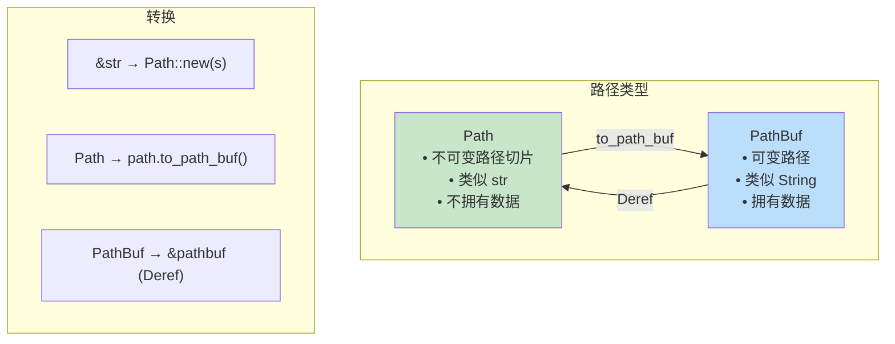
```mermaid
graph TB
    subgraph "路径类型"
        PATH["Path<br/>• 不可变路径切片<br/>• 类似 str<br/>• 不拥有数据"]
        PATHBUF["PathBuf<br/>• 可变路径<br/>• 类似 String<br/>• 拥有数据"]
    end

    subgraph "转换"
        STR_PATH["&str → Path::new(s)"]
        PATH_PATHBUF["Path → path.to_path_buf()"]
        PATHBUF_PATH["PathBuf → &pathbuf (Deref)"]
    end

    PATH -->|to_path_buf| PATHBUF
    PATHBUF -->|Deref| PATH

    style PATH fill:#c8e6c9
    style PATHBUF fill:#bbdefb
```

### Path 方法

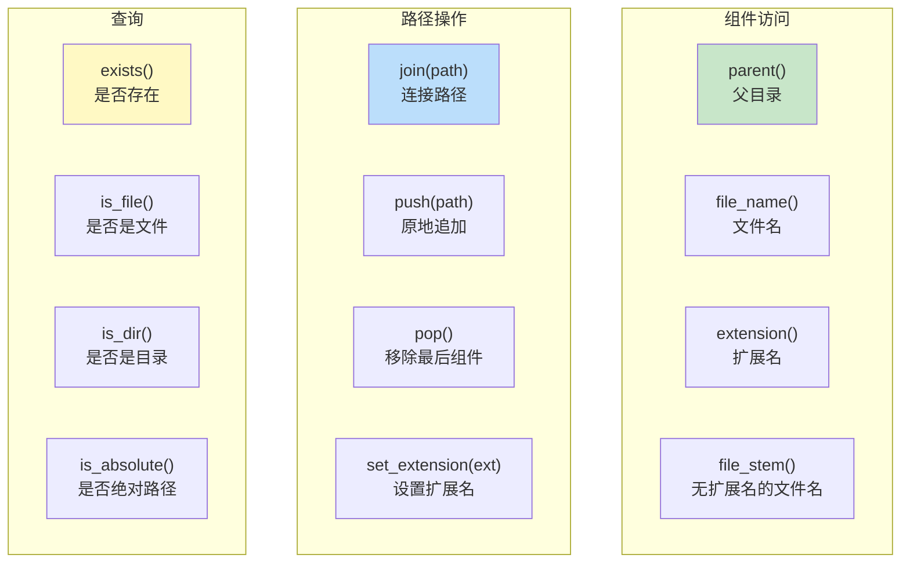
```mermaid
graph TB
    subgraph "组件访问"
        PARENT["parent()<br/>父目录"]
        FILE_NAME["file_name()<br/>文件名"]
        EXTENSION["extension()<br/>扩展名"]
        STEM["file_stem()<br/>无扩展名的文件名"]
    end

    subgraph "路径操作"
        JOIN["join(path)<br/>连接路径"]
        PUSH["push(path)<br/>原地追加"]
        POP["pop()<br/>移除最后组件"]
        SET_EXT["set_extension(ext)<br/>设置扩展名"]
    end

    subgraph "查询"
        EXISTS["exists()<br/>是否存在"]
        IS_FILE["is_file()<br/>是否是文件"]
        IS_DIR["is_dir()<br/>是否是目录"]
        IS_ABSOLUTE["is_absolute()<br/>是否绝对路径"]
    end

    style PARENT fill:#c8e6c9
    style JOIN fill:#bbdefb
    style EXISTS fill:#fff9c4
```

---

## 9. 网络 (std::net)

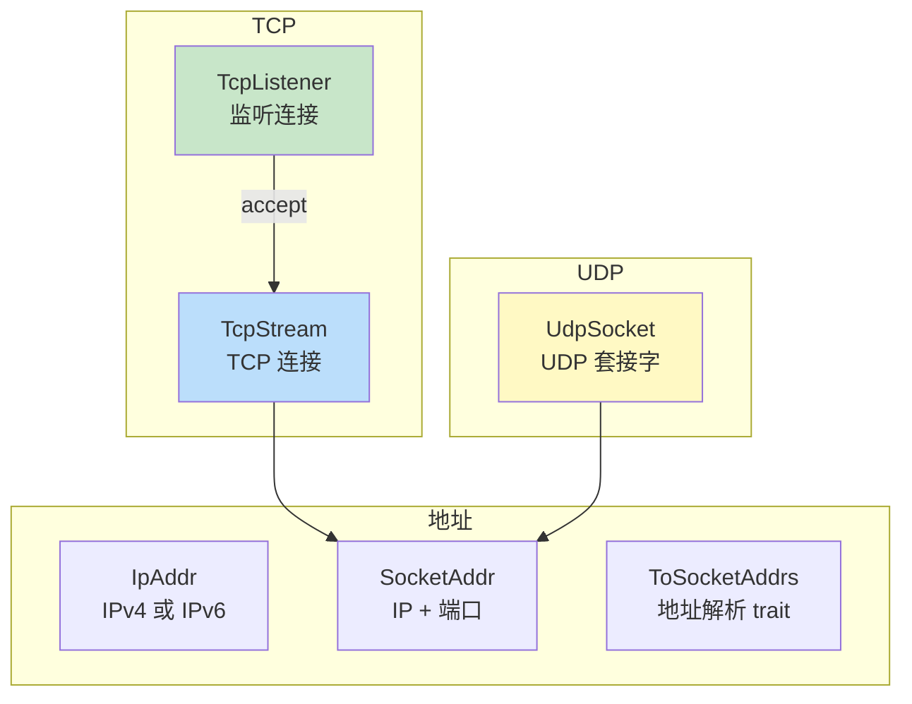
```mermaid
graph TB
    subgraph "TCP"
        LISTENER["TcpListener<br/>监听连接"]
        STREAM["TcpStream<br/>TCP 连接"]
    end

    subgraph "UDP"
        SOCKET["UdpSocket<br/>UDP 套接字"]
    end

    subgraph "地址"
        IPADDR["IpAddr<br/>IPv4 或 IPv6"]
        SOCKETADDR["SocketAddr<br/>IP + 端口"]
        TOADDR["ToSocketAddrs<br/>地址解析 trait"]
    end

    LISTENER -->|accept| STREAM
    STREAM --> SOCKETADDR
    SOCKET --> SOCKETADDR

    style LISTENER fill:#c8e6c9
    style STREAM fill:#bbdefb
    style SOCKET fill:#fff9c4
```

### TCP 服务器

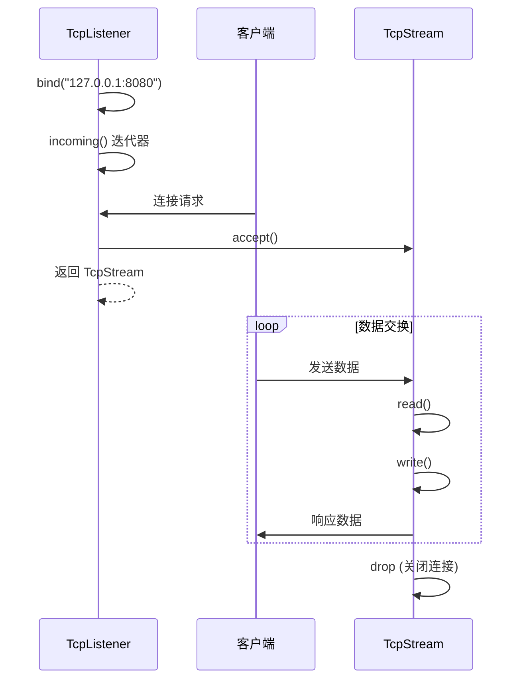
```mermaid
sequenceDiagram
    participant Server as TcpListener
    participant Client as 客户端
    participant Stream as TcpStream

    Server->>Server: bind("127.0.0.1:8080")
    Server->>Server: incoming() 迭代器

    Client->>Server: 连接请求
    Server->>Stream: accept()
    Server-->>Server: 返回 TcpStream

    loop 数据交换
        Client->>Stream: 发送数据
        Stream->>Stream: read()
        Stream->>Stream: write()
        Stream->>Client: 响应数据
    end

    Stream->>Stream: drop (关闭连接)
```

### TCP 客户端

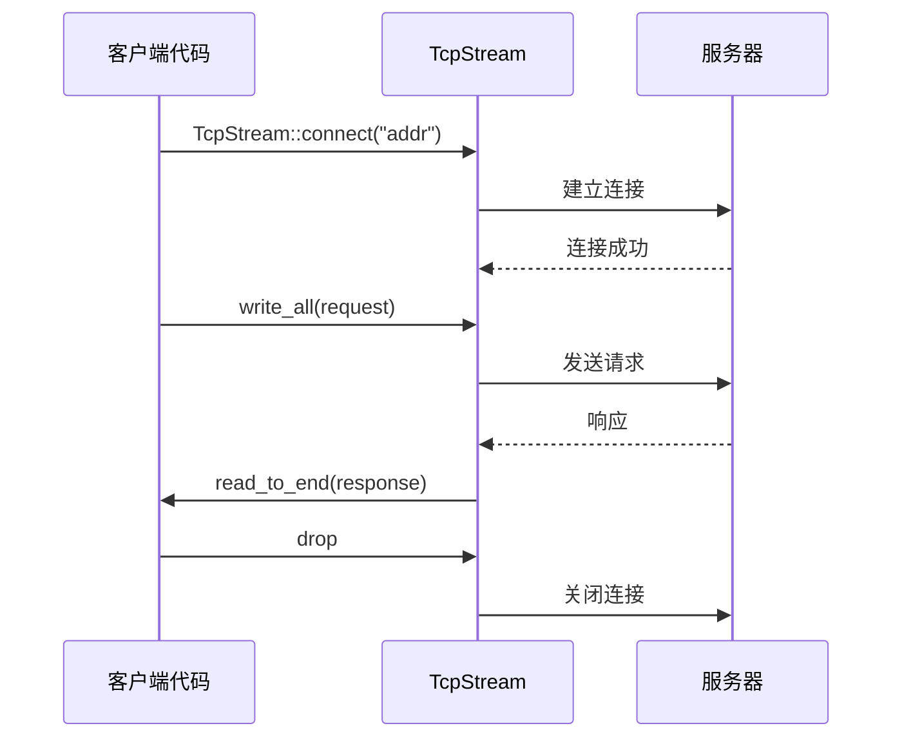
```mermaid
sequenceDiagram
    participant Client as 客户端代码
    participant Stream as TcpStream
    participant Server as 服务器

    Client->>Stream: TcpStream::connect("addr")
    Stream->>Server: 建立连接
    Server-->>Stream: 连接成功

    Client->>Stream: write_all(request)
    Stream->>Server: 发送请求
    Server-->>Stream: 响应
    Stream->>Client: read_to_end(response)

    Client->>Stream: drop
    Stream->>Server: 关闭连接
```

---

## 10. 错误处理

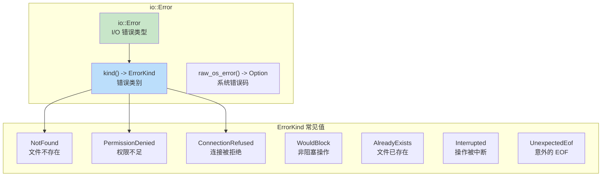
```mermaid
graph TB
    subgraph "io::Error"
        ERROR["io::Error<br/>I/O 错误类型"]
        KIND["kind() -> ErrorKind<br/>错误类别"]
        RAW["raw_os_error() -> Option<i32><br/>系统错误码"]
    end

    subgraph "ErrorKind 常见值"
        NOT_FOUND["NotFound<br/>文件不存在"]
        PERM["PermissionDenied<br/>权限不足"]
        CONN_REFUSED["ConnectionRefused<br/>连接被拒绝"]
        WOULD_BLOCK["WouldBlock<br/>非阻塞操作"]
        ALREADY_EXISTS["AlreadyExists<br/>文件已存在"]
        INTERRUPTED["Interrupted<br/>操作被中断"]
        EOF["UnexpectedEof<br/>意外的 EOF"]
    end

    ERROR --> KIND
    KIND --> NOT_FOUND
    KIND --> PERM
    KIND --> CONN_REFUSED

    style ERROR fill:#c8e6c9
    style KIND fill:#bbdefb
```

### 错误处理模式

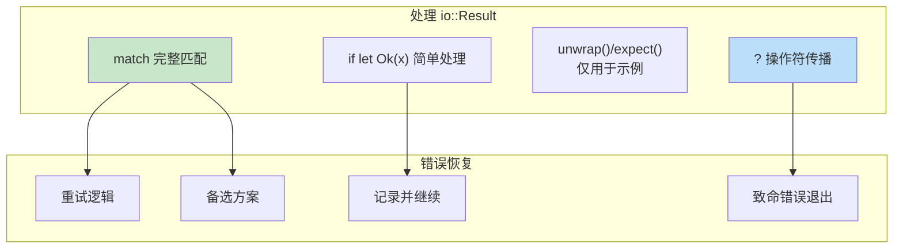
```mermaid
flowchart TD
    subgraph "处理 io::Result"
        MATCH["match 完整匹配"]
        QUESTION["? 操作符传播"]
        UNWRAP["unwrap()/expect()<br/>仅用于示例"]
        IF_LET["if let Ok(x) 简单处理"]
    end

    subgraph "错误恢复"
        RETRY["重试逻辑"]
        FALLBACK["备选方案"]
        LOG["记录并继续"]
        PANIC["致命错误退出"]
    end

    MATCH --> RETRY
    MATCH --> FALLBACK
    QUESTION --> PANIC
    IF_LET --> LOG

    style MATCH fill:#c8e6c9
    style QUESTION fill:#bbdefb
```

---

## 11. 缓冲策略

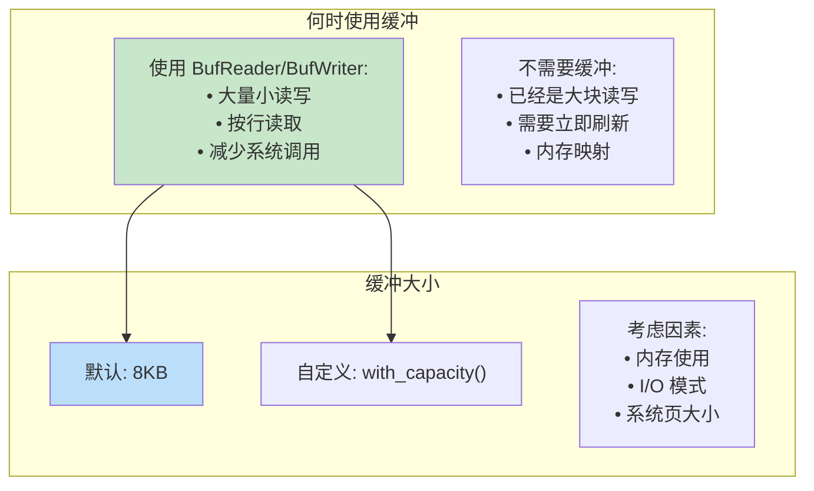
```mermaid
graph TB
    subgraph "何时使用缓冲"
        USE_BUF["使用 BufReader/BufWriter:<br/>• 大量小读写<br/>• 按行读取<br/>• 减少系统调用"]
        NO_BUF["不需要缓冲:<br/>• 已经是大块读写<br/>• 需要立即刷新<br/>• 内存映射"]
    end

    subgraph "缓冲大小"
        DEFAULT["默认: 8KB"]
        CUSTOM["自定义: with_capacity()"]
        CONSIDER["考虑因素:<br/>• 内存使用<br/>• I/O 模式<br/>• 系统页大小"]
    end

    USE_BUF --> DEFAULT
    USE_BUF --> CUSTOM

    style USE_BUF fill:#c8e6c9
    style DEFAULT fill:#bbdefb
```

---

## 12. I/O 最佳实践

```mermaid
mindmap
    root((I/O 最佳实践))
        性能
            使用缓冲 I/O
            避免频繁小读写
            预分配缓冲区
        错误处理
            检查所有 Result
            区分可恢复错误
            提供上下文信息
        资源管理
            使用 RAII
            及时 flush
            注意文件描述符限制
        可移植性
            使用 Path 而非字符串
            注意行尾差异
            处理编码问题
```

| 场景 | 推荐做法 |
|------|----------|
| 读取整个小文件 | `fs::read_to_string()` |
| 大文件按行处理 | `BufReader::new(file).lines()` |
| 写入大量数据 | `BufWriter::new(file)` |
| 日志写入 | `LineWriter::new(file)` |
| 二进制文件 | `fs::read()` / `fs::write()` |
| 网络 I/O | 带超时的异步 I/O |
