# Rust 迭代器详解

## 1. 迭代器概览

迭代器是 Rust 处理序列数据的核心抽象，提供惰性求值和零成本抽象。

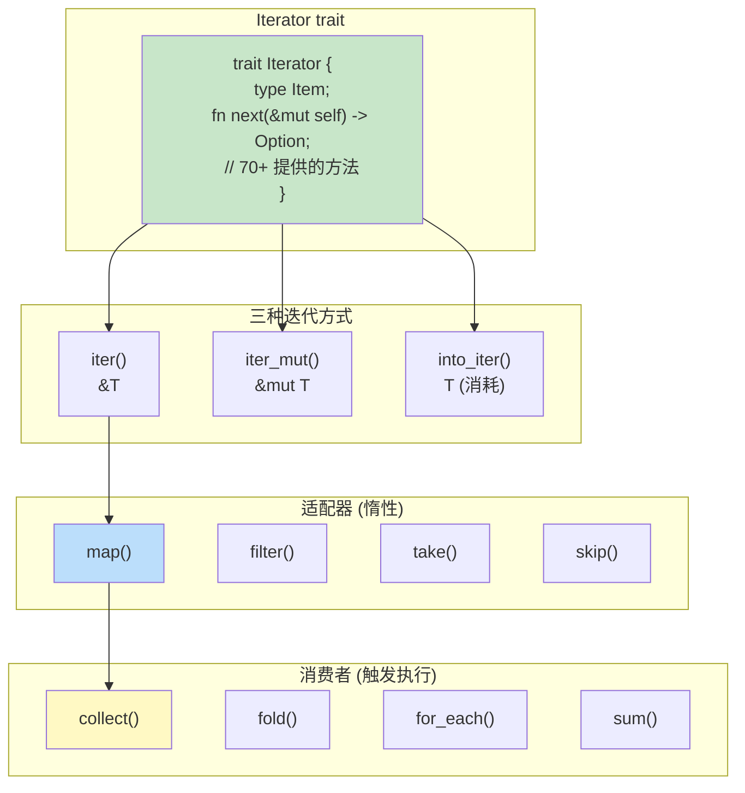
```mermaid
graph TB
    subgraph "Iterator trait"
        TRAIT["trait Iterator {<br/>    type Item;<br/>    fn next(&mut self) -> Option<Self::Item>;<br/>    // 70+ 提供的方法<br/>}"]
    end

    subgraph "三种迭代方式"
        ITER["iter()<br/>&T"]
        ITER_MUT["iter_mut()<br/>&mut T"]
        INTO_ITER["into_iter()<br/>T (消耗)"]
    end

    subgraph "适配器 (惰性)"
        MAP["map()"]
        FILTER["filter()"]
        TAKE["take()"]
        SKIP["skip()"]
    end

    subgraph "消费者 (触发执行)"
        COLLECT["collect()"]
        FOLD["fold()"]
        FOR_EACH["for_each()"]
        SUM["sum()"]
    end

    TRAIT --> ITER
    TRAIT --> ITER_MUT
    TRAIT --> INTO_ITER

    ITER --> MAP
    MAP --> COLLECT

    style TRAIT fill:#c8e6c9
    style MAP fill:#bbdefb
    style COLLECT fill:#fff9c4
```

---

## 2. Iterator Trait

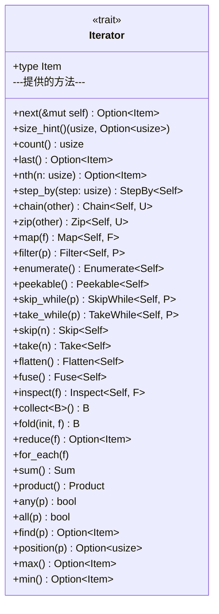
```mermaid
classDiagram
    class Iterator {
        <<trait>>
        +type Item
        +next(&mut self) Option~Item~
        ---提供的方法---
        +size_hint() (usize, Option~usize~)
        +count() usize
        +last() Option~Item~
        +nth(n: usize) Option~Item~
        +step_by(step: usize) StepBy~Self~
        +chain(other) Chain~Self, U~
        +zip(other) Zip~Self, U~
        +map(f) Map~Self, F~
        +filter(p) Filter~Self, P~
        +enumerate() Enumerate~Self~
        +peekable() Peekable~Self~
        +skip_while(p) SkipWhile~Self, P~
        +take_while(p) TakeWhile~Self, P~
        +skip(n) Skip~Self~
        +take(n) Take~Self~
        +flatten() Flatten~Self~
        +fuse() Fuse~Self~
        +inspect(f) Inspect~Self, F~
        +collect~B~() B
        +fold(init, f) B
        +reduce(f) Option~Item~
        +for_each(f)
        +sum() Sum
        +product() Product
        +any(p) bool
        +all(p) bool
        +find(p) Option~Item~
        +position(p) Option~usize~
        +max() Option~Item~
        +min() Option~Item~
    }
```

---

## 3. 创建迭代器

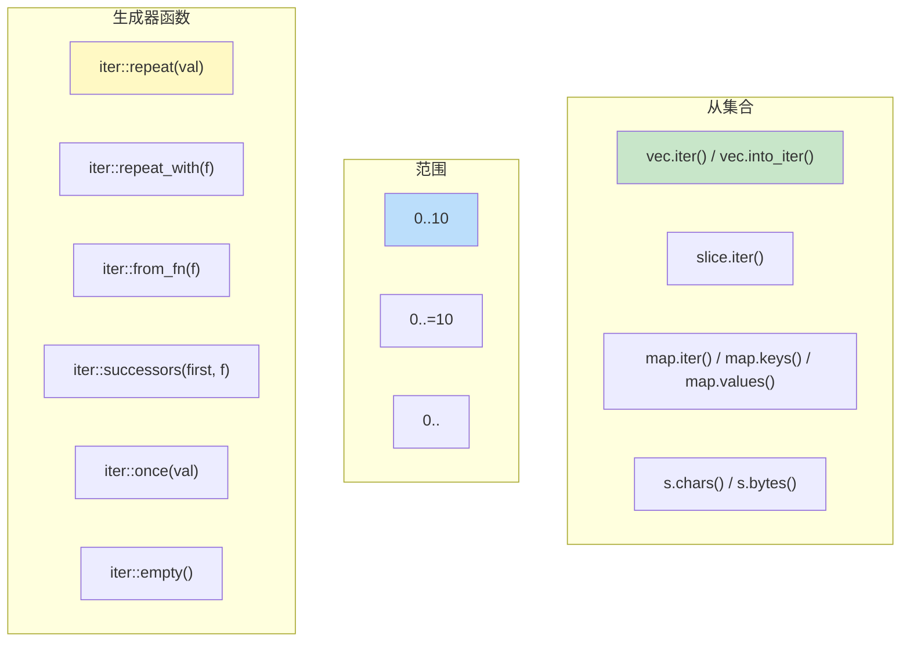
```mermaid
graph TB
    subgraph "从集合"
        VEC["vec.iter() / vec.into_iter()"]
        SLICE["slice.iter()"]
        HASHMAP["map.iter() / map.keys() / map.values()"]
        STRING["s.chars() / s.bytes()"]
    end

    subgraph "范围"
        RANGE["0..10"]
        RANGE_INC["0..=10"]
        RANGE_FROM["0.."]
    end

    subgraph "生成器函数"
        REPEAT["iter::repeat(val)"]
        REPEAT_WITH["iter::repeat_with(f)"]
        FROM_FN["iter::from_fn(f)"]
        SUCCESSORS["iter::successors(first, f)"]
        ONCE["iter::once(val)"]
        EMPTY["iter::empty()"]
    end

    style VEC fill:#c8e6c9
    style RANGE fill:#bbdefb
    style REPEAT fill:#fff9c4
```

### 示例

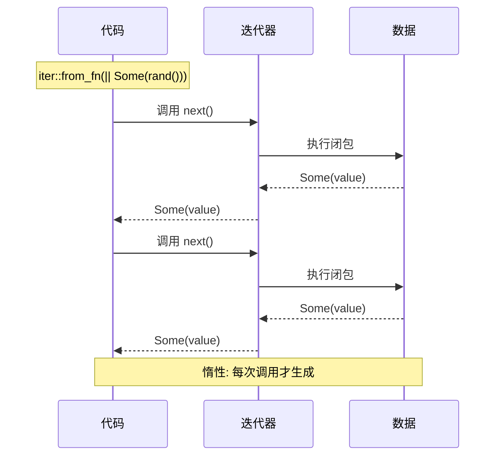
```mermaid
sequenceDiagram
    participant Code as 代码
    participant Iter as 迭代器
    participant Data as 数据

    Note over Code: iter::from_fn(|| Some(rand()))
    Code->>Iter: 调用 next()
    Iter->>Data: 执行闭包
    Data-->>Iter: Some(value)
    Iter-->>Code: Some(value)

    Code->>Iter: 调用 next()
    Iter->>Data: 执行闭包
    Data-->>Iter: Some(value)
    Iter-->>Code: Some(value)

    Note over Code,Data: 惰性: 每次调用才生成
```

---

## 4. 适配器方法

适配器是惰性的，返回新的迭代器。

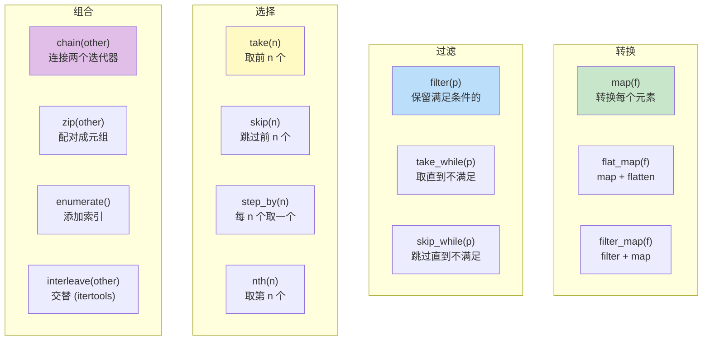
```mermaid
graph TB
    subgraph "转换"
        MAP["map(f)<br/>转换每个元素"]
        FLAT_MAP["flat_map(f)<br/>map + flatten"]
        FILTER_MAP["filter_map(f)<br/>filter + map"]
    end

    subgraph "过滤"
        FILTER["filter(p)<br/>保留满足条件的"]
        TAKE_WHILE["take_while(p)<br/>取直到不满足"]
        SKIP_WHILE["skip_while(p)<br/>跳过直到不满足"]
    end

    subgraph "选择"
        TAKE["take(n)<br/>取前 n 个"]
        SKIP["skip(n)<br/>跳过前 n 个"]
        STEP_BY["step_by(n)<br/>每 n 个取一个"]
        NTH["nth(n)<br/>取第 n 个"]
    end

    subgraph "组合"
        CHAIN["chain(other)<br/>连接两个迭代器"]
        ZIP["zip(other)<br/>配对成元组"]
        ENUMERATE["enumerate()<br/>添加索引"]
        INTERLEAVE["interleave(other)<br/>交替 (itertools)"]
    end

    style MAP fill:#c8e6c9
    style FILTER fill:#bbdefb
    style TAKE fill:#fff9c4
    style CHAIN fill:#e1bee7
```

### 适配器流水线

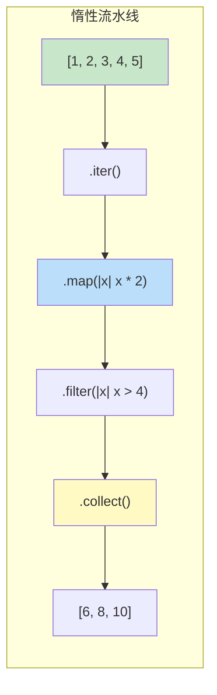
```mermaid
flowchart LR
    subgraph "惰性流水线"
        INPUT["[1, 2, 3, 4, 5]"]
        ITER[".iter()"]
        MAP[".map(|x| x * 2)"]
        FILTER[".filter(|x| x > 4)"]
        COLLECT[".collect()"]
        OUTPUT["[6, 8, 10]"]
    end

    INPUT --> ITER --> MAP --> FILTER --> COLLECT --> OUTPUT

    style INPUT fill:#c8e6c9
    style MAP fill:#bbdefb
    style COLLECT fill:#fff9c4
```

---

## 5. 消费方法

消费方法触发迭代器执行。

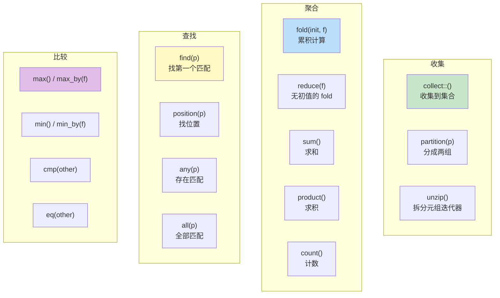
```mermaid
graph TB
    subgraph "收集"
        COLLECT["collect::<T>()<br/>收集到集合"]
        PARTITION["partition(p)<br/>分成两组"]
        UNZIP["unzip()<br/>拆分元组迭代器"]
    end

    subgraph "聚合"
        FOLD["fold(init, f)<br/>累积计算"]
        REDUCE["reduce(f)<br/>无初值的 fold"]
        SUM["sum()<br/>求和"]
        PRODUCT["product()<br/>求积"]
        COUNT["count()<br/>计数"]
    end

    subgraph "查找"
        FIND["find(p)<br/>找第一个匹配"]
        POSITION["position(p)<br/>找位置"]
        ANY["any(p)<br/>存在匹配"]
        ALL["all(p)<br/>全部匹配"]
    end

    subgraph "比较"
        MAX["max() / max_by(f)"]
        MIN["min() / min_by(f)"]
        CMP["cmp(other)"]
        EQ["eq(other)"]
    end

    style COLLECT fill:#c8e6c9
    style FOLD fill:#bbdefb
    style FIND fill:#fff9c4
    style MAX fill:#e1bee7
```

### fold 工作原理

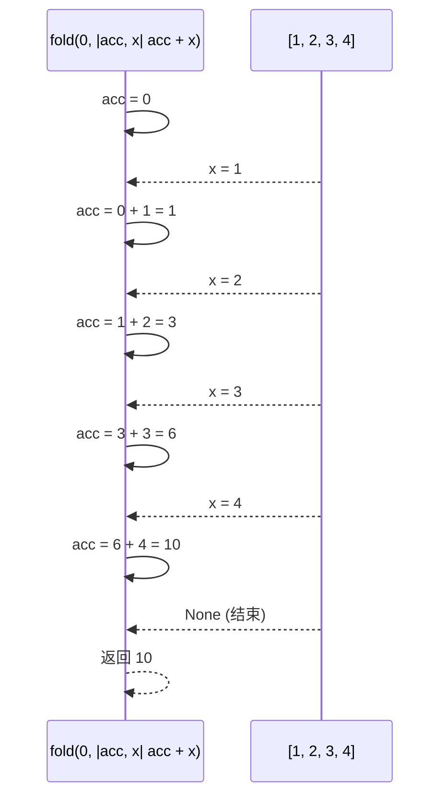
```mermaid
sequenceDiagram
    participant Code as fold(0, |acc, x| acc + x)
    participant Iter as [1, 2, 3, 4]

    Code->>Code: acc = 0
    Iter-->>Code: x = 1
    Code->>Code: acc = 0 + 1 = 1
    Iter-->>Code: x = 2
    Code->>Code: acc = 1 + 2 = 3
    Iter-->>Code: x = 3
    Code->>Code: acc = 3 + 3 = 6
    Iter-->>Code: x = 4
    Code->>Code: acc = 6 + 4 = 10
    Iter-->>Code: None (结束)
    Code-->>Code: 返回 10
```

---

## 6. IntoIterator Trait

IntoIterator 使类型可以用于 `for` 循环。

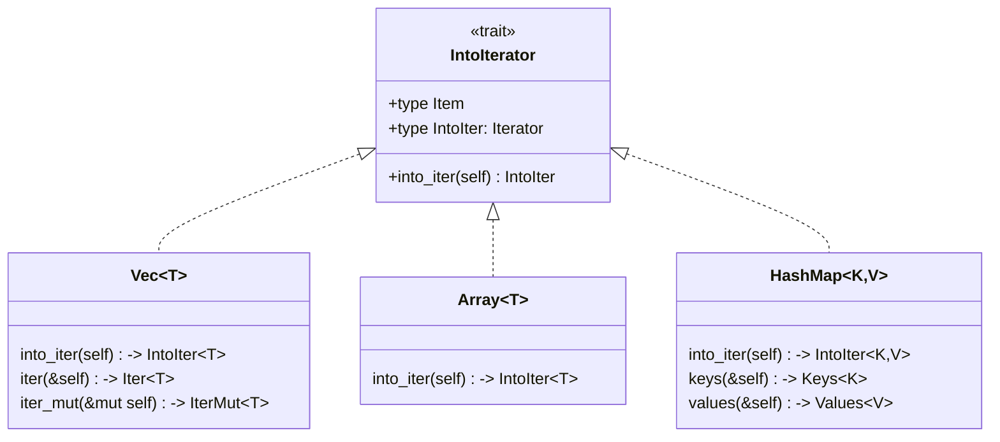
```mermaid
classDiagram
    class IntoIterator {
        <<trait>>
        +type Item
        +type IntoIter: Iterator
        +into_iter(self) IntoIter
    }

    class Vec~T~ {
        into_iter(self) -> IntoIter~T~
        iter(&self) -> Iter~T~
        iter_mut(&mut self) -> IterMut~T~
    }

    class Array~T~ {
        into_iter(self) -> IntoIter~T~
    }

    class HashMap~K,V~ {
        into_iter(self) -> IntoIter~K,V~
        keys(&self) -> Keys~K~
        values(&self) -> Values~V~
    }

    IntoIterator <|.. Vec~T~
    IntoIterator <|.. Array~T~
    IntoIterator <|.. HashMap~K,V~
```

### for 循环展开

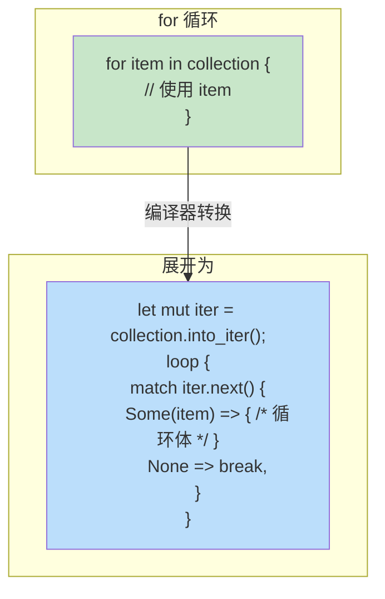
```mermaid
graph TB
    subgraph "for 循环"
        FOR["for item in collection {<br/>    // 使用 item<br/>}"]
    end

    subgraph "展开为"
        EXPAND["let mut iter = collection.into_iter();<br/>loop {<br/>    match iter.next() {<br/>        Some(item) => { /* 循环体 */ }<br/>        None => break,<br/>    }<br/>}"]
    end

    FOR -->|编译器转换| EXPAND

    style FOR fill:#c8e6c9
    style EXPAND fill:#bbdefb
```

---

## 7. FromIterator Trait

FromIterator 使迭代器可以收集成特定类型。

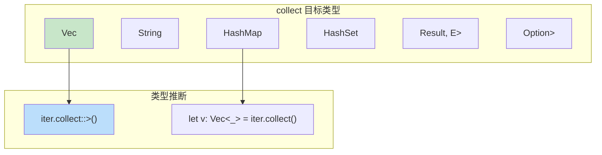
```mermaid
graph TB
    subgraph "collect 目标类型"
        VEC["Vec<T>"]
        STRING["String"]
        HASHMAP["HashMap<K,V>"]
        HASHSET["HashSet<T>"]
        RESULT["Result<Vec<T>, E>"]
        OPTION["Option<Vec<T>>"]
    end

    subgraph "类型推断"
        TURBO["iter.collect::<Vec<_>>()"]
        ANNOTATE["let v: Vec<_> = iter.collect()"]
    end

    VEC --> TURBO
    HASHMAP --> ANNOTATE

    style VEC fill:#c8e6c9
    style TURBO fill:#bbdefb
```

### 特殊收集

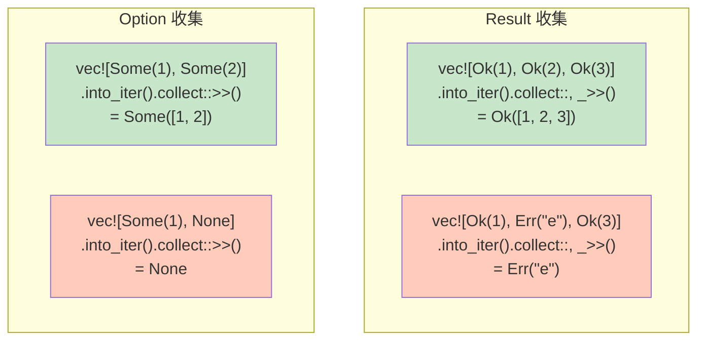
```mermaid
graph TB
    subgraph "Result 收集"
        RES_OK["vec![Ok(1), Ok(2), Ok(3)]<br/>.into_iter().collect::<Result<Vec<_>, _>>()<br/>= Ok([1, 2, 3])"]
        RES_ERR["vec![Ok(1), Err(&quot;e&quot;), Ok(3)]<br/>.into_iter().collect::<Result<Vec<_>, _>>()<br/>= Err(&quot;e&quot;)"]
    end

    subgraph "Option 收集"
        OPT_SOME["vec![Some(1), Some(2)]<br/>.into_iter().collect::<Option<Vec<_>>>()<br/>= Some([1, 2])"]
        OPT_NONE["vec![Some(1), None]<br/>.into_iter().collect::<Option<Vec<_>>>()<br/>= None"]
    end

    style RES_OK fill:#c8e6c9
    style RES_ERR fill:#ffccbc
    style OPT_SOME fill:#c8e6c9
    style OPT_NONE fill:#ffccbc
```

---

## 8. 双向迭代器

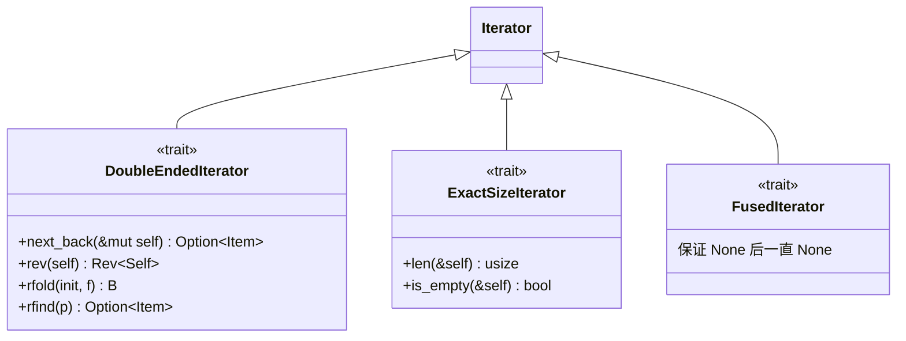
```mermaid
classDiagram
    class DoubleEndedIterator {
        <<trait>>
        +next_back(&mut self) Option~Item~
        +rev(self) Rev~Self~
        +rfold(init, f) B
        +rfind(p) Option~Item~
    }

    class ExactSizeIterator {
        <<trait>>
        +len(&self) usize
        +is_empty(&self) bool
    }

    class FusedIterator {
        <<trait>>
        保证 None 后一直 None
    }

    Iterator <|-- DoubleEndedIterator
    Iterator <|-- ExactSizeIterator
    Iterator <|-- FusedIterator
```

### 双端迭代

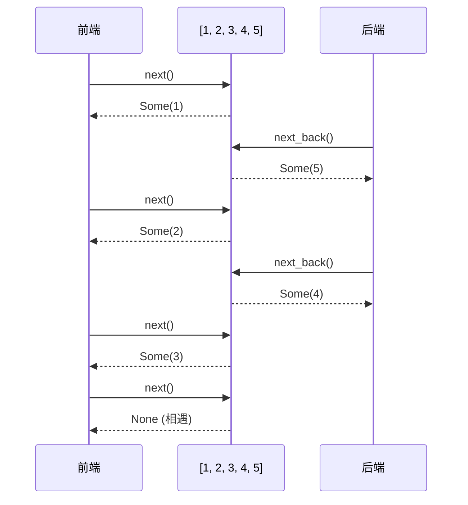
```mermaid
sequenceDiagram
    participant Front as 前端
    participant Iter as [1, 2, 3, 4, 5]
    participant Back as 后端

    Front->>Iter: next()
    Iter-->>Front: Some(1)

    Back->>Iter: next_back()
    Iter-->>Back: Some(5)

    Front->>Iter: next()
    Iter-->>Front: Some(2)

    Back->>Iter: next_back()
    Iter-->>Back: Some(4)

    Front->>Iter: next()
    Iter-->>Front: Some(3)

    Front->>Iter: next()
    Iter-->>Front: None (相遇)
```

---

## 9. 性能与零成本抽象

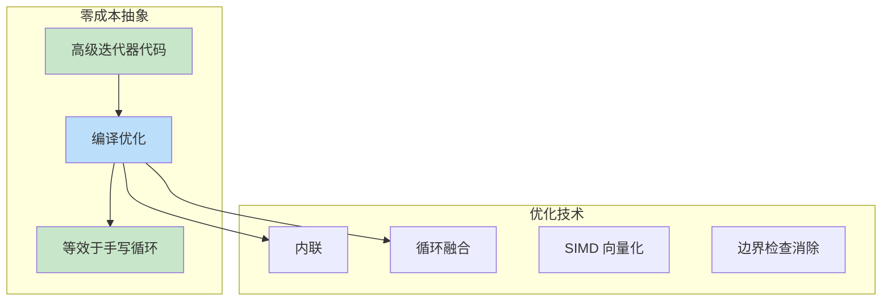
```mermaid
graph TB
    subgraph "零成本抽象"
        HIGH["高级迭代器代码"]
        COMPILE["编译优化"]
        LOW["等效于手写循环"]
    end

    subgraph "优化技术"
        INLINE["内联"]
        FUSION["循环融合"]
        VECTORIZE["SIMD 向量化"]
        ELIM["边界检查消除"]
    end

    HIGH --> COMPILE
    COMPILE --> LOW

    COMPILE --> INLINE
    COMPILE --> FUSION

    style HIGH fill:#c8e6c9
    style LOW fill:#c8e6c9
    style COMPILE fill:#bbdefb
```

### 惰性求值优势

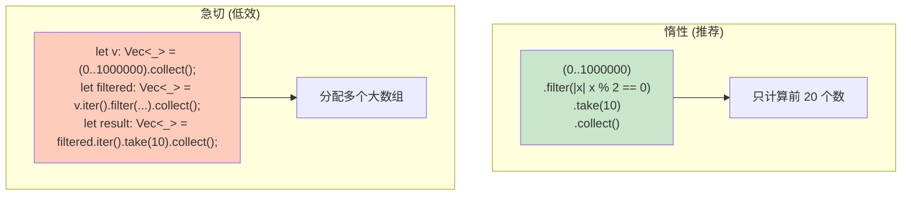
```mermaid
graph TB
    subgraph "惰性 (推荐)"
        LAZY["(0..1000000)<br/>.filter(|x| x % 2 == 0)<br/>.take(10)<br/>.collect()"]
        LAZY_PERF["只计算前 20 个数"]
    end

    subgraph "急切 (低效)"
        EAGER["let v: Vec<_> = (0..1000000).collect();<br/>let filtered: Vec<_> = v.iter().filter(...).collect();<br/>let result: Vec<_> = filtered.iter().take(10).collect();"]
        EAGER_PERF["分配多个大数组"]
    end

    LAZY --> LAZY_PERF
    EAGER --> EAGER_PERF

    style LAZY fill:#c8e6c9
    style EAGER fill:#ffccbc
```

---

## 10. 常用模式

### 并行迭代 (需要 rayon)

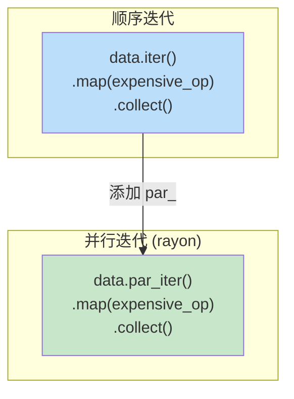
```mermaid
graph TB
    subgraph "顺序迭代"
        SEQ["data.iter()<br/>.map(expensive_op)<br/>.collect()"]
    end

    subgraph "并行迭代 (rayon)"
        PAR["data.par_iter()<br/>.map(expensive_op)<br/>.collect()"]
    end

    SEQ -->|添加 par_| PAR

    style SEQ fill:#bbdefb
    style PAR fill:#c8e6c9
```

### 窗口与块

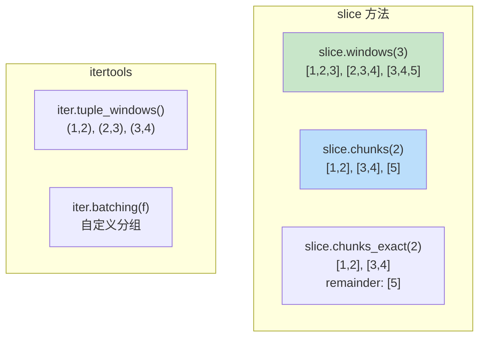
```mermaid
graph TB
    subgraph "slice 方法"
        WINDOWS["slice.windows(3)<br/>[1,2,3], [2,3,4], [3,4,5]"]
        CHUNKS["slice.chunks(2)<br/>[1,2], [3,4], [5]"]
        CHUNKS_EXACT["slice.chunks_exact(2)<br/>[1,2], [3,4]<br/>remainder: [5]"]
    end

    subgraph "itertools"
        TUPLE_WINDOWS["iter.tuple_windows()<br/>(1,2), (2,3), (3,4)"]
        BATCHING["iter.batching(f)<br/>自定义分组"]
    end

    style WINDOWS fill:#c8e6c9
    style CHUNKS fill:#bbdefb
```

---

## 11. 迭代器选择指南

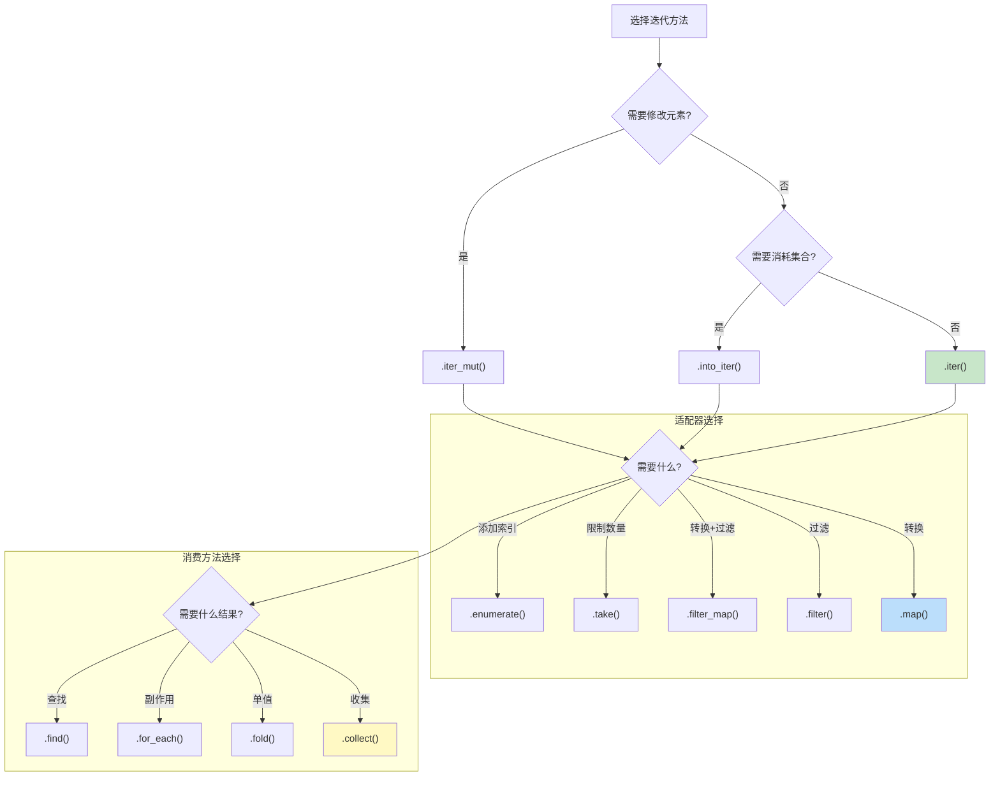
```mermaid
flowchart TD
    START[选择迭代方法] --> Q1{需要修改元素?}

    Q1 -->|否| Q2{需要消耗集合?}
    Q1 -->|是| ITER_MUT[".iter_mut()"]

    Q2 -->|否| ITER[".iter()"]
    Q2 -->|是| INTO_ITER[".into_iter()"]

    subgraph "适配器选择"
        TRANSFORM{需要什么?}
        TRANSFORM -->|转换| MAP[".map()"]
        TRANSFORM -->|过滤| FILTER[".filter()"]
        TRANSFORM -->|转换+过滤| FILTER_MAP[".filter_map()"]
        TRANSFORM -->|限制数量| TAKE[".take()"]
        TRANSFORM -->|添加索引| ENUMERATE[".enumerate()"]
    end

    subgraph "消费方法选择"
        CONSUME{需要什么结果?}
        CONSUME -->|收集| COLLECT[".collect()"]
        CONSUME -->|单值| FOLD[".fold()"]
        CONSUME -->|副作用| FOR_EACH[".for_each()"]
        CONSUME -->|查找| FIND[".find()"]
    end

    ITER --> TRANSFORM
    ITER_MUT --> TRANSFORM
    INTO_ITER --> TRANSFORM
    TRANSFORM --> CONSUME

    style ITER fill:#c8e6c9
    style MAP fill:#bbdefb
    style COLLECT fill:#fff9c4
```

### 性能提示

| 场景 | 推荐 | 原因 |
|------|------|------|
| 只需遍历 | `for x in &v` | 最清晰 |
| 需要索引 | `.enumerate()` | 比手动计数更安全 |
| 查找元素 | `.find()` | 短路求值 |
| 检查条件 | `.any()` / `.all()` | 短路求值 |
| 累积结果 | `.fold()` | 通用性强 |
| 求和/积 | `.sum()` / `.product()` | 更清晰 |
| 收集 Vec | `.collect()` | 自动类型推断 |
