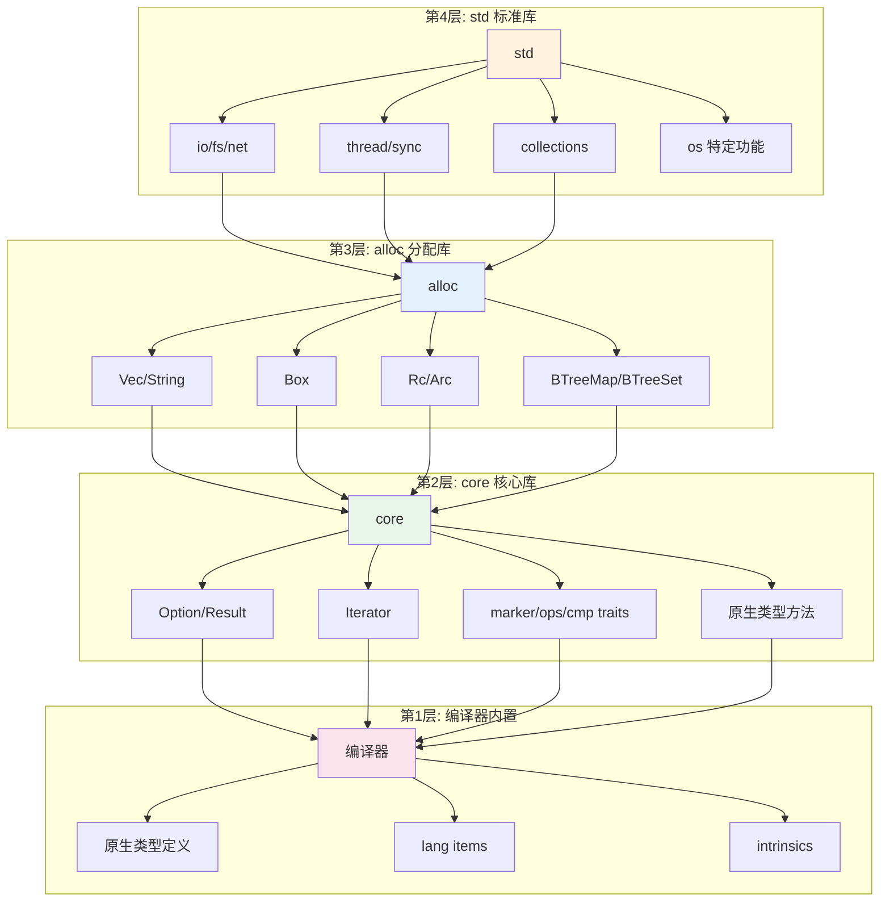
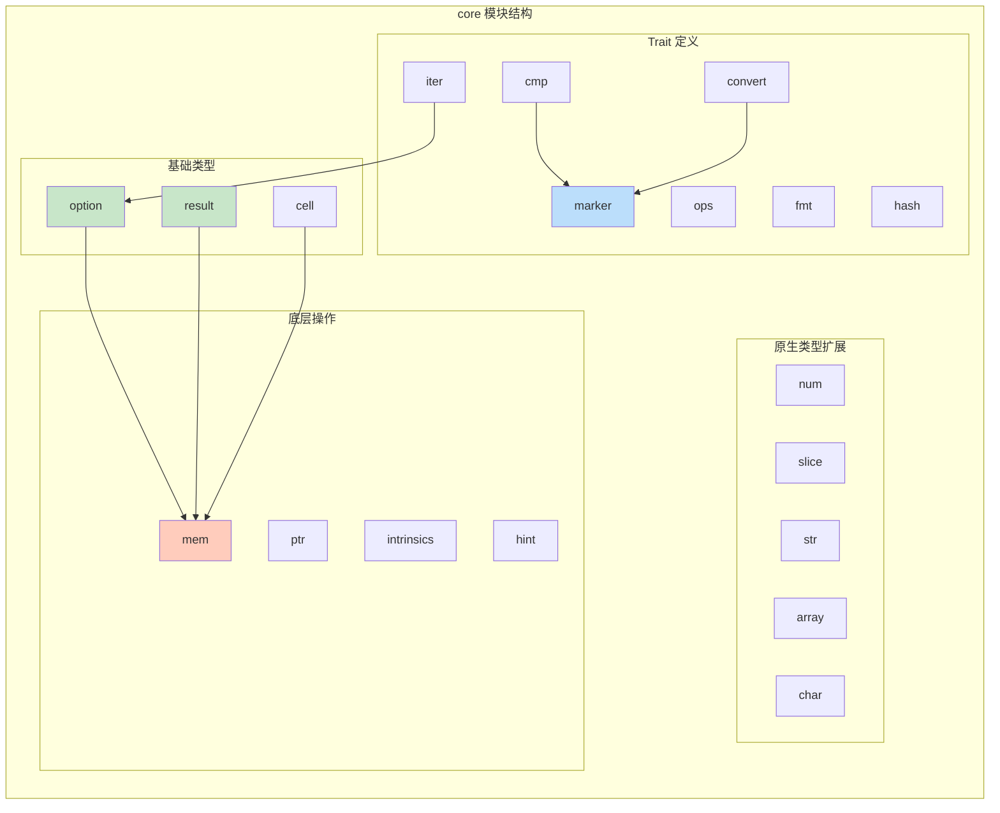
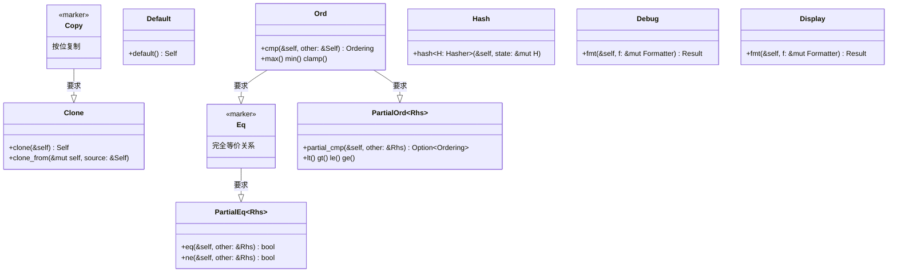
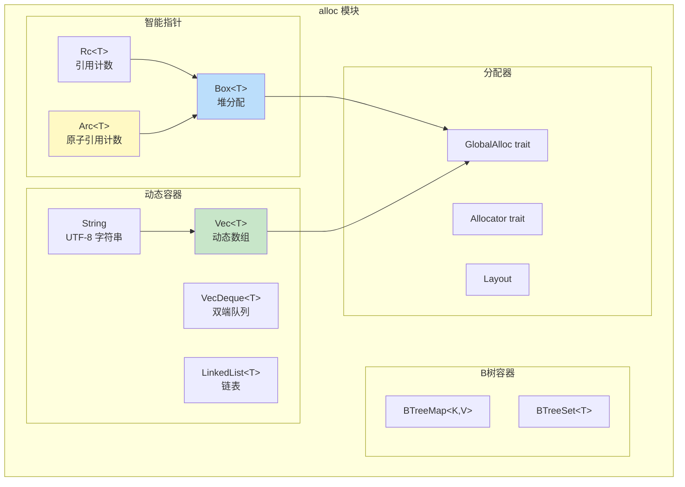
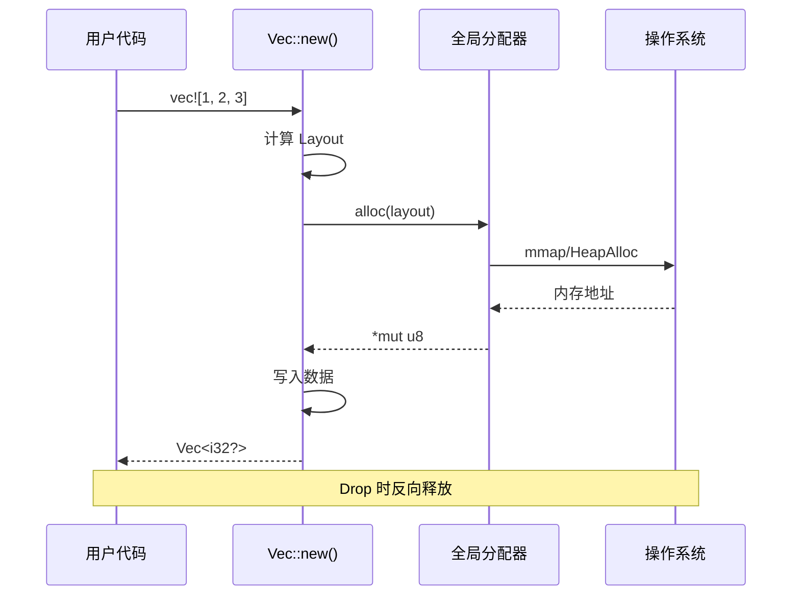
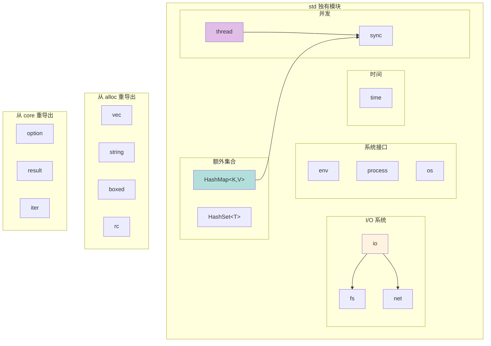
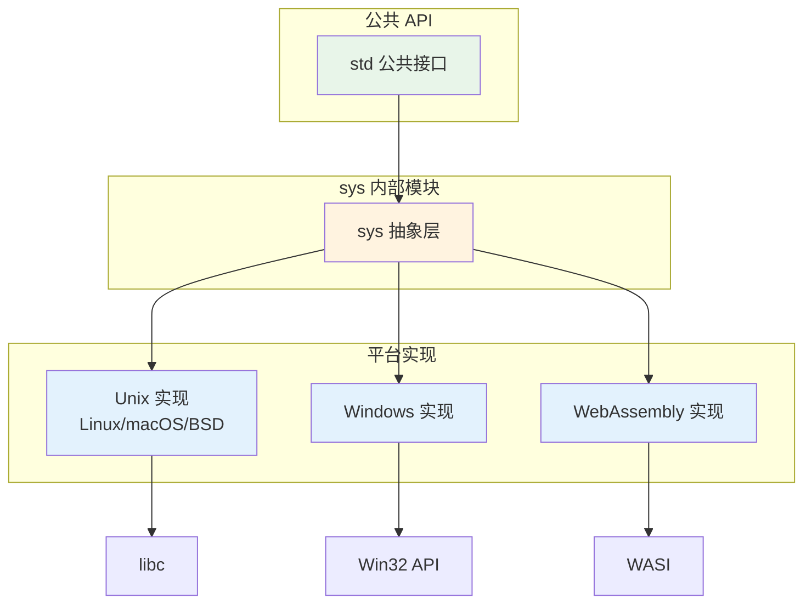
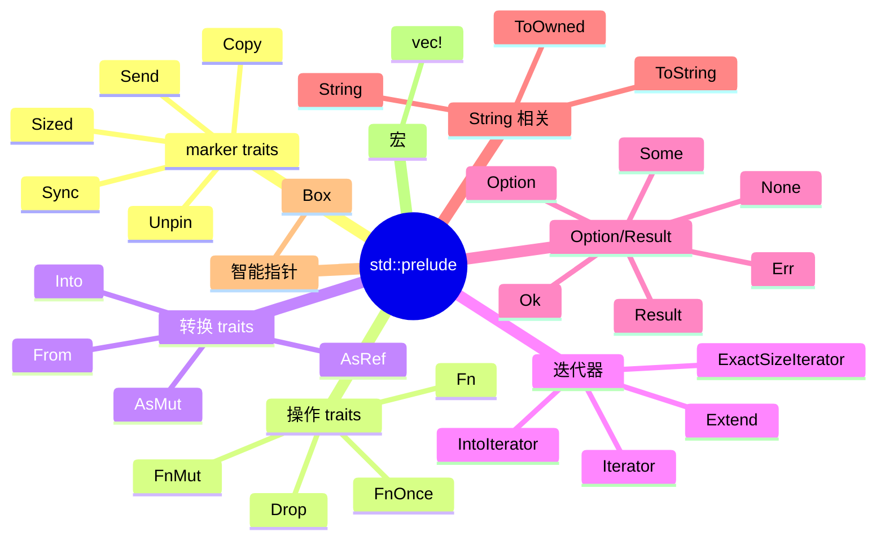
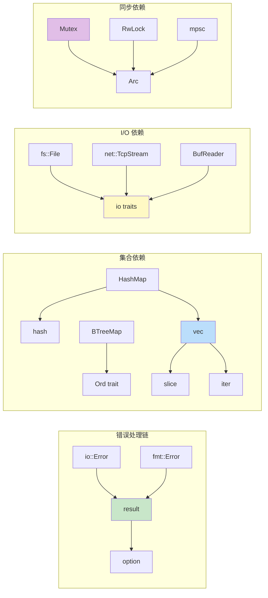
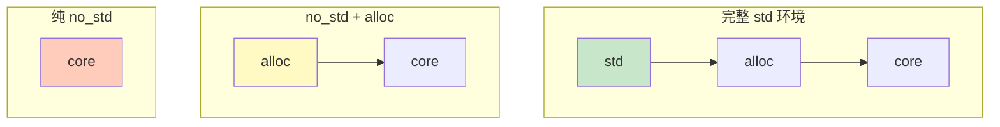

# Rust 标准库架构详解

## 1. 分层架构

Rust 标准库采用严格的分层设计，从底层到高层依次为：



### 各层职责

| 层级 | 库 | 职责 | 依赖 |
|------|------|------|------|
| **第4层** | `std` | 操作系统接口、I/O、线程、网络 | alloc, core, 操作系统 |
| **第3层** | `alloc` | 堆内存分配、动态容器 | core, 全局分配器 |
| **第2层** | `core` | 无依赖的基础功能 | 编译器内置 |
| **第1层** | 编译器 | 原生类型、内置函数 | 无 |

---

## 2. core 库详解

`core` 是 Rust 的核心库，不依赖任何外部库，可在 `no_std` 环境使用。



### core 核心 Trait



---

## 3. alloc 库详解

`alloc` 提供堆内存分配和动态数据结构。



### 内存分配流程



---

## 4. std 库详解

`std` 在 `core` 和 `alloc` 基础上提供操作系统接口。



### std 平台抽象层



---

## 5. Prelude 预导入

Rust 自动导入 `std::prelude` 到每个模块：



---

## 6. 模块依赖关系



---

## 7. 编译条件与特性

### 常用 cfg 属性

```rust
// 平台检测
#[cfg(unix)]
#[cfg(windows)]
#[cfg(target_os = "linux")]
#[cfg(target_os = "macos")]
#[cfg(target_arch = "x86_64")]
#[cfg(target_arch = "aarch64")]

// 指针大小
#[cfg(target_pointer_width = "64")]
#[cfg(target_pointer_width = "32")]

// 特性开关
#[cfg(feature = "std")]
#[cfg(not(feature = "std"))]

// 测试/文档
#[cfg(test)]
#[cfg(doc)]
```

### no_std 环境



| 环境 | 可用库 | 典型用途 |
|------|--------|----------|
| 完整 std | std + alloc + core | 普通应用程序 |
| no_std + alloc | alloc + core | 嵌入式系统有堆 |
| 纯 no_std | 仅 core | 裸机/bootloader |
