# Rust 内存模型详解

## 1. 所有权系统

Rust 的内存安全保证建立在所有权系统之上，这是 Rust 最独特的特性。

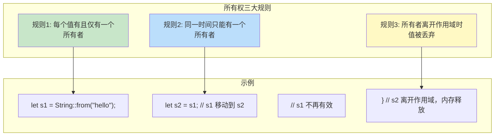

### 所有权转移 (Move)

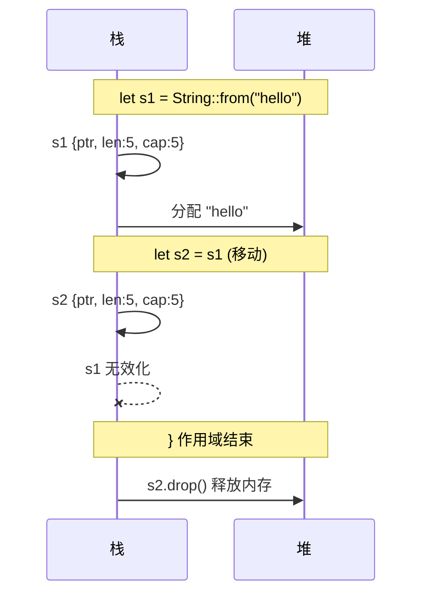

### Copy vs Move

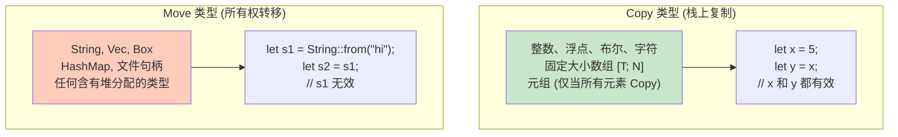

---

## 2. 借用系统

借用允许在不转移所有权的情况下访问数据。

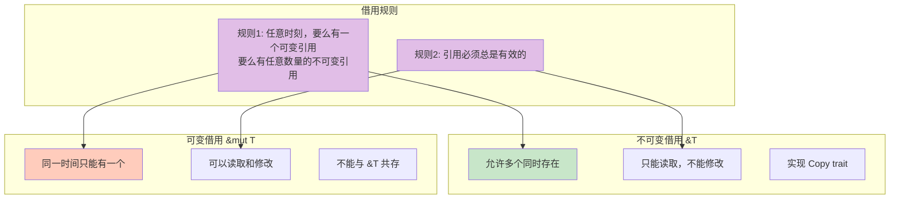

### 借用检查器工作流程

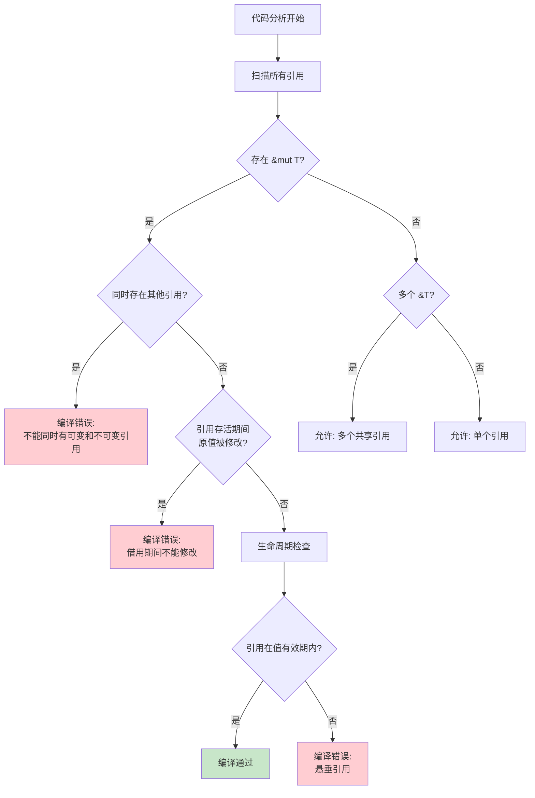

---

## 3. 生命周期

生命周期确保引用在被使用期间始终有效。

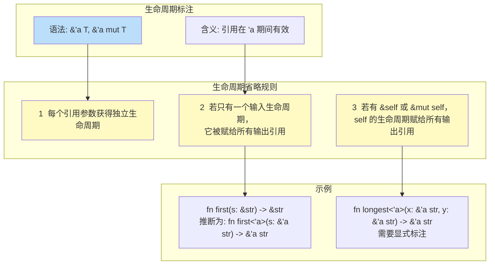

### 生命周期层次

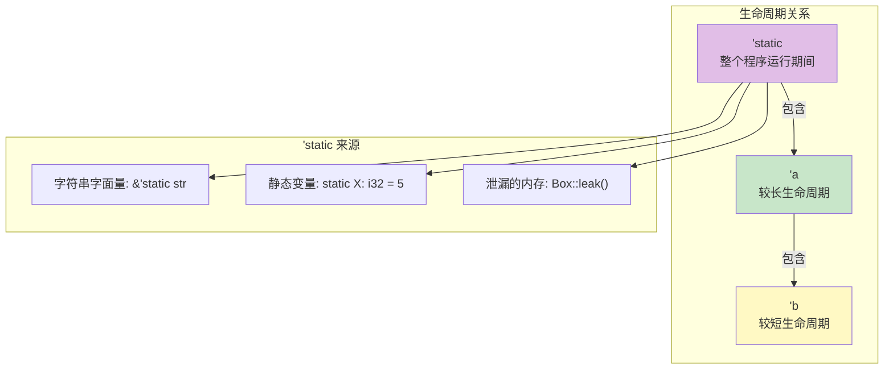

---

## 4. 内存布局

### 栈与堆

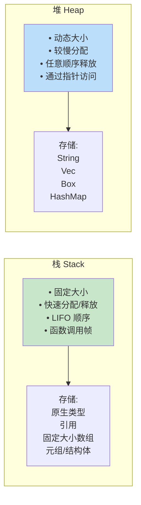

### 类型内存布局

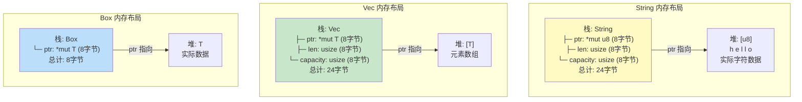

### 切片布局

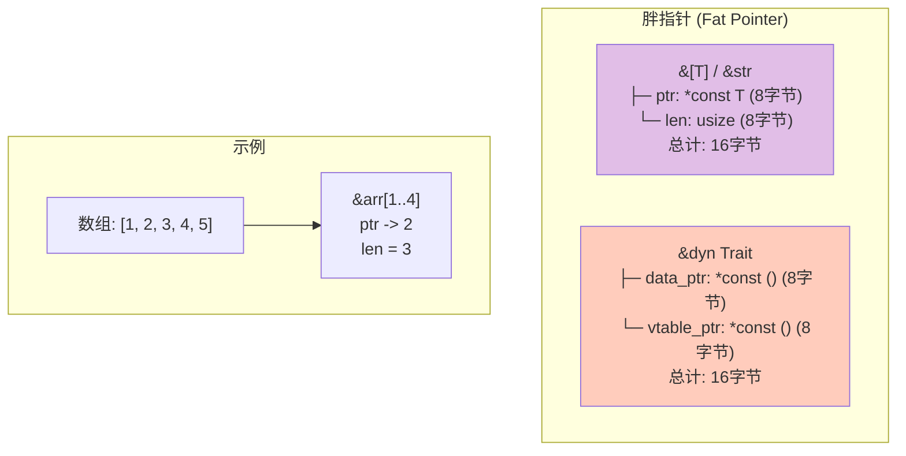

---

## 5. Drop 与析构

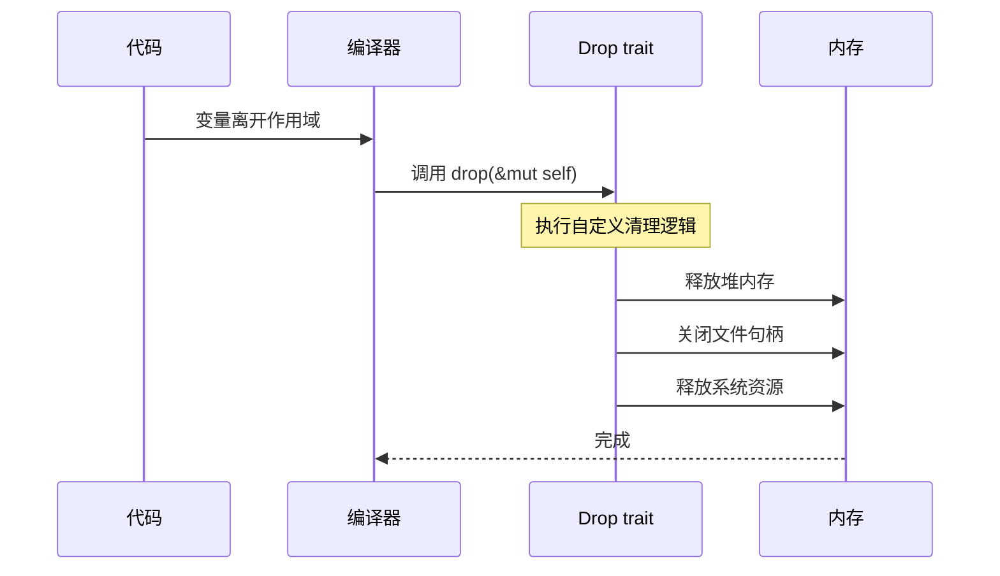

### Drop 顺序

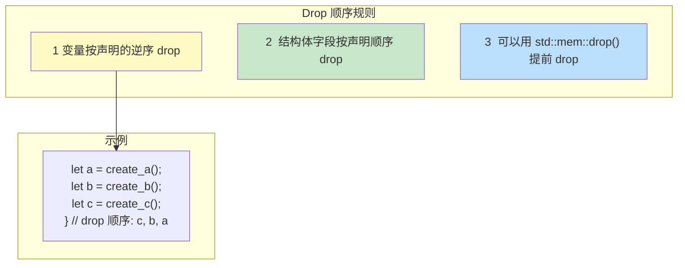

---

## 6. 内部可变性

当需要在不可变引用下修改数据时，使用内部可变性模式。

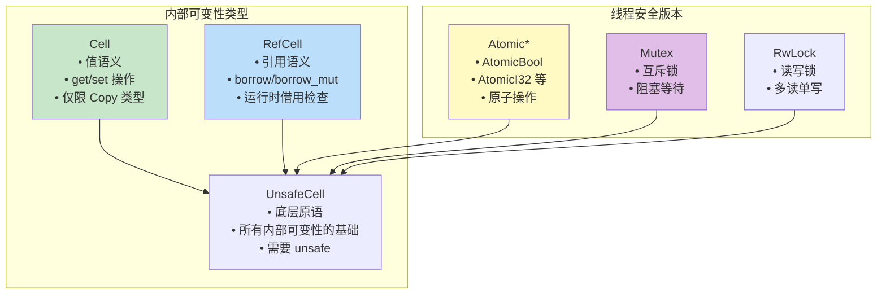

### RefCell 运行时检查

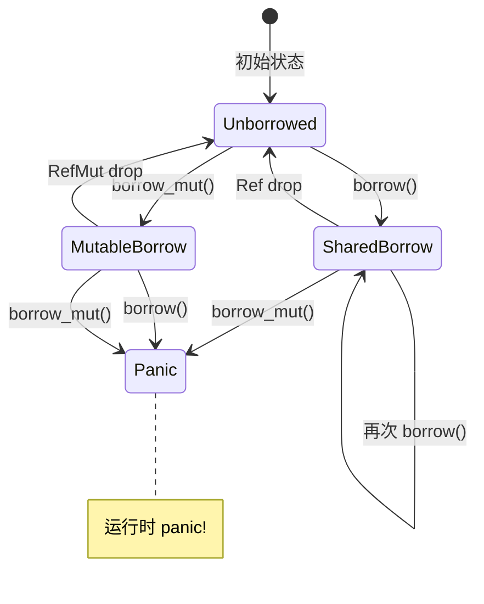

---

## 7. 零成本抽象

Rust 的内存模型支持零成本抽象，编译时检查确保运行时无开销。

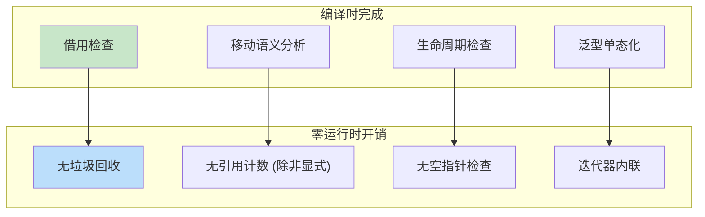

---

## 8. 常见内存模式

### 所有权模式总结

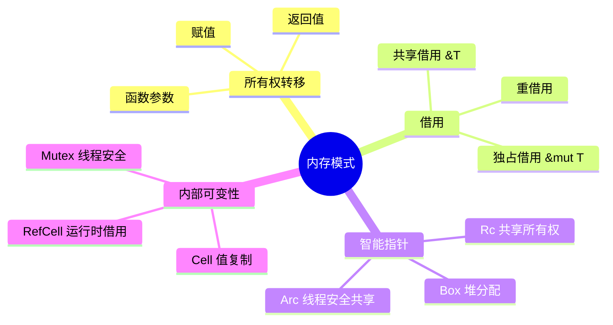

### 常见错误与解决

| 错误 | 原因 | 解决方案 |
|------|------|----------|
| use after move | 所有权已转移 | 使用 clone() 或引用 |
| cannot borrow as mutable | 已存在不可变借用 | 调整借用作用域 |
| lifetime may not live long enough | 引用存活太短 | 添加生命周期标注 |
| data race | 多线程访问 | 使用 Arc + Mutex |

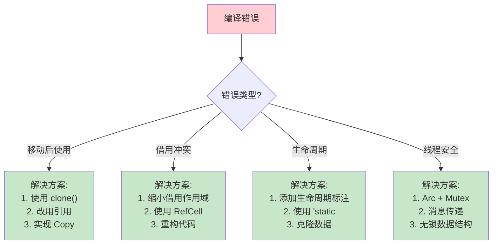
