# Rust 类型系统详解

## 1. 类型系统概览

Rust 拥有强大的静态类型系统，在编译时捕获大量错误。

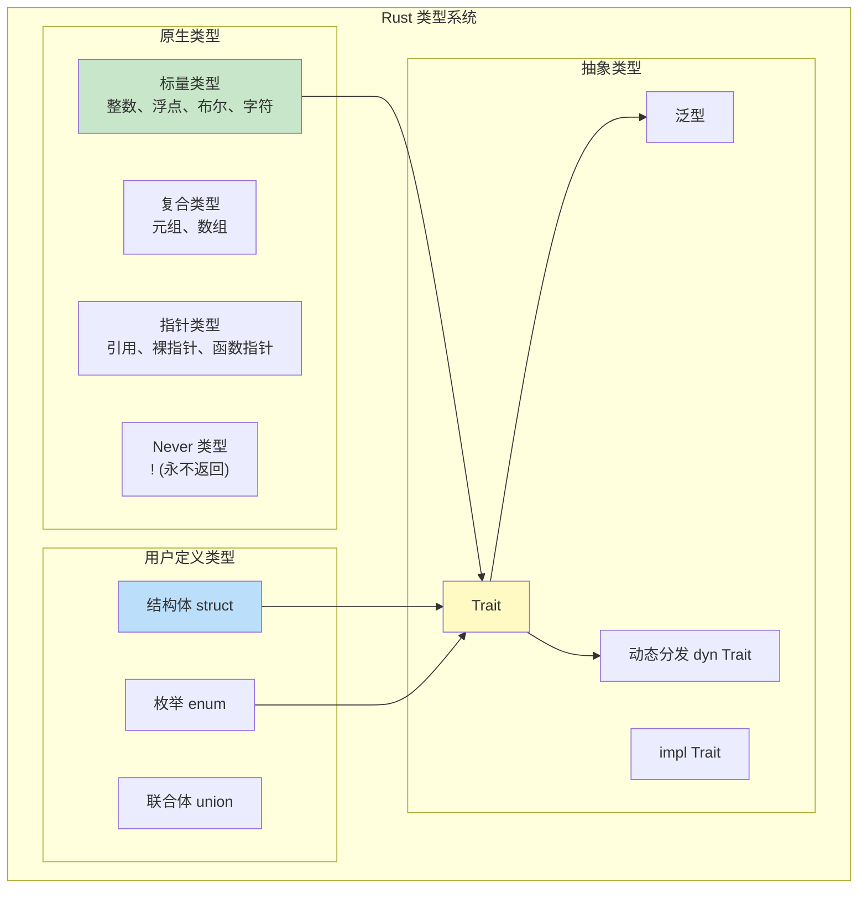
```mermaid
graph TB
    subgraph "Rust 类型系统"
        subgraph "原生类型"
            SCALAR["标量类型<br/>整数、浮点、布尔、字符"]
            COMPOUND["复合类型<br/>元组、数组"]
            POINTER["指针类型<br/>引用、裸指针、函数指针"]
            NEVER["Never 类型<br/>! (永不返回)"]
        end

        subgraph "用户定义类型"
            STRUCT["结构体 struct"]
            ENUM["枚举 enum"]
            UNION["联合体 union"]
        end

        subgraph "抽象类型"
            TRAIT["Trait"]
            GENERIC["泛型 <T>"]
            DYN["动态分发 dyn Trait"]
            IMPL_TRAIT["impl Trait"]
        end
    end

    SCALAR --> TRAIT
    STRUCT --> TRAIT
    ENUM --> TRAIT
    TRAIT --> GENERIC
    TRAIT --> DYN

    style SCALAR fill:#c8e6c9
    style STRUCT fill:#bbdefb
    style TRAIT fill:#fff9c4
```

---

## 2. Trait 系统

Trait 是 Rust 定义共享行为的方式，类似其他语言的接口。

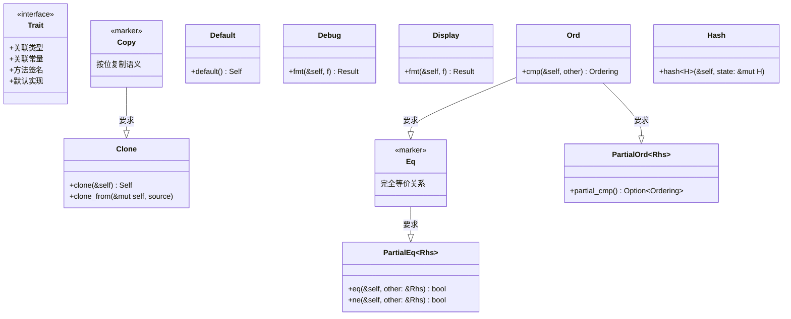
```mermaid
classDiagram
    class Trait {
        <<interface>>
        +关联类型
        +关联常量
        +方法签名
        +默认实现
    }

    class Copy {
        <<marker>>
        按位复制语义
    }

    class Clone {
        +clone(&self) Self
        +clone_from(&mut self, source)
    }

    class Default {
        +default() Self
    }

    class Debug {
        +fmt(&self, f) Result
    }

    class Display {
        +fmt(&self, f) Result
    }

    class PartialEq~Rhs~ {
        +eq(&self, other: &Rhs) bool
        +ne(&self, other: &Rhs) bool
    }

    class Eq {
        <<marker>>
        完全等价关系
    }

    class PartialOrd~Rhs~ {
        +partial_cmp() Option~Ordering~
    }

    class Ord {
        +cmp(&self, other) Ordering
    }

    class Hash {
        +hash~H~(&self, state: &mut H)
    }

    Copy --|> Clone : 要求
    Eq --|> PartialEq : 要求
    Ord --|> Eq : 要求
    Ord --|> PartialOrd : 要求
```

### 运算符 Trait

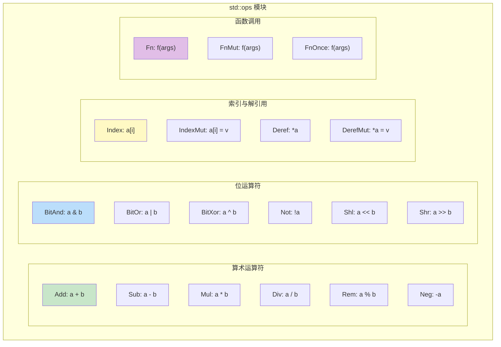
```mermaid
graph TB
    subgraph "std::ops 模块"
        subgraph "算术运算符"
            ADD["Add: a + b"]
            SUB["Sub: a - b"]
            MUL["Mul: a * b"]
            DIV["Div: a / b"]
            REM["Rem: a % b"]
            NEG["Neg: -a"]
        end

        subgraph "位运算符"
            BITAND["BitAnd: a & b"]
            BITOR["BitOr: a | b"]
            BITXOR["BitXor: a ^ b"]
            NOT["Not: !a"]
            SHL["Shl: a << b"]
            SHR["Shr: a >> b"]
        end

        subgraph "索引与解引用"
            INDEX["Index: a[i]"]
            INDEXMUT["IndexMut: a[i] = v"]
            DEREF["Deref: *a"]
            DEREFMUT["DerefMut: *a = v"]
        end

        subgraph "函数调用"
            FN["Fn: f(args)"]
            FNMUT["FnMut: f(args)"]
            FNONCE["FnOnce: f(args)"]
        end
    end

    style ADD fill:#c8e6c9
    style BITAND fill:#bbdefb
    style INDEX fill:#fff9c4
    style FN fill:#e1bee7
```

### 闭包 Trait 层次

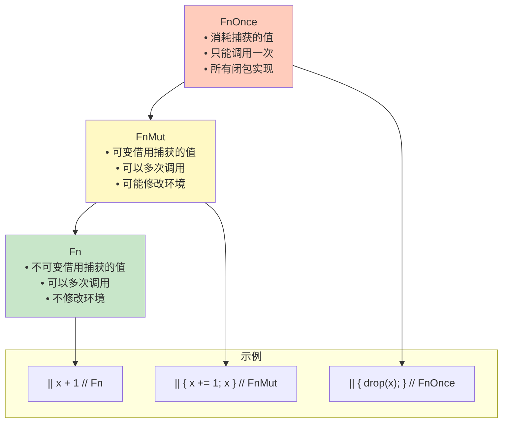
```mermaid
graph TD
    FNONCE["FnOnce<br/>• 消耗捕获的值<br/>• 只能调用一次<br/>• 所有闭包实现"]

    FNMUT["FnMut<br/>• 可变借用捕获的值<br/>• 可以多次调用<br/>• 可能修改环境"]

    FN["Fn<br/>• 不可变借用捕获的值<br/>• 可以多次调用<br/>• 不修改环境"]

    FNONCE --> FNMUT
    FNMUT --> FN

    subgraph "示例"
        EX1["|| x + 1  // Fn"]
        EX2["|| { x += 1; x }  // FnMut"]
        EX3["|| { drop(x); }  // FnOnce"]
    end

    FN --> EX1
    FNMUT --> EX2
    FNONCE --> EX3

    style FN fill:#c8e6c9
    style FNMUT fill:#fff9c4
    style FNONCE fill:#ffccbc
```

---

## 3. Marker Traits

Marker traits 不含方法，用于标记类型特性。

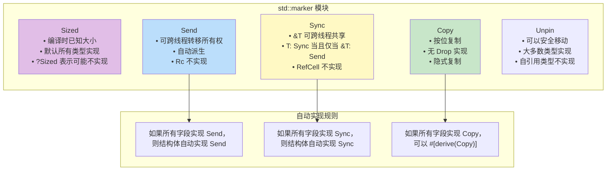
```mermaid
graph TB
    subgraph "std::marker 模块"
        SIZED["Sized<br/>• 编译时已知大小<br/>• 默认所有类型实现<br/>• ?Sized 表示可能不实现"]

        COPY["Copy<br/>• 按位复制<br/>• 无 Drop 实现<br/>• 隐式复制"]

        SEND["Send<br/>• 可跨线程转移所有权<br/>• 自动派生<br/>• Rc 不实现"]

        SYNC["Sync<br/>• &T 可跨线程共享<br/>• T: Sync 当且仅当 &T: Send<br/>• RefCell 不实现"]

        UNPIN["Unpin<br/>• 可以安全移动<br/>• 大多数类型实现<br/>• 自引用类型不实现"]
    end

    subgraph "自动实现规则"
        AUTO1["如果所有字段实现 Send，<br/>则结构体自动实现 Send"]
        AUTO2["如果所有字段实现 Sync，<br/>则结构体自动实现 Sync"]
        AUTO3["如果所有字段实现 Copy，<br/>可以 #[derive(Copy)]"]
    end

    SEND --> AUTO1
    SYNC --> AUTO2
    COPY --> AUTO3

    style SIZED fill:#e1bee7
    style COPY fill:#c8e6c9
    style SEND fill:#bbdefb
    style SYNC fill:#fff9c4
```

### Send 和 Sync 关系

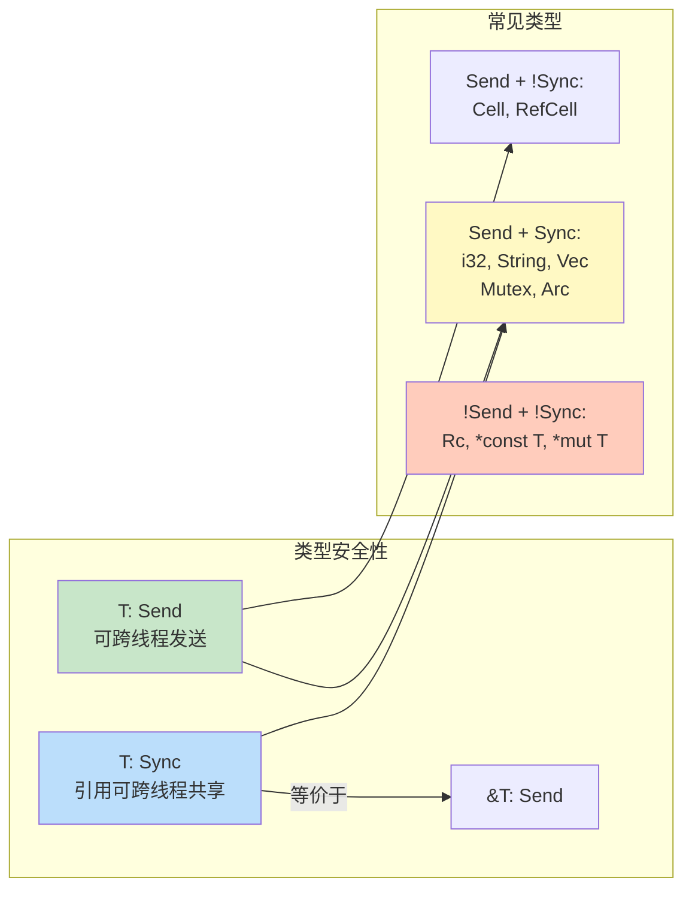
```mermaid
graph LR
    subgraph "类型安全性"
        T_SEND["T: Send<br/>可跨线程发送"]
        T_SYNC["T: Sync<br/>引用可跨线程共享"]
        REF_SEND["&T: Send"]
    end

    T_SYNC -->|等价于| REF_SEND

    subgraph "常见类型"
        TYPES1["Send + Sync:<br/>i32, String, Vec<br/>Mutex, Arc"]
        TYPES2["Send + !Sync:<br/>Cell, RefCell"]
        TYPES3["!Send + !Sync:<br/>Rc, *const T, *mut T"]
    end

    T_SEND --> TYPES1
    T_SEND --> TYPES2
    T_SYNC --> TYPES1

    style T_SEND fill:#c8e6c9
    style T_SYNC fill:#bbdefb
    style TYPES1 fill:#fff9c4
    style TYPES3 fill:#ffccbc
```

---

## 4. 泛型

泛型提供代码复用并保证类型安全。

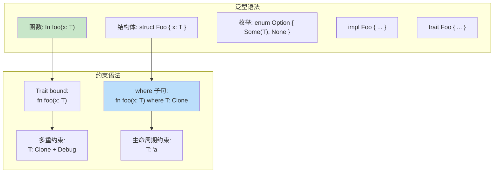
```mermaid
graph TB
    subgraph "泛型语法"
        FUNC["函数: fn foo<T>(x: T)"]
        STRUCT["结构体: struct Foo<T> { x: T }"]
        ENUM["枚举: enum Option<T> { Some(T), None }"]
        IMPL["impl<T> Foo<T> { ... }"]
        TRAIT["trait Foo<T> { ... }"]
    end

    subgraph "约束语法"
        WHERE["where 子句:<br/>fn foo<T>(x: T) where T: Clone"]
        BOUND["Trait bound:<br/>fn foo<T: Clone>(x: T)"]
        MULTI["多重约束:<br/>T: Clone + Debug"]
        LIFETIME["生命周期约束:<br/>T: 'a"]
    end

    FUNC --> BOUND
    STRUCT --> WHERE
    BOUND --> MULTI
    WHERE --> LIFETIME

    style FUNC fill:#c8e6c9
    style WHERE fill:#bbdefb
```

### 单态化

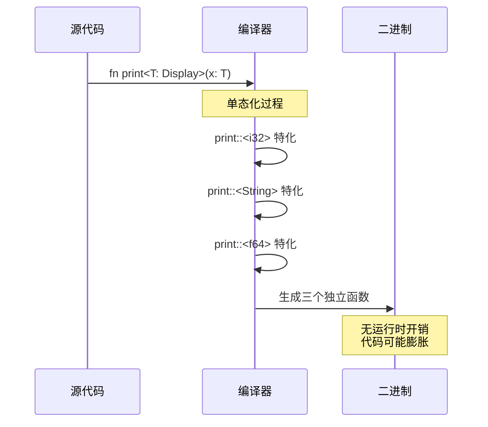
```mermaid
sequenceDiagram
    participant Source as 源代码
    participant Compiler as 编译器
    participant Binary as 二进制

    Source->>Compiler: fn print<T: Display>(x: T)
    Note over Compiler: 单态化过程

    Compiler->>Compiler: print::<i32> 特化
    Compiler->>Compiler: print::<String> 特化
    Compiler->>Compiler: print::<f64> 特化

    Compiler->>Binary: 生成三个独立函数
    Note over Binary: 无运行时开销<br/>代码可能膨胀
```

---

## 5. 关联类型

关联类型是 trait 的类型占位符，由实现者指定。

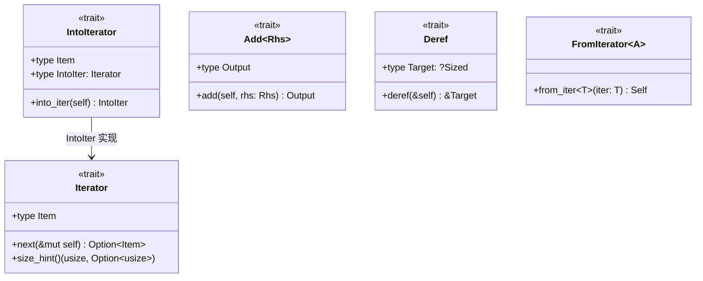
```mermaid
classDiagram
    class Iterator {
        <<trait>>
        +type Item
        +next(&mut self) Option~Item~
        +size_hint() (usize, Option~usize~)
    }

    class IntoIterator {
        <<trait>>
        +type Item
        +type IntoIter: Iterator
        +into_iter(self) IntoIter
    }

    class Add~Rhs~ {
        <<trait>>
        +type Output
        +add(self, rhs: Rhs) Output
    }

    class Deref {
        <<trait>>
        +type Target: ?Sized
        +deref(&self) &Target
    }

    class FromIterator~A~ {
        <<trait>>
        +from_iter~T~(iter: T) Self
    }

    IntoIterator --> Iterator : IntoIter 实现
```

### 关联类型 vs 泛型参数

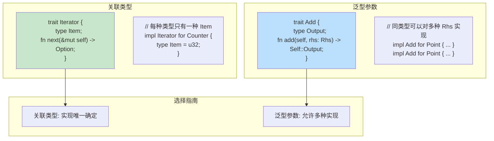
```mermaid
graph TB
    subgraph "关联类型"
        ASSOC["trait Iterator {<br/>    type Item;<br/>    fn next(&mut self) -> Option<Self::Item>;<br/>}"]
        ASSOC_USE["// 每种类型只有一种 Item<br/>impl Iterator for Counter {<br/>    type Item = u32;<br/>}"]
    end

    subgraph "泛型参数"
        GENERIC["trait Add<Rhs> {<br/>    type Output;<br/>    fn add(self, rhs: Rhs) -> Self::Output;<br/>}"]
        GENERIC_USE["// 同类型可以对多种 Rhs 实现<br/>impl Add<i32> for Point { ... }<br/>impl Add<Point> for Point { ... }"]
    end

    subgraph "选择指南"
        CHOOSE1["关联类型: 实现唯一确定"]
        CHOOSE2["泛型参数: 允许多种实现"]
    end

    ASSOC --> CHOOSE1
    GENERIC --> CHOOSE2

    style ASSOC fill:#c8e6c9
    style GENERIC fill:#bbdefb
```

---

## 6. 类型转换

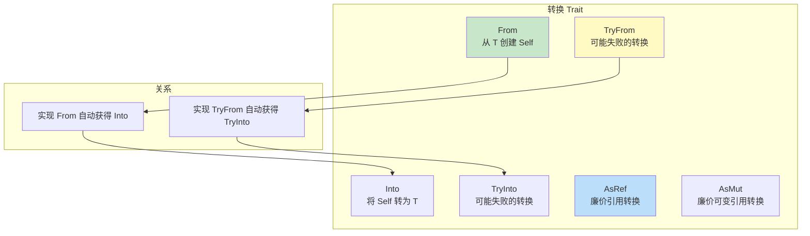
```mermaid
graph TB
    subgraph "转换 Trait"
        FROM["From<T><br/>从 T 创建 Self"]
        INTO["Into<T><br/>将 Self 转为 T"]
        TRYFROM["TryFrom<T><br/>可能失败的转换"]
        TRYINTO["TryInto<T><br/>可能失败的转换"]
        ASREF["AsRef<T><br/>廉价引用转换"]
        ASMUT["AsMut<T><br/>廉价可变引用转换"]
    end

    subgraph "关系"
        REL1["实现 From<T> 自动获得 Into<T>"]
        REL2["实现 TryFrom<T> 自动获得 TryInto<T>"]
    end

    FROM --> REL1
    REL1 --> INTO
    TRYFROM --> REL2
    REL2 --> TRYINTO

    style FROM fill:#c8e6c9
    style TRYFROM fill:#fff9c4
    style ASREF fill:#bbdefb
```

### Deref 强制转换

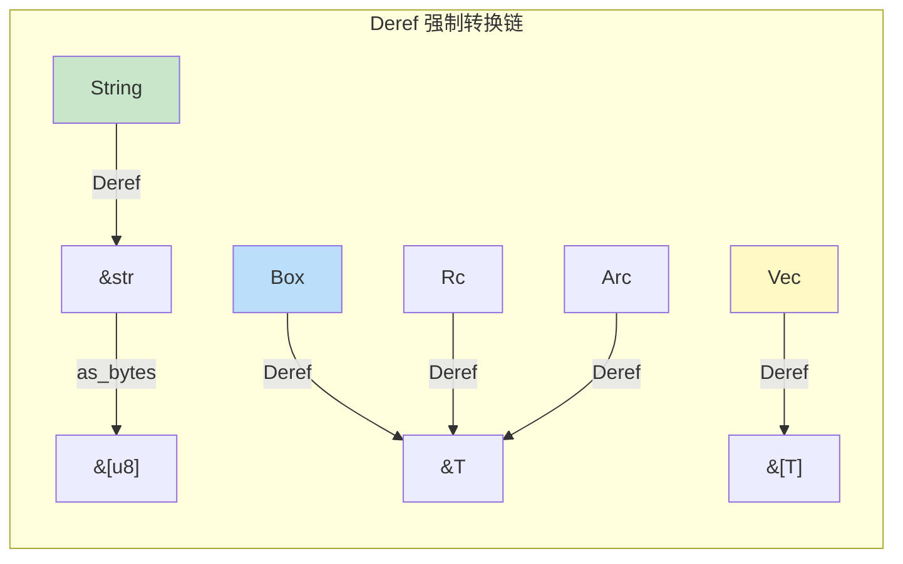
```mermaid
graph LR
    subgraph "Deref 强制转换链"
        STRING["String"]
        STR["&str"]
        U8_SLICE["&[u8]"]

        BOX["Box<T>"]
        T_REF["&T"]

        VEC["Vec<T>"]
        SLICE["&[T]"]

        RC["Rc<T>"]
        ARC["Arc<T>"]
    end

    STRING -->|Deref| STR
    STR -->|as_bytes| U8_SLICE
    BOX -->|Deref| T_REF
    VEC -->|Deref| SLICE
    RC -->|Deref| T_REF
    ARC -->|Deref| T_REF

    style STRING fill:#c8e6c9
    style BOX fill:#bbdefb
    style VEC fill:#fff9c4
```

---

## 7. 动态分发 vs 静态分发

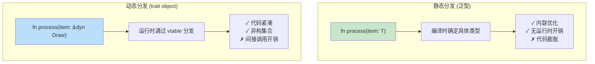
```mermaid
graph TB
    subgraph "静态分发 (泛型)"
        STATIC_CODE["fn process<T: Draw>(item: T)"]
        STATIC_COMPILE["编译时确定具体类型"]
        STATIC_PERF["✓ 内联优化<br/>✓ 无运行时开销<br/>✗ 代码膨胀"]
    end

    subgraph "动态分发 (trait object)"
        DYN_CODE["fn process(item: &dyn Draw)"]
        DYN_RUNTIME["运行时通过 vtable 分发"]
        DYN_PERF["✓ 代码紧凑<br/>✓ 异构集合<br/>✗ 间接调用开销"]
    end

    STATIC_CODE --> STATIC_COMPILE
    STATIC_COMPILE --> STATIC_PERF

    DYN_CODE --> DYN_RUNTIME
    DYN_RUNTIME --> DYN_PERF

    style STATIC_CODE fill:#c8e6c9
    style DYN_CODE fill:#bbdefb
```

### Trait Object 布局

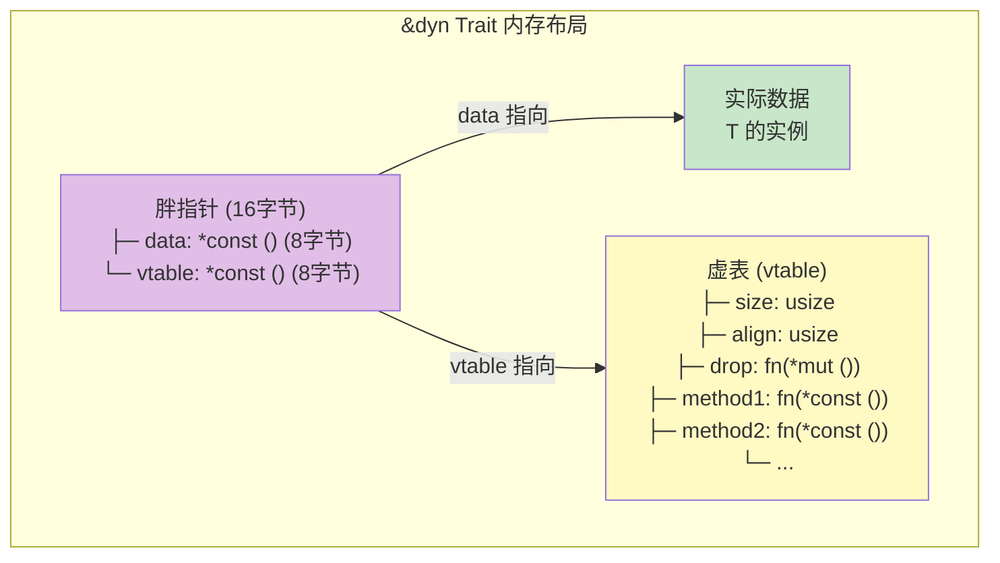
```mermaid
graph TB
    subgraph "&dyn Trait 内存布局"
        FAT_PTR["胖指针 (16字节)<br/>├─ data: *const () (8字节)<br/>└─ vtable: *const () (8字节)"]

        VTABLE["虚表 (vtable)<br/>├─ size: usize<br/>├─ align: usize<br/>├─ drop: fn(*mut ())<br/>├─ method1: fn(*const ())<br/>├─ method2: fn(*const ())<br/>└─ ..."]

        DATA["实际数据<br/>T 的实例"]
    end

    FAT_PTR -->|data 指向| DATA
    FAT_PTR -->|vtable 指向| VTABLE

    style FAT_PTR fill:#e1bee7
    style VTABLE fill:#fff9c4
    style DATA fill:#c8e6c9
```

### Object Safety

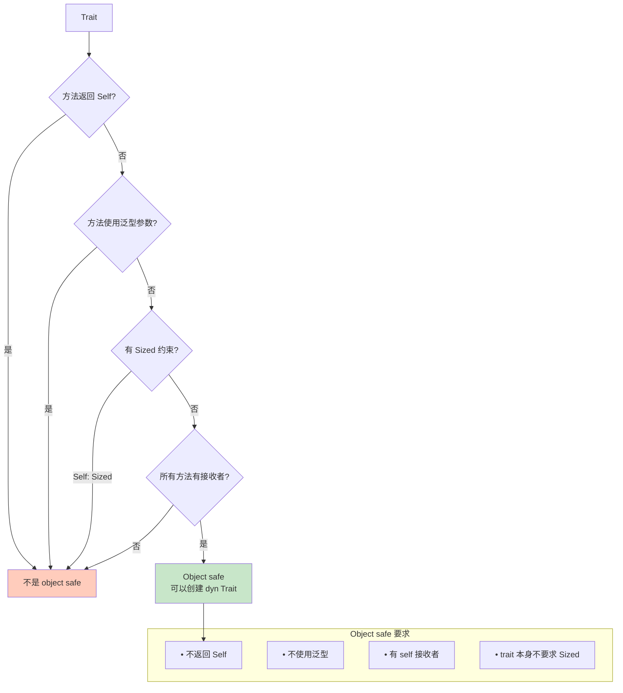
```mermaid
flowchart TD
    START[Trait] --> CHECK1{方法返回 Self?}
    CHECK1 -->|是| UNSAFE[不是 object safe]
    CHECK1 -->|否| CHECK2{方法使用泛型参数?}

    CHECK2 -->|是| UNSAFE
    CHECK2 -->|否| CHECK3{有 Sized 约束?}

    CHECK3 -->|Self: Sized| UNSAFE
    CHECK3 -->|否| CHECK4{所有方法有接收者?}

    CHECK4 -->|否| UNSAFE
    CHECK4 -->|是| SAFE[Object safe<br/>可以创建 dyn Trait]

    subgraph "Object safe 要求"
        REQ1["• 不返回 Self"]
        REQ2["• 不使用泛型"]
        REQ3["• 有 self 接收者"]
        REQ4["• trait 本身不要求 Sized"]
    end

    SAFE --> REQ1

    style UNSAFE fill:#ffccbc
    style SAFE fill:#c8e6c9
```

---

## 8. 类型推断

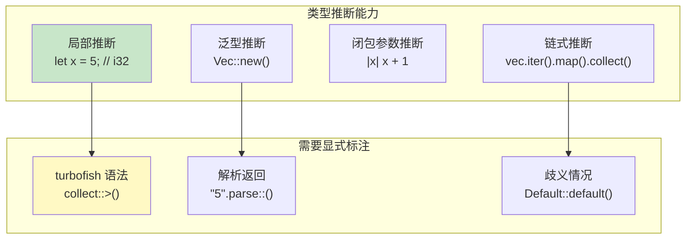
```mermaid
graph TB
    subgraph "类型推断能力"
        LOCAL["局部推断<br/>let x = 5; // i32"]
        CHAIN["链式推断<br/>vec.iter().map().collect()"]
        CLOSURE["闭包参数推断<br/>|x| x + 1"]
        GENERIC["泛型推断<br/>Vec::new()"]
    end

    subgraph "需要显式标注"
        TURBO["turbofish 语法<br/>collect::<Vec<_>>()"]
        PARSE["解析返回<br/>&quot;5&quot;.parse::<i32>()"]
        AMBIG["歧义情况<br/>Default::default()"]
    end

    LOCAL --> TURBO
    GENERIC --> PARSE
    CHAIN --> AMBIG

    style LOCAL fill:#c8e6c9
    style TURBO fill:#fff9c4
```

---

## 9. 新类型模式

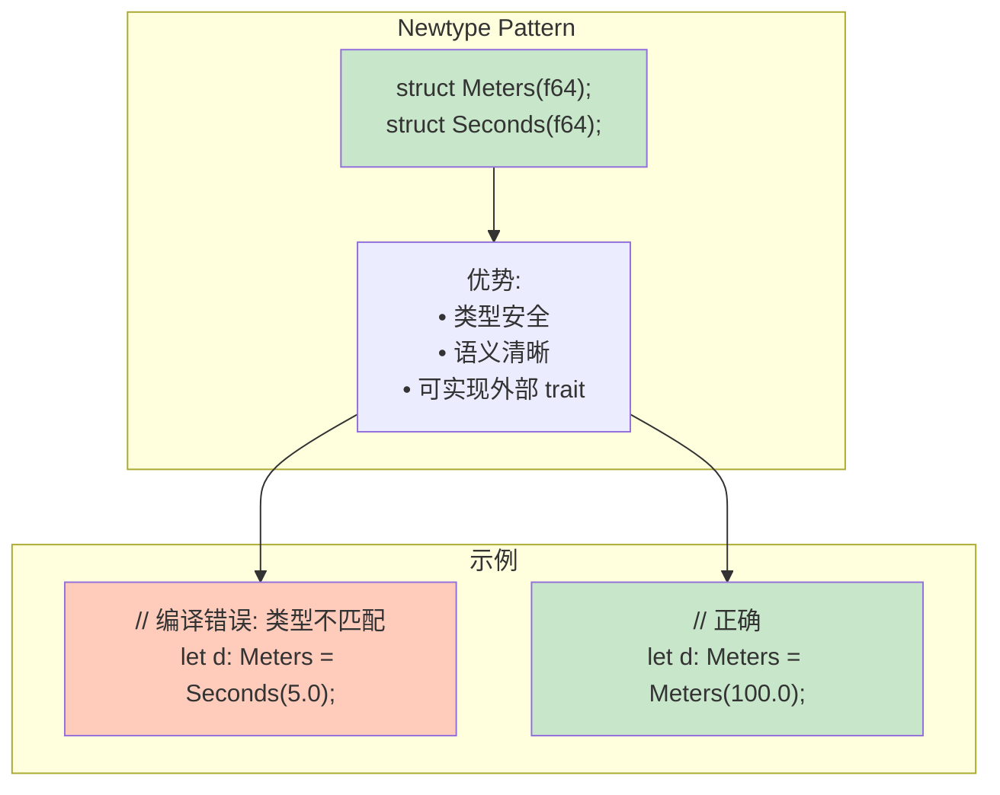
```mermaid
graph TB
    subgraph "Newtype Pattern"
        DEF["struct Meters(f64);<br/>struct Seconds(f64);"]
        BENEFIT["优势:<br/>• 类型安全<br/>• 语义清晰<br/>• 可实现外部 trait"]
    end

    subgraph "示例"
        WRONG["// 编译错误: 类型不匹配<br/>let d: Meters = Seconds(5.0);"]
        RIGHT["// 正确<br/>let d: Meters = Meters(100.0);"]
    end

    DEF --> BENEFIT
    BENEFIT --> WRONG
    BENEFIT --> RIGHT

    style DEF fill:#c8e6c9
    style WRONG fill:#ffccbc
    style RIGHT fill:#c8e6c9
```

---

## 10. 常用 derive 宏

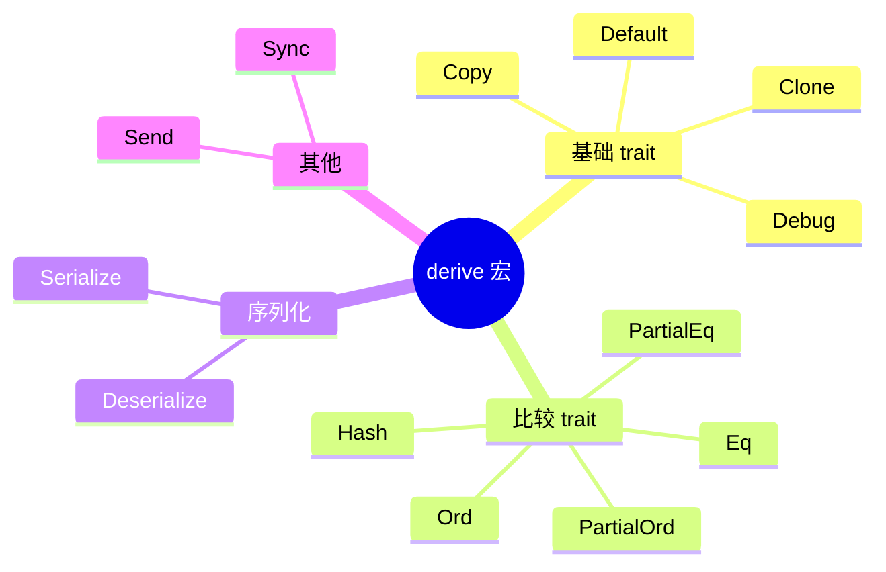
```mermaid
mindmap
    root((derive 宏))
        基础 trait
            Clone
            Copy
            Debug
            Default
        比较 trait
            PartialEq
            Eq
            PartialOrd
            Ord
            Hash
        序列化
            Serialize
            Deserialize
        其他
            Send
            Sync
```

### derive 规则

| Trait | 要求 | 生成代码 |
|-------|------|----------|
| `Clone` | 所有字段实现 Clone | 逐字段调用 clone() |
| `Copy` | 所有字段实现 Copy | 标记为 Copy |
| `Debug` | 所有字段实现 Debug | 格式化输出 |
| `Default` | 所有字段实现 Default | 逐字段调用 default() |
| `PartialEq` | 所有字段实现 PartialEq | 逐字段比较 |
| `Eq` | 实现 PartialEq | 标记为 Eq |
| `Hash` | 所有字段实现 Hash | 逐字段哈希 |

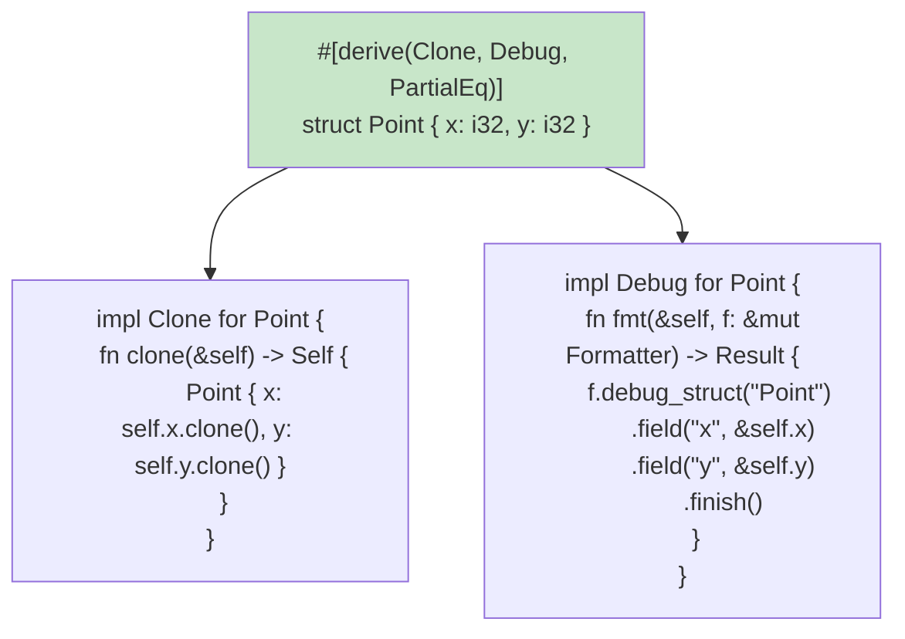
```mermaid
graph TD
    DERIVE["#[derive(Clone, Debug, PartialEq)]<br/>struct Point { x: i32, y: i32 }"]

    CLONE_GEN["impl Clone for Point {<br/>    fn clone(&self) -> Self {<br/>        Point { x: self.x.clone(), y: self.y.clone() }<br/>    }<br/>}"]

    DEBUG_GEN["impl Debug for Point {<br/>    fn fmt(&self, f: &mut Formatter) -> Result {<br/>        f.debug_struct(&quot;Point&quot;)<br/>            .field(&quot;x&quot;, &self.x)<br/>            .field(&quot;y&quot;, &self.y)<br/>            .finish()<br/>    }<br/>}"]

    DERIVE --> CLONE_GEN
    DERIVE --> DEBUG_GEN

    style DERIVE fill:#c8e6c9
```
