# Rust 原生类型详解

## 1. 类型总览

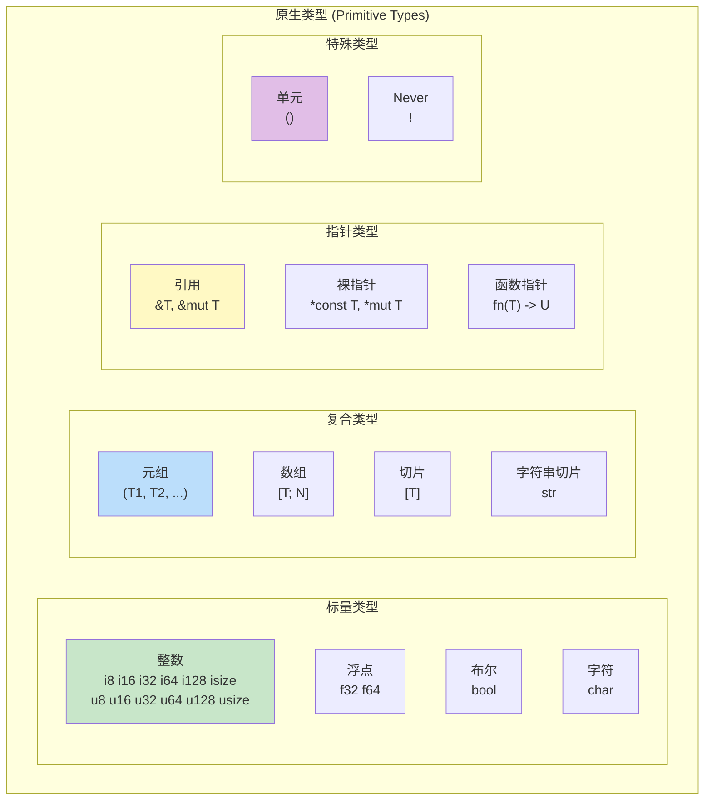

---

## 2. 整数类型

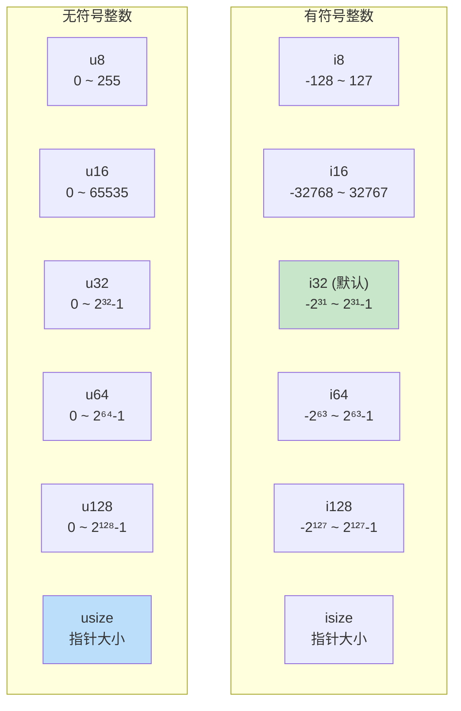

### 字面量语法

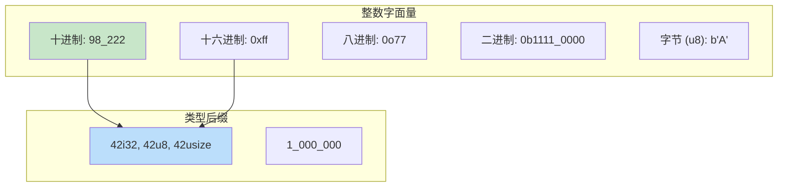

### 整数方法

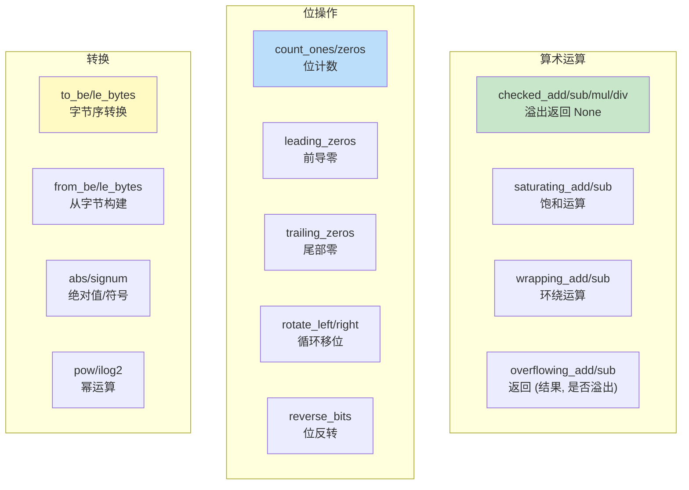

---

## 3. 浮点类型

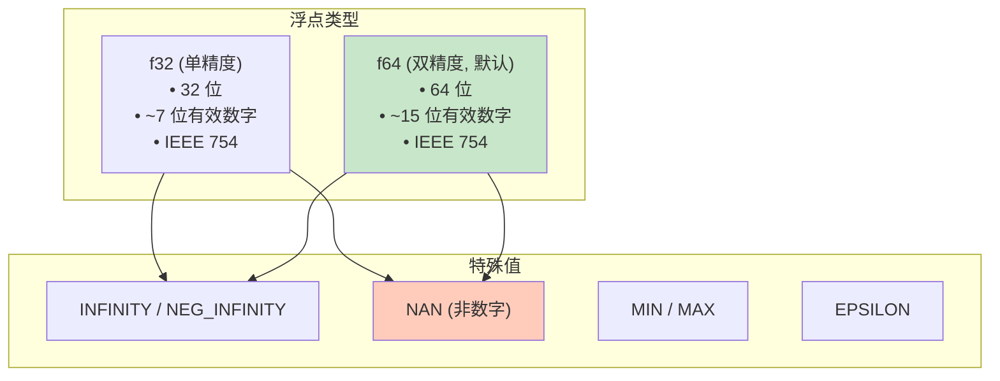

### 浮点方法

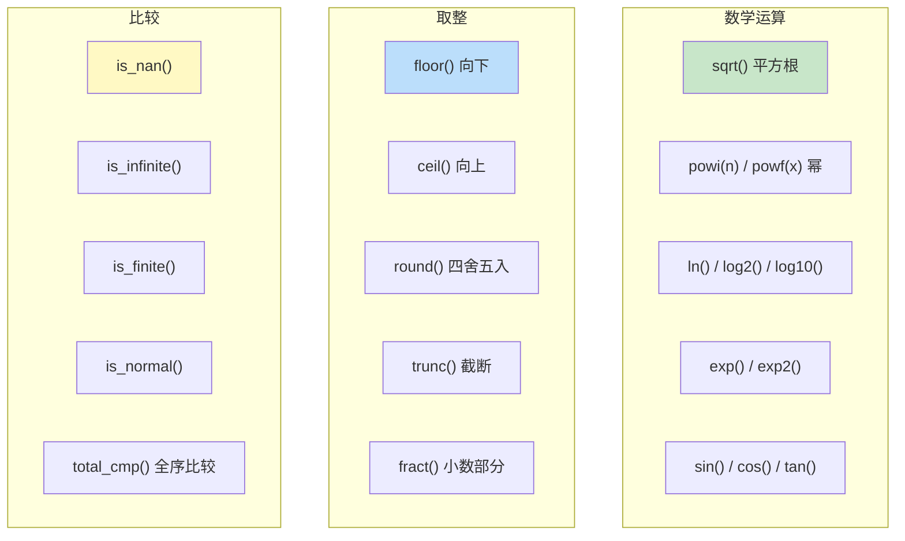

---

## 4. bool 和 char

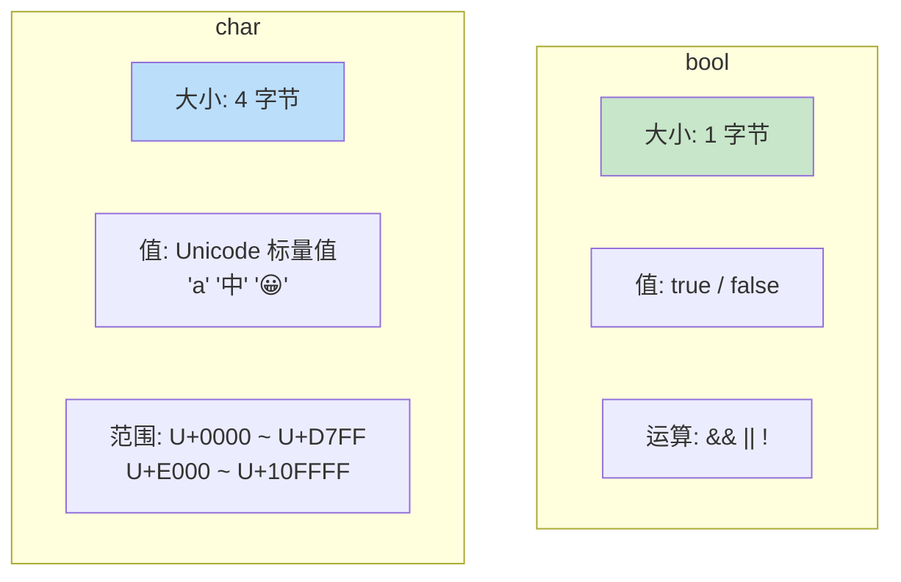

### char 方法

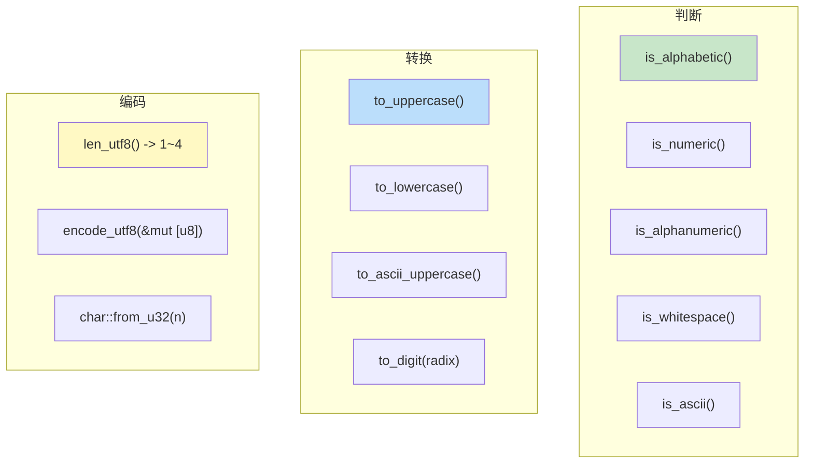

---

## 5. 元组 (T1, T2, ...)

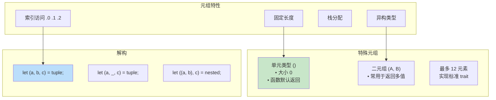

---

## 6. 数组 [T; N]

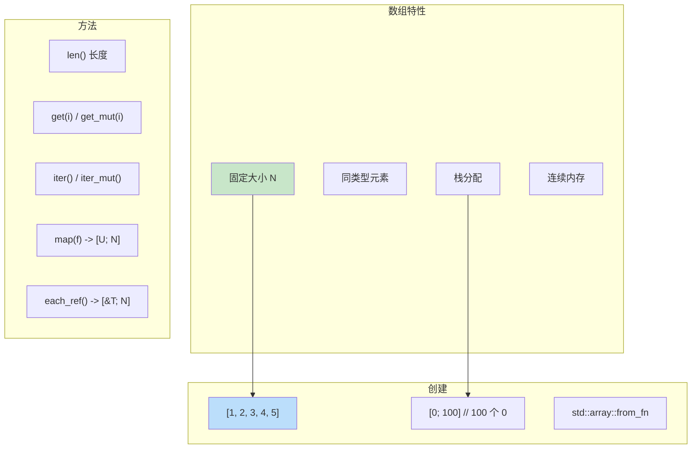

---

## 7. 切片 [T]

切片是动态大小类型 (DST)，只能通过引用使用。

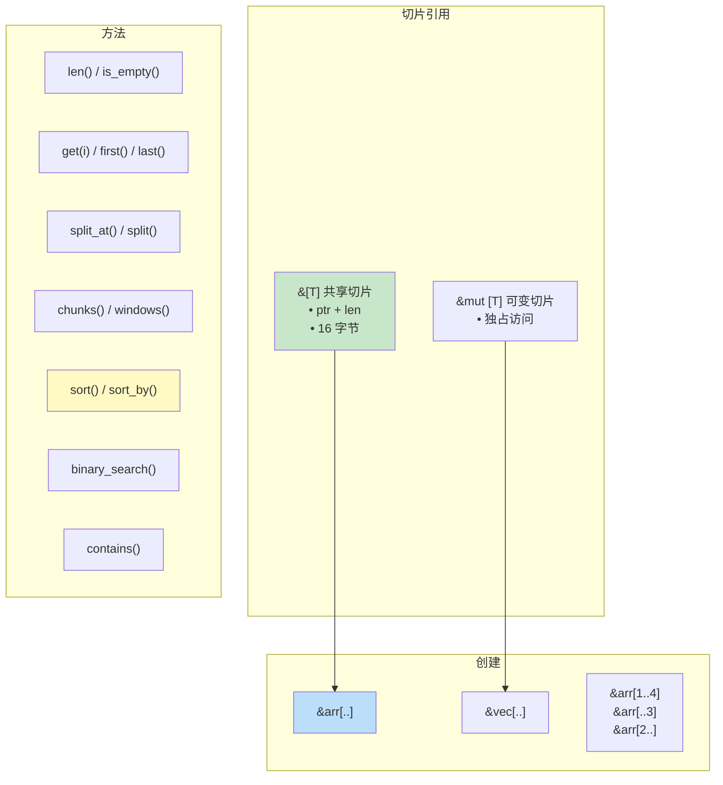

### 切片内存布局

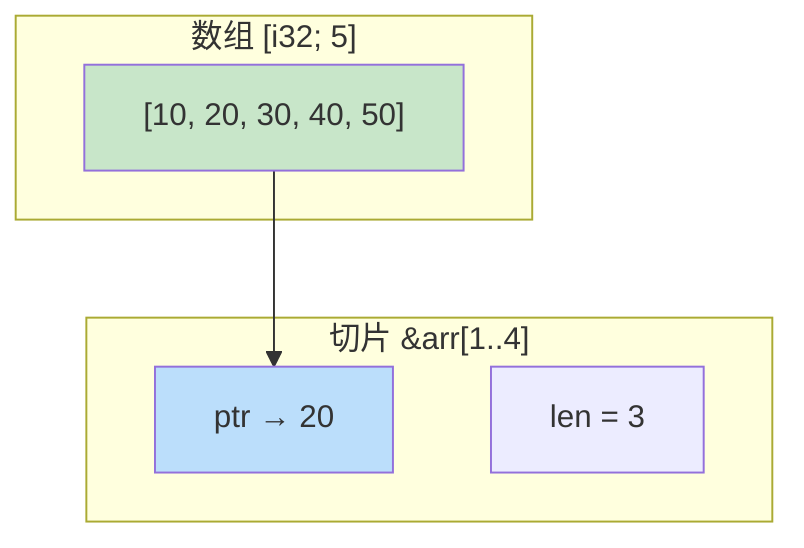

---

## 8. 字符串切片 str

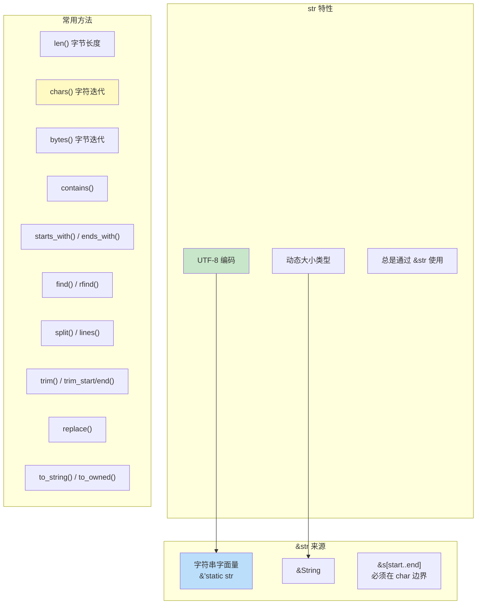

### 字符串索引

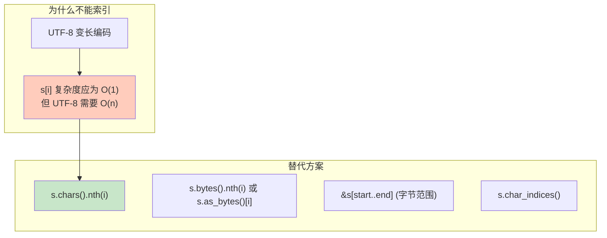

---

## 9. 引用类型

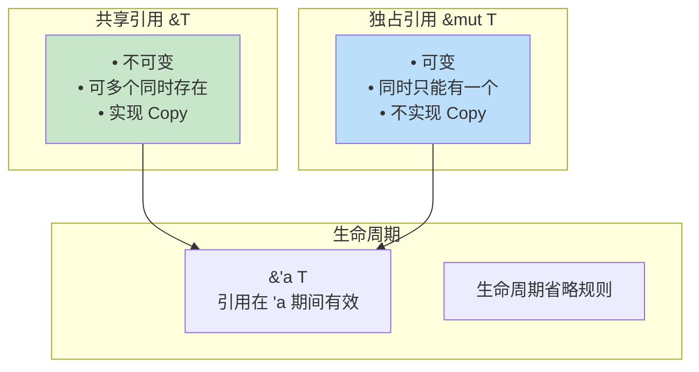

---

## 10. 裸指针

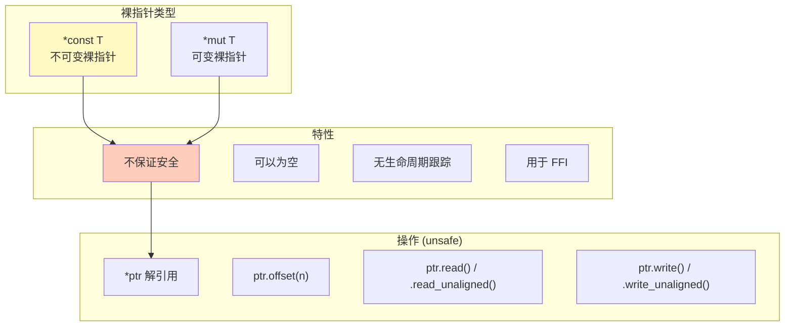

---

## 11. 函数指针

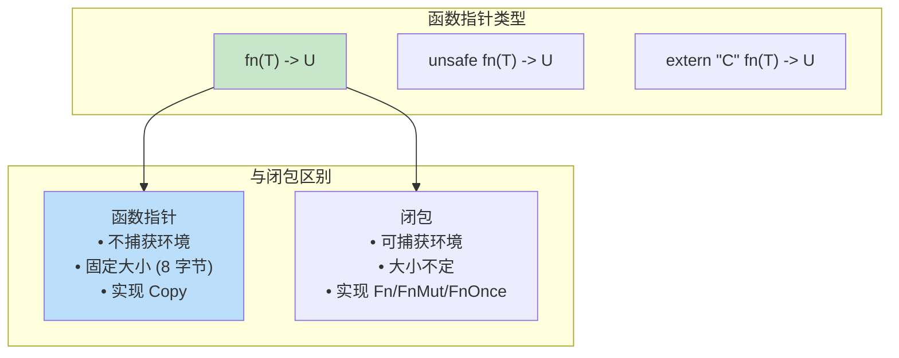

---

## 12. Never 类型 !

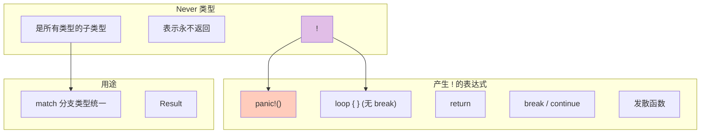

---

## 13. 类型大小总结

| 类型 | 大小 (64位) | 对齐 |
|------|------------|------|
| `bool` | 1 | 1 |
| `i8` / `u8` | 1 | 1 |
| `i16` / `u16` | 2 | 2 |
| `i32` / `u32` / `f32` | 4 | 4 |
| `i64` / `u64` / `f64` | 8 | 8 |
| `i128` / `u128` | 16 | 16 |
| `char` | 4 | 4 |
| `usize` / `isize` | 8 | 8 |
| `&T` / `*const T` | 8 | 8 |
| `&[T]` / `&str` | 16 | 8 |
| `()` | 0 | 1 |
| `[T; N]` | N × size(T) | align(T) |
| `(T1, T2)` | 带填充对齐 | max(align) |

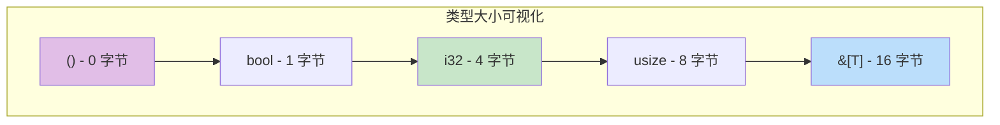
