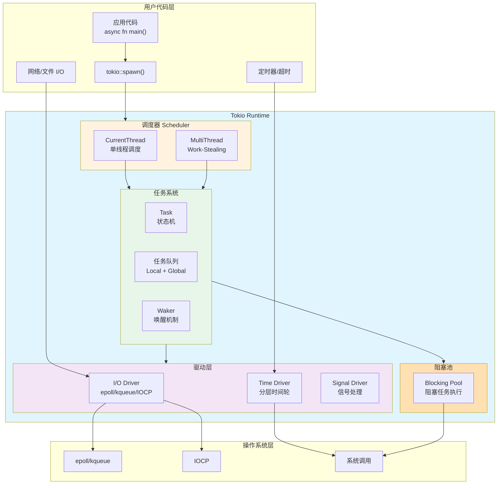
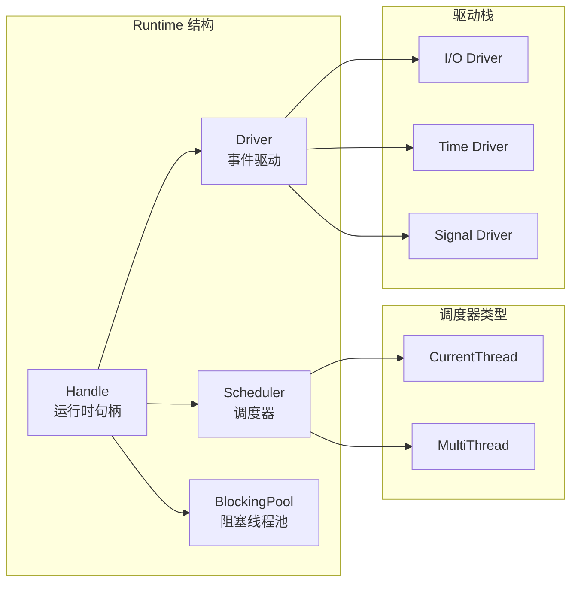
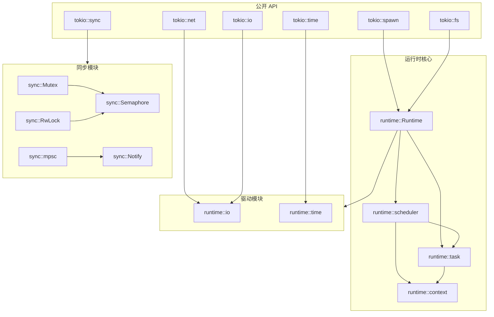
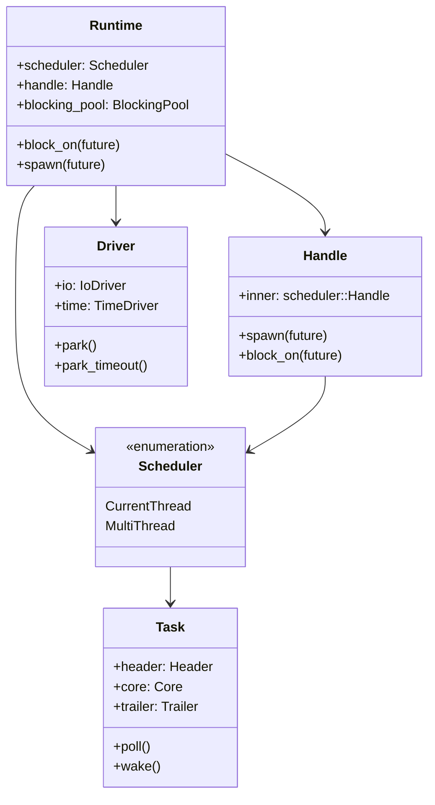
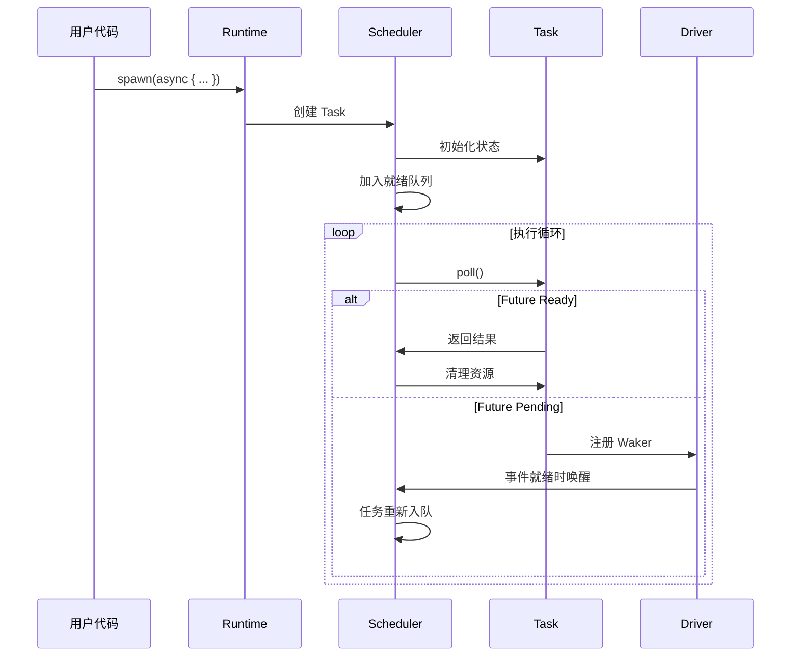
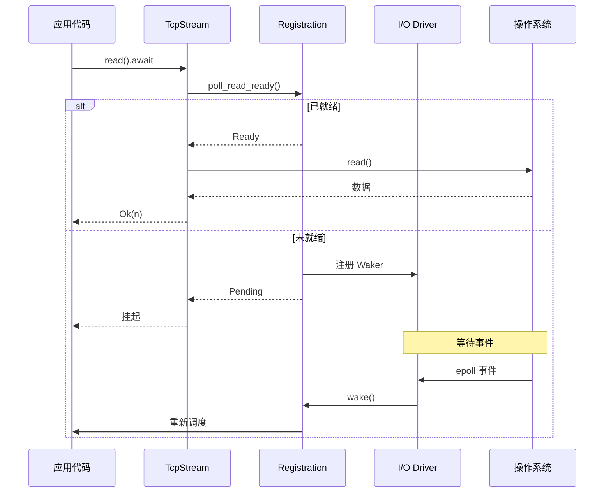
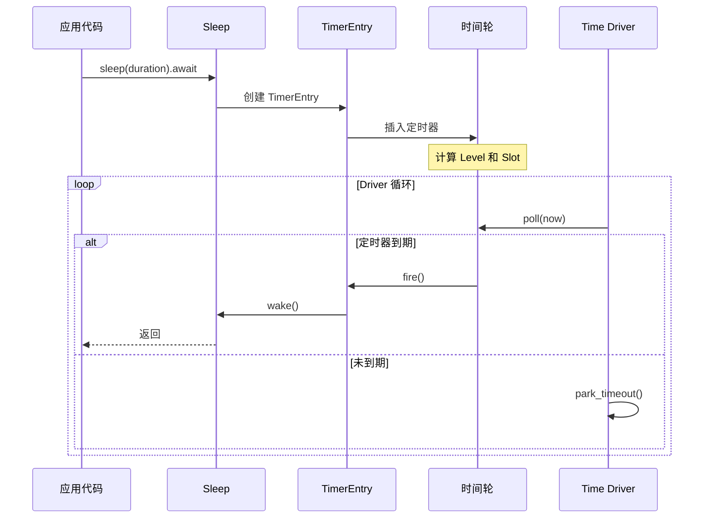
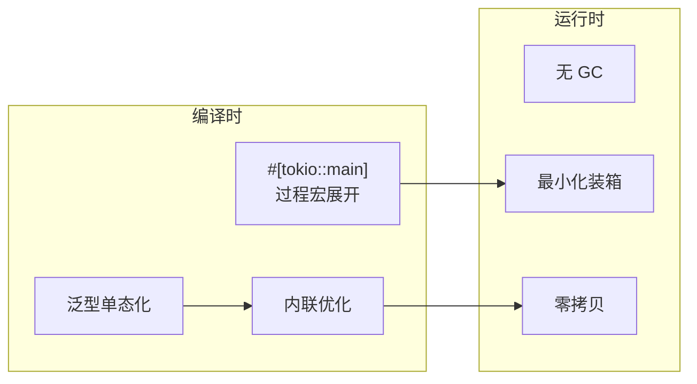
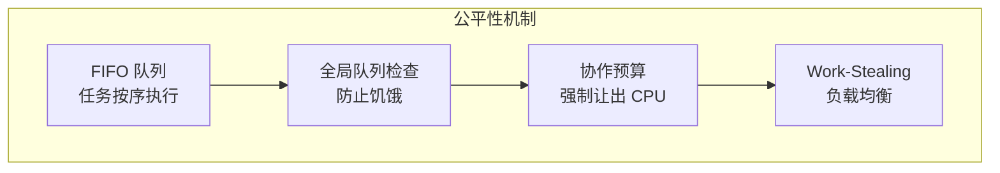
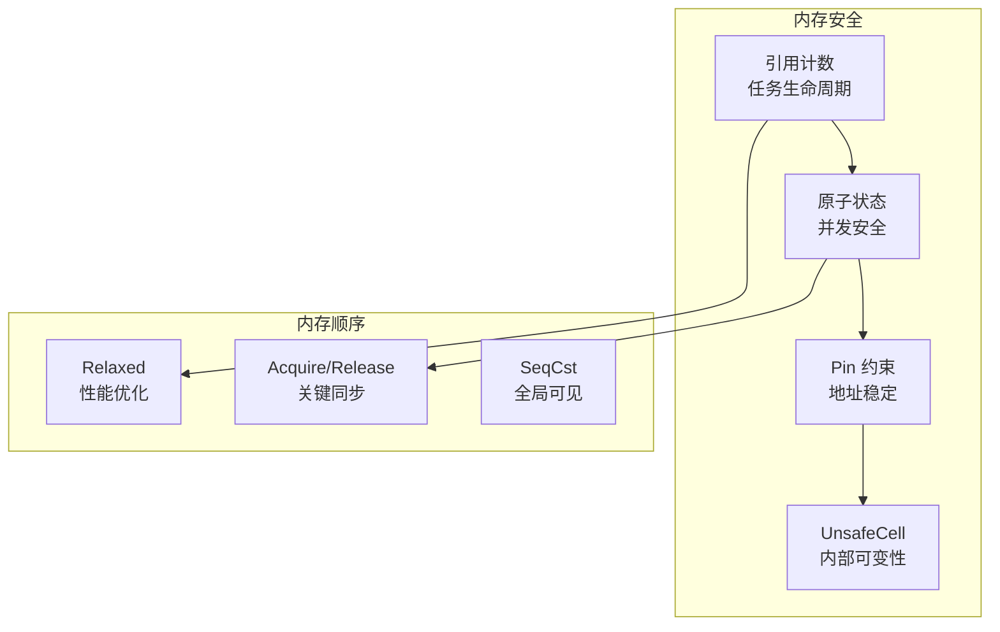

# Tokio 整体架构深度技术分析

## 目录

1. [概述](#1-概述)
2. [核心架构设计](#2-核心架构设计)
3. [模块关系图](#3-模块关系图)
4. [数据流向](#4-数据流向)
5. [设计理念](#5-设计理念)

---

## 1. 概述

Tokio 是 Rust 生态系统中最成熟的异步运行时，为编写可靠、高性能的网络应用提供了完整的基础设施。其核心设计目标是：

- **高性能**: Work-stealing 调度、零拷贝 I/O、缓存友好
- **可扩展性**: 支持从单线程到多核并行的各种场景
- **安全性**: 充分利用 Rust 类型系统保证内存和线程安全
- **易用性**: 提供符合人体工程学的 API

### 1.1 代码库结构

```
tokio/
├── tokio/                    # 核心运行时
│   └── src/
│       ├── runtime/          # 运行时核心
│       │   ├── scheduler/    # 任务调度器
│       │   ├── task/         # 任务管理
│       │   ├── io/           # I/O 驱动
│       │   └── time/         # 时间驱动
│       ├── sync/             # 同步原语
│       ├── io/               # I/O 抽象
│       ├── net/              # 网络
│       ├── fs/               # 文件系统
│       ├── time/             # 时间 API
│       ├── signal/           # 信号处理
│       └── process/          # 进程管理
├── tokio-macros/             # 过程宏
├── tokio-stream/             # Stream 扩展
├── tokio-util/               # 实用工具
└── tokio-test/               # 测试工具
```

---

## 2. 核心架构设计

### 2.1 整体架构图



### 2.2 Runtime 组成

Runtime 是 Tokio 的核心，由以下组件构成：



### 2.3 两种运行时模式

| 特性 | CurrentThread | MultiThread |
|------|---------------|-------------|
| 线程数 | 1 | 可配置 (默认 CPU 核心数) |
| 任务队列 | 单一本地队列 | 本地队列 + 全局队列 |
| Work-Stealing | 无 | 有 |
| 适用场景 | 简单应用、非 Send Future | 高并发、CPU 密集型 |
| 延迟 | 低 | 中等 |
| 吞吐量 | 中等 | 高 |

---

## 3. 模块关系图

### 3.1 模块依赖关系



### 3.2 核心类型关系



---

## 4. 数据流向

### 4.1 任务生命周期



### 4.2 I/O 操作流程



### 4.3 定时器流程



---

## 5. 设计理念

### 5.1 零成本抽象

Tokio 遵循 Rust 的零成本抽象原则：



### 5.2 公平性保证



### 5.3 内存安全模型



### 5.4 性能优化策略

| 优化策略 | 描述 | 效果 |
|---------|------|------|
| LIFO 槽 | 最近唤醒的任务优先执行 | 提高缓存命中率 |
| 批量唤醒 | WakeList 批量收集 Waker | 减少锁竞争 |
| 缓存行对齐 | 128 字节对齐 | 避免伪共享 |
| 位字段编码 | 状态 + 引用计数复用 | 减少原子操作 |
| 延迟注册 | 首次 poll 时才注册 | 减少不必要开销 |

---

## 总结

Tokio 是一个精心设计的异步运行时，其核心价值在于：

1. **分层架构**: 清晰的模块边界，易于理解和维护
2. **高性能**: Work-Stealing、LIFO 优化、分层时间轮
3. **公平性**: 数学上可证明的任务调度公平性
4. **灵活性**: 支持单线程和多线程模式
5. **安全性**: 充分利用 Rust 类型系统

后续章节将深入分析各个子系统的实现细节。
