# Tokio Runtime 运行时深度分析

## 目录

1. [Runtime 概述](#1-runtime-概述)
2. [核心数据结构](#2-核心数据结构)
3. [Runtime 生命周期](#3-runtime-生命周期)
4. [Context 上下文管理](#4-context-上下文管理)
5. [Driver 驱动栈](#5-driver-驱动栈)
6. [BlockingPool 阻塞线程池](#6-blockingpool-阻塞线程池)
7. [配置与调优](#7-配置与调优)

---

## 1. Runtime 概述

Runtime 是 Tokio 的核心组件，负责协调任务调度、I/O 事件处理和定时器管理。

### 1.1 架构总览

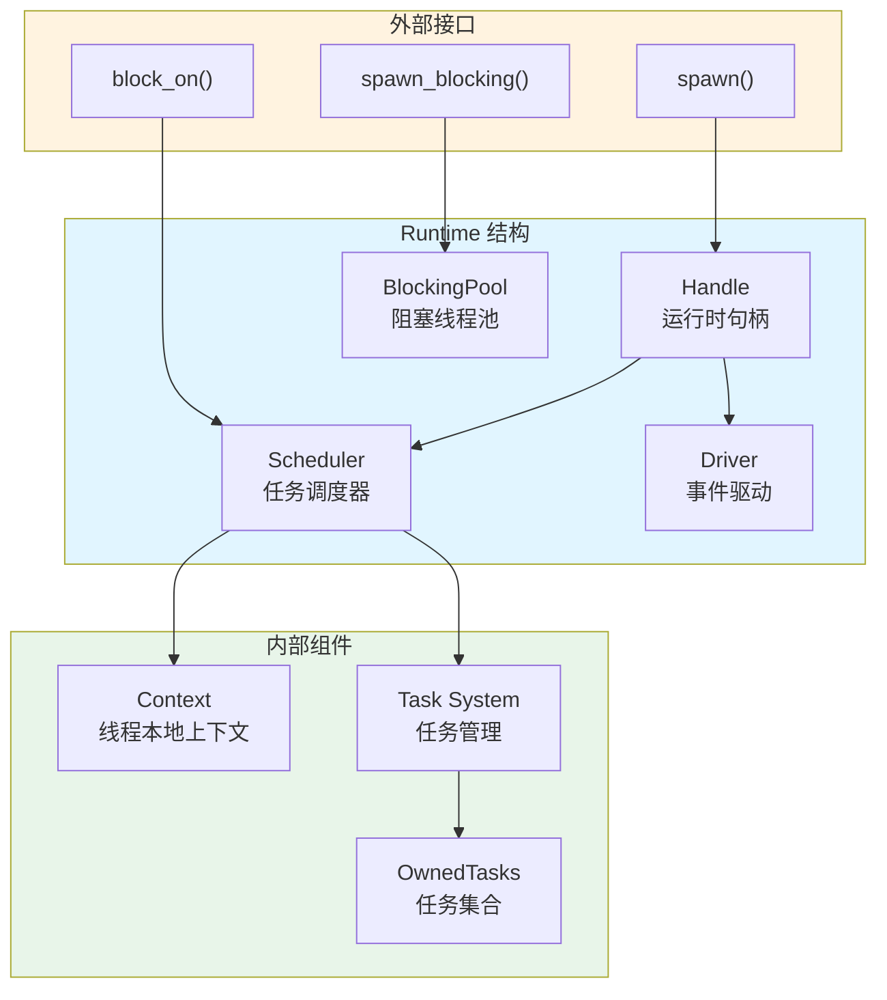

### 1.2 Runtime 变体

Tokio 提供三种 Runtime 配置：

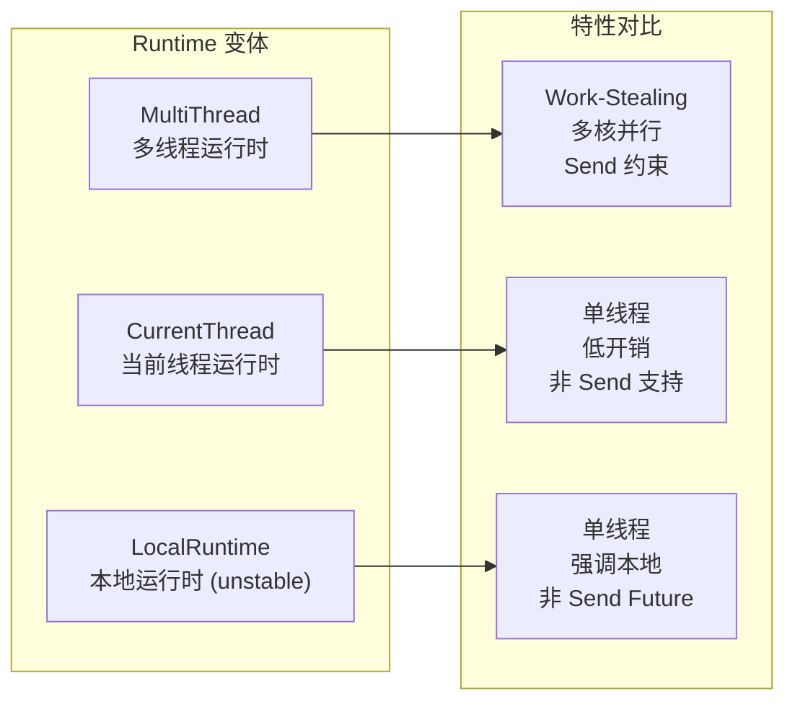

---

## 2. 核心数据结构

### 2.1 Runtime 结构

```rust
// 文件: tokio/src/runtime/runtime.rs
pub struct Runtime {
    /// 调度器 - 管理任务执行
    scheduler: Scheduler,

    /// 运行时句柄 - 提供 spawn 等 API
    handle: Handle,

    /// 阻塞线程池 - 执行阻塞操作
    blocking_pool: BlockingPool,
}

pub(crate) enum Scheduler {
    /// 当前线程调度器
    CurrentThread(CurrentThread),

    /// 多线程 Work-Stealing 调度器
    #[cfg(feature = "rt-multi-thread")]
    MultiThread(MultiThread),
}
```

### 2.2 Handle 结构

```rust
pub struct Handle {
    pub(crate) inner: scheduler::Handle,
}

pub(crate) struct scheduler::Handle {
    /// 调度器句柄
    scheduler: SchedulerHandle,

    /// 驱动句柄
    driver: driver::Handle,

    /// 阻塞任务 spawner
    blocking_spawner: blocking::Spawner,

    /// RNG 种子生成器
    seed_generator: RngSeedGenerator,

    /// 任务钩子
    task_hooks: TaskHooks,
}
```

### 2.3 结构关系图

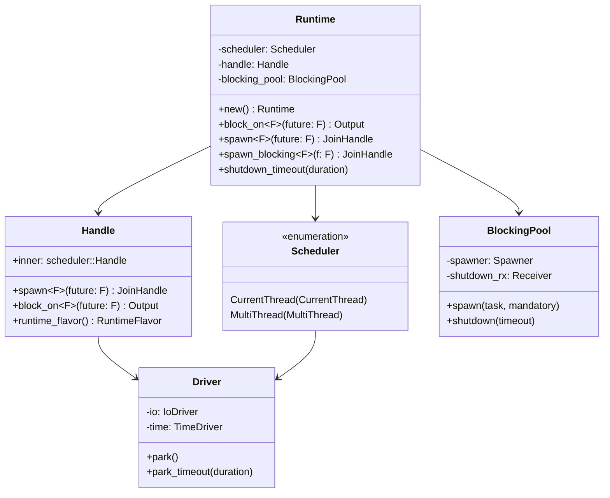

---

## 3. Runtime 生命周期

### 3.1 创建流程

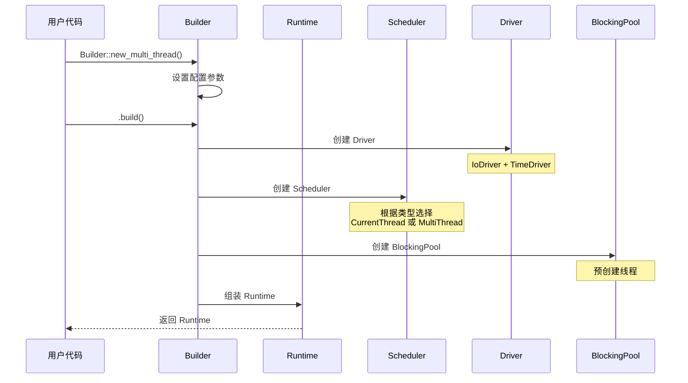

### 3.2 block_on 执行流程

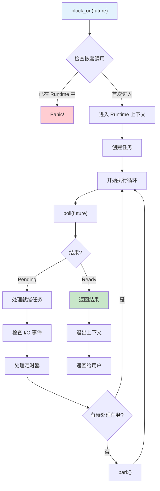

### 3.3 关闭流程

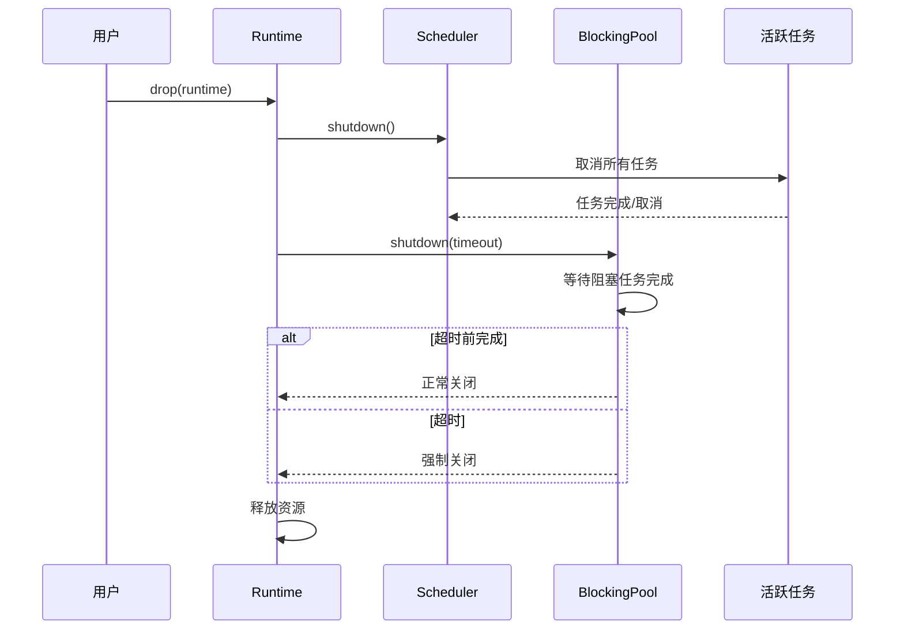

---

## 4. Context 上下文管理

### 4.1 线程本地上下文

Context 使用 thread-local 存储当前线程的运行时状态：

```rust
// 文件: tokio/src/runtime/context.rs
struct Context {
    /// 当前线程 ID
    thread_id: Cell<Option<ThreadId>>,

    /// 当前运行时句柄
    current: current::HandleCell,

    /// 调度器上下文
    scheduler: Scoped<scheduler::Context>,

    /// 当前任务 ID
    current_task_id: Cell<Option<Id>>,

    /// 运行时进入状态
    runtime: Cell<EnterRuntime>,

    /// 快速随机数生成器
    rng: Cell<Option<FastRand>>,

    /// 协作调度预算
    budget: Cell<coop::Budget>,
}
```

### 4.2 上下文层级

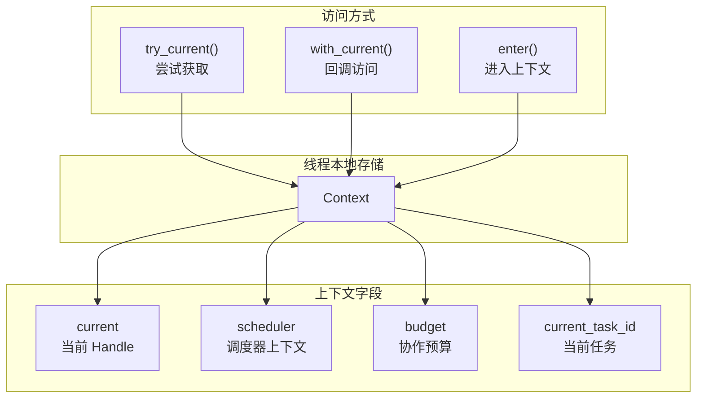

### 4.3 EnterRuntime 状态

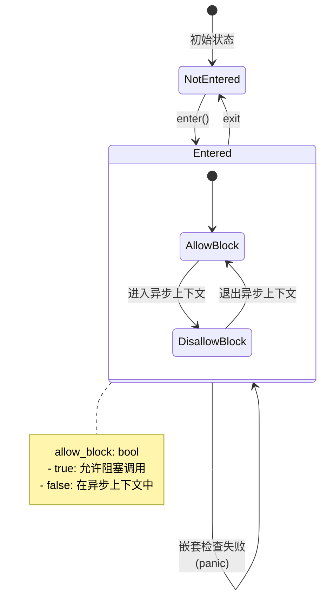

---

## 5. Driver 驱动栈

### 5.1 驱动栈结构

Driver 采用栈式组合，每层驱动包装下一层：

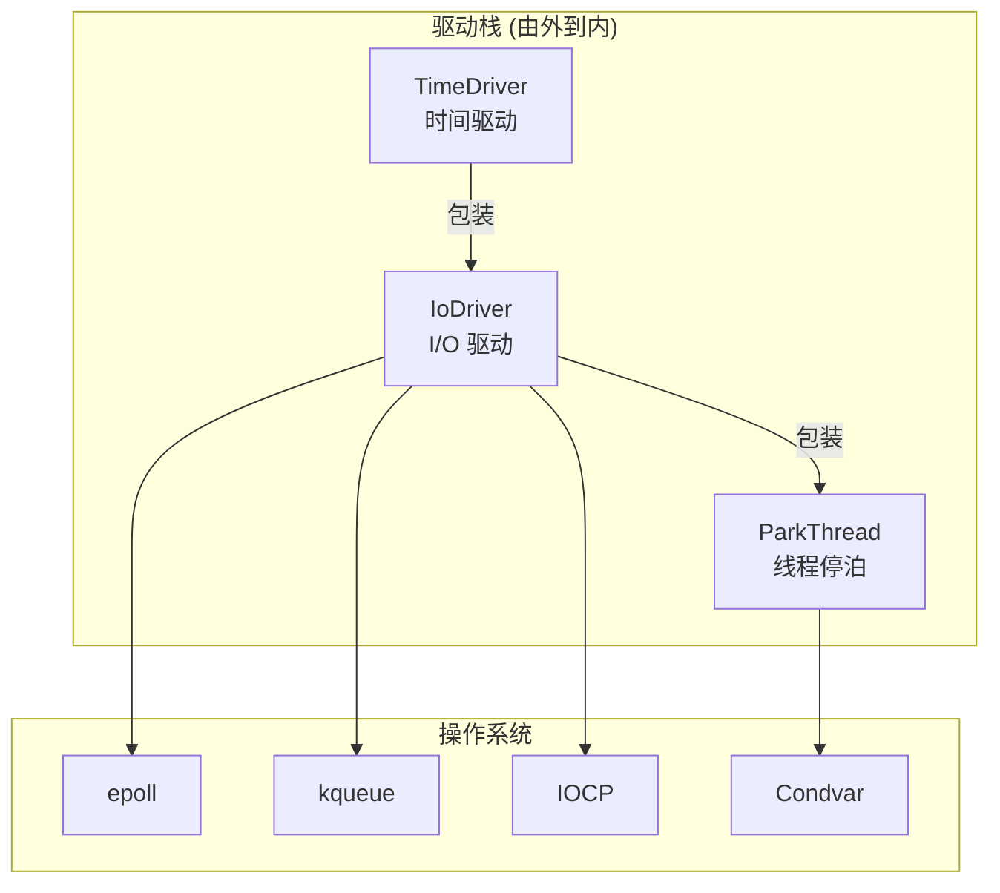

### 5.2 Driver 配置

```rust
// 文件: tokio/src/runtime/driver.rs
pub(crate) struct Cfg {
    /// 启用 I/O 驱动
    enable_io: bool,

    /// 启用时间驱动
    enable_time: bool,

    /// 允许时间暂停 (测试用)
    enable_pause_time: bool,

    /// 启动时暂停时间
    start_paused: bool,

    /// 事件队列大小
    nevents: usize,
}
```

### 5.3 Park 流程

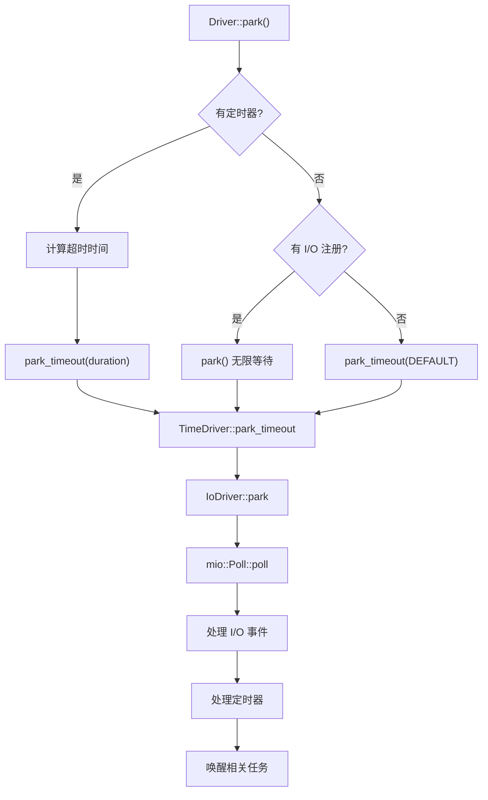

---

## 6. BlockingPool 阻塞线程池

### 6.1 设计目的

BlockingPool 用于执行阻塞操作，避免阻塞异步调度器：

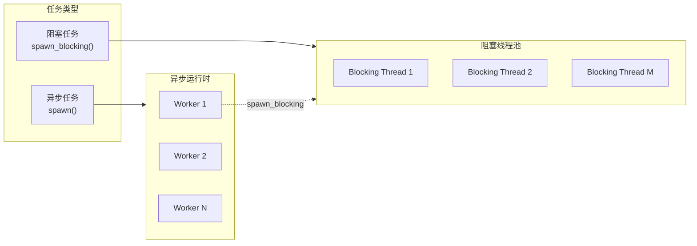

### 6.2 核心结构

```rust
pub(crate) struct BlockingPool {
    /// 任务 spawner
    spawner: Spawner,

    /// 关闭通知接收器
    shutdown_rx: shutdown::Receiver,
}

pub(crate) struct Spawner {
    inner: Arc<Inner>,
}

struct Inner {
    /// 共享状态
    shared: Mutex<Shared>,

    /// 条件变量
    condvar: Condvar,

    /// 线程名称前缀
    thread_name: ThreadNameFn,

    /// 栈大小
    stack_size: Option<usize>,

    /// 线程启动回调
    after_start: Option<Callback>,

    /// 线程停止回调
    before_stop: Option<Callback>,

    /// 线程保活时间
    keep_alive: Duration,

    /// 指标
    metrics: SpawnerMetrics,
}
```

### 6.3 线程管理策略

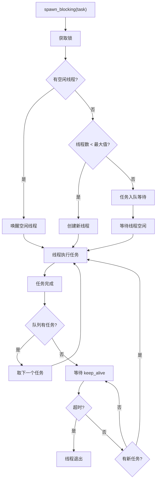

### 6.4 配置参数

| 参数 | 默认值 | 描述 |
|-----|-------|------|
| `max_blocking_threads` | 512 | 最大阻塞线程数 |
| `thread_keep_alive` | 10秒 | 空闲线程保活时间 |
| `thread_stack_size` | 系统默认 | 线程栈大小 |
| `thread_name` | "tokio-runtime-worker" | 线程名称 |

---

## 7. 配置与调优

### 7.1 Builder 配置项

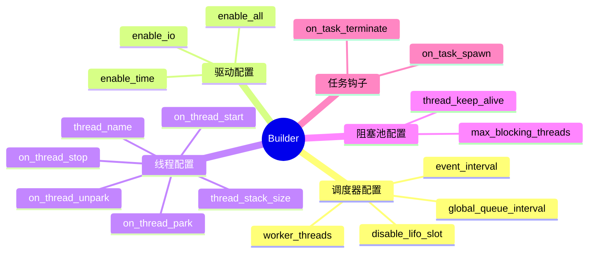

### 7.2 常用配置示例

```rust
// 高并发服务器配置
let rt = tokio::runtime::Builder::new_multi_thread()
    .worker_threads(num_cpus::get())
    .max_blocking_threads(1024)
    .enable_all()
    .thread_name("my-server")
    .on_thread_start(|| {
        // 设置线程优先级等
    })
    .build()?;

// 低延迟配置
let rt = tokio::runtime::Builder::new_multi_thread()
    .worker_threads(4)
    .global_queue_interval(31)  // 更频繁检查全局队列
    .event_interval(31)         // 更频繁检查 I/O 事件
    .build()?;

// 单线程配置
let rt = tokio::runtime::Builder::new_current_thread()
    .enable_all()
    .build()?;
```

### 7.3 性能调优建议

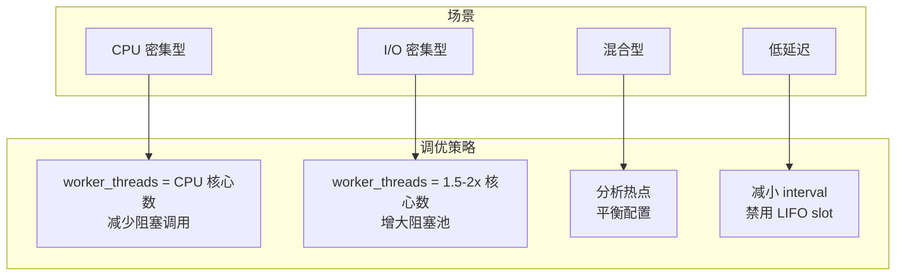

### 7.4 指标监控

```rust
// 获取运行时指标
let metrics = rt.metrics();

// 活跃任务数
println!("Active tasks: {}", metrics.active_tasks_count());

// 阻塞线程数
println!("Blocking threads: {}", metrics.num_blocking_threads());

// 空闲阻塞线程数
println!("Idle blocking: {}", metrics.num_idle_blocking_threads());

// 阻塞队列深度
println!("Blocking queue: {}", metrics.blocking_queue_depth());

// Worker 数量
println!("Workers: {}", metrics.num_workers());
```

---

## 总结

Tokio Runtime 的设计体现了以下核心理念：

1. **模块化**: 清晰的组件边界，可独立替换和测试
2. **灵活性**: 支持单线程和多线程模式
3. **可观测性**: 丰富的指标和钩子
4. **性能优先**: 缓存友好、最小化同步
5. **安全性**: 正确的生命周期管理和并发控制

后续章节将深入分析调度器、任务系统等核心组件的实现细节。
