# Tokio Scheduler 调度器架构分析

## 目录

1. [调度器概述](#1-调度器概述)
2. [CurrentThread 调度器](#2-currentthread-调度器)
3. [MultiThread 调度器](#3-multithread-调度器)
4. [Work-Stealing 算法](#4-work-stealing-算法)
5. [任务队列系统](#5-任务队列系统)
6. [空闲管理](#6-空闲管理)
7. [LIFO 优化](#7-lifo-优化)

---

## 1. 调度器概述

Tokio 提供两种调度器实现，满足不同场景需求。

### 1.1 调度器类型对比

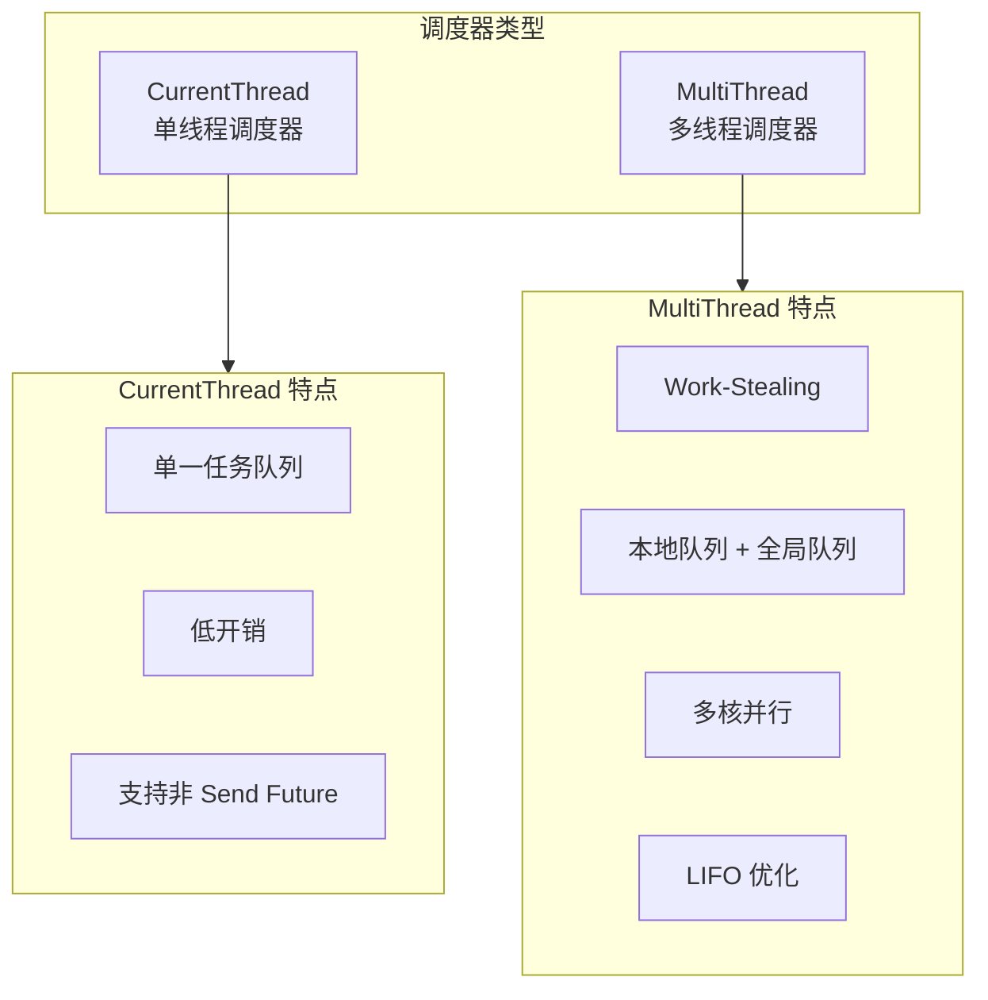

### 1.2 性能特征对比

| 特性 | CurrentThread | MultiThread |
|------|---------------|-------------|
| 线程数 | 1 | N (可配置) |
| 队列类型 | VecDeque | Local(256) + Global |
| Work-Stealing | 无 | 有 |
| LIFO 优化 | 无 | 有 |
| 延迟 | 低 | 中等 |
| 吞吐量 | 中 | 高 |
| Send 约束 | 无 | 有 |

---

## 2. CurrentThread 调度器

### 2.1 核心数据结构

```rust
// 文件: runtime/scheduler/current_thread/mod.rs
pub(crate) struct CurrentThread {
    /// 核心调度状态 (原子包装)
    core: AtomicCell<Core>,

    /// 跨线程唤醒通知
    notify: Notify,
}

struct Core {
    /// 就绪任务队列
    tasks: VecDeque<Notified>,

    /// 调度计数器
    tick: u32,

    /// I/O 和时间驱动
    driver: Option<Driver>,

    /// 性能指标
    metrics: MetricsBatch,

    /// 全局队列检查间隔
    global_queue_interval: u32,

    /// 未处理 panic 标志
    unhandled_panic: bool,
}
```

### 2.2 架构图

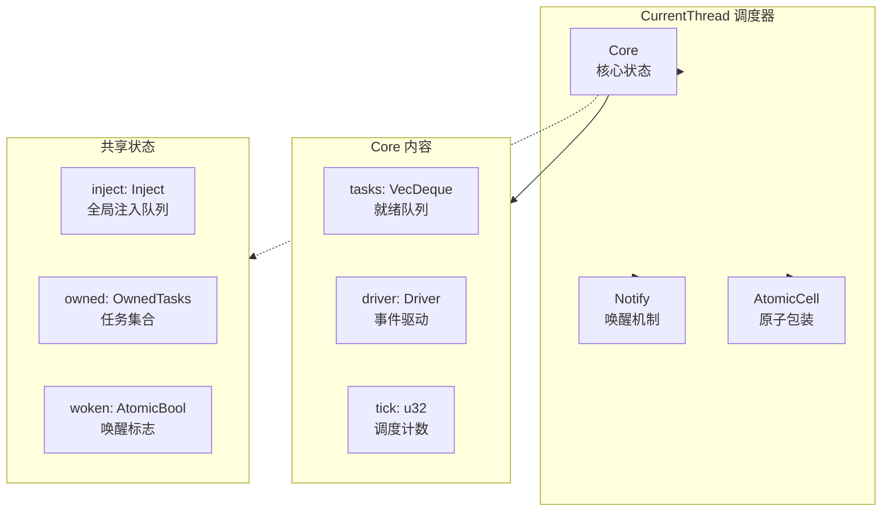

### 2.3 执行流程

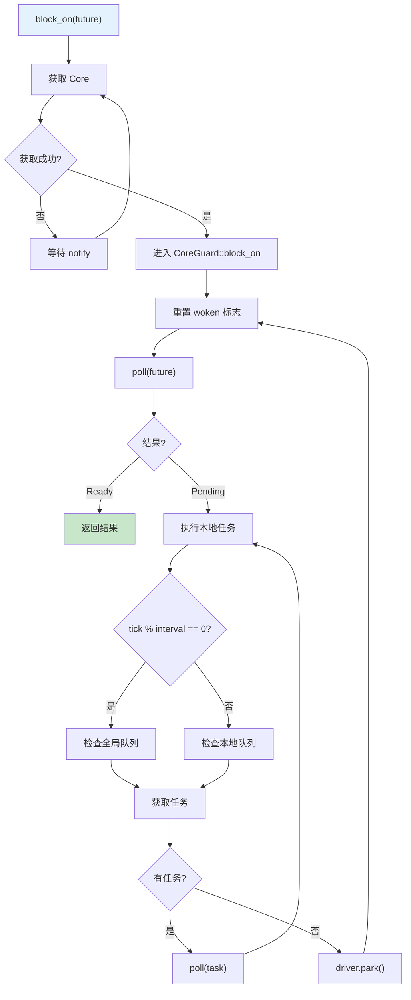

### 2.4 任务调度策略

```rust
fn next_task(&mut self, handle: &Handle) -> Option<Notified> {
    if self.tick % self.global_queue_interval == 0 {
        // 定期检查全局注入队列
        handle.next_remote_task()
            .or_else(|| self.next_local_task())
    } else {
        // 优先本地队列
        self.next_local_task()
            .or_else(|| handle.next_remote_task())
    }
}
```

---

## 3. MultiThread 调度器

### 3.1 核心数据结构

```rust
// 文件: runtime/scheduler/multi_thread/worker.rs
pub(super) struct Worker {
    /// 调度器句柄
    handle: Arc<Handle>,

    /// 工作线程编号
    index: usize,

    /// 线程本地核心
    core: AtomicCell<Core>,
}

struct Core {
    /// 运行计数
    tick: u32,

    /// LIFO 优化槽
    lifo_slot: Option<Notified>,

    /// LIFO 是否启用
    lifo_enabled: bool,

    /// 本地运行队列 (256 容量)
    run_queue: queue::Local<Arc<Handle>>,

    /// 是否在搜索任务
    is_searching: bool,

    /// 是否已关闭
    is_shutdown: bool,

    /// 线程停泊器
    park: Option<Parker>,

    /// 统计信息
    stats: Stats,

    /// 全局队列检查间隔
    global_queue_interval: u32,

    /// 快速随机数
    rand: FastRand,
}
```

### 3.2 整体架构图

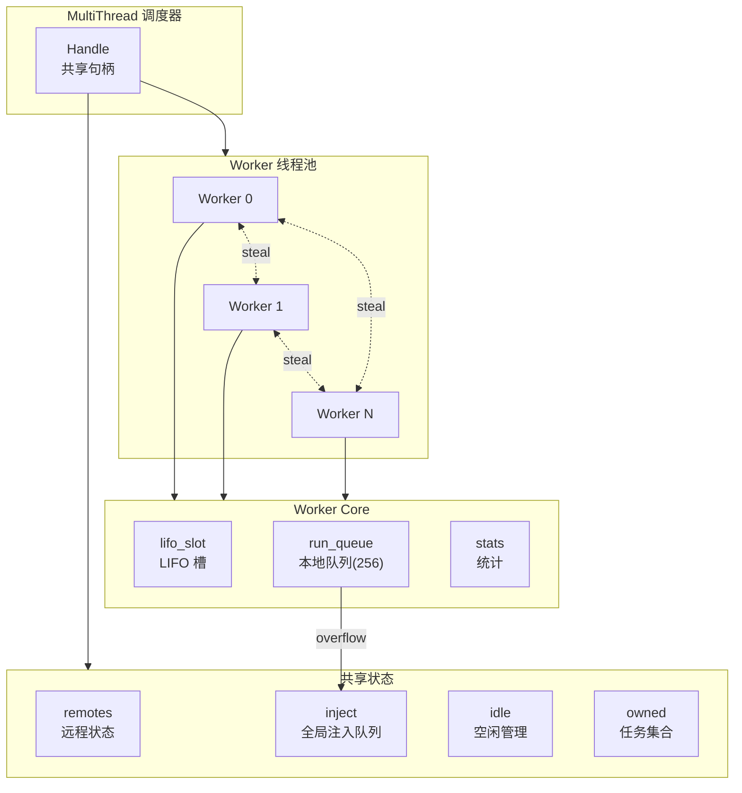

### 3.3 Worker 主循环

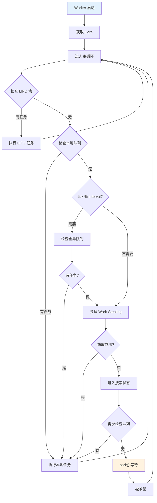

---

## 4. Work-Stealing 算法

### 4.1 算法概述

Work-Stealing 是一种负载均衡策略，空闲的 Worker 可以从繁忙的 Worker 窃取任务。

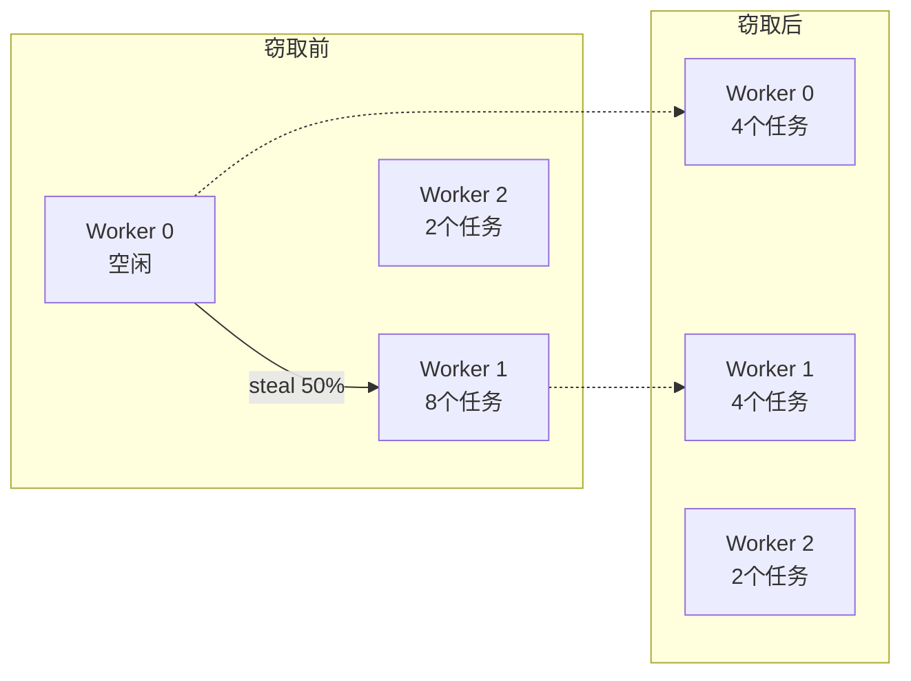

### 4.2 窃取流程

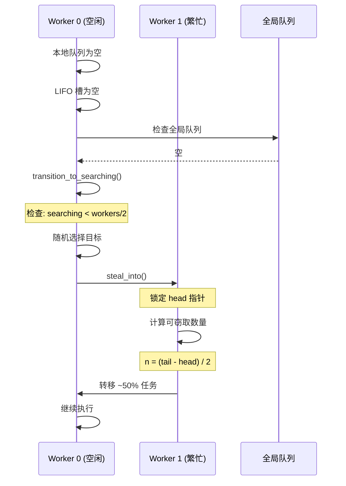

### 4.3 窃取算法实现

```rust
// 文件: runtime/scheduler/multi_thread/queue.rs
pub(crate) fn steal_into(
    &self,
    dst: &mut Local<T>,
    dst_stats: &mut Stats,
) -> Option<task::Notified<T>> {
    // 1. 检查目标队列容量
    let dst_tail = dst.inner.tail.unsync_load();
    if dst_tail.wrapping_sub(steal) > CAPACITY / 2 {
        return None;  // 目标队列已满
    }

    // 2. 原子声称任务
    let n = src_tail.wrapping_sub(src_head_real);
    let n = n - n / 2;  // 窃取 ~50%

    // 3. CAS 更新 head 指针
    match self.0.head.compare_exchange(
        prev_packed,
        pack(src_head_steal, steal_to),
        AcqRel,
        Acquire,
    ) {
        Ok(_) => { /* 成功 */ }
        Err(actual) => { /* 重试 */ }
    }

    // 4. 复制任务到目标队列
    for i in 0..n {
        // 内存复制
    }

    // 5. 完成窃取，更新指针
    Some(ret)
}
```

### 4.4 搜索频率限制

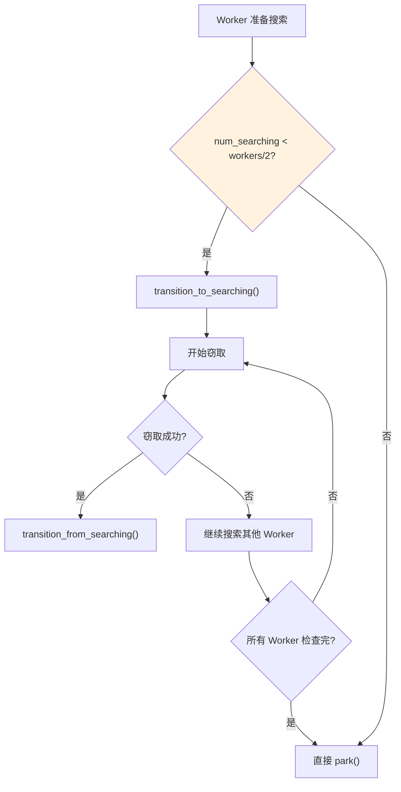

---

## 5. 任务队列系统

### 5.1 队列层级结构

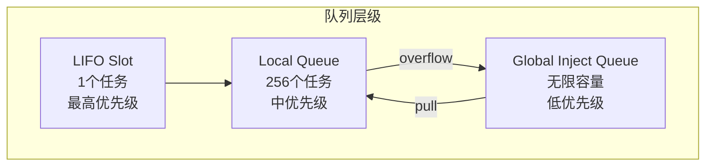

### 5.2 本地队列结构

```rust
// 文件: runtime/scheduler/multi_thread/queue.rs
pub(crate) struct Local<T: 'static> {
    inner: Arc<Inner<T>>,
}

pub(crate) struct Inner<T: 'static> {
    /// 双指针队列头
    /// MSB: steal_head (正在被窃取的位置)
    /// LSB: real_head (真实的头指针)
    head: AtomicUnsignedLong,

    /// 队列尾 (仅生产者更新)
    tail: AtomicUnsignedShort,

    /// 固定大小缓冲区
    buffer: Box<[UnsafeCell<MaybeUninit<Notified<T>>>; 256]>,
}
```

### 5.3 队列状态编码

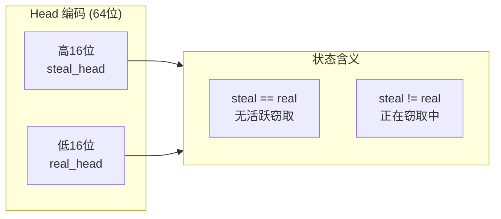

### 5.4 溢出处理

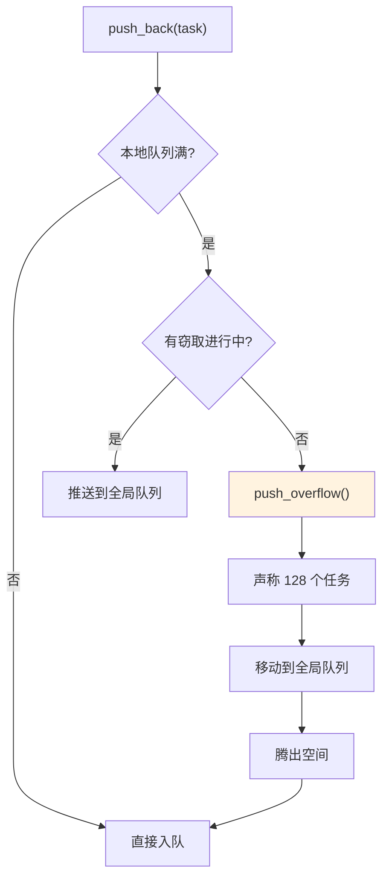

---

## 6. 空闲管理

### 6.1 空闲状态编码

```rust
// 文件: runtime/scheduler/multi_thread/idle.rs
pub(super) struct Idle {
    /// 状态编码
    /// 高16位: 未停泊的 worker 数
    /// 低16位: 正在搜索的 worker 数
    state: AtomicUsize,

    /// worker 总数
    num_workers: usize,
}
```

### 6.2 Worker 生命周期

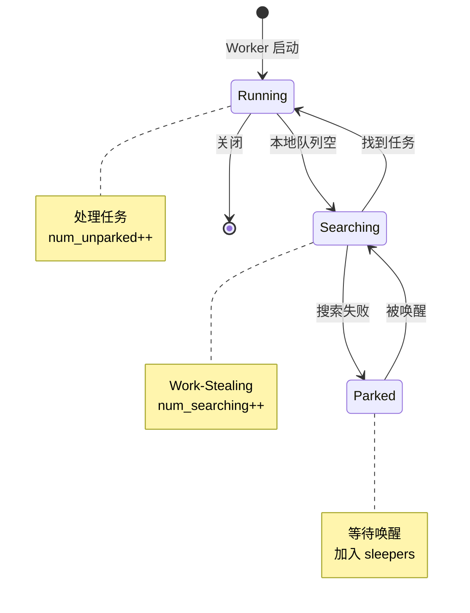

### 6.3 唤醒决策

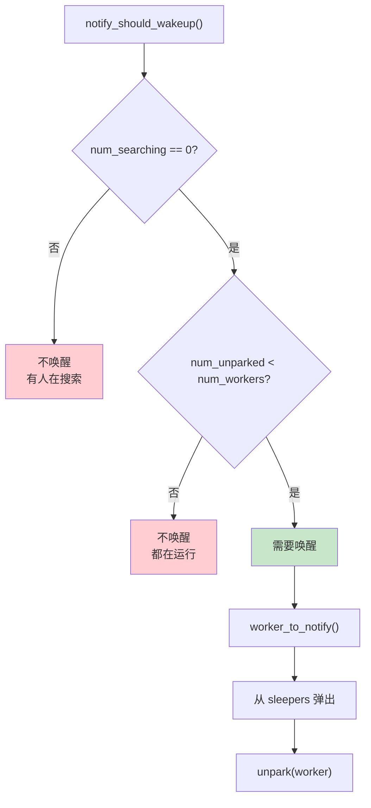

---

## 7. LIFO 优化

### 7.1 LIFO 槽设计原理

LIFO (Last In First Out) 槽用于优化消息传递场景的缓存局部性。

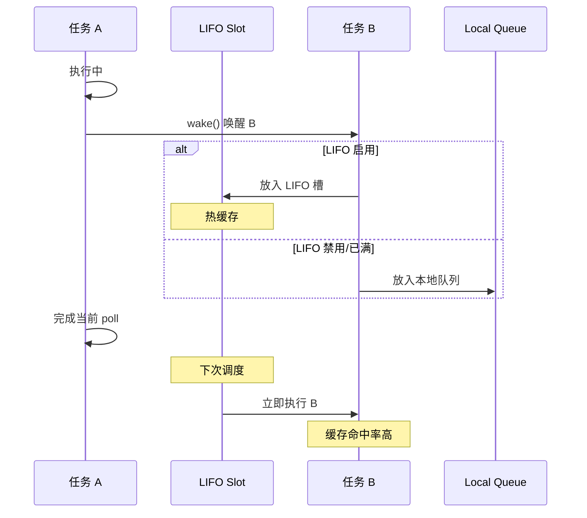

### 7.2 LIFO 调度逻辑

```rust
fn schedule_local(&self, core: &mut Core, task: Notified, is_yield: bool) {
    if is_yield || !core.lifo_enabled {
        // yield 或禁用时入队
        core.run_queue.push_back_or_overflow(task, ...);
    } else {
        // 放入 LIFO 槽
        let prev = core.lifo_slot.take();

        if let Some(prev) = prev {
            // 前一个 LIFO 任务入队
            core.run_queue.push_back_or_overflow(prev, ...);
        }

        core.lifo_slot = Some(task);
    }
}
```

### 7.3 防止 Ping-Pong 饥饿

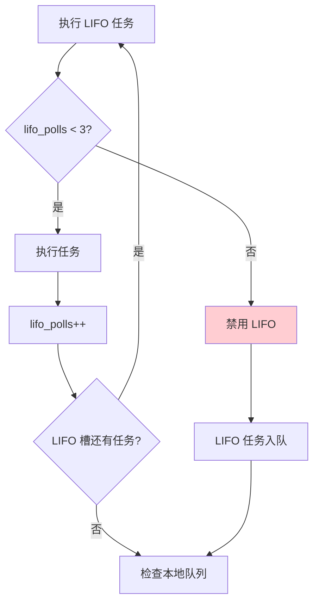

### 7.4 LIFO 优化效果

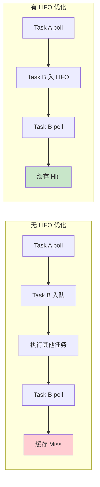

---

## 性能调优建议

### 调度器选择指南

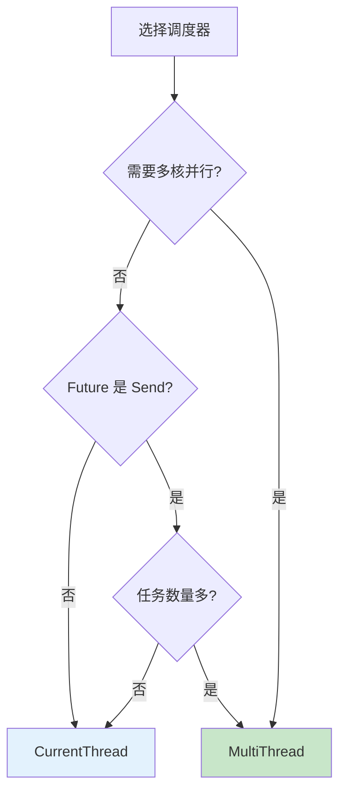

### 关键配置参数

| 参数 | 默认值 | 调优建议 |
|-----|-------|---------|
| `worker_threads` | CPU 核心数 | I/O 密集型可增加 50-100% |
| `global_queue_interval` | 自适应 | 低延迟场景减小 |
| `event_interval` | 61 | 高频 I/O 可减小 |
| `disable_lifo_slot` | false | 严格 FIFO 需求时启用 |

---

## 总结

Tokio 调度器的设计精髓在于：

1. **两种模式**: 单线程简单高效，多线程高吞吐
2. **Work-Stealing**: 自动负载均衡
3. **LIFO 优化**: 改善缓存局部性
4. **分层队列**: 平衡公平性和性能
5. **搜索限制**: 避免过度竞争
