# Tokio Task 任务系统深度分析

## 目录

1. [任务系统概述](#1-任务系统概述)
2. [任务内存布局](#2-任务内存布局)
3. [任务状态机](#3-任务状态机)
4. [引用计数机制](#4-引用计数机制)
5. [JoinHandle 实现](#5-joinhandle-实现)
6. [Waker 机制](#6-waker-机制)
7. [任务生命周期](#7-任务生命周期)

---

## 1. 任务系统概述

Tokio 任务系统是运行时的核心，负责管理异步任务的创建、执行和销毁。

### 1.1 设计目标

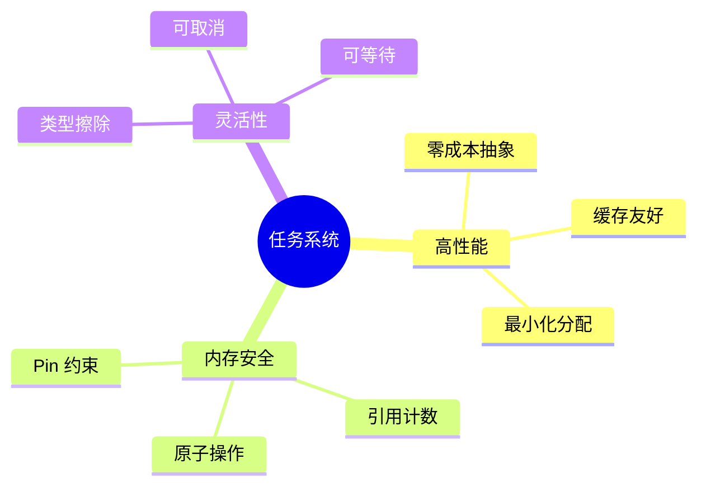

### 1.2 核心组件

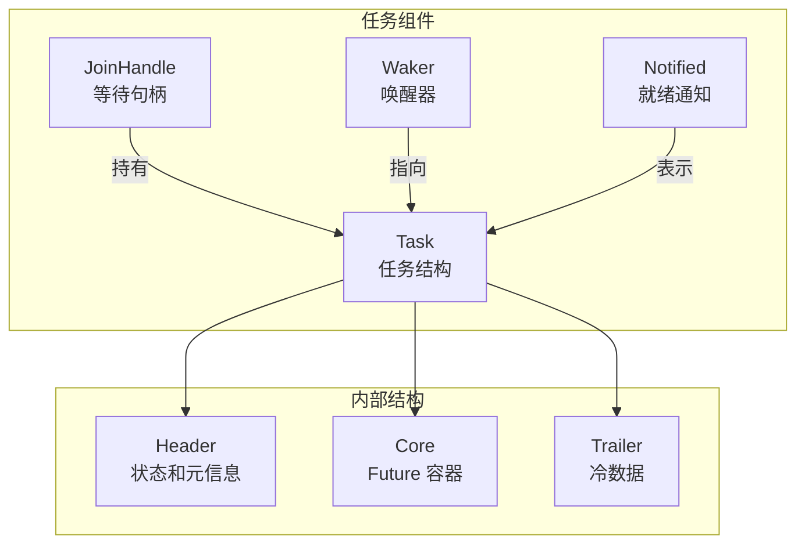

---

## 2. 任务内存布局

### 2.1 Cell 结构

任务使用单次堆分配，包含三个部分：

```rust
// 文件: runtime/task/core.rs
#[repr(C)]
pub(super) struct Cell<T: Future, S: Schedule> {
    /// 热数据 - 缓存行对齐
    pub(super) header: Header,

    /// Future 和调度器
    pub(super) core: Core<T, S>,

    /// 冷数据
    pub(super) trailer: Trailer,
}
```

### 2.2 内存布局图

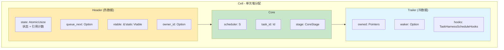

### 2.3 缓存行对齐

根据 CPU 架构选择对齐大小：

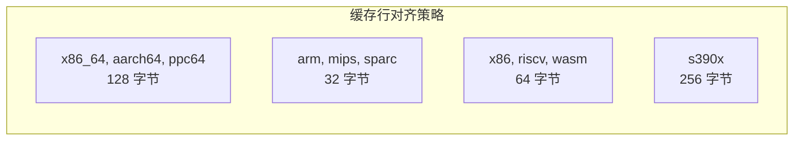

### 2.4 Stage 枚举

```rust
pub(super) enum Stage<T: Future> {
    /// Future 正在运行
    Running(T),

    /// Future 已完成，存储结果
    Finished(Result<T::Output, JoinError>),

    /// 结果已被消费
    Consumed,
}
```

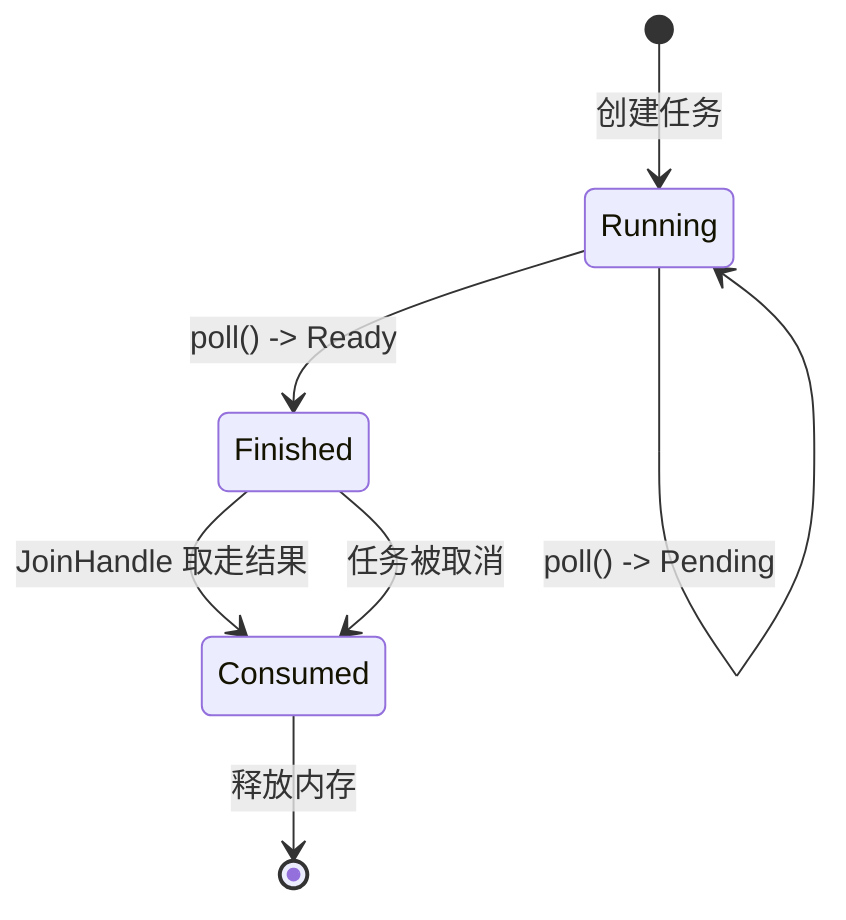

---

## 3. 任务状态机

### 3.1 状态字段编码

State 使用单个 `AtomicUsize` 存储状态标志和引用计数：

```
位布局 (64位系统):
┌────────────────────────────────┬────────┬────────┬───────────┬──────────┬──────────┬─────────┐
│        引用计数 (58位)          │CANCELLED│JOIN_WAKER│JOIN_INTEREST│NOTIFIED │ COMPLETE │ RUNNING │
│           bit 6+               │  bit 5  │  bit 4  │   bit 3    │  bit 2  │  bit 1   │  bit 0  │
└────────────────────────────────┴────────┴────────┴───────────┴──────────┴──────────┴─────────┘
```

### 3.2 状态常量

```rust
// 文件: runtime/task/state.rs
const RUNNING:       usize = 0b0000_0001;  // 任务正在 poll
const COMPLETE:      usize = 0b0000_0010;  // 任务已完成
const NOTIFIED:      usize = 0b0000_0100;  // 存在 Notified 对象
const JOIN_INTEREST: usize = 0b0000_1000;  // 存在 JoinHandle
const JOIN_WAKER:    usize = 0b0001_0000;  // 设置了 join waker
const CANCELLED:     usize = 0b0010_0000;  // 任务被取消

const REF_ONE:       usize = 0b0100_0000;  // 单个引用计数单位

// 初始状态: 3个引用 + JOIN_INTEREST + NOTIFIED
const INITIAL_STATE: usize = (REF_ONE * 3) | JOIN_INTEREST | NOTIFIED;
```

### 3.3 状态转换图

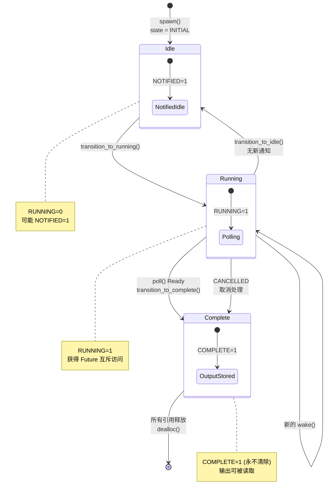

### 3.4 关键状态转换方法

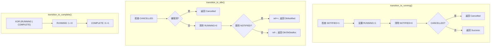

---

## 4. 引用计数机制

### 4.1 引用计数来源

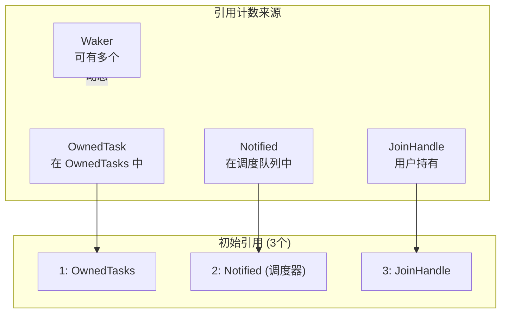

### 4.2 引用计数生命周期

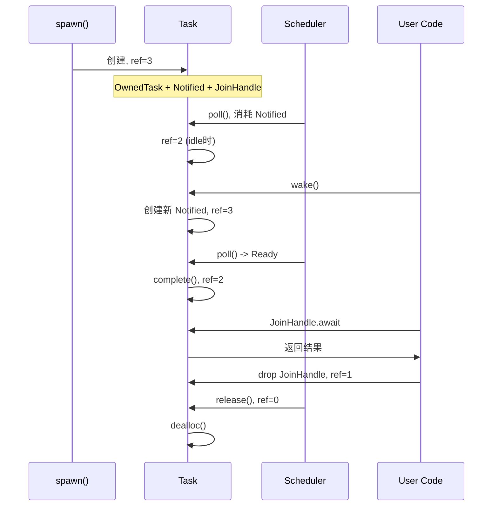

### 4.3 引用计数操作

```rust
// 增加引用 - Relaxed 顺序
fn ref_inc(&self) {
    self.val.fetch_add(REF_ONE, Ordering::Relaxed);
}

// 减少引用 - AcqRel 顺序确保可见性
fn ref_dec(&self) -> bool {
    let prev = self.val.fetch_sub(REF_ONE, Ordering::AcqRel);
    prev.ref_count() == 1  // 是否变为 0
}

// 双倍减少 (快速路径优化)
fn ref_dec_twice(&self) -> bool {
    let prev = self.val.fetch_sub(2 * REF_ONE, Ordering::AcqRel);
    prev.ref_count() == 2
}
```

---

## 5. JoinHandle 实现

### 5.1 JoinHandle 结构

```rust
// 文件: runtime/task/join.rs
pub struct JoinHandle<T> {
    raw: RawTask,
    _p: PhantomData<T>,
}
```

### 5.2 JoinHandle 功能

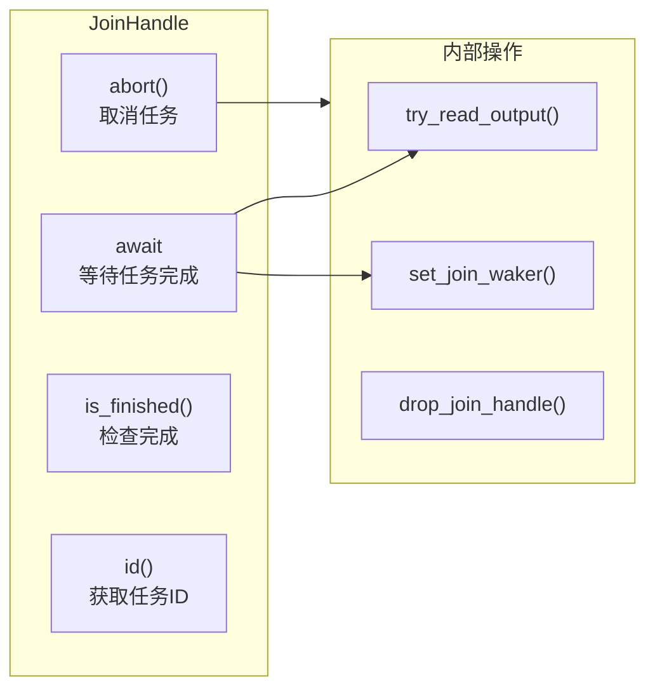

### 5.3 Future 实现

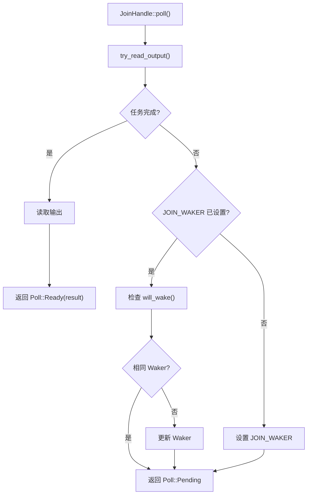

### 5.4 JOIN_WAKER 访问协议

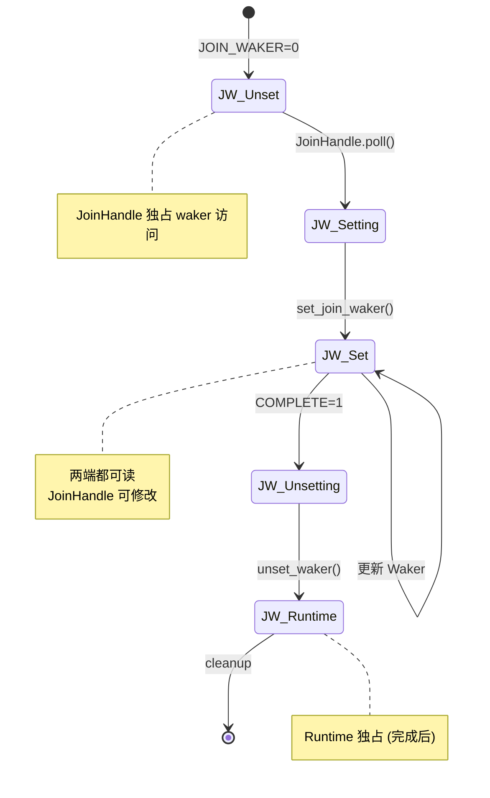

### 5.5 Drop 实现

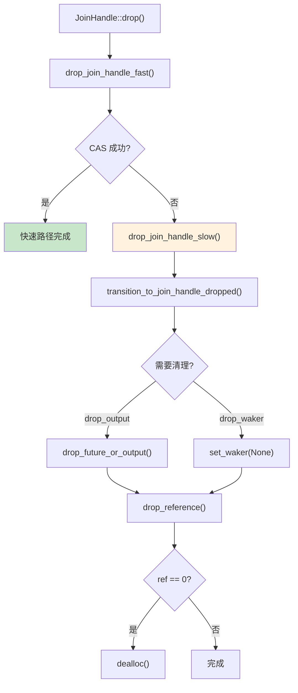

---

## 6. Waker 机制

### 6.1 Waker 创建

```rust
// 文件: runtime/task/waker.rs
pub(super) fn waker_ref<S>(header: &Header) -> WakerRef<'_>
where
    S: Schedule,
{
    let raw = RawWaker::new(
        header as *const _ as *const (),
        &RawWakerVTable::new(
            clone_waker::<S>,
            wake_by_val::<S>,
            wake_by_ref::<S>,
            drop_waker::<S>,
        ),
    );

    WakerRef::new(unsafe { Waker::from_raw(raw) })
}
```

### 6.2 Waker VTable

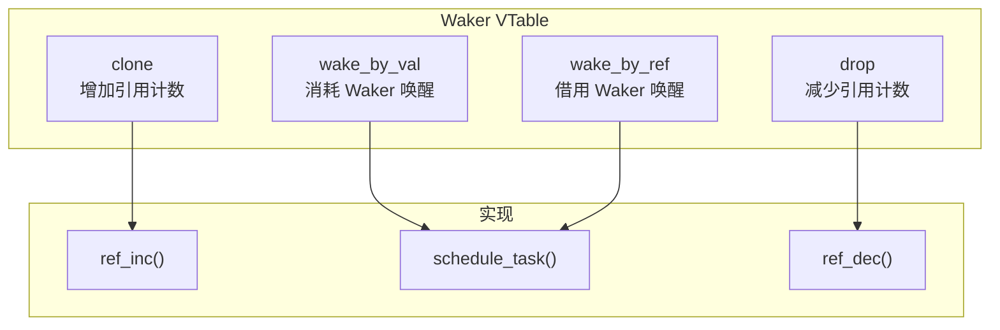

### 6.3 唤醒流程

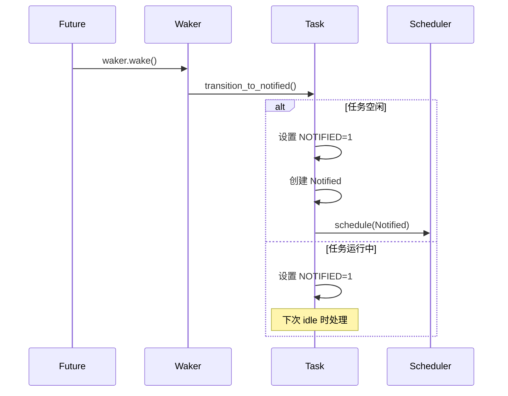

---

## 7. 任务生命周期

### 7.1 完整生命周期图

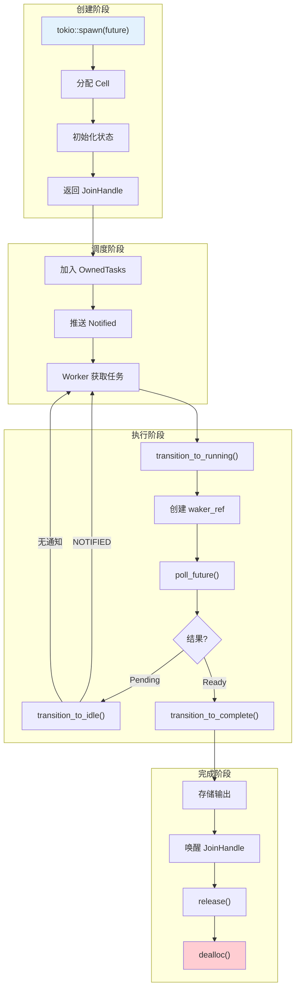

### 7.2 Harness::poll() 详细流程

```mermaid
flowchart TD
    A["Harness::poll()"] --> B["poll_inner()"]

    B --> C["transition_to_running()"]
    C --> D{转换结果?}

    D -->|Success| E["创建 waker_ref"]
    D -->|Cancelled| F["cancel_task()"]
    D -->|Failed| G["返回"]

    E --> H["poll_future()"]
    H --> I["catch_unwind 包装"]

    I --> J{poll 结果?}

    J -->|Ready(output)| K["存储输出"]
    J -->|Pending| L["transition_to_idle()"]
    J -->|Panic| M["存储 panic 信息"]

    K --> N["complete()"]
    M --> N

    L --> O{转换结果?}
    O -->|OkNotified| P["重新调度"]
    O -->|Ok| Q["返回"]
    O -->|OkDealloc| R["dealloc()"]
    O -->|Cancelled| F

    N --> S["wake_join()"]
    S --> T["release()"]
    T --> U["transition_to_terminal()"]
    U --> V{最后引用?}
    V -->|是| R
    V -->|否| Q

    F --> N

    style A fill:#e3f2fd
    style R fill:#ffcdd2
```

### 7.3 取消流程

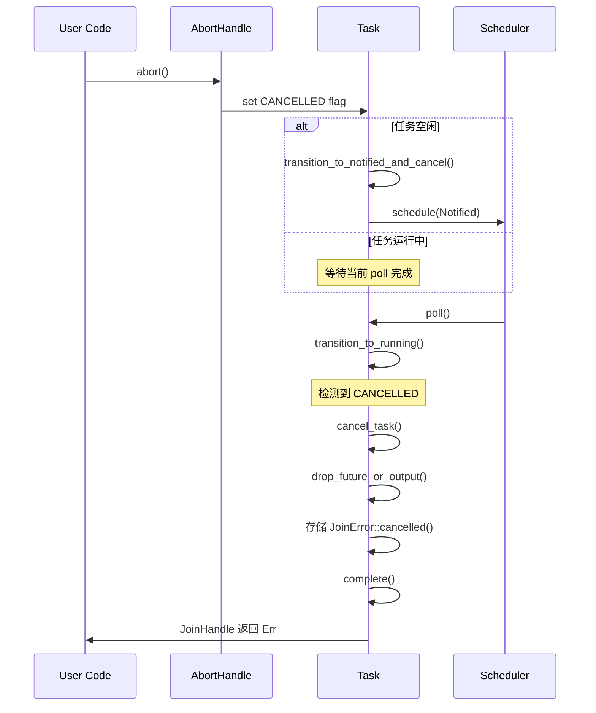

---

## 类型擦除机制

### Vtable 结构

```rust
// 文件: runtime/task/raw.rs
pub(super) struct Vtable {
    /// 轮询任务
    pub(super) poll: unsafe fn(NonNull<Header>),

    /// 调度任务
    pub(super) schedule: unsafe fn(NonNull<Header>),

    /// 释放内存
    pub(super) dealloc: unsafe fn(NonNull<Header>),

    /// 尝试读取输出
    pub(super) try_read_output: unsafe fn(NonNull<Header>, *mut (), &Waker),

    /// 慢速路径 drop JoinHandle
    pub(super) drop_join_handle_slow: unsafe fn(NonNull<Header>),

    /// drop AbortHandle
    pub(super) drop_abort_handle: unsafe fn(NonNull<Header>),

    /// 关闭任务
    pub(super) shutdown: unsafe fn(NonNull<Header>),

    /// 字段偏移量
    pub(super) trailer_offset: usize,
    pub(super) scheduler_offset: usize,
    pub(super) id_offset: usize,
}
```

### 类型擦除流程

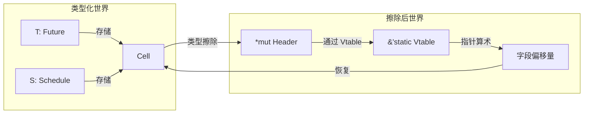

---

## 性能优化

### 关键优化点

| 优化 | 描述 | 效果 |
|-----|------|------|
| 单次分配 | 整个 Cell 一次分配 | 减少碎片 |
| 缓存对齐 | Header 独立缓存行 | 减少伪共享 |
| 位字段 | 状态+引用计数复用 | 减少原子操作 |
| 快速路径 | JoinHandle drop 优化 | 减少锁竞争 |
| Relaxed 顺序 | 引用计数增加 | 提高性能 |

---

## 总结

Tokio 任务系统的设计精髓：

1. **零成本抽象**: 通过 Vtable 实现类型擦除，无运行时开销
2. **内存效率**: 单次分配、位字段紧凑、缓存对齐
3. **并发安全**: 精细的内存顺序控制
4. **灵活性**: 支持取消、超时、等待
5. **可观测性**: 任务 ID、追踪支持
