# Tokio I/O Driver 驱动架构分析

## 目录

1. [I/O Driver 概述](#1-io-driver-概述)
2. [核心数据结构](#2-核心数据结构)
3. [Registration 机制](#3-registration-机制)
4. [ScheduledIo 状态管理](#4-scheduledio-状态管理)
5. [事件处理流程](#5-事件处理流程)
6. [与 Mio 集成](#6-与-mio-集成)
7. [性能优化](#7-性能优化)

---

## 1. I/O Driver 概述

Tokio I/O Driver 基于 Mio 库实现跨平台异步 I/O，采用事件驱动的反应器模式。

### 1.1 架构层次

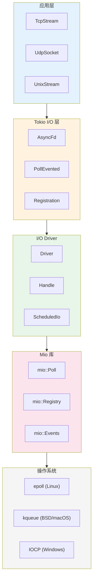

### 1.2 设计目标

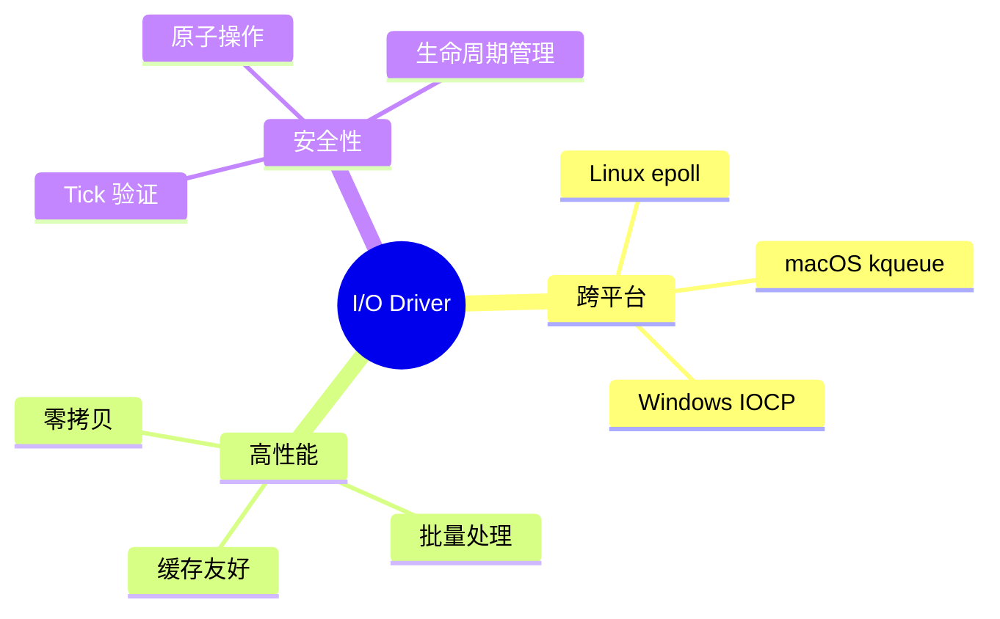

---

## 2. 核心数据结构

### 2.1 Driver 结构

```rust
// 文件: runtime/io/driver.rs
pub(crate) struct Driver {
    /// 是否接收到信号令牌
    signal_ready: bool,

    /// 复用的事件缓冲区
    events: mio::Events,

    /// 操作系统级别的事件轮询器
    poll: mio::Poll,
}
```

### 2.2 Handle 结构

```rust
pub(crate) struct Handle {
    /// 操作系统事件注册中心
    registry: mio::Registry,

    /// 所有注册的追踪
    registrations: RegistrationSet,

    /// 需要同步的状态
    synced: Mutex<registration_set::Synced>,

    /// 唤醒停滞的反应器
    waker: mio::Waker,

    /// 驱动指标
    metrics: IoDriverMetrics,
}
```

### 2.3 结构关系图

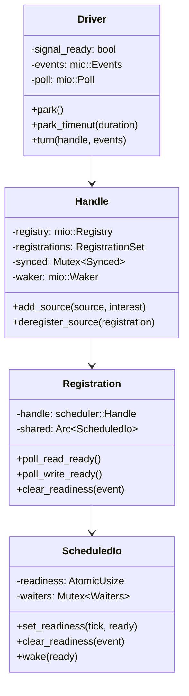

---

## 3. Registration 机制

### 3.1 Registration 结构

```rust
// 文件: runtime/io/registration.rs
pub(crate) struct Registration {
    /// 运行时句柄
    handle: scheduler::Handle,

    /// 指向 Driver 中的共享状态
    shared: Arc<ScheduledIo>,
}
```

### 3.2 注册流程

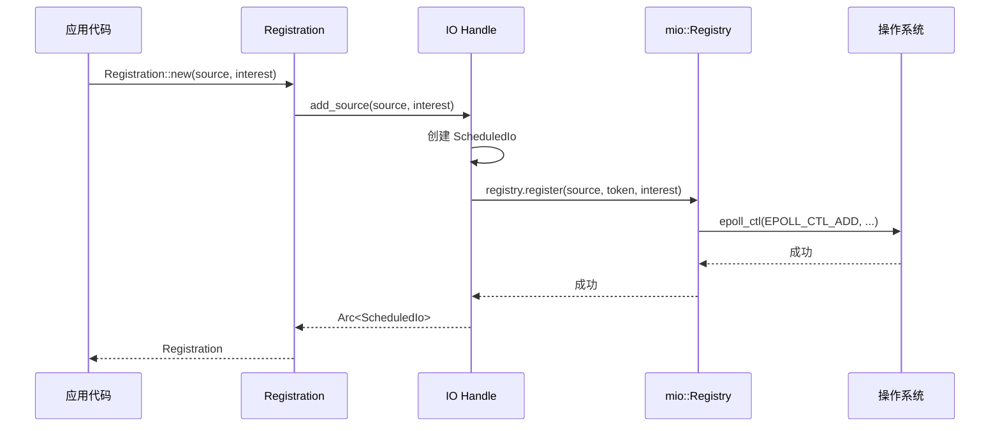

### 3.3 poll_read_ready 流程

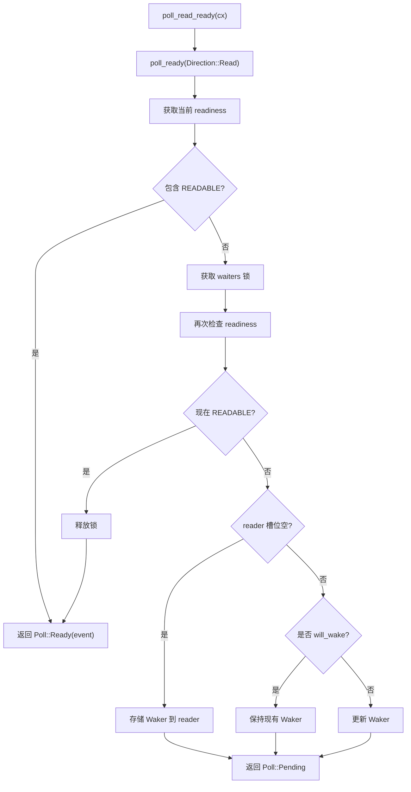

---

## 4. ScheduledIo 状态管理

### 4.1 ScheduledIo 结构

```rust
// 文件: runtime/io/scheduled_io.rs
pub(crate) struct ScheduledIo {
    /// 链表指针 (用于 RegistrationSet)
    linked_list_pointers: UnsafeCell<linked_list::Pointers<Self>>,

    /// 打包的就绪状态
    readiness: AtomicUsize,

    /// 等待者列表
    waiters: Mutex<Waiters>,
}

struct Waiters {
    /// AsyncRead 快速路径
    reader: Option<Waker>,

    /// AsyncWrite 快速路径
    writer: Option<Waker>,

    /// 通用等待者链表
    list: WaitList,
}
```

### 4.2 Readiness 位编码

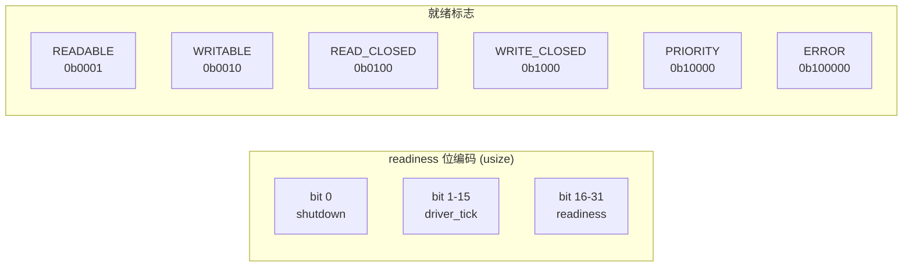

### 4.3 Tick 验证机制

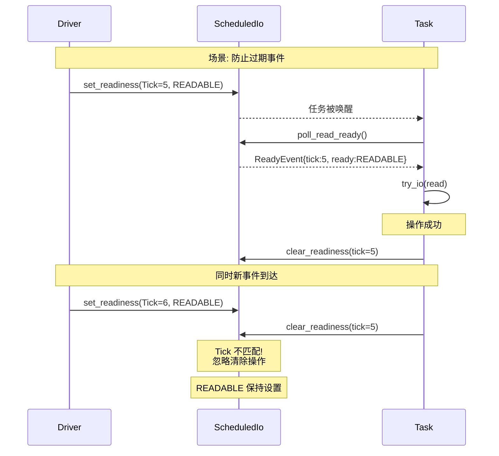

### 4.4 状态转换

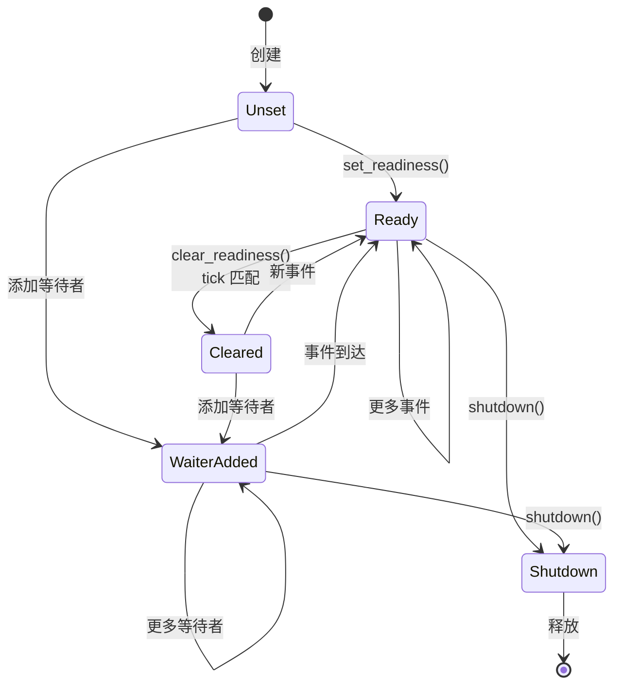

---

## 5. 事件处理流程

### 5.1 Driver::turn 主循环

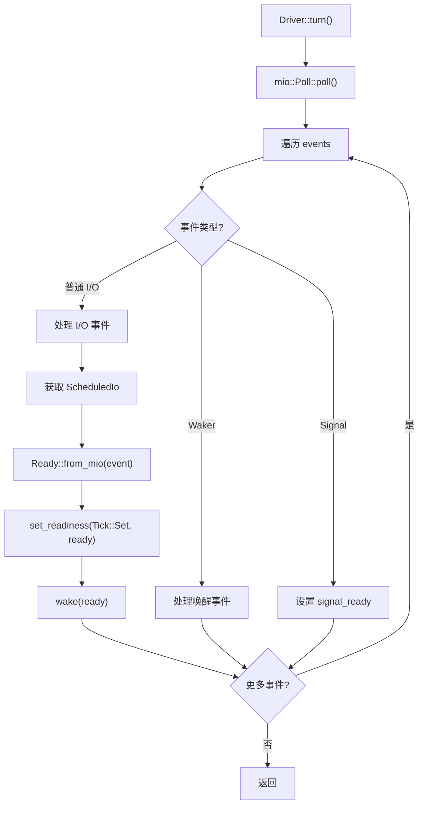

### 5.2 唤醒流程详解

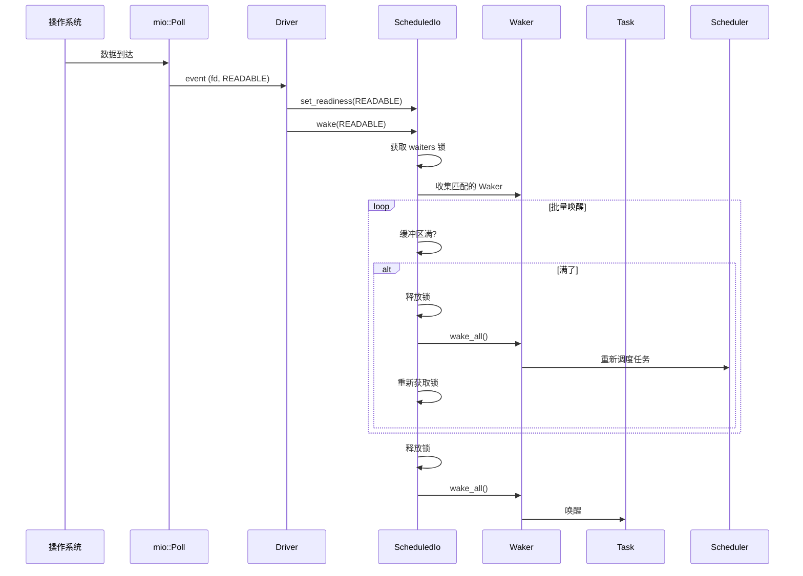

### 5.3 完整 I/O 操作流程

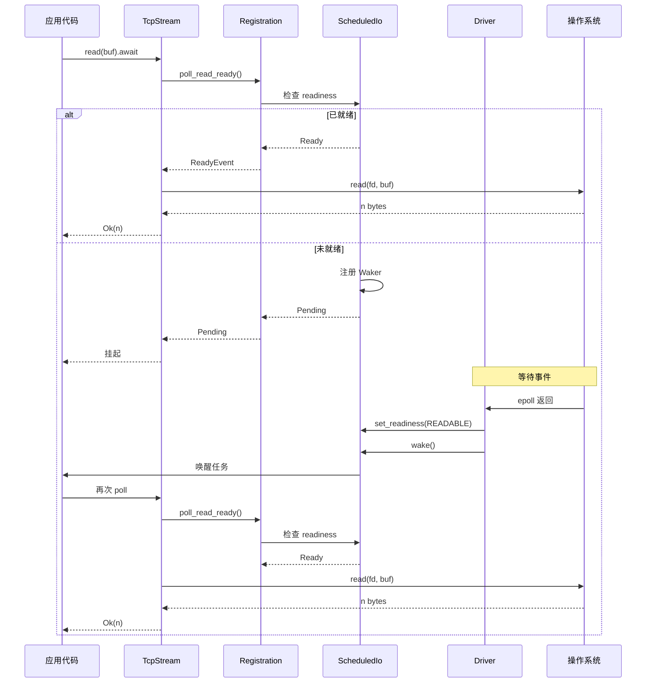

---

## 6. 与 Mio 集成

### 6.1 平台抽象

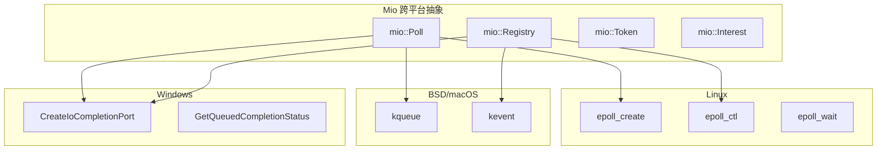

### 6.2 Token 映射

```rust
// Token 直接存储 ScheduledIo 指针
let token = mio::Token(Arc::as_ptr(&scheduled_io) as usize);

// 从 Token 恢复 ScheduledIo
let scheduled_io = unsafe {
    &*(token.0 as *const ScheduledIo)
};
```

### 6.3 Interest 转换

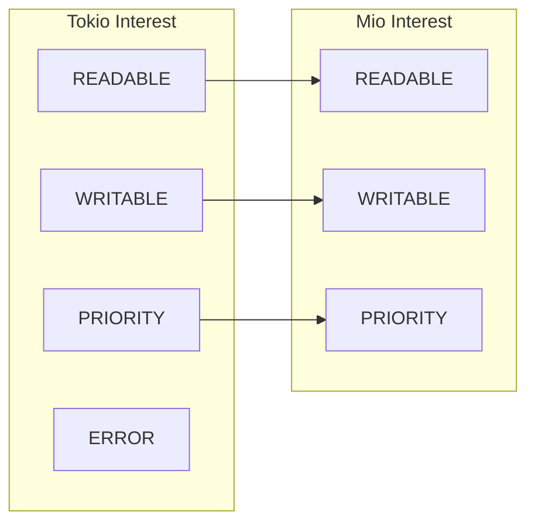

---

## 7. 性能优化

### 7.1 缓存行对齐

```rust
// 根据架构选择对齐大小
#[cfg_attr(
    any(target_arch = "x86_64", target_arch = "aarch64"),
    repr(align(128))
)]
pub(crate) struct ScheduledIo {
    // ...
}
```

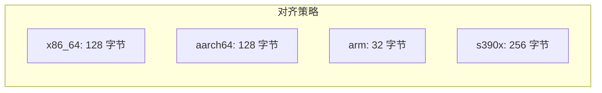

### 7.2 两层唤醒机制

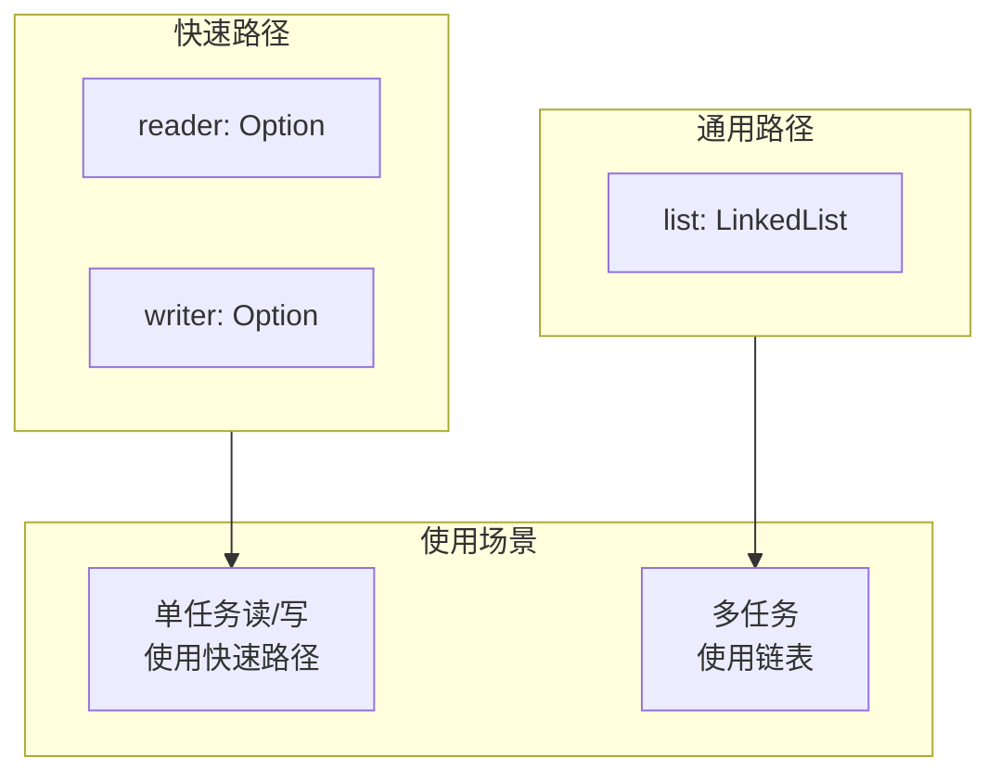

### 7.3 批量唤醒

```rust
pub(super) fn wake(&self, ready: Ready) {
    // 栈上缓冲区，容量 32
    let mut wakers = WakeList::new();
    let mut waiters = self.waiters.lock();

    // 收集 Waker
    loop {
        // ...收集匹配的 Waker...

        // 缓冲区满时释放锁并唤醒
        if !wakers.can_push() {
            drop(waiters);
            wakers.wake_all();
            waiters = self.waiters.lock();
        }
    }

    drop(waiters);
    wakers.wake_all();
}
```

### 7.4 延迟释放机制

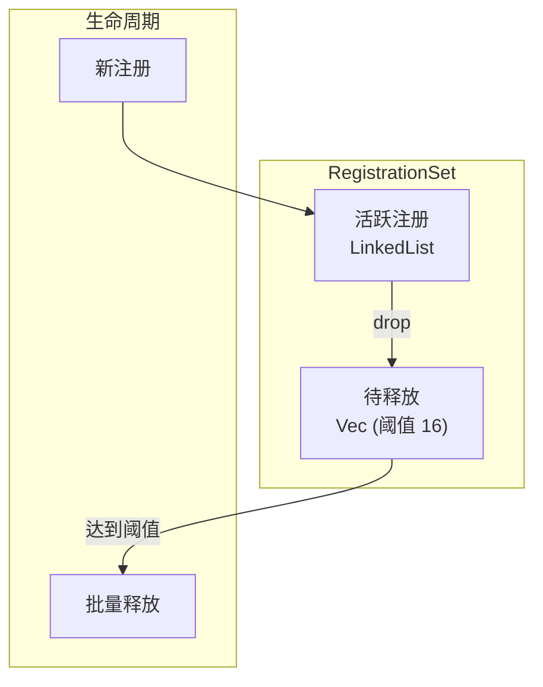

---

## 性能特性总结

| 特性 | 复杂度 | 说明 |
|-----|--------|------|
| set_readiness | O(1) | 单次原子操作 |
| poll_readiness | O(1) | 检查状态 |
| wake (单任务) | O(1) | 快速路径 |
| wake (多任务) | O(n) | 遍历等待者 |
| Token 查找 | O(1) | 指针直接转换 |

---

## 总结

Tokio I/O Driver 的设计精髓：

1. **跨平台**: 通过 Mio 抽象不同操作系统
2. **高效唤醒**: 两层机制优化单任务场景
3. **安全性**: Tick 验证防止竞态条件
4. **缓存友好**: 对齐和批量处理
5. **零拷贝**: 直接指针作为 Token
