# Tokio Time Driver 时间驱动架构分析

## 目录

1. [时间驱动概述](#1-时间驱动概述)
2. [分层时间轮算法](#2-分层时间轮算法)
3. [TimerEntry 状态机](#3-timerentry-状态机)
4. [Sleep 和 Timeout](#4-sleep-和-timeout)
5. [Time Driver 实现](#5-time-driver-实现)
6. [性能优化](#6-性能优化)

---

## 1. 时间驱动概述

Tokio Time Driver 基于分层时间轮 (Hierarchical Timing Wheel) 算法，提供高效的定时器管理。

### 1.1 设计目标

```mermaid
mindmap
    root((Time Driver))
        高性能
            O(1) 插入
            O(1) 取消
            批量处理
        精确性
            毫秒级精度
            年级别范围
        灵活性
            Sleep
            Timeout
            Interval
```

### 1.2 核心组件

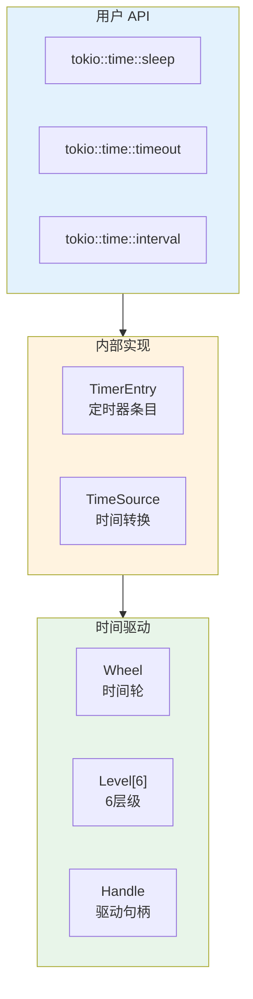

---

## 2. 分层时间轮算法

### 2.1 时间轮结构

时间轮采用 6 层设计，每层 64 个槽位：

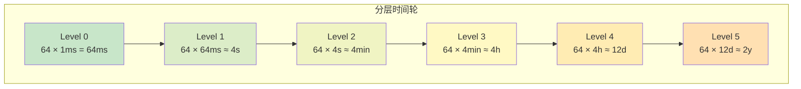

### 2.2 核心数据结构

```rust
// 文件: runtime/time/wheel/mod.rs
pub(crate) struct Wheel {
    /// 当前时间 (毫秒)
    elapsed: u64,

    /// 6 层级
    levels: Box<[Level; NUM_LEVELS]>,

    /// 待触发的定时器
    pending: EntryList,
}

// 文件: runtime/time/wheel/level.rs
pub(crate) struct Level {
    /// 层级号 (0-5)
    level: usize,

    /// 占用位图 (64位，标记哪些槽有定时器)
    occupied: u64,

    /// 64 个槽位
    slot: [EntryList; LEVEL_MULT],
}
```

### 2.3 Level 选择算法

```rust
fn level_for(elapsed: u64, when: u64) -> usize {
    const SLOT_MASK: u64 = (1 << 6) - 1;

    // XOR 找出不同的位
    let mut masked = elapsed ^ when | SLOT_MASK;

    if masked >= MAX_DURATION {
        masked = MAX_DURATION - 1;
    }

    // 计算最高有效位
    let leading_zeros = masked.leading_zeros() as usize;
    let significant = 63 - leading_zeros;

    // 除以 6 得到 Level
    significant / NUM_LEVELS
}
```

### 2.4 Level 选择可视化

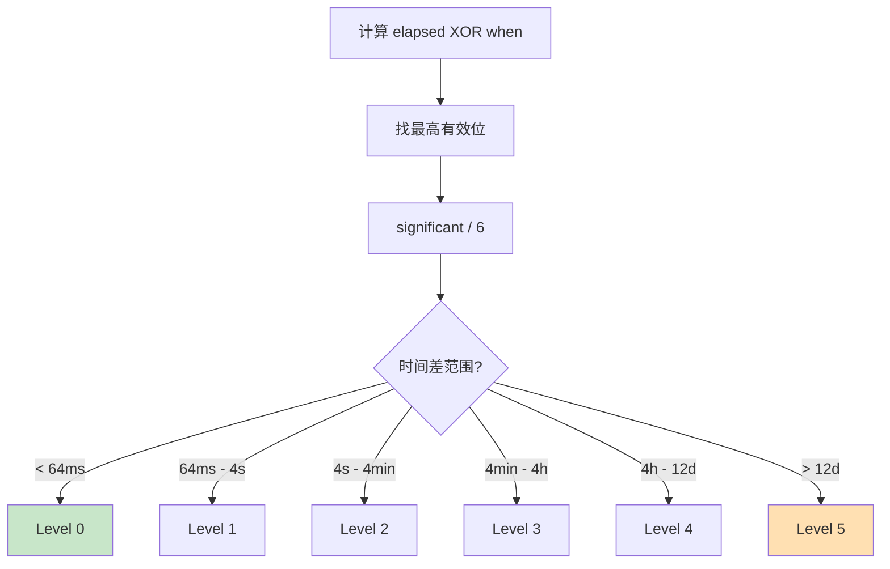

### 2.5 Occupied 位图优化

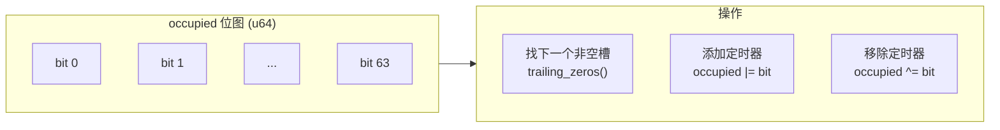

```rust
fn next_occupied_slot(&self, now: u64) -> Option<usize> {
    if self.occupied == 0 {
        return None;  // 全空
    }

    let now_slot = (now / slot_range(self.level)) as usize;
    let occupied = self.occupied.rotate_right(now_slot as u32);

    // O(1) 找到下一个非空槽
    let zeros = occupied.trailing_zeros() as usize;
    let slot = (zeros + now_slot) % LEVEL_MULT;

    Some(slot)
}
```

---

## 3. TimerEntry 状态机

### 3.1 StateCell 结构

```rust
// 文件: runtime/time/entry.rs
pub(super) struct StateCell {
    /// 状态: 截止时间或特殊值
    state: AtomicU64,

    /// 触发结果
    result: UnsafeCell<TimerResult>,

    /// 注册的 Waker
    waker: AtomicWaker,
}

// 特殊状态值
const STATE_DEREGISTERED: u64 = u64::MAX;      // 已注销
const STATE_PENDING_FIRE: u64 = u64::MAX - 1;  // 待触发
```

### 3.2 状态转换图

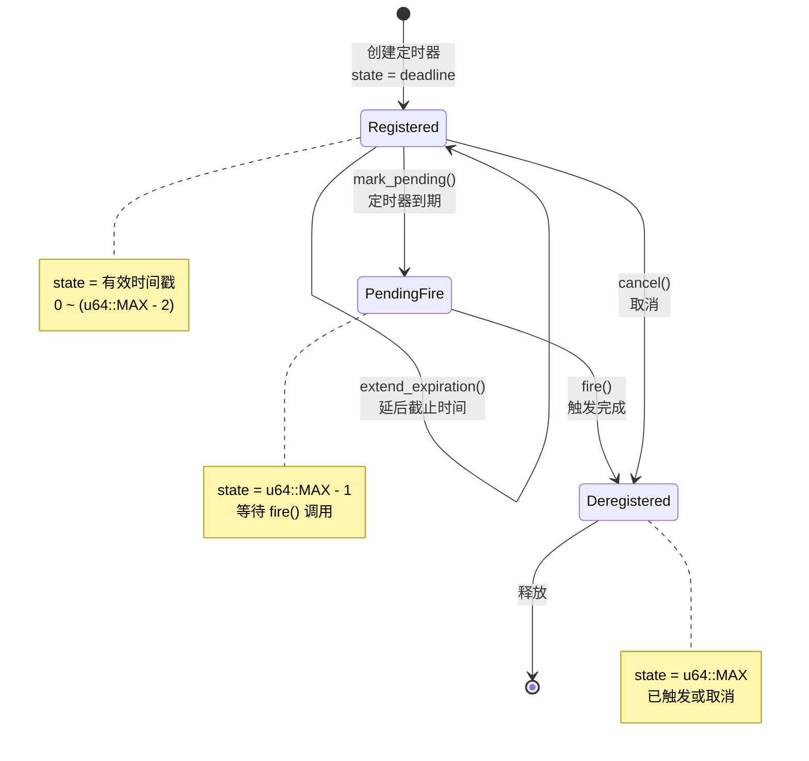

### 3.3 关键方法

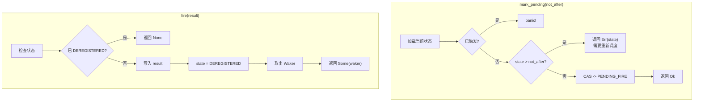

### 3.4 TimerEntry 结构

```rust
pub(crate) struct TimerEntry {
    /// 运行时句柄
    driver: scheduler::Handle,

    /// 共享内部状态
    inner: Option<TimerShared>,

    /// 截止时刻
    deadline: Instant,

    /// 是否已注册
    registered: bool,
}
```

---

## 4. Sleep 和 Timeout

### 4.1 Sleep 结构

```rust
// 文件: time/sleep.rs
pub struct Sleep {
    inner: Inner,

    /// 底层定时器条目
    #[pin]
    entry: TimerEntry,
}
```

### 4.2 Sleep 执行流程

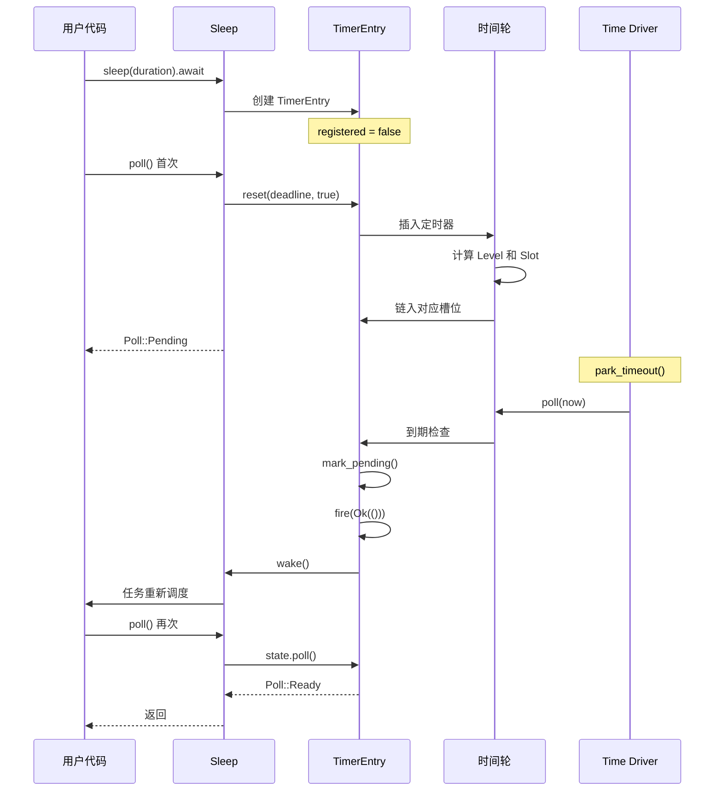

### 4.3 Timeout 结构

```rust
// 文件: time/timeout.rs
pub struct Timeout<T> {
    /// 被包装的 Future
    #[pin]
    value: T,

    /// 时间限制
    #[pin]
    delay: Sleep,
}
```

### 4.4 Timeout 执行流程

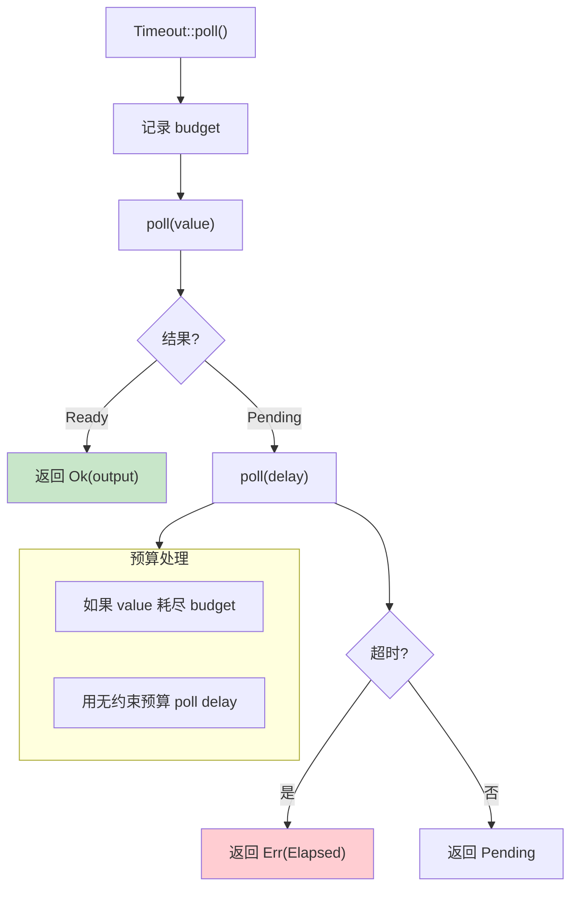

---

## 5. Time Driver 实现

### 5.1 Driver 结构

```rust
// 文件: runtime/time/mod.rs
pub(crate) struct Driver {
    /// I/O 驱动栈
    park: IoStack,
}

struct Inner {
    /// 受锁保护的状态
    state: Mutex<InnerState>,

    /// 快速关闭检查
    is_shutdown: AtomicBool,
}

struct InnerState {
    /// 下一次唤醒时刻
    next_wake: Option<NonZeroU64>,

    /// 时间轮
    wheel: wheel::Wheel,
}
```

### 5.2 park_internal 流程

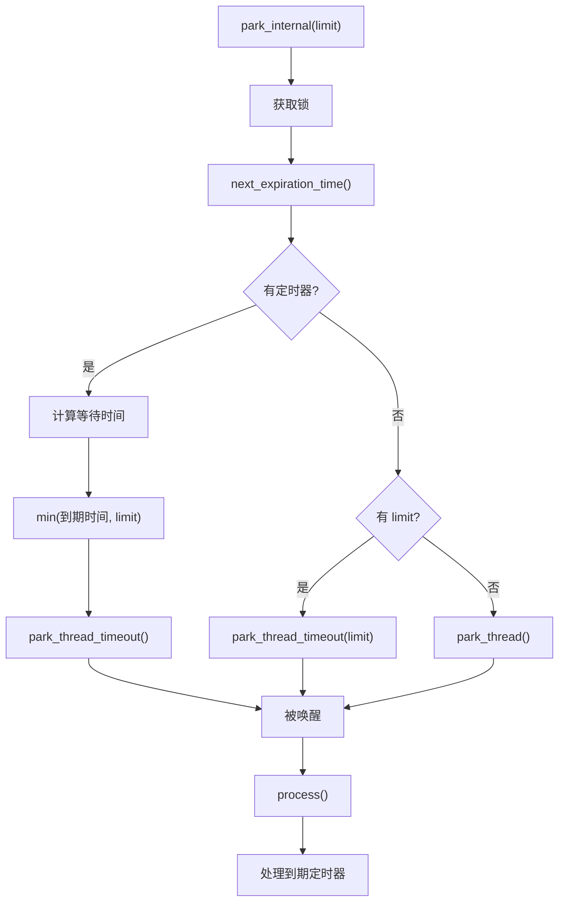

### 5.3 process 处理流程

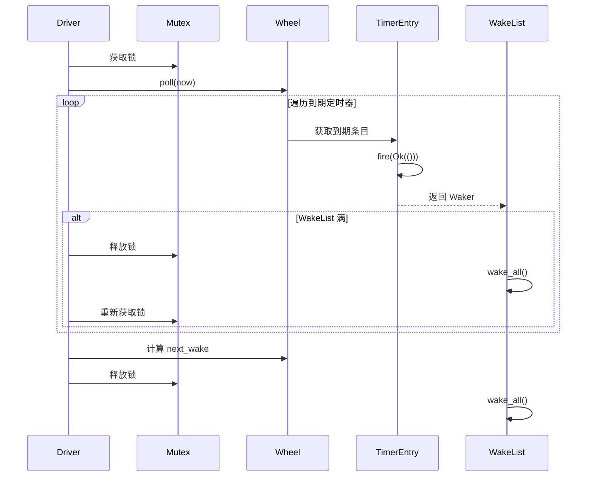

### 5.4 reregister 流程

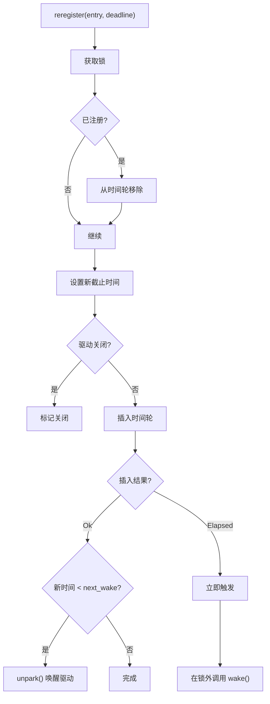

---

## 6. 性能优化

### 6.1 批量唤醒

```rust
pub(self) fn process_at_time(&self, mut now: u64) {
    let mut waker_list = WakeList::new();  // 栈上缓冲
    let mut lock = self.inner.lock();

    while let Some(entry) = lock.wheel.poll(now) {
        if let Some(waker) = unsafe { entry.fire(Ok(())) } {
            waker_list.push(waker);

            // 缓冲区满时批量唤醒
            if !waker_list.can_push() {
                drop(lock);
                waker_list.wake_all();
                lock = self.inner.lock();
            }
        }
    }

    drop(lock);
    waker_list.wake_all();
}
```

### 6.2 延迟注册

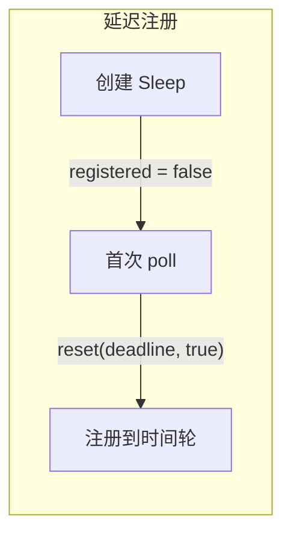

**优势**:
- 避免未使用的定时器占用资源
- 支持 select! 中被丢弃的分支

### 6.3 级联机制

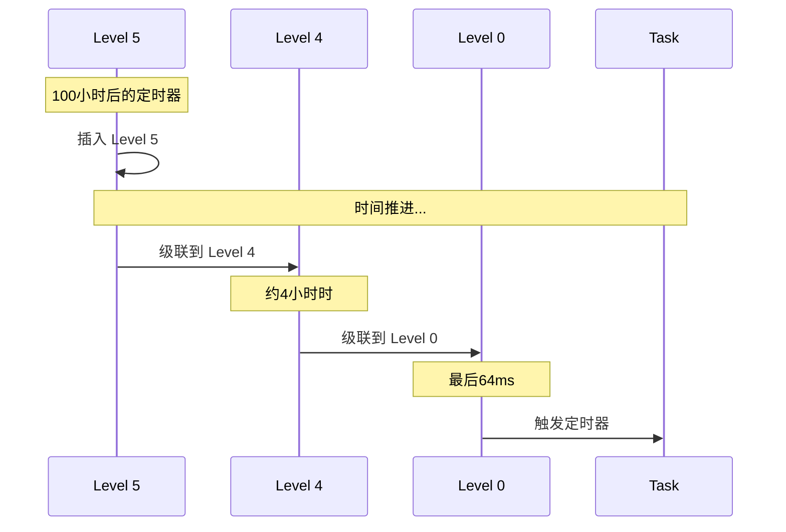

### 6.4 性能特性

| 操作 | 复杂度 | 说明 |
|-----|--------|------|
| 插入 | O(1) | 直接计算槽位 |
| 取消 | O(1) | 链表移除 |
| 查找下一个 | O(1) | 位图 trailing_zeros |
| 处理到期 | O(m) | m = 到期定时器数 |

---

## 时间精度和范围

### 精度

- **分辨率**: 1 毫秒
- **实际精度**: 取决于操作系统
  - Linux: 1-10 ms
  - Windows: 10-15 ms

### 范围

```
MAX_DURATION = (1 << 36) - 1 毫秒
            ≈ 68,719,476,735 毫秒
            ≈ 2.18 年
```

---

## 总结

Tokio Time Driver 的设计精髓：

1. **分层时间轮**: 6 层 × 64 槽，覆盖毫秒到年
2. **位图优化**: O(1) 查找下一个非空槽
3. **延迟注册**: 减少不必要的开销
4. **批量唤醒**: 减少锁竞争
5. **无锁状态**: CAS 实现并发安全
