# Tokio Sync 同步原语深度分析

## 目录

1. [同步原语概述](#1-同步原语概述)
2. [Mutex 互斥锁](#2-mutex-互斥锁)
3. [RwLock 读写锁](#3-rwlock-读写锁)
4. [Semaphore 信号量](#4-semaphore-信号量)
5. [Notify 通知机制](#5-notify-通知机制)
6. [Channel 通道](#6-channel-通道)
7. [设计模式总结](#7-设计模式总结)

---

## 1. 同步原语概述

Tokio sync 模块提供适用于异步编程的同步原语，所有操作都可跨 `.await` 点持有。

### 1.1 原语分类

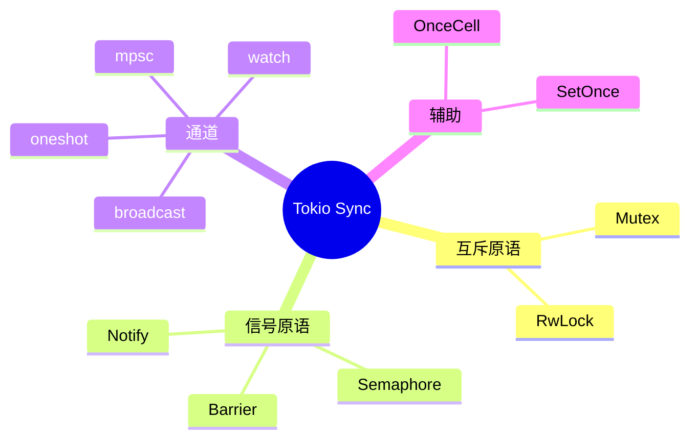
```mermaid
mindmap
    root((Tokio Sync))
        互斥原语
            Mutex
            RwLock
        信号原语
            Semaphore
            Notify
            Barrier
        通道
            oneshot
            mpsc
            broadcast
            watch
        辅助
            OnceCell
            SetOnce
```

### 1.2 与标准库对比

| 特性 | std::sync | tokio::sync |
|------|-----------|-------------|
| 阻塞方式 | 线程阻塞 | 任务挂起 |
| 跨 await | 不支持 | 支持 |
| Send 约束 | 取决于类型 | 取决于类型 |
| 性能开销 | 低 | 略高 (任务唤醒) |

---

## 2. Mutex 互斥锁

### 2.1 设计特点

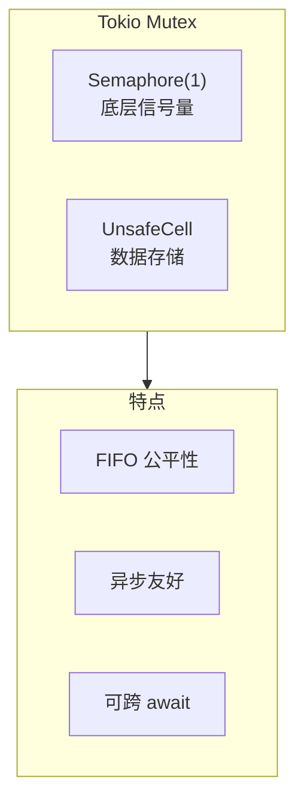
```mermaid
graph TB
    subgraph Mutex["Tokio Mutex<T>"]
        Sem["Semaphore(1)<br/>底层信号量"]
        Data["UnsafeCell<T><br/>数据存储"]
    end

    subgraph Features["特点"]
        FIFO["FIFO 公平性"]
        Async["异步友好"]
        CrossAwait["可跨 await"]
    end

    Mutex --> Features
```

### 2.2 数据结构

```rust
pub struct Mutex<T: ?Sized> {
    /// 底层信号量 (许可数 = 1)
    s: semaphore::Semaphore,

    /// 保护的数据
    c: UnsafeCell<T>,
}

pub struct MutexGuard<'a, T: ?Sized> {
    lock: &'a Mutex<T>,
    // 实现 Deref/DerefMut
}

pub struct OwnedMutexGuard<T: ?Sized> {
    lock: Arc<Mutex<T>>,
    // 可跨任务使用
}
```

### 2.3 lock 流程

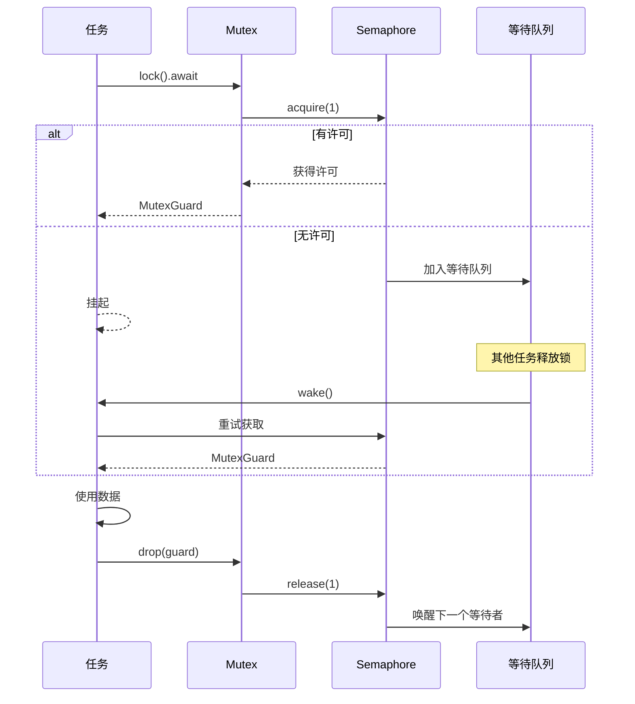
```mermaid
sequenceDiagram
    participant Task as 任务
    participant Mutex as Mutex
    participant Sem as Semaphore
    participant Queue as 等待队列

    Task->>Mutex: lock().await
    Mutex->>Sem: acquire(1)

    alt 有许可
        Sem-->>Mutex: 获得许可
        Mutex-->>Task: MutexGuard
    else 无许可
        Sem->>Queue: 加入等待队列
        Task-->>Task: 挂起

        Note over Queue: 其他任务释放锁

        Queue->>Task: wake()
        Task->>Sem: 重试获取
        Sem-->>Task: MutexGuard
    end

    Task->>Task: 使用数据

    Task->>Mutex: drop(guard)
    Mutex->>Sem: release(1)
    Sem->>Queue: 唤醒下一个等待者
```

---

## 3. RwLock 读写锁

### 3.1 设计原理

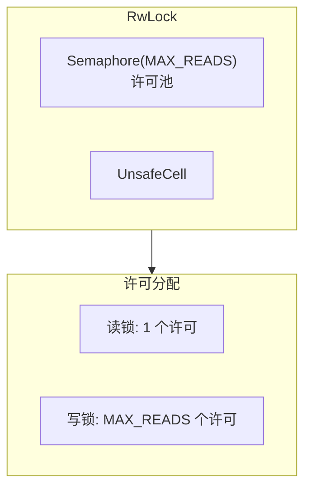
```mermaid
graph TB
    subgraph RwLock["RwLock<T>"]
        Sem["Semaphore(MAX_READS)<br/>许可池"]
        Data["UnsafeCell<T>"]
    end

    subgraph Permits["许可分配"]
        Read["读锁: 1 个许可"]
        Write["写锁: MAX_READS 个许可"]
    end

    RwLock --> Permits
```

### 3.2 数据结构

```rust
pub struct RwLock<T: ?Sized> {
    /// 最大读者数 (默认 MAX_READS)
    mr: u32,

    /// 底层信号量
    s: Semaphore,

    /// 保护的数据
    c: UnsafeCell<T>,
}

// MAX_READS = u32::MAX >> 3 ≈ 536,870,911
```

### 3.3 锁获取策略

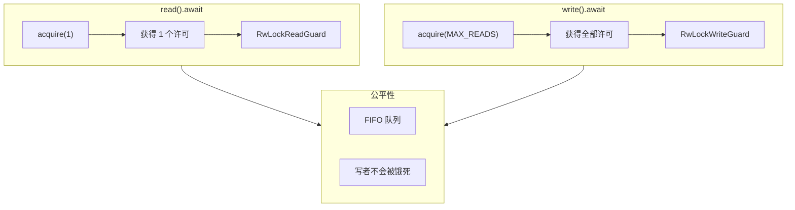
```mermaid
flowchart TD
    subgraph ReadLock["read().await"]
        R1["acquire(1)"] --> R2["获得 1 个许可"]
        R2 --> R3["RwLockReadGuard"]
    end

    subgraph WriteLock["write().await"]
        W1["acquire(MAX_READS)"] --> W2["获得全部许可"]
        W2 --> W3["RwLockWriteGuard"]
    end

    subgraph Fairness["公平性"]
        F1["FIFO 队列"]
        F2["写者不会被饿死"]
    end

    ReadLock --> Fairness
    WriteLock --> Fairness
```

### 3.4 并发场景

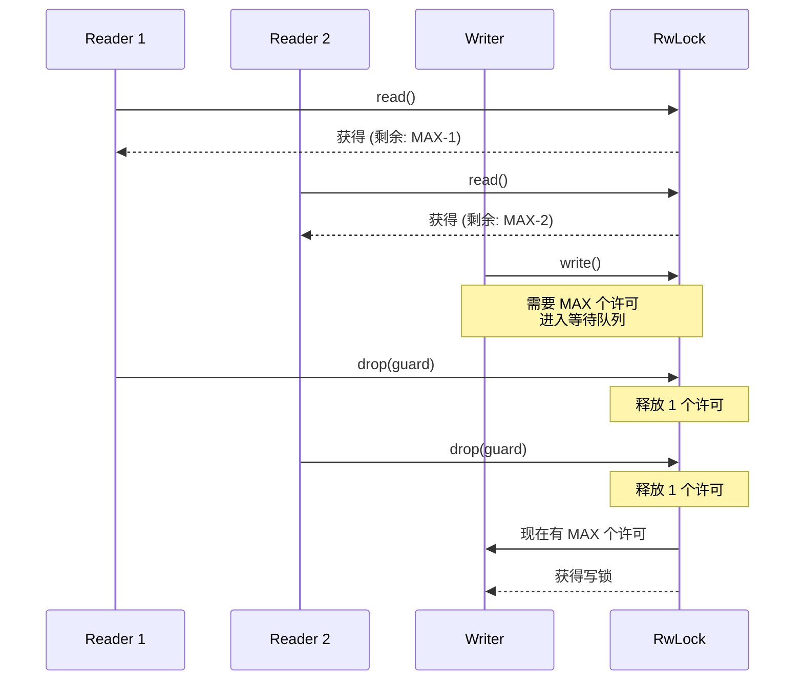
```mermaid
sequenceDiagram
    participant R1 as Reader 1
    participant R2 as Reader 2
    participant W as Writer
    participant RwLock as RwLock

    R1->>RwLock: read()
    RwLock-->>R1: 获得 (剩余: MAX-1)

    R2->>RwLock: read()
    RwLock-->>R2: 获得 (剩余: MAX-2)

    W->>RwLock: write()
    Note over W,RwLock: 需要 MAX 个许可<br/>进入等待队列

    R1->>RwLock: drop(guard)
    Note over RwLock: 释放 1 个许可

    R2->>RwLock: drop(guard)
    Note over RwLock: 释放 1 个许可

    RwLock->>W: 现在有 MAX 个许可
    RwLock-->>W: 获得写锁
```

---

## 4. Semaphore 信号量

### 4.1 双层架构

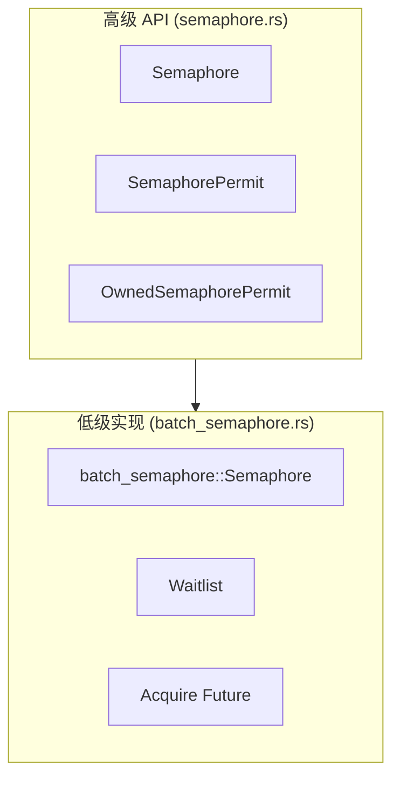
```mermaid
graph TB
    subgraph HighLevel["高级 API (semaphore.rs)"]
        Semaphore["Semaphore"]
        Permit["SemaphorePermit"]
        OwnedPermit["OwnedSemaphorePermit"]
    end

    subgraph LowLevel["低级实现 (batch_semaphore.rs)"]
        BatchSem["batch_semaphore::Semaphore"]
        Waitlist["Waitlist"]
        Acquire["Acquire Future"]
    end

    HighLevel --> LowLevel
```

### 4.2 低级信号量结构

```rust
// 文件: sync/batch_semaphore.rs
pub(crate) struct Semaphore {
    /// 等待者队列
    waiters: Mutex<Waitlist>,

    /// 可用许可数
    permits: AtomicUsize,
}

struct Waitlist {
    /// 等待者链表
    queue: LinkedList<Waiter, ...>,

    /// 是否已关闭
    closed: bool,
}
```

### 4.3 acquire 流程

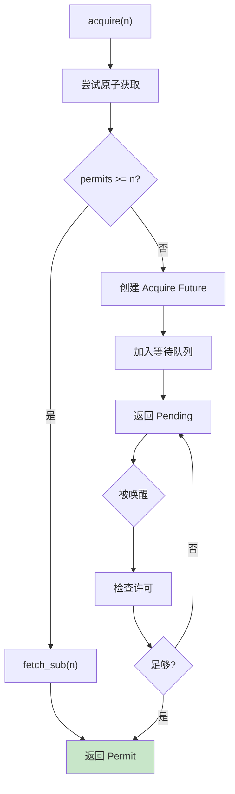
```mermaid
flowchart TD
    A["acquire(n)"] --> B["尝试原子获取"]

    B --> C{permits >= n?}
    C -->|是| D["fetch_sub(n)"]
    D --> E["返回 Permit"]

    C -->|否| F["创建 Acquire Future"]
    F --> G["加入等待队列"]
    G --> H["返回 Pending"]

    H --> I{被唤醒}
    I --> J["检查许可"]
    J --> K{足够?}
    K -->|是| E
    K -->|否| H

    style E fill:#c8e6c9
```

### 4.4 FIFO 公平性保证

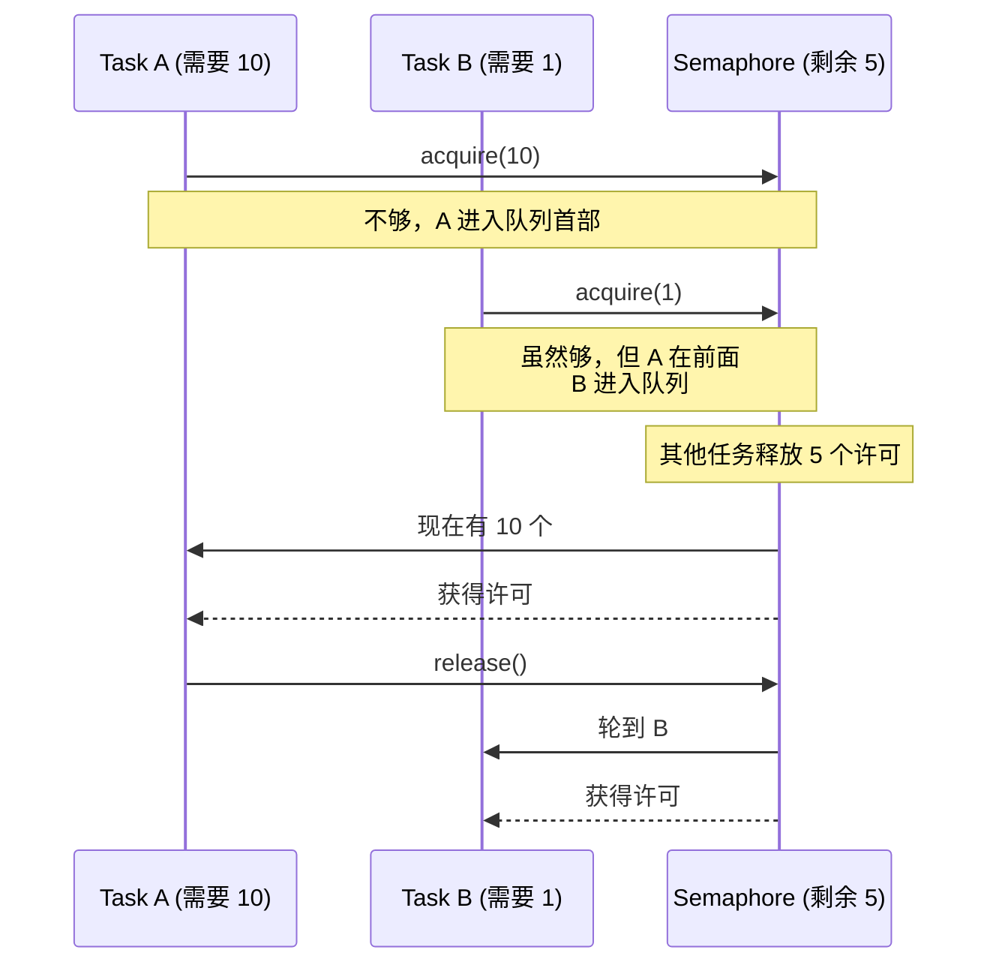
```mermaid
sequenceDiagram
    participant A as Task A (需要 10)
    participant B as Task B (需要 1)
    participant Sem as Semaphore (剩余 5)

    A->>Sem: acquire(10)
    Note over A,Sem: 不够，A 进入队列首部

    B->>Sem: acquire(1)
    Note over B,Sem: 虽然够，但 A 在前面<br/>B 进入队列

    Note over Sem: 其他任务释放 5 个许可

    Sem->>A: 现在有 10 个
    Sem-->>A: 获得许可

    A->>Sem: release()

    Sem->>B: 轮到 B
    Sem-->>B: 获得许可
```

---

## 5. Notify 通知机制

### 5.1 设计概述

Notify 是一个轻量级的事件通知原语，类似于条件变量但专为异步设计。

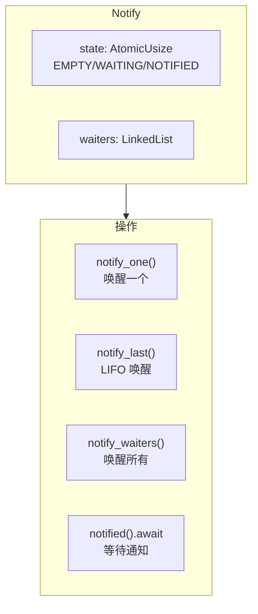
```mermaid
graph TB
    subgraph Notify["Notify"]
        State["state: AtomicUsize<br/>EMPTY/WAITING/NOTIFIED"]
        Waiters["waiters: LinkedList<Waiter>"]
    end

    subgraph Operations["操作"]
        NotifyOne["notify_one()<br/>唤醒一个"]
        NotifyLast["notify_last()<br/>LIFO 唤醒"]
        NotifyWaiters["notify_waiters()<br/>唤醒所有"]
        Notified["notified().await<br/>等待通知"]
    end

    Notify --> Operations
```

### 5.2 状态机

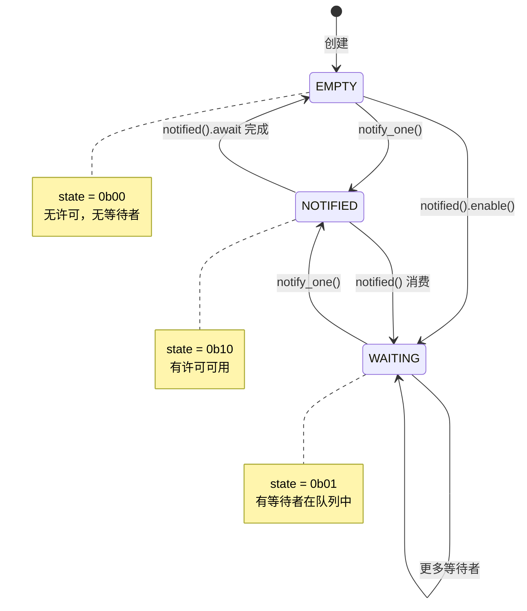
```mermaid
stateDiagram-v2
    [*] --> EMPTY: 创建

    EMPTY --> NOTIFIED: notify_one()
    EMPTY --> WAITING: notified().enable()

    WAITING --> NOTIFIED: notify_one()
    WAITING --> WAITING: 更多等待者

    NOTIFIED --> WAITING: notified() 消费
    NOTIFIED --> EMPTY: notified().await 完成

    note right of EMPTY
        state = 0b00
        无许可，无等待者
    end note

    note right of WAITING
        state = 0b01
        有等待者在队列中
    end note

    note right of NOTIFIED
        state = 0b10
        有许可可用
    end note
```

### 5.3 通知策略对比

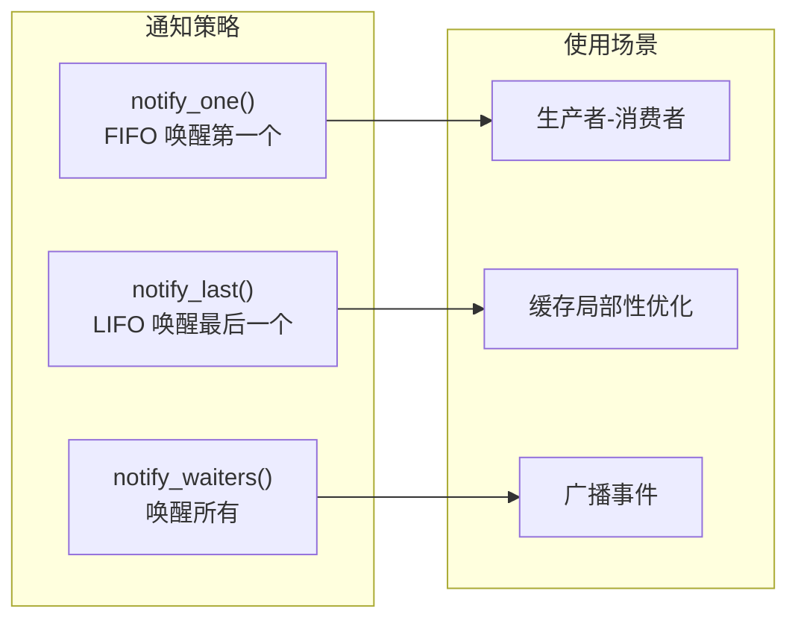
```mermaid
graph LR
    subgraph Strategies["通知策略"]
        One["notify_one()<br/>FIFO 唤醒第一个"]
        Last["notify_last()<br/>LIFO 唤醒最后一个"]
        All["notify_waiters()<br/>唤醒所有"]
    end

    subgraph UseCases["使用场景"]
        OneUse["生产者-消费者"]
        LastUse["缓存局部性优化"]
        AllUse["广播事件"]
    end

    One --> OneUse
    Last --> LastUse
    All --> AllUse
```

### 5.4 enable() 的重要性

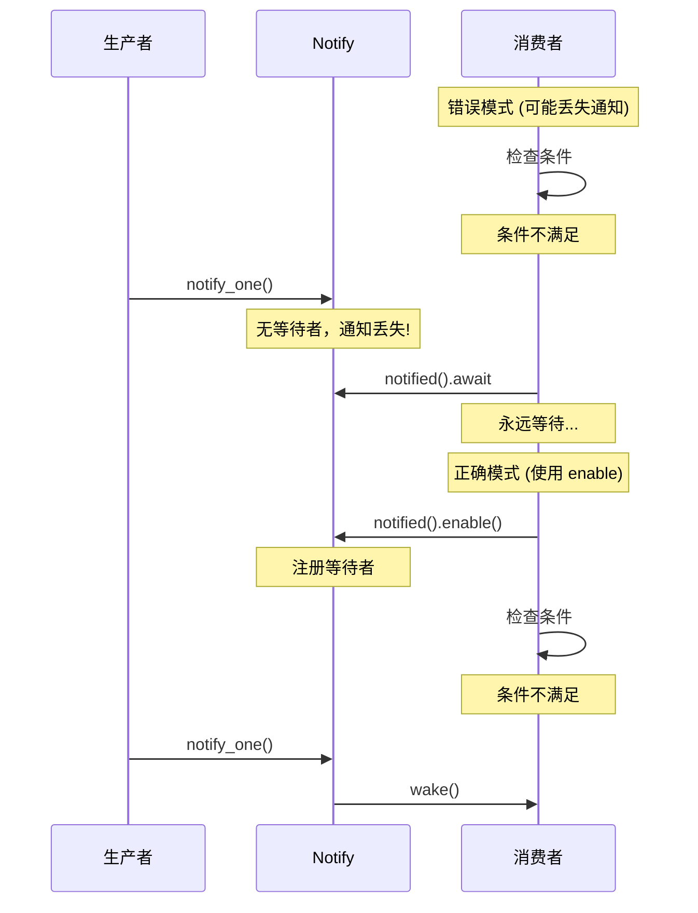
```mermaid
sequenceDiagram
    participant Producer as 生产者
    participant Notify as Notify
    participant Consumer as 消费者

    Note over Consumer: 错误模式 (可能丢失通知)

    Consumer->>Consumer: 检查条件
    Note over Consumer: 条件不满足

    Producer->>Notify: notify_one()
    Note over Notify: 无等待者，通知丢失!

    Consumer->>Notify: notified().await
    Note over Consumer: 永远等待...

    Note over Consumer: 正确模式 (使用 enable)

    Consumer->>Notify: notified().enable()
    Note over Notify: 注册等待者

    Consumer->>Consumer: 检查条件
    Note over Consumer: 条件不满足

    Producer->>Notify: notify_one()
    Notify->>Consumer: wake()
```

---

## 6. Channel 通道

### 6.1 通道类型

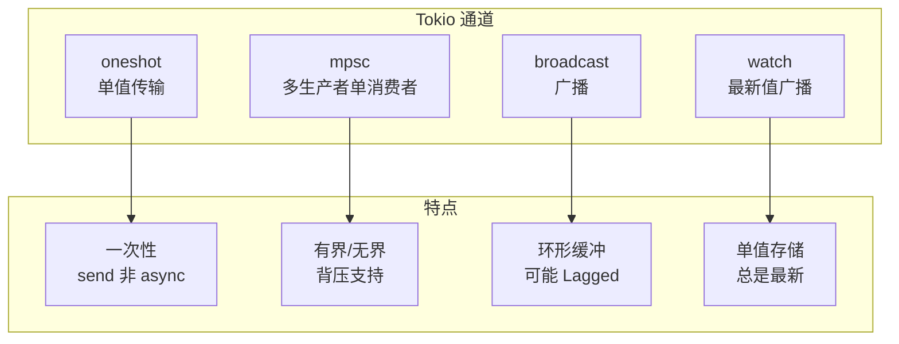
```mermaid
graph TB
    subgraph Channels["Tokio 通道"]
        Oneshot["oneshot<br/>单值传输"]
        MPSC["mpsc<br/>多生产者单消费者"]
        Broadcast["broadcast<br/>广播"]
        Watch["watch<br/>最新值广播"]
    end

    subgraph Characteristics["特点"]
        OneshotC["一次性<br/>send 非 async"]
        MPSCC["有界/无界<br/>背压支持"]
        BroadcastC["环形缓冲<br/>可能 Lagged"]
        WatchC["单值存储<br/>总是最新"]
    end

    Oneshot --> OneshotC
    MPSC --> MPSCC
    Broadcast --> BroadcastC
    Watch --> WatchC
```

### 6.2 Oneshot 通道

```rust
pub struct Sender<T> {
    inner: Option<Arc<Inner<T>>>,
}

pub struct Receiver<T> {
    inner: Option<Arc<Inner<T>>>,
}

struct Inner<T> {
    /// 状态机
    state: AtomicUsize,

    /// 值存储
    value: UnsafeCell<Option<T>>,

    /// 发送者 Waker
    tx_task: Task,

    /// 接收者 Waker
    rx_task: Task,
}
```

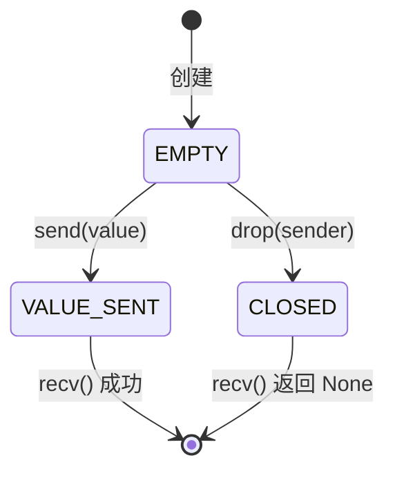
```mermaid
stateDiagram-v2
    [*] --> EMPTY: 创建

    EMPTY --> VALUE_SENT: send(value)
    EMPTY --> CLOSED: drop(sender)

    VALUE_SENT --> [*]: recv() 成功

    CLOSED --> [*]: recv() 返回 None
```

### 6.3 MPSC 通道架构

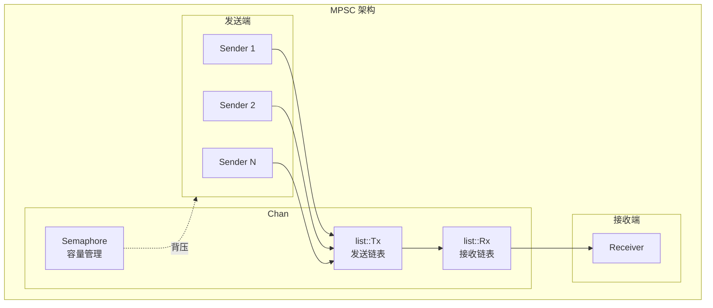
```mermaid
graph TB
    subgraph MPSC["MPSC 架构"]
        subgraph Senders["发送端"]
            S1["Sender 1"]
            S2["Sender 2"]
            SN["Sender N"]
        end

        subgraph Chan["Chan<T, S>"]
            Tx["list::Tx<br/>发送链表"]
            Rx["list::Rx<br/>接收链表"]
            Sem["Semaphore<br/>容量管理"]
        end

        subgraph Receiver["接收端"]
            R["Receiver"]
        end
    end

    S1 --> Tx
    S2 --> Tx
    SN --> Tx

    Tx --> Rx
    Rx --> R

    Sem -.->|背压| Senders
```

### 6.4 MPSC 消息块

```rust
// 文件: sync/mpsc/block.rs
pub(crate) struct Block<T> {
    header: BlockHeader<T>,
    values: Values<T>,  // [MaybeUninit<T>; BLOCK_CAP]
}

// 64位系统: BLOCK_CAP = 32
// 32位系统: BLOCK_CAP = 16
```

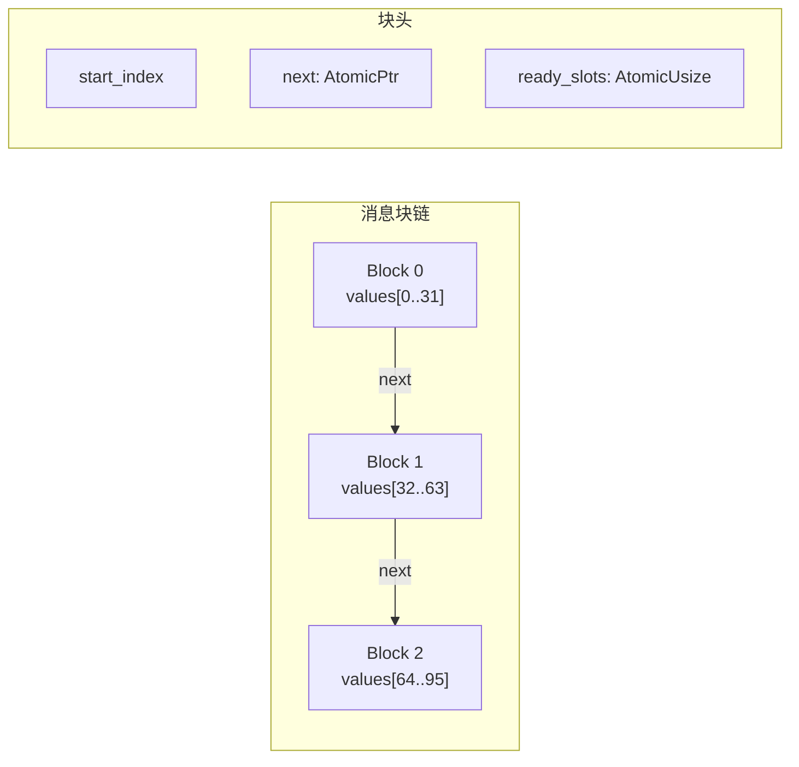
```mermaid
graph LR
    subgraph BlockChain["消息块链"]
        B1["Block 0<br/>values[0..31]"]
        B2["Block 1<br/>values[32..63]"]
        B3["Block 2<br/>values[64..95]"]
    end

    B1 -->|next| B2
    B2 -->|next| B3

    subgraph Header["块头"]
        StartIdx["start_index"]
        Next["next: AtomicPtr"]
        ReadySlots["ready_slots: AtomicUsize"]
    end
```

### 6.5 Broadcast 通道

```rust
struct Shared<T> {
    /// 环形缓冲区
    buffer: Box<[Mutex<Slot<T>>]>,

    /// 位掩码
    mask: usize,

    /// 写位置 + 等待者
    tail: Mutex<Tail>,

    /// 发送者计数
    num_tx: AtomicUsize,
}

struct Slot<T> {
    /// 剩余接收者数
    rem: AtomicUsize,

    /// 这个槽位的位置
    pos: u64,

    /// 存储的值
    val: Option<T>,
}
```

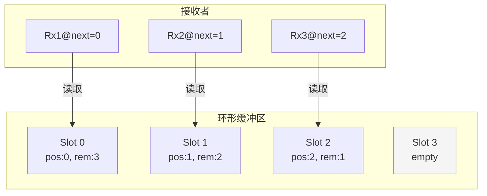
```mermaid
graph TB
    subgraph Buffer["环形缓冲区"]
        S0["Slot 0<br/>pos:0, rem:3"]
        S1["Slot 1<br/>pos:1, rem:2"]
        S2["Slot 2<br/>pos:2, rem:1"]
        S3["Slot 3<br/>empty"]
    end

    subgraph Receivers["接收者"]
        R1["Rx1@next=0"]
        R2["Rx2@next=1"]
        R3["Rx3@next=2"]
    end

    R1 -->|读取| S0
    R2 -->|读取| S1
    R3 -->|读取| S2

    style S3 fill:#f5f5f5
```

### 6.6 Watch 通道

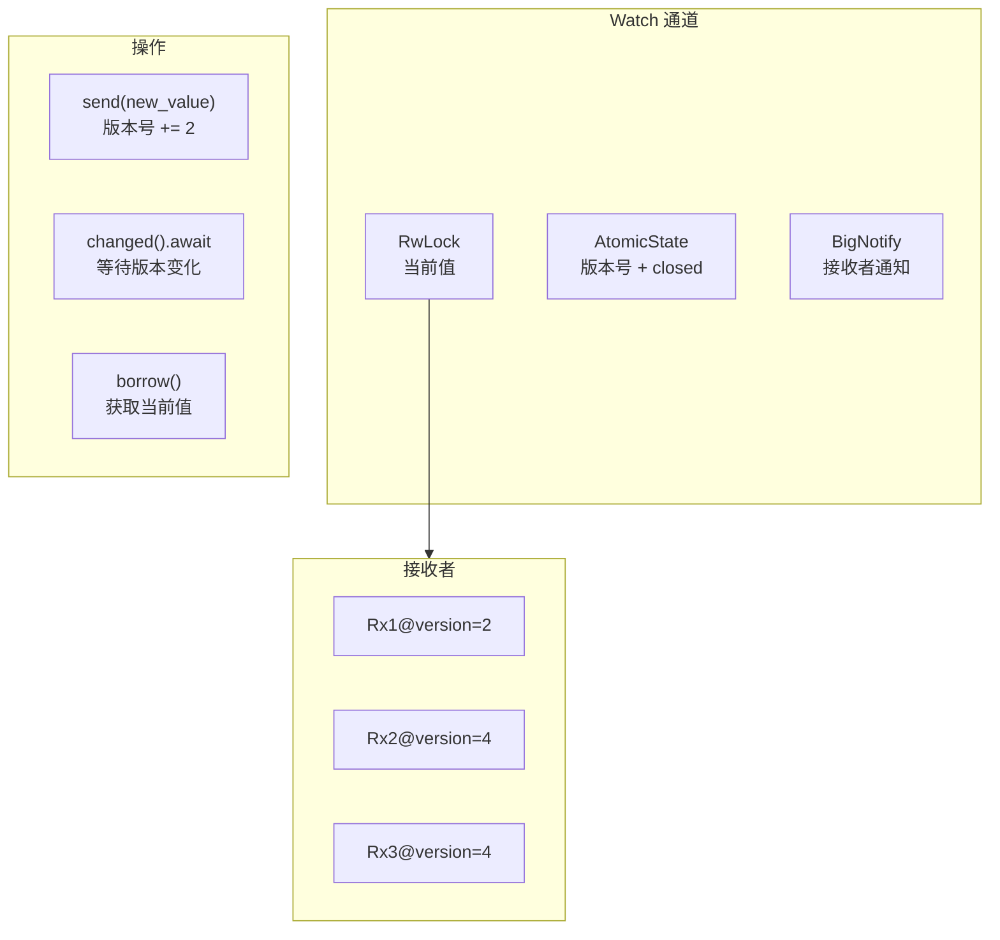
```mermaid
graph TB
    subgraph Watch["Watch 通道"]
        Value["RwLock<T><br/>当前值"]
        State["AtomicState<br/>版本号 + closed"]
        NotifyRx["BigNotify<br/>接收者通知"]
    end

    subgraph Receivers["接收者"]
        R1["Rx1@version=2"]
        R2["Rx2@version=4"]
        R3["Rx3@version=4"]
    end

    Value --> Receivers

    subgraph Operations["操作"]
        Send["send(new_value)<br/>版本号 += 2"]
        Changed["changed().await<br/>等待版本变化"]
        Borrow["borrow()<br/>获取当前值"]
    end
```

### 6.7 通道对比

| 特性 | oneshot | mpsc | broadcast | watch |
|------|---------|------|-----------|-------|
| 生产者 | 1 | N | N | 1 |
| 消费者 | 1 | 1 | N | N |
| 值数量 | 1 | 无限 | 缓冲区大小 | 1 |
| 背压 | 无 | 有 | Lagging | 无 |
| 保留历史 | 否 | 是 | 是 | 否 |

---

## 7. 设计模式总结

### 7.1 核心设计模式

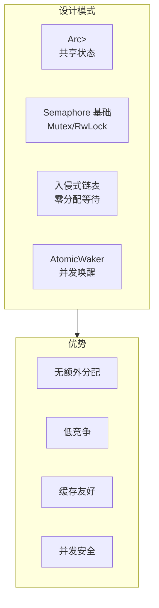
```mermaid
graph TB
    subgraph Patterns["设计模式"]
        ArcShared["Arc<Shared<T>><br/>共享状态"]
        SemBase["Semaphore 基础<br/>Mutex/RwLock"]
        IntrusiveList["入侵式链表<br/>零分配等待"]
        AtomicWaker["AtomicWaker<br/>并发唤醒"]
    end

    subgraph Benefits["优势"]
        NoAlloc["无额外分配"]
        LowContention["低竞争"]
        CacheFriendly["缓存友好"]
        SafeConcurrency["并发安全"]
    end

    Patterns --> Benefits
```

### 7.2 公平性保证

```mermaid
flowchart TD
    A["公平性机制"] --> B["FIFO 等待队列"]
    A --> C["大请求不被饿死"]
    A --> D["写优先 (RwLock)"]

    B --> E["LinkedList<Waiter>"]
    C --> F["Semaphore 批量获取"]
    D --> G["写锁需要全部许可"]
```

### 7.3 内存顺序策略

```mermaid
graph LR
    subgraph Ordering["内存顺序"]
        AcqRel["Acquire/Release<br/>关键同步点"]
        Relaxed["Relaxed<br/>计数器"]
        SeqCst["SeqCst<br/>shutdown 标志"]
    end

    subgraph Usage["使用场景"]
        AcqRelU["状态转换<br/>Waker 操作"]
        RelaxedU["引用计数<br/>统计"]
        SeqCstU["全局可见性"]
    end

    AcqRel --> AcqRelU
    Relaxed --> RelaxedU
    SeqCst --> SeqCstU
```

---

## 性能建议

### 选择指南

```mermaid
graph TD
    A["选择同步原语"] --> B{"需要互斥?"}

    B -->|是| C{"读多写少?"}
    C -->|是| D["RwLock"]
    C -->|否| E["Mutex"]

    B -->|否| F{"需要通知?"}
    F -->|是| G{"广播?"}
    G -->|是| H["broadcast/watch"]
    G -->|否| I["Notify"]

    F -->|否| J{"需要计数?"}
    J -->|是| K["Semaphore"]
    J -->|否| L["Channel"]
```

---

## 总结

Tokio sync 模块的设计精髓：

1. **异步友好**: 所有操作可跨 `.await` 持有
2. **公平性**: FIFO 队列，无饥饿
3. **高效**: 入侵式链表，零分配等待
4. **灵活**: 多种通道类型满足不同场景
5. **安全**: 正确的内存顺序和并发控制
