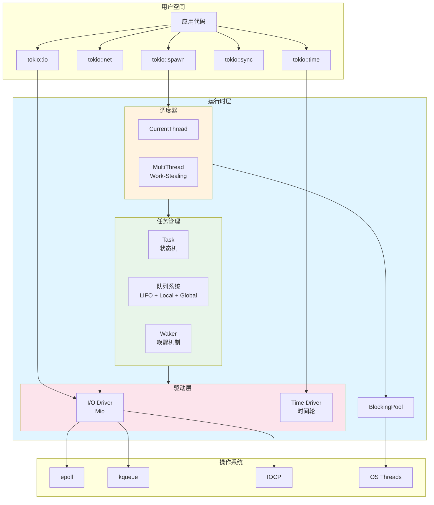
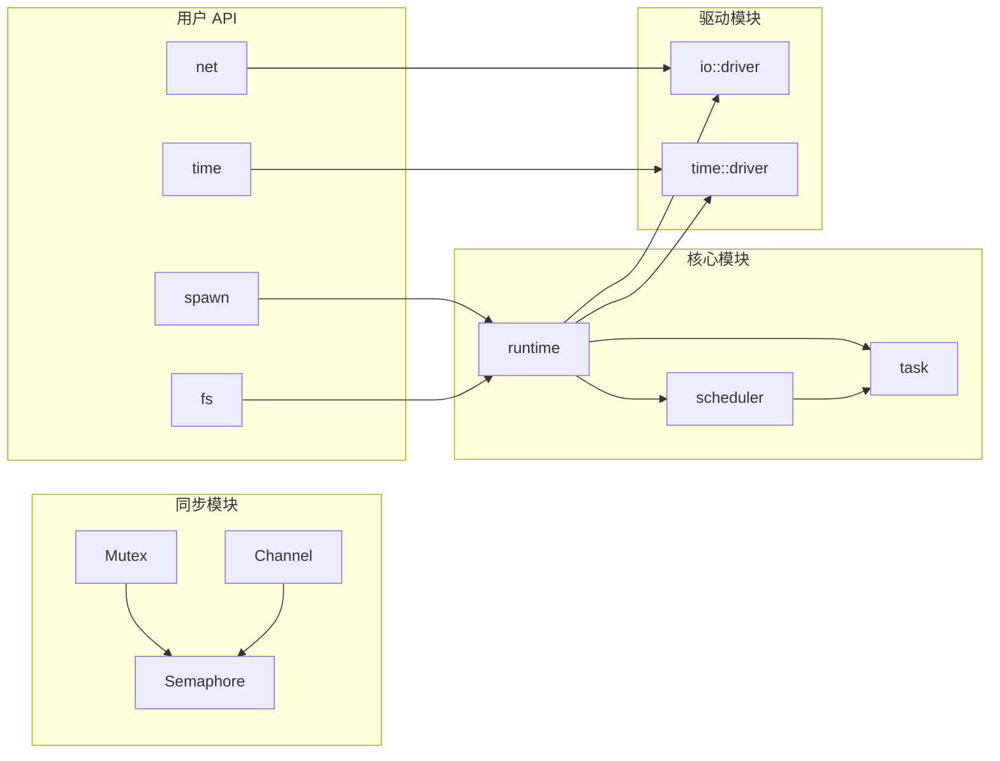
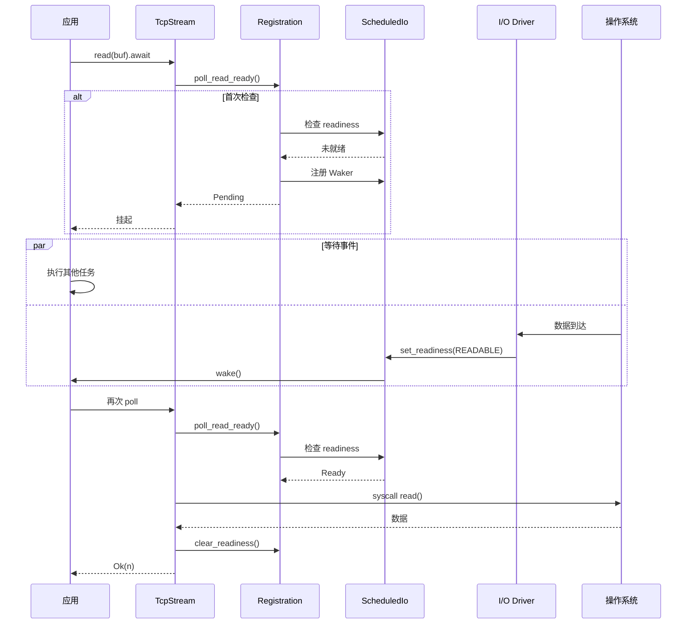
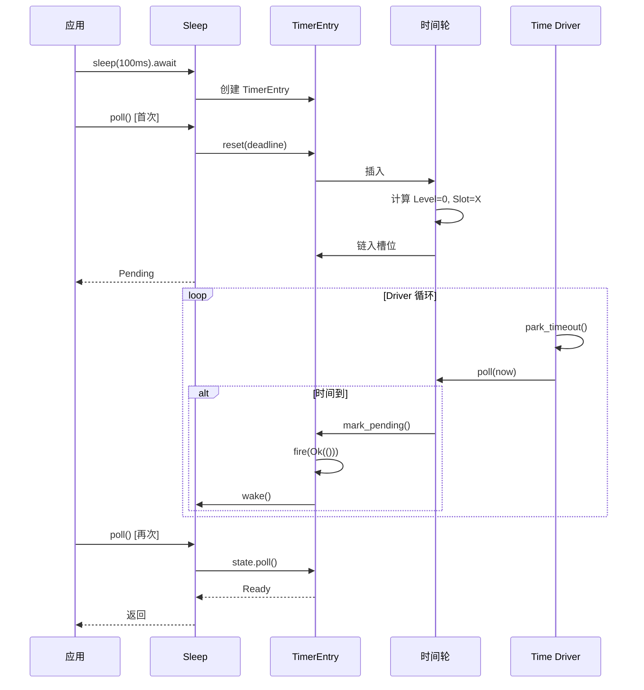
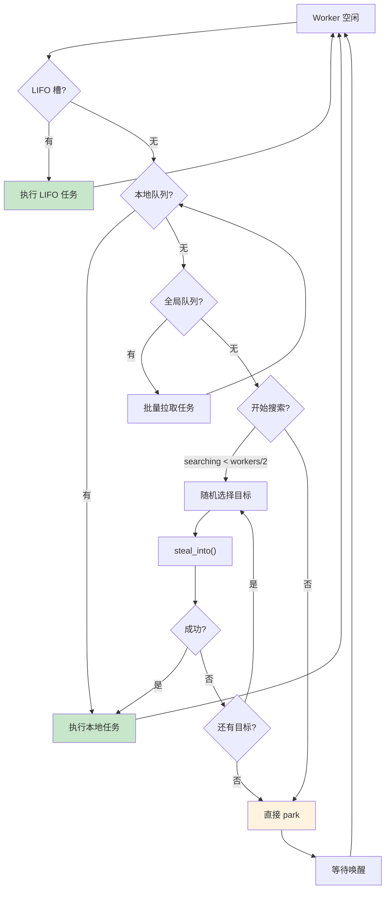
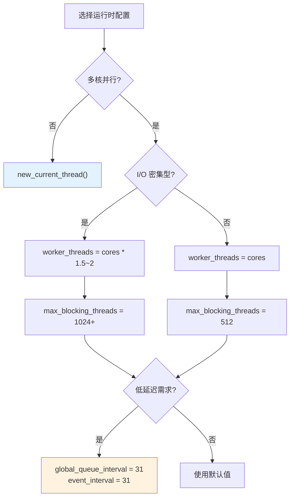
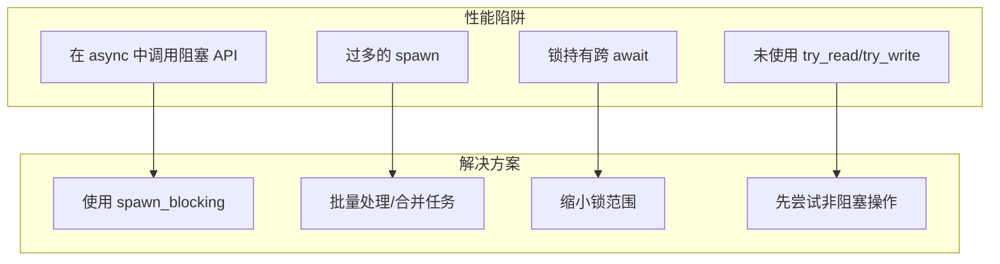
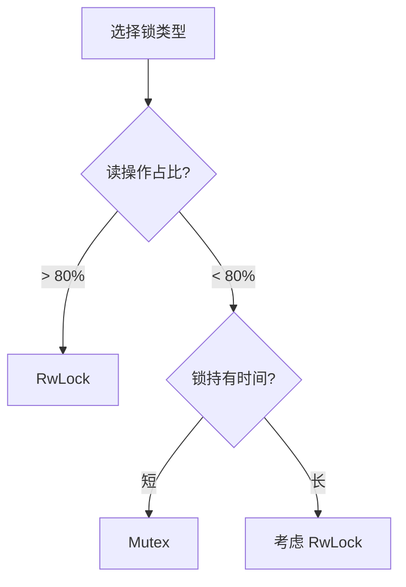
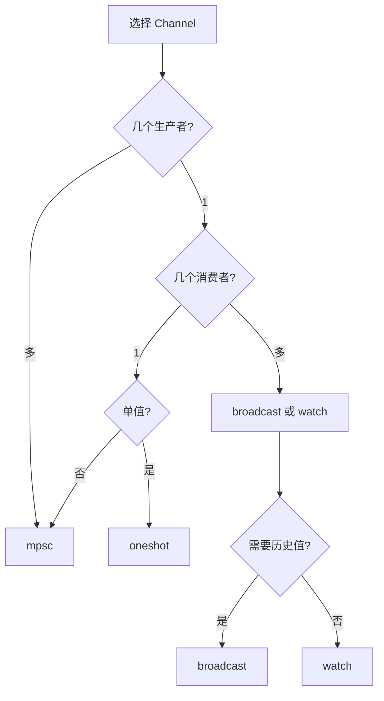

# Tokio 综合技术参考手册

## 目录

1. [架构速览](#1-架构速览)
2. [核心流程图集](#2-核心流程图集)
3. [数据结构速查](#3-数据结构速查)
4. [性能调优指南](#4-性能调优指南)
5. [常见问题解答](#5-常见问题解答)
6. [源码导航](#6-源码导航)

---

## 1. 架构速览

### 1.1 Tokio 完整架构图



### 1.2 模块依赖关系



---

## 2. 核心流程图集

### 2.1 任务完整生命周期

```mermaid
stateDiagram-v2
    [*] --> Created: tokio::spawn(future)

    state Created {
        [*] --> Allocate: 分配 Cell
        Allocate --> Initialize: 初始化状态
        Initialize --> ReturnHandle: 返回 JoinHandle
    }

    Created --> Scheduled: 加入调度队列

    state Scheduled {
        [*] --> InQueue: 在就绪队列中
        InQueue --> Selected: Worker 选中
    }

    Scheduled --> Running: transition_to_running()

    state Running {
        [*] --> Polling: poll(future)
        Polling --> CheckResult: 检查结果
    }

    Running --> Scheduled: Poll::Pending + wake()
    Running --> Completed: Poll::Ready

    state Completed {
        [*] --> StoreOutput: 存储输出
        StoreOutput --> WakeJoin: 唤醒 JoinHandle
        WakeJoin --> Release: 释放资源
    }

    Completed --> [*]: dealloc()

    Running --> Cancelled: abort()
    Cancelled --> Completed: 存储 JoinError
```

### 2.2 I/O 操作完整流程



### 2.3 定时器完整流程



### 2.4 Work-Stealing 流程



---

## 3. 数据结构速查

### 3.1 核心类型速查表

| 类型 | 位置 | 作用 | 关键字段 |
|------|------|------|---------|
| `Runtime` | runtime/runtime.rs | 运行时主体 | scheduler, handle, blocking_pool |
| `Task` | runtime/task/core.rs | 任务结构 | header, core, trailer |
| `State` | runtime/task/state.rs | 任务状态 | AtomicUsize (位字段) |
| `Scheduler` | runtime/scheduler/mod.rs | 调度器 | CurrentThread \| MultiThread |
| `Worker` | scheduler/multi_thread/worker.rs | 工作线程 | core, handle, index |
| `Local` | scheduler/multi_thread/queue.rs | 本地队列 | head, tail, buffer[256] |
| `Driver` | runtime/io/driver.rs | I/O 驱动 | poll, events |
| `ScheduledIo` | runtime/io/scheduled_io.rs | I/O 状态 | readiness, waiters |
| `Wheel` | runtime/time/wheel/mod.rs | 时间轮 | levels[6], elapsed, pending |
| `Level` | runtime/time/wheel/level.rs | 时间轮层级 | occupied, slot[64] |

### 3.2 状态编码速查

#### Task State

```
┌────────────────────────┬──────────┬──────────┬───────────┬──────────┬──────────┬─────────┐
│     引用计数 (58位)     │CANCELLED │JOIN_WAKER│JOIN_INTEREST│ NOTIFIED │ COMPLETE │ RUNNING │
│        bit 6+          │  bit 5   │  bit 4   │   bit 3   │  bit 2   │  bit 1   │  bit 0  │
└────────────────────────┴──────────┴──────────┴───────────┴──────────┴──────────┴─────────┘

INITIAL_STATE = (REF_ONE * 3) | JOIN_INTEREST | NOTIFIED = 3个引用 + JOIN_INTEREST + NOTIFIED
```

#### ScheduledIo Readiness

```
┌──────────────────┬───────────────┬──────────────────┐
│   readiness      │  driver_tick  │    shutdown      │
│   bit 16-31      │   bit 1-15    │      bit 0       │
└──────────────────┴───────────────┴──────────────────┘

READABLE    = 0b0001
WRITABLE    = 0b0010
READ_CLOSED = 0b0100
WRITE_CLOSED= 0b1000
```

#### Idle State

```
┌────────────────────┬─────────────────┐
│   num_unparked     │  num_searching  │
│    高 16 位        │    低 16 位      │
└────────────────────┴─────────────────┘
```

### 3.3 常量速查

| 常量 | 值 | 说明 |
|------|-----|------|
| LOCAL_QUEUE_CAPACITY | 256 | 本地队列容量 |
| BLOCK_CAP (64位) | 32 | MPSC 消息块大小 |
| NUM_LEVELS | 6 | 时间轮层数 |
| LEVEL_MULT | 64 | 每层槽位数 |
| MAX_READS | u32::MAX >> 3 | RwLock 最大读者 |
| MAX_PERMITS | usize::MAX >> 3 | Semaphore 最大许可 |

---

## 4. 性能调优指南

### 4.1 Runtime 配置决策树



### 4.2 配置示例

```rust
// 高并发服务器
let rt = tokio::runtime::Builder::new_multi_thread()
    .worker_threads(num_cpus::get())
    .max_blocking_threads(1024)
    .enable_all()
    .build()?;

// 低延迟应用
let rt = tokio::runtime::Builder::new_multi_thread()
    .worker_threads(4)
    .global_queue_interval(31)
    .event_interval(31)
    .build()?;

// 简单应用
let rt = tokio::runtime::Builder::new_current_thread()
    .enable_all()
    .build()?;
```

### 4.3 常见性能陷阱



---

## 5. 常见问题解答

### Q1: 什么时候用 Mutex vs RwLock?



### Q2: Channel 类型选择



### Q3: 何时使用 spawn_blocking?

```rust
// ❌ 错误：阻塞 async 线程
async fn bad() {
    std::thread::sleep(Duration::from_secs(1));
    std::fs::read_to_string("file.txt");
}

// ✅ 正确：使用 spawn_blocking
async fn good() {
    tokio::task::spawn_blocking(|| {
        std::thread::sleep(Duration::from_secs(1));
        std::fs::read_to_string("file.txt")
    }).await;
}

// ✅ 更好：使用 tokio 异步 API
async fn better() {
    tokio::time::sleep(Duration::from_secs(1)).await;
    tokio::fs::read_to_string("file.txt").await;
}
```

### Q4: select! 中的 cancel safety

```rust
// ❌ 不安全：可能丢失数据
loop {
    select! {
        data = stream.next() => {
            // 如果这里被取消，data 可能丢失
            process(data).await;
        }
        _ = cancel.recv() => break,
    }
}

// ✅ 安全：使用 cancel-safe 操作
loop {
    select! {
        biased;
        _ = cancel.recv() => break,
        data = stream.next() => {
            process(data).await;
        }
    }
}
```

---

## 6. 源码导航

### 6.1 目录结构

```
tokio/src/
├── runtime/
│   ├── mod.rs              # Runtime 定义
│   ├── builder.rs          # Builder 配置
│   ├── handle.rs           # Handle 实现
│   ├── context.rs          # 线程本地上下文
│   ├── scheduler/
│   │   ├── current_thread/ # 单线程调度器
│   │   └── multi_thread/   # 多线程调度器
│   │       ├── worker.rs   # Worker 实现
│   │       ├── queue.rs    # 本地队列
│   │       └── idle.rs     # 空闲管理
│   ├── task/
│   │   ├── core.rs         # Task 内存布局
│   │   ├── state.rs        # 状态机
│   │   ├── harness.rs      # 执行器
│   │   └── join.rs         # JoinHandle
│   ├── io/
│   │   ├── driver.rs       # I/O 驱动
│   │   └── scheduled_io.rs # I/O 状态
│   └── time/
│       ├── mod.rs          # Time 驱动
│       └── wheel/          # 时间轮
├── sync/
│   ├── mutex.rs            # Mutex
│   ├── rwlock.rs           # RwLock
│   ├── semaphore.rs        # Semaphore
│   ├── notify.rs           # Notify
│   ├── oneshot.rs          # oneshot channel
│   ├── mpsc/               # mpsc channel
│   ├── broadcast.rs        # broadcast channel
│   └── watch.rs            # watch channel
├── io/                     # I/O 抽象
├── net/                    # 网络
├── time/                   # 时间 API
└── fs/                     # 文件系统
```

### 6.2 关键文件索引

| 功能 | 文件 | 关键行 |
|------|------|-------|
| 调度主循环 | scheduler/multi_thread/worker.rs | 515-567 |
| Work-Stealing | scheduler/multi_thread/queue.rs | 407-559 |
| 任务状态转换 | runtime/task/state.rs | 115-207 |
| I/O 事件处理 | runtime/io/driver.rs | 100-150 |
| 时间轮插入 | runtime/time/wheel/mod.rs | 90-115 |
| Mutex lock | sync/mutex.rs | 150-200 |

---

## 附录：Mermaid 图表索引

本文档包含以下类型的图表：

1. **架构图**: 展示系统整体结构
2. **流程图**: 描述操作流程
3. **状态图**: 展示状态转换
4. **时序图**: 描述组件交互
5. **思维导图**: 展示概念关系
6. **决策图**: 指导选择

所有图表使用 Mermaid 语法，可在支持的 Markdown 渲染器中查看。

---

## 总结

Tokio 是一个精心设计的异步运行时，其核心价值在于：

1. **高性能**: Work-Stealing、LIFO 优化、分层时间轮
2. **安全性**: 类型系统保证、引用计数、原子操作
3. **灵活性**: 多种运行时模式、丰富的同步原语
4. **可扩展性**: 从单线程到多核的平滑扩展
5. **可观测性**: 丰富的指标和调试支持

深入理解这些设计，将帮助您更好地使用 Tokio 构建高性能异步应用。
