# Snowflake 算法深度解析（第1部分）：算法概述与核心原理

> **文档系列**：共5部分
> **当前部分**：第1部分 - 算法概述与核心原理
> **项目**：dex-alpha-order-svc / dex-alpha-quote-svc / dex-alpha-account-svc
> **版本**：v2.0（图文增强版）
> **生成时间**：2025-10-12

---

## 📚 系列文档导航

1. **[当前] 第1部分：算法概述与核心原理**
2. 第2部分：ID结构与位运算详解
3. 第3部分：顺序递增保证机制（核心）
4. 第4部分：分布式协调与实现细节
5. 第5部分：性能优化与最佳实践

---

## 目录

- [1. Snowflake 算法概述](#1-snowflake-算法概述)
- [2. 为什么需要分布式 ID](#2-为什么需要分布式-id)
- [3. 核心设计原理](#3-核心设计原理)
- [4. 算法工作流程](#4-算法工作流程)
- [5. 关键特性对比](#5-关键特性对比)
- [6. 项目架构总览](#6-项目架构总览)

---

## 1. Snowflake 算法概述

### 1.1 什么是 Snowflake

**Snowflake（雪花算法）** 是 Twitter 于 2010 年开源的**分布式唯一 ID 生成算法**，专为高并发、分布式系统设计。

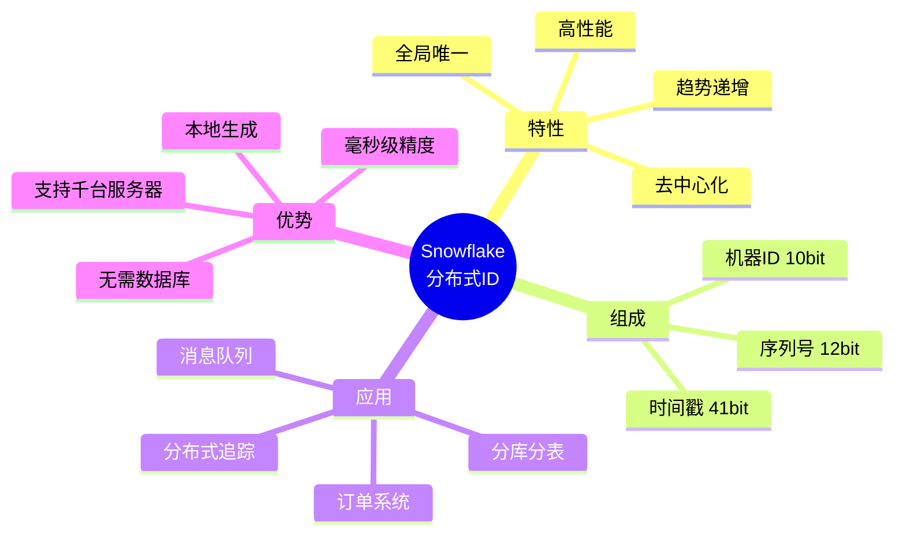
```mermaid
mindmap
  root((Snowflake<br/>分布式ID))
    特性
      全局唯一
      趋势递增
      高性能
      去中心化
    组成
      时间戳 41bit
      机器ID 10bit
      序列号 12bit
    应用
      订单系统
      分库分表
      消息队列
      分布式追踪
    优势
      无需数据库
      本地生成
      毫秒级精度
      支持千台服务器
```

### 1.2 核心设计目标

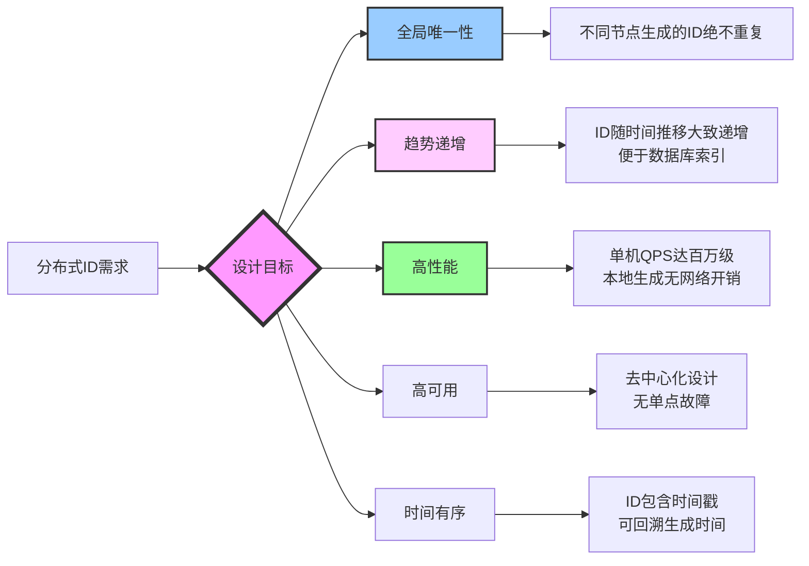
```mermaid
graph LR
    A[分布式ID需求] --> B{设计目标}

    B --> C[全局唯一性]
    B --> D[趋势递增]
    B --> E[高性能]
    B --> F[高可用]
    B --> G[时间有序]

    C --> C1[不同节点生成的ID绝不重复]
    D --> D1[ID随时间推移大致递增<br/>便于数据库索引]
    E --> E1[单机QPS达百万级<br/>本地生成无网络开销]
    F --> F1[去中心化设计<br/>无单点故障]
    G --> G1[ID包含时间戳<br/>可回溯生成时间]

    style B fill:#f9f,stroke:#333,stroke-width:4px
    style E fill:#9f9,stroke:#333,stroke-width:2px
    style C fill:#9cf,stroke:#333,stroke-width:2px
    style D fill:#fcf,stroke:#333,stroke-width:2px
```

### 1.3 应用场景全景图

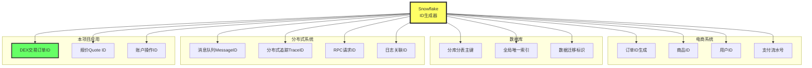
```mermaid
graph TB
    subgraph "电商系统"
        A1[订单ID生成]
        A2[商品ID]
        A3[用户ID]
        A4[支付流水号]
    end

    subgraph "数据库"
        B1[分库分表主键]
        B2[全局唯一索引]
        B3[数据迁移标识]
    end

    subgraph "分布式系统"
        C1[消息队列MessageID]
        C2[分布式追踪TraceID]
        C3[RPC请求ID]
        C4[日志关联ID]
    end

    subgraph "本项目应用"
        D1[DEX交易订单ID]
        D2[报价Quote ID]
        D3[账户操作ID]
    end

    SF[Snowflake<br/>ID生成器] --> A1
    SF --> A2
    SF --> A3
    SF --> A4
    SF --> B1
    SF --> B2
    SF --> B3
    SF --> C1
    SF --> C2
    SF --> C3
    SF --> C4
    SF --> D1
    SF --> D2
    SF --> D3

    style SF fill:#ff6,stroke:#333,stroke-width:4px
    style D1 fill:#6f6,stroke:#333,stroke-width:3px
```

---

## 2. 为什么需要分布式 ID

### 2.1 传统方案的痛点

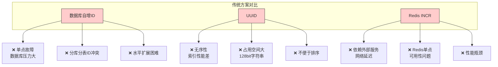
```mermaid
graph TB
    subgraph "传统方案对比"
        A[数据库自增ID]
        B[UUID]
        C[Redis INCR]
    end

    A --> A1[❌ 单点故障<br/>数据库压力大]
    A --> A2[❌ 分库分表ID冲突]
    A --> A3[❌ 水平扩展困难]

    B --> B1[❌ 无序性<br/>索引性能差]
    B --> B2[❌ 占用空间大<br/>128bit字符串]
    B --> B3[❌ 不便于排序]

    C --> C1[❌ 依赖外部服务<br/>网络延迟]
    C --> C2[❌ Redis单点<br/>可用性问题]
    C --> C3[❌ 性能瓶颈]

    style A fill:#fcc,stroke:#333
    style B fill:#fcc,stroke:#333
    style C fill:#fcc,stroke:#333
```

### 2.2 Snowflake 解决方案

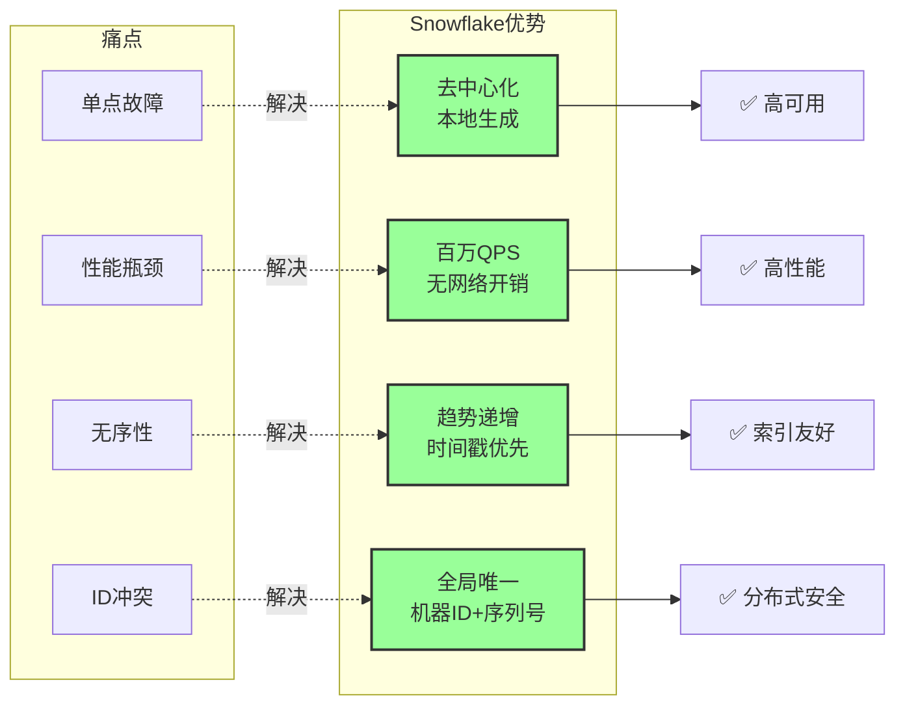
```mermaid
graph LR
    subgraph "痛点"
        P1[单点故障]
        P2[性能瓶颈]
        P3[无序性]
        P4[ID冲突]
    end

    subgraph "Snowflake优势"
        S1[去中心化<br/>本地生成]
        S2[百万QPS<br/>无网络开销]
        S3[趋势递增<br/>时间戳优先]
        S4[全局唯一<br/>机器ID+序列号]
    end

    P1 -.解决.-> S1
    P2 -.解决.-> S2
    P3 -.解决.-> S3
    P4 -.解决.-> S4

    S1 --> R1[✅ 高可用]
    S2 --> R2[✅ 高性能]
    S3 --> R3[✅ 索引友好]
    S4 --> R4[✅ 分布式安全]

    style S1 fill:#9f9,stroke:#333,stroke-width:2px
    style S2 fill:#9f9,stroke:#333,stroke-width:2px
    style S3 fill:#9f9,stroke:#333,stroke-width:2px
    style S4 fill:#9f9,stroke:#333,stroke-width:2px
```

### 2.3 分布式环境需求

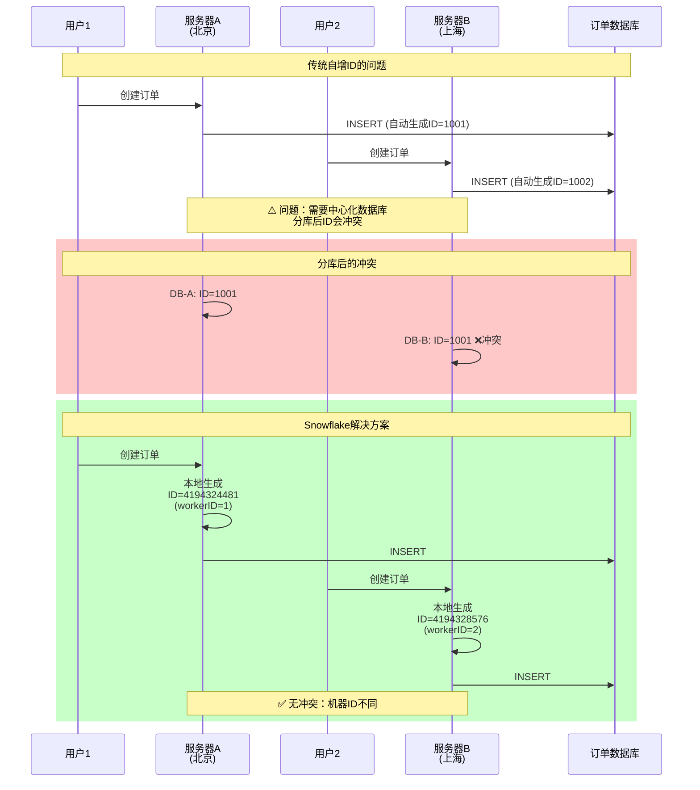
```mermaid
sequenceDiagram
    participant U1 as 用户1
    participant S1 as 服务器A<br/>(北京)
    participant U2 as 用户2
    participant S2 as 服务器B<br/>(上海)
    participant DB as 订单数据库

    Note over U1,DB: 传统自增ID的问题
    U1->>S1: 创建订单
    S1->>DB: INSERT (自动生成ID=1001)
    U2->>S2: 创建订单
    S2->>DB: INSERT (自动生成ID=1002)

    Note over S1,S2: ⚠️ 问题：需要中心化数据库<br/>分库后ID会冲突

    rect rgb(255, 200, 200)
        Note over U1,DB: 分库后的冲突
        S1->>S1: DB-A: ID=1001
        S2->>S2: DB-B: ID=1001 ❌冲突
    end

    rect rgb(200, 255, 200)
        Note over U1,DB: Snowflake解决方案
        U1->>S1: 创建订单
        S1->>S1: 本地生成<br/>ID=4194324481<br/>(workerID=1)
        S1->>DB: INSERT

        U2->>S2: 创建订单
        S2->>S2: 本地生成<br/>ID=4194328576<br/>(workerID=2)
        S2->>DB: INSERT

        Note over S1,S2: ✅ 无冲突：机器ID不同
    end
```

---

## 3. 核心设计原理

### 3.1 整体架构思想

Snowflake 采用 **"分而治之"** 的思想，将 64 位整数划分为多个字段：

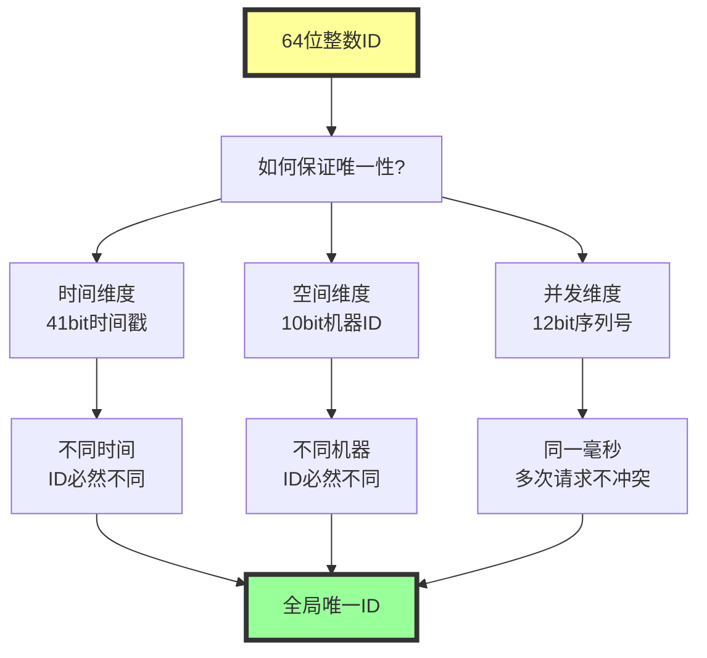
```mermaid
graph TD
    A[64位整数ID] --> B[如何保证唯一性?]

    B --> C1[时间维度<br/>41bit时间戳]
    B --> C2[空间维度<br/>10bit机器ID]
    B --> C3[并发维度<br/>12bit序列号]

    C1 --> D1[不同时间<br/>ID必然不同]
    C2 --> D2[不同机器<br/>ID必然不同]
    C3 --> D3[同一毫秒<br/>多次请求不冲突]

    D1 --> E[全局唯一ID]
    D2 --> E
    D3 --> E

    style A fill:#ff9,stroke:#333,stroke-width:4px
    style E fill:#9f9,stroke:#333,stroke-width:4px
```

### 3.2 三维坐标系模型

可以将 Snowflake ID 想象成三维空间中的点：

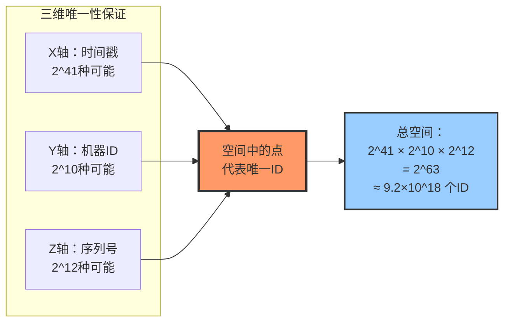
```mermaid
graph LR
    subgraph "三维唯一性保证"
        X[X轴：时间戳<br/>2^41种可能]
        Y[Y轴：机器ID<br/>2^10种可能]
        Z[Z轴：序列号<br/>2^12种可能]
    end

    X --> P[空间中的点<br/>代表唯一ID]
    Y --> P
    Z --> P

    P --> T[总空间：<br/>2^41 × 2^10 × 2^12<br/>= 2^63<br/>≈ 9.2×10^18 个ID]

    style P fill:#f96,stroke:#333,stroke-width:3px
    style T fill:#9cf,stroke:#333,stroke-width:2px
```

**类比理解**：
- **时间戳** = 楼层（41层楼，每层代表1毫秒）
- **机器ID** = 房间号（每层1024个房间）
- **序列号** = 座位号（每房间4096个座位）

任意两个人不可能占据同一个 **楼层+房间+座位**，因此ID全局唯一！

### 3.3 关键参数设计

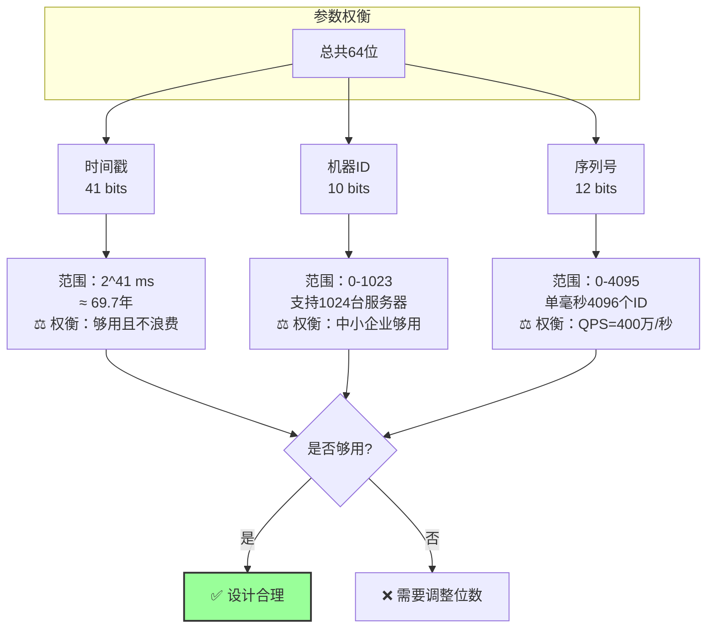
```mermaid
graph TB
    subgraph "参数权衡"
        A[总共64位]
    end

    A --> B1[时间戳<br/>41 bits]
    A --> B2[机器ID<br/>10 bits]
    A --> B3[序列号<br/>12 bits]

    B1 --> C1[范围：2^41 ms<br/>≈ 69.7年<br/>⚖️ 权衡：够用且不浪费]

    B2 --> C2[范围：0-1023<br/>支持1024台服务器<br/>⚖️ 权衡：中小企业够用]

    B3 --> C3[范围：0-4095<br/>单毫秒4096个ID<br/>⚖️ 权衡：QPS=400万/秒]

    C1 --> D{是否够用?}
    C2 --> D
    C3 --> D

    D -->|是| E[✅ 设计合理]
    D -->|否| F[❌ 需要调整位数]

    style E fill:#9f9,stroke:#333,stroke-width:2px
```

### 3.4 本项目的位分配策略

根据项目代码 `dex-alpha-order-svc/internal/idgen/types.go:72-93`：

```go
const (
    workerIDBits     = 10  // 工作机器ID位数
    datacenterIDBits = 0   // 数据中心ID位数（预留）
    sequenceBits     = 12  // 序列号位数

    maxWorkerID = 1023     // 支持1024个节点
    maxSequence = 4095     // 单毫秒4096个ID

    customEpoch = 1577836800000  // 2020-01-01 00:00:00 UTC
)
```

**设计决策**：
- ✅ **取消数据中心ID字段**：简化部署，将10位全部用于机器ID
- ✅ **自定义Epoch**：从2020年开始计算，延长使用寿命至2089年
- ✅ **序列号12位**：平衡并发能力与节点数量

---

## 4. 算法工作流程

### 4.1 核心流程总览

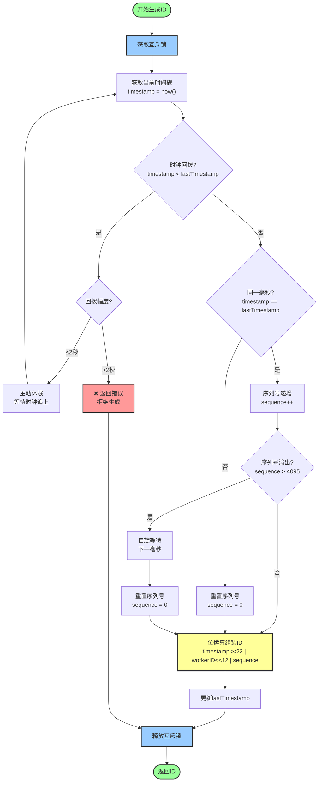
```mermaid
flowchart TD
    Start([开始生成ID]) --> Lock[获取互斥锁]
    Lock --> GetTime["获取当前时间戳<br/>timestamp = now()"]

    GetTime --> CheckClock{时钟回拨?<br/>timestamp < lastTimestamp}

    CheckClock -->|是| CheckDrift{回拨幅度?}
    CheckDrift -->|≤2秒| Wait[主动休眠<br/>等待时钟追上]
    CheckDrift -->|>2秒| Error1[❌ 返回错误<br/>拒绝生成]
    Wait --> GetTime

    CheckClock -->|否| CheckSameMs{同一毫秒?<br/>timestamp == lastTimestamp}

    CheckSameMs -->|是| IncSeq[序列号递增<br/>sequence++]
    IncSeq --> CheckOverflow{序列号溢出?<br/>sequence > 4095}
    CheckOverflow -->|是| WaitNext[自旋等待<br/>下一毫秒]
    WaitNext --> ResetSeq[重置序列号<br/>sequence = 0]
    CheckOverflow -->|否| Build

    CheckSameMs -->|否| ResetSeq2[重置序列号<br/>sequence = 0]
    ResetSeq2 --> Build
    ResetSeq --> Build

    Build["位运算组装ID<br/>timestamp<<22 | workerID<<12 | sequence"]
    Build --> Update[更新lastTimestamp]
    Update --> Unlock[释放互斥锁]
    Unlock --> Return([返回ID])

    Error1 --> Unlock

    style Start fill:#9f9,stroke:#333,stroke-width:2px
    style Return fill:#9f9,stroke:#333,stroke-width:2px
    style Error1 fill:#f99,stroke:#333,stroke-width:2px
    style Build fill:#ff9,stroke:#333,stroke-width:3px
    style Lock fill:#9cf,stroke:#333,stroke-width:2px
    style Unlock fill:#9cf,stroke:#333,stroke-width:2px
```

### 4.2 详细步骤拆解

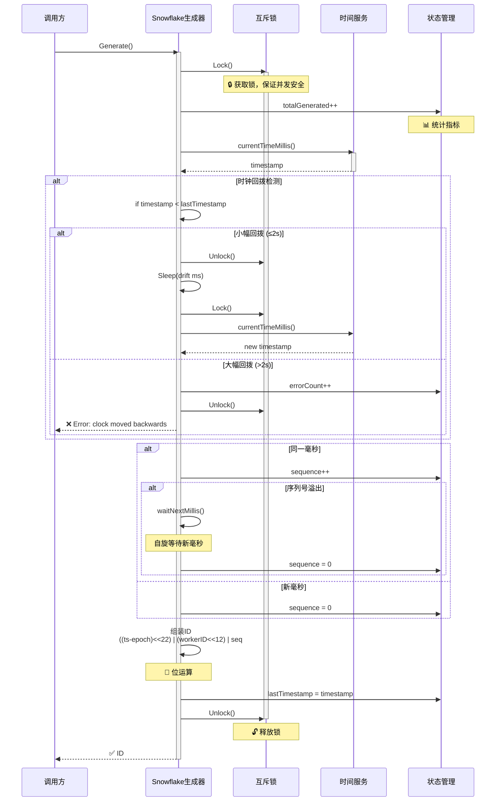
```mermaid
sequenceDiagram
    participant C as 调用方
    participant G as Snowflake生成器
    participant M as 互斥锁
    participant T as 时间服务
    participant S as 状态管理

    C->>G: Generate()
    activate G

    G->>M: Lock()
    activate M
    Note over M: 🔒 获取锁，保证并发安全

    G->>S: totalGenerated++
    Note over S: 📊 统计指标

    G->>T: currentTimeMillis()
    activate T
    T-->>G: timestamp
    deactivate T

    alt 时钟回拨检测
        G->>G: if timestamp < lastTimestamp
        alt 小幅回拨 (≤2s)
            G->>M: Unlock()
            G->>G: Sleep(drift ms)
            G->>M: Lock()
            G->>T: currentTimeMillis()
            T-->>G: new timestamp
        else 大幅回拨 (>2s)
            G->>S: errorCount++
            G->>M: Unlock()
            G-->>C: ❌ Error: clock moved backwards
        end
    end

    alt 同一毫秒
        G->>S: sequence++
        alt 序列号溢出
            G->>G: waitNextMillis()
            Note over G: 自旋等待新毫秒
            G->>S: sequence = 0
        end
    else 新毫秒
        G->>S: sequence = 0
    end

    G->>G: 组装ID<br/>((ts-epoch)<<22) | (workerID<<12) | seq
    Note over G: 🔧 位运算

    G->>S: lastTimestamp = timestamp

    G->>M: Unlock()
    deactivate M
    Note over M: 🔓 释放锁

    G-->>C: ✅ ID
    deactivate G
```

### 4.3 时间推进示意


```mermaid
gantt
    title ID生成时间轴（单机）
    dateFormat  x
    axisFormat %L

    section 毫秒1000
    ID_1 (seq=0)   :milestone, 1000, 0ms
    ID_2 (seq=1)   :milestone, 1000, 0ms
    ID_3 (seq=2)   :milestone, 1000, 0ms

    section 毫秒1001
    序列号重置为0  :crit, 1001, 0ms
    ID_4 (seq=0)   :milestone, 1001, 0ms
    ID_5 (seq=1)   :milestone, 1001, 0ms

    section 毫秒1002
    序列号重置为0  :crit, 1002, 0ms
    ID_6 (seq=0)   :milestone, 1002, 0ms
    ...4094个     :1002, 0ms
    ID_4101(seq=4095) :milestone, 1002, 0ms
    序列号溢出     :active, 1002, 0ms

    section 毫秒1003
    等待结束，重置  :done, 1003, 0ms
    ID_4102(seq=0) :milestone, 1003, 0ms
```

---

## 5. 关键特性对比

### 5.1 与其他方案对比

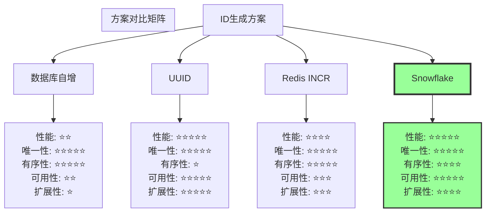
```mermaid
graph TB
    subgraph "方案对比矩阵"
        direction TB
    end

    A[ID生成方案] --> B1[数据库自增]
    A --> B2[UUID]
    A --> B3[Redis INCR]
    A --> B4[Snowflake]

    B1 --> C1[性能: ⭐⭐<br/>唯一性: ⭐⭐⭐⭐⭐<br/>有序性: ⭐⭐⭐⭐⭐<br/>可用性: ⭐⭐<br/>扩展性: ⭐]

    B2 --> C2[性能: ⭐⭐⭐⭐⭐<br/>唯一性: ⭐⭐⭐⭐⭐<br/>有序性: ⭐<br/>可用性: ⭐⭐⭐⭐⭐<br/>扩展性: ⭐⭐⭐⭐⭐]

    B3 --> C3[性能: ⭐⭐⭐⭐<br/>唯一性: ⭐⭐⭐⭐⭐<br/>有序性: ⭐⭐⭐⭐⭐<br/>可用性: ⭐⭐⭐<br/>扩展性: ⭐⭐⭐]

    B4 --> C4[性能: ⭐⭐⭐⭐⭐<br/>唯一性: ⭐⭐⭐⭐⭐<br/>有序性: ⭐⭐⭐⭐<br/>可用性: ⭐⭐⭐⭐⭐<br/>扩展性: ⭐⭐⭐⭐]

    style B4 fill:#9f9,stroke:#333,stroke-width:3px
    style C4 fill:#9f9,stroke:#333,stroke-width:2px
```

### 5.2 性能特性量化

| 特性         | 数据库自增  | UUID         | Redis INCR | Snowflake       |
| ------------ | ----------- | ------------ | ---------- | --------------- |
| **性能(QPS)**| 1千-1万     | 无限制       | 10万       | **100万-400万** |
| **延迟**     | 10-100ms    | <1μs         | 1-10ms     | **<1μs**        |
| **唯一性**   | ✅ 全局唯一 | ✅ 全局唯一  | ✅ 全局唯一| ✅ 全局唯一     |
| **有序性**   | ✅ 严格递增 | ❌ 完全无序  | ✅ 严格递增| ⚠️ 趋势递增     |
| **长度**     | 8 bytes     | 16 bytes     | 8 bytes    | **8 bytes**     |
| **可读性**   | ⭐⭐⭐⭐⭐  | ⭐           | ⭐⭐⭐⭐⭐ | ⭐⭐⭐⭐        |
| **依赖**     | MySQL等     | 无           | Redis      | **仅时钟**      |
| **单点风险** | ❌ 存在     | ✅ 无        | ❌ 存在    | ✅ **无**       |

### 5.3 理论能力边界

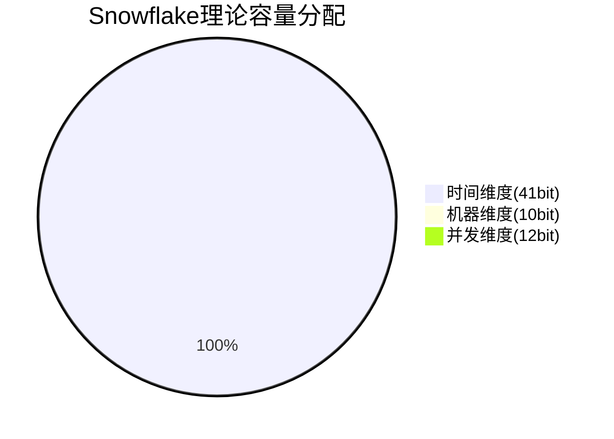
```mermaid
pie title Snowflake理论容量分配
    "时间维度(41bit)" : 2199023255551
    "机器维度(10bit)" : 1024
    "并发维度(12bit)" : 4096
```

**计算示例**：

```
📊 理论最大ID数量：
   = 2^41 × 2^10 × 2^12
   = 2^63
   = 9,223,372,036,854,775,808 个
   ≈ 922京个ID

⏱️ 使用寿命：
   = 2^41 毫秒
   = 2,199,023,255,551 ms
   = 69.7 年（从customEpoch开始）
   = 2020年 - 2089年

🖥️ 最大节点数：
   = 2^10
   = 1,024 台服务器

⚡ 单机理论QPS：
   = 2^12 × 1000
   = 4,096,000 次/秒
   = 400万/秒
```

---

## 6. 项目架构总览

### 6.1 在 DEX 系统中的位置

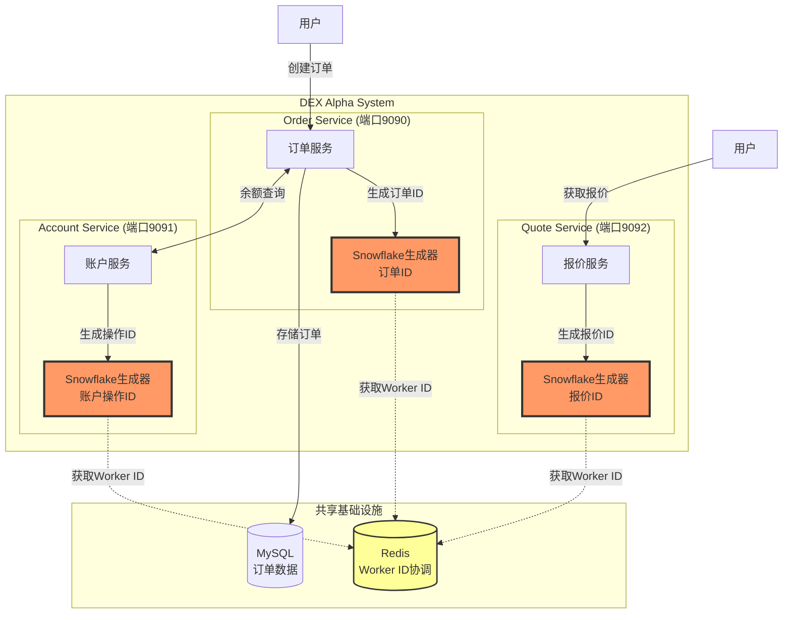
```mermaid
graph TB
    subgraph "DEX Alpha System"
        subgraph "Order Service (端口9090)"
            OS[订单服务]
            OG[Snowflake生成器<br/>订单ID]
        end

        subgraph "Quote Service (端口9092)"
            QS[报价服务]
            QG[Snowflake生成器<br/>报价ID]
        end

        subgraph "Account Service (端口9091)"
            AS[账户服务]
            AG[Snowflake生成器<br/>账户操作ID]
        end
    end

    subgraph "共享基础设施"
        Redis[(Redis<br/>Worker ID协调)]
        DB[(MySQL<br/>订单数据)]
    end

    U1[用户] -->|创建订单| OS
    OS -->|生成订单ID| OG
    OG -.获取Worker ID.-> Redis
    OS -->|存储订单| DB

    U2[用户] -->|获取报价| QS
    QS -->|生成报价ID| QG
    QG -.获取Worker ID.-> Redis

    OS <-->|余额查询| AS
    AS -->|生成操作ID| AG
    AG -.获取Worker ID.-> Redis

    style OG fill:#f96,stroke:#333,stroke-width:3px
    style QG fill:#f96,stroke:#333,stroke-width:3px
    style AG fill:#f96,stroke:#333,stroke-width:3px
    style Redis fill:#ff9,stroke:#333,stroke-width:2px
```

### 6.2 模块依赖关系

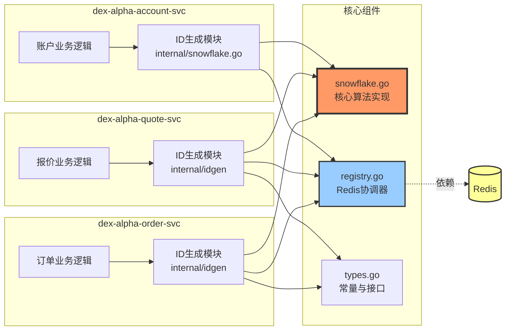
```mermaid
graph LR
    subgraph "dex-alpha-order-svc"
        OrderBiz[订单业务逻辑]
        OrderIDGen[ID生成模块<br/>internal/idgen]
    end

    subgraph "dex-alpha-quote-svc"
        QuoteBiz[报价业务逻辑]
        QuoteIDGen[ID生成模块<br/>internal/idgen]
    end

    subgraph "dex-alpha-account-svc"
        AcctBiz[账户业务逻辑]
        AcctIDGen[ID生成模块<br/>internal/snowflake.go]
    end

    subgraph "核心组件"
        SF[snowflake.go<br/>核心算法实现]
        REG[registry.go<br/>Redis协调器]
        TYPES[types.go<br/>常量与接口]
    end

    OrderBiz --> OrderIDGen
    QuoteBiz --> QuoteIDGen
    AcctBiz --> AcctIDGen

    OrderIDGen --> SF
    OrderIDGen --> REG
    OrderIDGen --> TYPES

    QuoteIDGen --> SF
    QuoteIDGen --> REG
    QuoteIDGen --> TYPES

    AcctIDGen --> SF
    AcctIDGen --> REG

    REG -.依赖.-> Redis[(Redis)]

    style SF fill:#f96,stroke:#333,stroke-width:3px
    style REG fill:#9cf,stroke:#333,stroke-width:2px
    style Redis fill:#ff9,stroke:#333,stroke-width:2px
```

### 6.3 代码结构树

```
dex-alpha-order-svc/internal/idgen/
├── idgen.go           # 全局生成器管理、ID解析
├── snowflake.go       # 核心算法实现（本文档重点）
├── registry.go        # Redis Worker ID 协调器
├── types.go           # 常量定义、接口声明
└── idgen_test.go      # 完整的单元测试

关键文件说明：
┌─────────────────────────────────────────────────┐
│ snowflake.go (183行)                            │
│ ├─ snowflakeGenerator 结构体                   │
│ ├─ Generate() - 核心生成逻辑                   │
│ ├─ GenerateBatch() - 批量生成                  │
│ ├─ waitNextMillis() - 等待下一毫秒             │
│ └─ Health() - 健康检查                          │
└─────────────────────────────────────────────────┘

┌─────────────────────────────────────────────────┐
│ registry.go (216行)                             │
│ ├─ workerRegistry 结构体                        │
│ ├─ acquireWorkerID() - 获取Worker ID            │
│ ├─ heartbeat() - 心跳维持                       │
│ ├─ refreshTTL() - 刷新TTL                       │
│ └─ release() - 释放Worker ID                    │
└─────────────────────────────────────────────────┘
```

### 6.4 初始化时序

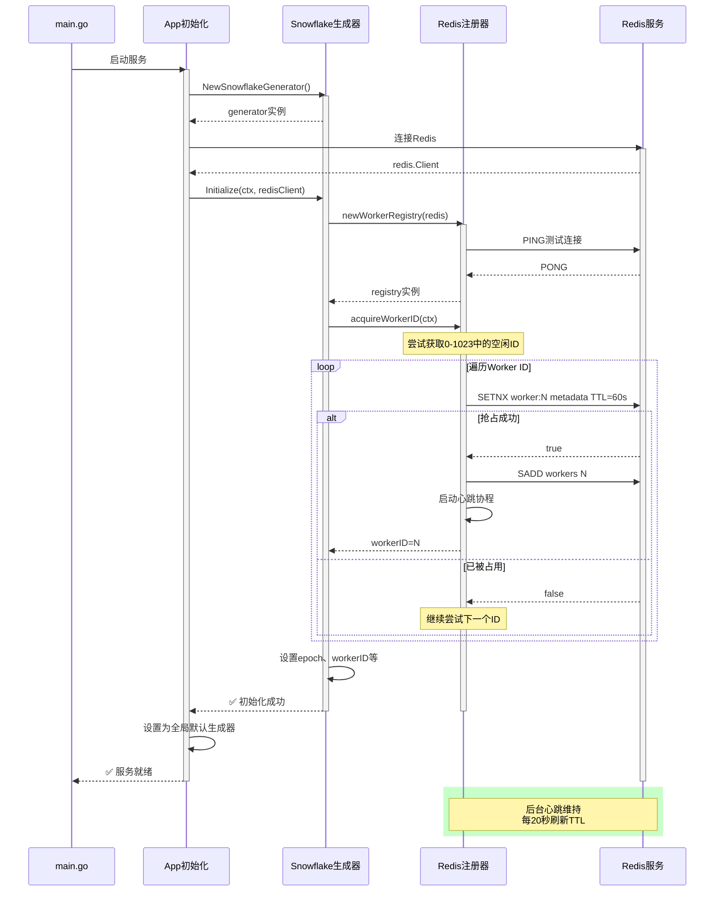
```mermaid
sequenceDiagram
    participant M as main.go
    participant A as App初始化
    participant G as Snowflake生成器
    participant R as Redis注册器
    participant RD as Redis服务

    M->>A: 启动服务
    activate A

    A->>G: NewSnowflakeGenerator()
    activate G
    G-->>A: generator实例

    A->>RD: 连接Redis
    activate RD
    RD-->>A: redis.Client

    A->>G: Initialize(ctx, redisClient)
    G->>R: newWorkerRegistry(redis)
    activate R
    R->>RD: PING测试连接
    RD-->>R: PONG
    R-->>G: registry实例

    G->>R: acquireWorkerID(ctx)
    Note over R: 尝试获取0-1023中的空闲ID

    loop 遍历Worker ID
        R->>RD: SETNX worker:N metadata TTL=60s
        alt 抢占成功
            RD-->>R: true
            R->>RD: SADD workers N
            R->>R: 启动心跳协程
            R-->>G: workerID=N
        else 已被占用
            RD-->>R: false
            Note over R: 继续尝试下一个ID
        end
    end

    G->>G: 设置epoch、workerID等
    G-->>A: ✅ 初始化成功
    deactivate R
    deactivate G

    A->>A: 设置为全局默认生成器
    A-->>M: ✅ 服务就绪
    deactivate A
    deactivate RD

    rect rgb(200, 255, 200)
        Note over R,RD: 后台心跳维持<br/>每20秒刷新TTL
    end
```

---

## 🎯 本部分小结

### 核心要点回顾

1. **Snowflake是什么**：Twitter开源的分布式唯一ID生成算法
2. **解决什么问题**：数据库自增ID在分布式环境下的单点故障、性能瓶颈、ID冲突
3. **核心思想**：三维唯一性（时间+机器+序列号）
4. **关键优势**：去中心化、高性能、趋势递增、易扩展

### 下一部分预告

📖 **第2部分：ID结构与位运算详解**

将深入讲解：
- 64位ID的精确结构
- 位运算的底层实现
- ID组装与解析过程
- 自定义Epoch的设计考量
- 实际案例分析

---

**继续阅读**：[第2部分：ID结构与位运算详解 →](./Snowflake算法详解-02-ID结构与位运算.md)

**返回目录**：[Snowflake算法详解系列](./README.md)
