# Snowflake 算法深度解析（第2部分）：ID结构与位运算详解

> **文档系列**：共5部分
> **当前部分**：第2部分 - ID结构与位运算详解
> **项目**：dex-alpha-order-svc / dex-alpha-quote-svc / dex-alpha-account-svc
> **版本**：v2.0（图文增强版）
> **生成时间**：2025-10-12

---

## 📚 系列文档导航

1. [第1部分：算法概述与核心原理](./Snowflake算法详解-01-概述与核心原理.md)
2. **[当前] 第2部分：ID结构与位运算详解**
3. 第3部分：顺序递增保证机制（核心）
4. 第4部分：分布式协调与实现细节
5. 第5部分：性能优化与最佳实践

---

## 目录

- [1. 64位ID结构全景](#1-64位id结构全景)
- [2. 各字段详细解析](#2-各字段详细解析)
- [3. 位运算实现原理](#3-位运算实现原理)
- [4. ID组装过程](#4-id组装过程)
- [5. ID解析过程](#5-id解析过程)
- [6. 实战案例分析](#6-实战案例分析)

---

## 1. 64位ID结构全景

### 1.1 位字段布局图

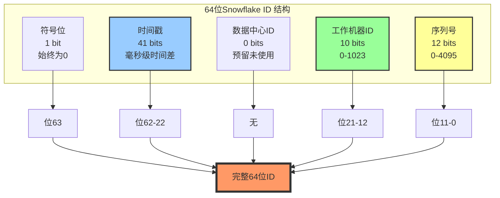
```mermaid
graph TB
    subgraph "64位Snowflake ID 结构"
        BIT0[符号位<br/>1 bit<br/>始终为0]
        BIT1[时间戳<br/>41 bits<br/>毫秒级时间差]
        BIT2[数据中心ID<br/>0 bits<br/>预留未使用]
        BIT3[工作机器ID<br/>10 bits<br/>0-1023]
        BIT4[序列号<br/>12 bits<br/>0-4095]
    end

    BIT0 --> L0[位63]
    BIT1 --> L1[位62-22]
    BIT2 --> L2[无]
    BIT3 --> L3[位21-12]
    BIT4 --> L4[位11-0]

    L0 --> ID[完整64位ID]
    L1 --> ID
    L2 --> ID
    L3 --> ID
    L4 --> ID

    style ID fill:#f96,stroke:#333,stroke-width:4px
    style BIT1 fill:#9cf,stroke:#333,stroke-width:2px
    style BIT3 fill:#9f9,stroke:#333,stroke-width:2px
    style BIT4 fill:#ff9,stroke:#333,stroke-width:2px
```

### 1.2 二进制可视化

```
┌─────────────────────────────────────────────────────────────────┐
│ 完整64位ID二进制示例                                              │
└─────────────────────────────────────────────────────────────────┘

位序号: 63  62───────────────────────────22  21──────────12  11──────0
        │   │                               │  │              │  │      │
格式:   S   TTTTTTTTTTTTTTTTTTTTTTTTTTTTTTTTTTTTT WWWWWWWWWW  SSSSSSSSSSSS
        │   └─────────── 41 bits ───────────┘  └─ 10 bits ─┘ └ 12 bits ┘
        │
        └─ 符号位(0)

具体示例: 397461299425380
二进制:   0 00000000001011010000100101001001100000000  0000000101  000001100100
          │ └────────────── 94694400000 ─────────────┘  └── 5 ───┘  └─ 100 ─┘
          │                                                │            │
          符号   时间差(ms from 2020-01-01)              WorkerID   Sequence
```

### 1.3 字段范围总览

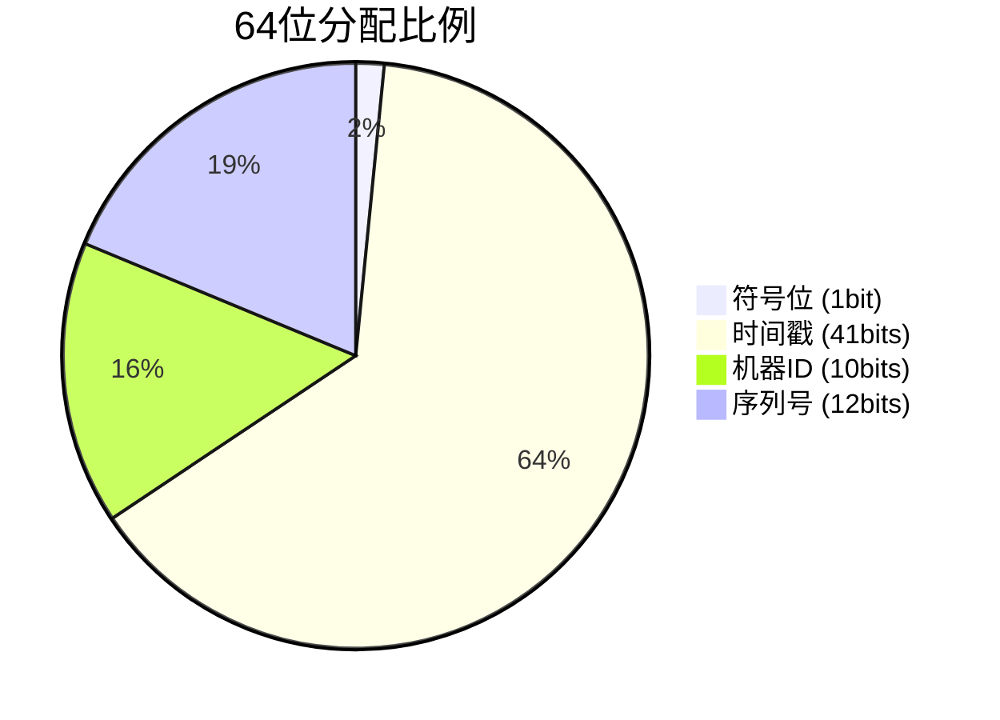
```mermaid
pie title 64位分配比例
    "符号位 (1bit)" : 1
    "时间戳 (41bits)" : 41
    "机器ID (10bits)" : 10
    "序列号 (12bits)" : 12
```

| 字段         | 位数 | 位置    | 取值范围                   | 说明                       |
| ------------ | ---- | ------- | -------------------------- | -------------------------- |
| **符号位**   | 1    | [63]    | 0（固定）                  | 保证ID为正数               |
| **时间戳**   | 41   | [62:22] | 0 ~ 2,199,023,255,551      | 毫秒时间差（69.7年）       |
| **数据中心** | 0    | -       | -                          | 预留字段（本项目未使用）   |
| **机器ID**   | 10   | [21:12] | 0 ~ 1,023                  | 支持1024个节点             |
| **序列号**   | 12   | [11:0]  | 0 ~ 4,095                  | 单毫秒内最多4096个ID       |

---

## 2. 各字段详细解析

### 2.1 符号位（Sign Bit）

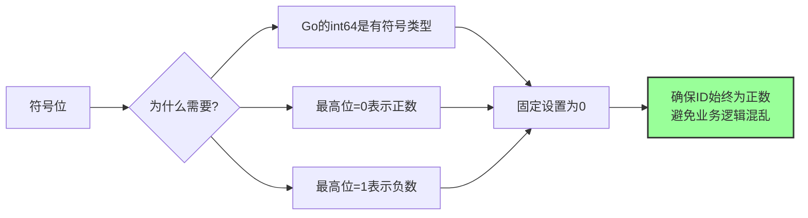
```mermaid
graph LR
    A[符号位] --> B{为什么需要?}
    B --> C1[Go的int64是有符号类型]
    B --> C2[最高位=0表示正数]
    B --> C3[最高位=1表示负数]

    C1 --> D[固定设置为0]
    C2 --> D
    C3 --> D

    D --> E[确保ID始终为正数<br/>避免业务逻辑混乱]

    style E fill:#9f9,stroke:#333,stroke-width:2px
```

**代码实现**：
```go
// 位运算自然保证符号位为0
// 因为所有字段都是正数，组合后最高位必为0
id := (timestamp << 22) | (workerID << 12) | sequence
// id 的最高位(第63位)自然为0
```

**为什么不用这1位？**
- ❌ 使用它需要处理负数情况，增加复杂度
- ✅ 保持为0，ID始终为正数，符合业务习惯
- ✅ 数据库索引、比较操作更简单

### 2.2 时间戳（Timestamp）

#### 2.2.1 字段设计

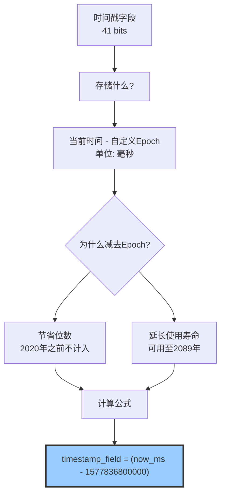
```mermaid
graph TB
    A[时间戳字段<br/>41 bits] --> B[存储什么?]
    B --> C[当前时间 - 自定义Epoch<br/>单位: 毫秒]

    C --> D{为什么减去Epoch?}
    D --> E1[节省位数<br/>2020年之前不计入]
    D --> E2[延长使用寿命<br/>可用至2089年]

    E1 --> F[计算公式]
    E2 --> F

    F --> G["timestamp_field = (now_ms - 1577836800000)"]

    style G fill:#9cf,stroke:#333,stroke-width:3px
```

#### 2.2.2 自定义Epoch详解

根据 `dex-alpha-order-svc/internal/idgen/types.go:92`：

```go
const customEpoch = 1577836800000  // 2020-01-01 00:00:00 UTC
```

**为什么选择 2020-01-01？**

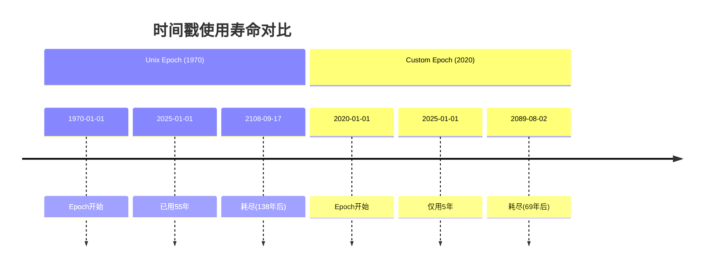
```mermaid
timeline
    title 时间戳使用寿命对比
    section Unix Epoch (1970)
        1970-01-01 : Epoch开始
        2025-01-01 : 已用55年
        2108-09-17 : 耗尽(138年后)
    section Custom Epoch (2020)
        2020-01-01 : Epoch开始
        2025-01-01 : 仅用5年
        2089-08-02 : 耗尽(69年后)
```

**对比计算**：

| Epoch起点  | 2025年时间戳(ms)       | 剩余可用时间 | 二进制位需求    |
| ---------- | ---------------------- | ------------ | --------------- |
| 1970-01-01 | 1,735,689,600,000      | 83年         | 需要41位才够用  |
| 2020-01-01 | 157,889,600,000        | 64年         | ✅ 41位完全够用 |

**收益**：
```
节省的时间戳空间 = (2020 - 1970) × 365.25 × 24 × 3600 × 1000
                  ≈ 1,577,836,800,000 ms
                  ≈ 50 年的时间戳空间
```

#### 2.2.3 时间戳范围计算

```go
最大时间戳值 = 2^41 - 1 = 2,199,023,255,551 毫秒

转换为年:
= 2,199,023,255,551 ms
= 2,199,023,255.551 秒
= 36,650,387.59 分钟
= 610,839.79 小时
= 25,451.66 天
≈ 69.73 年

可用时间范围:
起点: 2020-01-01 00:00:00 UTC (customEpoch)
终点: 2020 + 69.73 ≈ 2089-08-02
```

#### 2.2.4 时间精度影响

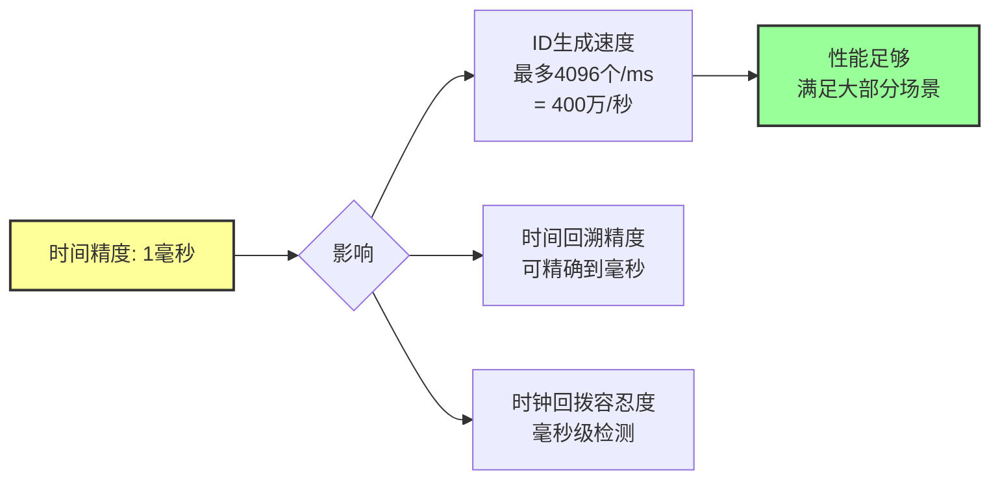
```mermaid
graph LR
    A[时间精度: 1毫秒] --> B{影响}

    B --> C1[ID生成速度<br/>最多4096个/ms<br/>= 400万/秒]
    B --> C2[时间回溯精度<br/>可精确到毫秒]
    B --> C3[时钟回拨容忍度<br/>毫秒级检测]

    C1 --> D[性能足够<br/>满足大部分场景]

    style A fill:#ff9,stroke:#333,stroke-width:2px
    style D fill:#9f9,stroke:#333,stroke-width:2px
```

**如果改用其他精度？**

| 精度    | 单位时间ID数 | 时钟回拨容忍度 | 使用寿命 | 评价       |
| ------- | ------------ | -------------- | -------- | ---------- |
| 微秒    | 4096个/μs    | ✅ 极精确      | 69.7天   | ❌ 太短    |
| **毫秒**| **4096个/ms**| **✅ 精确**    | **69.7年**| ✅ **最佳**|
| 秒      | 4096个/s     | ⚠️ 粗糙        | 6973年   | ⚠️ QPS不足 |

### 2.3 工作机器ID（Worker ID）

#### 2.3.1 字段职责

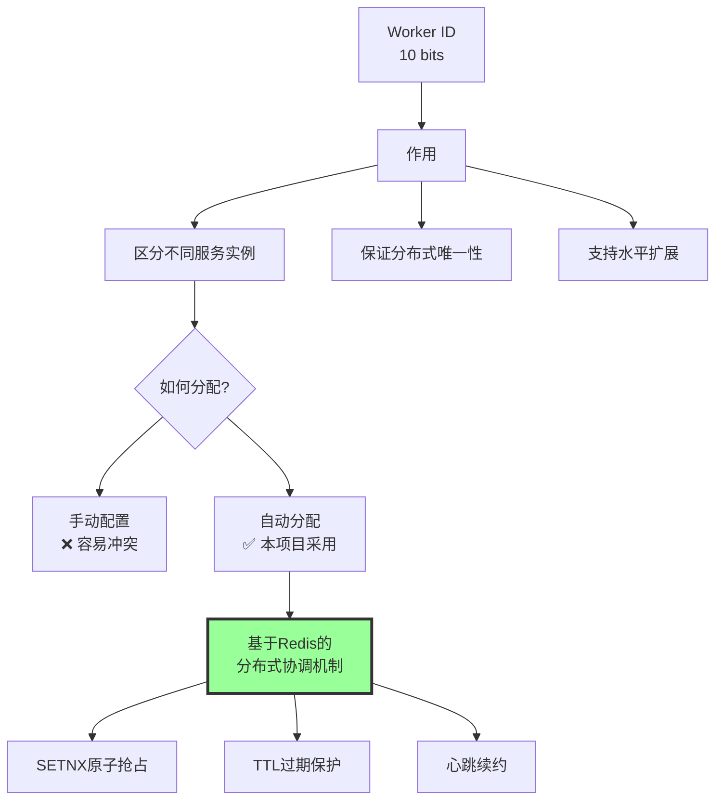
```mermaid
graph TB
    A[Worker ID<br/>10 bits] --> B[作用]

    B --> C1[区分不同服务实例]
    B --> C2[保证分布式唯一性]
    B --> C3[支持水平扩展]

    C1 --> D{如何分配?}
    D --> E1[手动配置<br/>❌ 容易冲突]
    D --> E2[自动分配<br/>✅ 本项目采用]

    E2 --> F[基于Redis的<br/>分布式协调机制]

    F --> G1[SETNX原子抢占]
    F --> G2[TTL过期保护]
    F --> G3[心跳续约]

    style F fill:#9f9,stroke:#333,stroke-width:3px
```

#### 2.3.2 容量规划

```go
workerIDBits = 10  // 位数

最大Worker数量 = 2^10 = 1024 个节点

实际建议配置:
├─ 生产环境: 800 个 (78%)
├─ 预发布环境: 100 个 (10%)
├─ 测试环境: 100 个 (10%)
└─ 预留: 24 个 (2%)
```

**不同规模企业对比**：

| 企业规模 | 实例数 | 10bit够用? | 建议方案                      |
| -------- | ------ | ---------- | ----------------------------- |
| 小型     | < 50   | ✅ 完全够  | 使用默认10bit                 |
| 中型     | 50-500 | ✅ 够用    | 使用默认10bit                 |
| 大型     | 500+   | ⚠️ 紧张    | 考虑启用datacenterID分组      |
| 超大型   | 1000+  | ❌ 不够    | 需要修改位数分配或使用数据中心ID |

#### 2.3.3 Worker ID 冲突检测

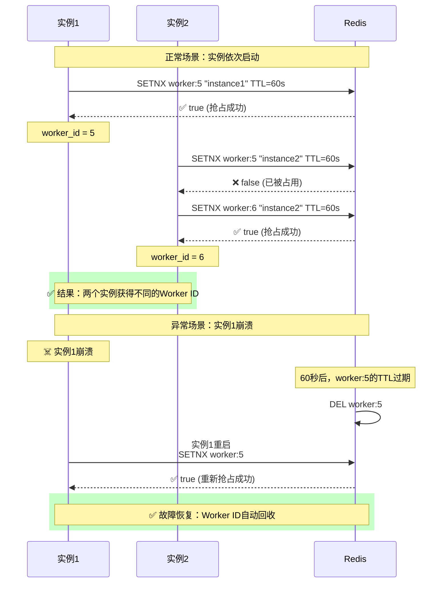
```mermaid
sequenceDiagram
    participant I1 as 实例1
    participant I2 as 实例2
    participant R as Redis

    Note over I1,R: 正常场景：实例依次启动

    I1->>R: SETNX worker:5 "instance1" TTL=60s
    R-->>I1: ✅ true (抢占成功)
    Note over I1: worker_id = 5

    I2->>R: SETNX worker:5 "instance2" TTL=60s
    R-->>I2: ❌ false (已被占用)
    I2->>R: SETNX worker:6 "instance2" TTL=60s
    R-->>I2: ✅ true (抢占成功)
    Note over I2: worker_id = 6

    rect rgb(200, 255, 200)
        Note over I1,I2: ✅ 结果：两个实例获得不同的Worker ID
    end

    Note over I1,R: 异常场景：实例1崩溃

    Note over I1: ☠️ 实例1崩溃

    Note over R: 60秒后，worker:5的TTL过期
    R->>R: DEL worker:5

    I1->>R: 实例1重启<br/>SETNX worker:5
    R-->>I1: ✅ true (重新抢占成功)

    rect rgb(200, 255, 200)
        Note over I1,R: ✅ 故障恢复：Worker ID自动回收
    end
```

### 2.4 序列号（Sequence）

#### 2.4.1 字段作用

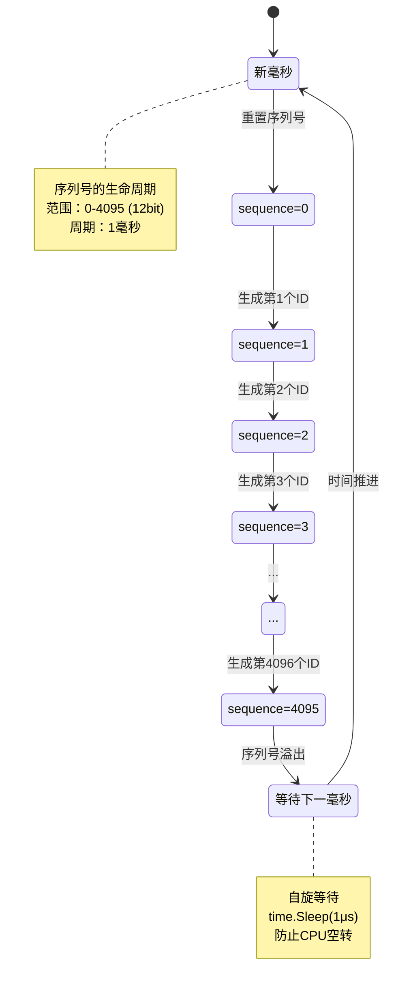
```mermaid
stateDiagram-v2
    [*] --> 新毫秒
    新毫秒 --> sequence=0: 重置序列号

    sequence=0 --> sequence=1: 生成第1个ID
    sequence=1 --> sequence=2: 生成第2个ID
    sequence=2 --> sequence=3: 生成第3个ID
    sequence=3 --> ...: ...

    ... --> sequence=4095: 生成第4096个ID
    sequence=4095 --> 等待下一毫秒: 序列号溢出

    等待下一毫秒 --> 新毫秒: 时间推进

    note right of 新毫秒
        序列号的生命周期
        范围：0-4095 (12bit)
        周期：1毫秒
    end note

    note right of 等待下一毫秒
        自旋等待
        time.Sleep(1μs)
        防止CPU空转
    end note
```

#### 2.4.2 并发能力计算

```go
序列号位数 = 12 bits
单毫秒最大ID数 = 2^12 = 4,096 个

理论QPS:
= 4,096 个/ms × 1,000 ms/s
= 4,096,000 个/秒
= 409.6 万/秒

实际QPS (考虑锁开销):
≈ 100万 - 200万/秒
```

**序列号不够用怎么办？**

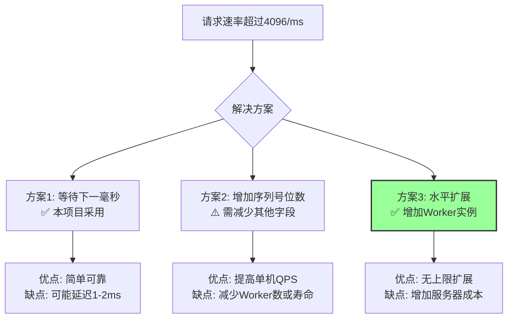
```mermaid
graph TD
    A[请求速率超过4096/ms] --> B{解决方案}

    B --> C1[方案1: 等待下一毫秒<br/>✅ 本项目采用]
    B --> C2[方案2: 增加序列号位数<br/>⚠️ 需减少其他字段]
    B --> C3[方案3: 水平扩展<br/>✅ 增加Worker实例]

    C1 --> D1[优点: 简单可靠<br/>缺点: 可能延迟1-2ms]
    C2 --> D2[优点: 提高单机QPS<br/>缺点: 减少Worker数或寿命]
    C3 --> D3[优点: 无上限扩展<br/>缺点: 增加服务器成本]

    style C3 fill:#9f9,stroke:#333,stroke-width:2px
```

#### 2.4.3 序列号重置时机

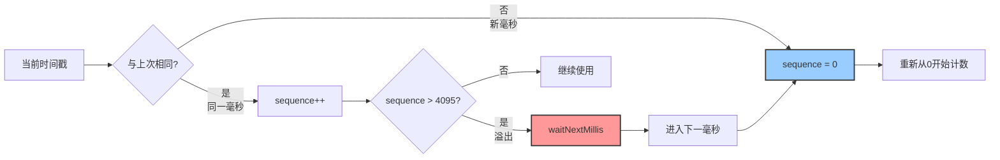
```mermaid
graph LR
    A[当前时间戳] --> B{与上次相同?}

    B -->|是<br/>同一毫秒| C[sequence++]
    B -->|否<br/>新毫秒| D[sequence = 0]

    C --> E{sequence > 4095?}
    E -->|是<br/>溢出| F[waitNextMillis]
    E -->|否| G[继续使用]

    F --> H[进入下一毫秒]
    H --> D

    D --> I[重新从0开始计数]

    style D fill:#9cf,stroke:#333,stroke-width:2px
    style F fill:#f99,stroke:#333,stroke-width:2px
```

---

## 3. 位运算实现原理

### 3.1 核心位运算常量

根据 `dex-alpha-order-svc/internal/idgen/types.go:72-90`：

```go
const (
    // 位数定义
    workerIDBits     = 10
    datacenterIDBits = 0
    sequenceBits     = 12

    // 最大值（用于溢出检测）
    maxWorkerID = ^(-1 << workerIDBits)  // 1023
    maxSequence = ^(-1 << sequenceBits)  // 4095

    // 左移位数（用于ID组装）
    workerIDShift     = sequenceBits                          // 12
    datacenterIDShift = sequenceBits + workerIDBits           // 22
    timestampShift    = sequenceBits + workerIDBits + datacenterIDBits  // 22

    // 掩码（用于ID解析）
    sequenceMask   = ^(-1 << sequenceBits)     // 0xFFF (4095)
    workerMask     = ^(-1 << workerIDBits)     // 0x3FF (1023)
    datacenterMask = ^(-1 << datacenterIDBits) // 0x0
    timestampMask  = ^(-1 << 41)               // 0x1FFFFFFFFFF
)
```

### 3.2 位运算可视化解析

#### 3.2.1 计算 `maxSequence` 的过程

```
目标：计算 2^12 - 1 = 4095

步骤1: -1 的二进制（补码）
-1 = 1111111111111111111111111111111111111111111111111111111111111111 (64个1)

步骤2: -1 << 12 (左移12位)
= 1111111111111111111111111111111111111111111111111111000000000000
  └───────────────── 52个1 ─────────────────┘└─── 12个0 ───┘

步骤3: ^(-1 << 12) (按位取反)
= 0000000000000000000000000000000000000000000000000000111111111111
  └───────────────── 52个0 ─────────────────┘└─── 12个1 ───┘

结果: 0b111111111111 = 4095 ✅
```

**Mermaid 可视化**：

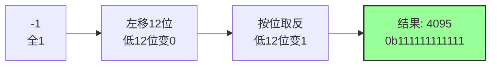
```mermaid
graph LR
    A["-1<br/>全1"] --> B["左移12位<br/>低12位变0"]
    B --> C["按位取反<br/>低12位变1"]
    C --> D["结果: 4095<br/>0b111111111111"]

    style D fill:#9f9,stroke:#333,stroke-width:2px
```

#### 3.2.2 计算左移位数的逻辑

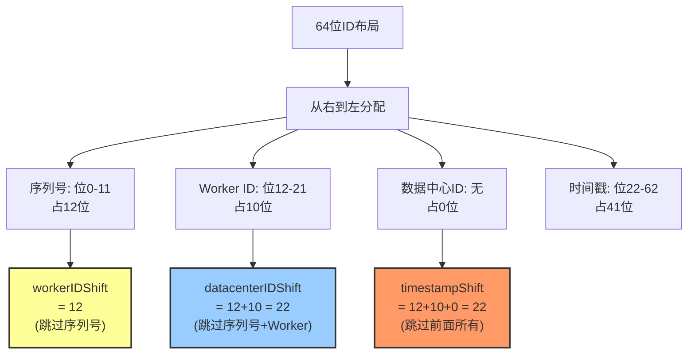
```mermaid
graph TB
    A[64位ID布局] --> B[从右到左分配]

    B --> C1[序列号: 位0-11<br/>占12位]
    B --> C2[Worker ID: 位12-21<br/>占10位]
    B --> C3[数据中心ID: 无<br/>占0位]
    B --> C4[时间戳: 位22-62<br/>占41位]

    C1 --> D1["workerIDShift<br/>= 12<br/>(跳过序列号)"]
    C2 --> D2["datacenterIDShift<br/>= 12+10 = 22<br/>(跳过序列号+Worker)"]
    C3 --> D3["timestampShift<br/>= 12+10+0 = 22<br/>(跳过前面所有)"]

    style D1 fill:#ff9,stroke:#333,stroke-width:2px
    style D2 fill:#9cf,stroke:#333,stroke-width:2px
    style D3 fill:#f96,stroke:#333,stroke-width:2px
```

### 3.3 位掩码的作用

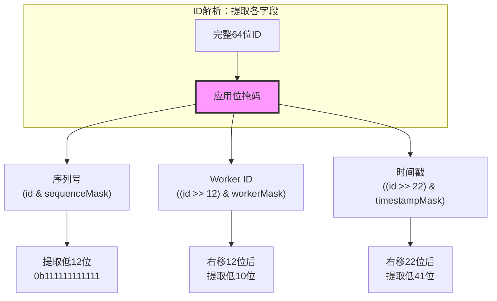
```mermaid
graph TB
    subgraph "ID解析：提取各字段"
        A[完整64位ID] --> B[应用位掩码]
    end

    B --> C1["序列号<br/>(id & sequenceMask)"]
    B --> C2["Worker ID<br/>((id >> 12) & workerMask)"]
    B --> C3["时间戳<br/>((id >> 22) & timestampMask)"]

    C1 --> D1["提取低12位<br/>0b111111111111"]
    C2 --> D2["右移12位后<br/>提取低10位"]
    C3 --> D3["右移22位后<br/>提取低41位"]

    style B fill:#f9f,stroke:#333,stroke-width:3px
```

**示例代码**：

```go
// 假设 ID = 397461299425380
id := int64(397461299425380)

// 提取序列号
sequence := id & sequenceMask  // 取低12位
// = ...000001100100 & 0xFFF
// = 100

// 提取Worker ID
workerID := (id >> workerIDShift) & workerMask  // 右移12位，取低10位
// = ...0000000101000001100100 >> 12
// = ...00000001010000
// = ...0101 & 0x3FF
// = 5

// 提取时间戳
timestamp := (id >> timestampShift) & timestampMask  // 右移22位，取低41位
// = 94694400000
```

---

## 4. ID组装过程

### 4.1 组装流程图

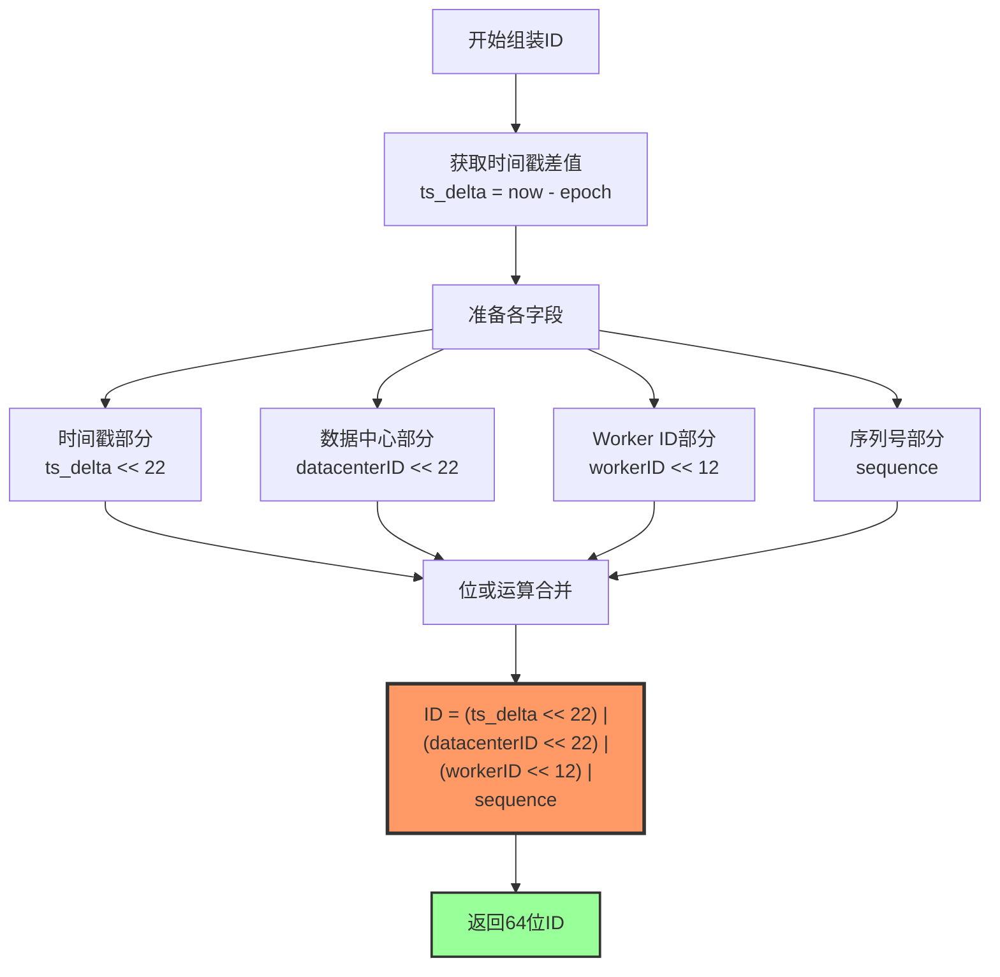
```mermaid
flowchart TD
    A[开始组装ID] --> B[获取时间戳差值<br/>ts_delta = now - epoch]
    B --> C[准备各字段]

    C --> D1[时间戳部分<br/>ts_delta << 22]
    C --> D2[数据中心部分<br/>datacenterID << 22]
    C --> D3[Worker ID部分<br/>workerID << 12]
    C --> D4[序列号部分<br/>sequence]

    D1 --> E[位或运算合并]
    D2 --> E
    D3 --> E
    D4 --> E

    E --> F["ID = (ts_delta << 22) |<br/>(datacenterID << 22) |<br/>(workerID << 12) |<br/>sequence"]

    F --> G[返回64位ID]

    style F fill:#f96,stroke:#333,stroke-width:3px
    style G fill:#9f9,stroke:#333,stroke-width:2px
```

### 4.2 逐步组装示意

**示例数据**：
- 当前时间：`2023-01-01 00:00:00.000 UTC` = `1672531200000` ms
- Epoch：`2020-01-01 00:00:00.000 UTC` = `1577836800000` ms
- Worker ID：`5`
- Sequence：`100`

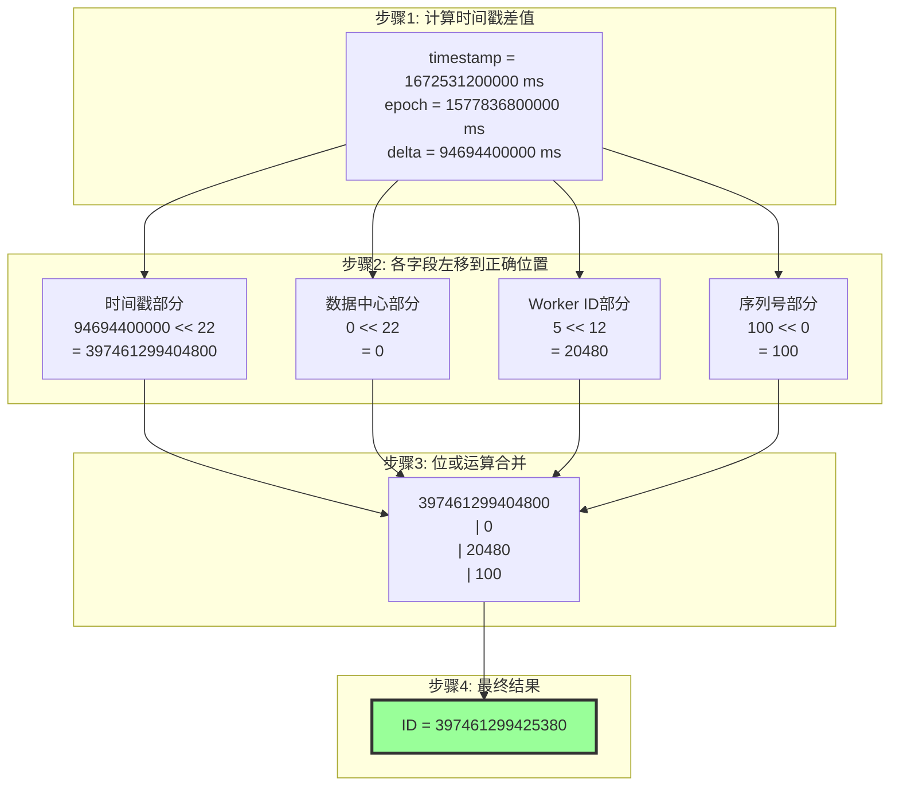
```mermaid
graph TB
    subgraph "步骤1: 计算时间戳差值"
        A1["timestamp = 1672531200000 ms<br/>epoch = 1577836800000 ms<br/>delta = 94694400000 ms"]
    end

    subgraph "步骤2: 各字段左移到正确位置"
        B1["时间戳部分<br/>94694400000 << 22<br/>= 397461299404800"]
        B2["数据中心部分<br/>0 << 22<br/>= 0"]
        B3["Worker ID部分<br/>5 << 12<br/>= 20480"]
        B4["序列号部分<br/>100 << 0<br/>= 100"]
    end

    subgraph "步骤3: 位或运算合并"
        C1["397461299404800<br/>| 0<br/>| 20480<br/>| 100"]
    end

    subgraph "步骤4: 最终结果"
        D1["ID = 397461299425380"]
    end

    A1 --> B1
    A1 --> B2
    A1 --> B3
    A1 --> B4

    B1 --> C1
    B2 --> C1
    B3 --> C1
    B4 --> C1

    C1 --> D1

    style D1 fill:#9f9,stroke:#333,stroke-width:3px
```

### 4.3 二进制层面的组装

```
字段准备：
─────────────────────────────────────────────────────────────────
时间戳 delta = 94694400000
二进制 = 00000000001011010000100101001001100000000 (41位)

Worker ID = 5
二进制 = 0000000101 (10位)

Sequence = 100
二进制 = 000001100100 (12位)

左移操作：
─────────────────────────────────────────────────────────────────
时间戳左移22位:
00000000001011010000100101001001100000000 << 22
= 00000000001011010000100101001001100000000 00000000000000000000000
  └──────────────── 41位 ──────────────┘ └──── 22个0 ────┘

Worker ID左移12位:
0000000101 << 12
= 0000000101 000000000000
  └ 10位 ─┘ └─ 12个0 ─┘

序列号不左移:
000001100100 (保持原位)

位或合并：
─────────────────────────────────────────────────────────────────
  0 00000000001011010000100101001001100000000 0000000000 000000000000
| 0 00000000000000000000000000000000000000000 0000000101 000000000000
| 0 00000000000000000000000000000000000000000 0000000000 000001100100
─────────────────────────────────────────────────────────────────
= 0 00000000001011010000100101001001100000000 0000000101 000001100100

转十进制 = 397461299425380 ✅
```

### 4.4 代码实现

根据 `dex-alpha-order-svc/internal/idgen/snowflake.go:109-114`：

```go
// 构造 ID（位运算组装）
id := ((timestamp - g.epoch) << timestampShift) |  // 时间戳部分
      (g.datacenterID << datacenterIDShift) |       // 数据中心部分(0)
      (g.workerID << workerIDShift) |               // Worker ID部分
      g.sequence                                    // 序列号部分

return id, nil
```

**逐步执行**：

```go
// 假设：
timestamp := int64(1672531200000)
epoch := int64(1577836800000)
datacenterID := int64(0)
workerID := int64(5)
sequence := int64(100)

// 计算各部分
part1 := (timestamp - epoch) << 22  // 94694400000 << 22 = 397461299404800
part2 := datacenterID << 22         // 0 << 22 = 0
part3 := workerID << 12             // 5 << 12 = 20480
part4 := sequence                   // 100

// 合并
id := part1 | part2 | part3 | part4
// = 397461299404800 | 0 | 20480 | 100
// = 397461299425380
```

---

## 5. ID解析过程

### 5.1 解析流程图

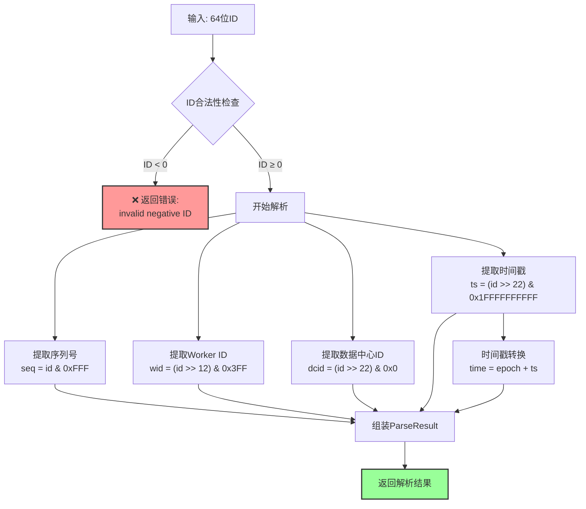
```mermaid
flowchart TD
    A[输入: 64位ID] --> B{ID合法性检查}

    B -->|ID < 0| Error[❌ 返回错误:<br/>invalid negative ID]
    B -->|ID ≥ 0| C[开始解析]

    C --> D1[提取序列号<br/>seq = id & 0xFFF]
    C --> D2["提取Worker ID<br/>wid = (id >> 12) & 0x3FF"]
    C --> D3["提取数据中心ID<br/>dcid = (id >> 22) & 0x0"]
    C --> D4["提取时间戳<br/>ts = (id >> 22) & 0x1FFFFFFFFFF"]

    D1 --> E[组装ParseResult]
    D2 --> E
    D3 --> E
    D4 --> E

    D4 --> F[时间戳转换<br/>time = epoch + ts]

    F --> E

    E --> G[返回解析结果]

    style G fill:#9f9,stroke:#333,stroke-width:2px
    style Error fill:#f99,stroke:#333,stroke-width:2px
```

### 5.2 解析代码实现

根据 `dex-alpha-order-svc/internal/idgen/idgen.go:34-56`：

```go
func ParseOrderID(id int64) (*ParseResult, error) {
    if id < 0 {
        return nil, errors.New("invalid negative ID")
    }

    // 提取各字段（位运算）
    timestamp := (id >> timestampShift) & timestampMask       // 右移22位，取41位
    datacenterID := (id >> datacenterIDShift) & datacenterMask // 右移22位，取0位
    workerID := (id >> workerIDShift) & workerMask             // 右移12位，取10位
    sequence := id & sequenceMask                              // 直接取12位

    // 时间戳转换为time.Time
    genTime := time.Unix(0, (timestamp+customEpoch)*1e6)

    return &ParseResult{
        ID:           id,
        Timestamp:    genTime,
        DatacenterID: datacenterID,
        WorkerID:     workerID,
        Sequence:     sequence,
    }, nil
}
```

### 5.3 解析示例

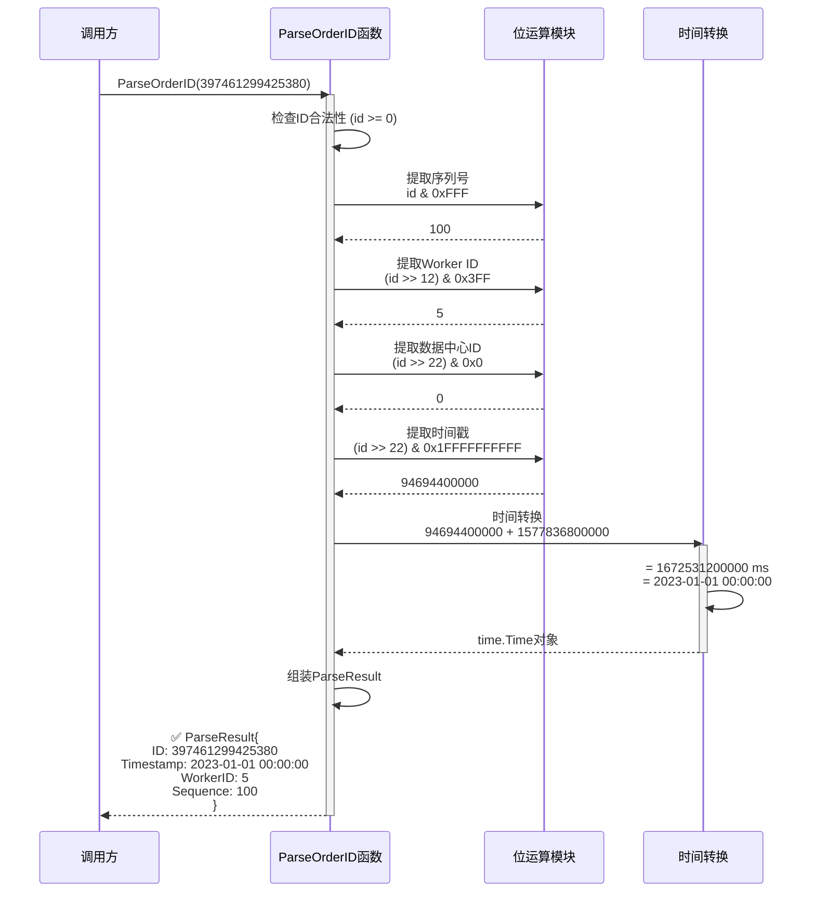
```mermaid
sequenceDiagram
    participant C as 调用方
    participant P as ParseOrderID函数
    participant M as 位运算模块
    participant T as 时间转换

    C->>P: ParseOrderID(397461299425380)
    activate P

    P->>P: 检查ID合法性 (id >= 0)

    P->>M: 提取序列号<br/>id & 0xFFF
    M-->>P: 100

    P->>M: 提取Worker ID<br/>(id >> 12) & 0x3FF
    M-->>P: 5

    P->>M: 提取数据中心ID<br/>(id >> 22) & 0x0
    M-->>P: 0

    P->>M: 提取时间戳<br/>(id >> 22) & 0x1FFFFFFFFFF
    M-->>P: 94694400000

    P->>T: 时间转换<br/>94694400000 + 1577836800000
    activate T
    T->>T: = 1672531200000 ms<br/>= 2023-01-01 00:00:00
    T-->>P: time.Time对象
    deactivate T

    P->>P: 组装ParseResult

    P-->>C: ✅ ParseResult{<br/>ID: 397461299425380<br/>Timestamp: 2023-01-01 00:00:00<br/>WorkerID: 5<br/>Sequence: 100<br/>}
    deactivate P
```

### 5.4 二进制层面的解析

```
原始ID: 397461299425380
二进制: 0 00000000001011010000100101001001100000000 0000000101 000001100100
        │ └──────────────── 41位 ──────────────┘ └─ 10位 ─┘ └─ 12位 ─┘
        │                                            │          │
        符号   时间戳                              WorkerID   Sequence

提取序列号（低12位）:
─────────────────────────────────────────────────────────────────
id & 0xFFF
= ...000001100100 & 111111111111
= 000001100100
= 100 ✅

提取Worker ID（位12-21）:
─────────────────────────────────────────────────────────────────
(id >> 12) & 0x3FF
= ...0000000101000001100100 >> 12    # 右移12位
= ...00000001010000
= ...0101 & 1111111111                # 取低10位
= 0000000101
= 5 ✅

提取时间戳（位22-62）:
─────────────────────────────────────────────────────────────────
(id >> 22) & 0x1FFFFFFFFFF
= 0000...001011010000100101001001100000000000000001010000011 00100 >> 22
= 0000...00000000001011010000100101001001100000000
= 00000000001011010000100101001001100000000 & 0x1FFFFFFFFFF
= 94694400000 ✅

时间戳还原:
─────────────────────────────────────────────────────────────────
真实时间 = epoch + 时间戳差值
        = 1577836800000 + 94694400000
        = 1672531200000 ms
        = 2023-01-01 00:00:00.000 UTC ✅
```

---

## 6. 实战案例分析

### 6.1 案例1：订单ID生成全流程

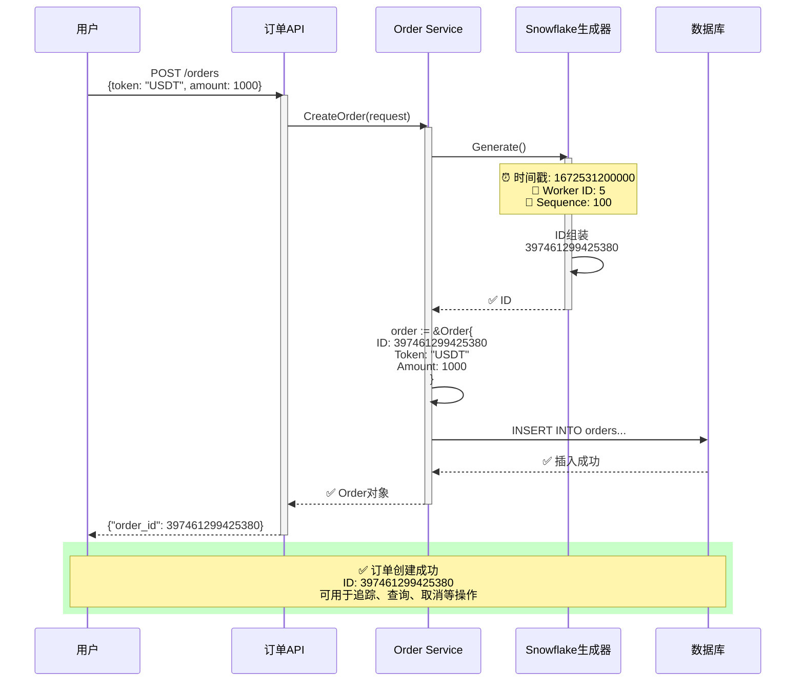
```mermaid
sequenceDiagram
    participant U as 用户
    participant API as 订单API
    participant O as Order Service
    participant G as Snowflake生成器
    participant DB as 数据库

    U->>API: POST /orders<br/>{token: "USDT", amount: 1000}
    activate API

    API->>O: CreateOrder(request)
    activate O

    O->>G: Generate()
    activate G

    Note over G: ⏰ 时间戳: 1672531200000<br/>🔧 Worker ID: 5<br/>🔢 Sequence: 100

    G->>G: ID组装<br/>397461299425380

    G-->>O: ✅ ID
    deactivate G

    O->>O: order := &Order{<br/>ID: 397461299425380<br/>Token: "USDT"<br/>Amount: 1000<br/>}

    O->>DB: INSERT INTO orders...
    DB-->>O: ✅ 插入成功

    O-->>API: ✅ Order对象
    deactivate O

    API-->>U: {"order_id": 397461299425380}
    deactivate API

    rect rgb(200, 255, 200)
        Note over U,DB: ✅ 订单创建成功<br/>ID: 397461299425380<br/>可用于追踪、查询、取消等操作
    end
```

### 6.2 案例2：高并发场景模拟


```mermaid
gantt
    title 单毫秒内生成100个ID（Worker ID=5）
    dateFormat  x
    axisFormat %L

    section ms=1000
    ID_1 (seq=0)    :milestone, 1000, 0ms
    ID_2 (seq=1)    :milestone, 1000, 0ms
    ...             :1000, 0ms
    ID_100 (seq=99) :milestone, 1000, 0ms

    section ms=1001
    ID_101 (seq=0)  :milestone, 1001, 0ms
```

**生成的ID序列**：

| 时间戳(ms) | Worker ID | Sequence | 完整ID              | 说明             |
| ---------- | --------- | -------- | ------------------- | ---------------- |
| 1000       | 5         | 0        | 4,194,324,480       | 第1个ID          |
| 1000       | 5         | 1        | 4,194,324,481       | 第2个ID          |
| 1000       | 5         | 2        | 4,194,324,482       | 第3个ID          |
| ...        | ...       | ...      | ...                 | ...              |
| 1000       | 5         | 99       | 4,194,324,579       | 第100个ID        |
| 1001       | 5         | 0        | 4,198,518,784       | 新毫秒，序列号重置 |

**观察**：
- ✅ 同一毫秒内，ID严格递增（序列号递增）
- ✅ 跨毫秒时，ID大幅跃升（时间戳变化）
- ✅ 100个ID全部唯一

### 6.3 案例3：多机并发生成

```mermaid
graph TB
    subgraph "时刻 t=1000ms"
        A1[机器A Worker=1<br/>生成ID: 4,194,328,576<br/>sequence=0]
        A2[机器B Worker=2<br/>生成ID: 4,194,332,672<br/>sequence=0]
        A3[机器C Worker=3<br/>生成ID: 4,194,336,768<br/>sequence=0]
    end

    subgraph "ID构成"
        B1["机器A ID<br/>ts=1000, worker=1, seq=0<br/>(1000<<22) | (1<<12) | 0<br/>= 4194304000 + 4096 + 0<br/>= 4194308096"]

        B2["机器B ID<br/>ts=1000, worker=2, seq=0<br/>(1000<<22) | (2<<12) | 0<br/>= 4194304000 + 8192 + 0<br/>= 4194312192"]

        B3["机器C ID<br/>ts=1000, worker=3, seq=0<br/>(1000<<22) | (3<<12) | 0<br/>= 4194304000 + 12288 + 0<br/>= 4194316288"]
    end

    A1 --> B1
    A2 --> B2
    A3 --> B3

    B1 --> C[全局唯一性保证]
    B2 --> C
    B3 --> C

    C --> D[✅ Worker ID 不同<br/>确保ID不冲突]

    style D fill:#9f9,stroke:#333,stroke-width:2px
```

### 6.4 案例4：ID解析调试

**场景**：收到客户投诉，订单ID `397461299425380` 无法查询

```go
// 调试代码
result, err := idgen.ParseOrderID(397461299425380)
if err != nil {
    log.Fatal(err)
}

fmt.Printf("订单ID解析结果:\n")
fmt.Printf("  完整ID: %d\n", result.ID)
fmt.Printf("  生成时间: %s\n", result.Timestamp.Format("2006-01-02 15:04:05.000"))
fmt.Printf("  Worker ID: %d\n", result.WorkerID)
fmt.Printf("  数据中心: %d\n", result.DatacenterID)
fmt.Printf("  序列号: %d\n", result.Sequence)

// 输出:
// 订单ID解析结果:
//   完整ID: 397461299425380
//   生成时间: 2023-01-01 00:00:00.000
//   Worker ID: 5
//   数据中心: 0
//   序列号: 100
```

**分析结论**：

```mermaid
graph TD
    A[ID: 397461299425380] --> B[解析结果]

    B --> C1[生成时间:<br/>2023-01-01 00:00:00]
    B --> C2[Worker ID: 5]
    B --> C3[Sequence: 100]

    C1 --> D{排查方向}
    C2 --> D
    C3 --> D

    D --> E1[✅ 检查2023-01-01的订单表<br/>可能数据被分片到历史库]
    D --> E2[✅ 检查Worker=5的服务实例<br/>该实例可能有问题]
    D --> E3[✅ 检查是否为测试数据<br/>Sequence=100较小，可能是早期测试]

    style D fill:#f9f,stroke:#333,stroke-width:2px
```

---

## 🎯 本部分小结

### 核心要点回顾

1. **64位结构**：符号位(1) + 时间戳(41) + 机器ID(10) + 序列号(12)
2. **位运算核心**：左移组装、右移提取、掩码过滤
3. **自定义Epoch**：2020-01-01，延长使用寿命至2089年
4. **ID可解析**：可从ID中反向提取生成时间、机器等信息

### 关键公式

```go
// ID组装
ID = ((timestamp - epoch) << 22) | (workerID << 12) | sequence

// ID解析
sequence     = ID & 0xFFF
workerID     = (ID >> 12) & 0x3FF
timestamp    = (ID >> 22) & 0x1FFFFFFFFFF
genTime      = epoch + timestamp
```

### 下一部分预告

📖 **第3部分：顺序递增保证机制（核心）**

将深入讲解：
- 趋势递增 vs 严格递增
- 时间戳优先策略
- 序列号递增机制
- 互斥锁并发控制
- 时钟回拨处理详解
- 单机递增性证明

---

**继续阅读**：[第3部分：顺序递增保证机制 →](./Snowflake算法详解-03-顺序递增保证.md)

**返回上一部分**：[← 第1部分：算法概述与核心原理](./Snowflake算法详解-01-概述与核心原理.md)
