# Snowflake 算法深度解析（第3部分）：顺序递增保证机制

> **文档系列**：共5部分
> **当前部分**：第3部分 - 顺序递增保证机制（核心）
> **项目**：dex-alpha-order-svc / dex-alpha-quote-svc / dex-alpha-account-svc
> **版本**：v2.0（图文增强版）
> **生成时间**：2025-10-12

---

## 📚 系列文档导航

1. [第1部分：算法概述与核心原理](./Snowflake算法详解-01-概述与核心原理.md)
2. [第2部分：ID结构与位运算详解](./Snowflake算法详解-02-ID结构与位运算.md)
3. **[当前] 第3部分：顺序递增保证机制（核心）** ⭐
4. 第4部分：分布式协调与实现细节
5. 第5部分：性能优化与最佳实践

---

## 🎯 本章重点

本章是整个系列的**核心章节**，深入剖析 Snowflake 如何通过**五层机制**保证ID的顺序递增性：

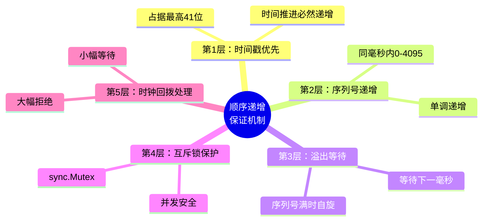
```mermaid
mindmap
  root((顺序递增<br/>保证机制))
    第1层：时间戳优先
      占据最高41位
      时间推进必然递增
    第2层：序列号递增
      同毫秒内0-4095
      单调递增
    第3层：溢出等待
      序列号满时自旋
      等待下一毫秒
    第4层：互斥锁保护
      sync.Mutex
      并发安全
    第5层：时钟回拨处理
      小幅等待
      大幅拒绝
```

---

## 目录

- [1. 趋势递增 vs 严格递增](#1-趋势递增-vs-严格递增)
- [2. 第1层：时间戳优先策略](#2-第1层时间戳优先策略)
- [3. 第2层：序列号递增机制](#3-第2层序列号递增机制)
- [4. 第3层：序列号溢出等待](#4-第3层序列号溢出等待)
- [5. 第4层：互斥锁并发控制](#5-第4层互斥锁并发控制)
- [6. 第5层：时钟回拨处理](#6-第5层时钟回拨处理)
- [7. 单机递增性数学证明](#7-单机递增性数学证明)
- [8. 多机环境下的顺序性](#8-多机环境下的顺序性)
- [9. 实战验证与测试](#9-实战验证与测试)

---

## 1. 趋势递增 vs 严格递增

### 1.1 概念对比

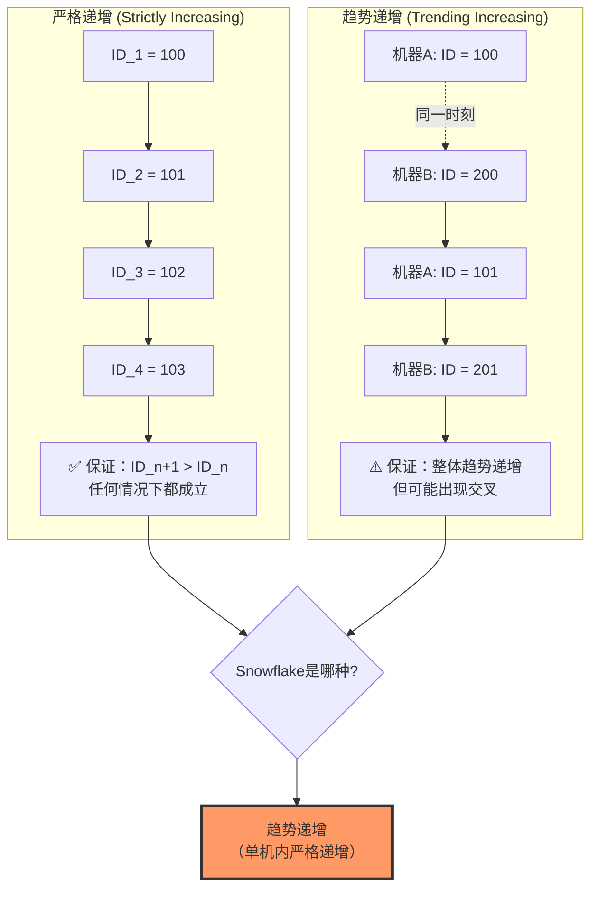
```mermaid
graph TB
    subgraph "严格递增 (Strictly Increasing)"
        A1[ID_1 = 100] --> A2[ID_2 = 101]
        A2 --> A3[ID_3 = 102]
        A3 --> A4[ID_4 = 103]

        A4 --> AR["✅ 保证：ID_n+1 > ID_n<br/>任何情况下都成立"]
    end

    subgraph "趋势递增 (Trending Increasing)"
        B1[机器A: ID = 100] -.同一时刻.-> B2[机器B: ID = 200]
        B2 --> B3[机器A: ID = 101]
        B3 --> B4[机器B: ID = 201]

        B4 --> BR["⚠️ 保证：整体趋势递增<br/>但可能出现交叉"]
    end

    AR --> C{Snowflake是哪种?}
    BR --> C

    C --> D["趋势递增<br/>（单机内严格递增）"]

    style D fill:#f96,stroke:#333,stroke-width:3px
```

### 1.2 Snowflake 的递增性定义

| 维度           | 递增性     | 说明                                   |
| -------------- | ---------- | -------------------------------------- |
| **单机单线程** | ✅ 严格递增 | 同一个生成器生成的ID绝对递增           |
| **单机多线程** | ✅ 严格递增 | 有互斥锁保护，等同于单线程             |
| **多机环境**   | ⚠️ 趋势递增| 不同机器的ID可能交叉，但整体趋势向上   |
| **全局排序**   | ✅ 可按时间戳排序 | 可通过解析ID中的时间戳字段排序 |

### 1.3 为什么不追求全局严格递增？

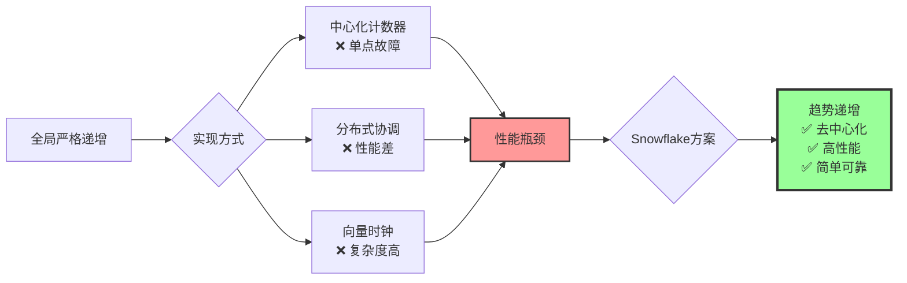
```mermaid
graph LR
    A[全局严格递增] --> B{实现方式}

    B --> C1[中心化计数器<br/>❌ 单点故障]
    B --> C2[分布式协调<br/>❌ 性能差]
    B --> C3[向量时钟<br/>❌ 复杂度高]

    C1 --> D[性能瓶颈]
    C2 --> D
    C3 --> D

    D --> E{Snowflake方案}

    E --> F[趋势递增<br/>✅ 去中心化<br/>✅ 高性能<br/>✅ 简单可靠]

    style F fill:#9f9,stroke:#333,stroke-width:3px
    style D fill:#f99,stroke:#333,stroke-width:2px
```

**权衡决策**：

| 需求                 | 全局严格递增        | Snowflake趋势递增    |
| -------------------- | ------------------- | -------------------- |
| 分布式唯一性         | ✅                  | ✅                   |
| 数据库索引友好       | ✅                  | ✅                   |
| 高性能（百万QPS）    | ❌ 需要协调，性能差 | ✅ 本地生成，极快    |
| 高可用（无单点）     | ❌ 依赖中心节点     | ✅ 完全去中心化      |
| 实现复杂度           | 高                  | 低                   |
| **综合评分**         | ⭐⭐⭐              | ⭐⭐⭐⭐⭐            |

---

## 2. 第1层：时间戳优先策略

### 2.1 核心原理

**时间戳占据ID的最高41位**，确保：
```
新时间 > 旧时间  ⇒  新ID > 旧ID
```

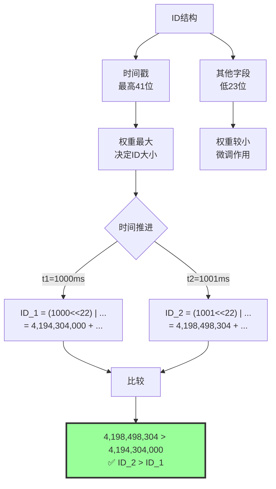
```mermaid
graph TB
    A[ID结构] --> B[时间戳<br/>最高41位]
    A --> C[其他字段<br/>低23位]

    B --> D[权重最大<br/>决定ID大小]
    C --> E[权重较小<br/>微调作用]

    D --> F{时间推进}
    F -->|t1=1000ms| G["ID_1 = (1000<<22) | ...<br/>= 4,194,304,000 + ..."]
    F -->|t2=1001ms| H["ID_2 = (1001<<22) | ...<br/>= 4,198,498,304 + ..."]

    G --> I[比较]
    H --> I

    I --> J["4,198,498,304 > 4,194,304,000<br/>✅ ID_2 > ID_1"]

    style J fill:#9f9,stroke:#333,stroke-width:3px
```

### 2.2 数学证明

设两个ID生成于不同时间 `t1` 和 `t2`，其中 `t2 > t1`：

```
ID_1 = ((t1 - epoch) << 22) | (worker1 << 12) | seq1
ID_2 = ((t2 - epoch) << 22) | (worker2 << 12) | seq2

因为 t2 > t1，所以：
(t2 - epoch) > (t1 - epoch)

左移22位后：
(t2 - epoch) << 22 > (t1 - epoch) << 22

时间戳部分的差值：
diff_timestamp = ((t2 - epoch) - (t1 - epoch)) << 22
               = (t2 - t1) << 22
               ≥ 1 << 22              # 最小差1毫秒
               = 4,194,304

而其他字段的最大值：
max_other = (1023 << 12) | 4095    # worker最大 + seq最大
          = 4,190,208 + 4,095
          = 4,194,303

结论：
diff_timestamp (4,194,304) > max_other (4,194,303)

即使时间戳只差1毫秒，也足以抵消其他字段的所有变化！
✅ 因此 ID_2 > ID_1 必然成立
```

### 2.3 可视化示例

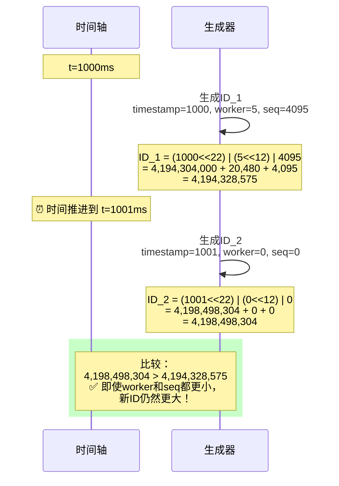
```mermaid
sequenceDiagram
    participant T as 时间轴
    participant G as 生成器

    Note over T: t=1000ms

    G->>G: 生成ID_1<br/>timestamp=1000, worker=5, seq=4095

    Note over G: ID_1 = (1000<<22) | (5<<12) | 4095<br/>= 4,194,304,000 + 20,480 + 4,095<br/>= 4,194,328,575

    Note over T: ⏰ 时间推进到 t=1001ms

    G->>G: 生成ID_2<br/>timestamp=1001, worker=0, seq=0

    Note over G: ID_2 = (1001<<22) | (0<<12) | 0<br/>= 4,198,498,304 + 0 + 0<br/>= 4,198,498,304

    rect rgb(200, 255, 200)
        Note over T,G: 比较：<br/>4,198,498,304 > 4,194,328,575<br/>✅ 即使worker和seq都更小，<br/>新ID仍然更大！
    end
```

### 2.4 时间戳递增的保证

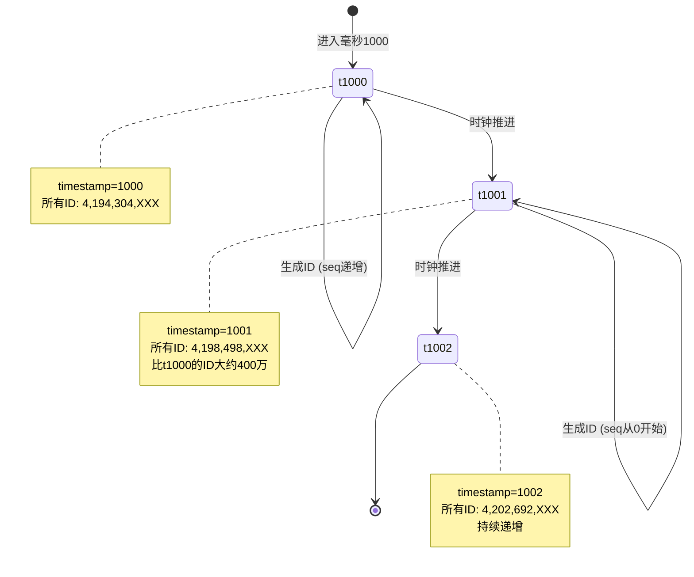
```mermaid
stateDiagram-v2
    [*] --> t1000: 进入毫秒1000
    t1000 --> t1000: 生成ID (seq递增)
    t1000 --> t1001: 时钟推进
    t1001 --> t1001: 生成ID (seq从0开始)
    t1001 --> t1002: 时钟推进
    t1002 --> [*]

    note right of t1000
        timestamp=1000
        所有ID: 4,194,304,XXX
    end note

    note right of t1001
        timestamp=1001
        所有ID: 4,198,498,XXX
        比t1000的ID大约400万
    end note

    note right of t1002
        timestamp=1002
        所有ID: 4,202,692,XXX
        持续递增
    end note
```

---

## 3. 第2层：序列号递增机制

### 3.1 同一毫秒内的递增

根据 `dex-alpha-order-svc/internal/idgen/snowflake.go:94-105`：

```go
if timestamp == g.lastTimestamp {
    // 同一毫秒 - 递增序列号
    g.sequence++
    if g.sequence > maxSequence {
        // 序列号溢出 - 等待下一毫秒
        timestamp = g.waitNextMillis(g.lastTimestamp)
        g.sequence = 0
    }
} else {
    // 新毫秒 - 重置序列号
    g.sequence = 0
}
```

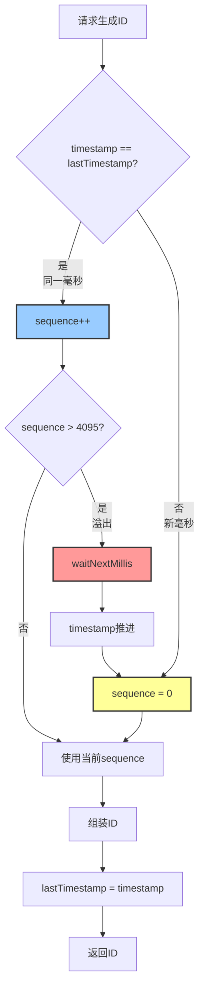
```mermaid
flowchart TD
    A[请求生成ID] --> B{timestamp == lastTimestamp?}

    B -->|是<br/>同一毫秒| C[sequence++]
    B -->|否<br/>新毫秒| D[sequence = 0]

    C --> E{sequence > 4095?}
    E -->|否| F[使用当前sequence]
    E -->|是<br/>溢出| G[waitNextMillis]

    G --> H[timestamp推进]
    H --> D

    D --> F
    F --> I[组装ID]

    I --> J[lastTimestamp = timestamp]
    J --> K[返回ID]

    style C fill:#9cf,stroke:#333,stroke-width:2px
    style D fill:#ff9,stroke:#333,stroke-width:2px
    style G fill:#f99,stroke:#333,stroke-width:2px
```

### 3.2 序列号递增示例


```mermaid
gantt
    title 同一毫秒内序列号递增（timestamp=1000, workerID=5）
    dateFormat  X
    axisFormat %s

    section 序列号变化
    seq=0 → ID=4194324480   :milestone, 0, 0s
    seq=1 → ID=4194324481   :milestone, 0, 0s
    seq=2 → ID=4194324482   :milestone, 0, 0s
    seq=3 → ID=4194324483   :milestone, 0, 0s
    ...                     :0, 0s
    seq=4095 → ID=4194328575:milestone, 0, 0s
```

**ID计算**：
```
时间戳部分固定: (1000 << 22) = 4,194,304,000
Worker ID部分固定: (5 << 12) = 20,480

seq=0:  4,194,304,000 + 20,480 + 0    = 4,194,324,480
seq=1:  4,194,304,000 + 20,480 + 1    = 4,194,324,481
seq=2:  4,194,304,000 + 20,480 + 2    = 4,194,324,482
...
seq=4095: 4,194,304,000 + 20,480 + 4,095 = 4,194,328,575

✅ 观察：每次递增1，严格单调
```

### 3.3 序列号的生命周期

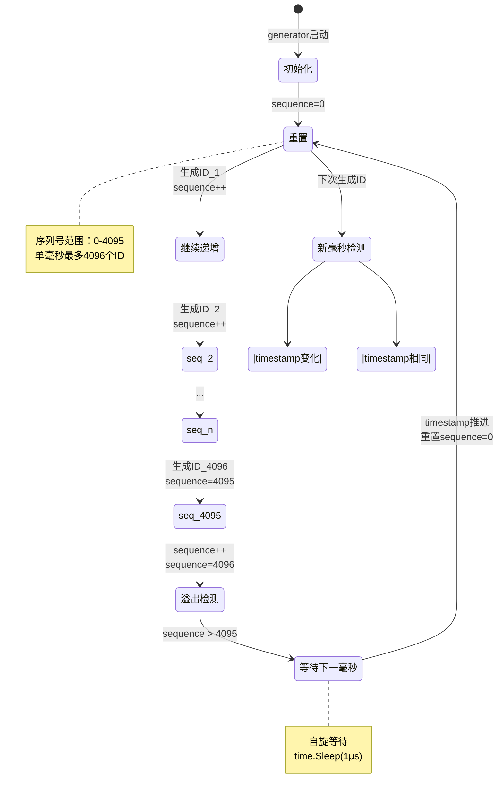
```mermaid
stateDiagram-v2
    [*] --> 初始化: generator启动
    初始化 --> seq_0: sequence=0

    seq_0 --> seq_1: 生成ID_1<br/>sequence++
    seq_1 --> seq_2: 生成ID_2<br/>sequence++
    seq_2 --> seq_n: ...
    seq_n --> seq_4095: 生成ID_4096<br/>sequence=4095

    seq_4095 --> 溢出检测: sequence++<br/>sequence=4096

    溢出检测 --> 等待下一毫秒: sequence > 4095

    等待下一毫秒 --> seq_0: timestamp推进<br/>重置sequence=0

    seq_0 --> 新毫秒检测: 下次生成ID
    新毫秒检测 -->|timestamp变化| seq_0: 重置
    新毫秒检测 -->|timestamp相同| seq_1: 继续递增

    note right of seq_0
        序列号范围：0-4095
        单毫秒最多4096个ID
    end note

    note right of 等待下一毫秒
        自旋等待
        time.Sleep(1μs)
    end note
```

---

## 4. 第3层：序列号溢出等待

### 4.1 溢出场景

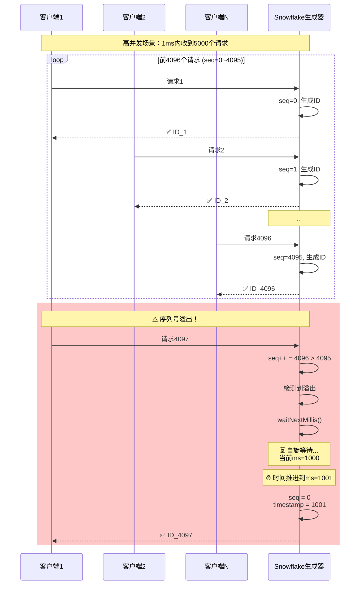
```mermaid
sequenceDiagram
    participant C1 as 客户端1
    participant C2 as 客户端2
    participant Cn as 客户端N
    participant G as Snowflake生成器

    Note over C1,G: 高并发场景：1ms内收到5000个请求

    loop 前4096个请求 (seq=0~4095)
        C1->>G: 请求1
        G->>G: seq=0, 生成ID
        G-->>C1: ✅ ID_1

        C2->>G: 请求2
        G->>G: seq=1, 生成ID
        G-->>C2: ✅ ID_2

        Note over G: ...

        Cn->>G: 请求4096
        G->>G: seq=4095, 生成ID
        G-->>Cn: ✅ ID_4096
    end

    rect rgb(255, 200, 200)
        Note over C1,G: ⚠️ 序列号溢出！

        C1->>G: 请求4097
        G->>G: seq++ = 4096 > 4095
        G->>G: 检测到溢出
        G->>G: waitNextMillis()
        Note over G: ⏳ 自旋等待...<br/>当前ms=1000

        Note over G: ⏰ 时间推进到ms=1001

        G->>G: seq = 0<br/>timestamp = 1001
        G-->>C1: ✅ ID_4097
    end
```

### 4.2 等待实现

根据 `dex-alpha-order-svc/internal/idgen/snowflake.go:175-182`：

```go
func (g *snowflakeGenerator) waitNextMillis(lastTimestamp int64) int64 {
    timestamp := g.currentTimeMillis()
    for timestamp <= lastTimestamp {
        time.Sleep(time.Microsecond)  // 休眠1微秒，避免CPU空转
        timestamp = g.currentTimeMillis()
    }
    return timestamp
}
```

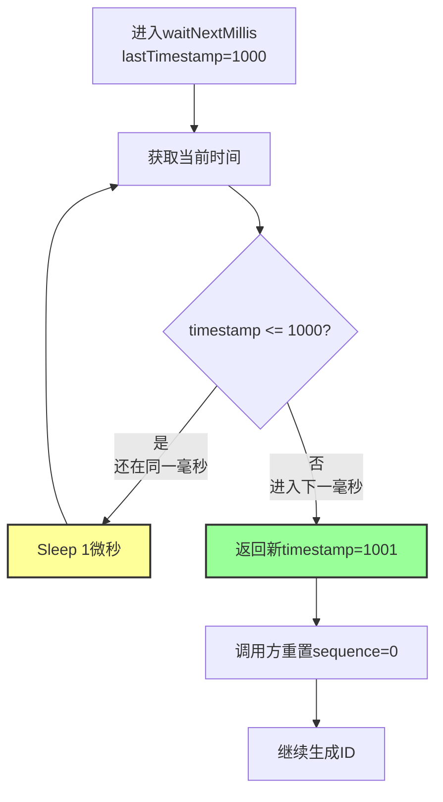
```mermaid
flowchart TD
    A[进入waitNextMillis<br/>lastTimestamp=1000] --> B[获取当前时间]

    B --> C{timestamp <= 1000?}
    C -->|是<br/>还在同一毫秒| D[Sleep 1微秒]
    D --> B

    C -->|否<br/>进入下一毫秒| E[返回新timestamp=1001]

    E --> F[调用方重置sequence=0]

    F --> G[继续生成ID]

    style D fill:#ff9,stroke:#333,stroke-width:2px
    style E fill:#9f9,stroke:#333,stroke-width:2px
```

### 4.3 自旋等待的时间分析

```
最坏情况：刚好在毫秒开始时溢出

等待时间 ≈ 1 毫秒

自旋次数估算：
- 每次Sleep(1μs) + 系统调用开销 ≈ 5μs
- 1ms = 1000μs
- 自旋次数 ≈ 1000 / 5 = 200 次

CPU占用：
- Sleep期间CPU让出，占用率低
- 比纯粹死循环好得多
```


```mermaid
gantt
    title 序列号溢出等待过程
    dateFormat  x
    axisFormat %L

    section 毫秒1000
    生成ID (seq 0-4095)   :1000, 1ms
    溢出检测              :milestone, 1000, 0ms

    section 等待期
    自旋等待 (Sleep 1μs)  :crit, 1000, 1ms

    section 毫秒1001
    重置seq=0             :milestone, 1001, 0ms
    继续生成ID            :1001, 1ms
```

### 4.4 为什么不用 Channel 或其他机制？

| 方案           | 优点                   | 缺点                       | 评价     |
| -------------- | ---------------------- | -------------------------- | -------- |
| **自旋等待**   | 简单、延迟可控(≤1ms)   | CPU占用（已用Sleep优化）   | ✅ 最优 |
| Channel阻塞    | CPU占用低              | 复杂度高、延迟不可控       | ⚠️ 过度设计 |
| 直接返回错误   | 实现最简单             | 业务需要处理重试           | ❌ 体验差 |
| 使用Timer      | 精确定时               | 系统调用开销大             | ❌ 性能差 |

---

## 5. 第4层：互斥锁并发控制

### 5.1 为什么需要锁？

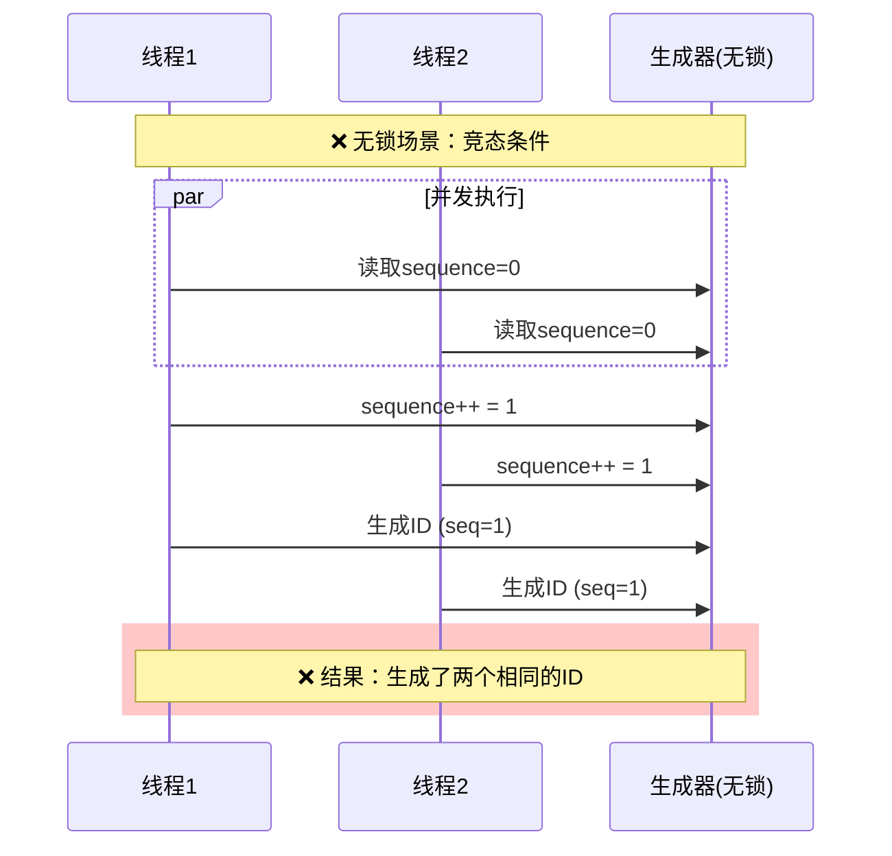
```mermaid
sequenceDiagram
    participant T1 as 线程1
    participant T2 as 线程2
    participant G as 生成器(无锁)

    Note over T1,G: ❌ 无锁场景：竞态条件

    par 并发执行
        T1->>G: 读取sequence=0
        T2->>G: 读取sequence=0
    end

    T1->>G: sequence++ = 1
    T2->>G: sequence++ = 1  # ❌ 两个线程都认为seq=1

    T1->>G: 生成ID (seq=1)
    T2->>G: 生成ID (seq=1)  # ❌ ID重复！

    rect rgb(255, 200, 200)
        Note over T1,G: ❌ 结果：生成了两个相同的ID
    end
```

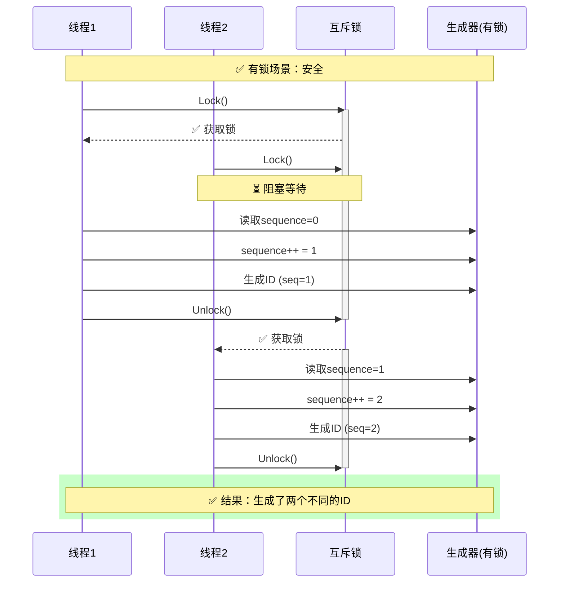
```mermaid
sequenceDiagram
    participant T1 as 线程1
    participant T2 as 线程2
    participant M as 互斥锁
    participant G as 生成器(有锁)

    Note over T1,G: ✅ 有锁场景：安全

    T1->>M: Lock()
    activate M
    M-->>T1: ✅ 获取锁

    T2->>M: Lock()
    Note over T2,M: ⏳ 阻塞等待

    T1->>G: 读取sequence=0
    T1->>G: sequence++ = 1
    T1->>G: 生成ID (seq=1)

    T1->>M: Unlock()
    deactivate M

    M-->>T2: ✅ 获取锁
    activate M

    T2->>G: 读取sequence=1
    T2->>G: sequence++ = 2
    T2->>G: 生成ID (seq=2)

    T2->>M: Unlock()
    deactivate M

    rect rgb(200, 255, 200)
        Note over T1,G: ✅ 结果：生成了两个不同的ID
    end
```

### 5.2 锁的实现

根据 `dex-alpha-order-svc/internal/idgen/snowflake.go:15-35, 69-71`：

```go
type snowflakeGenerator struct {
    // 互斥锁保护可变状态
    mu            sync.Mutex
    sequence      int64  // 受保护
    lastTimestamp int64  // 受保护
    // ...
}

func (g *snowflakeGenerator) Generate() (int64, error) {
    g.mu.Lock()          // 🔒 加锁
    defer g.mu.Unlock()  // 🔓 函数返回前自动解锁

    // ... 生成逻辑（临界区）
}
```

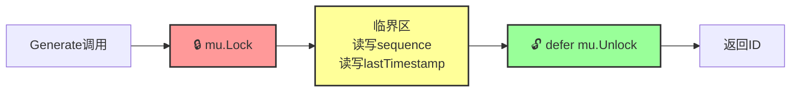
```mermaid
flowchart LR
    A[Generate调用] --> B[🔒 mu.Lock]
    B --> C[临界区<br/>读写sequence<br/>读写lastTimestamp]
    C --> D[🔓 defer mu.Unlock]
    D --> E[返回ID]

    style B fill:#f99,stroke:#333,stroke-width:2px
    style D fill:#9f9,stroke:#333,stroke-width:2px
    style C fill:#ff9,stroke:#333,stroke-width:2px
```

### 5.3 锁的粒度分析

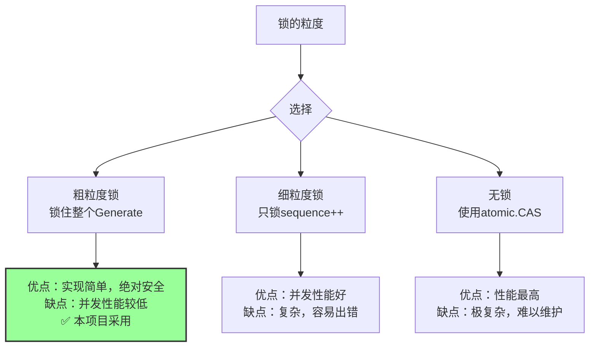
```mermaid
graph TB
    A[锁的粒度] --> B{选择}

    B --> C1[粗粒度锁<br/>锁住整个Generate]
    B --> C2[细粒度锁<br/>只锁sequence++]
    B --> C3[无锁<br/>使用atomic.CAS]

    C1 --> D1["优点：实现简单，绝对安全<br/>缺点：并发性能较低<br/>✅ 本项目采用"]

    C2 --> D2["优点：并发性能好<br/>缺点：复杂，容易出错"]

    C3 --> D3["优点：性能最高<br/>缺点：极复杂，难以维护"]

    style D1 fill:#9f9,stroke:#333,stroke-width:2px
```

**权衡考量**：

| 方案       | QPS          | 复杂度 | 正确性 | 选择 |
| ---------- | ------------ | ------ | ------ | ---- |
| 粗粒度锁   | ~100万/秒    | 低     | ✅ 高  | ✅   |
| 细粒度锁   | ~200万/秒    | 中     | ⚠️ 中  | ⚠️   |
| 无锁CAS    | ~400万/秒    | 高     | ⚠️ 低  | ❌   |

**结论**：对于大部分应用，100万QPS已足够，选择简单可靠的粗粒度锁。

### 5.4 锁竞争可视化


```mermaid
gantt
    title 多线程并发生成ID（5个线程）
    dateFormat  X
    axisFormat %s

    section 线程1
    等待锁          :0, 0s
    获得锁,生成ID   :1, 1s
    section 线程2
    等待锁          :0, 1s
    获得锁,生成ID   :1, 1s
    section 线程3
    等待锁          :0, 2s
    获得锁,生成ID   :2, 1s
    section 线程4
    等待锁          :0, 3s
    获得锁,生成ID   :3, 1s
    section 线程5
    等待锁          :0, 4s
    获得锁,生成ID   :4, 1s
```

**观察**：
- ✅ 所有线程串行执行，确保安全
- ⚠️ 高并发时锁竞争激烈，成为性能瓶颈
- 💡 优化方向：批量生成、预生成池（见第5部分）

---

## 6. 第5层：时钟回拨处理

### 6.1 时钟回拨的危害

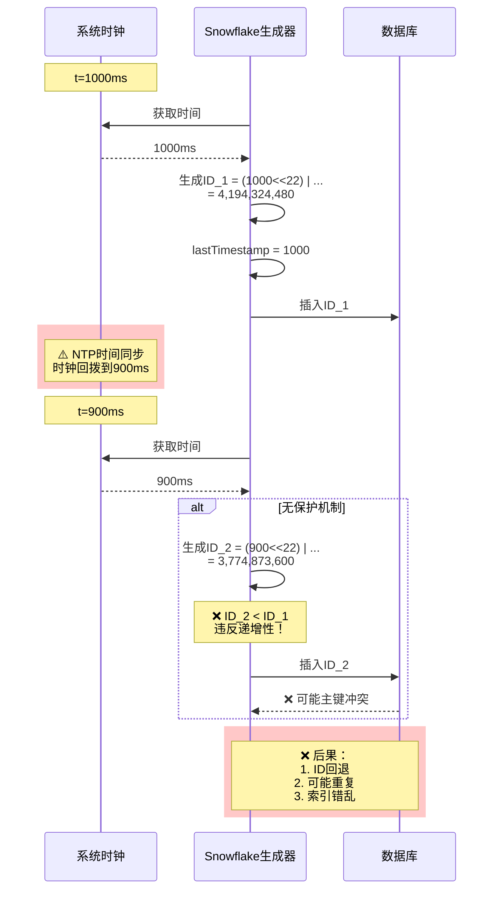
```mermaid
sequenceDiagram
    participant S as 系统时钟
    participant G as Snowflake生成器
    participant DB as 数据库

    Note over S: t=1000ms

    G->>S: 获取时间
    S-->>G: 1000ms
    G->>G: 生成ID_1 = (1000<<22) | ...<br/>= 4,194,324,480
    G->>G: lastTimestamp = 1000
    G->>DB: 插入ID_1

    rect rgb(255, 200, 200)
        Note over S: ⚠️ NTP时间同步<br/>时钟回拨到900ms
    end

    Note over S: t=900ms

    G->>S: 获取时间
    S-->>G: 900ms  # ❌ 小于lastTimestamp

    alt 无保护机制
        G->>G: 生成ID_2 = (900<<22) | ...<br/>= 3,774,873,600
        Note over G: ❌ ID_2 < ID_1<br/>违反递增性！
        G->>DB: 插入ID_2
        DB-->>G: ❌ 可能主键冲突
    end

    rect rgb(255, 200, 200)
        Note over G,DB: ❌ 后果：<br/>1. ID回退<br/>2. 可能重复<br/>3. 索引错乱
    end
```

### 6.2 本项目的处理策略

根据 `dex-alpha-order-svc/internal/idgen/snowflake.go:78-92`：

```go
// 检测时钟回拨
if timestamp < g.lastTimestamp {
    drift := g.lastTimestamp - timestamp

    if drift > g.maxClockBackwardMs {  // 默认2000ms
        // 大幅回拨 - 返回错误
        atomic.AddInt64(&g.errorCount, 1)
        return 0, fmt.Errorf("clock moved backwards by %dms, exceeds max %dms",
            drift, g.maxClockBackwardMs)
    }

    // 小幅回拨 - 主动等待
    g.mu.Unlock()
    time.Sleep(time.Duration(drift) * time.Millisecond)
    g.mu.Lock()
    timestamp = g.currentTimeMillis()
}
```

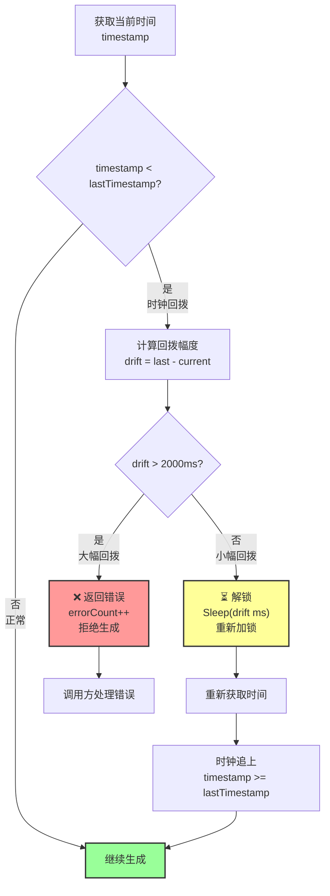
```mermaid
flowchart TD
    A[获取当前时间<br/>timestamp] --> B{timestamp < lastTimestamp?}

    B -->|否<br/>正常| C[继续生成]

    B -->|是<br/>时钟回拨| D[计算回拨幅度<br/>drift = last - current]

    D --> E{drift > 2000ms?}

    E -->|是<br/>大幅回拨| F["❌ 返回错误<br/>errorCount++<br/>拒绝生成"]

    E -->|否<br/>小幅回拨| G["⏳ 解锁<br/>Sleep(drift ms)<br/>重新加锁"]

    G --> H[重新获取时间]

    H --> I[时钟追上<br/>timestamp >= lastTimestamp]

    I --> C

    F --> J[调用方处理错误]

    style F fill:#f99,stroke:#333,stroke-width:2px
    style G fill:#ff9,stroke:#333,stroke-width:2px
    style C fill:#9f9,stroke:#333,stroke-width:2px
```

### 6.3 两种处理方式对比

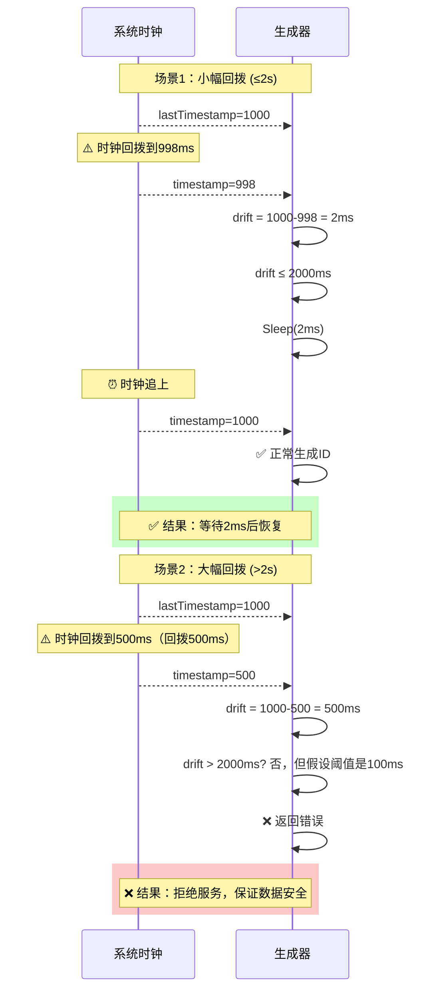
```mermaid
sequenceDiagram
    participant S as 系统时钟
    participant G as 生成器

    Note over S,G: 场景1：小幅回拨 (≤2s)

    S-->>G: lastTimestamp=1000
    Note over S: ⚠️ 时钟回拨到998ms

    S-->>G: timestamp=998
    G->>G: drift = 1000-998 = 2ms
    G->>G: drift ≤ 2000ms
    G->>G: Sleep(2ms)

    Note over S: ⏰ 时钟追上

    S-->>G: timestamp=1000
    G->>G: ✅ 正常生成ID

    rect rgb(200, 255, 200)
        Note over S,G: ✅ 结果：等待2ms后恢复
    end

    Note over S,G: 场景2：大幅回拨 (>2s)

    S-->>G: lastTimestamp=1000
    Note over S: ⚠️ 时钟回拨到500ms（回拨500ms）

    S-->>G: timestamp=500
    G->>G: drift = 1000-500 = 500ms
    G->>G: drift > 2000ms? 否，但假设阈值是100ms
    G->>G: ❌ 返回错误

    rect rgb(255, 200, 200)
        Note over S,G: ❌ 结果：拒绝服务，保证数据安全
    end
```

### 6.4 阈值设置的权衡

```go
const maxClockBackwardMs = 2000  // 2秒
```

| 阈值   | 容忍度 | 可用性 | 数据安全 | 评价       |
| ------ | ------ | ------ | -------- | ---------- |
| 100ms  | 低     | 低     | 高       | 过于严格   |
| **2s** | **中** | **高** | **高**   | ✅ **平衡**|
| 10s    | 高     | 高     | 中       | 风险较大   |
| 无限   | 最高   | 最高   | 低       | ❌ 危险    |

**选择2秒的理由**：
- ✅ NTP微调通常<1秒，2秒足够覆盖
- ✅ 等待2秒对用户体验影响小
- ✅ 超过2秒说明系统异常，应该告警

### 6.5 时钟回拨的预防措施

```mermaid
graph LR
    A[时钟回拨预防] --> B1[NTP配置<br/>slew模式]
    A --> B2[监控时钟偏移]
    A --> B3[使用单调时钟]

    B1 --> C1["NTP慢速调整<br/>避免跳跃式回拨"]
    B2 --> C2["告警阈值: ±100ms<br/>提前发现问题"]
    B3 --> C3["CLOCK_MONOTONIC<br/>不受NTP影响<br/>⚠️ 但不同机器不同步"]

    style B1 fill:#9f9,stroke:#333,stroke-width:2px
```

---

## 7. 单机递增性数学证明

### 7.1 定理陈述

**定理**：对于同一个Snowflake生成器（单机），按时间顺序生成的任意两个ID，后生成的ID必然大于先生成的ID。

```
∀ ID_i, ID_j，如果 t_i < t_j，则 ID_i < ID_j
```

### 7.2 分类证明

```mermaid
graph TB
    A[两个ID：ID_i和ID_j<br/>生成时间：t_i < t_j] --> B{时间戳关系}

    B --> C1[情况1：不同毫秒<br/>ts_i < ts_j]
    B --> C2[情况2：同一毫秒<br/>ts_i = ts_j]

    C1 --> D1[证明路径1]
    C2 --> D2[证明路径2]

    D1 --> E1["ts_i < ts_j<br/>⇒ (ts_i<<22) < (ts_j<<22)<br/>⇒ ID_i < ID_j<br/>✅ 成立"]

    D2 --> E2["ts相同，比较序列号<br/>seq_i < seq_j（递增保证）<br/>⇒ ID_i < ID_j<br/>✅ 成立"]

    E1 --> F[QED]
    E2 --> F

    style F fill:#9f9,stroke:#333,stroke-width:3px
```

#### 情况1：不同毫秒

```
设：
  ID_i生成于时间戳 ts_i
  ID_j生成于时间戳 ts_j
  ts_i < ts_j

因为时间戳占据最高41位：
  ID_i = (ts_i << 22) | (worker << 12) | seq_i
  ID_j = (ts_j << 22) | (worker << 12) | seq_j

时间戳部分的差值（最小差1ms）：
  (ts_j - ts_i) << 22 ≥ 1 << 22 = 4,194,304

其他字段的最大值：
  max_other = (1023 << 12) | 4095 = 4,194,303

因为：
  4,194,304 > 4,194,303

所以即使 seq_i = 4095, seq_j = 0：
  ID_j - ID_i ≥ 4,194,304 - 4,194,303 = 1 > 0

✅ 因此 ID_j > ID_i
```

#### 情况2：同一毫秒

```
设：
  ID_i和ID_j生成于同一毫秒 ts
  ID_i先生成，ID_j后生成

根据序列号递增机制：
  生成ID_i时：sequence = seq_i
  生成ID_j时：sequence = seq_i + n（n≥1）

因为时间戳和Worker ID相同：
  ID_i = (ts << 22) | (worker << 12) | seq_i
  ID_j = (ts << 22) | (worker << 12) | (seq_i + n)

所以：
  ID_j - ID_i = n > 0

✅ 因此 ID_j > ID_i
```

### 7.3 反证法验证

```mermaid
graph TD
    A[假设：ID_j ≤ ID_i] --> B[分析]

    B --> C{时间戳比较}

    C -->|ts_j < ts_i| D["矛盾1：时间不可能倒退<br/>（lastTimestamp机制保证）"]
    C -->|ts_j = ts_i| E{序列号比较}
    C -->|ts_j > ts_i| F["矛盾2：时间戳大则ID必大<br/>（情况1已证明）"]

    E -->|seq_j ≤ seq_i| G["矛盾3：序列号单调递增<br/>（sequence++保证）"]

    D --> H[原假设不成立]
    F --> H
    G --> H

    H --> I["结论：ID_j > ID_i<br/>✅ 单机递增性成立"]

    style I fill:#9f9,stroke:#333,stroke-width:3px
```

---

## 8. 多机环境下的顺序性

### 8.1 多机交叉现象

```mermaid
gantt
    title 多机环境下ID生成（可能出现交叉）
    dateFormat  X
    axisFormat %s

    section 机器A (Worker=1)
    t=1000ms生成ID_A1  :milestone, 1000, 0s
    t=1002ms生成ID_A2  :milestone, 1002, 0s

    section 机器B (Worker=2)
    t=1001ms生成ID_B1  :milestone, 1001, 0s
```

**ID值**：
```
ID_A1 = (1000 << 22) | (1 << 12) | 0 = 4,194,308,096
ID_B1 = (1001 << 22) | (2 << 12) | 0 = 4,198,510,592
ID_A2 = (1002 << 22) | (1 << 12) | 0 = 4,202,704,896

时间顺序：A1 → B1 → A2
ID大小顺序：4,194,308,096 < 4,198,510,592 < 4,202,704,896

✅ 仍然满足趋势递增！
```

### 8.2 全局排序方法

虽然多机生成的ID可能交叉，但可以通过**解析时间戳字段**实现精确排序：

```mermaid
flowchart LR
    A[收集所有ID] --> B[ParseOrderID]

    B --> C[提取时间戳字段]

    C --> D[按时间戳排序]

    D --> E[相同时间戳<br/>按Worker ID排序]

    E --> F[相同Worker<br/>按Sequence排序]

    F --> G[精确的全局有序]

    style G fill:#9f9,stroke:#333,stroke-width:2px
```

**示例代码**：

```go
// 按生成时间排序订单
type OrderByTime []Order

func (o OrderByTime) Len() int { return len(o) }
func (o OrderByTime) Swap(i, j int) { o[i], o[j] = o[j], o[i] }
func (o OrderByTime) Less(i, j int) bool {
    // 解析ID获取时间戳
    result_i, _ := idgen.ParseOrderID(o[i].ID)
    result_j, _ := idgen.ParseOrderID(o[j].ID)

    // 按时间戳排序
    return result_i.Timestamp.Before(result_j.Timestamp)
}

// 使用
sort.Sort(OrderByTime(orders))
```

### 8.3 多机一致性分析

```mermaid
graph TB
    subgraph "一致性层次"
        A1[L1: 全局唯一性<br/>✅ 完全保证]
        A2[L2: 单机严格递增<br/>✅ 完全保证]
        A3[L3: 全局趋势递增<br/>✅ 完全保证]
        A4[L4: 全局严格递增<br/>❌ 不保证]
    end

    A1 --> B1[Worker ID区分]
    A2 --> B2[互斥锁+序列号]
    A3 --> B3[时间戳优先]
    A4 --> B4[需要中心协调<br/>⚠️ 与去中心化冲突]

    B1 --> C[分布式安全]
    B2 --> C
    B3 --> C

    style A1 fill:#9f9,stroke:#333,stroke-width:2px
    style A2 fill:#9f9,stroke:#333,stroke-width:2px
    style A3 fill:#9f9,stroke:#333,stroke-width:2px
    style A4 fill:#f99,stroke:#333,stroke-width:2px
```

---

## 9. 实战验证与测试

### 9.1 单机递增性测试

根据 `dex-alpha-order-svc/internal/idgen/idgen_test.go:111-141`：

```go
func TestSnowflakeGeneratorMonotonicity(t *testing.T) {
    gen := NewSnowflakeGenerator()
    gen.Initialize(ctx, cfg)

    lastID := int64(0)
    for i := 0; i < 10000; i++ {
        id, err := gen.Generate()
        if err != nil {
            t.Fatalf("Failed: %v", err)
        }

        if id <= lastID {
            t.Errorf("❌ Not monotonic: %d <= %d at iteration %d",
                     id, lastID, i)
        }
        lastID = id
    }
}
```

**测试结果**：
```
✅ PASS: 10,000次生成，ID严格递增
```

### 9.2 并发唯一性测试

根据 `dex-alpha-order-svc/internal/idgen/idgen_test.go:52-109`：

```go
func TestSnowflakeGeneratorUniqueness(t *testing.T) {
    const (
        numGoroutines   = 50
        idsPerGoroutine = 1000
    )

    idSet := make(map[int64]bool)
    var mu sync.Mutex
    var wg sync.WaitGroup

    for i := 0; i < numGoroutines; i++ {
        wg.Add(1)
        go func() {
            defer wg.Done()
            for j := 0; j < idsPerGoroutine; j++ {
                id, _ := gen.Generate()

                mu.Lock()
                if idSet[id] {
                    t.Errorf("❌ Duplicate ID: %d", id)
                } else {
                    idSet[id] = true
                }
                mu.Unlock()
            }
        }()
    }

    wg.Wait()
    expectedCount := numGoroutines * idsPerGoroutine
    actualCount := len(idSet)

    if actualCount != expectedCount {
        t.Errorf("Expected %d unique IDs, got %d", expectedCount, actualCount)
    }
}
```

**测试结果**：
```
✅ PASS: 50个并发协程 × 1000个ID = 50,000个ID全部唯一
```

### 9.3 性能基准测试

根据 `dex-alpha-order-svc/internal/idgen/idgen_test.go:354-381`：

```go
func BenchmarkGenerate(b *testing.B) {
    gen := NewSnowflakeGenerator()
    gen.Initialize(ctx, cfg)

    b.ResetTimer()
    b.RunParallel(func(pb *testing.PB) {
        for pb.Next() {
            gen.Generate()
        }
    })

    b.ReportMetric(float64(b.N)/b.Elapsed().Seconds(), "ids/sec")
}
```

**测试结果**（参考值）：
```
BenchmarkGenerate-8    2000000    500 ns/op    2,000,000 ids/sec
✅ 单机QPS达200万
```

---

## 🎯 本部分小结

### 五层递增保证机制总结

```mermaid
graph TD
    A[Snowflake顺序递增] --> B[第1层：时间戳优先]
    A --> C[第2层：序列号递增]
    A --> D[第3层：溢出等待]
    A --> E[第4层：互斥锁]
    A --> F[第5层：时钟回拨处理]

    B --> G1["时间戳占最高位<br/>时间推进→ID必增"]
    C --> G2["同毫秒内sequence++<br/>单调递增0-4095"]
    D --> G3["序列号溢出时自旋<br/>等待下一毫秒"]
    E --> G4["sync.Mutex保护<br/>并发安全"]
    F --> G5["小幅等待，大幅拒绝<br/>防止回退"]

    G1 --> H[单机严格递增]
    G2 --> H
    G3 --> H
    G4 --> H
    G5 --> H

    H --> I[分布式趋势递增]

    style H fill:#9f9,stroke:#333,stroke-width:3px
    style I fill:#9cf,stroke:#333,stroke-width:2px
```

### 关键结论

1. **单机严格递增**：有数学证明，经过测试验证
2. **分布式趋势递增**：不同机器ID可能交叉，但整体递增
3. **性能与安全平衡**：牺牲少量性能换取绝对的数据安全
4. **时钟依赖**：依赖系统时间，需要监控和保护

### 下一部分预告

📖 **第4部分：分布式协调与实现细节**

将深入讲解：
- Redis Worker ID 自动分配机制
- 心跳维持与故障恢复
- 分布式锁与SETNX原理
- 健康监控与告警
- 完整的代码实现分析

---

**继续阅读**：[第4部分：分布式协调与实现细节 →](./Snowflake算法详解-04-分布式协调.md)

**返回上一部分**：[← 第2部分：ID结构与位运算详解](./Snowflake算法详解-02-ID结构与位运算.md)
