# Snowflake 算法深度解析（第4部分）：分布式协调与实现细节

> **文档系列**：共5部分
> **当前部分**：第4部分 - 分布式协调与实现细节
> **项目**：dex-alpha-order-svc / dex-alpha-quote-svc / dex-alpha-account-svc
> **版本**：v2.0（图文增强版）
> **生成时间**：2025-10-12

---

## 📚 系列文档导航

1. [第1部分：算法概述与核心原理](./Snowflake算法详解-01-概述与核心原理.md)
2. [第2部分：ID结构与位运算详解](./Snowflake算法详解-02-ID结构与位运算.md)
3. [第3部分：顺序递增保证机制（核心）](./Snowflake算法详解-03-顺序递增保证.md)
4. **[当前] 第4部分：分布式协调与实现细节**
5. 第5部分：性能优化与最佳实践

---

## 目录

- [1. Redis Worker ID 分配机制](#1-redis-worker-id-分配机制)
- [2. SETNX 原子抢占原理](#2-setnx-原子抢占原理)
- [3. 心跳维持与TTL刷新](#3-心跳维持与ttl刷新)
- [4. 故障检测与自动恢复](#4-故障检测与自动恢复)
- [5. 健康监控体系](#5-健康监控体系)
- [6. 完整实现代码分析](#6-完整实现代码分析)

---

## 1. Redis Worker ID 分配机制

### 1.1 分配架构

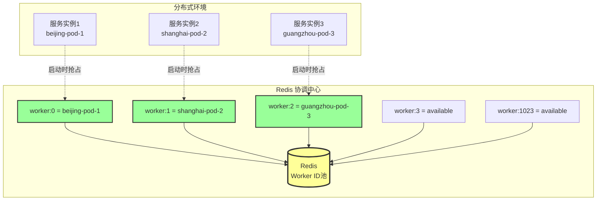

### 1.2 分配流程

根据 `dex-alpha-order-svc/internal/idgen/registry.go:54-111`：

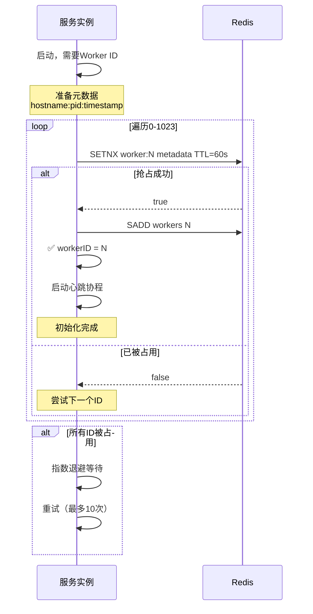

### 1.3 核心代码

```go
func (r *workerRegistry) acquireWorkerID(ctx context.Context) (int64, error) {
    hostname, _ := os.Hostname()
    pid := os.Getpid()
    metadata := fmt.Sprintf("%s:%d:%d", hostname, pid, time.Now().Unix())

    // 尝试10轮
    for attempt := 0; attempt < 10; attempt++ {
        // 遍历0-1023
        for workerID := int64(0); workerID <= maxWorkerID; workerID++ {
            key := fmt.Sprintf("%s:worker:%d", r.keyPrefix, workerID)

            // Redis原子抢占
            success, err := r.redis.SetNX(ctx, key, metadata, r.ttl).Result()
            if err != nil {
                continue
            }

            if success {
                r.workerID = workerID
                r.healthy = true

                // 加入活跃集合
                r.redis.SAdd(ctx, r.keyPrefix+":workers", workerID)

                // 启动心跳
                go r.heartbeat()

                logx.Infof("✅ Acquired worker ID: %d", workerID)
                return workerID, nil
            }
        }

        // 指数退避
        backoff := time.Duration(math.Pow(2, float64(attempt))) * time.Second
        time.Sleep(backoff + jitter)
    }

    return -1, fmt.Errorf("❌ Failed to acquire worker ID after 10 attempts")
}
```

---

## 2. SETNX 原子抢占原理

### 2.1 Redis SETNX 命令

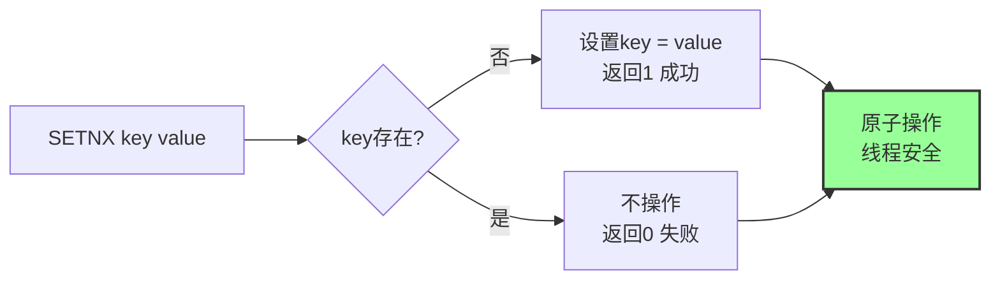

**SETNX = SET if Not eXists**

```redis
# 实例1
> SETNX worker:5 "beijing-pod-1:1234:1672531200"
(integer) 1  # ✅ 成功

# 实例2（同时尝试）
> SETNX worker:5 "shanghai-pod-2:5678:1672531200"
(integer) 0  # ❌ 失败，已被占用

# 查看
> GET worker:5
"beijing-pod-1:1234:1672531200"
```

### 2.2 TTL 过期保护

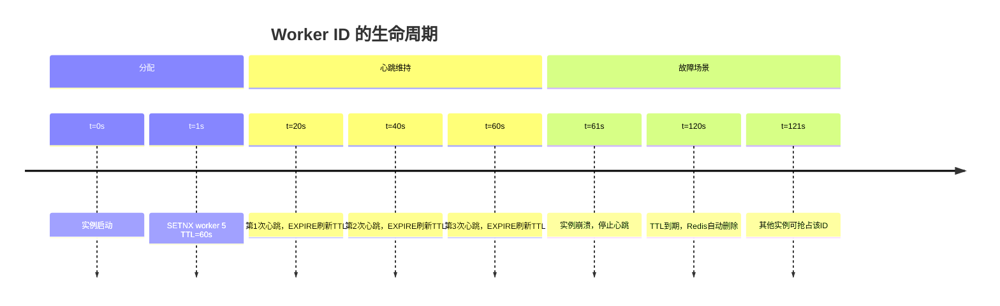

**为什么需要TTL？**

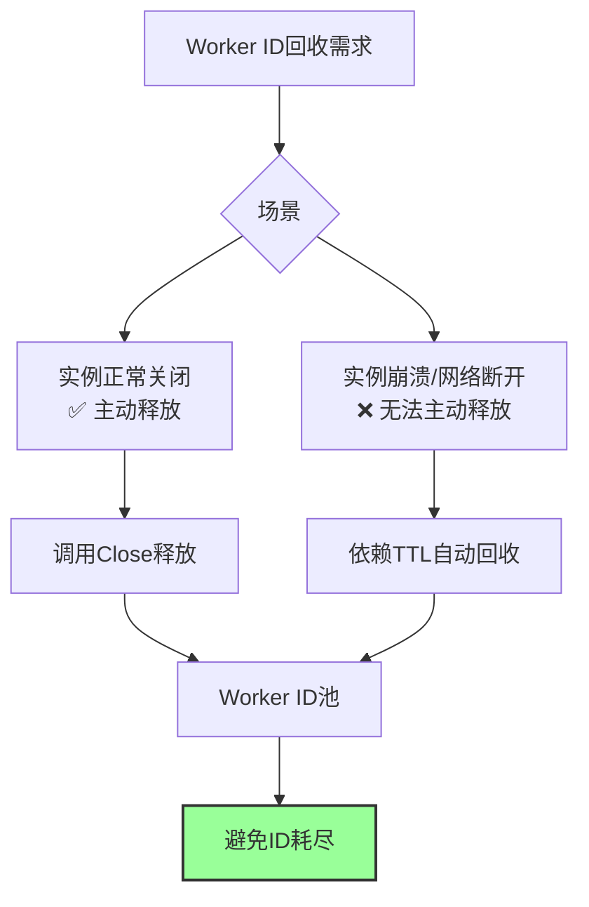

---

## 3. 心跳维持与TTL刷新

### 3.1 心跳架构

根据 `dex-alpha-order-svc/internal/idgen/registry.go:113-147`：

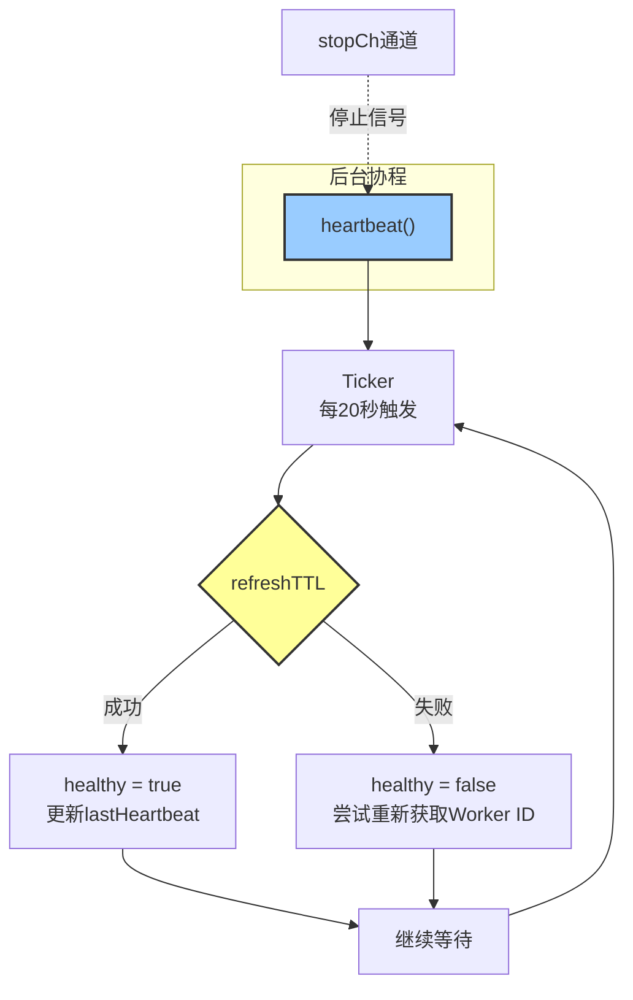

### 3.2 心跳代码

```go
func (r *workerRegistry) heartbeat() {
    ticker := time.NewTicker(r.heartbeatInterval)  // 20秒
    defer ticker.Stop()

    for {
        select {
        case <-ticker.C:
            if err := r.refreshTTL(); err != nil {
                // 心跳失败
                r.mu.Lock()
                r.healthy = false
                r.mu.Unlock()

                // 尝试重新获取Worker ID
                ctx, cancel := context.WithTimeout(context.Background(), 10*time.Second)
                if newWorkerID, err := r.acquireWorkerID(ctx); err == nil {
                    logx.Infof("✅ Re-acquired worker ID: %d", newWorkerID)
                }
                cancel()
            } else {
                // 心跳成功
                r.mu.Lock()
                r.healthy = true
                r.lastHeartbeat = time.Now()
                r.mu.Unlock()
            }

        case <-r.stopCh:
            logx.Info("Stopping heartbeat")
            return
        }
    }
}

func (r *workerRegistry) refreshTTL() error {
    key := fmt.Sprintf("%s:worker:%d", r.keyPrefix, r.workerID)

    // EXPIRE命令刷新TTL
    result, err := r.redis.Expire(context.Background(), key, r.ttl).Result()
    if err != nil {
        return err
    }

    if !result {
        return fmt.Errorf("key %s does not exist", key)
    }

    return nil
}
```

### 3.3 心跳时序图

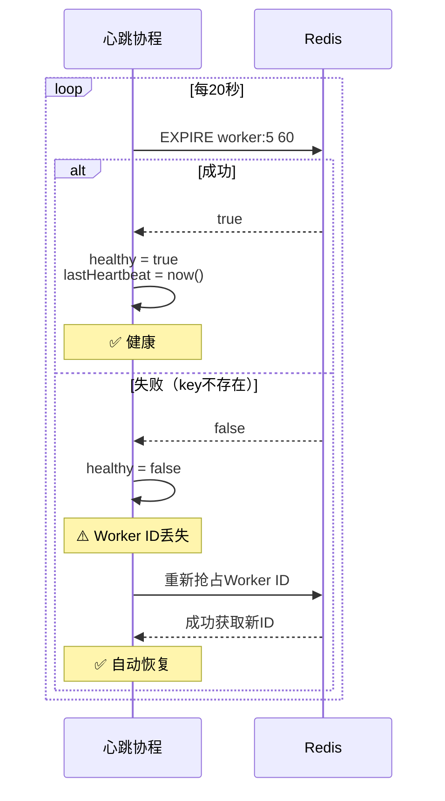

---

## 4. 故障检测与自动恢复

### 4.1 故障场景矩阵

| 故障类型           | 检测方式          | 恢复策略                 | 恢复时间   |
| ------------------ | ----------------- | ------------------------ | ---------- |
| Redis短暂不可用    | refreshTTL失败    | 重试，标记unhealthy      | 20秒内     |
| Worker ID被占用    | EXPIRE返回false   | 重新抢占Worker ID        | 10秒内     |
| 实例崩溃重启       | TTL过期           | 启动时自动抢占新ID       | 60秒后可用 |
| 网络分区           | 心跳超时          | 等待网络恢复，重新抢占   | 取决于网络 |

### 4.2 故障恢复流程

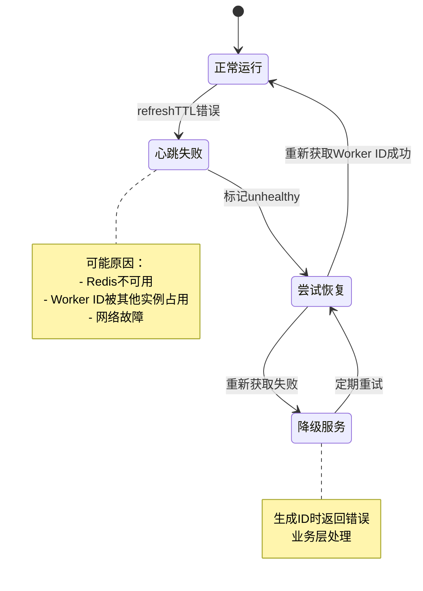

### 4.3 自动恢复代码

```go
// 心跳失败时的恢复逻辑
if err := r.refreshTTL(); err != nil {
    logx.Errorf("❌ Heartbeat failed: %v", err)

    r.mu.Lock()
    r.healthy = false
    r.mu.Unlock()

    // 尝试重新获取Worker ID
    ctx, cancel := context.WithTimeout(context.Background(), 10*time.Second)
    defer cancel()

    newWorkerID, err := r.acquireWorkerID(ctx)
    if err == nil {
        logx.Infof("✅ Recovered with new worker ID: %d", newWorkerID)
        r.mu.Lock()
        r.workerID = newWorkerID
        r.healthy = true
        r.mu.Unlock()
    } else {
        logx.Errorf("❌ Failed to recover: %v", err)
    }
}
```

---

## 5. 健康监控体系

### 5.1 监控指标

根据 `dex-alpha-order-svc/internal/idgen/snowflake.go:148-162`：

```go
type HealthStatus struct {
    Healthy        bool      // 整体健康状态
    WorkerID       int64     // 当前Worker ID
    LastHeartbeat  time.Time // 最后心跳时间
    TotalGenerated int64     // 累计生成ID数
    ErrorCount     int64     // 错误计数
}

func (g *snowflakeGenerator) Health() HealthStatus {
    return HealthStatus{
        Healthy:        g.registry.isHealthy(),
        WorkerID:       g.workerID,
        LastHeartbeat:  g.registry.lastHeartbeat,
        TotalGenerated: atomic.LoadInt64(&g.totalGenerated),
        ErrorCount:     atomic.LoadInt64(&g.errorCount),
    }
}
```

### 5.2 监控架构

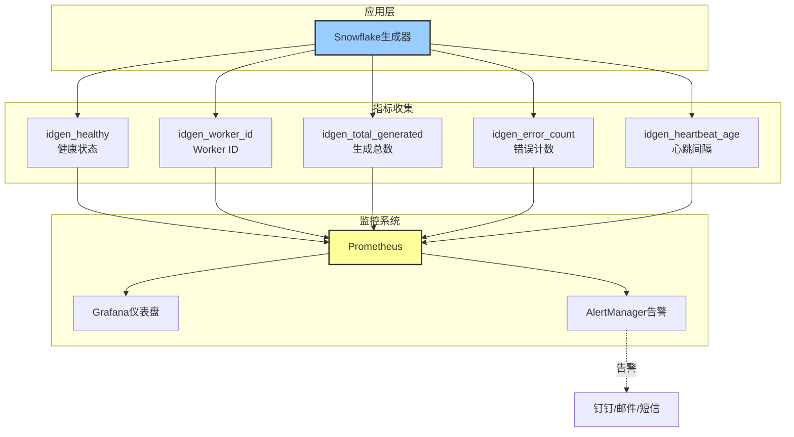

### 5.3 告警规则

```yaml
# Prometheus告警规则
groups:
  - name: snowflake_alerts
    rules:
      - alert: SnowflakeUnhealthy
        expr: idgen_healthy == 0
        for: 1m
        labels:
          severity: critical
        annotations:
          summary: "Snowflake生成器不健康"
          description: "实例 {{ $labels.instance }} 健康检查失败"

      - alert: SnowflakeHeartbeatStale
        expr: (time() - idgen_heartbeat_timestamp) > 60
        for: 1m
        labels:
          severity: warning
        annotations:
          summary: "心跳过期"
          description: "超过60秒未收到心跳"

      - alert: SnowflakeHighErrorRate
        expr: rate(idgen_error_count[5m]) > 10
        for: 5m
        labels:
          severity: warning
        annotations:
          summary: "错误率过高"
          description: "5分钟内错误超过10次"
```

---

## 6. 完整实现代码分析

### 6.1 核心文件结构

```
dex-alpha-order-svc/internal/idgen/
├── idgen.go           # 全局接口 (93行)
│   ├── ParseOrderID()     # ID解析
│   ├── Generate()         # 便捷方法
│   └── SetDefaultGenerator()
│
├── snowflake.go       # 核心实现 (183行)
│   ├── snowflakeGenerator  # 主结构体
│   ├── Initialize()       # 初始化
│   ├── Generate()         # 生成ID
│   ├── GenerateBatch()    # 批量生成
│   └── Health()           # 健康检查
│
├── registry.go        # Redis协调 (216行)
│   ├── workerRegistry     # 注册器
│   ├── acquireWorkerID()  # 获取Worker ID
│   ├── heartbeat()        # 心跳维持
│   ├── refreshTTL()       # 刷新TTL
│   └── release()          # 释放Worker ID
│
├── types.go           # 类型定义 (94行)
│   ├── Generator接口      # 生成器接口
│   ├── HealthStatus      # 健康状态
│   ├── ParseResult       # 解析结果
│   └── 常量定义
│
└── idgen_test.go      # 单元测试 (412行)
    ├── 基础测试
    ├── 并发测试
    ├── 单调性测试
    └── 性能基准测试
```

### 6.2 初始化完整流程

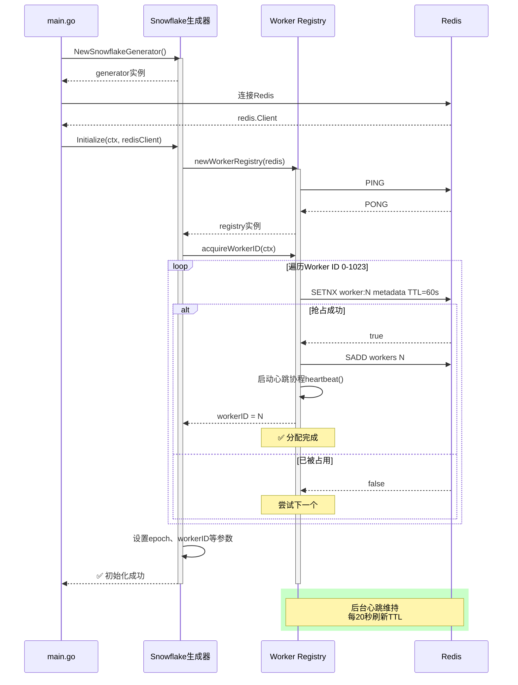

### 6.3 关键数据结构关系

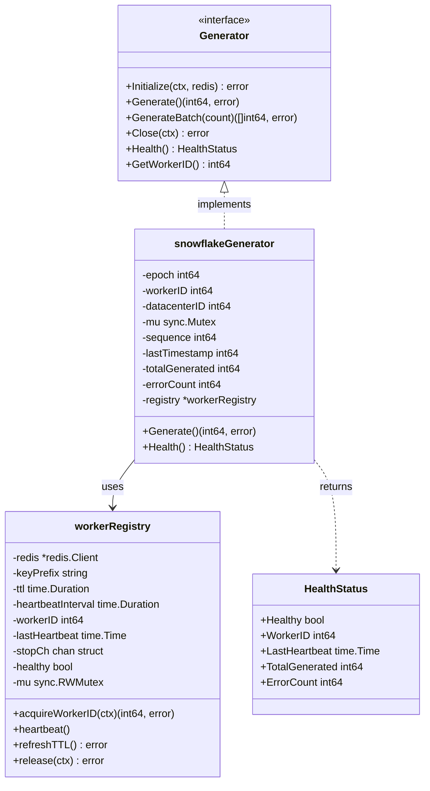

---

## 🎯 本部分小结

### 核心要点

1. **Redis Worker ID分配**：基于SETNX原子抢占，支持1024个节点
2. **心跳维持机制**：每20秒刷新TTL，确保Worker ID不丢失
3. **自动故障恢复**：心跳失败时自动重新获取Worker ID
4. **完善的监控**：健康状态、心跳、错误计数等指标

### 分布式协调总结

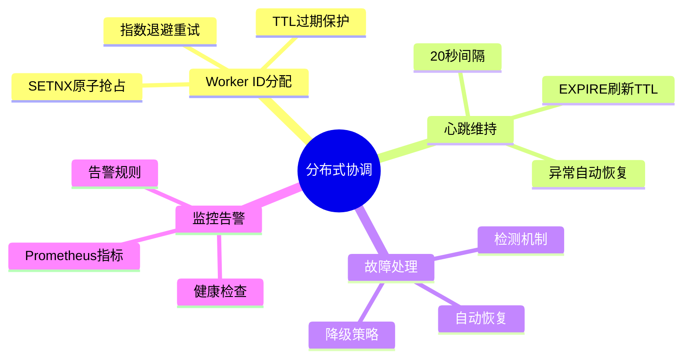

### 下一部分预告

📖 **第5部分：性能优化与最佳实践**

将深入讲解：
- 性能瓶颈分析
- 批量生成优化
- 无锁实现方案
- 生产环境配置
- 监控与运维
- 故障排查

---

**继续阅读**：[第5部分：性能优化与最佳实践 →](./Snowflake算法详解-05-性能优化.md)

**返回上一部分**：[← 第3部分：顺序递增保证机制](./Snowflake算法详解-03-顺序递增保证.md)
