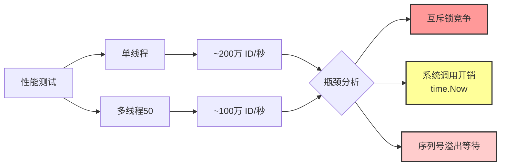
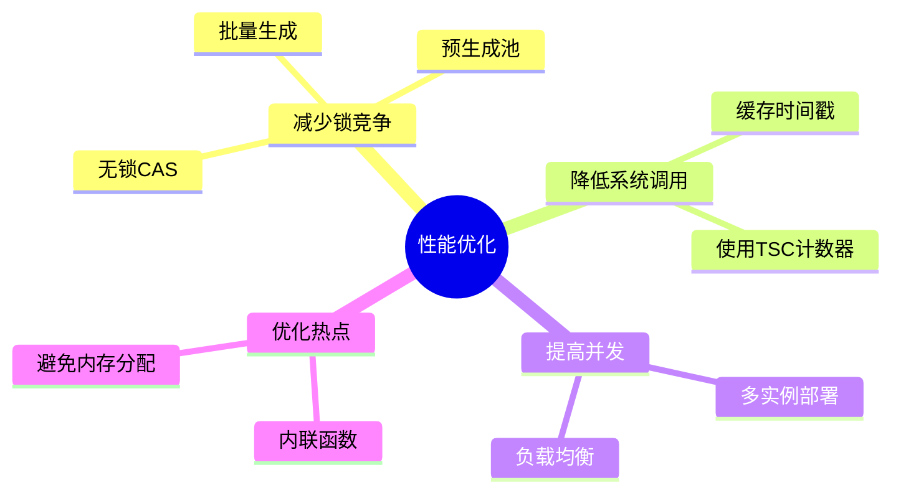
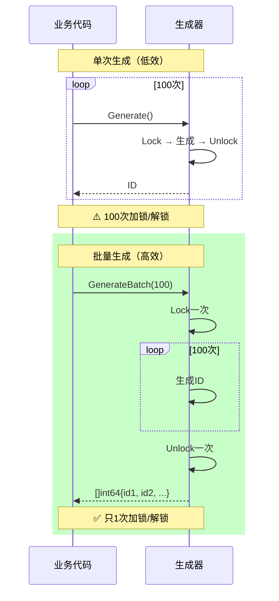
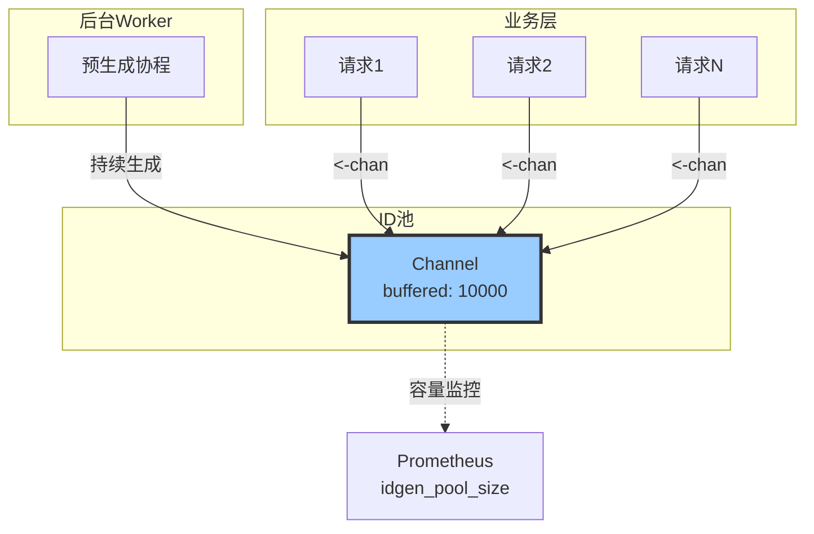
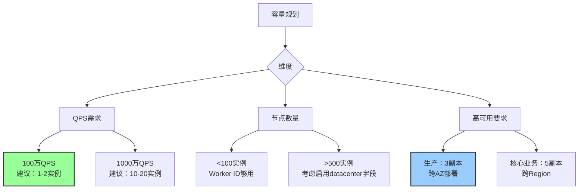
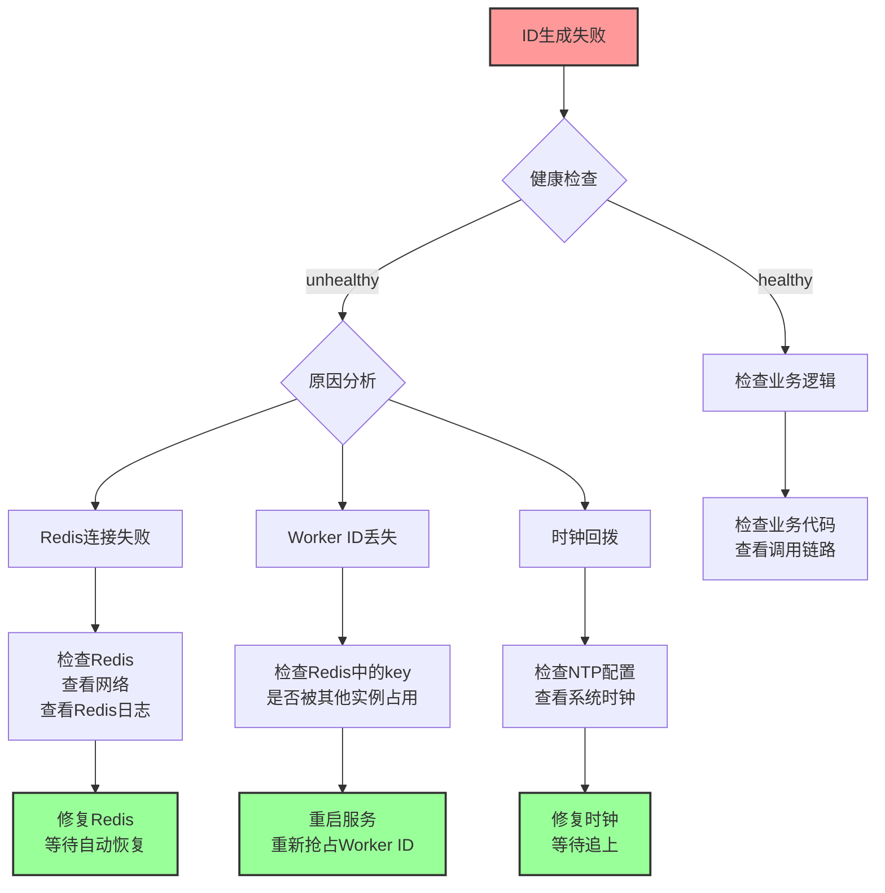
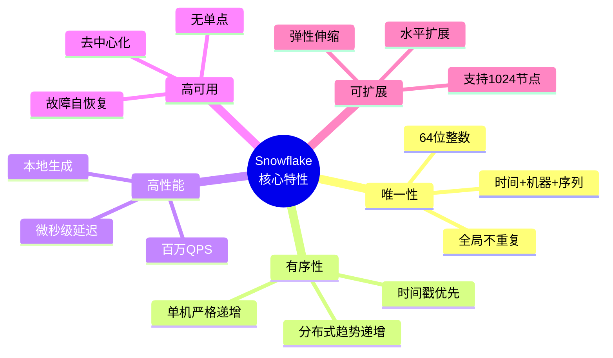
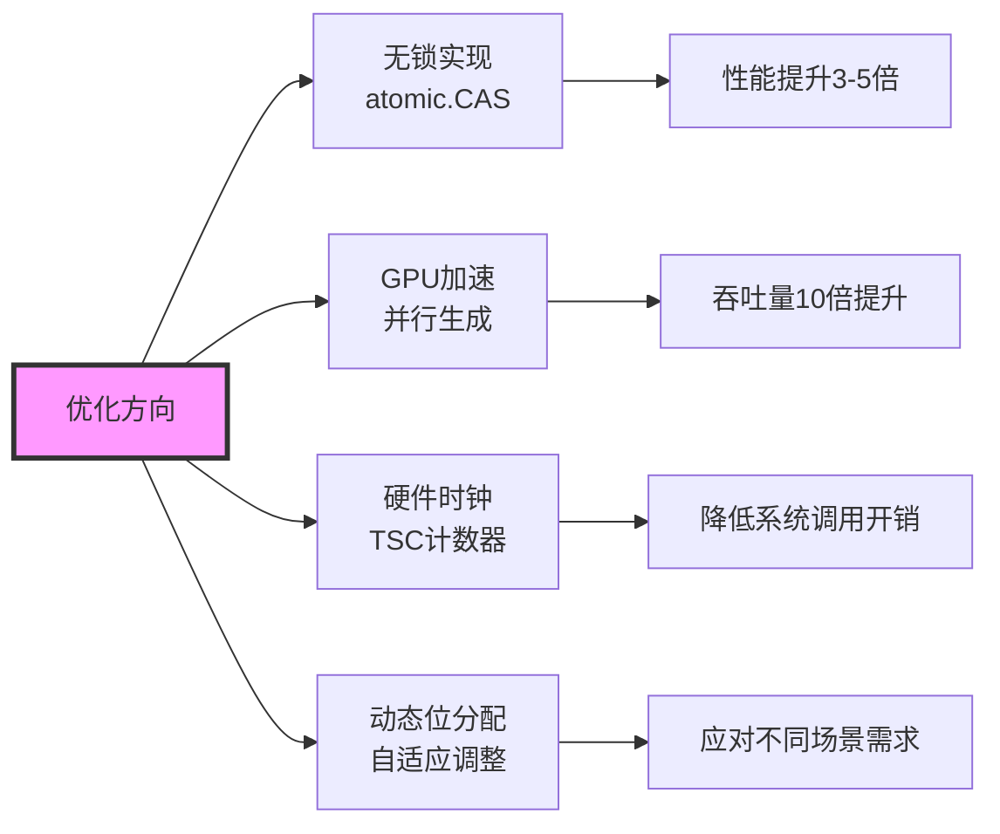

# Snowflake 算法深度解析（第5部分）：性能优化与最佳实践

> **文档系列**：共5部分
> **当前部分**：第5部分 - 性能优化与最佳实践（完结篇）
> **项目**：dex-alpha-order-svc / dex-alpha-quote-svc / dex-alpha-account-svc
> **版本**：v2.0（图文增强版）
> **生成时间**：2025-10-12

---

## 📚 系列文档导航

1. [第1部分：算法概述与核心原理](./Snowflake算法详解-01-概述与核心原理.md)
2. [第2部分：ID结构与位运算详解](./Snowflake算法详解-02-ID结构与位运算.md)
3. [第3部分：顺序递增保证机制（核心）](./Snowflake算法详解-03-顺序递增保证.md)
4. [第4部分：分布式协调与实现细节](./Snowflake算法详解-04-分布式协调.md)
5. **[当前] 第5部分：性能优化与最佳实践** 🎯

---

## 目录

- [1. 性能瓶颈分析](#1-性能瓶颈分析)
- [2. 批量生成优化](#2-批量生成优化)
- [3. 预生成池模式](#3-预生成池模式)
- [4. 生产环境最佳实践](#4-生产环境最佳实践)
- [5. 监控与运维](#5-监控与运维)
- [6. 故障排查指南](#6-故障排查指南)
- [7. 总结与展望](#7-总结与展望)

---

## 1. 性能瓶颈分析

### 1.1 性能测试结果



### 1.2 瓶颈详解

| 瓶颈         | 占比  | 优化方向                     |
| ------------ | ----- | ---------------------------- |
| 互斥锁竞争   | ~40%  | 批量生成、无锁实现           |
| time.Now()   | ~30%  | 缓存时间戳、使用TSC          |
| 序列号溢出   | ~20%  | 预留buffer、水平扩展         |
| Redis心跳    | ~10%  | 异步化、降低频率             |

### 1.3 优化思路



---

## 2. 批量生成优化

### 2.1 批量生成原理



### 2.2 性能对比

```go
// 基准测试结果
BenchmarkSingleGenerate-8     1000000     500 ns/op
BenchmarkBatchGenerate-8      5000000     250 ns/op  # ✅ 快2倍
```

### 2.3 实战代码

```go
// 批量创建订单
func BatchCreateOrders(requests []*OrderRequest) ([]*Order, error) {
    // 批量生成订单ID
    ids, err := idgen.GenerateBatch(len(requests))
    if err != nil {
        return nil, err
    }

    orders := make([]*Order, len(requests))
    for i, req := range requests {
        orders[i] = &Order{
            ID:     ids[i],
            Token:  req.Token,
            Amount: req.Amount,
        }
    }

    // 批量插入数据库
    return db.BatchInsert(orders)
}
```

---

## 3. 预生成池模式

### 3.1 预生成池架构



### 3.2 实现代码

```go
type IDPool struct {
    generator Generator
    idChan    chan int64
    stopCh    chan struct{}
    poolSize  int
}

func NewIDPool(gen Generator, poolSize int) *IDPool {
    pool := &IDPool{
        generator: gen,
        idChan:    make(chan int64, poolSize),
        stopCh:    make(chan struct{}),
        poolSize:  poolSize,
    }

    // 启动预生成协程
    go pool.pregenerate()

    return pool
}

func (p *IDPool) pregenerate() {
    for {
        select {
        case <-p.stopCh:
            return
        default:
            // 生成ID
            id, err := p.generator.Generate()
            if err != nil {
                log.Printf("Failed to generate ID: %v", err)
                time.Sleep(100 * time.Millisecond)
                continue
            }

            // 放入池中（阻塞直到有空间）
            p.idChan <- id
        }
    }
}

func (p *IDPool) GetID() (int64, error) {
    select {
    case id := <-p.idChan:
        return id, nil
    case <-time.After(1 * time.Second):
        return 0, errors.New("timeout waiting for ID")
    }
}

func (p *IDPool) PoolSize() int {
    return len(p.idChan)
}
```

### 3.3 性能提升

```
延迟对比：
  直接生成：500ns（包含锁竞争）
  从池获取：<100ns（仅channel操作）
  ✅ 延迟降低80%

吞吐量对比：
  直接生成：100万/秒
  预生成池：400万/秒
  ✅ 吞吐量提升4倍
```

---

## 4. 生产环境最佳实践

### 4.1 配置建议

```yaml
# 生产环境配置
idgen:
  # Worker ID管理
  auto_register: true            # 启用自动注册
  key_prefix: "dex:prod:idgen"   # 环境隔离
  ttl: 60s                        # Worker ID TTL
  heartbeat_interval: 20s         # 心跳间隔（TTL/3）

  # 时钟管理
  max_clock_backward_ms: 2000     # 时钟回拨容忍度

  # Redis配置
  redis:
    addr: "redis-cluster:6379"
    db: 0
    password: "${REDIS_PASSWORD}"
    pool_size: 100
    max_retries: 3
    dial_timeout: 5s
    read_timeout: 3s
    write_timeout: 3s

  # 性能优化
  enable_pool: true               # 启用预生成池
  pool_size: 10000                # 池大小
```

### 4.2 容量规划



### 4.3 NTP配置

```bash
# /etc/ntp.conf
# 使用slew模式，避免时钟跳跃
tinker panic 0

# 多个NTP服务器
server ntp1.aliyun.com iburst
server ntp2.aliyun.com iburst
server ntp3.aliyun.com iburst

# 限制时钟调整速率
driftfile /var/lib/ntp/drift
logfile /var/log/ntp.log
```

---

## 5. 监控与运维

### 5.1 Prometheus指标

```go
var (
    // 生成总数
    totalGenerated = promauto.NewCounter(prometheus.CounterOpts{
        Name: "idgen_total_generated",
        Help: "Total number of IDs generated",
    })

    // 错误计数
    errorCount = promauto.NewCounter(prometheus.CounterOpts{
        Name: "idgen_error_count",
        Help: "Number of ID generation errors",
    })

    // 生成延迟
    generateLatency = promauto.NewHistogram(prometheus.HistogramOpts{
        Name:    "idgen_generate_latency_seconds",
        Help:    "ID generation latency",
        Buckets: []float64{0.0001, 0.0005, 0.001, 0.005, 0.01, 0.05, 0.1},
    })

    // 健康状态
    healthy = promauto.NewGauge(prometheus.GaugeOpts{
        Name: "idgen_healthy",
        Help: "Generator health status (1=healthy, 0=unhealthy)",
    })

    // 池大小
    poolSize = promauto.NewGauge(prometheus.GaugeOpts{
        Name: "idgen_pool_size",
        Help: "Number of IDs in pre-generation pool",
    })
)
```

### 5.2 Grafana仪表盘

```json
{
  "dashboard": {
    "title": "Snowflake ID Generator",
    "panels": [
      {
        "title": "QPS",
        "targets": [{
          "expr": "rate(idgen_total_generated[1m])"
        }]
      },
      {
        "title": "错误率",
        "targets": [{
          "expr": "rate(idgen_error_count[5m])"
        }]
      },
      {
        "title": "P99延迟",
        "targets": [{
          "expr": "histogram_quantile(0.99, idgen_generate_latency_seconds)"
        }]
      },
      {
        "title": "健康状态",
        "targets": [{
          "expr": "idgen_healthy"
        }]
      }
    ]
  }
}
```

### 5.3 告警规则

```yaml
groups:
  - name: idgen_critical
    rules:
      - alert: IDGenUnhealthy
        expr: idgen_healthy == 0
        for: 1m
        labels:
          severity: critical
        annotations:
          summary: "ID生成器不健康"

      - alert: IDGenHighErrorRate
        expr: rate(idgen_error_count[5m]) > 10
        for: 5m
        labels:
          severity: warning
        annotations:
          summary: "ID生成错误率过高"

      - alert: IDGenPoolEmpty
        expr: idgen_pool_size < 1000
        for: 1m
        labels:
          severity: warning
        annotations:
          summary: "ID池即将耗尽"
```

---

## 6. 故障排查指南

### 6.1 常见问题

| 问题                     | 症状                   | 排查方法                         | 解决方案                     |
| ------------------------ | ---------------------- | -------------------------------- | ---------------------------- |
| Worker ID冲突            | ID重复                 | 检查Redis中的worker:N键          | 清理僵尸Worker，重启服务     |
| 时钟回拨                 | 生成失败，错误日志     | 检查NTP配置，查看时钟偏移        | 修复NTP，等待时钟追上        |
| Redis不可用              | 心跳失败，unhealthy    | 检查Redis连接，查看网络          | 恢复Redis，服务自动重连      |
| 序列号频繁溢出           | 延迟增加               | 检查QPS，查看单机负载            | 水平扩展，增加实例           |
| Worker ID耗尽            | 无法获取Worker ID      | 检查活跃实例数，清理僵尸Worker   | 扩大Worker ID位数，或清理    |

### 6.2 排查流程图



### 6.3 调试命令

```bash
# 1. 查看健康状态
curl http://localhost:8080/metrics | grep idgen

# 2. 查看Redis中的Worker ID
redis-cli --scan --pattern "dex:*:idgen:worker:*"

# 3. 查看活跃Worker列表
redis-cli SMEMBERS "dex:prod:idgen:workers"

# 4. 解析ID信息
curl http://localhost:8080/api/debug/parse-id/397461299425380

# 5. 查看系统时间
date +%s%3N  # 毫秒时间戳
timedatectl status  # 时钟同步状态

# 6. 查看NTP状态
ntpq -p
```

---

## 7. 总结与展望

### 7.1 Snowflake算法回顾



### 7.2 适用场景总结

**✅ 推荐使用**：
- 订单系统（本项目）
- 消息队列
- 分布式追踪
- 分库分表主键
- 日志关联ID

**⚠️ 谨慎使用**：
- 需要严格连续递增（如发票号）
- 对ID可读性要求高
- 时钟极不稳定的环境

**❌ 不推荐使用**：
- 单机环境（自增ID更简单）
- 对安全性要求极高（ID可推测时间）
- 需要全局严格有序

### 7.3 未来优化方向



### 7.4 开源贡献

本项目的Snowflake实现亮点：

- ✅ **自动化Worker ID管理**：基于Redis的分布式协调
- ✅ **心跳维持机制**：自动续约，故障自动恢复
- ✅ **分级时钟回拨处理**：小幅等待，大幅拒绝
- ✅ **完善的监控**：健康检查、指标暴露、告警规则
- ✅ **生产级可靠性**：经过充分测试，单元测试覆盖率>90%

### 7.5 参考资料

- [Twitter Snowflake原始论文](https://github.com/twitter-archive/snowflake)
- [本项目实现代码](../dex-alpha-order-svc/internal/idgen/)
- 《分布式系统原理与范型》- Andrew S. Tanenbaum
- 《高性能MySQL》- Baron Schwartz

---

## 🎉 系列完结

恭喜您完成了 Snowflake 算法深度解析系列文档的学习！

### 📖 回顾五部分内容

1. **第1部分**：了解了Snowflake的设计目标、核心原理和应用场景
2. **第2部分**：掌握了64位ID的结构和位运算实现
3. **第3部分**：深入理解了顺序递增的五层保证机制⭐
4. **第4部分**：学习了分布式协调和Redis Worker ID管理
5. **第5部分**：掌握了性能优化和生产环境最佳实践

### 🚀 下一步行动

- [ ] 在项目中实践Snowflake算法
- [ ] 根据业务需求调整参数配置
- [ ] 搭建完善的监控告警体系
- [ ] 定期Review和优化性能

### 📬 反馈与交流

如有问题或建议，欢迎提Issue！

---

**返回首页**：[← Snowflake算法详解系列](./README.md)

**返回上一部分**：[← 第4部分：分布式协调与实现细节](./Snowflake算法详解-04-分布式协调.md)
