# Aptos 共识模块 - 关键流程图详解

**文档版本**: v1.0
**创建日期**: 2025-10-09
**适用版本**: Aptos Core latest

---

## 目录

1. [概述](#1-概述)
2. [区块提议完整流程](#2-区块提议完整流程)
   - 2.1 [提议创建阶段](#21-提议创建阶段)
   - 2.2 [提议广播阶段](#22-提议广播阶段)
   - 2.3 [提议验证阶段](#23-提议验证阶段)
   - 2.4 [投票收集阶段](#24-投票收集阶段)
3. [投票聚合流程](#3-投票聚合流程)
   - 3.1 [投票接收与验证](#31-投票接收与验证)
   - 3.2 [QuorumCert 形成](#32-quorumcert-形成)
   - 3.3 [BLS 签名聚合](#33-bls-签名聚合)
4. [Pipeline 执行流程](#4-pipeline-执行流程)
   - 4.1 [ExecutionSchedule 阶段](#41-executionschedule-阶段)
   - 4.2 [ExecutionWait 阶段](#42-executionwait-阶段)
   - 4.3 [Signing 阶段](#43-signing-阶段)
   - 4.4 [Persisting 阶段](#44-persisting-阶段)
5. [区块提交流程](#5-区块提交流程)
   - 5.1 [CommitVote 生成](#51-commitvote-生成)
   - 5.2 [可靠广播机制](#52-可靠广播机制)
   - 5.3 [CommitDecision 形成](#53-commitdecision-形成)
6. [DAG 排序流程](#6-dag-排序流程)
   - 6.1 [Node 生成与签名](#61-node-生成与签名)
   - 6.2 [Anchor 投票](#62-anchor-投票)
   - 6.3 [拓扑排序](#63-拓扑排序)
7. [QuorumStore 批次流程](#7-quorumstore-批次流程)
8. [状态同步流程](#8-状态同步流程)
9. [纪元变更流程](#9-纪元变更流程)
10. [完整共识轮次流程](#10-完整共识轮次流程)

---

## 1. 概述

本文档详细介绍了 Aptos 共识模块中的关键流程，包括区块提议、投票聚合、Pipeline 执行、区块提交、DAG 排序等核心机制。每个流程都配有详细的流程图、时序图和代码示例。

**核心流程概览**:

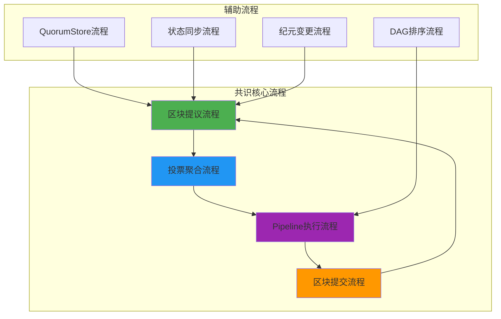
```mermaid
graph TB
    subgraph "共识核心流程"
        P[区块提议流程]
        V[投票聚合流程]
        E[Pipeline执行流程]
        C[区块提交流程]
    end

    subgraph "辅助流程"
        Q[QuorumStore流程]
        S[状态同步流程]
        D[DAG排序流程]
        EP[纪元变更流程]
    end

    P --> V
    V --> E
    E --> C
    C --> P

    Q --> P
    S --> P
    D --> E
    EP --> P

    style P fill:#4caf50
    style V fill:#2196f3
    style E fill:#9c27b0
    style C fill:#ff9800
```

**流程时间线**:

| 流程 | 触发条件 | 耗时 | 频率 |
|------|---------|------|------|
| 区块提议 | 轮次开始 | 50-100ms | 每轮 |
| 投票聚合 | 收到提议 | 100-200ms | 每轮 |
| Pipeline 执行 | 区块获得 QC | 200-500ms | 每轮 |
| 区块提交 | 执行完成 | 100-300ms | 每轮 |
| QuorumStore | 持续运行 | - | 持续 |
| 状态同步 | 落后时 | 1-10s | 按需 |
| DAG 排序 | DAG 模式 | 100-300ms | 每轮 |
| 纪元变更 | 纪元结束 | 1-5s | 每纪元 |

---

## 2. 区块提议完整流程

### 2.1 提议创建阶段

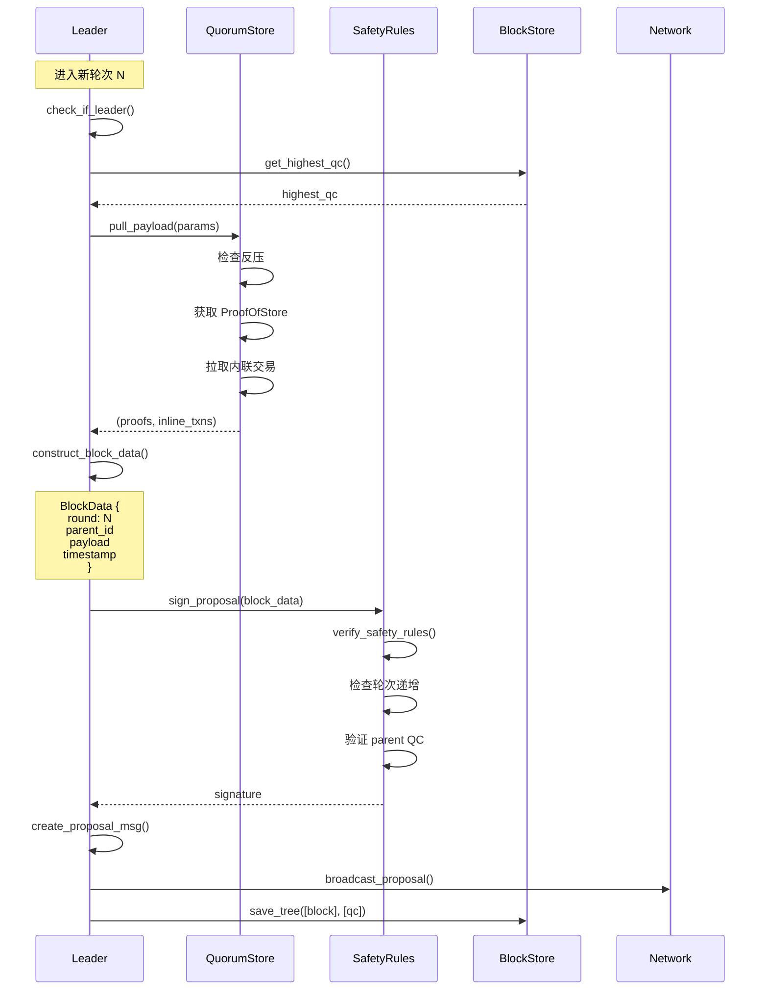
```mermaid
sequenceDiagram
    participant L as Leader
    participant QS as QuorumStore
    participant SR as SafetyRules
    participant BS as BlockStore
    participant NET as Network

    Note over L: 进入新轮次 N

    L->>L: check_if_leader()
    L->>BS: get_highest_qc()
    BS-->>L: highest_qc

    L->>QS: pull_payload(params)
    QS->>QS: 检查反压
    QS->>QS: 获取 ProofOfStore
    QS->>QS: 拉取内联交易
    QS-->>L: (proofs, inline_txns)

    L->>L: construct_block_data()
    Note over L: BlockData {<br/>round: N<br/>parent_id<br/>payload<br/>timestamp<br/>}

    L->>SR: sign_proposal(block_data)
    SR->>SR: verify_safety_rules()
    SR->>SR: 检查轮次递增
    SR->>SR: 验证 parent QC
    SR-->>L: signature

    L->>L: create_proposal_msg()
    L->>NET: broadcast_proposal()
    L->>BS: save_tree([block], [qc])
```

**Payload 构造详解**:

```rust
// 源码: consensus/src/liveness/proposal_generator.rs
async fn construct_payload(&self) -> Payload {
    // 1. 拉取参数配置
    let params = PayloadPullParameters {
        max_items: self.config.max_block_txns,
        max_bytes: self.config.max_block_bytes,
        max_inline_items: 100,
        max_inline_bytes: 50 * 1024, // 50KB
        pending_ordering: self.buffer_manager.has_pending_blocks(),
        pending_uncommitted_blocks: self.buffer_manager.uncommitted_count(),
        recent_max_fill_fraction: self.recent_fill_fraction(),
        user_txn_filter: self.txn_filter.clone(),
    };

    // 2. 从 QuorumStore 拉取
    let (validator_txns, payload) = self.quorum_store_client
        .pull_payload(params, validator_txn_filter)
        .await?;

    // 3. 构造完整 Payload
    Payload {
        validator_txns,
        proofs: payload.proofs,
        inline_txns: payload.inline_txns,
    }
}
```

**SafetyRules 验证**:

```rust
// 源码: consensus/src/safety_rules.rs
fn sign_proposal(&mut self, block_data: &BlockData) -> Result<Signature> {
    // 1. 验证轮次递增
    ensure!(
        block_data.round() > self.persistent_storage.last_voted_round()?,
        "Round not increasing"
    );

    // 2. 验证 parent QC
    ensure!(
        block_data.quorum_cert().certified_block().round() + 1 == block_data.round()
            || self.is_valid_timeout(block_data),
        "Invalid parent QC"
    );

    // 3. 验证 2-chain 规则
    let qc_round = block_data.quorum_cert().certified_block().round();
    ensure!(
        qc_round >= self.persistent_storage.highest_committed_round()?,
        "QC round too old"
    );

    // 4. 签名
    let signature = self.validator_signer.sign(block_data)?;

    // 5. 保存状态
    self.persistent_storage.set_last_voted_round(block_data.round())?;

    Ok(signature)
}
```

### 2.2 提议广播阶段

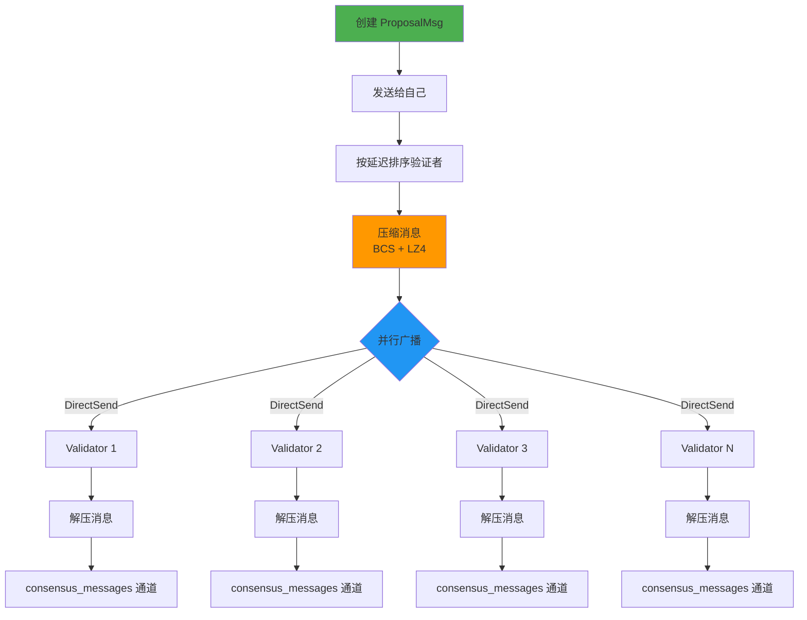
```mermaid
flowchart TD
    START[创建 ProposalMsg] --> SELF[发送给自己]
    SELF --> SORT[按延迟排序验证者]
    SORT --> COMPRESS[压缩消息<br/>BCS + LZ4]
    COMPRESS --> PARALLEL{并行广播}

    PARALLEL -->|DirectSend| V1[Validator 1]
    PARALLEL -->|DirectSend| V2[Validator 2]
    PARALLEL -->|DirectSend| V3[Validator 3]
    PARALLEL -->|DirectSend| V4[Validator N]

    V1 --> D1[解压消息]
    V2 --> D2[解压消息]
    V3 --> D3[解压消息]
    V4 --> D4[解压消息]

    D1 --> Q1[consensus_messages 通道]
    D2 --> Q2[consensus_messages 通道]
    D3 --> Q3[consensus_messages 通道]
    D4 --> Q4[consensus_messages 通道]

    style START fill:#4caf50
    style PARALLEL fill:#2196f3
    style COMPRESS fill:#ff9800
```

**广播性能优化**:

```rust
// 延迟排序策略
fn sort_peers_by_latency(&self, peers: &mut [Author]) {
    peers.sort_by_cached_key(|peer| {
        self.network_client
            .get_peer_latency(peer)
            .unwrap_or(Duration::from_millis(999))
    });
}

// 批量发送
fn broadcast_without_self(&self, msg: ConsensusMsg) {
    let mut other_validators: Vec<_> = self.validators
        .get_ordered_account_addresses_iter()
        .filter(|author| author != &self.author)
        .collect();

    // 优先发送给低延迟节点
    self.sort_peers_by_latency(&mut other_validators);

    // 批量发送
    self.consensus_network_client.send_to_many(other_validators, msg);
}
```

### 2.3 提议验证阶段

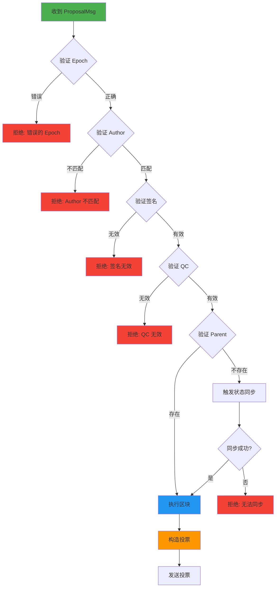
```mermaid
flowchart TD
    RECV[收到 ProposalMsg] --> EPOCH{验证 Epoch}
    EPOCH -->|错误| REJECT1[拒绝: 错误的 Epoch]
    EPOCH -->|正确| AUTHOR{验证 Author}

    AUTHOR -->|不匹配| REJECT2[拒绝: Author 不匹配]
    AUTHOR -->|匹配| SIG{验证签名}

    SIG -->|无效| REJECT3[拒绝: 签名无效]
    SIG -->|有效| QC{验证 QC}

    QC -->|无效| REJECT4[拒绝: QC 无效]
    QC -->|有效| PARENT{验证 Parent}

    PARENT -->|不存在| SYNC[触发状态同步]
    PARENT -->|存在| EXEC[执行区块]

    EXEC --> VOTE[构造投票]
    VOTE --> SEND[发送投票]

    SYNC --> RETRY{同步成功?}
    RETRY -->|是| EXEC
    RETRY -->|否| REJECT5[拒绝: 无法同步]

    style RECV fill:#4caf50
    style EXEC fill:#2196f3
    style VOTE fill:#ff9800
    style REJECT1 fill:#f44336
    style REJECT2 fill:#f44336
    style REJECT3 fill:#f44336
    style REJECT4 fill:#f44336
    style REJECT5 fill:#f44336
```

**完整验证代码**:

```rust
// 源码: consensus/src/round_manager.rs
async fn process_proposal_msg(&mut self, proposal_msg: ProposalMsg, peer_id: Author) {
    let proposal = proposal_msg.proposal();

    // 1. Epoch 验证
    if proposal.epoch() != self.epoch() {
        warn!("Proposal from wrong epoch: {} vs {}", proposal.epoch(), self.epoch());
        return;
    }

    // 2. Author 验证
    if proposal.author() != peer_id {
        warn!("Proposal author mismatch: {} vs {}", proposal.author(), peer_id);
        return;
    }

    // 3. 签名验证
    if !self.validators.verify(
        proposal.author(),
        &proposal.hash(),
        proposal.signature(),
    ) {
        warn!("Invalid proposal signature from {}", peer_id);
        return;
    }

    // 4. QC 验证
    if let Err(e) = proposal.quorum_cert().verify(&self.validators) {
        warn!("Invalid QC in proposal: {:?}", e);
        return;
    }

    // 5. Parent 验证
    if !self.block_store.has_block(proposal.parent_id()) {
        info!("Missing parent {}, triggering sync", proposal.parent_id());
        self.sync_to_highest_qc(proposal_msg.sync_info()).await;
        return;
    }

    // 6. 执行并投票
    match self.block_store.execute_and_insert_block(proposal.clone()).await {
        Ok(_) => {
            let vote = self.construct_vote(proposal)?;
            self.send_vote(vote).await;
        },
        Err(e) => {
            warn!("Failed to execute proposal: {:?}", e);
        }
    }
}
```

### 2.4 投票收集阶段

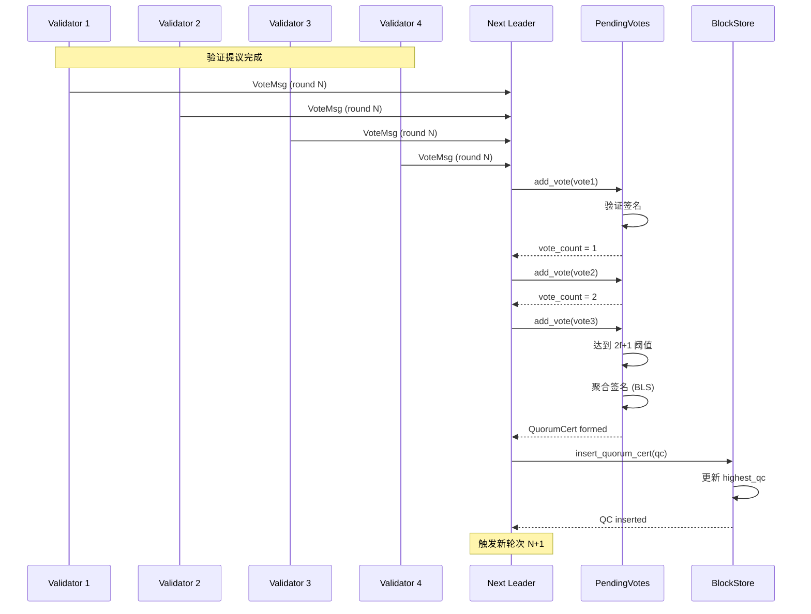
```mermaid
sequenceDiagram
    participant V1 as Validator 1
    participant V2 as Validator 2
    participant V3 as Validator 3
    participant V4 as Validator 4
    participant L as Next Leader
    participant PV as PendingVotes
    participant BS as BlockStore

    Note over V1,V4: 验证提议完成

    V1->>L: VoteMsg (round N)
    V2->>L: VoteMsg (round N)
    V3->>L: VoteMsg (round N)
    V4->>L: VoteMsg (round N)

    L->>PV: add_vote(vote1)
    PV->>PV: 验证签名
    PV-->>L: vote_count = 1

    L->>PV: add_vote(vote2)
    PV-->>L: vote_count = 2

    L->>PV: add_vote(vote3)
    PV->>PV: 达到 2f+1 阈值
    PV->>PV: 聚合签名 (BLS)
    PV-->>L: QuorumCert formed

    L->>BS: insert_quorum_cert(qc)
    BS->>BS: 更新 highest_qc
    BS-->>L: QC inserted

    Note over L: 触发新轮次 N+1
```

**PendingVotes 实现**:

```rust
// 源码: consensus/src/pending_votes.rs
pub struct PendingVotes {
    votes: HashMap<Author, Vote>,
    validator_verifier: Arc<ValidatorVerifier>,
    quorum_size: usize,
}

impl PendingVotes {
    pub fn insert_vote(&mut self, vote: Vote) -> VoteReceptionResult {
        // 1. 验证签名
        if !self.validator_verifier.verify(
            vote.author(),
            &vote.vote_data().hash(),
            vote.signature(),
        ) {
            return VoteReceptionResult::InvalidSignature;
        }

        // 2. 检查重复
        if self.votes.contains_key(&vote.author()) {
            return VoteReceptionResult::DuplicateVote;
        }

        // 3. 添加投票
        self.votes.insert(vote.author(), vote);

        // 4. 检查是否达到仲裁
        if self.votes.len() >= self.quorum_size {
            VoteReceptionResult::NewQuorumCertificate(self.aggregate_qc())
        } else {
            VoteReceptionResult::VoteAdded(self.votes.len())
        }
    }

    fn aggregate_qc(&self) -> QuorumCert {
        // BLS 签名聚合
        let signatures: Vec<_> = self.votes.values()
            .map(|vote| vote.signature())
            .collect();

        let aggregated_sig = bls12381::Signature::aggregate(&signatures).unwrap();

        QuorumCert::new(
            self.votes.values().next().unwrap().vote_data().clone(),
            aggregated_sig,
        )
    }
}
```

---

## 3. 投票聚合流程

### 3.1 投票接收与验证

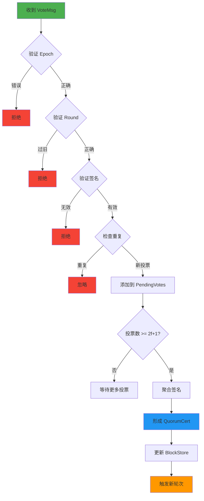
```mermaid
flowchart TD
    A[收到 VoteMsg] --> B{验证 Epoch}
    B -->|错误| Z1[拒绝]
    B -->|正确| C{验证 Round}

    C -->|过旧| Z2[拒绝]
    C -->|正确| D{验证签名}

    D -->|无效| Z3[拒绝]
    D -->|有效| E{检查重复}

    E -->|重复| Z4[忽略]
    E -->|新投票| F[添加到 PendingVotes]

    F --> G{投票数 >= 2f+1?}
    G -->|否| H[等待更多投票]
    G -->|是| I[聚合签名]

    I --> J[形成 QuorumCert]
    J --> K[更新 BlockStore]
    K --> L[触发新轮次]

    style A fill:#4caf50
    style J fill:#2196f3
    style L fill:#ff9800
    style Z1 fill:#f44336
    style Z2 fill:#f44336
    style Z3 fill:#f44336
    style Z4 fill:#f44336
```

**投票验证详细流程**:

```rust
// 源码: consensus/src/round_manager.rs
async fn process_vote_msg(&mut self, vote_msg: VoteMsg, peer_id: Author) {
    let vote = vote_msg.vote();

    // 1. Epoch 验证
    if vote.epoch() != self.epoch() {
        return;
    }

    // 2. Round 验证
    if vote.vote_data().proposed().round() < self.round() {
        return; // 过旧的投票
    }

    // 3. 签名验证
    if !self.validators.verify(
        vote.author(),
        &vote.vote_data().hash(),
        vote.signature(),
    ) {
        warn!("Invalid vote signature from {}", peer_id);
        return;
    }

    // 4. 添加到 PendingVotes
    let vote_reception_result = self.pending_votes
        .insert_vote(vote.clone(), vote.vote_data().proposed().round());

    // 5. 处理结果
    match vote_reception_result {
        VoteReceptionResult::NewQuorumCertificate(qc) => {
            self.process_new_qc(qc).await;
        },
        VoteReceptionResult::VoteAdded(count) => {
            debug!("Vote added, current count: {}", count);
        },
        _ => {},
    }
}
```

### 3.2 QuorumCert 形成

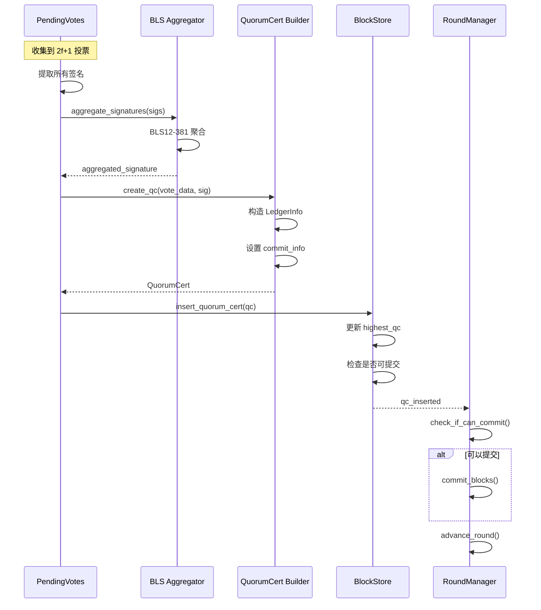
```mermaid
sequenceDiagram
    participant PV as PendingVotes
    participant BLS as BLS Aggregator
    participant QC as QuorumCert Builder
    participant BS as BlockStore
    participant RM as RoundManager

    Note over PV: 收集到 2f+1 投票

    PV->>PV: 提取所有签名
    PV->>BLS: aggregate_signatures(sigs)
    BLS->>BLS: BLS12-381 聚合
    BLS-->>PV: aggregated_signature

    PV->>QC: create_qc(vote_data, sig)
    QC->>QC: 构造 LedgerInfo
    QC->>QC: 设置 commit_info
    QC-->>PV: QuorumCert

    PV->>BS: insert_quorum_cert(qc)
    BS->>BS: 更新 highest_qc
    BS->>BS: 检查是否可提交
    BS-->>RM: qc_inserted

    RM->>RM: check_if_can_commit()
    alt 可以提交
        RM->>RM: commit_blocks()
    end

    RM->>RM: advance_round()
```

**QuorumCert 数据结构**:

```rust
// 源码: consensus/consensus-types/src/quorum_cert.rs
pub struct QuorumCert {
    vote_data: VoteData,
    signed_ledger_info: LedgerInfoWithSignatures,
}

pub struct VoteData {
    proposed: BlockInfo,   // 被投票的区块
    parent: BlockInfo,     // 父区块
}

pub struct LedgerInfoWithSignatures {
    ledger_info: LedgerInfo,
    signatures: BTreeMap<Author, Signature>,  // 或聚合签名
}

impl QuorumCert {
    pub fn new(vote_data: VoteData, aggregated_sig: AggregateSignature) -> Self {
        let ledger_info = LedgerInfo::new(
            vote_data.proposed().clone(),
            HashValue::zero(),  // 执行前状态根为空
        );

        let signed_ledger_info = LedgerInfoWithSignatures::new(
            ledger_info,
            aggregated_sig,
        );

        QuorumCert {
            vote_data,
            signed_ledger_info,
        }
    }

    pub fn verify(&self, validator_verifier: &ValidatorVerifier) -> Result<()> {
        // 验证聚合签名
        validator_verifier.verify_aggregated_signature(
            &self.vote_data.hash(),
            &self.signed_ledger_info.aggregated_signature(),
        )
    }
}
```

### 3.3 BLS 签名聚合

**BLS 签名聚合流程**:

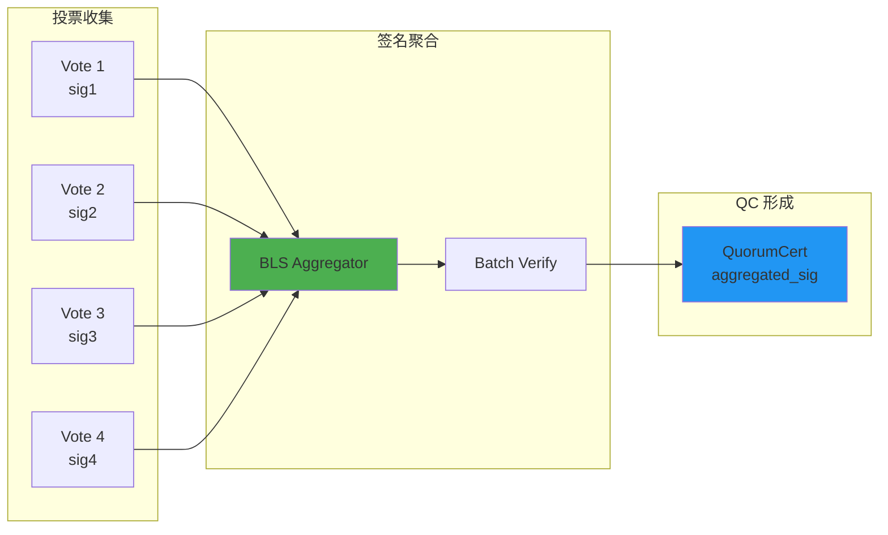
```mermaid
flowchart LR
    subgraph "投票收集"
        V1[Vote 1<br/>sig1]
        V2[Vote 2<br/>sig2]
        V3[Vote 3<br/>sig3]
        V4[Vote 4<br/>sig4]
    end

    subgraph "签名聚合"
        AGG[BLS Aggregator]
        VERIFY[Batch Verify]
    end

    subgraph "QC 形成"
        QC[QuorumCert<br/>aggregated_sig]
    end

    V1 --> AGG
    V2 --> AGG
    V3 --> AGG
    V4 --> AGG

    AGG --> VERIFY
    VERIFY --> QC

    style AGG fill:#4caf50
    style QC fill:#2196f3
```

**BLS 聚合代码**:

```rust
// BLS12-381 签名聚合
fn aggregate_signatures(votes: &[Vote]) -> AggregateSignature {
    let signatures: Vec<Signature> = votes
        .iter()
        .map(|vote| vote.signature().clone())
        .collect();

    // BLS 聚合: 只需简单相加
    let mut aggregated = signatures[0].clone();
    for sig in &signatures[1..] {
        aggregated = aggregated.add(sig);
    }

    AggregateSignature::new(aggregated)
}

// 验证聚合签名
fn verify_aggregated_signature(
    &self,
    message: &[u8],
    aggregated_sig: &AggregateSignature,
) -> Result<()> {
    // 聚合公钥
    let public_keys: Vec<PublicKey> = self.validators
        .iter()
        .map(|v| v.public_key())
        .collect();

    let aggregated_pubkey = PublicKey::aggregate(&public_keys);

    // 验证
    aggregated_sig.verify(message, &aggregated_pubkey)
}
```

**性能优化**:

| 操作 | 普通签名 | BLS 聚合签名 | 优势 |
|------|---------|-------------|------|
| 签名大小 | 96B × N | 96B | 节省 N-1 倍空间 |
| 验证时间 | O(N) | O(1) | 加速 N 倍 |
| 聚合时间 | - | O(N) | 可并行 |
| 网络传输 | 大 | 小 | 减少带宽 |

---

## 4. Pipeline 执行流程

### 4.1 ExecutionSchedule 阶段

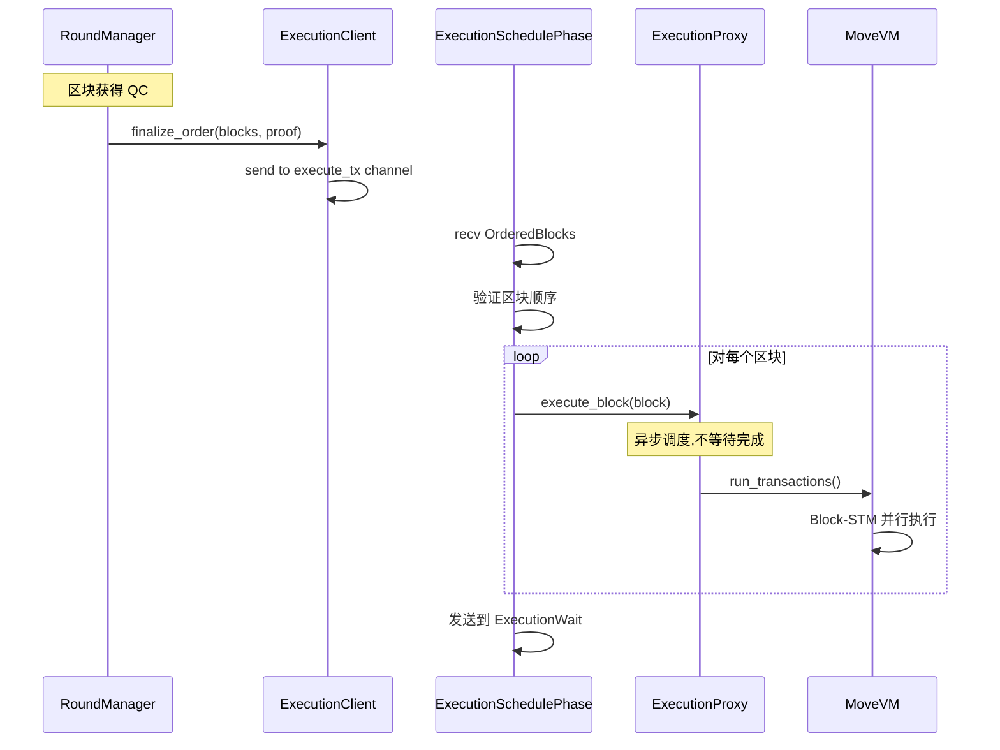
```mermaid
sequenceDiagram
    participant RM as RoundManager
    participant EC as ExecutionClient
    participant ESP as ExecutionSchedulePhase
    participant EX as ExecutionProxy
    participant VM as MoveVM

    Note over RM: 区块获得 QC

    RM->>EC: finalize_order(blocks, proof)
    EC->>EC: send to execute_tx channel

    ESP->>ESP: recv OrderedBlocks
    ESP->>ESP: 验证区块顺序

    loop 对每个区块
        ESP->>EX: execute_block(block)
        Note over EX: 异步调度,不等待完成
        EX->>VM: run_transactions()
        VM->>VM: Block-STM 并行执行
    end

    ESP->>ESP: 发送到 ExecutionWait
```

**调度策略**:

```rust
// 源码: consensus/src/pipeline/execution_schedule_phase.rs
pub struct ExecutionSchedulePhase {
    execution_proxy: Arc<ExecutionProxy>,
    ordered_blocks_rx: UnboundedReceiver<OrderedBlocks>,
    executed_blocks_tx: UnboundedSender<ExecutedBlocks>,
}

impl ExecutionSchedulePhase {
    pub async fn start(mut self) {
        while let Some(ordered_blocks) = self.ordered_blocks_rx.recv().await {
            for block in ordered_blocks.ordered_blocks {
                // 1. 记录插入时间
                block.set_insertion_time();

                // 2. 异步调度执行 (不等待完成)
                let execution_fut = self.execution_proxy
                    .execute_block(
                        block.clone(),
                        block.parent_id(),
                        block.block().timestamp_usecs(),
                    );

                // 3. 立即发送到下一阶段
                self.executed_blocks_tx.send(ExecutedBlocks {
                    block,
                    execution_future: execution_fut,
                }).await;
            }
        }
    }
}
```

**并行度控制**:

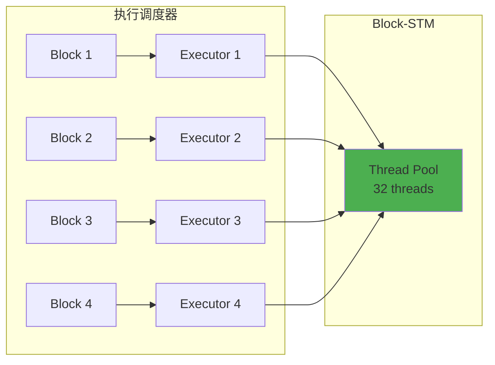
```mermaid
graph LR
    subgraph "执行调度器"
        S1[Block 1] --> E1[Executor 1]
        S2[Block 2] --> E2[Executor 2]
        S3[Block 3] --> E3[Executor 3]
        S4[Block 4] --> E4[Executor 4]
    end

    subgraph "Block-STM"
        E1 --> T1[Thread Pool<br/>32 threads]
        E2 --> T1
        E3 --> T1
        E4 --> T1
    end

    style T1 fill:#4caf50
```

### 4.2 ExecutionWait 阶段

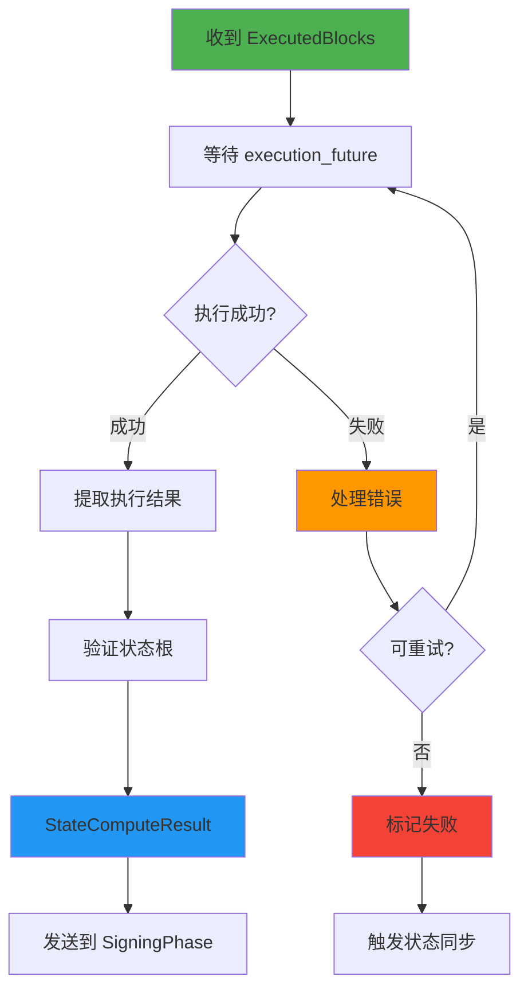
```mermaid
flowchart TD
    START[收到 ExecutedBlocks] --> WAIT[等待 execution_future]
    WAIT --> CHECK{执行成功?}

    CHECK -->|成功| EXTRACT[提取执行结果]
    CHECK -->|失败| ERROR[处理错误]

    EXTRACT --> VERIFY[验证状态根]
    VERIFY --> RESULT[StateComputeResult]

    ERROR --> RETRY{可重试?}
    RETRY -->|是| WAIT
    RETRY -->|否| FAIL[标记失败]

    RESULT --> NEXT[发送到 SigningPhase]
    FAIL --> SYNC[触发状态同步]

    style START fill:#4caf50
    style RESULT fill:#2196f3
    style ERROR fill:#ff9800
    style FAIL fill:#f44336
```

**等待与验证代码**:

```rust
// 源码: consensus/src/pipeline/execution_wait_phase.rs
pub struct ExecutionWaitPhase {
    executed_blocks_rx: UnboundedReceiver<ExecutedBlocks>,
    signing_phase_tx: UnboundedSender<ExecutedBlocks>,
}

impl ExecutionWaitPhase {
    pub async fn start(mut self) {
        while let Some(executed_blocks) = self.executed_blocks_rx.recv().await {
            // 1. 等待执行完成
            let compute_result = match executed_blocks.execution_future.await {
                Ok(result) => result,
                Err(e) => {
                    error!("Execution failed: {:?}", e);
                    // 触发状态同步
                    self.trigger_state_sync().await;
                    continue;
                }
            };

            // 2. 验证执行结果
            if let Err(e) = self.verify_execution_result(&compute_result) {
                error!("Invalid execution result: {:?}", e);
                continue;
            }

            // 3. 发送到签名阶段
            self.signing_phase_tx.send(ExecutedBlocks {
                block: executed_blocks.block,
                compute_result,
            }).await;
        }
    }

    fn verify_execution_result(&self, result: &StateComputeResult) -> Result<()> {
        // 验证状态根哈希
        ensure!(
            result.root_hash() != HashValue::zero(),
            "Invalid root hash"
        );

        // 验证 Gas 使用
        ensure!(
            result.gas_used() <= result.max_gas_amount(),
            "Gas exceeded"
        );

        Ok(())
    }
}
```

### 4.3 Signing 阶段

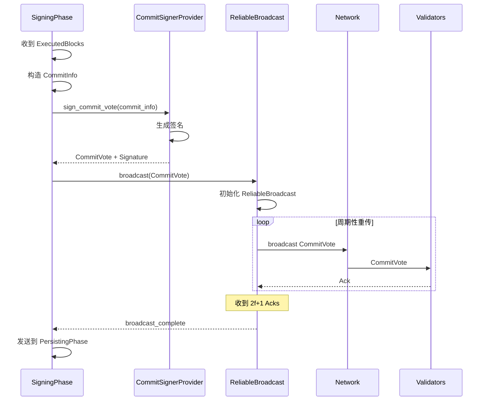
```mermaid
sequenceDiagram
    participant SP as SigningPhase
    participant CSP as CommitSignerProvider
    participant RB as ReliableBroadcast
    participant NET as Network
    participant V as Validators

    SP->>SP: 收到 ExecutedBlocks
    SP->>SP: 构造 CommitInfo

    SP->>CSP: sign_commit_vote(commit_info)
    CSP->>CSP: 生成签名
    CSP-->>SP: CommitVote + Signature

    SP->>RB: broadcast(CommitVote)
    RB->>RB: 初始化 ReliableBroadcast

    loop 周期性重传
        RB->>NET: broadcast CommitVote
        NET->>V: CommitVote
        V-->>RB: Ack
    end

    Note over RB: 收到 2f+1 Acks

    RB-->>SP: broadcast_complete
    SP->>SP: 发送到 PersistingPhase
```

**CommitVote 生成**:

```rust
// 源码: consensus/src/pipeline/signing_phase.rs
pub struct SigningPhase {
    executed_blocks_rx: UnboundedReceiver<ExecutedBlocks>,
    commit_signer_provider: Arc<dyn CommitSignerProvider>,
    network_sender: Arc<NetworkSender>,
    aggregated_blocks_tx: UnboundedSender<AggregatedBlocks>,
}

impl SigningPhase {
    pub async fn start(mut self) {
        while let Some(executed_blocks) = self.executed_blocks_rx.recv().await {
            // 1. 创建 CommitInfo
            let commit_info = CommitInfo::new(
                executed_blocks.block.epoch(),
                executed_blocks.block.round(),
                executed_blocks.block.id(),
                executed_blocks.compute_result.root_hash(),
                executed_blocks.compute_result.version(),
                executed_blocks.block.timestamp_usecs(),
            );

            // 2. 签名
            let commit_vote = self.commit_signer_provider
                .sign_commit_vote(commit_info)
                .await?;

            // 3. 可靠广播
            let rb_handle = self.reliable_broadcast
                .broadcast(commit_vote.clone())
                .await;

            // 4. 等待 2f+1 响应
            let aggregated_votes = rb_handle.wait_for_quorum().await?;

            // 5. 形成 CommitDecision
            let ledger_info_with_sigs = LedgerInfoWithSignatures::new(
                commit_info.into_ledger_info(),
                aggregated_votes,
            );

            // 6. 发送到持久化阶段
            self.aggregated_blocks_tx.send(AggregatedBlocks {
                block: executed_blocks.block,
                ledger_info_with_sigs,
            }).await;
        }
    }
}
```

### 4.4 Persisting 阶段

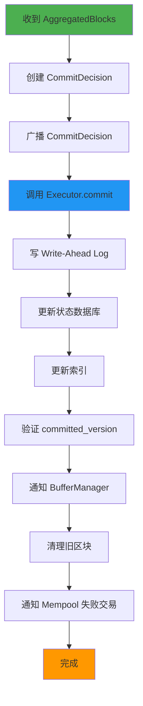
```mermaid
flowchart TD
    START[收到 AggregatedBlocks] --> CREATE[创建 CommitDecision]
    CREATE --> BROADCAST[广播 CommitDecision]
    BROADCAST --> COMMIT[调用 Executor.commit]

    COMMIT --> WAL[写 Write-Ahead Log]
    WAL --> STATE[更新状态数据库]
    STATE --> INDEX[更新索引]
    INDEX --> VERIFY[验证 committed_version]

    VERIFY --> NOTIFY[通知 BufferManager]
    NOTIFY --> PRUNE[清理旧区块]
    PRUNE --> MEMPOOL[通知 Mempool 失败交易]
    MEMPOOL --> DONE[完成]

    style START fill:#4caf50
    style COMMIT fill:#2196f3
    style DONE fill:#ff9800
```

**持久化代码**:

```rust
// 源码: consensus/src/pipeline/persisting_phase.rs
pub struct PersistingPhase {
    aggregated_blocks_rx: UnboundedReceiver<AggregatedBlocks>,
    execution_proxy: Arc<ExecutionProxy>,
    storage: Arc<dyn PersistentLivenessStorage>,
    mempool_notifier: Arc<dyn TxnNotifier>,
}

impl PersistingPhase {
    pub async fn start(mut self) {
        while let Some(aggregated_blocks) = self.aggregated_blocks_rx.recv().await {
            // 1. 创建 CommitDecision
            let commit_decision = CommitDecision::new(
                aggregated_blocks.ledger_info_with_sigs.clone(),
            );

            // 2. 广播 CommitDecision
            self.network_sender
                .broadcast_commit_decision(commit_decision)
                .await;

            // 3. 持久化
            let committed_version = self.execution_proxy
                .commit(
                    vec![aggregated_blocks.block.clone()],
                    aggregated_blocks.ledger_info_with_sigs.clone(),
                )
                .await?;

            info!(
                "Block {} committed at version {}",
                aggregated_blocks.block.id(),
                committed_version
            );

            // 4. 清理旧区块
            let blocks_to_prune = self.compute_blocks_to_prune(
                aggregated_blocks.block.round(),
            );
            self.storage.prune_tree(blocks_to_prune)?;

            // 5. 通知 Mempool 失败交易
            let failed_txns = aggregated_blocks.block.compute_result()
                .failed_transactions();
            self.mempool_notifier
                .notify_failed_txn(&failed_txns)
                .await?;
        }
    }
}
```

---

## 5. 区块提交流程

### 5.1 CommitVote 生成

**CommitVote 结构**:

```rust
// 源码: consensus/consensus-types/src/pipeline/commit_vote.rs
pub struct CommitVote {
    author: Author,
    ledger_info: LedgerInfo,
    signature: Signature,
}

pub struct CommitInfo {
    epoch: u64,
    round: Round,
    id: HashValue,
    executed_state_id: HashValue,  // 执行后状态根
    version: Version,
    timestamp_usecs: u64,
}

impl CommitInfo {
    pub fn into_ledger_info(self) -> LedgerInfo {
        LedgerInfo::new(
            BlockInfo::new(
                self.epoch,
                self.round,
                self.id,
                self.executed_state_id,
                self.version,
                self.timestamp_usecs,
                None,
            ),
            HashValue::zero(),
        )
    }
}
```

**生成流程**:

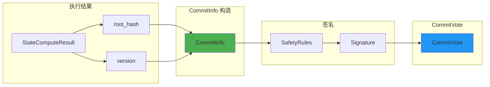
```mermaid
flowchart LR
    subgraph "执行结果"
        ER[StateComputeResult]
        ROOT[root_hash]
        VER[version]
    end

    subgraph "CommitInfo 构造"
        CI[CommitInfo]
    end

    subgraph "签名"
        SR[SafetyRules]
        SIG[Signature]
    end

    subgraph "CommitVote"
        CV[CommitVote]
    end

    ER --> ROOT
    ER --> VER
    ROOT --> CI
    VER --> CI

    CI --> SR
    SR --> SIG
    SIG --> CV

    style CI fill:#4caf50
    style CV fill:#2196f3
```

### 5.2 可靠广播机制

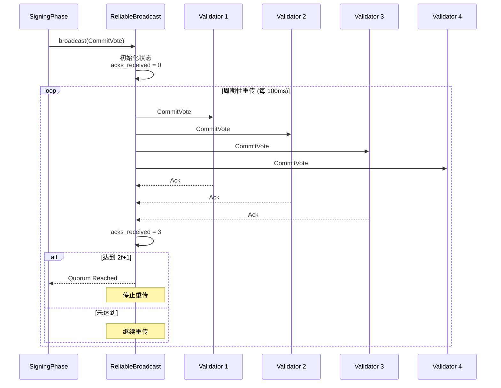
```mermaid
sequenceDiagram
    participant SP as SigningPhase
    participant RB as ReliableBroadcast
    participant V1 as Validator 1
    participant V2 as Validator 2
    participant V3 as Validator 3
    participant V4 as Validator 4

    SP->>RB: broadcast(CommitVote)
    RB->>RB: 初始化状态<br/>acks_received = 0

    loop 周期性重传 (每 100ms)
        RB->>V1: CommitVote
        RB->>V2: CommitVote
        RB->>V3: CommitVote
        RB->>V4: CommitVote

        V1-->>RB: Ack
        V2-->>RB: Ack
        V3-->>RB: Ack

        RB->>RB: acks_received = 3

        alt 达到 2f+1
            RB-->>SP: Quorum Reached
            Note over RB: 停止重传
        else 未达到
            Note over RB: 继续重传
        end
    end
```

**ReliableBroadcast 实现**:

```rust
// 源码: aptos-reliable-broadcast/src/lib.rs
pub struct ReliableBroadcast<T> {
    message: T,
    acks: HashSet<Author>,
    quorum_size: usize,
    network_sender: Arc<dyn RBNetworkSender<T, Ack>>,
    retry_interval: Duration,
    timeout: Duration,
}

impl<T: Clone> ReliableBroadcast<T> {
    pub async fn broadcast(
        message: T,
        recipients: Vec<Author>,
        quorum_size: usize,
        network_sender: Arc<dyn RBNetworkSender<T, Ack>>,
    ) -> RBHandle {
        let (tx, rx) = oneshot::channel();

        tokio::spawn(async move {
            let mut rb = ReliableBroadcast {
                message,
                acks: HashSet::new(),
                quorum_size,
                network_sender,
                retry_interval: Duration::from_millis(100),
                timeout: Duration::from_secs(30),
            };

            let result = rb.run(recipients).await;
            tx.send(result);
        });

        RBHandle { rx }
    }

    async fn run(&mut self, recipients: Vec<Author>) -> Result<Vec<Ack>> {
        let deadline = Instant::now() + self.timeout;

        loop {
            // 1. 广播消息
            for recipient in &recipients {
                if !self.acks.contains(recipient) {
                    let _ = self.network_sender
                        .send_to(*recipient, self.message.clone())
                        .await;
                }
            }

            // 2. 收集 Acks
            let ack_timeout = min(self.retry_interval, deadline - Instant::now());
            match timeout(ack_timeout, self.recv_ack()).await {
                Ok(Some((author, ack))) => {
                    self.acks.insert(author);

                    // 3. 检查是否达到仲裁
                    if self.acks.len() >= self.quorum_size {
                        return Ok(self.collect_acks());
                    }
                },
                _ => {},
            }

            // 4. 检查超时
            if Instant::now() >= deadline {
                return Err(anyhow!("Reliable broadcast timeout"));
            }
        }
    }
}
```

### 5.3 CommitDecision 形成

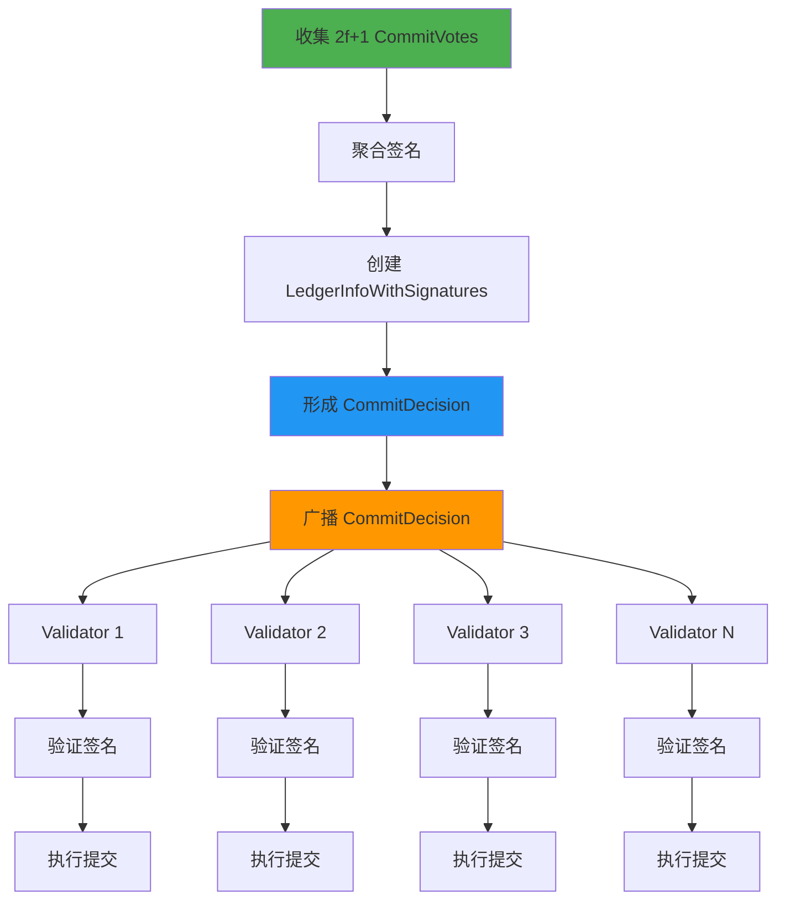
```mermaid
flowchart TD
    START[收集 2f+1 CommitVotes] --> AGG[聚合签名]
    AGG --> CREATE[创建 LedgerInfoWithSignatures]
    CREATE --> CD[形成 CommitDecision]

    CD --> BROADCAST[广播 CommitDecision]
    BROADCAST --> V1[Validator 1]
    BROADCAST --> V2[Validator 2]
    BROADCAST --> V3[Validator 3]
    BROADCAST --> V4[Validator N]

    V1 --> VERIFY1[验证签名]
    V2 --> VERIFY2[验证签名]
    V3 --> VERIFY3[验证签名]
    V4 --> VERIFY4[验证签名]

    VERIFY1 --> COMMIT1[执行提交]
    VERIFY2 --> COMMIT2[执行提交]
    VERIFY3 --> COMMIT3[执行提交]
    VERIFY4 --> COMMIT4[执行提交]

    style START fill:#4caf50
    style CD fill:#2196f3
    style BROADCAST fill:#ff9800
```

**CommitDecision 处理**:

```rust
// 源码: consensus/src/pipeline/buffer_manager.rs
async fn process_commit_decision(&mut self, commit_decision: CommitDecision) {
    // 1. 验证签名
    if let Err(e) = commit_decision.ledger_info()
        .verify_signatures(&self.validators)
    {
        warn!("Invalid CommitDecision signature: {:?}", e);
        return;
    }

    // 2. 检查是否已提交
    if commit_decision.commit_info().round() <= self.highest_committed_round() {
        return; // 已经提交过了
    }

    // 3. 执行提交
    let committed_version = self.execution_proxy
        .commit(
            self.get_blocks_to_commit(commit_decision.commit_info().round()),
            commit_decision.ledger_info().clone(),
        )
        .await?;

    info!(
        "Committed up to round {} at version {}",
        commit_decision.commit_info().round(),
        committed_version
    );

    // 4. 更新状态
    self.update_highest_committed_round(commit_decision.commit_info().round());

    // 5. 清理缓冲区
    self.prune_committed_blocks();
}
```

---

## 6. DAG 排序流程

### 6.1 Node 生成与签名

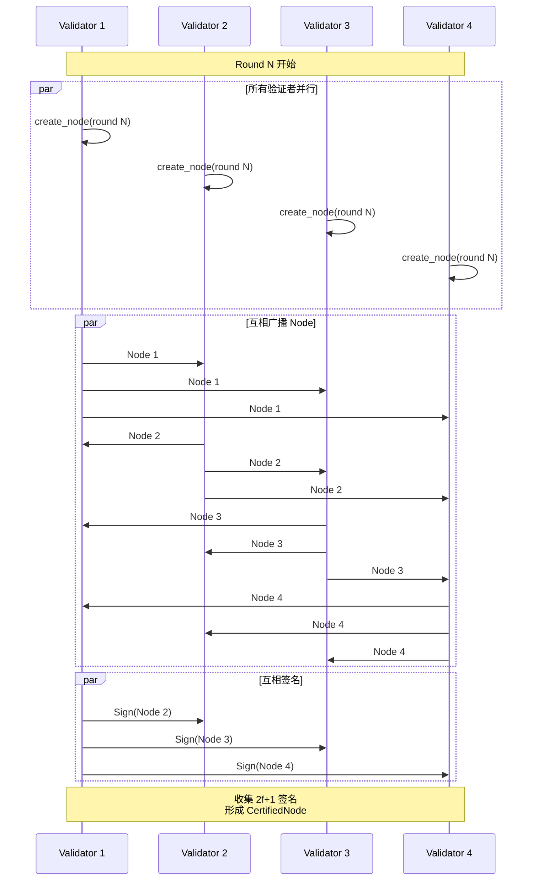
```mermaid
sequenceDiagram
    participant V1 as Validator 1
    participant V2 as Validator 2
    participant V3 as Validator 3
    participant V4 as Validator 4

    Note over V1,V4: Round N 开始

    par 所有验证者并行
        V1->>V1: create_node(round N)
        V2->>V2: create_node(round N)
        V3->>V3: create_node(round N)
        V4->>V4: create_node(round N)
    end

    par 互相广播 Node
        V1->>V2: Node 1
        V1->>V3: Node 1
        V1->>V4: Node 1

        V2->>V1: Node 2
        V2->>V3: Node 2
        V2->>V4: Node 2

        V3->>V1: Node 3
        V3->>V2: Node 3
        V3->>V4: Node 3

        V4->>V1: Node 4
        V4->>V2: Node 4
        V4->>V3: Node 4
    end

    par 互相签名
        V1->>V2: Sign(Node 2)
        V1->>V3: Sign(Node 3)
        V1->>V4: Sign(Node 4)
    end

    Note over V1,V4: 收集 2f+1 签名<br/>形成 CertifiedNode
```

**DAG Node 结构**:

```rust
// 源码: consensus/src/dag/types.rs
pub struct Node {
    epoch: u64,
    round: Round,
    author: Author,
    timestamp: u64,
    payload: Payload,
    parents: Vec<CertificateDigest>,  // 指向上一轮的 Nodes
    signature: Signature,
}

pub struct Certificate {
    node: Node,
    signatures: BTreeMap<Author, Signature>,  // 2f+1 签名
}

impl Node {
    pub fn new(
        epoch: u64,
        round: Round,
        author: Author,
        timestamp: u64,
        payload: Payload,
        parents: Vec<CertificateDigest>,
        signer: &ValidatorSigner,
    ) -> Self {
        let mut node = Node {
            epoch,
            round,
            author,
            timestamp,
            payload,
            parents,
            signature: Signature::dummy(),
        };

        node.signature = signer.sign(&node.digest());
        node
    }

    pub fn digest(&self) -> HashValue {
        let mut hasher = Sha3_256::new();
        hasher.update(&bcs::to_bytes(self).unwrap());
        HashValue::from_slice(hasher.finalize())
    }
}
```

### 6.2 Anchor 投票

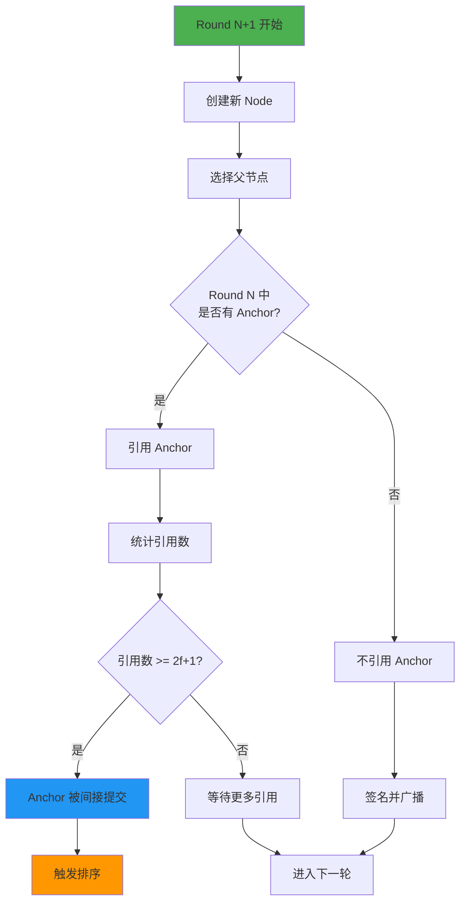
```mermaid
flowchart TD
    START[Round N+1 开始] --> CREATE[创建新 Node]
    CREATE --> PARENTS[选择父节点]

    PARENTS --> CHECK{Round N 中<br/>是否有 Anchor?}
    CHECK -->|是| REF[引用 Anchor]
    CHECK -->|否| NOREF[不引用 Anchor]

    REF --> COUNT[统计引用数]
    NOREF --> SIGN[签名并广播]

    COUNT --> QUORUM{引用数 >= 2f+1?}
    QUORUM -->|是| COMMIT[Anchor 被间接提交]
    QUORUM -->|否| WAIT[等待更多引用]

    COMMIT --> ORDER[触发排序]
    SIGN --> NEXT[进入下一轮]
    WAIT --> NEXT

    style START fill:#4caf50
    style COMMIT fill:#2196f3
    style ORDER fill:#ff9800
```

**Anchor 选择规则**:

```rust
// 源码: consensus/src/dag/anchor_election.rs
pub trait AnchorElection {
    fn get_anchor(&self, round: Round) -> Option<Author>;
}

pub struct RoundRobinAnchorElection {
    validators: Vec<Author>,
}

impl AnchorElection for RoundRobinAnchorElection {
    fn get_anchor(&self, round: Round) -> Option<Author> {
        // 轮流选择 Anchor
        let index = (round as usize) % self.validators.len();
        Some(self.validators[index])
    }
}

pub struct ReputationAnchorElection {
    reputation_scores: HashMap<Author, u64>,
    validators: Vec<Author>,
}

impl AnchorElection for ReputationAnchorElection {
    fn get_anchor(&self, round: Round) -> Option<Author> {
        // 基于声誉分数加权选择
        let total_score: u64 = self.reputation_scores.values().sum();
        let threshold = (round as u64 * 1000) % total_score;

        let mut cumulative = 0;
        for validator in &self.validators {
            cumulative += self.reputation_scores[validator];
            if cumulative >= threshold {
                return Some(*validator);
            }
        }

        None
    }
}
```

### 6.3 拓扑排序

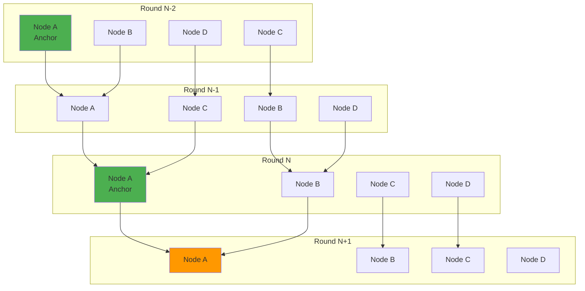
```mermaid
graph TB
    subgraph "Round N-2"
        A1[Node A<br/>Anchor]
        B1[Node B]
        C1[Node C]
        D1[Node D]
    end

    subgraph "Round N-1"
        A2[Node A]
        B2[Node B]
        C2[Node C]
        D2[Node D]
    end

    subgraph "Round N"
        A3[Node A<br/>Anchor]
        B3[Node B]
        C3[Node C]
        D3[Node D]
    end

    subgraph "Round N+1"
        A4[Node A]
        B4[Node B]
        C4[Node C]
        D4[Node D]
    end

    A1 --> A2
    B1 --> A2
    C1 --> B2
    D1 --> C2

    A2 --> A3
    B2 --> B3
    C2 --> A3
    D2 --> B3

    A3 --> A4
    B3 --> A4
    C3 --> B4
    D3 --> C4

    style A1 fill:#4caf50
    style A3 fill:#4caf50
    style A4 fill:#ff9800
```

**排序算法**:

```rust
// 源码: consensus/src/dag/order_rule.rs
pub fn order_dag(anchor: &Certificate, dag: &Dag) -> Vec<Certificate> {
    let mut ordered = Vec::new();
    let mut visited = HashSet::new();

    // 1. 递归查找所有可达的已提交 Anchor
    let committed_anchors = find_committed_anchors(anchor, dag);

    // 2. 从最早的 Anchor 开始排序
    for committed_anchor in committed_anchors.iter().rev() {
        // 3. 拓扑排序该 Anchor 和上一个 Anchor 之间的所有节点
        let nodes_between = find_nodes_between(
            committed_anchor,
            &ordered.last(),
            dag,
        );

        // 4. 排序规则: 轮次递增, 同轮次按 Author 字典序
        let mut sorted_nodes = topological_sort(nodes_between, dag);
        sorted_nodes.sort_by_key(|node| (node.round(), node.author()));

        // 5. 添加到最终结果
        for node in sorted_nodes {
            if !visited.contains(&node.digest()) {
                ordered.push(node);
                visited.insert(node.digest());
            }
        }
    }

    ordered
}

fn topological_sort(nodes: Vec<Certificate>, dag: &Dag) -> Vec<Certificate> {
    let mut sorted = Vec::new();
    let mut in_degree = HashMap::new();
    let mut queue = VecDeque::new();

    // 1. 计算入度
    for node in &nodes {
        in_degree.insert(node.digest(), node.parents().len());
        if node.parents().is_empty() {
            queue.push_back(node.clone());
        }
    }

    // 2. BFS 拓扑排序
    while let Some(node) = queue.pop_front() {
        sorted.push(node.clone());

        // 3. 更新子节点入度
        for child in dag.get_children(&node.digest()) {
            let degree = in_degree.get_mut(&child.digest()).unwrap();
            *degree -= 1;
            if *degree == 0 {
                queue.push_back(child);
            }
        }
    }

    sorted
}
```

---

## 7. QuorumStore 批次流程

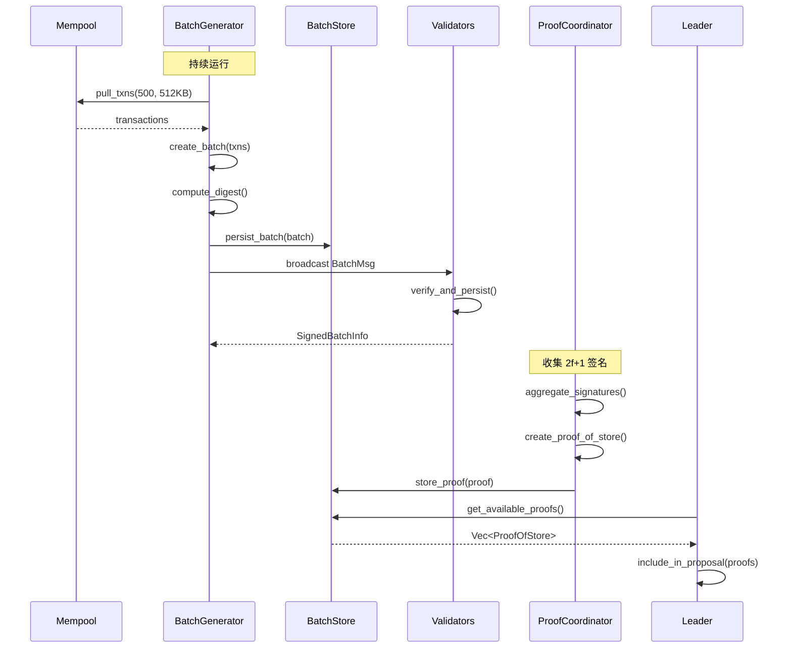
```mermaid
sequenceDiagram
    participant MP as Mempool
    participant BG as BatchGenerator
    participant BS as BatchStore
    participant V as Validators
    participant PC as ProofCoordinator
    participant L as Leader

    Note over BG: 持续运行

    BG->>MP: pull_txns(500, 512KB)
    MP-->>BG: transactions

    BG->>BG: create_batch(txns)
    BG->>BG: compute_digest()
    BG->>BS: persist_batch(batch)

    BG->>V: broadcast BatchMsg
    V->>V: verify_and_persist()
    V-->>BG: SignedBatchInfo

    Note over PC: 收集 2f+1 签名

    PC->>PC: aggregate_signatures()
    PC->>PC: create_proof_of_store()
    PC->>BS: store_proof(proof)

    L->>BS: get_available_proofs()
    BS-->>L: Vec<ProofOfStore>

    L->>L: include_in_proposal(proofs)
```

**批次生命周期状态图**:

```mermaid
stateDiagram-v2
    [*] --> Created: pull from mempool
    Created --> Persisted: save to disk
    Persisted --> Broadcasted: broadcast to validators
    Broadcasted --> Signed: collect 2f+1 signatures
    Signed --> Certified: form ProofOfStore
    Certified --> InProposal: included in block
    InProposal --> Committed: block committed
    Committed --> [*]

    Broadcasted --> Expired: timeout (10s)
    Expired --> [*]
```

**完整实现参考**: 已在第7部分详细介绍

---

## 8. 状态同步流程

```mermaid
flowchart TD
    START[检测到落后] --> CHECK{落后轮次}

    CHECK -->|< 10 轮| FAST[快速同步<br/>BlockRetrieval]
    CHECK -->|>= 10 轮| FULL[完整同步<br/>StateSync]

    FAST --> REQ[请求缺失区块]
    REQ --> VERIFY[验证 QC 链]
    VERIFY --> EXEC[执行区块]
    EXEC --> CATCH[追上最新轮次]
    CATCH --> RESUME[恢复共识]

    FULL --> TARGET[获取目标 LedgerInfo]
    TARGET --> CHUNK[分块下载状态]
    CHUNK --> APPLY[应用状态快照]
    APPLY --> RESET[重置 Pipeline]
    RESET --> RESUME

    style START fill:#ff9800
    style RESUME fill:#4caf50
    style FAST fill:#2196f3
    style FULL fill:#9c27b0
```

**BlockRetrieval 实现**:

```rust
// 源码: consensus/src/block_storage/sync_manager.rs
pub async fn sync_to_target(&mut self, target_li: LedgerInfoWithSignatures) -> Result<()> {
    let target_round = target_li.commit_info().round();
    let current_round = self.block_store.highest_certified_round();

    info!(
        "Syncing from round {} to round {}",
        current_round, target_round
    );

    // 1. 请求缺失的区块
    let mut current = target_round;
    while current > current_round {
        let request = BlockRetrievalRequest::new(
            current,
            10,  // 每次请求 10 个区块
        );

        // 2. 从多个节点尝试
        let response = self.fetch_blocks_with_fallback(request).await?;

        // 3. 验证并插入区块
        for block in response.blocks() {
            self.block_store.verify_and_insert_block(block)?;
        }

        current = response.blocks().last().unwrap().round();
    }

    // 4. 执行所有区块
    self.execute_pending_blocks().await?;

    Ok(())
}

async fn fetch_blocks_with_fallback(
    &self,
    request: BlockRetrievalRequest,
) -> Result<BlockRetrievalResponse> {
    let mut candidates = self.get_sync_candidates();

    for peer in candidates {
        match self.network_sender
            .request_block(request.clone(), peer, Duration::from_secs(5))
            .await
        {
            Ok(response) => return Ok(response),
            Err(e) => {
                warn!("Failed to sync from {}: {:?}", peer, e);
                continue;
            }
        }
    }

    Err(anyhow!("Failed to sync from all peers"))
}
```

---

## 9. 纪元变更流程

```mermaid
sequenceDiagram
    participant RM as RoundManager
    participant SR as SafetyRules
    participant EC as ExecutionClient
    participant ST as Storage
    participant EM as EpochManager

    Note over RM: 检测到 EpochChangeProof

    RM->>SR: end_epoch()
    SR->>SR: 保存最后状态
    SR-->>RM: epoch_ended

    RM->>EC: end_epoch()
    EC->>EC: stop all pipelines
    EC-->>RM: pipelines_stopped

    RM->>ST: retrieve_epoch_change_proof()
    ST-->>RM: EpochChangeProof

    RM->>EM: start_new_epoch(proof)
    EM->>EM: 验证新纪元配置
    EM->>EM: 初始化新验证者集合

    EM->>SR: start_epoch(new_epoch_state)
    EM->>EC: start_epoch(new_epoch_state)
    EM->>RM: start_epoch(new_epoch_state)

    Note over RM: 新纪元开始 Round 1
```

**纪元变更代码**:

```rust
// 源码: consensus/src/epoch_manager/epoch_manager.rs
pub async fn start_new_epoch(&mut self, proof: EpochChangeProof) -> Result<()> {
    let new_epoch = proof.epoch();
    info!("Starting new epoch {}", new_epoch);

    // 1. 验证 EpochChangeProof
    proof.verify(&self.validators)?;

    // 2. 提取新纪元配置
    let new_epoch_state = proof.epoch_state();
    let new_validators = new_epoch_state.verifier.clone();

    // 3. 结束旧纪元
    self.end_current_epoch().await?;

    // 4. 初始化新纪元组件
    let (consensus_key, commit_signer_provider) = self.initialize_safety_rules(
        new_epoch_state.clone()
    )?;

    let payload_manager = self.create_payload_manager(new_epoch_state.clone())?;

    // 5. 启动执行客户端
    self.execution_client.start_epoch(
        consensus_key,
        new_epoch_state.clone(),
        commit_signer_provider.clone(),
        payload_manager.clone(),
        &self.onchain_consensus_config,
        &self.onchain_execution_config,
        &self.onchain_randomness_config,
        self.rand_config.clone(),
        self.fast_rand_config.clone(),
        self.rand_msg_rx.clone(),
        0,  // highest_committed_round
    ).await;

    // 6. 创建并启动 RoundManager
    let round_manager = RoundManager::new(
        new_epoch_state,
        self.storage.clone(),
        self.network_sender.clone(),
        commit_signer_provider,
        payload_manager,
        self.execution_client.clone(),
    );

    self.current_round_manager = Some(round_manager);

    info!("New epoch {} started successfully", new_epoch);
    Ok(())
}
```

---

## 10. 完整共识轮次流程

**端到端流程图**:

```mermaid
sequenceDiagram
    participant MP as Mempool
    participant QS as QuorumStore
    participant L as Leader
    participant SR as SafetyRules
    participant NET as Network
    participant V as Validators
    participant BM as BufferManager
    participant EX as Executor
    participant ST as Storage

    Note over L: Round N 开始

    rect rgb(200, 255, 200)
    Note over L,QS: 阶段 1: 提议创建 (50-100ms)
    L->>QS: pull_payload()
    QS->>MP: get_batch()
    MP-->>QS: txns
    QS-->>L: proofs + txns
    L->>SR: sign_proposal()
    SR-->>L: signature
    end

    rect rgb(200, 230, 255)
    Note over L,NET: 阶段 2: 提议广播 (50-100ms)
    L->>NET: broadcast_proposal()
    NET->>V: ProposalMsg
    L->>ST: save_tree(block, qc)
    end

    rect rgb(255, 230, 200)
    Note over V,NET: 阶段 3: 投票收集 (100-200ms)
    V->>V: verify & execute
    V->>SR: sign_vote()
    SR-->>V: signature
    V->>NET: send_vote(next_leaders)
    NET->>L: collect votes
    L->>L: form QC (2f+1)
    end

    rect rgb(230, 200, 255)
    Note over L,EX: 阶段 4: Pipeline 执行 (200-500ms)
    L->>BM: finalize_order(blocks, qc)
    BM->>EX: execute_block()
    EX-->>BM: compute_result
    BM->>SR: sign_commit_vote()
    BM->>NET: broadcast_commit_vote()
    end

    rect rgb(255, 255, 200)
    Note over BM,ST: 阶段 5: 区块提交 (100-300ms)
    Note over BM: 收集 2f+1 CommitVotes
    BM->>EX: commit()
    EX->>ST: save_transactions()
    ST-->>EX: committed_version
    BM->>MP: notify_failed_txn()
    BM->>ST: prune_tree()
    end

    Note over L: Round N+1 开始
```

**性能分析**:

| 阶段 | 操作 | 预期延迟 | 瓶颈 | 优化方法 |
|------|------|---------|------|---------|
| 1. 提议创建 | Payload 拉取 + 签名 | 50-100ms | Mempool 锁 | 预取、缓存 |
| 2. 提议广播 | 网络传输 + 压缩 | 50-100ms | 网络延迟 | 延迟排序、并行发送 |
| 3. 投票收集 | 验证 + 签名 + 传输 | 100-200ms | 网络延迟 | BLS 聚合 |
| 4. Pipeline 执行 | 交易执行 | 200-500ms | CPU | Block-STM 并行 |
| 5. 区块提交 | 持久化 | 100-300ms | I/O | 批量写入、WAL |
| **总计** | **完整轮次** | **500-1500ms** | - | **流水线并行** |

---

## 附录

### A. 流程图符号说明

| 符号 | 含义 | 示例 |
|------|------|------|
| 矩形 | 处理步骤 | `创建区块` |
| 菱形 | 判断条件 | `验证签名?` |
| 圆角矩形 | 开始/结束 | `[*]`, `完成` |
| 箭头 | 数据流向 | `A → B` |
| 虚线 | 异步调用 | `A -.-> B` |
| 并行框 | 并行操作 | `par ... end` |

### B. 性能基准

| 流程 | TPS | 延迟 (p50) | 延迟 (p99) |
|------|-----|-----------|-----------|
| 完整轮次 | 10000 | 800ms | 1500ms |
| 提议广播 | - | 80ms | 150ms |
| 投票聚合 | - | 150ms | 300ms |
| Pipeline 执行 | - | 300ms | 600ms |
| 区块提交 | - | 200ms | 400ms |

### C. 相关源码文件

- `consensus/src/round_manager.rs` - 轮次管理主流程
- `consensus/src/liveness/proposal_generator.rs` - 提议生成
- `consensus/src/pending_votes.rs` - 投票聚合
- `consensus/src/pipeline/` - Pipeline 各阶段
- `consensus/src/dag/order_rule.rs` - DAG 排序
- `consensus/src/block_storage/sync_manager.rs` - 状态同步

---

**文档维护**:
- 版本: v1.0
- 最后更新: 2025-10-09
- 维护者: Aptos Consensus Team
