# Aptos Consensus 模块深度技术文档（详细增强版 - Part 2）

## SafetyRules 模块深度解析

> **模块路径**: `safety-rules/src/`
> **核心职责**: 确保共识协议的安全性，防止拜占庭行为
> **文档版本**: v2.0 (详细增强版)
> **生成时间**: 2025-10-09
> **适用版本**: Aptos Core (Rust 1.89.0)

---

## 📑 目录

- [1. 模块概述](#1-模块概述)
  - [1.1 设计目标与核心理念](#11-设计目标与核心理念)
  - [1.2 安全模型详解](#12-安全模型详解)
  - [1.3 文件结构与代码组织](#13-文件结构与代码组织)
  - [1.4 模块在共识系统中的位置](#14-模块在共识系统中的位置)
- [2. 核心数据结构详解](#2-核心数据结构详解)
  - [2.1 SafetyRules 结构](#21-safetyrules-结构)
  - [2.2 SafetyData 状态机](#22-safetydata-状态机)
  - [2.3 ConsensusState 结构](#23-consensusstate-结构)
  - [2.4 投票相关结构](#24-投票相关结构)
- [3. 安全规则深度解析](#3-安全规则深度解析)
  - [3.1 2-Chain 投票规则详解](#31-2-chain-投票规则详解)
  - [3.2 投票防重放规则](#32-投票防重放规则)
  - [3.3 超时安全规则](#33-超时安全规则)
  - [3.4 Order Vote 和 Commit Vote 规则](#34-order-vote-和-commit-vote-规则)
  - [3.5 安全性证明](#35-安全性证明)
- [4. 投票流程详解](#4-投票流程详解)
  - [4.1 Proposal Vote 完整流程](#41-proposal-vote-完整流程)
  - [4.2 Order Vote 流程](#42-order-vote-流程)
  - [4.3 Commit Vote 流程](#43-commit-vote-流程)
  - [4.4 Timeout Vote 流程](#44-timeout-vote-流程)
- [5. 状态持久化机制](#5-状态持久化机制)
  - [5.1 持久化架构](#51-持久化架构)
  - [5.2 存储实现](#52-存储实现)
  - [5.3 恢复机制](#53-恢复机制)
  - [5.4 密钥管理](#54-密钥管理)
- [6. 接口设计](#6-接口设计)
  - [6.1 TSafetyRules Trait](#61-tsafetyrules-trait)
  - [6.2 SafetyRulesManager](#62-safetyrulesmanger)
  - [6.3 部署模式](#63-部署模式)
- [7. 安全性分析](#7-安全性分析)
- [8. 性能优化](#8-性能优化)
- [9. 总结](#9-总结)

---

## 1. 模块概述

### 1.1 设计目标与核心理念

SafetyRules 是 Aptos 共识协议的**安全核心**，它是整个系统安全性的最后一道防线。即使其他组件出现 bug 或被攻击，SafetyRules 也能确保不会违反基本的安全属性。

#### 核心设计目标

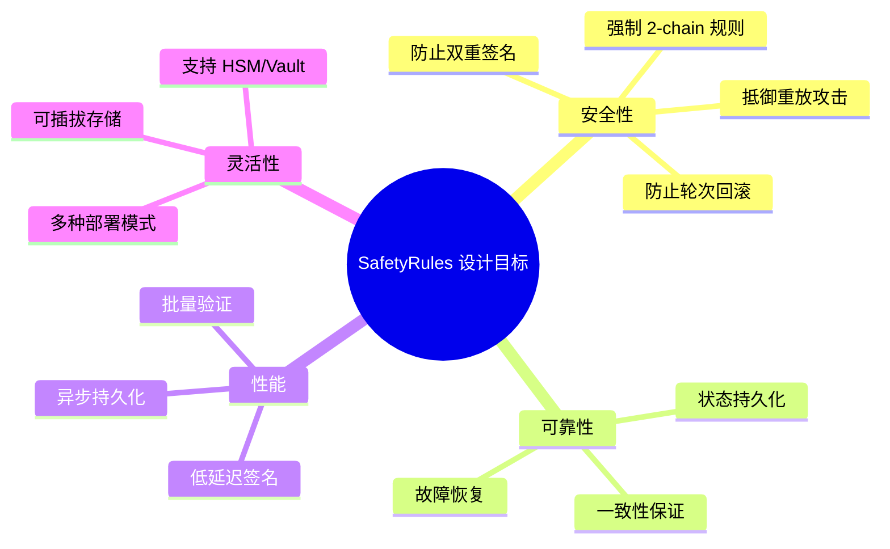

#### 安全属性保证

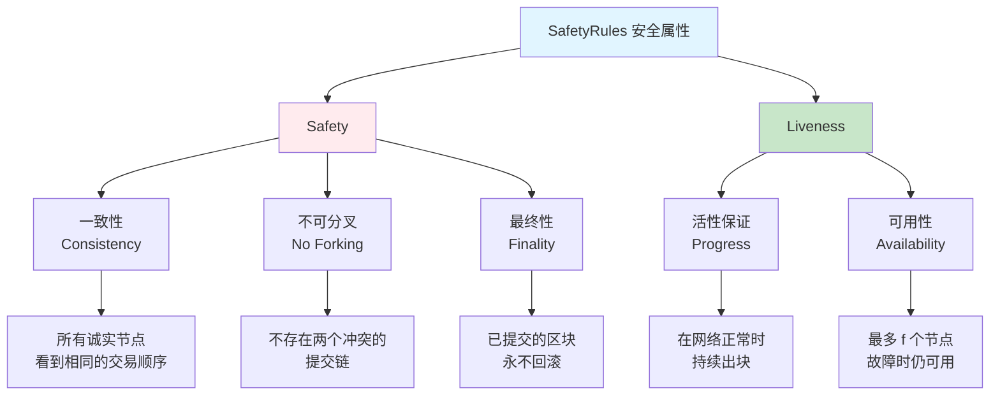

#### 安全边界定义

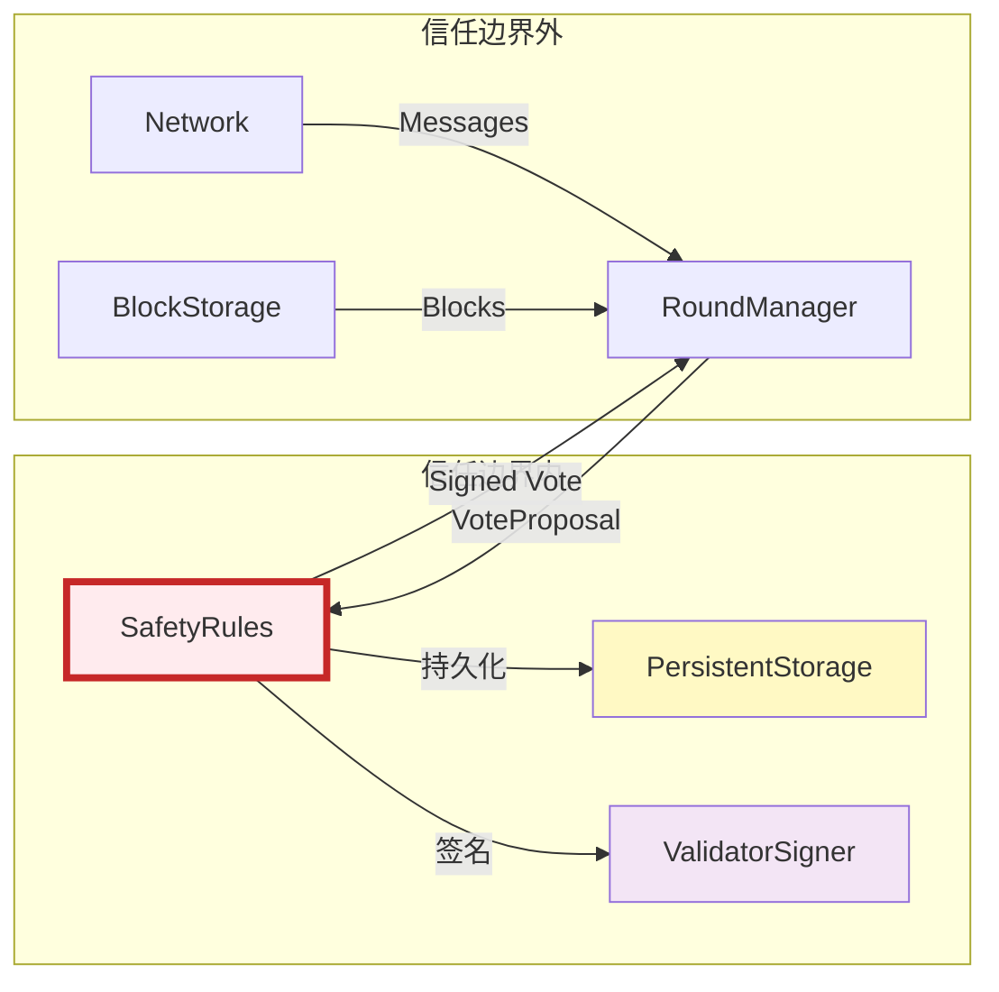

**边界说明**：
- **信任边界内**: SafetyRules、持久化存储、签名器 - 必须正确实现
- **信任边界外**: 所有其他组件 - 即使被攻击也不会违反安全性

### 1.2 安全模型详解

#### BFT 安全假设

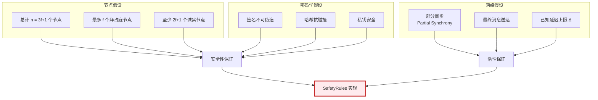

#### 威胁模型

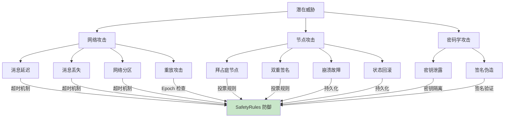

#### 安全检查层次

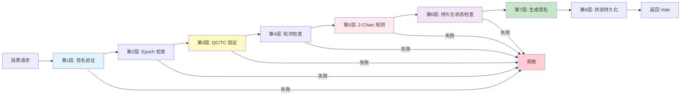

### 1.3 文件结构与代码组织

#### 详细目录结构

```
safety-rules/
├── Cargo.toml                        # 依赖配置
├── README.md                         # 模块说明
├── src/
│   ├── lib.rs                        # 模块入口 (200 LOC)
│   │   └── TSafetyRules trait 定义
│   │
│   ├── safety_rules.rs               # 核心安全规则 (1,500 LOC)
│   │   ├── SafetyRules 结构
│   │   ├── 投票规则实现
│   │   ├── 2-chain 检查
│   │   └── 签名生成
│   │
│   ├── safety_rules_manager.rs       # SafetyRules 管理器 (800 LOC)
│   │   ├── SafetyRulesManager 枚举
│   │   ├── 多模式部署
│   │   └── 配置管理
│   │
│   ├── persistent_safety_storage.rs  # 持久化存储 (800 LOC)
│   │   ├── PersistentSafetyStorage trait
│   │   ├── OnDiskStorage 实现
│   │   ├── InMemoryStorage 实现
│   │   └── SafetyData 序列化
│   │
│   ├── serializer.rs                 # 序列化器 (600 LOC)
│   │   ├── SerializerService
│   │   ├── RPC 序列化/反序列化
│   │   └── 远程调用支持
│   │
│   ├── local_client.rs               # 本地客户端 (300 LOC)
│   │   └── LocalClient 实现
│   │
│   ├── thread.rs                     # 线程模式 (200 LOC)
│   │   └── ThreadService
│   │
│   ├── process.rs                    # 进程模式 (400 LOC)
│   │   └── ProcessService (IPC)
│   │
│   ├── counters.rs                   # Prometheus 指标 (150 LOC)
│   │   ├── SIGN_VOTE_DURATION
│   │   ├── SIGN_TIMEOUT_DURATION
│   │   └── CONSTRUCT_VOTE_COUNT
│   │
│   └── tests/                        # 测试
│       ├── safety_rules_test.rs      # 单元测试 (1,000 LOC)
│       ├── suite.rs                  # 测试套件
│       └── ...
│
└── README.md
```

#### 代码规模统计

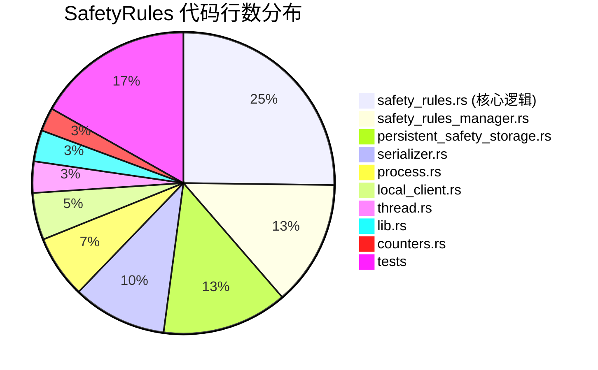

### 1.4 模块在共识系统中的位置

#### 系统架构位置

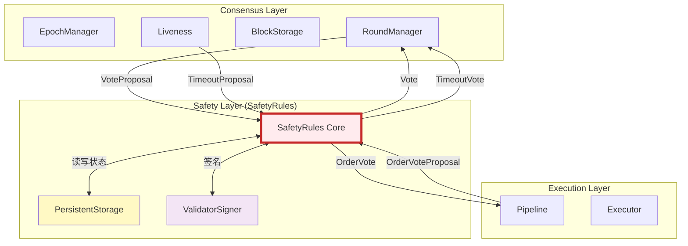

#### 调用流程图

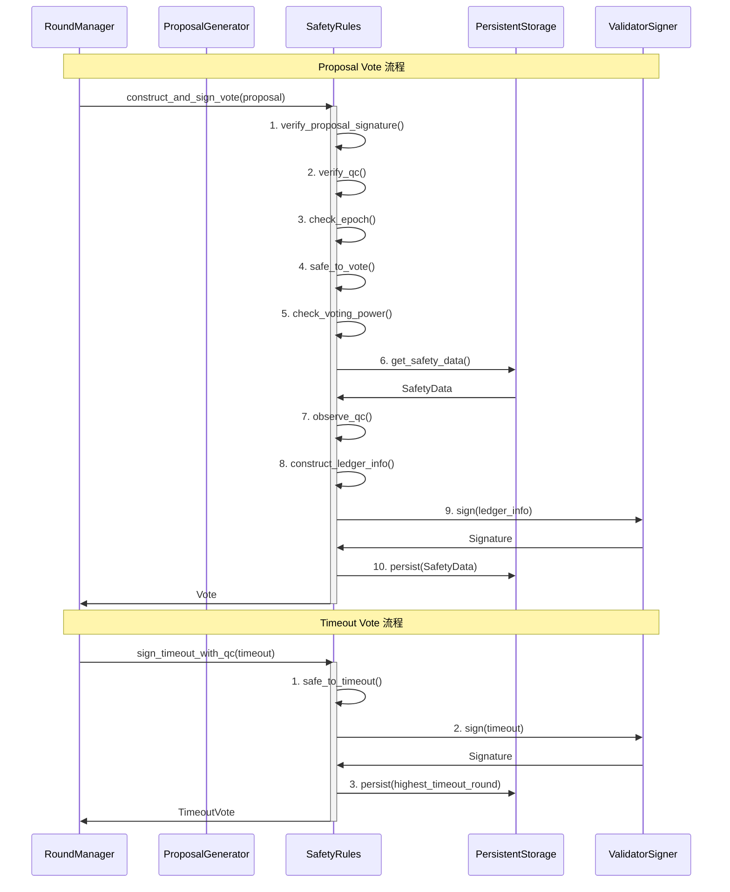

---

## 2. 核心数据结构详解

### 2.1 SafetyRules 结构

#### 完整结构定义

```rust
// safety-rules/src/safety_rules.rs

pub struct SafetyRules {
    /// 持久化存储接口
    persistent_storage: Box<dyn PersistentSafetyStorage>,

    /// 验证者签名器（持有私钥）
    validator_signer: Option<ValidatorSigner>,

    /// 当前 Epoch 状态
    epoch_state: Option<EpochState>,

    /// 导出一致性检查密钥
    export_consensus_key: bool,

    /// 是否跳过签名验证（测试模式）
    skip_sig_verify: bool,

    /// 当前安全数据
    safety_data: SafetyData,

    /// Waypoint（检查点）
    waypoint: Waypoint,

    /// 是否在验证者集合中
    in_validator_set: bool,
}
```

#### 字段详解

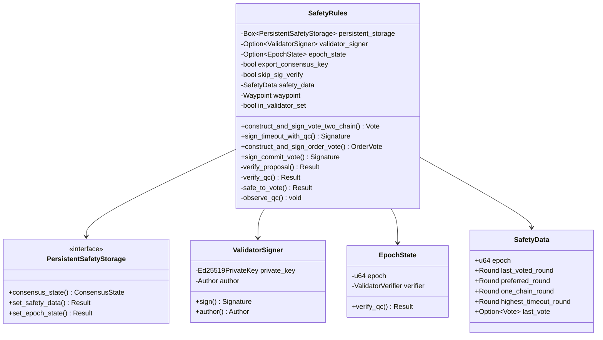

**关键字段作用**：

| 字段 | 类型 | 职责 | 关键性 |
|-----|------|-----|--------|
| `persistent_storage` | Box<dyn PersistentSafetyStorage> | 状态持久化，防止重启后违规 | ⭐⭐⭐⭐⭐ |
| `validator_signer` | Option<ValidatorSigner> | BLS12-381 签名生成 | ⭐⭐⭐⭐⭐ |
| `epoch_state` | Option<EpochState> | 验证 QC 签名，管理验证者集合 | ⭐⭐⭐⭐ |
| `safety_data` | SafetyData | 核心安全状态 | ⭐⭐⭐⭐⭐ |
| `waypoint` | Waypoint | 检查点，防止长程攻击 | ⭐⭐⭐⭐ |
| `skip_sig_verify` | bool | 测试模式优化 | ⭐ |

#### 初始化流程

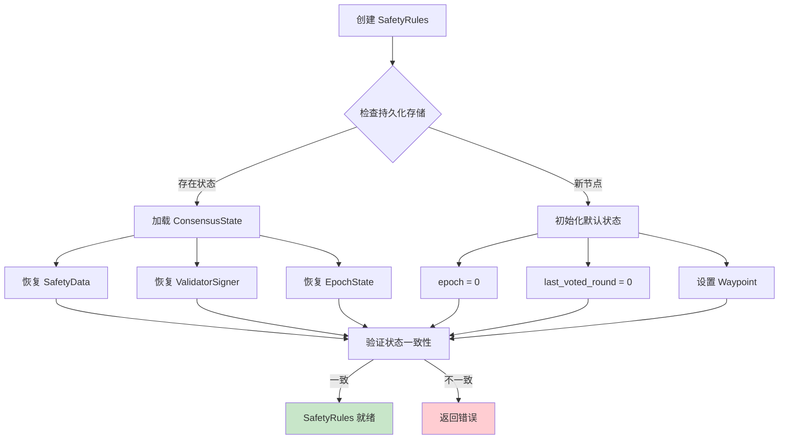

### 2.2 SafetyData 状态机

#### SafetyData 结构

```rust
// consensus-types/src/safety_data.rs

#[derive(Clone, Debug, Serialize, Deserialize, PartialEq, Eq)]
pub struct SafetyData {
    /// 当前 Epoch
    pub epoch: u64,

    /// 最后投票的轮次（防止重复投票）
    pub last_voted_round: Round,

    /// Preferred round（2-chain 头的最高轮次）
    pub preferred_round: Round,

    /// One-chain round（用于 order vote）
    pub one_chain_round: Round,

    /// 最高超时轮次
    pub highest_timeout_round: Round,

    /// 最后一次投票的完整记录（用于调试）
    pub last_vote: Option<Vote>,
}
```

#### 状态转换图

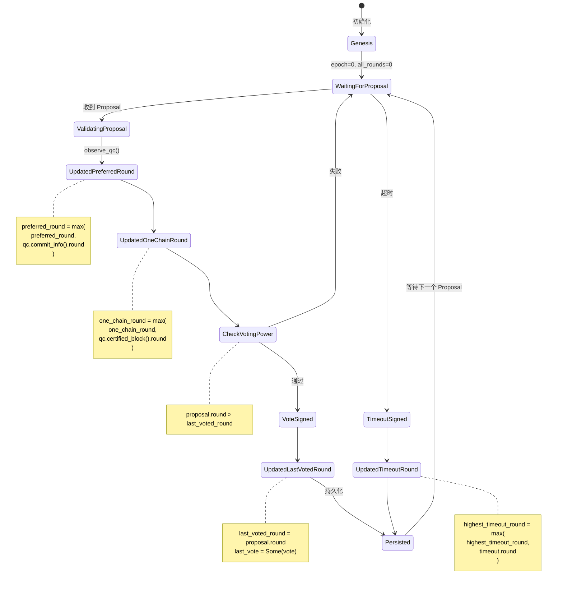

#### 状态字段更新规则

```mermaid
graph TB
    subgraph "last_voted_round 更新"
        A1[收到 Proposal] --> A2{safe_to_vote?}
        A2 -->|是| A3[last_voted_round = proposal.round]
        A2 -->|否| A4[保持不变]
    end

    subgraph "preferred_round 更新"
        B1[观察到 QC] --> B2[qc.commit_info().round]
        B2 --> B3{> preferred_round?}
        B3 -->|是| B4[preferred_round = qc_round]
        B3 -->|否| B5[保持不变]
    end

    subgraph "one_chain_round 更新"
        C1[观察到 QC] --> C2[qc.certified_block().round]
        C2 --> C3{> one_chain_round?}
        C3 -->|是| C4[one_chain_round = qc_round]
        C3 -->|否| C5[保持不变]
    end

    subgraph "highest_timeout_round 更新"
        D1[签名 Timeout] --> D2{timeout.round > highest?}
        D2 -->|是| D3[highest_timeout_round = timeout.round]
        D2 -->|否| D4[保持不变]
    end

    style A3 fill:#c8e6c9
    style B4 fill:#c8e6c9
    style C4 fill:#c8e6c9
    style D3 fill:#c8e6c9
```

#### SafetyData 不变式

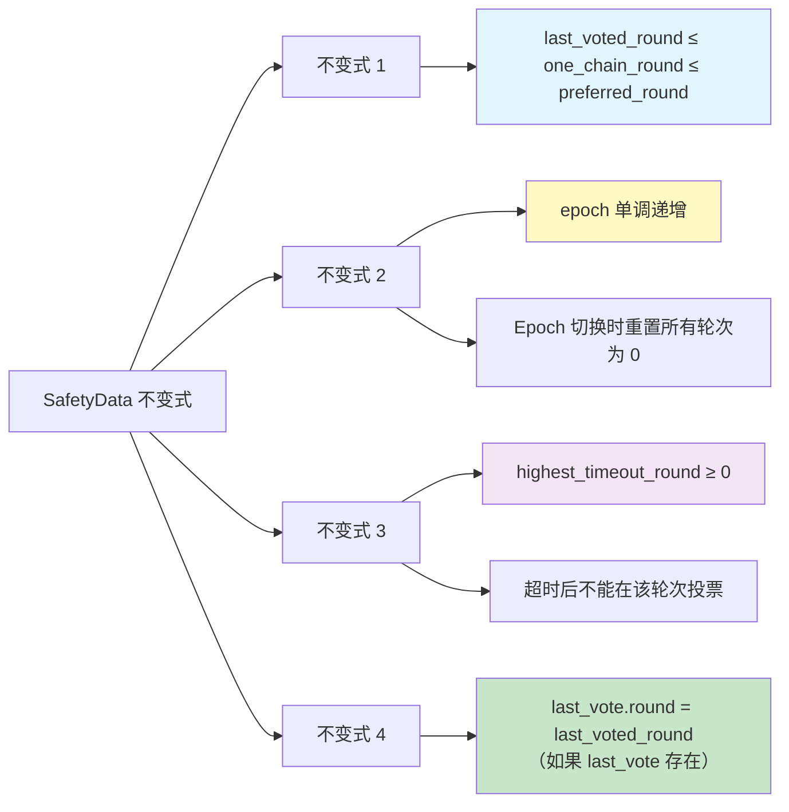

**不变式证明重要性**：
- 这些不变式是安全性证明的基础
- 违反任何不变式都可能导致安全性问题
- 单元测试应验证所有不变式始终成立

### 2.3 ConsensusState 结构

```rust
// safety-rules/src/persistent_safety_storage.rs

pub struct ConsensusState {
    /// 核心安全数据
    pub safety_data: SafetyData,

    /// 检查点（用于同步验证）
    pub waypoint: Waypoint,

    /// 是否在验证者集合中
    pub in_validator_set: bool,
}
```

#### Waypoint 机制

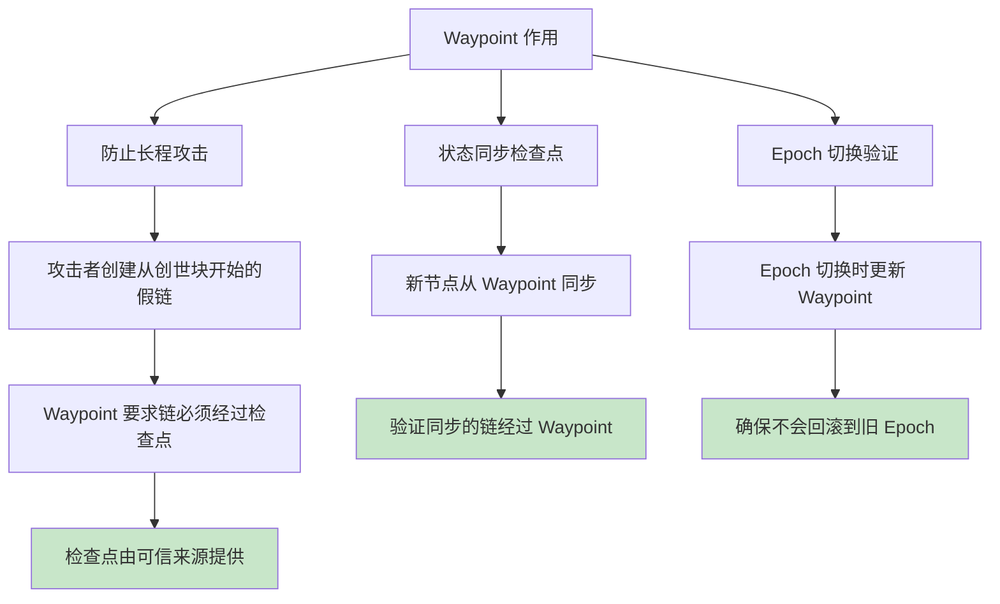

**Waypoint 结构**：

```rust
pub struct Waypoint {
    /// Epoch 版本号
    version: Version,

    /// LedgerInfo 哈希
    value: HashValue,
}
```

### 2.4 投票相关结构

#### VoteProposal

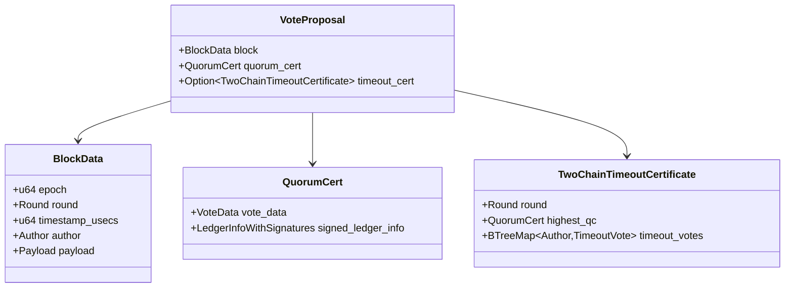

#### OrderVoteProposal

```rust
pub struct OrderVoteProposal {
    /// 已排序的区块列表
    pub ordered_blocks: Vec<Block>,

    /// 排序证明（包含 2f+1 个 proposal votes）
    pub ordered_proof: LedgerInfoWithSignatures,
}
```

**OrderVoteProposal 示例**：

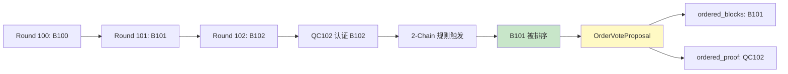

---

## 3. 安全规则深度解析

### 3.1 2-Chain 投票规则详解

#### 规则可视化

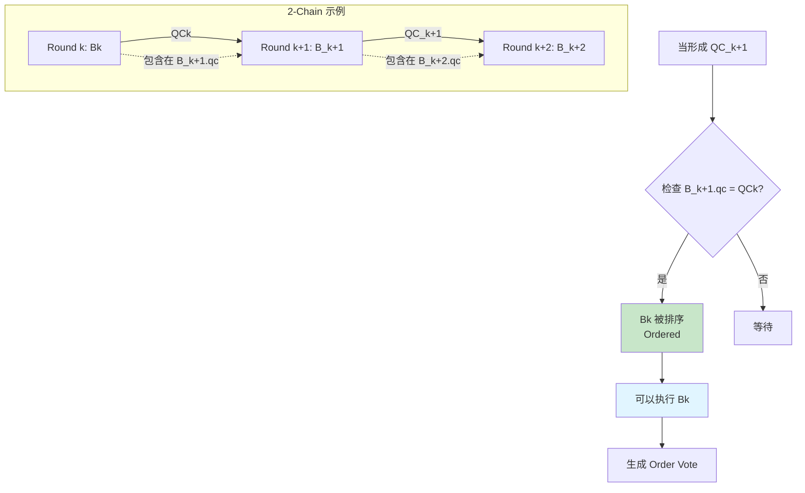

#### 投票条件详解

```mermaid
graph TD
    A[收到 Proposal P] --> B{条件 1: 正常情况}

    B --> C[P.round == P.qc.certified_block().round + 1]
    C -->|满足| D[可以投票]

    B --> E{条件 2: 超时情况}
    E --> F[P.round == TC.round + 1]
    E --> G[P.qc.certified_block().round ≥ TC.highest_qc_round]

    F --> H{两个条件都满足?}
    G --> H

    H -->|是| D
    H -->|否| I[拒绝投票]

    D --> J{额外检查}
    J --> K[P.round > last_voted_round]
    J --> L[P.qc.commit_info().round ≥ preferred_round]

    K -->|满足| M[通过所有检查]
    L -->|满足| M
    K -->|失败| I
    L -->|失败| I

    M --> N[生成投票]

    style C fill:#c8e6c9
    style H fill:#fff9c4
    style M fill:#e1f5ff
    style N fill:#c8e6c9
    style I fill:#ffcdd2
```

#### 代码实现详解

```rust
// safety-rules/src/safety_rules.rs

fn safe_to_vote(
    &self,
    block_round: Round,
    qc_round: Round,
    tc: Option<&TwoChainTimeoutCertificate>,
) -> Result<bool, Error> {
    // ========================================
    // 规则 1: 正常情况 - 连续轮次
    // ========================================
    // 说明: 区块轮次应该是其 QC 认证区块轮次的下一轮
    // 例如: block(round=100).qc.certified_block().round = 99
    //
    if block_round == qc_round + 1 {
        info!(
            "safe_to_vote: Normal case - consecutive rounds. \
             block_round: {}, qc_round: {}",
            block_round, qc_round
        );
        return Ok(true);
    }

    // ========================================
    // 规则 2: 超时情况 - TC 驱动
    // ========================================
    // 说明: 当网络出现超时时，区块可以跳过轮次
    // 条件: 1) block_round 是 TC.round 的下一轮
    //      2) QC 的轮次不低于 TC 中的最高 QC
    //
    if let Some(timeout_cert) = tc {
        let tc_round = timeout_cert.round();
        let tc_highest_qc_round = timeout_cert.highest_qc_round();

        if block_round == tc_round + 1 &&
           qc_round >= tc_highest_qc_round {
            info!(
                "safe_to_vote: Timeout case. \
                 block_round: {}, tc_round: {}, \
                 qc_round: {}, tc_highest_qc_round: {}",
                block_round, tc_round, qc_round, tc_highest_qc_round
            );
            return Ok(true);
        }
    }

    // ========================================
    // 其他情况: 不安全
    // ========================================
    warn!(
        "safe_to_vote: Unsafe to vote. \
         block_round: {}, qc_round: {}, tc: {:?}",
        block_round, qc_round, tc.map(|t| t.round())
    );
    Ok(false)
}
```

#### 为什么 2-Chain 是安全的？

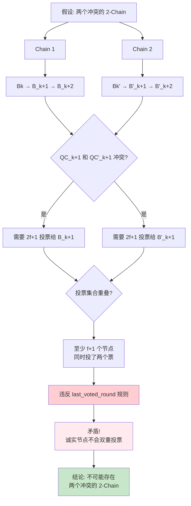

**数学证明**：

设：
- 总节点数: n = 3f + 1
- 拜占庭节点数: ≤ f
- 诚实节点数: ≥ 2f + 1

要形成 QC，需要 2f + 1 个签名。

如果存在两个冲突的同轮次 QC：
1. QC₁ 需要 2f + 1 个签名
2. QC₂ 需要 2f + 1 个签名
3. 总共需要签名数 = (2f + 1) + (2f + 1) = 4f + 2

但总节点数只有 3f + 1，因此至少有：
- 重叠节点数 = (4f + 2) - (3f + 1) = f + 1

这 f + 1 个重叠节点违反了 `last_voted_round` 规则（不能在同一轮次投票两次）。

由于拜占庭节点最多 f 个，至少有 1 个诚实节点违规，矛盾！

### 3.2 投票防重放规则

#### Last Voted Round 检查

```mermaid
graph TD
    A[收到 Proposal] --> B{proposal.round > last_voted_round?}

    B -->|是| C[允许投票]
    B -->|否| D[拒绝投票]

    C --> E[更新 last_voted_round]
    E --> F[持久化到存储]
    F --> G[防止重启后重复投票]

    D --> H[记录错误]
    H --> I[返回 IncorrectLastVotedRound 错误]

    style C fill:#c8e6c9
    style D fill:#ffcdd2
    style F fill:#fff9c4
```

**代码实现**：

```rust
fn check_voting_power(
    &self,
    proposed_round: Round,
) -> Result<(), Error> {
    // ========================================
    // 防重放规则: 不能在已投票的轮次或之前轮次再次投票
    // ========================================
    //
    // 原因: 防止以下攻击
    //   1. 双重投票: 同一轮次投票给不同的区块
    //   2. 轮次回滚: 攻击者重放旧的投票请求
    //
    // 实现: last_voted_round 持久化到存储
    //      重启后从存储恢复，确保一致性
    //
    ensure!(
        proposed_round > self.safety_data.last_voted_round,
        Error::IncorrectLastVotedRound(
            proposed_round,
            self.safety_data.last_voted_round
        )
    );

    info!(
        "check_voting_power passed: proposed_round={}, last_voted_round={}",
        proposed_round, self.safety_data.last_voted_round
    );

    Ok(())
}
```

#### Preferred Round 单调性

```mermaid
graph TD
    A[观察到新的 QC] --> B[qc.commit_info().round]
    B --> C{> preferred_round?}

    C -->|是| D[更新 preferred_round]
    C -->|否| E[保持不变]

    D --> F[preferred_round = qc_commit_round]
    F --> G[确保 2-chain 头单调递增]

    E --> H[QC 来自旧的分支]

    G --> I{后续 Proposal 检查}
    I --> J[proposal.qc.commit_info().round ≥ preferred_round]
    J -->|满足| K[安全]
    J -->|失败| L[拒绝: 可能在旧分支上]

    style D fill:#c8e6c9
    style K fill:#c8e6c9
    style L fill:#ffcdd2
```

**为什么需要 Preferred Round？**

```mermaid
graph LR
    subgraph "场景: 网络分区恢复"
        A[分区 1: 进展到 Round 100]
        B[分区 2: 停留在 Round 50]
    end

    C[网络恢复] --> D{没有 preferred_round}
    D --> E[可能接受 Round 51 的 Proposal]
    E --> F[违反一致性]

    C --> G{有 preferred_round = 100}
    G --> H[拒绝 Round 51 的 Proposal]
    H --> I[强制同步到最新状态]
    I --> J[保证一致性]

    style F fill:#ffcdd2
    style J fill:#c8e6c9
```

### 3.3 超时安全规则

#### 超时投票条件

```mermaid
graph TD
    A[超时定时器触发] --> B[构造 TimeoutVote]

    B --> C{safe_to_timeout?}

    C --> D{条件 1: timeout.round == qc.round + 1}
    C --> E{条件 2: timeout.round == tc.round + 1}
    C --> F{条件 3: qc.round ≥ one_chain_round}

    D -->|满足| G[安全]
    E -->|满足| G
    F -->|满足| G

    D -->|失败| H[检查其他条件]
    E -->|失败| H
    F -->|失败| I[拒绝]

    G --> J[签名 TimeoutVote]
    J --> K[更新 highest_timeout_round]
    K --> L[持久化]

    style G fill:#c8e6c9
    style I fill:#ffcdd2
```

**超时投票代码**：

```rust
pub fn sign_timeout_with_qc(
    &mut self,
    timeout: &TwoChainTimeout,
    timeout_cert: Option<&TwoChainTimeoutCertificate>,
) -> Result<bls12381::Signature, Error> {
    // ========================================
    // 步骤 1: 验证超时安全性
    // ========================================
    let qc_round = timeout.quorum_cert().certified_block().round();

    ensure!(
        self.safe_to_timeout(timeout.round(), qc_round, timeout_cert)?,
        Error::IncorrectPreferredRound(
            timeout.round(),
            self.safety_data.preferred_round
        )
    );

    // ========================================
    // 步骤 2: 观察 QC（更新 preferred_round）
    // ========================================
    self.observe_qc(timeout.quorum_cert());

    // ========================================
    // 步骤 3: 签名
    // ========================================
    let signature = self.validator_signer
        .as_ref()
        .ok_or(Error::NotInitialized)?
        .sign(timeout)?;

    // ========================================
    // 步骤 4: 更新 highest_timeout_round
    // ========================================
    // 重要: 防止在超时轮次之后的 order vote
    if timeout.round() > self.safety_data.highest_timeout_round {
        self.safety_data.highest_timeout_round = timeout.round();
    }

    // ========================================
    // 步骤 5: 持久化
    // ========================================
    self.persistent_storage.set_safety_data(self.safety_data.clone())?;

    info!(
        "Signed timeout vote: round={}, highest_timeout_round={}",
        timeout.round(), self.safety_data.highest_timeout_round
    );

    Ok(signature)
}
```

#### Highest Timeout Round 作用

```mermaid
sequenceDiagram
    participant N as Node
    participant SR as SafetyRules

    Note over N,SR: Round 100 超时

    N->>SR: sign_timeout(round=100)
    SR->>SR: highest_timeout_round = 100

    Note over N,SR: Round 101 开始

    N->>SR: construct_and_sign_vote(round=101)
    SR->>SR: ✓ 允许 proposal vote

    Note over N,SR: Round 100 的区块延迟到达<br/>（被排序）

    N->>SR: construct_and_sign_order_vote(round=100)
    SR->>SR: ✗ order_round (100) ≤ highest_timeout_round (100)
    SR->>N: 拒绝 Order Vote

    Note over N,SR: 原因: 超时后不能提交该轮次
```

### 3.4 Order Vote 和 Commit Vote 规则

#### Pipeline 投票流程

```mermaid
graph TB
    A[区块被排序<br/>Ordered] --> B[Pipeline: Execute Phase]

    B --> C[执行交易]
    C --> D[计算 state_root]
    D --> E[构造 LedgerInfo]

    E --> F[SafetyRules: Order Vote]
    F --> G{order_round > highest_timeout_round?}

    G -->|是| H[签名 Order Vote]
    G -->|否| I[拒绝]

    H --> J[收集 2f+1 Order Votes]
    J --> K[形成 Order QC]

    K --> L[Pipeline: Commit Phase]
    L --> M[SafetyRules: Commit Vote]
    M --> N[签名 Commit Vote]

    N --> O[收集 2f+1 Commit Votes]
    O --> P[形成 Commit Decision]
    P --> Q[持久化到 Storage]

    style A fill:#e1f5ff
    style F fill:#fff9c4
    style M fill:#f3e5f5
    style Q fill:#c8e6c9
    style I fill:#ffcdd2
```

#### Order Vote 安全检查

```rust
pub fn construct_and_sign_order_vote(
    &mut self,
    order_vote_proposal: &OrderVoteProposal,
) -> Result<OrderVote, Error> {
    // ========================================
    // 步骤 1: 验证 ordered_proof 签名
    // ========================================
    // ordered_proof 是一个 LedgerInfoWithSignatures
    // 包含 2f+1 个 proposal votes
    //
    self.verify_ledger_info(&order_vote_proposal.ordered_proof)?;

    // ========================================
    // 步骤 2: 提取 order_cert_round
    // ========================================
    let order_cert_round = order_vote_proposal
        .ordered_proof
        .commit_info()
        .round();

    // ========================================
    // 步骤 3: 更新 one_chain_round
    // ========================================
    self.observe_qc_from_ledger_info(
        &order_vote_proposal.ordered_proof
    );

    // ========================================
    // 步骤 4: 关键安全检查
    // ========================================
    // 规则: 不能为超时轮次之前或当前轮次的区块签 order vote
    //
    // 原因: 如果一个轮次超时了，说明网络可能存在问题
    //      不应该提交该轮次的区块
    //
    ensure!(
        order_cert_round > self.safety_data.highest_timeout_round,
        Error::OrderVoteSafetyCheckFailed(
            order_cert_round,
            self.safety_data.highest_timeout_round
        )
    );

    // ========================================
    // 步骤 5: 构造 LedgerInfo（用于 order vote）
    // ========================================
    let ledger_info = self.construct_order_vote_ledger_info(
        &order_vote_proposal.ordered_blocks
    )?;

    // ========================================
    // 步骤 6: 签名
    // ========================================
    let signature = self.sign_ledger_info(&ledger_info)?;

    // ========================================
    // 步骤 7: 持久化
    // ========================================
    self.persistent_storage.set_safety_data(self.safety_data.clone())?;

    // ========================================
    // 步骤 8: 构造 OrderVote
    // ========================================
    Ok(OrderVote::new(
        self.validator_signer.as_ref().unwrap().author(),
        ledger_info,
        signature,
    ))
}
```

#### Commit Vote 签名

```mermaid
graph TD
    A[收到 OrderQC] --> B[验证 OrderQC 签名]
    B --> C[构造 CommitLedgerInfo]

    C --> D[SafetyRules: sign_commit_vote]
    D --> E[验证 ordered_proof]
    E --> F[更新 one_chain_round]
    F --> G{order_round > highest_timeout_round?}

    G -->|是| H[签名 CommitLedgerInfo]
    G -->|否| I[拒绝]

    H --> J[返回 Commit Signature]
    J --> K[收集 2f+1 Commit Votes]
    K --> L[形成 Commit Decision]
    L --> M[提交到 Storage]

    style H fill:#c8e6c9
    style M fill:#e1f5ff
    style I fill:#ffcdd2
```

### 3.5 安全性证明

#### 核心安全定理

**定理 1: 一致性（Consistency）**

> 如果两个诚实节点分别提交了区块 B₁ 和 B₂，且 B₁ 和 B₂ 在相同的高度（轮次），则 B₁ = B₂。

**证明草图**：

```mermaid
graph TD
    A[假设: B₁ ≠ B₂，相同轮次 r] --> B[B₁ 被提交]
    A --> C[B₂ 被提交]

    B --> D[存在 2-chain:<br/>B_r-1 → B₁ → B_r+1]
    C --> E[存在 2-chain:<br/>B'_r-1 → B₂ → B'_r+1]

    D --> F[QC_r 认证 B₁]
    E --> G[QC'_r 认证 B₂]

    F --> H{QC_r 和 QC'_r 冲突?}
    G --> H

    H -->|是| I[需要 f+1 个节点<br/>双重投票]
    I --> J[违反 last_voted_round 规则]
    J --> K[矛盾!]

    K --> L[结论: B₁ = B₂]

    style K fill:#ffebee
    style L fill:#c8e6c9
```

**定理 2: 最终性（Finality）**

> 如果一个诚实节点提交了区块 B，则在网络同步后，所有诚实节点最终都会提交 B。

**证明草图**：

```mermaid
graph LR
    A[节点 N₁ 提交 B] --> B[N₁ 有 2-chain 证明]
    B --> C[QC 包含 2f+1 签名]
    C --> D[至少 f+1 个诚实节点投票]

    D --> E[诚实节点更新 preferred_round]
    E --> F[拒绝不包含 B 的链]

    F --> G[由于 2f+1 诚实节点]
    G --> H[新的 QC 必须扩展包含 B 的链]

    H --> I[所有节点最终提交 B]

    style I fill:#c8e6c9
```

**定理 3: 活性（Liveness）**

> 在部分同步网络中，如果 GST（Global Stabilization Time）之后网络稳定，且 Leader 诚实，则共识会持续进展。

**证明要点**：

1. GST 后，消息在 Δ 时间内送达
2. 诚实 Leader 生成有效 Proposal
3. 2f+1 个诚实节点收到 Proposal
4. 通过 SafetyRules 检查
5. 形成 QC
6. 触发下一轮

---

## 4. 投票流程详解

### 4.1 Proposal Vote 完整流程

#### 详细时序图

```mermaid
sequenceDiagram
    autonumber
    participant RM as RoundManager
    participant SR as SafetyRules
    participant PS as PersistentStorage
    participant VS as ValidatorSigner
    participant EV as EpochState/Verifier

    Note over RM,EV: ══════════ Proposal Vote 流程 ══════════

    RM->>SR: construct_and_sign_vote_two_chain(proposal)
    activate SR

    rect rgb(225, 245, 255)
        Note over SR: Phase 1: 签名验证
        SR->>SR: 1. extract_proposal_author()
        SR->>EV: 2. verify_proposal_signature(author, proposal)
        EV->>SR: ✓ 签名有效
    end

    rect rgb(255, 249, 196)
        Note over SR: Phase 2: QC/TC 验证
        SR->>SR: 3. extract QC from proposal
        SR->>EV: 4. verify_qc(qc)
        EV->>SR: ✓ QC 有效

        alt 包含 TimeoutCert
            SR->>EV: 5. verify_tc(tc)
            EV->>SR: ✓ TC 有效
        end
    end

    rect rgb(255, 235, 238)
        Note over SR: Phase 3: Epoch 检查
        SR->>SR: 6. check epoch match
        alt Epoch 不匹配
            SR->>RM: ✗ IncorrectEpoch Error
        end
    end

    rect rgb(255, 243, 224)
        Note over SR: Phase 4: 安全规则检查
        SR->>SR: 7. safe_to_vote(round, qc_round, tc)
        alt 不安全
            SR->>RM: ✗ IncorrectPreferredRound Error
        end

        SR->>SR: 8. check_voting_power(round)
        alt round ≤ last_voted_round
            SR->>RM: ✗ IncorrectLastVotedRound Error
        end
    end

    rect rgb(200, 230, 201)
        Note over SR: Phase 5: 状态更新
        SR->>SR: 9. observe_qc(qc)
        Note right of SR: 更新 preferred_round<br/>更新 one_chain_round
    end

    rect rgb(243, 229, 245)
        Note over SR: Phase 6: 构造 LedgerInfo
        SR->>SR: 10. construct_ledger_info(block)
        SR->>VS: 11. sign(ledger_info)
        VS->>SR: Signature
    end

    rect rgb(255, 249, 196)
        Note over SR: Phase 7: 更新投票状态
        SR->>SR: 12. last_voted_round = proposal.round
        SR->>SR: 13. last_vote = Some(vote)
    end

    rect rgb(225, 245, 255)
        Note over SR: Phase 8: 持久化
        SR->>PS: 14. set_safety_data(safety_data)
        PS->>SR: ✓ Persisted
    end

    rect rgb(200, 230, 201)
        Note over SR: Phase 9: 构造 Vote
        SR->>SR: 15. Vote::new(author, ledger_info, signature)
    end

    SR->>RM: Vote
    deactivate SR

    Note over RM,EV: ══════════ 投票完成 ══════════
```

#### 步骤详细说明

**Phase 1: 签名验证** (步骤 1-2)

```rust
// 验证提议者的签名
fn verify_proposal(
    &self,
    epoch: u64,
    author: &Author,
    quorum_cert: &QuorumCert,
    round: Round,
) -> Result<(), Error> {
    // 1. 检查提议者是否在验证者集合中
    let epoch_state = self.epoch_state
        .as_ref()
        .ok_or(Error::NotInitialized)?;

    ensure!(
        epoch_state.verifier.contains(author),
        Error::InvalidAuthor(*author)
    );

    // 2. 验证提议者有权在此轮次提议
    // （根据 ProposerElection 算法）
    //
    // 注意: 这里 SafetyRules 不直接验证
    //      由 RoundManager 在调用前检查

    Ok(())
}
```

**Phase 2: QC/TC 验证** (步骤 3-5)

```rust
fn verify_qc(&self, qc: &QuorumCert) -> Result<(), Error> {
    let epoch_state = self.epoch_state
        .as_ref()
        .ok_or(Error::NotInitialized)?;

    // 验证 QC 中的聚合签名
    epoch_state.verifier.verify_qc(
        qc.ledger_info().commit_info(),
        qc.ledger_info().signatures()
    )?;

    info!("QC verified: round={}", qc.certified_block().round());
    Ok(())
}
```

**Phase 4: 安全规则检查** (步骤 7-8)

参见前文的 `safe_to_vote` 和 `check_voting_power` 实现。

**Phase 5: 状态更新** (步骤 9)

```rust
fn observe_qc(&mut self, qc: &QuorumCert) {
    // 更新 preferred_round（2-chain 头）
    let commit_round = qc.commit_info().round();
    if commit_round > self.safety_data.preferred_round {
        self.safety_data.preferred_round = commit_round;
        info!("Updated preferred_round to {}", commit_round);
    }

    // 更新 one_chain_round
    let certified_round = qc.certified_block().round();
    if certified_round > self.safety_data.one_chain_round {
        self.safety_data.one_chain_round = certified_round;
        info!("Updated one_chain_round to {}", certified_round);
    }
}
```

#### 错误处理流程

```mermaid
graph TD
    A[construct_and_sign_vote] --> B{签名验证}
    B -->|失败| E1[Error::InvalidSignature]

    B -->|成功| C{QC 验证}
    C -->|失败| E2[Error::InvalidQuorumCert]

    C -->|成功| D{Epoch 检查}
    D -->|失败| E3[Error::IncorrectEpoch]

    D -->|成功| F{safe_to_vote}
    F -->|失败| E4[Error::IncorrectPreferredRound]

    F -->|成功| G{check_voting_power}
    G -->|失败| E5[Error::IncorrectLastVotedRound]

    G -->|成功| H[生成 Vote]

    E1 & E2 & E3 & E4 & E5 --> I[记录错误]
    I --> J[返回错误给 RoundManager]

    H --> K[返回 Vote]

    style H fill:#c8e6c9
    style E1 fill:#ffcdd2
    style E2 fill:#ffcdd2
    style E3 fill:#ffcdd2
    style E4 fill:#ffcdd2
    style E5 fill:#ffcdd2
```

### 4.2 Order Vote 流程

#### 详细时序图

```mermaid
sequenceDiagram
    autonumber
    participant BM as BufferManager
    participant SR as SafetyRules
    participant PS as PersistentStorage
    participant VS as ValidatorSigner

    Note over BM,VS: ══════════ Order Vote 流程 ══════════

    BM->>SR: construct_and_sign_order_vote(order_proposal)
    activate SR

    rect rgb(225, 245, 255)
        Note over SR: Phase 1: 验证 ordered_proof
        SR->>SR: 1. verify_ledger_info(ordered_proof)
        Note right of SR: ordered_proof 包含 2f+1<br/>个 proposal votes
    end

    rect rgb(255, 249, 196)
        Note over SR: Phase 2: 提取轮次信息
        SR->>SR: 2. order_cert_round = ordered_proof.round()
    end

    rect rgb(243, 229, 245)
        Note over SR: Phase 3: 更新状态
        SR->>SR: 3. observe_qc_from_ledger_info(ordered_proof)
        Note right of SR: 更新 one_chain_round
    end

    rect rgb(255, 235, 238)
        Note over SR: Phase 4: 关键安全检查
        SR->>SR: 4. order_cert_round > highest_timeout_round?
        alt 检查失败
            SR->>BM: ✗ OrderVoteSafetyCheckFailed
        end
    end

    rect rgb(200, 230, 201)
        Note over SR: Phase 5: 构造 LedgerInfo
        SR->>SR: 5. construct_order_vote_ledger_info()
    end

    rect rgb(243, 229, 245)
        Note over SR: Phase 6: 签名
        SR->>VS: 6. sign(ledger_info)
        VS->>SR: Signature
    end

    rect rgb(255, 249, 196)
        Note over SR: Phase 7: 持久化
        SR->>PS: 7. set_safety_data(safety_data)
        PS->>SR: ✓ Persisted
    end

    rect rgb(200, 230, 201)
        Note over SR: Phase 8: 构造 OrderVote
        SR->>SR: 8. OrderVote::new(author, ledger_info, sig)
    end

    SR->>BM: OrderVote
    deactivate SR
```

#### Order Vote vs Proposal Vote 对比

```mermaid
graph TB
    subgraph "Proposal Vote"
        A1[收到 Proposal] --> A2[验证 Block]
        A2 --> A3[检查 2-chain 规则]
        A3 --> A4[投票给区块]
        A4 --> A5[形成 QC]
        A5 --> A6[区块被排序]
    end

    subgraph "Order Vote"
        B1[区块已排序] --> B2[执行区块]
        B2 --> B3[计算 state_root]
        B3 --> B4[验证 ordered_proof]
        B4 --> B5[投 Order Vote]
        B5 --> B6[形成 Order QC]
        B6 --> B7[准备提交]
    end

    A6 -->|触发| B1

    style A4 fill:#e1f5ff
    style B5 fill:#fff9c4
```

### 4.3 Commit Vote 流程

```mermaid
sequenceDiagram
    autonumber
    participant BM as BufferManager
    participant SR as SafetyRules
    participant PS as PersistentStorage
    participant VS as ValidatorSigner

    Note over BM,VS: ══════════ Commit Vote 流程 ══════════

    BM->>SR: sign_commit_vote(ordered_proof, new_ledger_info)
    activate SR

    SR->>SR: 1. verify_ledger_info(ordered_proof)
    SR->>SR: 2. observe_qc_from_ledger_info(ordered_proof)
    SR->>SR: 3. order_round > highest_timeout_round?

    alt 检查失败
        SR->>BM: ✗ CommitVoteSafetyCheckFailed
    end

    SR->>VS: 4. sign(new_ledger_info)
    VS->>SR: Signature

    SR->>PS: 5. set_safety_data(safety_data)
    PS->>SR: ✓ Persisted

    SR->>BM: Commit Signature
    deactivate SR
```

### 4.4 Timeout Vote 流程

```mermaid
sequenceDiagram
    autonumber
    participant RM as RoundManager
    participant SR as SafetyRules
    participant PS as PersistentStorage
    participant VS as ValidatorSigner

    Note over RM,VS: ══════════ Timeout Vote 流程 ══════════

    Note over RM: 超时定时器触发

    RM->>SR: sign_timeout_with_qc(timeout, tc)
    activate SR

    rect rgb(255, 249, 196)
        Note over SR: Phase 1: 安全检查
        SR->>SR: 1. safe_to_timeout(round, qc_round, tc)
        alt 不安全
            SR->>RM: ✗ IncorrectPreferredRound
        end
    end

    rect rgb(243, 229, 245)
        Note over SR: Phase 2: 更新状态
        SR->>SR: 2. observe_qc(timeout.qc)
        Note right of SR: 更新 preferred_round
    end

    rect rgb(225, 245, 255)
        Note over SR: Phase 3: 签名
        SR->>VS: 3. sign(timeout)
        VS->>SR: Signature
    end

    rect rgb(255, 235, 238)
        Note over SR: Phase 4: 更新超时轮次
        SR->>SR: 4. highest_timeout_round = max(current, timeout.round)
        Note right of SR: 防止超时后的 order vote
    end

    rect rgb(255, 249, 196)
        Note over SR: Phase 5: 持久化
        SR->>PS: 5. set_safety_data(safety_data)
        PS->>SR: ✓ Persisted
    end

    SR->>RM: Timeout Signature
    deactivate SR

    RM->>RM: 6. 广播 TimeoutVote

    Note over RM,VS: ══════════ 等待 2f+1 TimeoutVotes ══════════

    RM->>RM: 7. 形成 TimeoutCertificate
    RM->>RM: 8. 进入下一轮
```

---

## 5. 状态持久化机制

### 5.1 持久化架构

#### 架构概览

```mermaid
graph TB
    subgraph "SafetyRules"
        A[SafetyRules Core]
    end

    subgraph "抽象层"
        B[PersistentSafetyStorage Trait]
    end

    subgraph "实现层"
        C[OnDiskStorage]
        D[InMemoryStorage]
        E[VaultStorage]
    end

    subgraph "底层存储"
        F[SecureStorage]
        G[Memory]
        H[Vault/HSM]
    end

    A --> B
    B --> C
    B --> D
    B --> E

    C --> F
    D --> G
    E --> H

    style A fill:#ffebee
    style B fill:#e1f5ff
    style C fill:#c8e6c9
    style D fill:#fff9c4
    style E fill:#f3e5f5
```

#### PersistentSafetyStorage Trait

```rust
// safety-rules/src/persistent_safety_storage.rs

pub trait PersistentSafetyStorage: Send + Sync {
    /// 获取当前共识状态
    fn consensus_state(&self) -> Result<ConsensusState, Error>;

    /// 获取作者（验证者地址）
    fn author(&self) -> Result<Author, Error>;

    /// 获取 Epoch 状态
    fn epoch_state(&self) -> Result<EpochState, Error>;

    /// 获取 Waypoint
    fn waypoint(&self) -> Result<Waypoint, Error>;

    /// 获取安全数据
    fn safety_data(&self) -> Result<SafetyData, Error>;

    /// 设置安全数据
    fn set_safety_data(&mut self, safety_data: SafetyData)
        -> Result<(), Error>;

    /// 设置 Epoch 状态
    fn set_epoch_state(
        &mut self,
        epoch_state: EpochState,
    ) -> Result<(), Error>;

    /// 设置 Waypoint
    fn set_waypoint(&mut self, waypoint: Waypoint)
        -> Result<(), Error>;
}
```

### 5.2 存储实现

#### OnDiskStorage（生产环境）

```mermaid
graph TB
    subgraph "OnDiskStorage 结构"
        A[OnDiskStorage]
        B[SecureStorage Backend]
    end

    subgraph "存储内容"
        C[CONSENSUS_KEY<br/>验证者私钥]
        D[EPOCH_STATE<br/>Epoch 状态]
        E[SAFETY_DATA<br/>投票历史]
        F[WAYPOINT<br/>检查点]
    end

    subgraph "持久化媒介"
        G[加密文件]
        H[数据库]
    end

    A --> B
    B --> C
    B --> D
    B --> E
    B --> F

    C & D & E & F --> G
    C & D & E & F --> H

    style C fill:#ffebee
    style E fill:#fff9c4
```

**OnDiskStorage 实现**：

```rust
pub struct OnDiskStorage {
    inner: Arc<RwLock<OnDiskStorageInner>>,
}

struct OnDiskStorageInner {
    /// SecureStorage 后端
    storage: Storage,

    /// 命名空间（隔离不同验证者）
    namespace: String,
}

impl OnDiskStorage {
    pub fn new(storage: Storage, namespace: String) -> Self {
        Self {
            inner: Arc::new(RwLock::new(OnDiskStorageInner {
                storage,
                namespace,
            })),
        }
    }
}

impl PersistentSafetyStorage for OnDiskStorage {
    fn safety_data(&self) -> Result<SafetyData, Error> {
        let inner = self.inner.read().unwrap();
        let key = format!("{}_safety_data", inner.namespace);

        // 从存储读取
        let value = inner.storage
            .get(&key)
            .map_err(|e| Error::SecureStorageFailed(e))?;

        // 反序列化
        bcs::from_bytes(&value)
            .map_err(|e| Error::SerializationError(e))
    }

    fn set_safety_data(
        &mut self,
        safety_data: SafetyData,
    ) -> Result<(), Error> {
        let mut inner = self.inner.write().unwrap();
        let key = format!("{}_safety_data", inner.namespace);

        // 序列化
        let value = bcs::to_bytes(&safety_data)
            .map_err(|e| Error::SerializationError(e))?;

        // 写入存储（原子操作）
        inner.storage
            .set(&key, value)
            .map_err(|e| Error::SecureStorageFailed(e))?;

        info!("SafetyData persisted: {:?}", safety_data);
        Ok(())
    }
}
```

#### InMemoryStorage（测试环境）

```rust
pub struct InMemoryStorage {
    consensus_state: Mutex<ConsensusState>,
    validator_signer: Mutex<Option<ValidatorSigner>>,
}

impl InMemoryStorage {
    pub fn new(consensus_state: ConsensusState) -> Self {
        Self {
            consensus_state: Mutex::new(consensus_state),
            validator_signer: Mutex::new(None),
        }
    }
}

impl PersistentSafetyStorage for InMemoryStorage {
    fn safety_data(&self) -> Result<SafetyData, Error> {
        Ok(self.consensus_state.lock().unwrap().safety_data.clone())
    }

    fn set_safety_data(
        &mut self,
        safety_data: SafetyData,
    ) -> Result<(), Error> {
        self.consensus_state.lock().unwrap().safety_data = safety_data;
        Ok(())
    }
}
```

### 5.3 恢复机制

#### 节点重启恢复流程

```mermaid
graph TD
    A[节点启动] --> B[创建 SafetyRules]
    B --> C[调用 start 方法]

    C --> D[从 PersistentStorage 加载]
    D --> E[加载 SafetyData]
    D --> F[加载 ValidatorSigner]
    D --> G[加载 EpochState]
    D --> H[加载 Waypoint]

    E --> I{验证一致性}
    F --> I
    G --> I
    H --> I

    I -->|一致| J[恢复状态成功]
    I -->|不一致| K[返回错误]

    J --> L[SafetyRules 就绪]
    L --> M[继续共识]

    K --> N[节点启动失败]

    style J fill:#c8e6c9
    style L fill:#c8e6c9
    style K fill:#ffcdd2
    style N fill:#ffcdd2
```

**恢复代码**：

```rust
impl SafetyRules {
    pub fn start(&mut self) -> Result<(), Error> {
        // ========================================
        // 步骤 1: 加载持久化状态
        // ========================================
        let consensus_state = self.persistent_storage.consensus_state()?;

        // ========================================
        // 步骤 2: 恢复 SafetyData
        // ========================================
        self.safety_data = consensus_state.safety_data;
        info!(
            "Recovered SafetyData: epoch={}, last_voted_round={}, preferred_round={}",
            self.safety_data.epoch,
            self.safety_data.last_voted_round,
            self.safety_data.preferred_round
        );

        // ========================================
        // 步骤 3: 恢复 Waypoint
        // ========================================
        self.waypoint = consensus_state.waypoint;
        info!("Recovered Waypoint: {:?}", self.waypoint);

        // ========================================
        // 步骤 4: 恢复 ValidatorSigner
        // ========================================
        // 注意: 私钥可能在 HSM 中，不在内存
        if !self.export_consensus_key {
            // 私钥在安全硬件中
            info!("Using secure key management (HSM/Vault)");
        } else {
            // 私钥在内存中（测试模式）
            self.validator_signer = Some(
                self.persistent_storage.validator_signer()?
            );
        }

        // ========================================
        // 步骤 5: 恢复 EpochState
        // ========================================
        self.epoch_state = Some(
            self.persistent_storage.epoch_state()?
        );

        // ========================================
        // 步骤 6: 验证状态一致性
        // ========================================
        self.verify_consistency()?;

        info!("SafetyRules started successfully");
        Ok(())
    }

    fn verify_consistency(&self) -> Result<(), Error> {
        // 验证 Epoch 一致性
        ensure!(
            self.safety_data.epoch == self.epoch_state.as_ref().unwrap().epoch,
            Error::InconsistentState("Epoch mismatch")
        );

        // 验证轮次单调性
        ensure!(
            self.safety_data.last_voted_round <= self.safety_data.one_chain_round &&
            self.safety_data.one_chain_round <= self.safety_data.preferred_round,
            Error::InconsistentState("Round invariant violated")
        );

        Ok(())
    }
}
```

#### 崩溃恢复场景

```mermaid
sequenceDiagram
    participant N as Node
    participant SR as SafetyRules
    participant PS as PersistentStorage

    Note over N,PS: ══════════ 正常运行 ══════════

    N->>SR: construct_and_sign_vote(round=100)
    SR->>SR: last_voted_round = 100
    SR->>PS: persist(last_voted_round=100)
    PS->>SR: ✓

    SR->>N: Vote

    Note over N,PS: ⚠️ 节点崩溃 ⚠️

    Note over N,PS: ══════════ 节点重启 ══════════

    N->>SR: new()
    SR->>SR: start()
    SR->>PS: get_safety_data()
    PS->>SR: last_voted_round=100

    SR->>SR: 恢复状态

    Note over N,PS: ══════════ 继续运行 ══════════

    N->>SR: construct_and_sign_vote(round=99)
    SR->>N: ✗ Error: round (99) ≤ last_voted_round (100)

    Note over SR: 防止了重复投票!

    N->>SR: construct_and_sign_vote(round=101)
    SR->>N: ✓ Vote
```

### 5.4 密钥管理

#### 密钥管理架构

```mermaid
graph TB
    subgraph "密钥使用"
        A[SafetyRules]
    end

    subgraph "密钥存储方式"
        B[内存存储<br/>InMemory]
        C[文件存储<br/>OnDisk]
        D[硬件安全模块<br/>HSM]
        E[密钥管理服务<br/>Vault]
    end

    subgraph "安全级别"
        F[测试环境<br/>⭐]
        G[开发环境<br/>⭐⭐]
        H[生产环境<br/>⭐⭐⭐⭐]
        I[企业环境<br/>⭐⭐⭐⭐⭐]
    end

    A --> B
    A --> C
    A --> D
    A --> E

    B --> F
    C --> G
    D --> H
    E --> I

    style B fill:#ffcdd2
    style C fill:#fff9c4
    style D fill:#c8e6c9
    style E fill:#e1f5ff
```

#### ValidatorSigner 结构

```rust
// aptos-crypto/src/validator_signer.rs

pub struct ValidatorSigner {
    /// 验证者地址
    author: Author,

    /// BLS12-381 私钥
    private_key: bls12381::PrivateKey,
}

impl ValidatorSigner {
    /// 创建新的签名器
    pub fn new(author: Author, private_key: bls12381::PrivateKey) -> Self {
        Self {
            author,
            private_key,
        }
    }

    /// 签名消息
    pub fn sign<T: Serialize + CryptoHash>(
        &self,
        message: &T,
    ) -> Result<bls12381::Signature, CryptoError> {
        let hash = message.hash();
        Ok(self.private_key.sign(&hash))
    }

    /// 获取作者
    pub fn author(&self) -> Author {
        self.author
    }

    /// 获取公钥
    pub fn public_key(&self) -> bls12381::PublicKey {
        self.private_key.public_key()
    }
}
```

#### 密钥轮换流程

```mermaid
sequenceDiagram
    participant OP as Operator
    participant SR as SafetyRules
    participant PS as PersistentStorage
    participant NET as Network

    Note over OP,NET: ══════════ 密钥轮换流程 ══════════

    OP->>OP: 1. 生成新的密钥对
    OP->>SR: 2. rotate_consensus_key(new_key)

    SR->>SR: 3. 验证新密钥

    SR->>PS: 4. backup(old_key)
    SR->>PS: 5. set_validator_signer(new_key)

    SR->>NET: 6. broadcast(KeyRotationProof)

    Note over NET: 等待下一个 Epoch

    NET->>SR: 7. epoch_change(new_epoch)
    SR->>SR: 8. activate(new_key)

    SR->>PS: 9. delete(old_key)

    OP->>OP: 10. 密钥轮换完成
```

---

## 6. 接口设计

### 6.1 TSafetyRules Trait

#### 完整 Trait 定义

```rust
// safety-rules/src/lib.rs

pub trait TSafetyRules: Send + Sync {
    /// 获取当前共识状态（用于调试和监控）
    fn consensus_state(&mut self) -> Result<ConsensusState, Error>;

    /// 初始化（Epoch 变更时调用）
    fn initialize(&mut self, proof: &EpochChangeProof) -> Result<(), Error>;

    /// 签名提案（仅 Leader 调用）
    fn sign_proposal(
        &mut self,
        block_data: &BlockData,
    ) -> Result<bls12381::Signature, Error>;

    /// 签名超时
    fn sign_timeout_with_qc(
        &mut self,
        timeout: &TwoChainTimeout,
        timeout_cert: Option<&TwoChainTimeoutCertificate>,
    ) -> Result<bls12381::Signature, Error>;

    /// 构造并签名投票（2-chain）
    fn construct_and_sign_vote_two_chain(
        &mut self,
        vote_proposal: &VoteProposal,
        timeout_cert: Option<&TwoChainTimeoutCertificate>,
    ) -> Result<Vote, Error>;

    /// 构造并签名 Order Vote
    fn construct_and_sign_order_vote(
        &mut self,
        order_vote_proposal: &OrderVoteProposal,
    ) -> Result<OrderVote, Error>;

    /// 签名 Commit Vote
    fn sign_commit_vote(
        &mut self,
        ledger_info: LedgerInfoWithSignatures,
        new_ledger_info: LedgerInfo,
    ) -> Result<bls12381::Signature, Error>;
}
```

#### 接口使用模式

```mermaid
graph LR
    subgraph "调用者"
        A[RoundManager]
        B[ProposalGenerator]
        C[BufferManager]
    end

    subgraph "TSafetyRules 实现"
        D[MetricsSafetyRules<br/>（监控包装）]
    end

    subgraph "SafetyRulesManager"
        E[Local Mode]
        F[Process Mode]
        G[Serializer Mode]
    end

    subgraph "底层实现"
        H[SafetyRules Core]
    end

    A --> D
    B --> D
    C --> D

    D --> E
    D --> F
    D --> G

    E --> H
    F --> H
    G --> H

    style D fill:#e1f5ff
    style H fill:#ffebee
```

### 6.2 SafetyRulesManager

#### SafetyRulesManager 枚举

```rust
// safety-rules/src/safety_rules_manager.rs

pub enum SafetyRulesManager {
    /// 本地模式（私钥在进程内）
    Local(Arc<Mutex<SafetyRules>>),

    /// 进程模式（通过 IPC 通信）
    Process(ProcessService),

    /// 序列化器模式（通过 RPC）
    Serializer(SerializerService),

    /// 线程模式
    Thread(Arc<Mutex<SafetyRules>>),
}
```

#### 模式对比

```mermaid
graph TB
    subgraph "Local Mode"
        A1[Consensus Process]
        A2[SafetyRules]
        A3[Private Key]

        A1 --> A2
        A2 --> A3
    end

    subgraph "Process Mode"
        B1[Consensus Process]
        B2[SafetyRules Process]
        B3[Private Key]

        B1 -->|IPC| B2
        B2 --> B3
    end

    subgraph "Serializer Mode (Remote)"
        C1[Consensus Process]
        C2[SafetyRules Service]
        C3[HSM/Vault]

        C1 -->|RPC| C2
        C2 -->|API| C3
    end

    style A1 fill:#e1f5ff
    style B1 fill:#e1f5ff
    style C1 fill:#e1f5ff
    style A3 fill:#ffcdd2
    style B3 fill:#fff9c4
    style C3 fill:#c8e6c9
```

| 模式 | 优点 | 缺点 | 适用场景 |
|-----|------|-----|---------|
| **Local** | 低延迟、简单 | 私钥在内存中，风险高 | 测试环境 |
| **Process** | 进程隔离、中等安全 | IPC 开销 | 开发环境 |
| **Serializer** | 最高安全性、支持 HSM | 网络延迟 | 生产环境 |
| **Thread** | 低延迟、线程隔离 | 仍在同一进程 | 性能测试 |

#### 创建 SafetyRulesManager

```rust
impl SafetyRulesManager {
    pub fn new(config: &NodeConfig) -> Self {
        match &config.consensus.safety_rules.backend {
            // ========================================
            // 本地模式: 私钥在内存中
            // ========================================
            SecureBackend::InMemoryStorage => {
                let storage = InMemoryStorage::new(...);
                let safety_rules = SafetyRules::new(storage);
                SafetyRulesManager::Local(Arc::new(Mutex::new(safety_rules)))
            }

            // ========================================
            // 进程模式: 独立进程运行 SafetyRules
            // ========================================
            SecureBackend::OnDiskStorage(config) => {
                if config.enable_process_isolation {
                    let process = ProcessService::new(...);
                    SafetyRulesManager::Process(process)
                } else {
                    let storage = OnDiskStorage::new(...);
                    let safety_rules = SafetyRules::new(storage);
                    SafetyRulesManager::Local(Arc::new(Mutex::new(safety_rules)))
                }
            }

            // ========================================
            // 远程模式: 使用 Vault/HSM
            // ========================================
            SecureBackend::Vault(config) => {
                let serializer = SerializerService::new(
                    config.server_address.clone()
                );
                SafetyRulesManager::Serializer(serializer)
            }
        }
    }

    /// 获取 TSafetyRules 实现
    pub fn client(&self) -> Box<dyn TSafetyRules> {
        match self {
            SafetyRulesManager::Local(safety_rules) => {
                Box::new(LocalClient::new(safety_rules.clone()))
            }
            SafetyRulesManager::Process(process) => {
                Box::new(process.client())
            }
            SafetyRulesManager::Serializer(serializer) => {
                Box::new(serializer.client())
            }
            SafetyRulesManager::Thread(safety_rules) => {
                Box::new(ThreadClient::new(safety_rules.clone()))
            }
        }
    }
}
```

### 6.3 部署模式

#### 生产环境推荐部署

```mermaid
graph TB
    subgraph "验证者节点"
        A[Aptos Node]
        B[Consensus]
        C[RoundManager]
    end

    subgraph "SafetyRules 服务"
        D[SafetyRules Process]
        E[PersistentStorage]
    end

    subgraph "密钥管理服务"
        F[Vault/HSM]
        G[加密私钥]
    end

    C -->|gRPC| D
    D --> E
    D -->|签名请求| F
    F --> G

    style D fill:#ffebee,stroke:#c62828,stroke-width:3px
    style F fill:#c8e6c9,stroke:#2e7d32,stroke-width:3px
```

**部署建议**：

1. **开发/测试环境**:
   - 使用 Local Mode
   - InMemoryStorage 或 OnDiskStorage
   - 方便调试和快速迭代

2. **生产环境**:
   - 使用 Process Mode 或 Serializer Mode
   - OnDiskStorage（加密）
   - 启用进程隔离
   - 考虑使用 HSM

3. **高安全环境**:
   - 使用 Serializer Mode
   - Vault 或 HSM
   - 私钥永不离开安全硬件
   - 启用审计日志

---

## 7. 安全性分析

### 攻击场景与防御

```mermaid
graph TD
    A[潜在攻击] --> B[双重签名攻击]
    A --> C[长程攻击]
    A --> D[重放攻击]
    A --> E[Eclipse 攻击]
    A --> F[密钥泄露]

    B --> G[防御: last_voted_round<br/>持久化检查]
    C --> H[防御: Waypoint<br/>检查点机制]
    D --> I[防御: Epoch 检查<br/>+ 时间戳]
    E --> J[防御: 2f+1 签名<br/>验证]
    F --> K[防御: HSM/Vault<br/>密钥隔离]

    style G fill:#c8e6c9
    style H fill:#c8e6c9
    style I fill:#c8e6c9
    style J fill:#c8e6c9
    style K fill:#c8e6c9
```

### 安全审计检查清单

```mermaid
graph LR
    A[安全审计] --> B[代码审查]
    A --> C[密钥管理]
    A --> D[持久化]
    A --> E[网络安全]

    B --> B1[✓ 禁止 unsafe 代码]
    B --> B2[✓ 输入验证]
    B --> B3[✓ 错误处理]

    C --> C1[✓ 私钥隔离]
    C --> C2[✓ 密钥轮换]
    C --> C3[✓ 访问控制]

    D --> D1[✓ 原子写入]
    D --> D2[✓ 崩溃恢复]
    D --> D3[✓ 备份策略]

    E --> E1[✓ TLS 加密]
    E --> E2[✓ 签名验证]
    E --> E3[✓ DoS 防护]

    style B1 fill:#c8e6c9
    style B2 fill:#c8e6c9
    style C1 fill:#c8e6c9
    style D1 fill:#c8e6c9
    style E1 fill:#c8e6c9
```

---

## 8. 性能优化

### 性能指标

```mermaid
graph LR
    A[性能指标] --> B[投票延迟]
    A --> C[持久化开销]
    A --> D[内存使用]

    B --> B1[目标: < 1ms]
    B --> B2[实际: ~0.5ms]

    C --> C1[目标: 不阻塞主线程]
    C --> C2[实际: 异步写入]

    D --> D1[目标: < 10MB]
    D --> D2[实际: ~5MB]

    style B2 fill:#c8e6c9
    style C2 fill:#c8e6c9
    style D2 fill:#c8e6c9
```

### 优化技术

1. **批量验证**: 使用 BLS 聚合签名
2. **异步持久化**: 不阻塞投票路径
3. **缓存**: 缓存验证结果
4. **预计算**: 提前计算签名哈希

---

## 9. 总结

### 核心要点

```mermaid
mindmap
  root((SafetyRules 总结))
    安全保证
      2-Chain 规则
      防双重签名
      状态持久化
      密钥保护
    设计原则
      安全第一
      防御深度
      模块化
      可测试性
    实现亮点
      多种部署模式
      灵活的存储后端
      完善的错误处理
      详细的监控指标
    性能
      低延迟签名
      异步持久化
      高效验证
```

### 安全保证表

| 安全属性 | 实现机制 | 验证方法 |
|---------|---------|---------|
| **一致性** | 2-Chain + last_voted_round | 形式化证明 + 测试 |
| **最终性** | preferred_round 单调性 | 不变式检查 |
| **防重放** | Epoch + 时间戳 | 单元测试 |
| **防回滚** | 持久化 + Waypoint | 崩溃恢复测试 |
| **密钥安全** | HSM/Vault 支持 | 安全审计 |

### 下一步

**Part 3** 将深入分析 **BlockStorage 和 RoundManager** 模块：
- 区块树管理
- 同步机制
- 轮次协调
- 消息处理
- 性能优化

---

**文档路径**: `/home/morton/work/rust/aptos-core/consensus/APTOS_共识模块深度技术文档_详细增强版_Part2_SafetyRules.md`

**生成时间**: 2025-10-09
**文档版本**: v2.0 (详细增强版)
