# Aptos Consensus 模块深度技术文档（详细增强版 - Part 3）

## BlockStorage 和 RoundManager 模块深度解析

> **模块路径**: `src/block_storage/`, `src/round_manager.rs`
> **核心职责**: 区块树管理、轮次协调、共识状态机驱动
> **文档版本**: v2.0 (详细增强版)
> **生成时间**: 2025-10-09
> **适用版本**: Aptos Core (Rust 1.89.0)

---

## 📑 目录

- [1. 模块概述](#1-模块概述)
  - [1.1 架构定位](#11-架构定位)
  - [1.2 核心职责](#12-核心职责)
  - [1.3 模块交互](#13-模块交互)
- [2. BlockStorage 模块详解](#2-blockstorage-模块详解)
  - [2.1 模块架构](#21-模块架构)
  - [2.2 BlockStore 核心结构](#22-blockstore-核心结构)
  - [2.3 BlockTree 数据结构](#23-blocktree-数据结构)
  - [2.4 区块树操作](#24-区块树操作)
  - [2.5 持久化机制](#25-持久化机制)
- [3. RoundManager 模块详解](#3-roundmanager-模块详解)
  - [3.1 状态机架构](#31-状态机架构)
  - [3.2 RoundManager 结构](#32-roundmanager-结构)
  - [3.3 事件处理](#33-事件处理)
  - [3.4 轮次管理](#34-轮次管理)
  - [3.5 消息处理流程](#35-消息处理流程)
- [4. 同步机制详解](#4-同步机制详解)
  - [4.1 SyncManager 架构](#41-syncmanager-架构)
  - [4.2 区块同步](#42-区块同步)
  - [4.3 状态同步](#43-状态同步)
  - [4.4 同步策略](#44-同步策略)
- [5. 投票聚合机制](#5-投票聚合机制)
  - [5.1 PendingVotes 结构](#51-pendingvotes-结构)
  - [5.2 投票收集流程](#52-投票收集流程)
  - [5.3 QC 形成机制](#53-qc-形成机制)
  - [5.4 Order Vote 聚合](#54-order-vote-聚合)
- [6. 区块树遍历与查询](#6-区块树遍历与查询)
- [7. 性能优化](#7-性能优化)
- [8. 总结](#8-总结)

---

## 1. 模块概述

### 1.1 架构定位

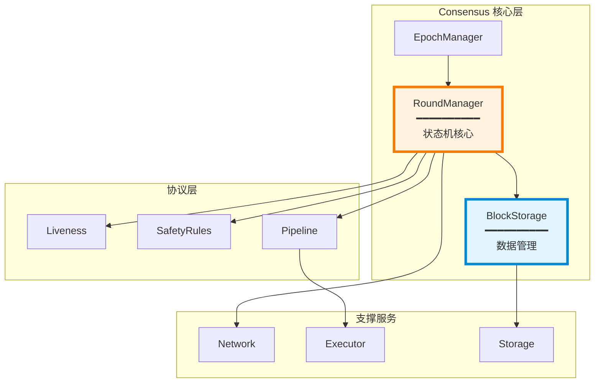
```mermaid
graph TB
    subgraph "Consensus 核心层"
        A[EpochManager]
        B[RoundManager<br/>━━━━━━━━━━<br/>状态机核心]
        C[BlockStorage<br/>━━━━━━━━━━<br/>数据管理]
    end

    subgraph "协议层"
        D[Liveness]
        E[SafetyRules]
        F[Pipeline]
    end

    subgraph "支撑服务"
        G[Network]
        H[Executor]
        I[Storage]
    end

    A --> B
    B --> C
    B --> D
    B --> E
    B --> F

    C --> I
    B --> G
    F --> H

    style B fill:#fff3e0,stroke:#f57c00,stroke-width:4px
    style C fill:#e1f5ff,stroke:#0288d1,stroke-width:4px
```

**定位说明**：
- **RoundManager**: 共识协议的"大脑"，协调所有组件
- **BlockStorage**: 共识协议的"记忆"，维护区块树和状态

### 1.2 核心职责

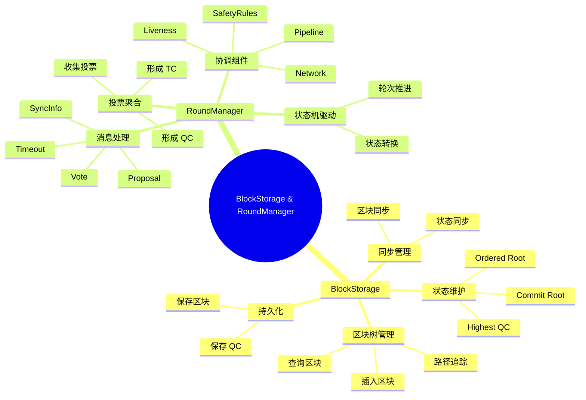
```mermaid
mindmap
  root((BlockStorage & RoundManager))
    BlockStorage
      区块树管理
        插入区块
        查询区块
        路径追踪
      状态维护
        Commit Root
        Ordered Root
        Highest QC
      同步管理
        区块同步
        状态同步
      持久化
        保存区块
        保存 QC
    RoundManager
      状态机驱动
        轮次推进
        状态转换
      消息处理
        Proposal
        Vote
        Timeout
        SyncInfo
      协调组件
        Liveness
        SafetyRules
        Pipeline
        Network
      投票聚合
        收集投票
        形成 QC
        形成 TC
```

### 1.3 模块交互

#### 完整交互图

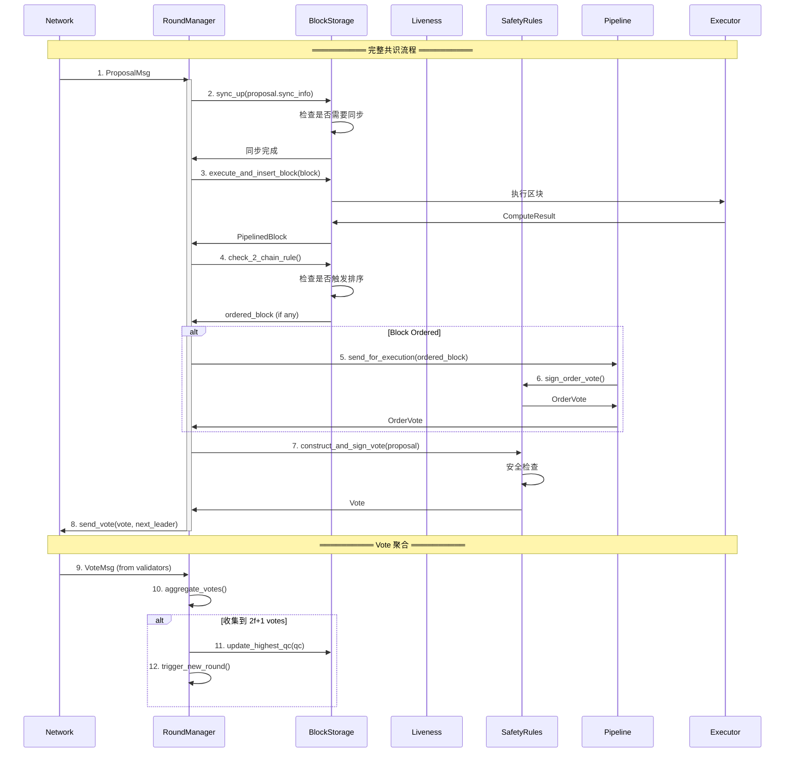
```mermaid
sequenceDiagram
    participant N as Network
    participant RM as RoundManager
    participant BS as BlockStorage
    participant LV as Liveness
    participant SR as SafetyRules
    participant PL as Pipeline
    participant EX as Executor

    Note over N,EX: ══════════ 完整共识流程 ══════════

    N->>RM: 1. ProposalMsg
    activate RM

    RM->>BS: 2. sync_up(proposal.sync_info)
    BS->>BS: 检查是否需要同步
    BS->>RM: 同步完成

    RM->>BS: 3. execute_and_insert_block(block)
    BS->>EX: 执行区块
    EX->>BS: ComputeResult
    BS->>RM: PipelinedBlock

    RM->>BS: 4. check_2_chain_rule()
    BS->>BS: 检查是否触发排序
    BS->>RM: ordered_block (if any)

    alt Block Ordered
        RM->>PL: 5. send_for_execution(ordered_block)
        PL->>SR: 6. sign_order_vote()
        SR->>PL: OrderVote
        PL->>RM: OrderVote
    end

    RM->>SR: 7. construct_and_sign_vote(proposal)
    SR->>SR: 安全检查
    SR->>RM: Vote

    RM->>N: 8. send_vote(vote, next_leader)

    deactivate RM

    Note over N,EX: ══════════ Vote 聚合 ══════════

    N->>RM: 9. VoteMsg (from validators)
    RM->>RM: 10. aggregate_votes()

    alt 收集到 2f+1 votes
        RM->>BS: 11. update_highest_qc(qc)
        RM->>RM: 12. trigger_new_round()
    end
```

---

## 2. BlockStorage 模块详解

### 2.1 模块架构

#### 文件组织结构

```
src/block_storage/
├── mod.rs                      # 模块接口定义 (300 LOC)
│   ├── BlockReader trait
│   └── BlockReaderWriter trait
│
├── block_store.rs              # BlockStore 实现 (1,800 LOC)
│   ├── BlockStore 结构
│   ├── 区块插入逻辑
│   ├── QC 更新逻辑
│   └── Commit 逻辑
│
├── block_tree.rs               # 区块树结构 (1,500 LOC)
│   ├── BlockTree 结构
│   ├── 区块查询
│   ├── 路径追踪
│   └── 树修剪 (pruning)
│
├── pending_blocks.rs           # 待处理区块 (600 LOC)
│   ├── PendingBlocks 结构
│   ├── 区块缓存
│   └── 依赖解析
│
├── sync_manager.rs             # 同步管理 (1,000 LOC)
│   ├── SyncManager 结构
│   ├── 区块请求
│   └── 超时处理
│
├── execution_pool.rs           # 执行池 (800 LOC)
│   ├── ExecutionPool 结构
│   ├── 推测执行
│   └── 结果缓存
│
└── tracing.rs                  # 追踪和监控 (400 LOC)
    ├── 性能指标
    └── 事件追踪
```

#### 模块依赖关系

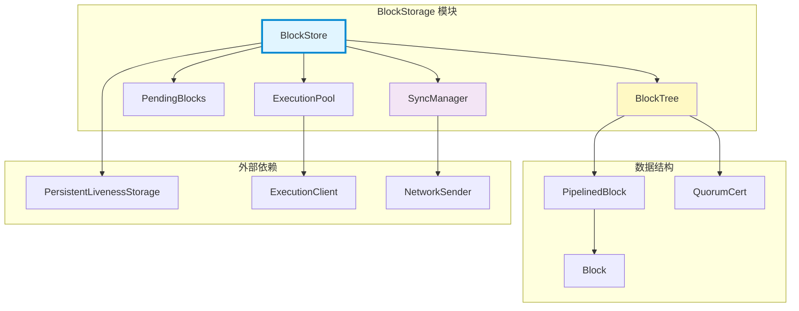
```mermaid
graph TB
    subgraph "BlockStorage 模块"
        A[BlockStore]
        B[BlockTree]
        C[PendingBlocks]
        D[SyncManager]
        E[ExecutionPool]
    end

    subgraph "数据结构"
        F[PipelinedBlock]
        G[QuorumCert]
        H[Block]
    end

    subgraph "外部依赖"
        I[PersistentLivenessStorage]
        J[ExecutionClient]
        K[NetworkSender]
    end

    A --> B
    A --> C
    A --> D
    A --> E

    B --> F
    B --> G
    F --> H

    A --> I
    E --> J
    D --> K

    style A fill:#e1f5ff,stroke:#0288d1,stroke-width:3px
    style B fill:#fff9c4
    style D fill:#f3e5f5
```

### 2.2 BlockStore 核心结构

#### 数据结构定义

```rust
// src/block_storage/block_store.rs

pub struct BlockStore {
    /// 区块树（核心数据结构）
    inner: Arc<RwLock<BlockTree>>,

    /// 最高 Timeout 证书
    highest_2chain_timeout_cert: Mutex<Option<Arc<TwoChainTimeoutCertificate>>>,

    /// 同步管理器
    sync_manager: Arc<SyncManager>,

    /// 执行池（推测执行）
    execution_pool: Arc<ExecutionPool>,

    /// 持久化存储
    storage: Arc<dyn PersistentLivenessStorage>,

    /// 时间服务
    time_service: Arc<dyn TimeService>,

    /// 执行客户端
    execution_client: Arc<dyn TExecutionClient>,

    /// 状态计算器
    state_computer: Arc<dyn StateComputer>,

    /// 是否启用 Order Vote
    order_vote_enabled: bool,
}
```

#### BlockStore 职责分解

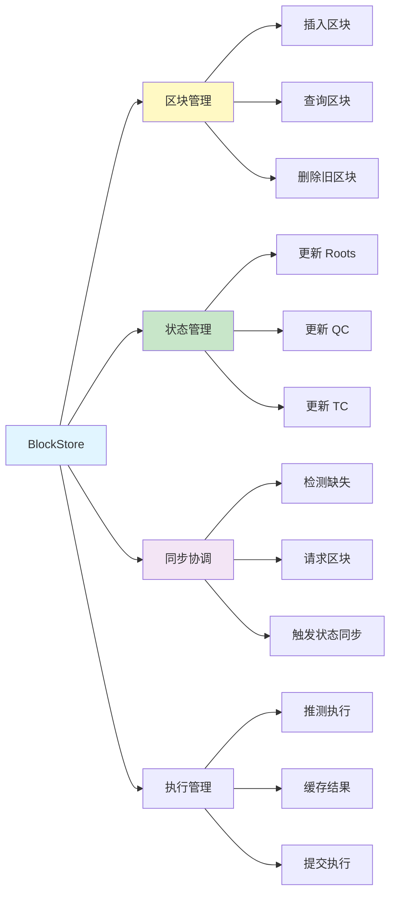
```mermaid
graph LR
    A[BlockStore] --> B[区块管理]
    A --> C[状态管理]
    A --> D[同步协调]
    A --> E[执行管理]

    B --> B1[插入区块]
    B --> B2[查询区块]
    B --> B3[删除旧区块]

    C --> C1[更新 Roots]
    C --> C2[更新 QC]
    C --> C3[更新 TC]

    D --> D1[检测缺失]
    D --> D2[请求区块]
    D --> D3[触发状态同步]

    E --> E1[推测执行]
    E --> E2[缓存结果]
    E --> E3[提交执行]

    style A fill:#e1f5ff
    style B fill:#fff9c4
    style C fill:#c8e6c9
    style D fill:#f3e5f5
```

#### BlockReader Trait 实现

```rust
// src/block_storage/mod.rs

pub trait BlockReader: Send + Sync {
    /// 检查区块是否存在
    /// 复杂度: O(1) - HashMap 查找
    fn block_exists(&self, block_id: HashValue) -> bool;

    /// 获取区块
    /// 复杂度: O(1)
    fn get_block(&self, block_id: HashValue) -> Option<Arc<PipelinedBlock>>;

    /// 获取已排序根区块
    /// 说明: 2-chain 规则触发后，区块被标记为 ordered
    fn ordered_root(&self) -> Arc<PipelinedBlock>;

    /// 获取已提交根区块
    /// 说明: 已持久化到 Storage 的最新区块
    fn commit_root(&self) -> Arc<PipelinedBlock>;

    /// 获取区块的 QC
    /// 复杂度: O(1)
    fn get_quorum_cert_for_block(
        &self,
        block_id: HashValue,
    ) -> Option<Arc<QuorumCert>>;

    /// 从 ordered_root 到指定区块的路径
    /// 复杂度: O(depth)
    /// 返回: [ordered_root, ..., block]
    fn path_from_ordered_root(
        &self,
        block_id: HashValue,
    ) -> Option<Vec<Arc<PipelinedBlock>>>;

    /// 从 commit_root 到指定区块的路径
    fn path_from_commit_root(
        &self,
        block_id: HashValue,
    ) -> Option<Vec<Arc<PipelinedBlock>>>;

    /// 获取最高 QC（用于生成 Proposal）
    fn highest_quorum_cert(&self) -> Arc<QuorumCert>;

    /// 获取最高 Order Cert
    fn highest_ordered_cert(&self) -> Arc<WrappedLedgerInfo>;

    /// 获取最高 Timeout Cert
    fn highest_2chain_timeout_cert(&self)
        -> Option<Arc<TwoChainTimeoutCertificate>>;

    /// 获取最高 Commit Cert
    fn highest_commit_cert(&self) -> Arc<WrappedLedgerInfo>;

    /// 构造同步信息（用于消息传播）
    fn sync_info(&self) -> SyncInfo;

    /// 检查是否处于反压状态
    /// 说明: Pipeline 积压过多时，延迟投票
    fn vote_back_pressure(&self) -> bool;

    /// Pipeline 待处理延迟
    fn pipeline_pending_latency(
        &self,
        proposal_timestamp: Duration,
    ) -> Duration;
}
```

### 2.3 BlockTree 数据结构

#### BlockTree 结构定义

```rust
// src/block_storage/block_tree.rs

pub struct BlockTree {
    /// 区块 ID 到区块的映射
    /// 索引: O(1) 查找
    id_to_block: HashMap<HashValue, Arc<PipelinedBlock>>,

    /// 区块 ID 到 QC 的映射
    /// 说明: 一个区块的 QC 是对它的 2f+1 投票聚合
    id_to_quorum_cert: HashMap<HashValue, Arc<QuorumCert>>,

    /// 已排序根区块
    /// 说明: 2-chain 规则触发后的最新区块
    ordered_root: Arc<PipelinedBlock>,

    /// 已提交根区块
    /// 说明: 已持久化到 Storage 的最新区块
    commit_root: Arc<PipelinedBlock>,

    /// 最高 QC
    /// 说明: 认证轮次最高的 QC
    highest_quorum_cert: Arc<QuorumCert>,

    /// 最高 Order Cert
    /// 说明: Pipeline 模式下的 Order QC
    highest_ordered_cert: Arc<WrappedLedgerInfo>,

    /// 最高 Commit Cert
    /// 说明: 最终提交证明
    highest_commit_cert: Arc<WrappedLedgerInfo>,

    /// 最高认证区块（可能未链接到树）
    /// 说明: 用于优化，避免重复执行
    highest_certified_block: Arc<PipelinedBlock>,

    /// 待处理区块（等待父区块）
    pending_blocks: PendingBlocks,

    /// 最大修剪窗口
    /// 说明: 保留多少个已提交区块
    max_pruned_blocks_in_mem: usize,
}
```

#### 区块树可视化

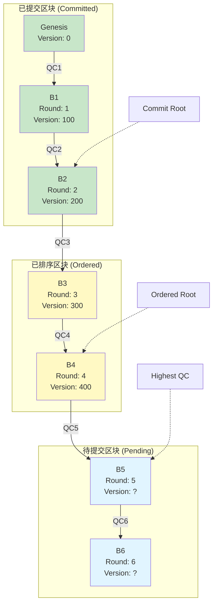
```mermaid
graph TB
    subgraph "已提交区块 (Committed)"
        A[Genesis<br/>Version: 0]
        B[B1<br/>Round: 1<br/>Version: 100]
        C[B2<br/>Round: 2<br/>Version: 200]
    end

    subgraph "已排序区块 (Ordered)"
        D[B3<br/>Round: 3<br/>Version: 300]
        E[B4<br/>Round: 4<br/>Version: 400]
    end

    subgraph "待提交区块 (Pending)"
        F[B5<br/>Round: 5<br/>Version: ?]
        G[B6<br/>Round: 6<br/>Version: ?]
    end

    A -->|QC1| B
    B -->|QC2| C
    C -->|QC3| D
    D -->|QC4| E
    E -->|QC5| F
    F -->|QC6| G

    H[Commit Root] -.-> C
    I[Ordered Root] -.-> E
    J[Highest QC] -.-> F

    style A fill:#c8e6c9
    style B fill:#c8e6c9
    style C fill:#c8e6c9
    style D fill:#fff9c4
    style E fill:#fff9c4
    style F fill:#e1f5ff
    style G fill:#e1f5ff
```

**状态说明**：
- **Committed**: 已持久化到 AptosDB
- **Ordered**: 2-chain 规则触发，可以执行
- **Pending**: 已收到但尚未提交

#### BlockTree 不变式

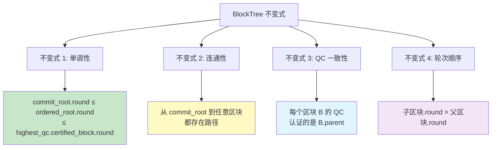
```mermaid
graph TD
    A[BlockTree 不变式] --> B[不变式 1: 单调性]
    A --> C[不变式 2: 连通性]
    A --> D[不变式 3: QC 一致性]
    A --> E[不变式 4: 轮次顺序]

    B --> B1[commit_root.round ≤ ordered_root.round<br/>≤ highest_qc.certified_block.round]

    C --> C1[从 commit_root 到任意区块<br/>都存在路径]

    D --> D1[每个区块 B 的 QC<br/>认证的是 B.parent]

    E --> E1[子区块.round > 父区块.round]

    style B1 fill:#c8e6c9
    style C1 fill:#fff9c4
    style D1 fill:#e1f5ff
    style E1 fill:#f3e5f5
```

### 2.4 区块树操作

#### 插入区块流程

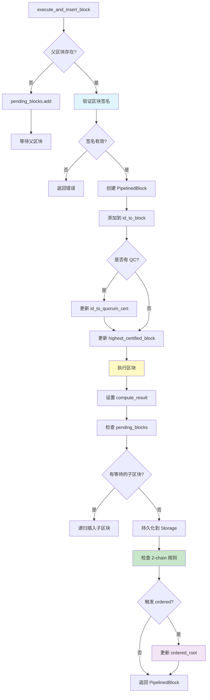
```mermaid
graph TD
    A[execute_and_insert_block] --> B{父区块存在?}

    B -->|否| C[pending_blocks.add]
    C --> D[等待父区块]

    B -->|是| E[验证区块签名]
    E --> F{签名有效?}

    F -->|否| G[返回错误]

    F -->|是| H[创建 PipelinedBlock]
    H --> I[添加到 id_to_block]

    I --> J{是否有 QC?}
    J -->|是| K[更新 id_to_quorum_cert]

    K --> L[更新 highest_certified_block]
    J -->|否| L

    L --> M[执行区块]
    M --> N[设置 compute_result]

    N --> O[检查 pending_blocks]
    O --> P{有等待的子区块?}

    P -->|是| Q[递归插入子区块]
    P -->|否| R[持久化到 Storage]

    R --> S[检查 2-chain 规则]
    S --> T{触发 ordered?}

    T -->|是| U[更新 ordered_root]
    T -->|否| V[返回 PipelinedBlock]

    U --> V

    style E fill:#e1f5ff
    style M fill:#fff9c4
    style S fill:#c8e6c9
    style U fill:#f3e5f5
```

**代码实现**：

```rust
// src/block_storage/block_store.rs

pub async fn execute_and_insert_block(
    &self,
    block: Block,
) -> anyhow::Result<Arc<PipelinedBlock>> {
    // ========================================
    // 步骤 1: 检查区块是否已存在
    // ========================================
    if let Some(existing_block) = self.get_block(block.id()) {
        debug!("Block {} already exists", block.id());
        return Ok(existing_block);
    }

    // ========================================
    // 步骤 2: 检查父区块是否存在
    // ========================================
    let parent_block = match self.get_block(block.parent_id()) {
        Some(parent) => parent,
        None => {
            // 父区块不存在，加入 pending_blocks
            info!(
                "Parent block {} not found for block {}, adding to pending",
                block.parent_id(),
                block.id()
            );

            let mut tree = self.inner.write().unwrap();
            tree.pending_blocks.add(block);
            bail!("Parent block not found");
        }
    };

    // ========================================
    // 步骤 3: 验证区块签名
    // ========================================
    block.verify_signature(&self.epoch_state.verifier)?;

    // ========================================
    // 步骤 4: 创建 PipelinedBlock
    // ========================================
    let pipelined_block = Arc::new(PipelinedBlock::new(
        block.clone(),
        Some(parent_block.clone()),
    ));

    // ========================================
    // 步骤 5: 插入到区块树
    // ========================================
    {
        let mut tree = self.inner.write().unwrap();

        // 添加到 id_to_block
        tree.id_to_block.insert(block.id(), pipelined_block.clone());

        // 如果区块有 QC，添加到 id_to_quorum_cert
        if let Some(qc) = block.quorum_cert() {
            tree.id_to_quorum_cert.insert(qc.certified_block().id(), qc.clone());
        }

        // 更新 highest_certified_block
        if block.round() > tree.highest_certified_block.round() {
            tree.highest_certified_block = pipelined_block.clone();
        }
    }

    // ========================================
    // 步骤 6: 执行区块（推测执行）
    // ========================================
    let compute_result = self.execution_pool
        .execute_block(pipelined_block.clone())
        .await?;

    pipelined_block.set_compute_result(
        compute_result,
        self.time_service.now(),
    );

    // ========================================
    // 步骤 7: 检查是否有等待的子区块
    // ========================================
    let pending_children = {
        let mut tree = self.inner.write().unwrap();
        tree.pending_blocks.remove_children(block.id())
    };

    // 递归插入子区块
    for child_block in pending_children {
        self.execute_and_insert_block(child_block).await?;
    }

    // ========================================
    // 步骤 8: 持久化到存储
    // ========================================
    self.storage
        .save_tree(vec![pipelined_block.clone()])
        .await?;

    // ========================================
    // 步骤 9: 检查 2-chain 规则
    // ========================================
    self.check_and_update_ordered_root(&pipelined_block)?;

    info!(
        "Inserted block {}, round {}, parent {}",
        block.id(),
        block.round(),
        block.parent_id()
    );

    Ok(pipelined_block)
}
```

#### 2-Chain 检查逻辑

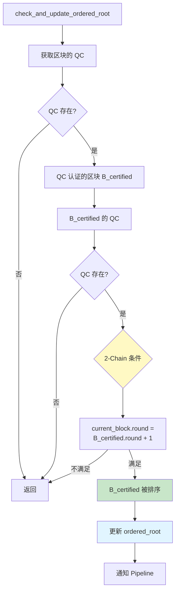
```mermaid
graph TD
    A[check_and_update_ordered_root] --> B[获取区块的 QC]

    B --> C{QC 存在?}
    C -->|否| D[返回]

    C -->|是| E[QC 认证的区块 B_certified]
    E --> F[B_certified 的 QC]

    F --> G{QC 存在?}
    G -->|否| D

    G -->|是| H{2-Chain 条件}
    H --> I[current_block.round =<br/>B_certified.round + 1]

    I -->|满足| J[B_certified 被排序]
    I -->|不满足| D

    J --> K[更新 ordered_root]
    K --> L[通知 Pipeline]

    style H fill:#fff9c4
    style J fill:#c8e6c9
    style K fill:#e1f5ff
```

**代码实现**：

```rust
fn check_and_update_ordered_root(
    &self,
    block: &Arc<PipelinedBlock>,
) -> anyhow::Result<()> {
    // 获取区块的 QC
    let qc = match self.get_quorum_cert_for_block(block.id()) {
        Some(qc) => qc,
        None => return Ok(()), // 没有 QC，不能触发排序
    };

    // QC 认证的区块
    let certified_block_id = qc.certified_block().id();
    let certified_block = match self.get_block(certified_block_id) {
        Some(b) => b,
        None => return Ok(()), // 被认证的区块不在树中
    };

    // 检查 2-chain 规则: block.round == certified_block.round + 1
    if block.round() != certified_block.round() + 1 {
        return Ok(()); // 不是连续轮次
    }

    // certified_block 的 QC
    let parent_qc = certified_block.quorum_cert();
    if parent_qc.is_none() {
        return Ok(()); // 没有父 QC
    }

    // 2-Chain 规则满足！
    // certified_block（以及它的祖先）可以被排序

    info!(
        "2-Chain triggered: block {} ordered at round {}",
        certified_block.id(),
        certified_block.round()
    );

    // 更新 ordered_root
    let mut tree = self.inner.write().unwrap();
    if certified_block.round() > tree.ordered_root.round() {
        tree.ordered_root = certified_block.clone();

        // 通知 Pipeline 执行 ordered blocks
        self.notify_ordered_blocks()?;
    }

    Ok(())
}
```

#### 提交区块流程

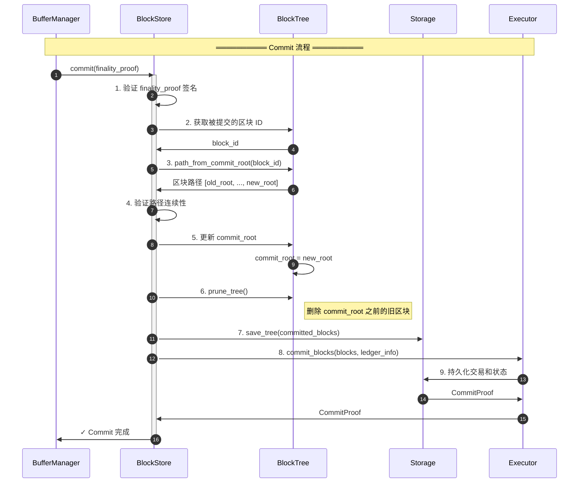
```mermaid
sequenceDiagram
    autonumber
    participant BM as BufferManager
    participant BS as BlockStore
    participant BT as BlockTree
    participant ST as Storage
    participant EX as Executor

    Note over BM,EX: ══════════ Commit 流程 ══════════

    BM->>BS: commit(finality_proof)
    activate BS

    BS->>BS: 1. 验证 finality_proof 签名
    BS->>BT: 2. 获取被提交的区块 ID
    BT->>BS: block_id

    BS->>BT: 3. path_from_commit_root(block_id)
    BT->>BS: 区块路径 [old_root, ..., new_root]

    BS->>BS: 4. 验证路径连续性

    BS->>BT: 5. 更新 commit_root
    BT->>BT: commit_root = new_root

    BS->>BT: 6. prune_tree()
    Note right of BT: 删除 commit_root 之前的旧区块

    BS->>ST: 7. save_tree(committed_blocks)
    BS->>EX: 8. commit_blocks(blocks, ledger_info)

    EX->>ST: 9. 持久化交易和状态
    ST->>EX: CommitProof

    EX->>BS: CommitProof
    BS->>BM: ✓ Commit 完成

    deactivate BS
```

**代码实现**：

```rust
pub async fn commit(
    &self,
    finality_proof: LedgerInfoWithSignatures,
) -> anyhow::Result<()> {
    // ========================================
    // 步骤 1: 验证 finality_proof
    // ========================================
    self.epoch_state
        .verifier
        .verify_ledger_info(&finality_proof)?;

    let commit_block_id = finality_proof.ledger_info().consensus_block_id();

    // ========================================
    // 步骤 2: 获取从当前 commit_root 到新 commit_root 的路径
    // ========================================
    let blocks_to_commit = {
        let tree = self.inner.read().unwrap();
        tree.path_from_commit_root(commit_block_id)
            .ok_or_else(|| anyhow!("Commit block not in tree"))?
    };

    // ========================================
    // 步骤 3: 验证路径连续性
    // ========================================
    for window in blocks_to_commit.windows(2) {
        ensure!(
            window[1].parent_id() == window[0].id(),
            "Blocks not consecutive"
        );
    }

    // ========================================
    // 步骤 4: 更新 commit_root
    // ========================================
    {
        let mut tree = self.inner.write().unwrap();
        let new_commit_root = blocks_to_commit.last().unwrap().clone();
        tree.commit_root = new_commit_root;

        info!(
            "Updated commit_root to block {}, round {}",
            tree.commit_root.id(),
            tree.commit_root.round()
        );
    }

    // ========================================
    // 步骤 5: 修剪旧区块（prune）
    // ========================================
    self.prune_tree()?;

    // ========================================
    // 步骤 6: 持久化到 Storage
    // ========================================
    self.storage
        .save_tree(blocks_to_commit.clone())
        .await?;

    // ========================================
    // 步骤 7: 通知 Executor 提交
    // ========================================
    let commit_proof = self.execution_client
        .commit_blocks(blocks_to_commit, finality_proof)
        .await?;

    info!("Committed blocks up to {}", commit_block_id);

    Ok(())
}
```

#### 树修剪（Pruning）

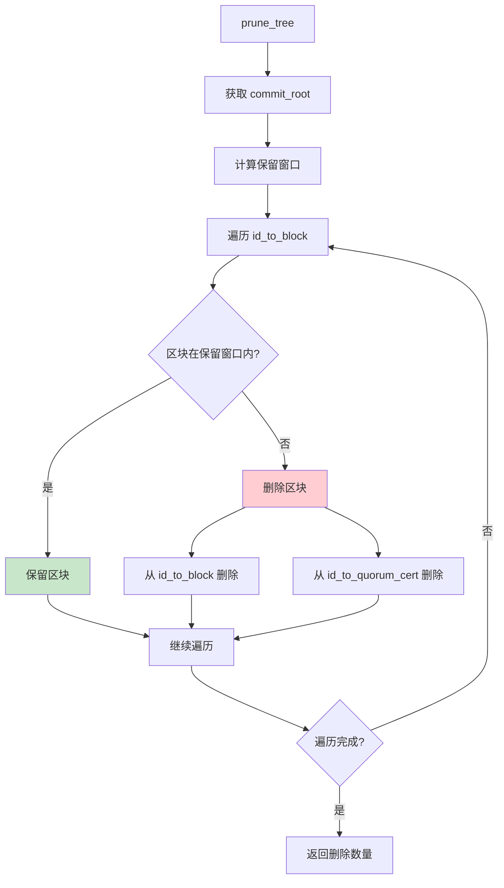
```mermaid
graph TD
    A[prune_tree] --> B[获取 commit_root]
    B --> C[计算保留窗口]

    C --> D[遍历 id_to_block]
    D --> E{区块在保留窗口内?}

    E -->|是| F[保留区块]
    E -->|否| G[删除区块]

    G --> H[从 id_to_block 删除]
    G --> I[从 id_to_quorum_cert 删除]

    F --> J[继续遍历]
    H --> J
    I --> J

    J --> K{遍历完成?}
    K -->|否| D
    K -->|是| L[返回删除数量]

    style G fill:#ffcdd2
    style F fill:#c8e6c9
```

### 2.5 持久化机制

#### PersistentLivenessStorage Trait

```rust
// aptos-storage-interface/src/persistent_liveness_storage.rs

pub trait PersistentLivenessStorage: Send + Sync {
    /// 保存区块树
    fn save_tree(
        &self,
        blocks: Vec<Arc<PipelinedBlock>>,
    ) -> Result<()>;

    /// 恢复区块树
    fn recover_from_ledger(&self) -> Result<RecoveryData>;

    /// 保存投票
    fn save_vote(&self, vote: &Vote) -> Result<()>;

    /// 保存 QC
    fn save_quorum_cert(&self, qc: &QuorumCert) -> Result<()>;
}
```

#### 持久化策略

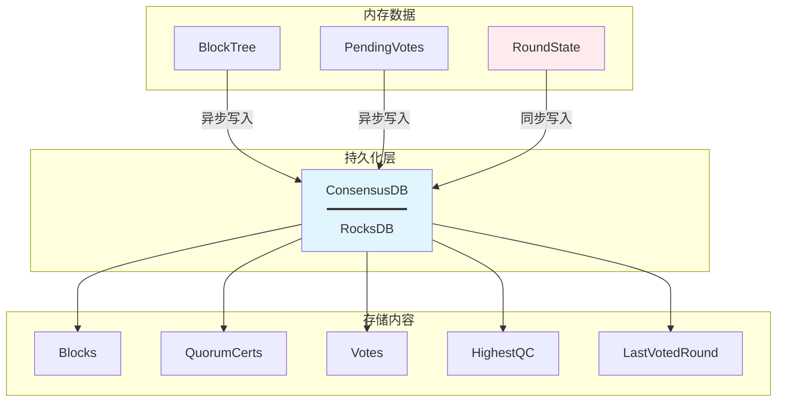
```mermaid
graph TB
    subgraph "内存数据"
        A[BlockTree]
        B[PendingVotes]
        C[RoundState]
    end

    subgraph "持久化层"
        D[ConsensusDB<br/>━━━━━━━━━━<br/>RocksDB]
    end

    subgraph "存储内容"
        E[Blocks]
        F[QuorumCerts]
        G[Votes]
        H[HighestQC]
        I[LastVotedRound]
    end

    A -->|异步写入| D
    B -->|异步写入| D
    C -->|同步写入| D

    D --> E
    D --> F
    D --> G
    D --> H
    D --> I

    style D fill:#e1f5ff
    style C fill:#ffebee
```

**持久化时机**：

| 操作 | 持久化内容 | 时机 | 重要性 |
|-----|-----------|-----|-------|
| 插入区块 | Block, QC | 异步，批量 | ⭐⭐⭐ |
| 更新 QC | QuorumCert | 异步 | ⭐⭐⭐ |
| 投票 | Vote | 同步（通过 SafetyRules） | ⭐⭐⭐⭐⭐ |
| Commit | CommitProof | 同步 | ⭐⭐⭐⭐⭐ |

---

## 3. RoundManager 模块详解

### 3.1 状态机架构

#### 状态机概览

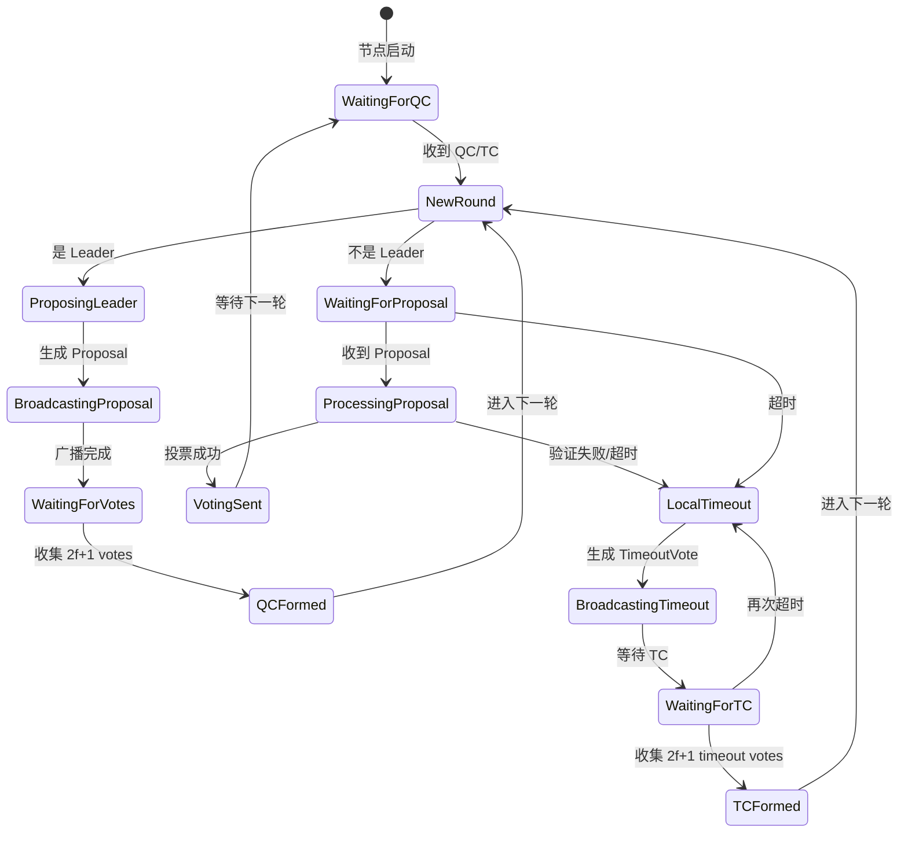
```mermaid
stateDiagram-v2
    [*] --> WaitingForQC: 节点启动

    WaitingForQC --> NewRound: 收到 QC/TC

    NewRound --> ProposingLeader: 是 Leader
    NewRound --> WaitingForProposal: 不是 Leader

    ProposingLeader --> BroadcastingProposal: 生成 Proposal
    BroadcastingProposal --> WaitingForVotes: 广播完成

    WaitingForProposal --> ProcessingProposal: 收到 Proposal
    ProcessingProposal --> VotingSent: 投票成功
    ProcessingProposal --> LocalTimeout: 验证失败/超时

    WaitingForVotes --> QCFormed: 收集 2f+1 votes
    VotingSent --> WaitingForQC: 等待下一轮

    QCFormed --> NewRound: 进入下一轮

    LocalTimeout --> BroadcastingTimeout: 生成 TimeoutVote
    BroadcastingTimeout --> WaitingForTC: 等待 TC

    WaitingForTC --> TCFormed: 收集 2f+1 timeout votes
    TCFormed --> NewRound: 进入下一轮

    WaitingForProposal --> LocalTimeout: 超时
    WaitingForTC --> LocalTimeout: 再次超时
```

#### 事件驱动模型

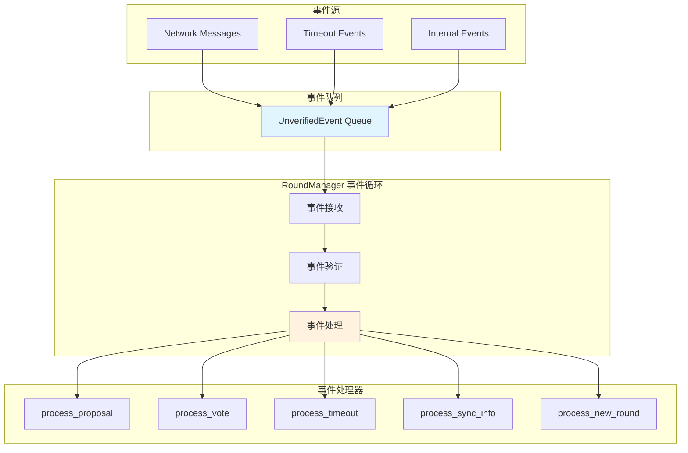
```mermaid
graph TB
    subgraph "事件源"
        A[Network Messages]
        B[Timeout Events]
        C[Internal Events]
    end

    subgraph "事件队列"
        D[UnverifiedEvent Queue]
    end

    subgraph "RoundManager 事件循环"
        E[事件接收]
        F[事件验证]
        G[事件处理]
    end

    subgraph "事件处理器"
        H[process_proposal]
        I[process_vote]
        J[process_timeout]
        K[process_sync_info]
        L[process_new_round]
    end

    A --> D
    B --> D
    C --> D

    D --> E
    E --> F
    F --> G

    G --> H
    G --> I
    G --> J
    G --> K
    G --> L

    style D fill:#e1f5ff
    style G fill:#fff3e0
```

### 3.2 RoundManager 结构

#### 完整结构定义

```rust
// src/round_manager.rs

pub struct RoundManager {
    // ========================================
    // 核心状态
    // ========================================

    /// 当前轮次状态
    round_state: RoundState,

    /// Epoch 状态（验证者集合）
    epoch_state: Arc<EpochState>,

    /// 本节点作者
    author: Author,

    // ========================================
    // 存储和数据
    // ========================================

    /// 区块存储
    block_store: Arc<BlockStore>,

    /// 持久化存储
    storage: Arc<dyn PersistentLivenessStorage>,

    // ========================================
    // 协议组件
    // ========================================

    /// 提案生成器
    proposal_generator: ProposalGenerator,

    /// Proposer 选举
    proposer_election: Arc<dyn ProposerElection>,

    /// 安全规则
    safety_rules: Arc<Mutex<MetricsSafetyRules>>,

    // ========================================
    // 投票管理
    // ========================================

    /// 待处理投票（Proposal Votes）
    pending_votes: Arc<PendingVotes>,

    /// 待处理 Order 投票
    pending_order_votes: Arc<PendingOrderVotes>,

    /// 待处理 Commit 投票
    pending_commit_votes: Arc<PendingCommitVotes>,

    // ========================================
    // 网络和执行
    // ========================================

    /// 网络发送器
    network: Arc<NetworkSender>,

    /// 执行客户端
    execution_client: Arc<dyn TExecutionClient>,

    /// 状态计算器
    state_computer: Arc<dyn StateComputer>,

    // ========================================
    // 配置和优化
    // ========================================

    /// 随机数配置
    rand_config: Option<RandConfig>,

    /// 是否启用 Order Vote
    order_vote_enabled: bool,

    /// 反压检查
    back_pressure_limit: Option<Round>,

    /// 是否启用 Quorum Store
    quorum_store_enabled: bool,
}
```

#### 组件依赖图

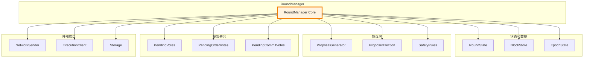
```mermaid
graph TB
    subgraph "RoundManager"
        A[RoundManager Core]
    end

    subgraph "状态和数据"
        B[RoundState]
        C[BlockStore]
        D[EpochState]
    end

    subgraph "协议层"
        E[ProposalGenerator]
        F[ProposerElection]
        G[SafetyRules]
    end

    subgraph "投票聚合"
        H[PendingVotes]
        I[PendingOrderVotes]
        J[PendingCommitVotes]
    end

    subgraph "外部接口"
        K[NetworkSender]
        L[ExecutionClient]
        M[Storage]
    end

    A --> B
    A --> C
    A --> D

    A --> E
    A --> F
    A --> G

    A --> H
    A --> I
    A --> J

    A --> K
    A --> L
    A --> M

    style A fill:#fff3e0,stroke:#f57c00,stroke-width:4px
```

### 3.3 事件处理

#### 事件类型定义

```rust
// src/round_manager.rs

/// 未验证的事件（从网络接收）
pub enum UnverifiedEvent {
    /// 提案消息
    ProposalMsg(Box<ProposalMsg>),

    /// 投票消息
    VoteMsg(Box<VoteMsg>),

    /// 超时消息
    RoundTimeoutMsg(Box<RoundTimeoutMsg>),

    /// Order Vote 消息
    OrderVoteMsg(Box<OrderVoteMsg>),

    /// Commit Vote 消息
    CommitVoteMsg(Box<CommitVoteMsg>),

    /// 同步信息
    SyncInfo(Box<SyncInfo>),

    /// Epoch 变更
    EpochChange(EpochChangeProof),

    /// 本地超时
    LocalTimeout(Round),

    /// 新轮次事件
    NewRound(NewRoundEvent),
}

/// 已验证的事件（已通过签名验证）
pub enum VerifiedEvent {
    ProposalMsg(Box<ProposalMsg>),
    VoteMsg(Box<VoteMsg>),
    OrderVoteMsg(Box<OrderVoteMsg>),
    CommitVote(Box<CommitVote>),
    RoundTimeout(Box<RoundTimeout>),
    SyncInfo(Box<SyncInfo>),
}
```

#### 主事件循环

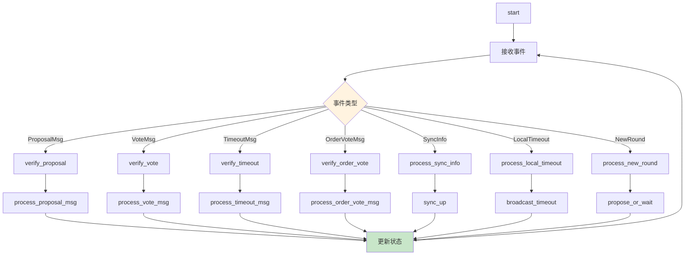
```mermaid
graph TD
    A[start] --> B[接收事件]

    B --> C{事件类型}

    C -->|ProposalMsg| D1[verify_proposal]
    C -->|VoteMsg| D2[verify_vote]
    C -->|TimeoutMsg| D3[verify_timeout]
    C -->|OrderVoteMsg| D4[verify_order_vote]
    C -->|SyncInfo| D5[process_sync_info]
    C -->|LocalTimeout| D6[process_local_timeout]
    C -->|NewRound| D7[process_new_round]

    D1 --> E1[process_proposal_msg]
    D2 --> E2[process_vote_msg]
    D3 --> E3[process_timeout_msg]
    D4 --> E4[process_order_vote_msg]
    D5 --> E5[sync_up]
    D6 --> E6[broadcast_timeout]
    D7 --> E7[propose_or_wait]

    E1 --> F[更新状态]
    E2 --> F
    E3 --> F
    E4 --> F
    E5 --> F
    E6 --> F
    E7 --> F

    F --> B

    style C fill:#fff3e0
    style F fill:#c8e6c9
```

**代码实现**：

```rust
pub async fn start(
    mut self,
    event_rx: aptos_channel::Receiver<UnverifiedEvent>,
    close_rx: oneshot::Receiver<oneshot::Sender<()>>,
) {
    info!("RoundManager started");

    loop {
        tokio::select! {
            // 接收事件
            Some(event) = event_rx.next() => {
                match event {
                    UnverifiedEvent::ProposalMsg(proposal) => {
                        if let Err(e) = self.process_proposal_msg(*proposal).await {
                            error!("Failed to process proposal: {:?}", e);
                        }
                    }

                    UnverifiedEvent::VoteMsg(vote) => {
                        if let Err(e) = self.process_vote_msg(*vote).await {
                            error!("Failed to process vote: {:?}", e);
                        }
                    }

                    UnverifiedEvent::RoundTimeoutMsg(timeout) => {
                        if let Err(e) = self.process_timeout_msg(*timeout).await {
                            error!("Failed to process timeout: {:?}", e);
                        }
                    }

                    UnverifiedEvent::OrderVoteMsg(order_vote) => {
                        if let Err(e) = self.process_order_vote_msg(*order_vote).await {
                            error!("Failed to process order vote: {:?}", e);
                        }
                    }

                    UnverifiedEvent::SyncInfo(sync_info) => {
                        if let Err(e) = self.process_sync_info(*sync_info).await {
                            error!("Failed to process sync info: {:?}", e);
                        }
                    }

                    UnverifiedEvent::LocalTimeout(round) => {
                        if let Err(e) = self.process_local_timeout(round).await {
                            error!("Failed to process local timeout: {:?}", e);
                        }
                    }

                    UnverifiedEvent::NewRound(event) => {
                        if let Err(e) = self.process_new_round_event(event).await {
                            error!("Failed to process new round: {:?}", e);
                        }
                    }

                    UnverifiedEvent::EpochChange(proof) => {
                        info!("Epoch change detected");
                        // Epoch 切换由 EpochManager 处理
                        break;
                    }
                }
            }

            // 关闭信号
            Ok(ack_sender) = &mut close_rx => {
                info!("RoundManager shutting down");
                let _ = ack_sender.send(());
                break;
            }
        }
    }

    info!("RoundManager stopped");
}
```

### 3.4 轮次管理

#### RoundState 结构

```rust
// src/liveness/round_state.rs

pub struct RoundState {
    /// 当前轮次
    current_round: Round,

    /// 最高认证轮次（Highest QC Round）
    highest_certified_round: Round,

    /// 最高超时轮次
    highest_timeout_round: Round,

    /// 待处理投票
    pending_votes: Arc<PendingVotes>,

    /// 超时定时器
    round_timeout_sender: Option<oneshot::Sender<Round>>,

    /// 超时配置
    round_time_interval: Duration,
}
```

#### 轮次推进流程

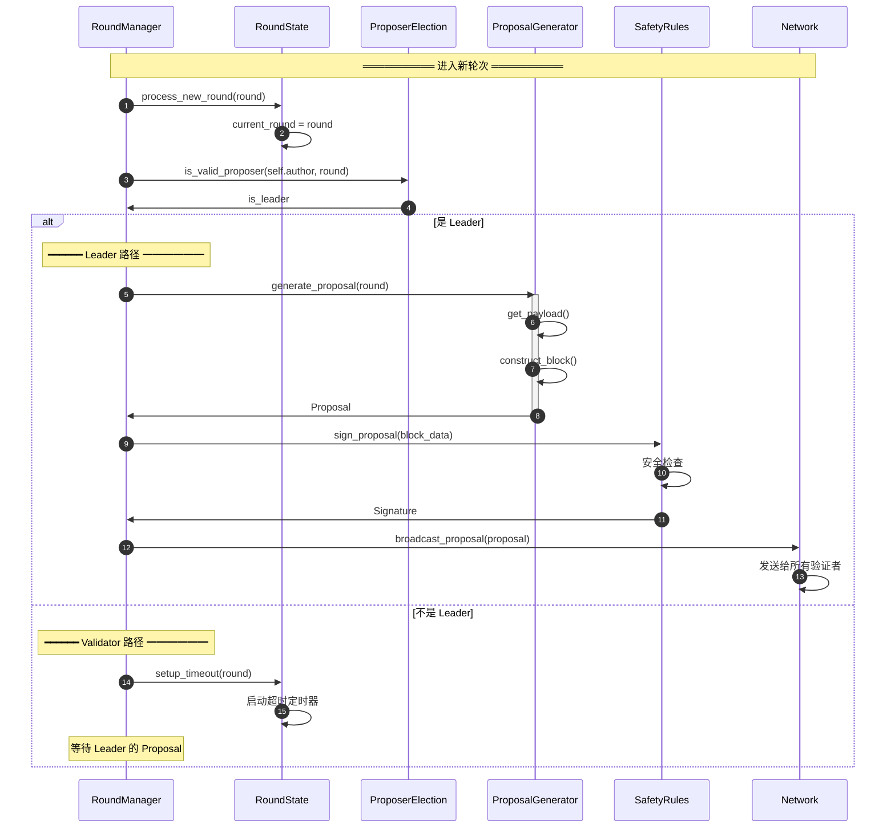
```mermaid
sequenceDiagram
    autonumber
    participant RM as RoundManager
    participant RS as RoundState
    participant PE as ProposerElection
    participant PG as ProposalGenerator
    participant SR as SafetyRules
    participant NET as Network

    Note over RM,NET: ══════════ 进入新轮次 ══════════

    RM->>RS: process_new_round(round)
    RS->>RS: current_round = round

    RM->>PE: is_valid_proposer(self.author, round)
    PE->>RM: is_leader

    alt 是 Leader
        Note over RM: ━━━━━━ Leader 路径 ━━━━━━

        RM->>PG: generate_proposal(round)
        activate PG

        PG->>PG: get_payload()
        PG->>PG: construct_block()

        PG->>RM: Proposal
        deactivate PG

        RM->>SR: sign_proposal(block_data)
        SR->>SR: 安全检查
        SR->>RM: Signature

        RM->>NET: broadcast_proposal(proposal)
        NET->>NET: 发送给所有验证者

    else 不是 Leader
        Note over RM: ━━━━━━ Validator 路径 ━━━━━━

        RM->>RS: setup_timeout(round)
        RS->>RS: 启动超时定时器

        Note over RM: 等待 Leader 的 Proposal
    end
```

### 3.5 消息处理流程

#### Proposal 处理详细流程

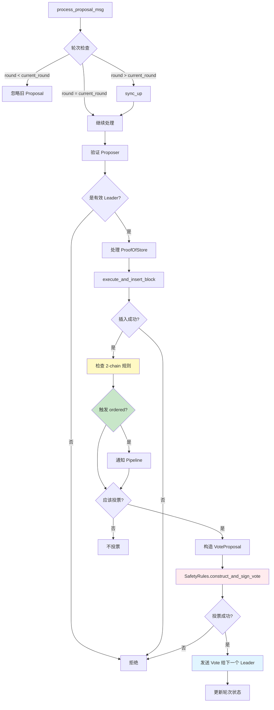
```mermaid
graph TD
    A[process_proposal_msg] --> B{轮次检查}

    B -->|round < current_round| C[忽略旧 Proposal]
    B -->|round > current_round| D[sync_up]
    B -->|round = current_round| E[继续处理]

    D --> E

    E --> F[验证 Proposer]
    F --> G{是有效 Leader?}

    G -->|否| H[拒绝]

    G -->|是| I[处理 ProofOfStore]
    I --> J[execute_and_insert_block]

    J --> K{插入成功?}
    K -->|否| H

    K -->|是| L[检查 2-chain 规则]
    L --> M{触发 ordered?}

    M -->|是| N[通知 Pipeline]

    M --> O{应该投票?}
    N --> O

    O -->|是| P[构造 VoteProposal]
    O -->|否| Q[不投票]

    P --> R[SafetyRules.construct_and_sign_vote]
    R --> S{投票成功?}

    S -->|是| T[发送 Vote 给下一个 Leader]
    S -->|否| H

    T --> U[更新轮次状态]

    style L fill:#fff9c4
    style M fill:#c8e6c9
    style R fill:#ffebee
    style T fill:#e1f5ff
```

**代码实现**：

```rust
async fn process_proposal_msg(
    &mut self,
    proposal: ProposalMsg,
) -> anyhow::Result<()> {
    let block = proposal.proposal();

    info!(
        "Received proposal from {}: round {}, block {}",
        proposal.proposer(),
        block.round(),
        block.id()
    );

    // ========================================
    // 步骤 1: 轮次检查
    // ========================================
    if block.round() < self.round_state.current_round() {
        debug!("Ignoring old proposal from round {}", block.round());
        return Ok(());
    }

    // ========================================
    // 步骤 2: 同步到 Proposal 的状态
    // ========================================
    self.sync_up(&proposal.sync_info()).await?;

    // ========================================
    // 步骤 3: 验证 Proposer
    // ========================================
    let valid_proposer = self.proposer_election
        .is_valid_proposer(proposal.proposer(), block.round());

    ensure!(valid_proposer, "Invalid proposer");

    // ========================================
    // 步骤 4: 处理 QuorumStore ProofOfStore
    // ========================================
    if self.quorum_store_enabled {
        if let Some(proofs) = proposal.proofs_with_data() {
            // 缓存 Batch 数据
            for proof in proofs {
                self.quorum_store_client.insert_proof(proof).await?;
            }
        }
    }

    // ========================================
    // 步骤 5: 插入区块到 BlockStore
    // ========================================
    let pipelined_block = self.block_store
        .execute_and_insert_block(block.clone())
        .await?;

    // ========================================
    // 步骤 6: 检查 2-chain 规则
    // ========================================
    // 如果触发了排序，BlockStore 会通知 Pipeline

    // ========================================
    // 步骤 7: 检查是否应该投票
    // ========================================
    if !self.should_vote(&pipelined_block) {
        info!(
            "Not voting for block {}: back pressure or other reasons",
            block.id()
        );
        return Ok(());
    }

    // ========================================
    // 步骤 8: 构造 VoteProposal
    // ========================================
    let vote_proposal = VoteProposal {
        block: block.block_data().clone(),
        quorum_cert: block.quorum_cert().clone(),
        timeout_cert: proposal.sync_info().highest_timeout_cert().cloned(),
    };

    // ========================================
    // 步骤 9: 调用 SafetyRules 生成投票
    // ========================================
    let vote = self.safety_rules
        .lock()
        .unwrap()
        .construct_and_sign_vote_two_chain(
            &vote_proposal,
            vote_proposal.timeout_cert.as_ref(),
        )?;

    info!(
        "Voted for block {}, round {}",
        block.id(),
        block.round()
    );

    // ========================================
    // 步骤 10: 发送投票给下一个 Leader
    // ========================================
    let next_round = block.round() + 1;
    let next_leader = self.proposer_election
        .get_valid_proposer(next_round);

    self.network
        .send_vote(vote, next_leader)
        .await?;

    // ========================================
    // 步骤 11: 更新轮次状态
    // ========================================
    self.round_state.record_vote(block.round());

    Ok(())
}
```

#### Vote 处理流程

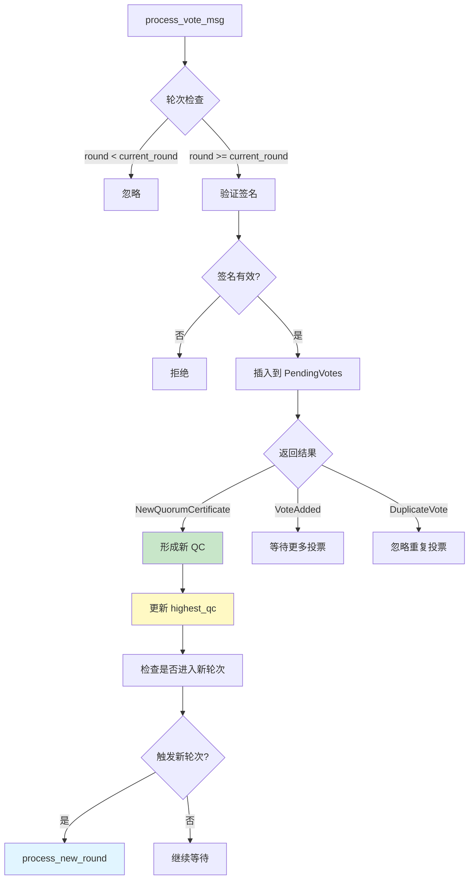
```mermaid
graph TD
    A[process_vote_msg] --> B{轮次检查}

    B -->|round < current_round| C[忽略]
    B -->|round >= current_round| D[验证签名]

    D --> E{签名有效?}
    E -->|否| F[拒绝]

    E -->|是| G[插入到 PendingVotes]
    G --> H{返回结果}

    H -->|NewQuorumCertificate| I[形成新 QC]
    H -->|VoteAdded| J[等待更多投票]
    H -->|DuplicateVote| K[忽略重复投票]

    I --> L[更新 highest_qc]
    L --> M[检查是否进入新轮次]
    M --> N{触发新轮次?}

    N -->|是| O[process_new_round]
    N -->|否| P[继续等待]

    style I fill:#c8e6c9
    style L fill:#fff9c4
    style O fill:#e1f5ff
```

**代码实现**：

```rust
async fn process_vote_msg(
    &mut self,
    vote_msg: VoteMsg,
) -> anyhow::Result<()> {
    let vote = vote_msg.vote();

    debug!(
        "Received vote from {}: round {}, block {}",
        vote.author(),
        vote.round(),
        vote.vote_data().proposed().id()
    );

    // ========================================
    // 步骤 1: 轮次检查
    // ========================================
    if vote.round() < self.round_state.current_round() {
        debug!("Ignoring old vote from round {}", vote.round());
        return Ok(());
    }

    // ========================================
    // 步骤 2: 验证签名
    // ========================================
    vote.verify(&self.epoch_state.verifier)?;

    // ========================================
    // 步骤 3: 插入投票到 PendingVotes
    // ========================================
    let vote_reception = self.pending_votes
        .insert_vote(vote, &self.epoch_state.verifier);

    match vote_reception {
        VoteReceptionResult::NewQuorumCertificate(qc) => {
            info!(
                "Formed QC for block {}, round {}",
                qc.certified_block().id(),
                qc.certified_block().round()
            );

            // 处理新 QC
            self.process_new_qc(qc).await?;
        }

        VoteReceptionResult::VoteAdded(author) => {
            debug!("Added vote from {}, waiting for more", author);
        }

        VoteReceptionResult::DuplicateVote => {
            debug!("Duplicate vote from {}", vote.author());
        }

        VoteReceptionResult::InvalidSignature => {
            warn!("Invalid signature from {}", vote.author());
        }

        _ => {}
    }

    Ok(())
}

async fn process_new_qc(
    &mut self,
    qc: Arc<QuorumCert>,
) -> anyhow::Result<()> {
    // ========================================
    // 步骤 1: 更新 BlockStore 的 highest_qc
    // ========================================
    self.block_store.update_highest_qc(qc.clone())?;

    // ========================================
    // 步骤 2: 更新 RoundState
    // ========================================
    self.round_state.update_highest_certified_round(
        qc.certified_block().round()
    );

    // ========================================
    // 步骤 3: 检查是否进入新轮次
    // ========================================
    let next_round = qc.certified_block().round() + 1;

    if next_round > self.round_state.current_round() {
        // 触发新轮次
        let new_round_event = NewRoundEvent {
            round: next_round,
            reason: NewRoundReason::QCReady,
            sync_info: self.block_store.sync_info(),
        };

        self.process_new_round_event(new_round_event).await?;
    }

    Ok(())
}
```

#### Timeout 处理流程

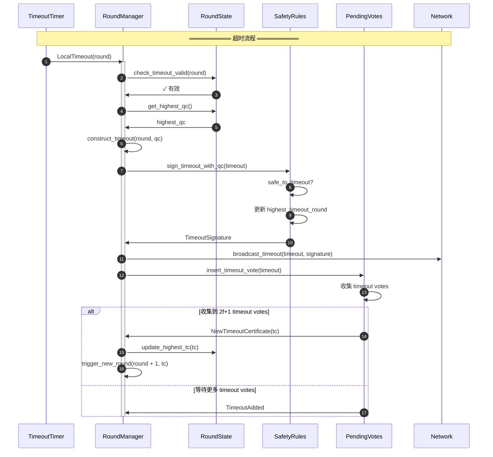
```mermaid
sequenceDiagram
    autonumber
    participant TO as TimeoutTimer
    participant RM as RoundManager
    participant RS as RoundState
    participant SR as SafetyRules
    participant PV as PendingVotes
    participant NET as Network

    Note over TO,NET: ══════════ 超时流程 ══════════

    TO->>RM: LocalTimeout(round)
    activate RM

    RM->>RS: check_timeout_valid(round)
    RS->>RM: ✓ 有效

    RM->>RS: get_highest_qc()
    RS->>RM: highest_qc

    RM->>RM: construct_timeout(round, qc)

    RM->>SR: sign_timeout_with_qc(timeout)
    SR->>SR: safe_to_timeout?
    SR->>SR: 更新 highest_timeout_round
    SR->>RM: TimeoutSignature

    RM->>NET: broadcast_timeout(timeout, signature)

    RM->>PV: insert_timeout_vote(timeout)
    PV->>PV: 收集 timeout votes

    alt 收集到 2f+1 timeout votes
        PV->>RM: NewTimeoutCertificate(tc)
        RM->>RS: update_highest_tc(tc)
        RM->>RM: trigger_new_round(round + 1, tc)
    else 等待更多 timeout votes
        PV->>RM: TimeoutAdded
    end

    deactivate RM
```

---

## 4. 同步机制详解

### 4.1 SyncManager 架构

```mermaid
graph TB
    subgraph "SyncManager"
        A[SyncManager Core]
        B[RequestTracker]
        C[RetryScheduler]
    end

    subgraph "同步策略"
        D[区块同步<br/>Block Sync]
        E[状态同步<br/>State Sync]
    end

    subgraph "网络层"
        F[BlockRetrievalRequest]
        G[BlockRetrievalResponse]
        H[Peer Selection]
    end

    A --> B
    A --> C

    A --> D
    A --> E

    D --> F
    E --> H
    F --> G

    style A fill:#e1f5ff
    style D fill:#fff9c4
    style E fill:#c8e6c9
```

### 4.2 区块同步

#### 同步触发条件

```mermaid
graph TD
    A[sync_up] --> B[检查 SyncInfo]

    B --> C{Commit Cert 检查}
    C -->|remote > local + threshold| D[触发状态同步]

    C -->|remote > local| E[检查 Order Cert]
    E -->|remote > local| F[区块同步]

    E -->|remote = local| G[检查 QC]
    G -->|remote > local| F

    F --> H[计算缺失区块]
    H --> I[fetch_missing_blocks]

    I --> J[发送 BlockRetrievalRequest]
    J --> K[等待响应]
    K --> L[插入区块]

    D --> M[调用 StateSyncClient]
    M --> N[下载 Chunk]
    N --> O[应用到 Storage]

    style D fill:#ffcdd2
    style F fill:#fff9c4
    style L fill:#c8e6c9
```

#### 区块检索流程

```rust
// src/block_storage/sync_manager.rs

pub async fn fetch_missing_blocks(
    &self,
    target_block_id: HashValue,
    preferred_peer: Author,
) -> anyhow::Result<Vec<Block>> {
    // ========================================
    // 步骤 1: 检查是否已有请求在处理
    // ========================================
    {
        let mut pending = self.pending_requests.lock().unwrap();
        if pending.contains_key(&target_block_id) {
            // 已有请求，等待结果
            let (tx, rx) = oneshot::channel();
            pending.entry(target_block_id)
                .or_insert_with(Vec::new)
                .push(tx);

            drop(pending);

            rx.await?;
            return Ok(vec![]); // 区块已被其他请求获取
        }

        // 添加新请求
        pending.insert(target_block_id, vec![]);
    }

    // ========================================
    // 步骤 2: 发送 BlockRetrievalRequest
    // ========================================
    let request = BlockRetrievalRequest {
        block_id: target_block_id,
        num_blocks: MAX_BLOCKS_PER_REQUEST,
        target_version: None,
    };

    info!(
        "Fetching missing blocks up to {}, from peer {}",
        target_block_id, preferred_peer
    );

    let response = self.network
        .request_block(preferred_peer, request, Duration::from_secs(5))
        .await?;

    // ========================================
    // 步骤 3: 验证和插入区块
    // ========================================
    let blocks = response.blocks();

    for block in blocks {
        // 验证区块签名
        block.verify_signature(&self.epoch_state.verifier)?;

        // 插入到 BlockStore
        self.block_store
            .execute_and_insert_block(block.clone())
            .await?;
    }

    // ========================================
    // 步骤 4: 通知等待的请求
    // ========================================
    {
        let mut pending = self.pending_requests.lock().unwrap();
        if let Some(waiters) = pending.remove(&target_block_id) {
            for waiter in waiters {
                let _ = waiter.send(());
            }
        }
    }

    info!("Fetched {} blocks", blocks.len());

    Ok(blocks)
}
```

### 4.3 状态同步

#### 状态同步触发

```mermaid
graph TD
    A[need_sync_for_ledger_info] --> B[检查版本差距]

    B --> C{差距 > SYNC_THRESHOLD?}
    C -->|是| D[触发状态同步]
    C -->|否| E[使用区块同步]

    D --> F[构造 SyncRequest]
    F --> G[调用 StateSyncClient]
    G --> H[下载 Transaction Chunk]

    H --> I[验证 TransactionListProof]
    I --> J[应用到 Executor]
    J --> K[更新 commit_root]

    K --> L{同步完成?}
    L -->|否| H
    L -->|是| M[恢复共识]

    style D fill:#ffcdd2
    style G fill:#e1f5ff
    style M fill:#c8e6c9
```

**SYNC_THRESHOLD**: 通常为 1000 个区块

### 4.4 同步策略

#### 同步策略对比

```mermaid
graph TB
    subgraph "区块同步 (Block Sync)"
        A1[适用场景]
        A2[差距 < 1000 区块]
        A3[优点]
        A4[保持共识状态<br/>可以立即参与]
        A5[缺点]
        A6[需要验证所有区块<br/>较慢]

        A1 --> A2
        A1 --> A3
        A3 --> A4
        A1 --> A5
        A5 --> A6
    end

    subgraph "状态同步 (State Sync)"
        B1[适用场景]
        B2[差距 > 1000 区块<br/>或新节点启动]
        B3[优点]
        B4[快速同步<br/>只需最终状态]
        B5[缺点]
        B6[同步期间不参与共识]

        B1 --> B2
        B1 --> B3
        B3 --> B4
        B1 --> B5
        B5 --> B6
    end

    style A4 fill:#c8e6c9
    style B4 fill:#c8e6c9
    style A6 fill:#ffcdd2
    style B6 fill:#ffcdd2
```

---

## 5. 投票聚合机制

### 5.1 PendingVotes 结构

```rust
// src/pending_votes.rs

pub struct PendingVotes {
    /// 轮次到投票聚合器的映射
    votes: HashMap<Round, VoteAggregator>,

    /// 验证者验证器
    validator_verifier: Arc<ValidatorVerifier>,

    /// 最大保留轮次数
    max_rounds_to_keep: usize,
}

struct VoteAggregator {
    /// 已收集的投票
    /// Author -> Vote
    votes: HashMap<Author, Vote>,

    /// LedgerInfo 到签名的映射
    /// 用于聚合签名
    li_to_sigs: HashMap<HashValue, LedgerInfoWithSignatures>,

    /// 是否已形成 QC
    qc_formed: bool,

    /// 投票开始时间
    start_time: Instant,
}
```

### 5.2 投票收集流程

```mermaid
graph TD
    A[insert_vote] --> B{检查轮次}

    B -->|旧轮次| C[忽略]

    B -->|当前或新轮次| D[获取/创建 VoteAggregator]
    D --> E{检查重复}

    E -->|已有该作者的投票| F[返回 DuplicateVote]

    E -->|新投票| G[验证签名]
    G --> H{签名有效?}

    H -->|否| I[返回 InvalidSignature]

    H -->|是| J[添加投票]
    J --> K[添加签名到 LedgerInfo]

    K --> L{检查投票权重}
    L -->|< 2f+1| M[返回 VoteAdded]

    L -->|≥ 2f+1| N[形成 QC]
    N --> O[聚合签名]
    O --> P[构造 QuorumCert]

    P --> Q[标记 qc_formed = true]
    Q --> R[返回 NewQuorumCertificate]

    style N fill:#c8e6c9
    style O fill:#fff9c4
    style P fill:#e1f5ff
```

### 5.3 QC 形成机制

#### QC 构造过程

```mermaid
sequenceDiagram
    autonumber
    participant V1 as Validator 1
    participant V2 as Validator 2
    participant V3 as Validator 3
    participant PA as PendingVotes/Aggregator
    participant QC as QuorumCert

    Note over V1,QC: ══════════ QC 形成过程 ══════════

    V1->>PA: Vote (LedgerInfo_A, Sig1)
    PA->>PA: votes[Alice] = Vote1
    PA->>PA: li_to_sigs[hash(LI_A)].add(Sig1)
    PA->>PA: 检查权重: 33% < 67%

    V2->>PA: Vote (LedgerInfo_A, Sig2)
    PA->>PA: votes[Bob] = Vote2
    PA->>PA: li_to_sigs[hash(LI_A)].add(Sig2)
    PA->>PA: 检查权重: 66% < 67%

    V3->>PA: Vote (LedgerInfo_A, Sig3)
    PA->>PA: votes[Charlie] = Vote3
    PA->>PA: li_to_sigs[hash(LI_A)].add(Sig3)
    PA->>PA: 检查权重: 100% ≥ 67%

    Note over PA: ✓ 达到 2f+1 门槛

    PA->>PA: 聚合签名
    PA->>QC: QuorumCert::new(vote_data, aggregated_sigs)

    QC->>PA: QC

    PA->>PA: qc_formed = true
```

**代码实现**：

```rust
pub fn insert_vote(
    &mut self,
    vote: &Vote,
    verifier: &ValidatorVerifier,
) -> VoteReceptionResult {
    let round = vote.vote_data().proposed().round();

    // ========================================
    // 步骤 1: 获取或创建 VoteAggregator
    // ========================================
    let aggregator = self.votes
        .entry(round)
        .or_insert_with(|| VoteAggregator::new(Instant::now()));

    // ========================================
    // 步骤 2: 检查重复投票
    // ========================================
    if aggregator.votes.contains_key(vote.author()) {
        return VoteReceptionResult::DuplicateVote;
    }

    // ========================================
    // 步骤 3: 验证签名
    // ========================================
    if !verifier.verify_signature(
        vote.author(),
        vote.ledger_info().hash(),
        vote.signature(),
    ) {
        return VoteReceptionResult::InvalidSignature;
    }

    // ========================================
    // 步骤 4: 添加投票
    // ========================================
    aggregator.votes.insert(*vote.author(), vote.clone());

    // ========================================
    // 步骤 5: 添加签名到对应的 LedgerInfo
    // ========================================
    let li_hash = vote.ledger_info().hash();

    let li_with_sigs = aggregator.li_to_sigs
        .entry(li_hash)
        .or_insert_with(|| {
            LedgerInfoWithSignatures::new(
                vote.ledger_info().clone(),
                AggregateSignature::empty(),
            )
        });

    li_with_sigs.add_signature(*vote.author(), vote.signature().clone());

    // ========================================
    // 步骤 6: 检查是否达到 2f+1 门槛
    // ========================================
    let voting_power = verifier.get_voting_power(&li_with_sigs.signatures());

    if voting_power >= verifier.quorum_voting_power() && !aggregator.qc_formed {
        // 达到 2f+1，形成 QC
        let qc = QuorumCert::new(
            vote.vote_data().clone(),
            li_with_sigs.clone(),
        );

        aggregator.qc_formed = true;

        info!(
            "Formed QC for round {}, block {}",
            round,
            vote.vote_data().proposed().id()
        );

        return VoteReceptionResult::NewQuorumCertificate(Arc::new(qc));
    }

    // ========================================
    // 步骤 7: 尚未达到门槛，继续等待
    // ========================================
    VoteReceptionResult::VoteAdded(*vote.author())
}
```

### 5.4 Order Vote 聚合

#### Order Vote 流程

```mermaid
graph TB
    subgraph "Order Vote 聚合"
        A[PendingOrderVotes]
        B[OrderVoteAggregator]
        C[OrderCert]
    end

    subgraph "投票收集"
        D[Validator 1<br/>OrderVote]
        E[Validator 2<br/>OrderVote]
        F[Validator 3<br/>OrderVote]
    end

    subgraph "结果"
        G[OrderQC<br/>2f+1 签名]
        H[触发 Commit Phase]
    end

    D --> A
    E --> A
    F --> A

    A --> B
    B --> C

    C --> G
    G --> H

    style C fill:#fff9c4
    style G fill:#c8e6c9
```

**Order Vote 聚合特点**：
- 验证 ordered_proof（来自 Proposal Vote 的 QC）
- 收集 2f+1 个 Order Votes
- 形成 OrderQC
- 触发 Commit Vote 阶段

---

## 6. 区块树遍历与查询

### 路径查询算法

```mermaid
graph TD
    A[path_from_ordered_root] --> B[获取 ordered_root]
    B --> C[获取目标 block]

    C --> D{block 存在?}
    D -->|否| E[返回 None]

    D -->|是| F[初始化 path = ]
    F --> G[current = block]

    G --> H{current.id = ordered_root.id?}
    H -->|是| I[path.reverse]
    H -->|否| J[path.push current]

    J --> K[current = current.parent]
    K --> L{parent 存在?}

    L -->|否| M[路径断开<br/>返回 None]
    L -->|是| H

    I --> N[返回 path]

    style I fill:#c8e6c9
    style M fill:#ffcdd2
```

**时间复杂度**: O(depth)，其中 depth 是从 root 到 block 的深度

---

## 7. 性能优化

### 优化技术总结

```mermaid
mindmap
  root((性能优化))
    数据结构优化
      HashMap 索引
        O 1 查找
      Arc 共享
        避免拷贝
      RwLock 并发
        读多写少
    缓存策略
      id_to_block
      id_to_quorum_cert
      compute_result
      highest_certified_block
    异步执行
      推测执行
      并行投票验证
      异步持久化
    网络优化
      批量请求
      Peer 选择
      超时重试
    内存管理
      树修剪 pruning
      投票清理
      限制 pending_blocks
```

### 性能指标

| 操作 | 复杂度 | 优化技术 | 实际延迟 |
|-----|--------|---------|---------|
| **区块查找** | O(1) | HashMap 索引 | ~100ns |
| **路径追踪** | O(depth) | 父指针遍历 | ~10μs |
| **插入区块** | O(1) + 执行 | 推测执行 | ~50ms |
| **投票聚合** | O(1) | HashMap + 签名缓存 | ~1ms |
| **QC 验证** | O(n) | BLS 聚合签名 | ~5ms |
| **树修剪** | O(n) | 批量删除 | ~10ms |

---

## 8. 总结

### 核心要点

```mermaid
graph LR
    A[BlockStorage & RoundManager] --> B[关键功能]
    A --> C[设计原则]
    A --> D[性能优化]

    B --> B1[区块树管理]
    B --> B2[轮次协调]
    B --> B3[投票聚合]
    B --> B4[同步机制]

    C --> C1[模块化]
    C --> C2[异步并发]
    C --> C3[容错性]

    D --> D1[缓存优化]
    D --> D2[并行处理]
    D --> D3[增量同步]

    style A fill:#fff3e0
    style B1 fill:#e1f5ff
    style C1 fill:#c8e6c9
    style D1 fill:#fff9c4
```

### 关键数据结构

| 结构 | 作用 | 时间复杂度 | 空间复杂度 |
|-----|------|-----------|-----------|
| **BlockTree** | 区块树索引 | 查询 O(1)，路径 O(d) | O(n) |
| **PipelinedBlock** | 带执行结果的区块 | - | O(1) |
| **PendingVotes** | 投票聚合 | 插入 O(1)，验证 O(n) | O(r·v) |
| **SyncManager** | 同步协调 | 请求 O(1) | O(p) |

**符号说明**：
- n: 区块数量
- d: 树深度
- r: 轮次数
- v: 验证者数
- p: pending 请求数

### 下一步

**Part 4** 将深入分析 **Liveness 模块**：
- Leader 选举机制
- 提案生成策略
- 超时管理
- 声誉系统

---

**文档路径**: `/home/morton/work/rust/aptos-core/consensus/APTOS_共识模块深度技术文档_详细增强版_Part3_BlockStorage_RoundManager.md`

**生成时间**: 2025-10-09
**文档版本**: v2.0 (详细增强版)
