# Aptos Consensus 模块深度技术文档（详细增强版 - Part 4）

## Liveness 模块深度解析

> **模块路径**: `src/liveness/`
> **核心职责**: Leader 选举、提案生成、轮次管理、声誉系统
> **文档版本**: v2.0 (详细增强版)
> **生成时间**: 2025-10-09

---

## 📑 目录

- [1. 模块概述](#1-模块概述)
- [2. Leader 选举机制详解](#2-leader-选举机制详解)
- [3. 提案生成器详解](#3-提案生成器详解)
- [4. 轮次状态管理](#4-轮次状态管理)
- [5. 声誉系统深度解析](#5-声誉系统深度解析)
- [6. 反压机制详解](#6-反压机制详解)
- [7. 总结](#7-总结)

---

## 1. 模块概述

### 1.1 Liveness 的核心作用

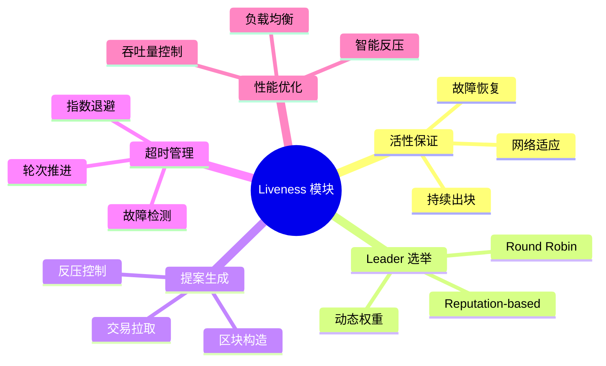

### 1.2 模块架构全景

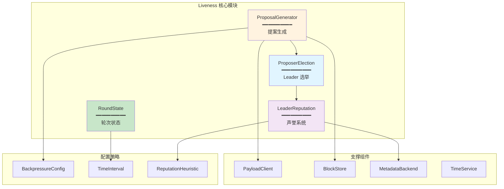

### 1.3 文件组织结构

```
src/liveness/
├── mod.rs                              # 模块入口
├── proposal_generator.rs               # 提案生成器 (1,200 LOC)
│   ├── ProposalGenerator 结构
│   ├── generate_proposal 核心逻辑
│   ├── 反压计算
│   └── failed_authors 追踪
│
├── proposer_election.rs                # 选举接口 (200 LOC)
│   └── ProposerElection trait
│
├── rotating_proposer_election.rs      # 轮询选举 (300 LOC)
│   └── RotatingProposer 实现
│
├── leader_reputation.rs                # 声誉系统 (1,500 LOC)
│   ├── LeaderReputation 结构
│   ├── MetadataBackend trait
│   ├── ReputationHeuristic trait
│   └── 权重计算算法
│
├── round_state.rs                      # 轮次状态 (800 LOC)
│   ├── RoundState 结构
│   ├── process_certificates
│   └── 超时管理
│
├── round_proposer_election.rs         # 轮次选举 (200 LOC)
├── cached_proposer_election.rs        # 缓存选举 (150 LOC)
└── proposal_status_tracker.rs         # 提案追踪 (300 LOC)
```

---

## 2. Leader 选举机制详解

### 2.1 ProposerElection Trait

```rust
// src/liveness/proposer_election.rs

pub trait ProposerElection: Send + Sync {
    /// 检查给定作者在给定轮次是否是有效提议者
    fn is_valid_proposer(&self, author: Author, round: Round) -> bool;

    /// 获取给定轮次的有效提议者
    fn get_valid_proposer(&self, round: Round) -> Author;

    /// 获取投票权重参与率（用于反压）
    fn get_voting_power_participation_ratio(&self, round: Round) -> f64;
}
```

### 2.2 选举策略对比

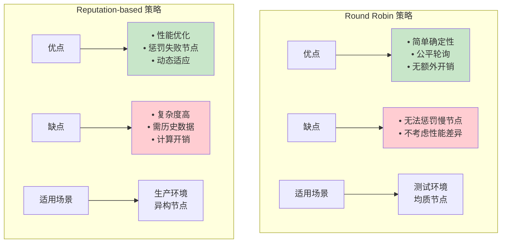

### 2.3 RotatingProposer 详解

#### 核心实现

```rust
// src/liveness/rotating_proposer_election.rs

pub struct RotatingProposer {
    /// 验证者列表（按固定顺序）
    validators: Vec<Author>,

    /// 每个验证者的投票权重
    voting_powers: Vec<u64>,

    /// 窗口大小（用于参与率计算）
    window_size: usize,
}

impl ProposerElection for RotatingProposer {
    fn get_valid_proposer(&self, round: Round) -> Author {
        // 简单取模选择
        let index = (round as usize) % self.validators.len();
        self.validators[index]
    }

    fn is_valid_proposer(&self, author: Author, round: Round) -> bool {
        self.get_valid_proposer(round) == author
    }

    fn get_voting_power_participation_ratio(&self, round: Round) -> f64 {
        // Round Robin 模式下始终返回 1.0
        1.0
    }
}
```

#### 选举示意图

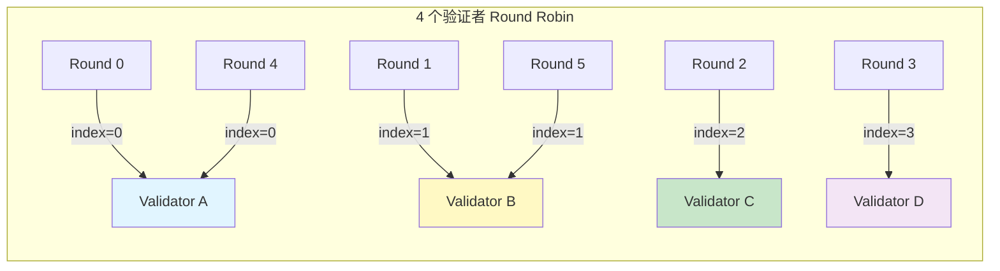

### 2.4 LeaderReputation 深度解析

#### 核心数据结构

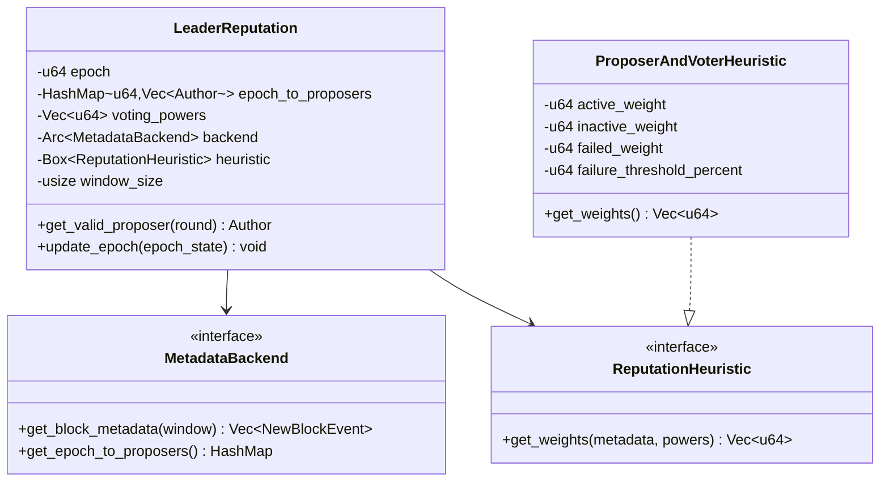

#### Leader 选举算法

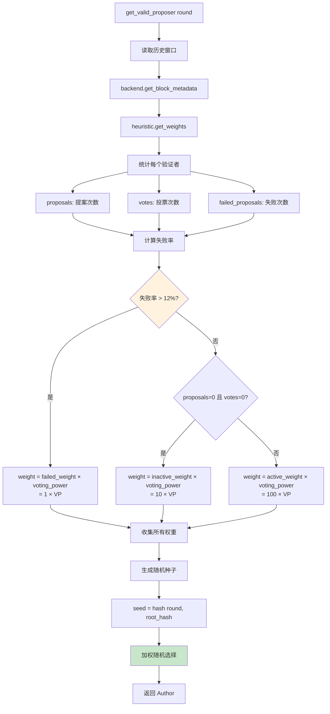

#### 权重计算详细示例

**场景设定**：
- 4 个验证者，每个 voting_power = 100
- 窗口大小 = 20 个区块
- active_weight = 100, inactive_weight = 10, failed_weight = 1
- failure_threshold = 12%

**统计数据**：

| Validator | Proposals | Failed | Votes | 失败率 | 状态 | 权重因子 | 最终权重 |
|-----------|-----------|--------|-------|--------|------|---------|---------|
| Alice     | 10        | 0      | 20    | 0%     | 活跃 | 100     | 10,000  |
| Bob       | 8         | 3      | 20    | 37.5%  | 失败 | 1       | 100     |
| Charlie   | 0         | 0      | 0     | N/A    | 不活跃| 10      | 1,000   |
| Dave      | 2         | 0      | 20    | 0%     | 活跃 | 100     | 10,000  |

**选择概率**：

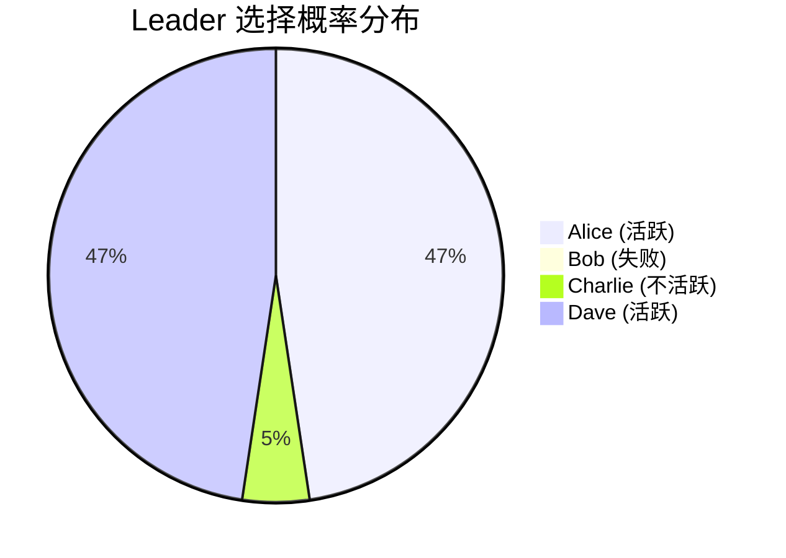

- Alice: 10,000 / 21,100 ≈ **47.4%**
- Bob: 100 / 21,100 ≈ **0.5%**
- Charlie: 1,000 / 21,100 ≈ **4.7%**
- Dave: 10,000 / 21,100 ≈ **47.4%**

### 2.5 加权随机选择算法

```rust
fn weighted_random_select(weights: &[u64], seed: u64) -> usize {
    // 1. 计算总权重
    let total_weight: u64 = weights.iter().sum();

    // 2. 使用种子生成随机数
    let mut rng = ChaChaRng::seed_from_u64(seed);
    let random_value = rng.gen_range(0..total_weight);

    // 3. 二分查找选择
    let mut cumulative = 0u64;
    for (index, &weight) in weights.iter().enumerate() {
        cumulative += weight;
        if random_value < cumulative {
            return index;
        }
    }

    // 应该不会到达这里
    weights.len() - 1
}
```

**种子生成**：

```rust
fn get_seed(&self, round: Round) -> u64 {
    // 使用 round 和当前 root 的哈希作为种子
    // 确保在相同状态下选择是确定的
    let root_hash = self.block_store.ordered_root().id();
    let mut hasher = DefaultHasher::new();
    round.hash(&mut hasher);
    root_hash.hash(&mut hasher);
    hasher.finish()
}
```

---

## 3. 提案生成器详解

### 3.1 ProposalGenerator 完整结构

```rust
// src/liveness/proposal_generator.rs

pub struct ProposalGenerator {
    /// 验证者地址
    author: Author,

    /// 区块存储（读取 highest_qc）
    block_store: Arc<dyn BlockReader>,

    /// Payload 客户端（QuorumStore 或 DirectMempool）
    payload_client: Arc<dyn PayloadClient>,

    /// 时间服务
    time_service: Arc<dyn TimeService>,

    /// 最大区块配置
    max_block_txns: PayloadTxnsSize,
    max_block_bytes: u64,

    /// Pipeline 反压配置
    pipeline_backpressure_config: PipelineBackpressureConfig,

    /// 链健康反压配置
    chain_health_backoff_config: ChainHealthBackoffConfig,

    /// 最大失败作者数
    max_failed_authors_to_store: usize,

    /// Quorum Store 启用标志
    quorum_store_enabled: bool,
}
```

### 3.2 提案生成完整流程

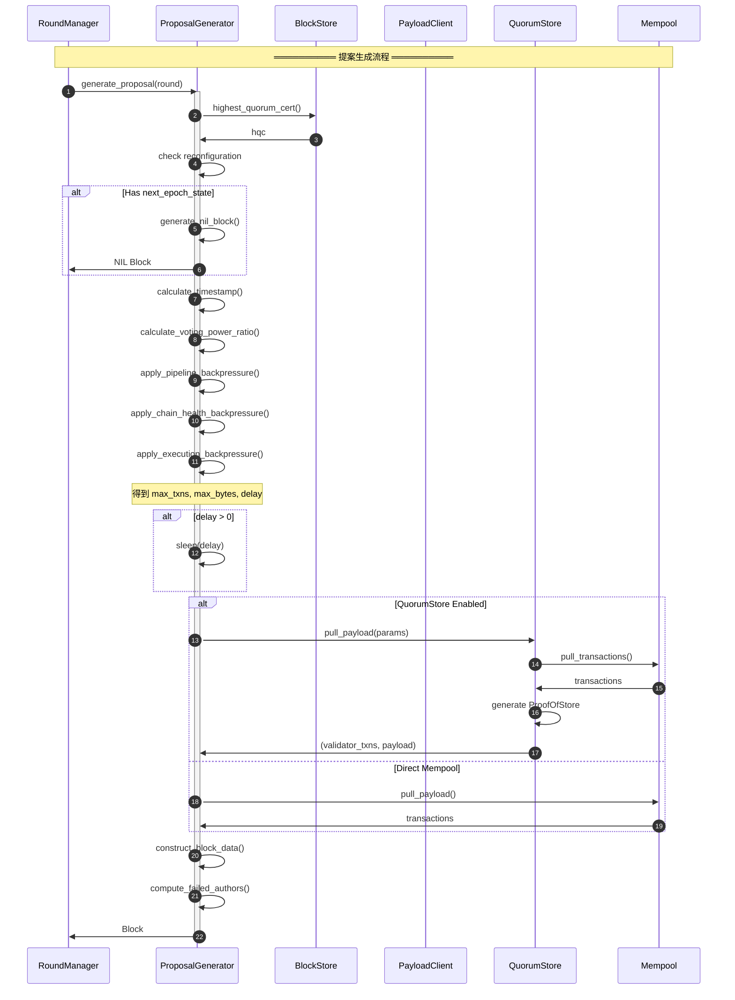

### 3.3 反压机制详解

#### 三种反压机制概览

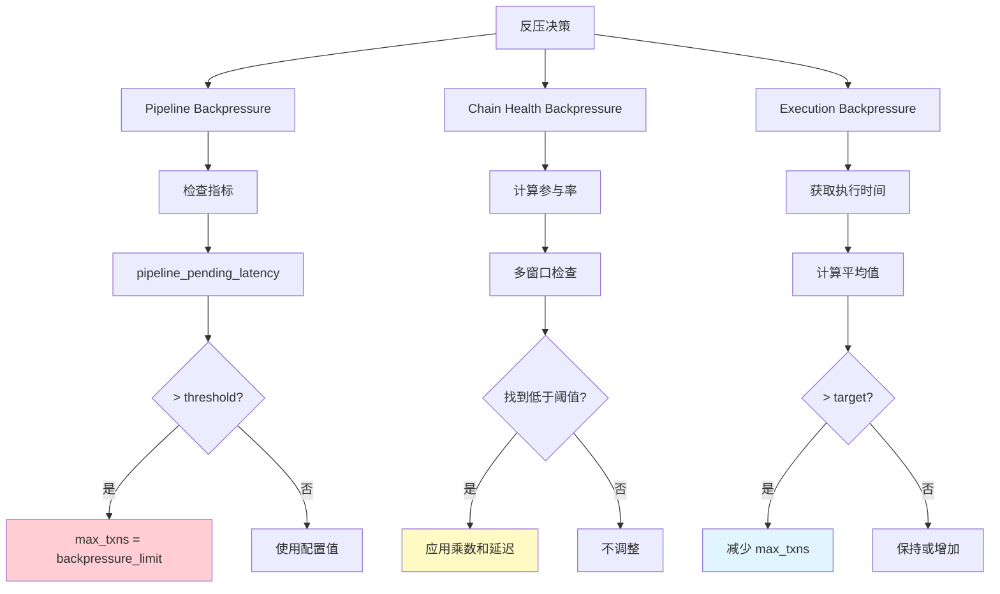

#### Pipeline Backpressure 详解

**配置结构**：

```rust
pub struct PipelineBackpressureConfig {
    /// 最大待处理延迟（毫秒）
    max_pending_latency_ms: u64,  // 默认: 5000

    /// 反压时的最大交易数
    backpressure_max_txns: u64,   // 默认: 1000

    /// 递减因子（AIMD 算法）
    decrease_fraction: f64,       // 默认: 0.5

    /// 递增值
    additive_increase: u64,       // 默认: 100
}
```

**检查逻辑**：

```rust
fn apply_pipeline_backpressure(&self, max_txns: u64) -> u64 {
    // 1. 获取 pipeline 待处理延迟
    let pending_latency = self.block_store
        .pipeline_pending_latency(self.time_service.now());

    // 2. 检查是否超过阈值
    if pending_latency > Duration::from_millis(
        self.pipeline_backpressure_config.max_pending_latency_ms
    ) {
        // 3. 应用反压
        info!(
            "Pipeline backpressure triggered: latency={}ms, limit txns to {}",
            pending_latency.as_millis(),
            self.pipeline_backpressure_config.backpressure_max_txns
        );

        return self.pipeline_backpressure_config.backpressure_max_txns;
    }

    max_txns
}
```

#### Chain Health Backpressure 详解

**多窗口配置**：

```rust
pub struct ChainHealthBackoffConfig {
    /// 窗口大小数组
    windows: Vec<u64>,  // [10, 20, 30, 50, 100, 200]

    /// 对应的阈值
    window_thresholds: Vec<f64>,  // [0.95, 0.92, 0.90, 0.85, 0.80, 0.75]

    /// 对应的反压配置
    backoffs: Vec<ChainHealthBackoff>,
}

pub struct ChainHealthBackoff {
    /// 交易数乘数
    txns_multiply_factor: f64,  // 如: 0.8

    /// 字节数乘数
    size_multiply_factor: f64,  // 如: 0.8

    /// 提案延迟（毫秒）
    proposal_delay_ms: u64,     // 如: 100
}
```

**配置表格**：

| 窗口 | 阈值 | txns 乘数 | bytes 乘数 | 延迟(ms) | 说明 |
|------|------|----------|-----------|---------|------|
| 10   | 0.95 | 1.0      | 1.0       | 0       | 健康 |
| 20   | 0.92 | 0.8      | 0.8       | 100     | 轻微降级 |
| 30   | 0.90 | 0.6      | 0.6       | 200     | 中等降级 |
| 50   | 0.85 | 0.4      | 0.4       | 500     | 严重降级 |
| 100  | 0.80 | 0.2      | 0.2       | 1000    | 非常严重 |
| 200  | 0.75 | 0.1      | 0.1       | 2000    | 极端情况 |

**算法流程**：

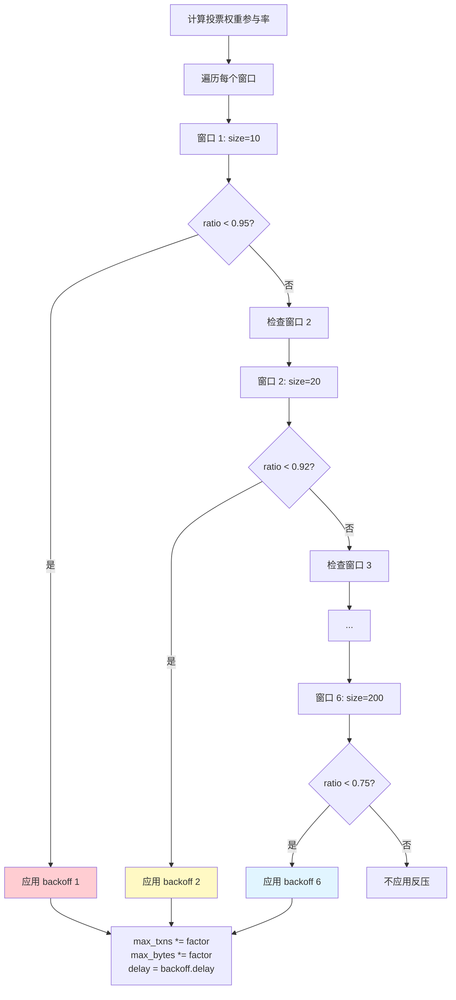

**代码实现**：

```rust
fn apply_chain_health_backpressure(
    &self,
    voting_power_ratio: f64,
    max_txns: u64,
    max_bytes: u64,
) -> (u64, u64, Duration) {
    let config = &self.chain_health_backoff_config;

    // 遍历窗口配置
    for (i, &window_size) in config.windows.iter().enumerate() {
        // 计算该窗口的参与率
        let window_ratio = self.calculate_voting_power_ratio_for_window(
            window_size as usize
        );

        // 检查是否低于阈值
        if window_ratio < config.window_thresholds[i] {
            let backoff = &config.backoffs[i];

            info!(
                "Chain health backpressure: window={}, ratio={:.2}, threshold={:.2}",
                window_size, window_ratio, config.window_thresholds[i]
            );

            // 应用反压
            let new_max_txns = (max_txns as f64 * backoff.txns_multiply_factor) as u64;
            let new_max_bytes = (max_bytes as f64 * backoff.size_multiply_factor) as u64;
            let delay = Duration::from_millis(backoff.proposal_delay_ms);

            return (new_max_txns, new_max_bytes, delay);
        }
    }

    // 没有触发反压
    (max_txns, max_bytes, Duration::ZERO)
}
```

#### Execution Backpressure

**基于执行时间的动态调整**：

```rust
fn apply_execution_backpressure(&self, max_txns: u64) -> u64 {
    // 1. 获取最近 N 个区块的执行统计
    let num_blocks = 10;
    let execution_stats = self.block_store
        .get_recent_execution_stats(num_blocks);

    if execution_stats.is_empty() {
        return max_txns;
    }

    // 2. 计算平均执行时间
    let total_time: Duration = execution_stats
        .iter()
        .map(|s| s.execution_time)
        .sum();
    let avg_execution_time = total_time / num_blocks;

    // 3. 计算平均交易数
    let total_txns: u64 = execution_stats
        .iter()
        .map(|s| s.num_txns)
        .sum();
    let avg_txns = total_txns / num_blocks;

    // 4. 目标执行时间（如 1000ms）
    let target_execution_time = Duration::from_millis(
        self.target_execution_time_ms
    );

    // 5. 计算调整后的交易数
    let calibrated_txns = if avg_execution_time > target_execution_time {
        // 执行太慢，减少交易数
        let ratio = target_execution_time.as_millis() as f64
            / avg_execution_time.as_millis() as f64;
        (avg_txns as f64 * ratio * 0.9) as u64  // 保守减少
    } else {
        // 执行快，可以增加
        let ratio = target_execution_time.as_millis() as f64
            / avg_execution_time.as_millis() as f64;
        (avg_txns as f64 * ratio * 1.1) as u64  // 适度增加
    };

    // 6. 返回最小值（保守策略）
    max_txns.min(calibrated_txns)
}
```

### 3.4 failed_authors 追踪

**目的**: 记录在 highest_qc 和当前轮次之间未能提议的 Leaders。

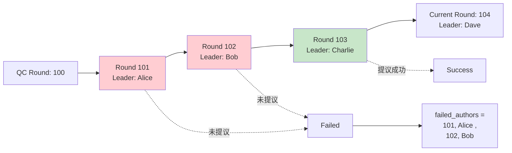

**代码实现**：

```rust
fn compute_failed_authors(
    &self,
    qc_round: Round,
    current_round: Round,
    proposer_election: Arc<dyn ProposerElection>,
) -> Vec<(Round, Author)> {
    let mut failed = Vec::new();

    // 遍历 QC 之后到当前轮次之前的所有轮次
    for round in (qc_round + 1)..current_round {
        let expected_proposer = proposer_election.get_valid_proposer(round);
        failed.push((round, expected_proposer));
    }

    // 限制数量（避免过大）
    if failed.len() > self.max_failed_authors_to_store {
        failed.truncate(self.max_failed_authors_to_store);
    }

    info!(
        "Computed {} failed authors from round {} to {}",
        failed.len(),
        qc_round + 1,
        current_round - 1
    );

    failed
}
```

**用途**：
1. 声誉系统统计失败提案
2. 帮助其他节点理解为何跳过某些轮次
3. 用于网络健康度分析

---

## 4. 轮次状态管理

### 4.1 RoundState 结构

```rust
// src/liveness/round_state.rs

pub struct RoundState {
    /// 时间间隔策略（超时计算）
    time_interval: Box<dyn RoundTimeInterval>,

    /// 最高已排序轮次
    highest_ordered_round: Round,

    /// 当前轮次
    current_round: Round,

    /// 当前轮次截止时间
    current_round_deadline: Instant,

    /// 待处理的投票
    pending_votes: Arc<PendingVotes>,

    /// 本轮次已发送的投票
    vote_sent: Option<Vote>,

    /// 本轮次已发送的超时
    timeout_sent: Option<RoundTimeout>,

    /// 超时任务句柄
    timeout_task: Option<JoinHandle<()>>,
}
```

### 4.2 轮次转换状态机

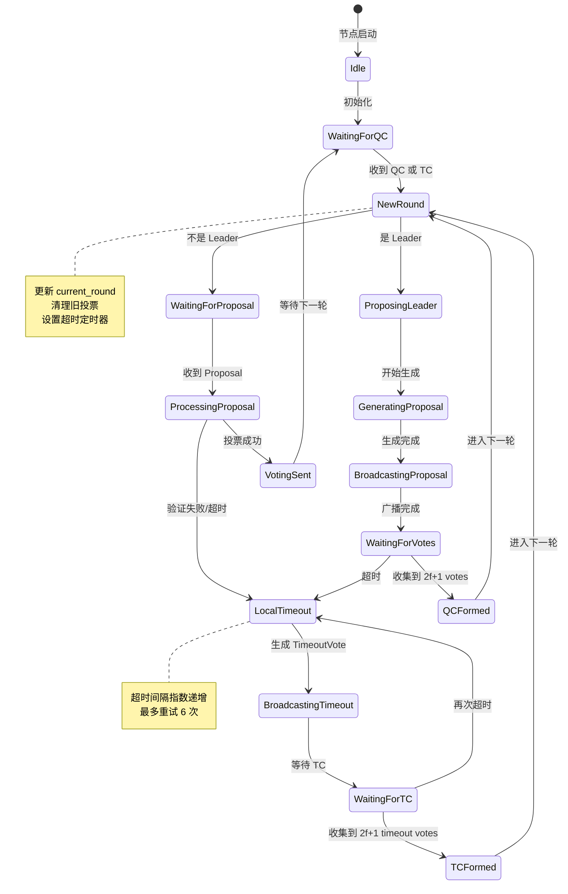

### 4.3 process_certificates 详解

```rust
pub fn process_certificates(
    &mut self,
    sync_info: &SyncInfo,
) -> Option<NewRoundEvent> {
    // ========================================
    // 步骤 1: 处理 QC
    // ========================================
    let hqc = sync_info.highest_quorum_cert();
    self.pending_votes.insert_quorum_cert(hqc.clone());

    let qc_round = hqc.certified_block().round();

    // ========================================
    // 步骤 2: 处理 TC
    // ========================================
    let tc_round = sync_info.highest_timeout_cert()
        .map(|tc| tc.round())
        .unwrap_or(0);

    // ========================================
    // 步骤 3: 处理 Order Cert
    // ========================================
    if let Some(order_cert) = sync_info.highest_ordered_cert() {
        let ordered_round = order_cert.commit_info().round();
        if ordered_round > self.highest_ordered_round {
            self.highest_ordered_round = ordered_round;
            info!("Updated highest_ordered_round to {}", ordered_round);
        }
    }

    // ========================================
    // 步骤 4: 计算新轮次
    // ========================================
    let new_round = max(qc_round, tc_round) + 1;

    if new_round <= self.current_round {
        return None;  // 不需要进入新轮次
    }

    // ========================================
    // 步骤 5: 更新轮次状态
    // ========================================
    self.current_round = new_round;
    self.vote_sent = None;
    self.timeout_sent = None;

    // ========================================
    // 步骤 6: 设置超时
    // ========================================
    let timeout = self.time_interval.get_round_duration(new_round);
    self.schedule_timeout(new_round, timeout);

    info!(
        "Entering round {}, timeout: {:?}, reason: {}",
        new_round,
        timeout,
        if tc_round >= qc_round { "TC" } else { "QC" }
    );

    // ========================================
    // 步骤 7: 返回新轮次事件
    // ========================================
    Some(NewRoundEvent {
        round: new_round,
        reason: if tc_round >= qc_round {
            NewRoundReason::Timeout
        } else {
            NewRoundReason::QCReady
        },
        timeout,
    })
}
```

### 4.4 超时策略 - ExponentialTimeInterval

**配置参数**：

```rust
pub struct ExponentialTimeInterval {
    /// 基础超时（毫秒）
    base_ms: u64,  // 默认: 1000

    /// 指数底数
    exponent_base: f64,  // 默认: 1.5

    /// 最大指数
    max_exponent: usize,  // 默认: 6

    /// 最高已排序轮次（用于计算 round_index）
    highest_ordered_round: Arc<AtomicU64>,
}
```

**超时计算算法**：

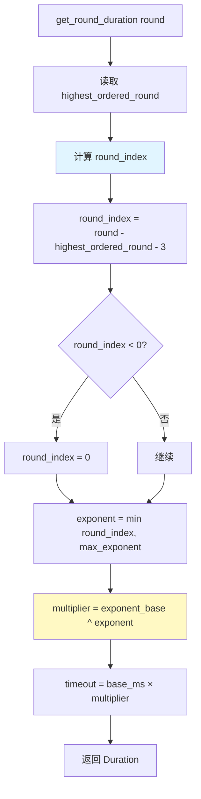

**超时表格**（base=1000ms, exponent_base=1.5, max_exponent=6）：

| Round Index | Exponent | Multiplier | Timeout (ms) | Timeout (s) |
|-------------|----------|------------|--------------|-------------|
| 0           | 0        | 1.0        | 1,000        | 1.0         |
| 1           | 1        | 1.5        | 1,500        | 1.5         |
| 2           | 2        | 2.25       | 2,250        | 2.25        |
| 3           | 3        | 3.375      | 3,375        | 3.375       |
| 4           | 4        | 5.063      | 5,063        | 5.063       |
| 5           | 5        | 7.594      | 7,594        | 7.594       |
| 6+          | 6        | 11.391     | 11,391       | 11.391      |

**可视化**：


---

## 5. 声誉系统深度解析

### 5.1 系统架构

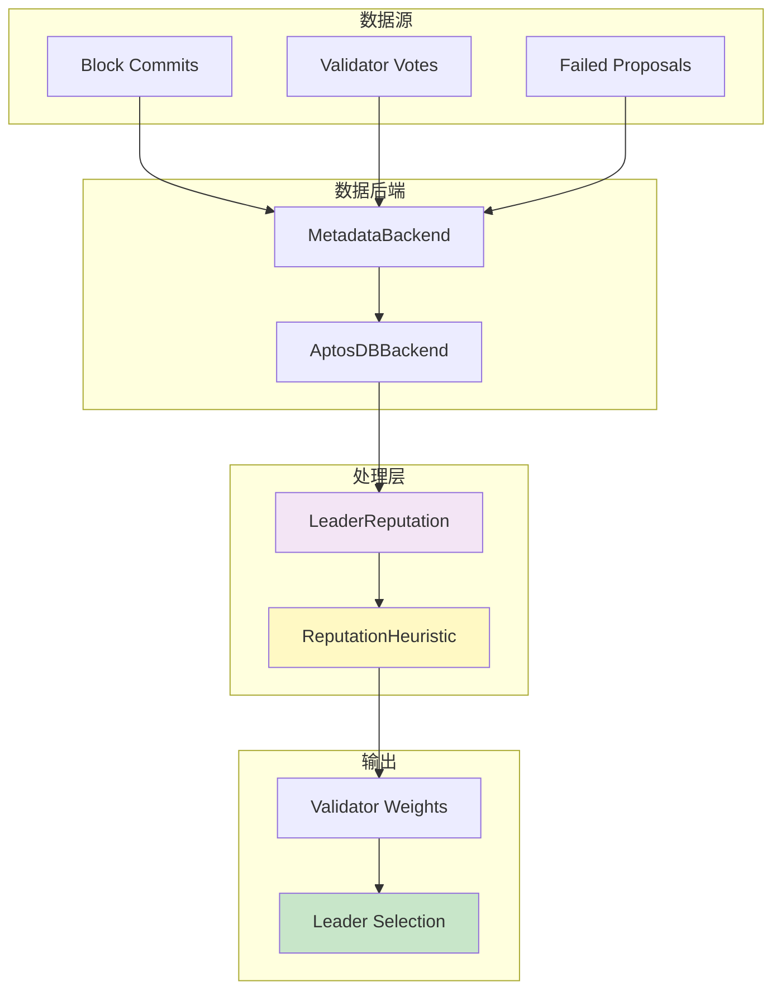

### 5.2 ProposerAndVoterHeuristic 详解

**配置参数**：

```rust
pub struct ProposerAndVoterHeuristic {
    /// 活跃验证者权重
    active_weight: u64,  // 默认: 100

    /// 不活跃验证者权重
    inactive_weight: u64,  // 默认: 10

    /// 失败验证者权重
    failed_weight: u64,  // 默认: 1

    /// 失败率阈值（百分比）
    failure_threshold_percent: u64,  // 默认: 12

    /// 窗口大小
    window_size: usize,  // 默认: 100
}
```

**权重计算算法**：

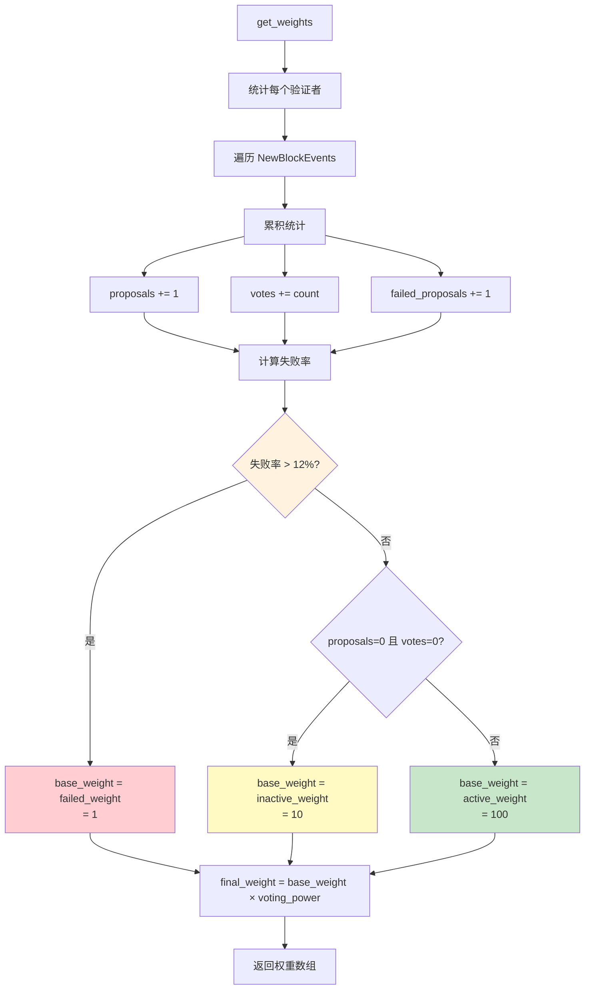

**代码实现**：

```rust
impl ReputationHeuristic for ProposerAndVoterHeuristic {
    fn get_weights(
        &self,
        metadata: &[NewBlockEvent],
        voting_powers: &[u64],
    ) -> Vec<u64> {
        // ========================================
        // 步骤 1: 初始化统计
        // ========================================
        let num_validators = voting_powers.len();
        let mut stats = vec![ValidatorStats::default(); num_validators];

        // ========================================
        // 步骤 2: 遍历历史事件
        // ========================================
        for event in metadata.iter().take(self.window_size) {
            // 统计提案
            if let Some(&proposer_idx) = event.proposer_index {
                stats[proposer_idx].proposals += 1;
            }

            // 统计投票
            for (voter_idx, &vote_count) in &event.votes {
                stats[*voter_idx].votes += vote_count;
            }

            // 统计失败提案
            for (author_idx, &failed_count) in &event.failed_proposals {
                stats[*author_idx].failed_proposals += failed_count;
            }
        }

        // ========================================
        // 步骤 3: 计算每个验证者的权重
        // ========================================
        voting_powers
            .iter()
            .enumerate()
            .map(|(idx, &voting_power)| {
                let stat = &stats[idx];

                // 计算失败率
                let failure_rate = if stat.proposals > 0 {
                    (stat.failed_proposals * 100) / stat.proposals
                } else {
                    0
                };

                // 选择基础权重
                let base_weight = if failure_rate > self.failure_threshold_percent {
                    // 失败率过高
                    self.failed_weight
                } else if stat.proposals == 0 && stat.votes == 0 {
                    // 不活跃
                    self.inactive_weight
                } else {
                    // 正常活跃
                    self.active_weight
                };

                // 最终权重 = 基础权重 × 投票权重
                base_weight * voting_power
            })
            .collect()
    }
}
```

### 5.3 声誉更新流程

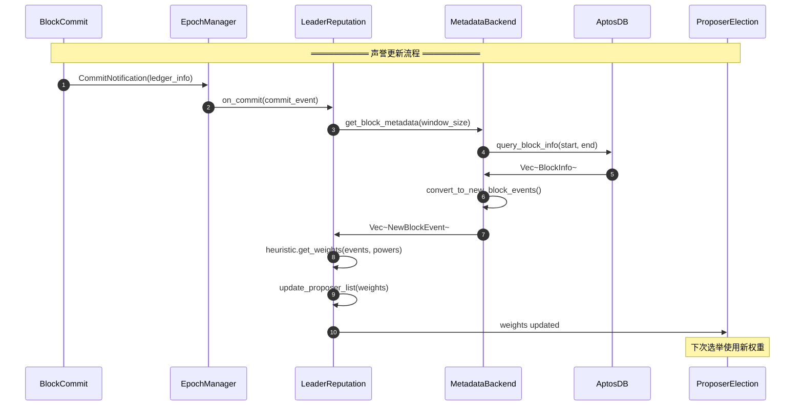

---

## 6. 反压机制详解

### 6.1 反压机制对比总结

```mermaid
graph TB
    subgraph "Pipeline Backpressure"
        A1[监控指标]
        A2[pipeline_pending_latency]
        A3[阈值]
        A4[5000ms]
        A5[动作]
        A6[max_txns = 1000]

        A1 --> A2
        A2 --> A3
        A3 --> A4
        A4 --> A5
        A5 --> A6
    end

    subgraph "Chain Health Backpressure"
        B1[监控指标]
        B2[voting_power_ratio]
        B3[多窗口阈值]
        B4[0.95, 0.92, ..., 0.75]
        B5[动作]
        B6[乘数 + 延迟]

        B1 --> B2
        B2 --> B3
        B3 --> B4
        B4 --> B5
        B5 --> B6
    end

    subgraph "Execution Backpressure"
        C1[监控指标]
        C2[avg_execution_time]
        C3[阈值]
        C4[1000ms]
        C5[动作]
        C6[动态调整 txns]

        C1 --> C2
        C2 --> C3
        C3 --> C4
        C4 --> C5
        C5 --> C6
    end

    style A6 fill:#ffcdd2
    style B6 fill:#fff9c4
    style C6 fill:#e1f5ff
```

### 6.2 反压决策流程

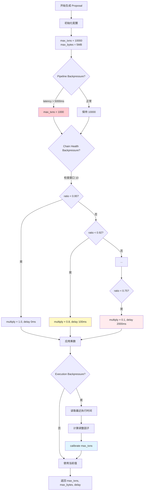

### 6.3 生产环境配置示例

```toml
# config.toml

[consensus.liveness]
# 基础配置
max_block_txns = 10000
max_block_bytes = 5242880  # 5MB

# Pipeline Backpressure
pipeline_backpressure.max_pending_latency_ms = 5000
pipeline_backpressure.backpressure_max_txns = 1000
pipeline_backpressure.decrease_fraction = 0.5
pipeline_backpressure.additive_increase = 100

# Chain Health Backpressure
chain_health_backpressure.windows = [10, 20, 30, 50, 100, 200]
chain_health_backpressure.window_thresholds = [0.95, 0.92, 0.90, 0.85, 0.80, 0.75]

[[chain_health_backpressure.backoffs]]
txns_multiply_factor = 1.0
size_multiply_factor = 1.0
proposal_delay_ms = 0

[[chain_health_backpressure.backoffs]]
txns_multiply_factor = 0.8
size_multiply_factor = 0.8
proposal_delay_ms = 100

[[chain_health_backpressure.backoffs]]
txns_multiply_factor = 0.6
size_multiply_factor = 0.6
proposal_delay_ms = 200

# ... 更多配置

# Execution Backpressure
execution_backpressure.target_execution_time_ms = 1000
execution_backpressure.num_blocks_for_avg = 10

# Leader Reputation
leader_reputation.window_size = 100
leader_reputation.failure_threshold_percent = 12
leader_reputation.active_weight = 100
leader_reputation.inactive_weight = 10
leader_reputation.failed_weight = 1

# Round Timeout
round_timeout.base_ms = 1000
round_timeout.exponent_base = 1.5
round_timeout.max_exponent = 6
```

---

## 7. 总结

### 核心要点

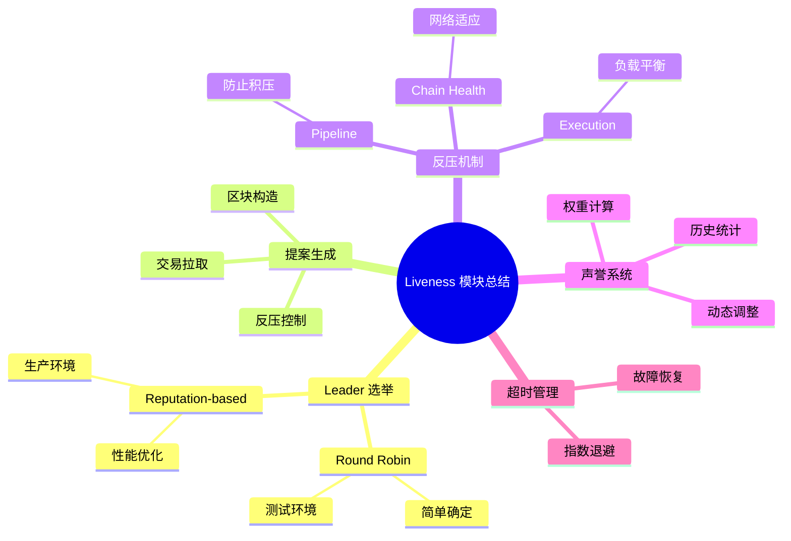

### 关键参数总结

| 参数类别 | 参数名 | 默认值 | 说明 |
|---------|--------|--------|------|
| **基础配置** | max_block_txns | 10,000 | 最大交易数 |
| | max_block_bytes | 5MB | 最大区块大小 |
| **Pipeline** | max_pending_latency_ms | 5000 | 待处理延迟阈值 |
| | backpressure_max_txns | 1000 | 反压交易数限制 |
| **Chain Health** | windows | [10,20,30...] | 检查窗口 |
| | thresholds | [0.95,0.92...] | 参与率阈值 |
| **Execution** | target_execution_time_ms | 1000 | 目标执行时间 |
| **Reputation** | window_size | 100 | 统计窗口 |
| | failure_threshold | 12% | 失败率阈值 |
| | active_weight | 100 | 活跃权重 |
| **Timeout** | base_ms | 1000 | 基础超时 |
| | exponent_base | 1.5 | 指数底数 |

### 性能指标

- **Leader 选举延迟**: < 1ms
- **提案生成时间**: 100-500ms
- **反压响应时间**: 立即生效
- **声誉更新频率**: 每个 Epoch

### 设计亮点

1. **多维度反压**: 从 Pipeline、网络健康、执行性能三个维度综合控制
2. **动态 Leader 选举**: 基于历史表现自动调整权重
3. **指数退避超时**: 快速恢复 + 故障容忍
4. **可配置性**: 所有参数都可根据网络特点调整

---

**文档路径**: `/home/morton/work/rust/aptos-core/consensus/APTOS_共识模块深度技术文档_详细增强版_Part4_Liveness.md`

**生成时间**: 2025-10-09
**文档版本**: v2.0 (详细增强版)
