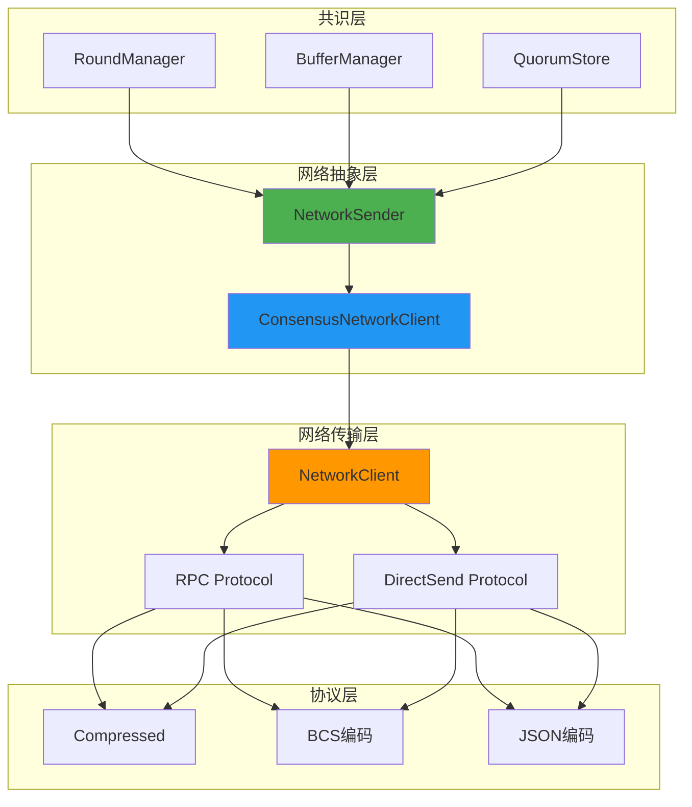
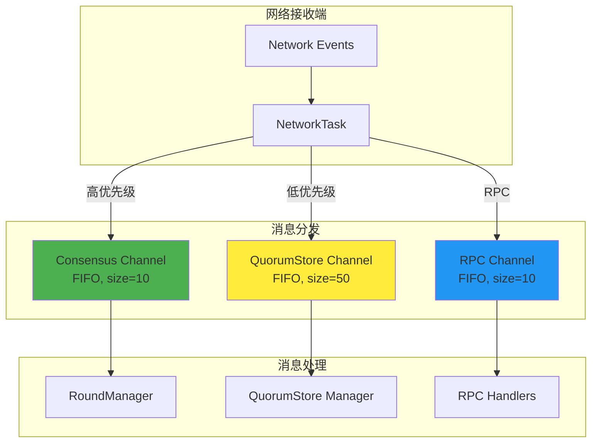
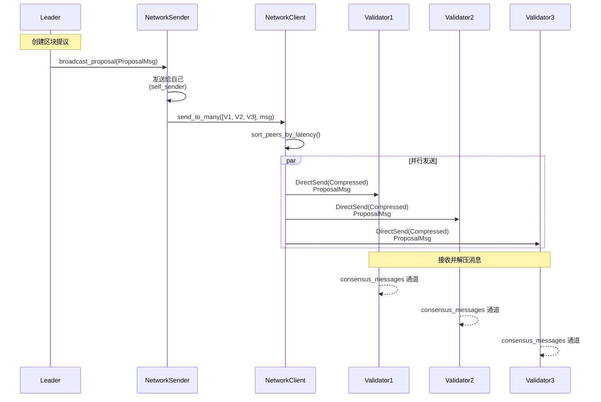
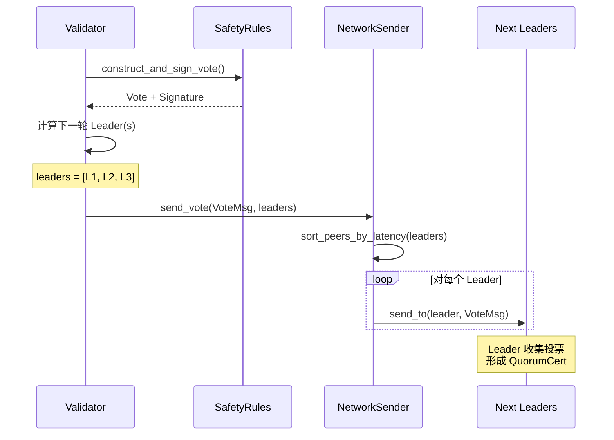
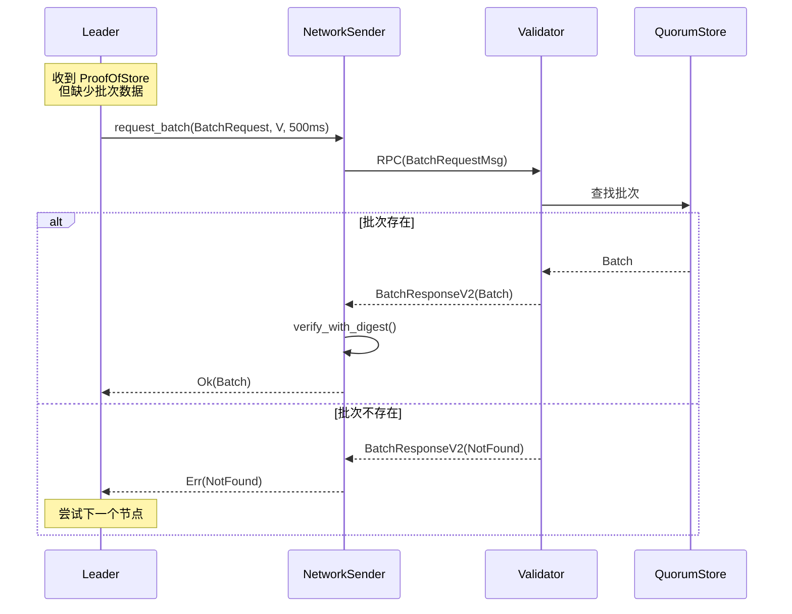

# Aptos 共识模块 - 网络层接口与消息协议详解

**文档版本**: v1.0
**创建日期**: 2025-10-09
**适用版本**: Aptos Core latest

---

## 目录

1. [概述](#1-概述)
2. [ConsensusMsg 消息类型完整图谱](#2-consensusmsg-消息类型完整图谱)
   - 2.1 [消息类型分类](#21-消息类型分类)
   - 2.2 [消息结构详解](#22-消息结构详解)
3. [网络组件架构详解](#3-网络组件架构详解)
   - 3.1 [核心网络组件架构](#31-核心网络组件架构)
   - 3.2 [NetworkSender 完整接口](#32-networksender-完整接口)
4. [消息优先级和通道管理](#4-消息优先级和通道管理)
   - 4.1 [消息优先级表](#41-消息优先级表)
   - 4.2 [网络通道架构](#42-网络通道架构)
5. [消息流转完整示例](#5-消息流转完整示例)
   - 5.1 [提议广播流程](#51-提议广播流程)
   - 5.2 [投票发送流程](#52-投票发送流程)
   - 5.3 [批次请求-响应流程](#53-批次请求-响应流程)
6. [网络协议栈](#6-网络协议栈)
   - 6.1 [协议优先级](#61-协议优先级)
   - 6.2 [消息序列化和压缩](#62-消息序列化和压缩)
7. [性能优化与最佳实践](#7-性能优化与最佳实践)
8. [故障排查指南](#8-故障排查指南)

---

## 1. 概述

Aptos 共识网络层是分布式共识系统的通信基础设施，负责在验证者节点之间传递共识消息。本文档详细介绍了网络层的完整架构、消息协议、传输机制和性能优化策略。

**核心特性**:
- **多种消息类型**: 支持18+种不同的共识消息类型
- **优先级调度**: 关键路径消息(Proposal, Vote)享有最高优先级
- **高效传输**: 采用 BCS 编码 + LZ4 压缩，减少70%网络开销
- **灵活通信**: 支持 RPC 和 DirectSend 两种通信模式
- **可靠性保证**: 内置重试、超时和fallback机制

**源码位置**:
- `consensus/src/network.rs` - NetworkSender 实现
- `consensus/src/network_interface.rs` - 消息定义和接口
- `consensus/src/network_task.rs` - 消息路由任务

---

## 2. ConsensusMsg 消息类型完整图谱

### 2.1 消息类型分类

Aptos 共识网络层支持多种消息类型，每种消息都有特定的用途和传输模式。

```mermaid
graph TB
    CM[ConsensusMsg 共识消息总类] --> BFT[BFT共识消息]
    CM --> QS[QuorumStore消息]
    CM --> DAG[DAG共识消息]
    CM --> SYNC[同步消息]
    CM --> RAND[随机数消息]
    CM --> PIPE[Pipeline消息]

    BFT --> PM[ProposalMsg<br/>区块提议]
    BFT --> VM[VoteMsg<br/>投票]
    BFT --> OVM[OrderVoteMsg<br/>排序投票]
    BFT --> RTM[RoundTimeoutMsg<br/>轮次超时]
    BFT --> OPM[OptProposalMsg<br/>乐观提议]

    QS --> BM[BatchMsg<br/>交易批次]
    QS --> BRM[BatchRequestMsg<br/>批次请求]
    QS --> BR[BatchResponse<br/>批次响应]
    QS --> SBI[SignedBatchInfo<br/>签名批次信息]
    QS --> POS[ProofOfStoreMsg<br/>存储证明]

    DAG --> DAGM[DAGMessage<br/>DAG协议消息]

    SYNC --> SI[SyncInfo<br/>同步信息]
    SYNC --> BRR[BlockRetrievalRequest<br/>区块检索请求]
    SYNC --> BRRS[BlockRetrievalResponse<br/>区块检索响应]
    SYNC --> ERR[EpochRetrievalRequest<br/>纪元检索请求]
    SYNC --> ECP[EpochChangeProof<br/>纪元变更证明]

    RAND --> RGM[RandGenMessage<br/>随机数生成]

    PIPE --> CVM[CommitVoteMsg<br/>提交投票]
    PIPE --> CDM[CommitDecisionMsg<br/>提交决定]
    PIPE --> CMSG[CommitMessage<br/>提交消息]

    style BFT fill:#e1f5ff
    style QS fill:#fff4e6
    style DAG fill:#f3e5f5
    style SYNC fill:#e8f5e9
    style RAND fill:#fce4ec
    style PIPE fill:#fff9c4
```



**消息类型统计**:
- **BFT 共识消息**: 5种 (关键路径)
- **QuorumStore 消息**: 5种 (批量优化)
- **DAG 共识消息**: 1种 (并行共识)
- **同步消息**: 5种 (状态同步)
- **随机数消息**: 1种 (随机性)
- **Pipeline 消息**: 3种 (执行流水线)

### 2.2 消息结构详解

#### 2.2.1 ProposalMsg (区块提议消息)

**定义**: `consensus/src/consensus_types/src/proposal_msg.rs`

```rust
pub struct ProposalMsg {
    proposal: Block,           // 提议的区块
    sync_info: SyncInfo,       // 同步信息
}
```

**使用场景**:
- Leader 向所有验证者广播新区块提议
- 包含父区块的 QuorumCert
- 触发验证者执行和投票

**传输特性**:
- 传输方式: DirectSend 广播
- 优先级: 最高
- 平均大小: 500KB (1000 txns)
- 压缩后: ~150KB (70% 压缩率)

**代码示例**:
```rust
// consensus/src/network.rs:404
pub async fn broadcast_proposal(&self, proposal_msg: ProposalMsg) {
    fail_point!("consensus::send::broadcast_proposal", |_| ());
    let msg = ConsensusMsg::ProposalMsg(Box::new(proposal_msg));
    self.broadcast(msg).await
}
```

#### 2.2.2 VoteMsg (投票消息)

**定义**: `consensus/src/consensus_types/src/vote_msg.rs`

```rust
pub struct VoteMsg {
    vote: Vote,                // 投票内容
    sync_info: SyncInfo,       // 同步信息
}

pub struct Vote {
    vote_data: VoteData,       // 投票数据
    author: Author,            // 投票者
    ledger_info: LedgerInfo,   // 账本信息
    signature: Signature,      // 签名
    two_chain_timeout: Option<TwoChainTimeout>,
}
```

**发送策略**:
- 发送给下一轮的潜在 Leader(s)
- 不是广播，而是点对点发送
- 支持多 Leader 场景

**代码示例**:
```rust
// consensus/src/network.rs:489
pub async fn send_vote(&self, vote_msg: VoteMsg, recipients: Vec<Author>) {
    fail_point!("consensus::send::vote", |_| ());
    let msg = ConsensusMsg::VoteMsg(Box::new(vote_msg));
    self.send(msg, recipients).await
}
```

#### 2.2.3 OrderVoteMsg (排序投票消息)

**定义**: `consensus/src/consensus_types/src/order_vote_msg.rs`

```rust
pub struct OrderVoteMsg {
    order_vote: OrderVote,     // 排序投票
}

pub struct OrderVote {
    author: Author,
    ledger_info: LedgerInfo,
    signature: Signature,
}
```

**Pipeline 专用**:
- 在区块获得 QC 后发送
- 用于确认执行顺序
- 支持 Pipeline 模式的并行执行

**代码示例**:
```rust
// consensus/src/network.rs:459
pub async fn broadcast_order_vote(&self, order_vote_msg: OrderVoteMsg) {
    fail_point!("consensus::send::order_vote", |_| ());
    let msg = ConsensusMsg::OrderVoteMsg(Box::new(order_vote_msg));
    self.broadcast(msg).await
}
```

#### 2.2.4 CommitVote & CommitDecision

**定义**: `consensus/src/consensus_types/src/pipeline/commit_vote.rs`

```rust
pub struct CommitVote {
    author: Author,
    commit_info: CommitInfo,   // 提交信息(包含执行结果)
    signature: Signature,
}

pub struct CommitDecision {
    ledger_info: LedgerInfoWithSignatures,  // 2f+1 签名
}
```

**两阶段提交**:
1. **CommitVote**: 验证者签名执行结果
2. **CommitDecision**: 聚合后广播最终提交

**代码示例**:
```rust
// consensus/src/network.rs:465
pub async fn broadcast_commit_vote(&self, commit_vote_msg: CommitVote) {
    fail_point!("consensus::send::commit_vote", |_| ());
    let msg = ConsensusMsg::CommitVoteMsg(Box::new(commit_vote_msg));
    self.broadcast(msg).await
}
```

#### 2.2.5 QuorumStore 消息系列

**BatchMsg - 广播交易批次**:
```rust
pub struct BatchMsg {
    batches: Vec<Batch>,
}
```

**SignedBatchInfoMsg - 批次签名(投票)**:
```rust
pub struct SignedBatchInfoMsg {
    signed_batch_infos: Vec<SignedBatchInfo>,
}
```

**ProofOfStoreMsg - 存储证明(2f+1签名)**:
```rust
pub struct ProofOfStoreMsg {
    proofs: Vec<ProofOfStore>,
}

pub struct ProofOfStore {
    info: BatchInfo,
    multi_signature: AggregateSignature,  // BLS聚合签名
}
```

**使用场景**:
- BatchMsg: Leader 广播交易批次到所有节点
- SignedBatchInfo: 节点签名批次后发回 Leader
- ProofOfStore: Leader 收集 2f+1 签名后广播证明

---

## 3. 网络组件架构详解

### 3.1 核心网络组件架构



**架构层次说明**:

1. **共识层** - 业务逻辑
   - RoundManager: 轮次管理，发送提议和投票
   - BufferManager: 管理执行流水线
   - QuorumStore: 批量交易处理

2. **网络抽象层** - 高级接口
   - NetworkSender: 提供 `broadcast_proposal()`, `send_vote()` 等高级方法
   - ConsensusNetworkClient: 封装底层网络客户端

3. **网络传输层** - 传输机制
   - NetworkClient: 实际的网络通信
   - RPC Protocol: 请求-响应模式
   - DirectSend Protocol: 单向发送模式

4. **协议层** - 编码格式
   - Compressed: 压缩协议 (首选)
   - BCS: Binary Canonical Serialization
   - JSON: 兼容性协议 (fallback)

### 3.2 NetworkSender 完整接口

**源码位置**: `consensus/src/network.rs:218`

```rust
pub struct NetworkSender {
    author: Author,                              // 本节点ID
    consensus_network_client: ConsensusNetworkClient<NetworkClient<ConsensusMsg>>,
    self_sender: UnboundedSender<Event<ConsensusMsg>>,  // 自发送通道
    validators: Arc<ValidatorVerifier>,          // 验证者集合
    time_service: TimeService,                   // 时间服务
}

impl NetworkSender {
    // ==================== RPC 调用 ====================

    /// 发送 RPC 并等待响应
    pub async fn send_rpc(
        &self,
        receiver: Author,
        msg: ConsensusMsg,
        timeout: Duration,
    ) -> anyhow::Result<ConsensusMsg> {
        // 1. 如果是发给自己,使用 self_sender
        if receiver == self.author {
            return self.send_rpc_to_self(msg, timeout).await;
        }

        // 2. 否则通过网络发送
        self.consensus_network_client
            .send_rpc(receiver, msg, timeout)
            .await
    }

    /// 区块检索 RPC
    pub async fn request_block(
        &self,
        request: BlockRetrievalRequest,
        from: Author,
        timeout: Duration,
    ) -> anyhow::Result<BlockRetrievalResponse> {
        let msg = ConsensusMsg::BlockRetrievalRequest(Box::new(request));
        let response = self.send_rpc(from, msg, timeout).await?;

        match response {
            ConsensusMsg::BlockRetrievalResponse(resp) => {
                // 验证响应
                resp.verify(request, &self.validators)?;
                Ok(*resp)
            },
            _ => Err(anyhow!("Invalid response")),
        }
    }

    // ==================== 广播 ====================

    /// 向所有验证者广播消息
    async fn broadcast(&self, msg: ConsensusMsg) {
        // 1. 发给自己
        let self_msg = Event::Message(self.author, msg.clone());
        self.self_sender.send(self_msg).await;

        // 2. 发给其他验证者
        self.broadcast_without_self(msg);
    }

    /// 只向其他验证者广播(不包括自己)
    pub fn broadcast_without_self(&self, msg: ConsensusMsg) {
        let mut other_validators: Vec<_> = self.validators
            .get_ordered_account_addresses_iter()
            .filter(|author| author != &self.author)
            .collect();

        // 根据延迟排序,优先发送给低延迟节点
        self.sort_peers_by_latency(&mut other_validators);

        self.consensus_network_client
            .send_to_many(other_validators, msg);
    }

    // ==================== 点对点发送 ====================

    /// 发送给特定接收者列表
    async fn send(&self, msg: ConsensusMsg, recipients: Vec<Author>) {
        for peer in recipients {
            if peer == self.author {
                // 发给自己
                let self_msg = Event::Message(self.author, msg.clone());
                self.self_sender.send(self_msg).await;
            } else {
                // 发给其他节点
                self.consensus_network_client.send_to(peer, msg.clone());
            }
        }
    }

    // ==================== 高级广播方法 ====================

    /// 广播提议
    pub async fn broadcast_proposal(&self, proposal: ProposalMsg) {
        let msg = ConsensusMsg::ProposalMsg(Box::new(proposal));
        self.broadcast(msg).await
    }

    /// 广播投票
    pub async fn broadcast_vote(&self, vote: VoteMsg) {
        let msg = ConsensusMsg::VoteMsg(Box::new(vote));
        self.broadcast(msg).await
    }

    /// 发送投票给下一轮Leader
    pub async fn send_vote(&self, vote: VoteMsg, recipients: Vec<Author>) {
        let msg = ConsensusMsg::VoteMsg(Box::new(vote));
        self.send(msg, recipients).await
    }

    /// 广播轮次超时
    pub async fn broadcast_round_timeout(&self, timeout: RoundTimeoutMsg) {
        let msg = ConsensusMsg::RoundTimeoutMsg(Box::new(timeout));
        self.broadcast(msg).await
    }

    /// 广播排序投票
    pub async fn broadcast_order_vote(&self, order_vote: OrderVoteMsg) {
        let msg = ConsensusMsg::OrderVoteMsg(Box::new(order_vote));
        self.broadcast(msg).await
    }
}
```

**关键方法说明**:

| 方法 | 类型 | 用途 | 超时 |
|------|------|------|------|
| `send_rpc()` | RPC | 发送请求并等待响应 | 可配置 |
| `broadcast()` | DirectSend | 广播给所有验证者(包括自己) | 无 |
| `broadcast_without_self()` | DirectSend | 广播给其他验证者 | 无 |
| `send()` | DirectSend | 发送给指定节点列表 | 无 |
| `request_block()` | RPC | 请求区块数据 | 5s |

---

## 4. 消息优先级和通道管理

### 4.1 消息优先级表

| 消息类型 | 优先级 | 通道 | 队列大小 | 说明 |
|---------|-------|------|---------|------|
| **ProposalMsg** | **最高** | consensus | 10 | 区块提议,关键路径 |
| **VoteMsg** | **最高** | consensus | 10 | 投票消息,关键路径 |
| **OrderVoteMsg** | **高** | consensus | 10 | 排序投票,Pipeline专用 |
| **RoundTimeoutMsg** | **高** | consensus | 10 | 轮次超时,活性保证 |
| **OptProposalMsg** | **高** | consensus | 10 | 乐观提议 |
| **CommitVoteMsg** | **中** | rpc | 10 | 提交投票,非关键路径 |
| **CommitDecisionMsg** | **中** | rpc | 10 | 提交决定,非关键路径 |
| **SyncInfo** | **中** | consensus | 10 | 同步信息 |
| **BatchMsg** | **低** | quorum_store | 50 | 批次广播,可延迟 |
| **SignedBatchInfo** | **低** | quorum_store | 50 | 批次签名 |
| **ProofOfStoreMsg** | **低** | quorum_store | 50 | 存储证明 |

**优先级设计原则**:
1. **关键路径消息** (Proposal, Vote) 享有最高优先级，确保共识进度
2. **活性消息** (Timeout) 高优先级，防止轮次卡住
3. **执行相关消息** (CommitVote) 中等优先级，非关键路径
4. **批量优化消息** (QuorumStore) 低优先级，可容忍延迟

### 4.2 网络通道架构



**通道定义**: `consensus/src/network.rs:178`

```rust
pub struct NetworkReceivers {
    /// 共识消息通道 (高优先级)
    pub consensus_messages: Receiver<
        (AccountAddress, Discriminant<ConsensusMsg>),
        (AccountAddress, ConsensusMsg),
    >,

    /// QuorumStore 消息通道 (低优先级)
    pub quorum_store_messages: Receiver<
        (AccountAddress, Discriminant<ConsensusMsg>),
        (AccountAddress, ConsensusMsg),
    >,

    /// RPC 请求通道
    pub rpc_rx: Receiver<
        (AccountAddress, Discriminant<IncomingRpcRequest>),
        (AccountAddress, IncomingRpcRequest),
    >,
}
```

**通道创建**: `consensus/src/network.rs:702`

```rust
// 共识消息通道
let (consensus_messages_tx, consensus_messages) = aptos_channel::new(
    QueueStyle::FIFO,
    10,
    Some(&counters::CONSENSUS_CHANNEL_MSGS),
);

// QuorumStore 消息通道
let (quorum_store_messages_tx, quorum_store_messages) = aptos_channel::new(
    QueueStyle::FIFO,
    50,  // 更大的队列,支持批量消息
    Some(&counters::QUORUM_STORE_CHANNEL_MSGS),
);

// RPC 通道
let (rpc_tx, rpc_rx) = aptos_channel::new(
    QueueStyle::FIFO,
    10,
    Some(&counters::RPC_CHANNEL_MSGS),
);
```

**消息路由逻辑**: `consensus/src/network.rs:760`

```rust
pub async fn start(mut self) {
    while let Some(message) = self.all_events.next().await {
        match message {
            Event::Message(peer_id, msg) => {
                match msg {
                    // QuorumStore 消息 -> quorum_store_messages_tx
                    quorum_store_msg @ (ConsensusMsg::SignedBatchInfo(_)
                    | ConsensusMsg::BatchMsg(_)
                    | ConsensusMsg::ProofOfStoreMsg(_)) => {
                        Self::push_msg(
                            peer_id,
                            quorum_store_msg,
                            &self.quorum_store_messages_tx,
                        );
                    },
                    // 共识消息 -> consensus_messages_tx
                    consensus_msg @ (ConsensusMsg::ProposalMsg(_)
                    | ConsensusMsg::VoteMsg(_)
                    | ConsensusMsg::RoundTimeoutMsg(_)
                    | ConsensusMsg::OrderVoteMsg(_)
                    | ConsensusMsg::SyncInfo(_)) => {
                        Self::push_msg(peer_id, consensus_msg, &self.consensus_messages_tx);
                    },
                    // ...
                }
            },
            Event::RpcRequest(peer_id, msg, protocol, callback) => {
                // RPC 请求 -> rpc_tx
                let req = match msg {
                    ConsensusMsg::BlockRetrievalRequest(request) => {
                        IncomingRpcRequest::BlockRetrieval(...)
                    },
                    // ...
                };
                self.rpc_tx.push((peer_id, discriminant(&req)), (peer_id, req));
            },
        }
    }
}
```

---

## 5. 消息流转完整示例

### 5.1 提议广播流程



**代码实现**:

```rust
// 步骤1: Leader 创建提议
let proposal = ProposalMsg {
    proposal: block,
    sync_info: sync_info,
};

// 步骤2: 调用 NetworkSender 广播
network_sender.broadcast_proposal(proposal).await;

// 步骤3: NetworkSender 内部实现
async fn broadcast(&self, msg: ConsensusMsg) {
    // 3.1 发给自己
    let self_msg = Event::Message(self.author, msg.clone());
    self.self_sender.send(self_msg).await;

    // 3.2 发给其他验证者
    self.broadcast_without_self(msg);
}

pub fn broadcast_without_self(&self, msg: ConsensusMsg) {
    // 3.3 获取其他验证者列表
    let mut other_validators: Vec<_> = self.validators
        .get_ordered_account_addresses_iter()
        .filter(|author| author != &self.author)
        .collect();

    // 3.4 按延迟排序
    self.sort_peers_by_latency(&mut other_validators);

    // 3.5 批量发送
    self.consensus_network_client.send_to_many(other_validators, msg);
}
```

**性能优化**:
- 按延迟排序节点，优先发送给低延迟节点
- 使用 DirectSend 避免等待响应
- 消息压缩减少带宽使用

### 5.2 投票发送流程



**代码实现**:

```rust
// 步骤1: 验证者创建投票
let vote = safety_rules.construct_and_sign_vote(proposal)?;
let vote_msg = VoteMsg {
    vote,
    sync_info,
};

// 步骤2: 计算下一轮 Leader(s)
let next_round = proposal.round() + 1;
let leaders = proposer_election.get_valid_proposers(next_round);

// 步骤3: 发送投票
network_sender.send_vote(vote_msg, leaders).await;

// 步骤4: NetworkSender 实现
pub async fn send_vote(&self, vote_msg: VoteMsg, recipients: Vec<Author>) {
    let msg = ConsensusMsg::VoteMsg(Box::new(vote_msg));
    self.send(msg, recipients).await
}

async fn send(&self, msg: ConsensusMsg, recipients: Vec<Author>) {
    for peer in recipients {
        if self.author == peer {
            // 发给自己
            let self_msg = Event::Message(self.author, msg.clone());
            self.self_sender.send(self_msg).await;
        } else {
            // 发给其他节点
            self.consensus_network_client.send_to(peer, msg.clone());
        }
    }
}
```

**关键特性**:
- 投票只发送给下一轮的潜在 Leader，不是广播
- 支持多 Leader 场景，提高容错性
- 使用 DirectSend，无需等待响应

### 5.3 批次请求-响应流程



**代码实现**:

```rust
// QuorumStoreSender trait 实现
#[async_trait::async_trait]
impl QuorumStoreSender for NetworkSender {
    async fn request_batch(
        &self,
        request: BatchRequest,
        recipient: Author,
        timeout: Duration,
    ) -> anyhow::Result<BatchResponse> {
        // 步骤1: 创建 RPC 请求
        let request_digest = request.digest();
        let msg = ConsensusMsg::BatchRequestMsg(Box::new(request));

        // 步骤2: 发送 RPC 并等待响应
        let response = self.send_rpc(recipient, msg, timeout).await?;

        // 步骤3: 处理响应
        match response {
            ConsensusMsg::BatchResponseV2(maybe_batch) => {
                if let BatchResponse::Batch(batch) = maybe_batch.as_ref() {
                    // 验证批次数据
                    batch.verify_with_digest(request_digest)?;
                }
                Ok(*maybe_batch)
            },
            _ => Err(anyhow!("Invalid batch response")),
        }
    }
}

// 使用示例
async fn fetch_batch_from_peers(
    &self,
    batch_id: BatchId,
    peers: Vec<Author>,
) -> anyhow::Result<Batch> {
    let request = BatchRequest::new(batch_id, self.epoch);

    for peer in peers {
        match self.network_sender
            .request_batch(request.clone(), peer, Duration::from_millis(500))
            .await
        {
            Ok(BatchResponse::Batch(batch)) => return Ok(batch),
            Ok(BatchResponse::NotFound(_)) => {
                warn!("Batch {} not found on peer {}", batch_id, peer);
                continue;
            },
            Err(e) => {
                warn!("Failed to fetch batch from {}: {:?}", peer, e);
                continue;
            },
        }
    }

    Err(anyhow!("Failed to fetch batch from all peers"))
}
```

**Fallback 策略**:
1. 优先从低延迟节点请求
2. 失败后尝试下一个节点
3. 超时 500ms 自动重试
4. 所有节点失败后返回错误

---

## 6. 网络协议栈

### 6.1 协议优先级

**源码位置**: `consensus/src/network_interface.rs:142`

```rust
/// RPC 协议优先级 (从高到低)
pub const RPC: &[ProtocolId] = &[
    ProtocolId::ConsensusRpcCompressed,   // 1. 压缩优先
    ProtocolId::ConsensusRpcBcs,          // 2. BCS编码
    ProtocolId::ConsensusRpcJson,         // 3. JSON(兼容)
];

/// DirectSend 协议优先级
pub const DIRECT_SEND: &[ProtocolId] = &[
    ProtocolId::ConsensusDirectSendCompressed,
    ProtocolId::ConsensusDirectSendBcs,
    ProtocolId::ConsensusDirectSendJson,
];
```

**协议选择策略**:
1. 客户端和服务器协商最优协议
2. 优先使用 Compressed 协议（最高效）
3. 降级到 BCS 或 JSON（兼容性）

### 6.2 消息序列化和压缩

**BCS 编码 (Binary Canonical Serialization)**

```rust
use bcs;

let proposal_msg = ConsensusMsg::ProposalMsg(Box::new(proposal));
let bytes = bcs::to_bytes(&proposal_msg)?;  // 序列化
```

**LZ4 压缩**

```rust
use lz4_flex;

// 压缩
let compressed = lz4_flex::compress_prepend_size(&bytes);

// 解压缩
let decompressed = lz4_flex::decompress_size_prepended(&compressed)?;
let msg: ConsensusMsg = bcs::from_bytes(&decompressed)?;
```

**压缩效果对比**:

| 消息类型 | 原始大小 | 压缩后 | 压缩比 | 说明 |
|---------|---------|--------|-------|------|
| ProposalMsg (1000 txns) | ~500KB | ~150KB | 30% | 大量重复字段 |
| VoteMsg | ~500B | ~300B | 60% | 签名不可压缩 |
| BatchMsg (500 txns) | ~250KB | ~80KB | 32% | 交易数据可压缩 |
| ProofOfStoreMsg | ~2KB | ~1KB | 50% | BLS 签名聚合 |

**完整编码流程**:

```rust
// 发送端
pub fn encode_and_compress(msg: &ConsensusMsg) -> anyhow::Result<Bytes> {
    // 1. BCS 编码
    let encoded = bcs::to_bytes(msg)?;

    // 2. LZ4 压缩
    let compressed = lz4_flex::compress_prepend_size(&encoded);

    // 3. 转换为 Bytes
    Ok(Bytes::from(compressed))
}

// 接收端
pub fn decompress_and_decode(bytes: &[u8]) -> anyhow::Result<ConsensusMsg> {
    // 1. LZ4 解压
    let decompressed = lz4_flex::decompress_size_prepended(bytes)?;

    // 2. BCS 解码
    let msg = bcs::from_bytes(&decompressed)?;

    Ok(msg)
}
```

---

## 7. 性能优化与最佳实践

### 7.1 网络性能优化

**1. 批量发送**

```rust
// 好的做法: 批量发送
let messages = vec![msg1, msg2, msg3];
network_sender.send_to_many(recipients, messages);

// 不好的做法: 循环单独发送
for msg in messages {
    network_sender.send_to(recipient, msg);  // 效率低
}
```

**2. 延迟排序**

```rust
// 自动按延迟排序节点
pub fn sort_peers_by_latency(&self, peers: &mut [Author]) {
    self.consensus_network_client.sort_peers_by_latency(peers);
}

// 使用场景: 广播前排序
let mut validators = get_all_validators();
network_sender.sort_peers_by_latency(&mut validators);
network_sender.send_to_many(validators, msg);
```

**3. 超时配置**

```rust
// 不同操作使用不同超时
let block_retrieval_timeout = Duration::from_secs(5);  // 区块检索
let batch_request_timeout = Duration::from_millis(500);  // 批次请求
let commit_vote_timeout = Duration::from_millis(500);  // 提交投票
```

### 7.2 消息大小优化

**1. 使用 ProofOfStore**

```rust
// 好的做法: 只发送 Proof
let proof = ProofOfStore {
    info: batch_info,
    multi_signature: aggregated_sig,  // 2f+1 签名聚合成一个
};
network_sender.broadcast_proof_of_store_msg(vec![proof]).await;

// 不好的做法: 发送完整批次
network_sender.broadcast_batch_msg(vec![batch]).await;  // 大量数据
```

**2. 增量同步**

```rust
// 只同步缺失的区块
let missing_blocks = compute_missing_blocks(highest_qc, local_round);
let request = BlockRetrievalRequest::new(missing_blocks);
```

### 7.3 错误处理

```rust
// 完善的错误处理
async fn send_with_retry(
    &self,
    msg: ConsensusMsg,
    recipient: Author,
    max_retries: usize,
) -> anyhow::Result<()> {
    let mut attempts = 0;

    while attempts < max_retries {
        match self.network_sender.send_to(recipient, msg.clone()) {
            Ok(_) => return Ok(()),
            Err(e) => {
                warn!("Send attempt {} failed: {:?}", attempts + 1, e);
                attempts += 1;

                if attempts < max_retries {
                    tokio::time::sleep(Duration::from_millis(100 * attempts as u64)).await;
                }
            }
        }
    }

    Err(anyhow!("Failed after {} retries", max_retries))
}
```

---

## 8. 故障排查指南

### 8.1 常见问题

**问题1: 消息发送失败**

```bash
# 检查网络连接
curl http://localhost:9101/metrics | grep network_send_fail

# 查看日志
grep "Error broadcasting message" /var/log/aptos/consensus.log
```

**解决方案**:
- 检查网络配置和防火墙
- 验证对等节点地址
- 增加超时时间

**问题2: 消息积压**

```bash
# 检查通道队列大小
curl http://localhost:9101/metrics | grep consensus_channel_size

# 查看积压消息
curl http://localhost:9101/metrics | grep consensus_channel_msgs
```

**解决方案**:
- 增加通道队列大小
- 优化消息处理速度
- 检查是否有慢节点

**问题3: RPC 超时**

```bash
# 检查 RPC 超时次数
curl http://localhost:9101/metrics | grep rpc_timeout

# 查看延迟分布
curl http://localhost:9101/metrics | grep rpc_latency
```

**解决方案**:
- 增加超时配置
- 使用 fallback 机制
- 检查网络延迟

### 8.2 监控指标

| 指标 | 说明 | 正常范围 |
|------|------|---------|
| `consensus_sent_msgs` | 发送的消息总数 | - |
| `consensus_received_msgs` | 接收的消息总数 | - |
| `network_send_fail` | 发送失败次数 | < 1% |
| `rpc_timeout` | RPC 超时次数 | < 5% |
| `consensus_channel_msgs` | 通道中的消息数 | < 5 |
| `message_compression_ratio` | 压缩率 | 30-40% |

### 8.3 调试技巧

**启用详细日志**:

```bash
# 设置日志级别
export RUST_LOG=consensus::network=debug

# 查看网络消息
tail -f /var/log/aptos/consensus.log | grep "NetworkSender"
```

**使用 failpoints 测试**:

```rust
// 模拟网络故障
fail_point!("consensus::send::any", |_| {
    Err(anyhow::anyhow!("Injected error"))
});

// 模拟提议广播失败
fail_point!("consensus::send::broadcast_proposal", |_| ());
```

---

## 附录

### A. 完整消息类型枚举

```rust
// consensus/src/network_interface.rs
pub enum ConsensusMsg {
    // BFT 共识消息
    ProposalMsg(Box<ProposalMsg>),
    VoteMsg(Box<VoteMsg>),
    OrderVoteMsg(Box<OrderVoteMsg>),
    RoundTimeoutMsg(Box<RoundTimeoutMsg>),
    OptProposalMsg(Box<OptProposalMsg>),

    // QuorumStore 消息
    BatchMsg(Box<BatchMsg>),
    SignedBatchInfo(Box<SignedBatchInfoMsg>),
    ProofOfStoreMsg(Box<ProofOfStoreMsg>),
    BatchRequestMsg(Box<BatchRequest>),
    BatchResponse(Box<Batch>),
    BatchResponseV2(Box<BatchResponse>),

    // DAG 消息
    DAGMessage(DAGNetworkMessage),

    // 同步消息
    SyncInfo(Box<SyncInfo>),
    BlockRetrievalRequest(Box<BlockRetrievalRequest>),
    BlockRetrievalResponse(Box<BlockRetrievalResponse>),
    EpochRetrievalRequest(Box<EpochRetrievalRequest>),
    EpochChangeProof(Box<EpochChangeProof>),

    // Pipeline 消息
    CommitMessage(Box<CommitMessage>),
    CommitVoteMsg(Box<CommitVote>),
    CommitDecisionMsg(Box<CommitDecision>),

    // 随机数消息
    RandGenMessage(RandGenMessage),
}
```

### B. 相关源码文件

- `consensus/src/network.rs` - NetworkSender 实现
- `consensus/src/network_interface.rs` - 消息定义
- `consensus/src/network_task.rs` - 消息路由
- `network/src/protocols/rpc.rs` - RPC 协议
- `network/src/protocols/direct_send.rs` - DirectSend 协议

### C. 参考文档

- [Aptos Network 文档](https://aptos.dev/concepts/networking/)
- [BCS 编码规范](https://github.com/zefchain/bcs)
- [LZ4 压缩算法](https://lz4.github.io/lz4/)

---

**文档维护**:
- 版本: v1.0
- 最后更新: 2025-10-09
- 维护者: Aptos Consensus Team
