# Aptos 共识模块 - 与其他模块的接口关系详解

**文档版本**: v1.0
**创建日期**: 2025-10-09
**适用版本**: Aptos Core latest

---

## 目录

1. [概述](#1-概述)
2. [模块协作全景图](#2-模块协作全景图)
3. [与 Executor 的接口详解](#3-与-executor-的接口详解)
   - 3.1 [TExecutionClient 完整接口](#31-texecutionclient-完整接口)
   - 3.2 [执行流程详解](#32-执行流程详解)
   - 3.3 [ExecutionProxyClient 内部架构](#33-executionproxyclient-内部架构)
   - 3.4 [关键数据结构](#34-关键数据结构)
   - 3.5 [Pipeline 各阶段详解](#35-pipeline-各阶段详解)
4. [与 Storage 的接口详解](#4-与-storage-的接口详解)
   - 4.1 [PersistentLivenessStorage 完整接口](#41-persistentlivenessstorage-完整接口)
   - 4.2 [存储数据流](#42-存储数据流)
   - 4.3 [恢复数据结构](#43-恢复数据结构)
   - 4.4 [节点重启恢复流程](#44-节点重启恢复流程)
   - 4.5 [双数据库架构](#45-双数据库架构)
5. [与 Mempool/PayloadClient 的接口详解](#5-与-mempoolpayloadclient-的接口详解)
   - 5.1 [PayloadClient 接口](#51-payloadclient-接口)
   - 5.2 [交易拉取流程](#52-交易拉取流程)
   - 5.3 [失败交易反馈](#53-失败交易反馈)
   - 5.4 [Backpressure 机制](#54-backpressure-机制)
6. [与 Network 的接口详解](#6-与-network-的接口详解)
   - 6.1 [NetworkSender 在共识中的使用](#61-networksender-在共识中的使用)
   - 6.2 [网络消息处理流程](#62-网络消息处理流程)
   - 6.3 [消息路由策略](#63-消息路由策略)
7. [完整数据流总图](#7-完整数据流总图)
8. [接口调用时序总览](#8-接口调用时序总览)
9. [关键接口性能优化](#9-关键接口性能优化)
10. [故障场景与容错机制](#10-故障场景与容错机制)

---

## 1. 概述

Aptos 共识模块与系统中的多个核心模块紧密协作，形成了一个高效、可靠的分布式共识系统。本文档详细介绍了共识模块与执行层、存储层、交易池、网络层等模块之间的接口关系和交互流程。

**核心模块关系**:
- **Executor**: 执行交易并计算状态转换
- **Storage**: 持久化区块、QC 和状态数据
- **Mempool**: 提供待处理交易
- **Network**: 传输共识消息
- **SafetyRules**: 提供安全性保证

**接口设计原则**:
1. **异步通信**: 使用 Tokio channels 实现异步消息传递
2. **解耦设计**: 模块间通过明确的 trait 接口交互
3. **容错机制**: 支持超时、重试和状态重置
4. **Pipeline 优化**: 执行与共识并行处理

**源码位置**:
- `consensus/src/pipeline/execution_client.rs` - 执行客户端
- `consensus/src/persistent_liveness_storage.rs` - 存储接口
- `consensus/src/payload_client/mod.rs` - Payload 客户端
- `consensus/src/network.rs` - 网络发送器

---

## 2. 模块协作全景图

### 2.1 整体架构视图

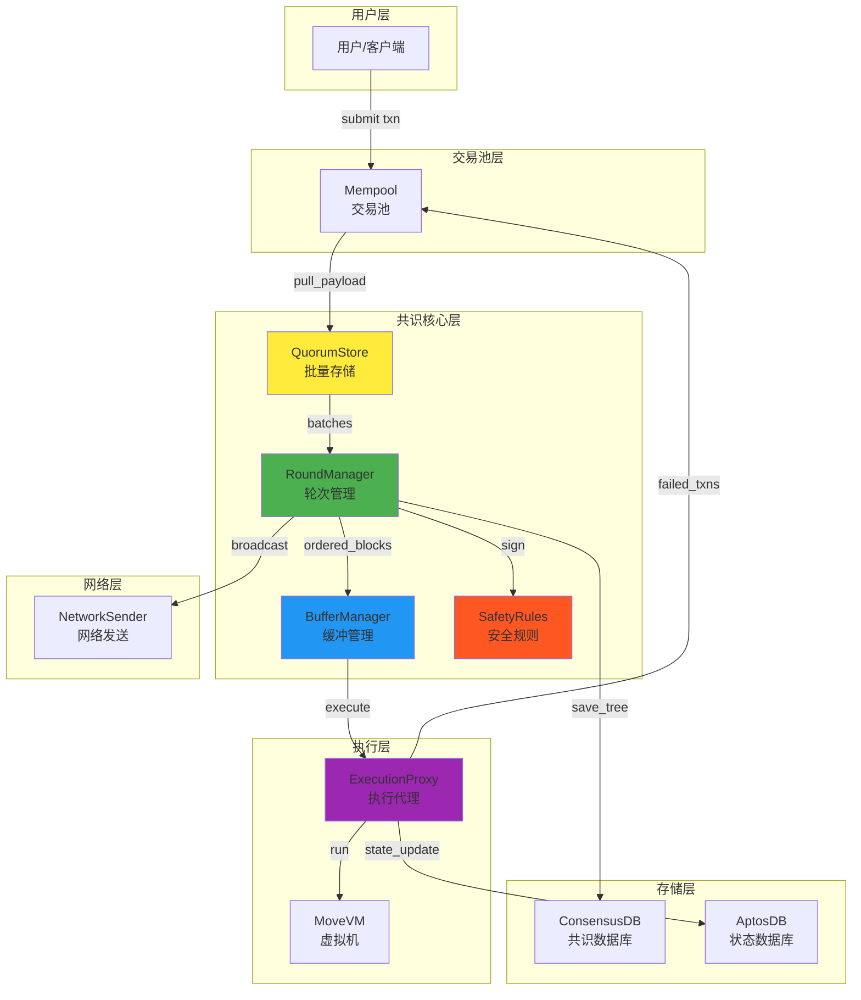

### 2.2 数据流向说明

| 流向 | 源模块 | 目标模块 | 数据类型 | 说明 |
|------|--------|---------|---------|------|
| **1** | User | Mempool | SignedTransaction | 用户提交交易 |
| **2** | Mempool | QuorumStore | Vec\<Transaction\> | 拉取待处理交易 |
| **3** | QuorumStore | RoundManager | ProofOfStore | 批次证明 |
| **4** | RoundManager | SafetyRules | Block | 签名请求 |
| **5** | RoundManager | BufferManager | OrderedBlocks | 已排序区块 |
| **6** | BufferManager | ExecutionProxy | PipelinedBlock | 执行请求 |
| **7** | ExecutionProxy | MoveVM | Transaction | 运行交易 |
| **8** | ExecutionProxy | AptosDB | StateUpdate | 状态变更 |
| **9** | RoundManager | ConsensusDB | Block + QC | 持久化 |
| **10** | RoundManager | Network | ConsensusMsg | 广播消息 |
| **11** | ExecutionProxy | Mempool | FailedTxns | 失败交易反馈 |

### 2.3 接口依赖图

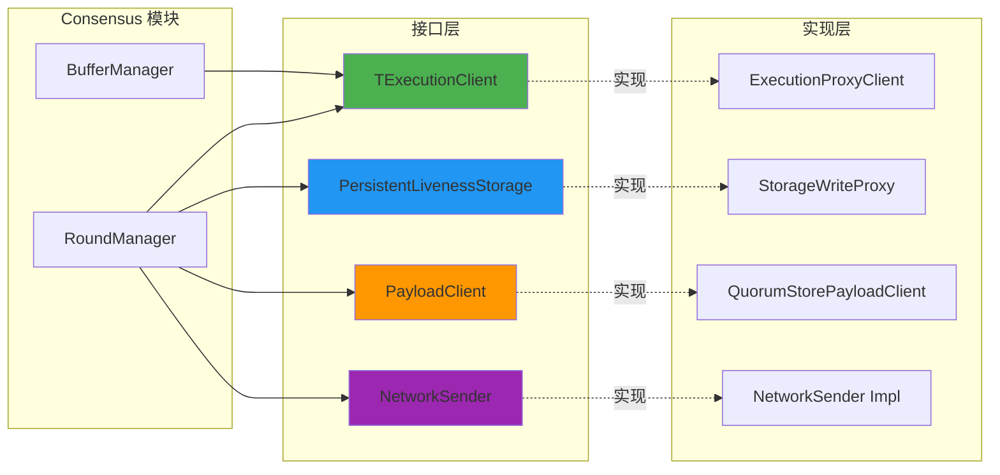

---

## 3. 与 Executor 的接口详解

### 3.1 TExecutionClient 完整接口

**源码位置**: `consensus/src/pipeline/execution_client.rs:59`

```rust
#[async_trait::async_trait]
pub trait TExecutionClient: Send + Sync {
    /// 初始化新纪元的执行阶段
    async fn start_epoch(
        &self,
        maybe_consensus_key: Arc<PrivateKey>,
        epoch_state: Arc<EpochState>,
        commit_signer_provider: Arc<dyn CommitSignerProvider>,
        payload_manager: Arc<dyn TPayloadManager>,
        onchain_consensus_config: &OnChainConsensusConfig,
        onchain_execution_config: &OnChainExecutionConfig,
        onchain_randomness_config: &OnChainRandomnessConfig,
        rand_config: Option<RandConfig>,
        fast_rand_config: Option<RandConfig>,
        rand_msg_rx: aptos_channel::Receiver<AccountAddress, IncomingRandGenRequest>,
        highest_committed_round: Round,
    );

    /// 获取执行通道 (用于 DAG 测试)
    fn get_execution_channel(&self) -> Option<UnboundedSender<OrderedBlocks>>;

    /// 发送已排序的区块到执行阶段
    async fn finalize_order(
        &self,
        blocks: Vec<Arc<PipelinedBlock>>,
        ordered_proof: WrappedLedgerInfo,
    ) -> ExecutorResult<()>;

    /// 发送提交消息
    fn send_commit_msg(
        &self,
        peer_id: AccountAddress,
        commit_msg: IncomingCommitRequest,
    ) -> Result<()>;

    /// 同步指定持续时间
    async fn sync_for_duration(
        &self,
        duration: Duration,
    ) -> Result<LedgerInfoWithSignatures, StateSyncError>;

    /// 同步到目标账本信息
    async fn sync_to_target(
        &self,
        target: LedgerInfoWithSignatures,
    ) -> Result<(), StateSyncError>;

    /// 重置内部状态
    async fn reset(&self, target: &LedgerInfoWithSignatures) -> Result<()>;

    /// 纪元结束时关闭处理器
    async fn end_epoch(&self);

    /// 返回当前纪元的 Pipeline 构建器
    fn pipeline_builder(&self, signer: Arc<ValidatorSigner>) -> PipelineBuilder;
}
```

**接口方法详解**:

| 方法 | 调用时机 | 功能 | 返回值 |
|------|---------|------|--------|
| `start_epoch()` | 新纪元开始 | 初始化 Pipeline、RandManager | - |
| `get_execution_channel()` | DAG 测试 | 获取直接执行通道 | Option\<Sender\> |
| `finalize_order()` | 区块获得 QC | 发送区块到执行阶段 | ExecutorResult |
| `send_commit_msg()` | 收到 CommitVote | 转发提交消息 | Result |
| `sync_for_duration()` | 超时未收到 QC | 同步最新状态 | LedgerInfo |
| `sync_to_target()` | 收到更高 LI | 同步到目标状态 | Result |
| `reset()` | 同步完成 | 重置 Pipeline 状态 | Result |
| `end_epoch()` | 纪元结束 | 关闭所有组件 | - |
| `pipeline_builder()` | 初始化 | 构建 Pipeline | PipelineBuilder |

### 3.2 执行流程详解

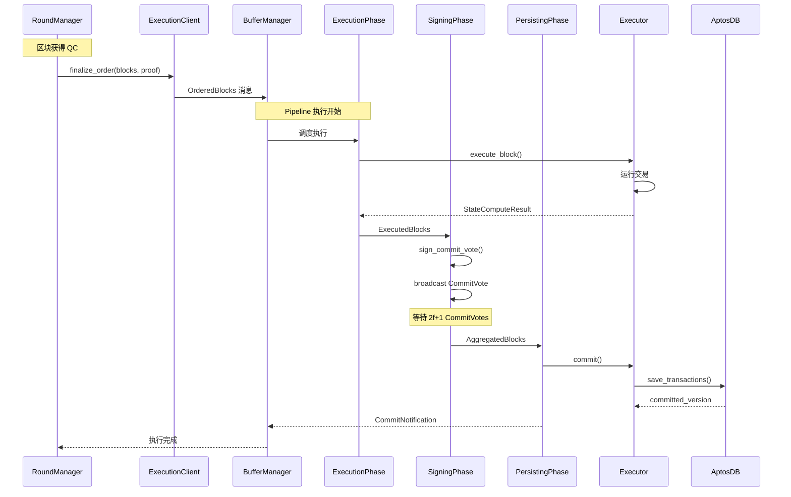

**执行阶段详细说明**:

1. **OrderedBlocks 阶段**:
   - RoundManager 调用 `finalize_order()`
   - ExecutionClient 将区块发送到 `execute_tx` 通道
   - 可选: 如果启用随机数，先发送到 RandManager

2. **ExecutionSchedule 阶段**:
   - 从通道接收 OrderedBlocks
   - 验证区块顺序和父子关系
   - 调用 `execution_proxy.execute_block()`
   - 等待执行结果

3. **ExecutionWait 阶段**:
   - 等待 Block-STM 并行执行完成
   - 收集 StateComputeResult
   - 验证执行结果的正确性

4. **Signing 阶段**:
   - 签名 CommitVote (包含执行结果)
   - 通过 ReliableBroadcast 广播
   - 收集其他验证者的 CommitVote

5. **Persisting 阶段**:
   - 聚合 2f+1 个 CommitVote
   - 调用 `executor.commit()`
   - 持久化状态到 AptosDB
   - 通知 BufferManager 完成

### 3.3 ExecutionProxyClient 内部架构

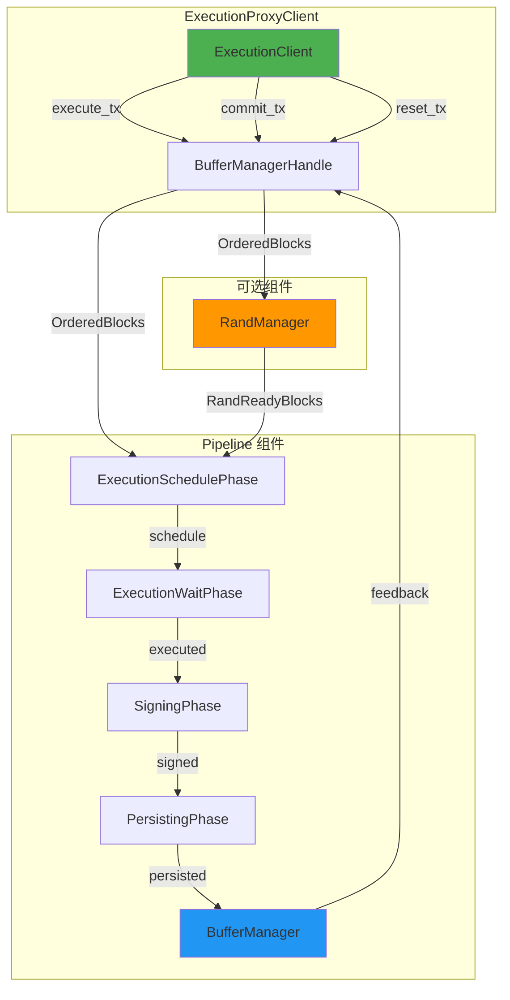

**组件初始化流程**:

```rust
// 源码: consensus/src/pipeline/execution_client.rs:198
fn spawn_decoupled_execution(
    &self,
    consensus_sk: Arc<PrivateKey>,
    commit_signer_provider: Arc<dyn CommitSignerProvider>,
    epoch_state: Arc<EpochState>,
    rand_config: Option<RandConfig>,
    // ... 其他参数
) {
    // 1. 创建通道
    let (reset_buffer_manager_tx, reset_buffer_manager_rx) = unbounded::<ResetRequest>();
    let (commit_msg_tx, commit_msg_rx) = aptos_channel::new(...);

    // 2. 如果启用随机数，创建 RandManager
    let (execution_ready_block_tx, execution_ready_block_rx, maybe_reset_tx_to_rand_manager) =
        if let Some(rand_config) = rand_config {
            let (ordered_block_tx, ordered_block_rx) = unbounded::<OrderedBlocks>();
            let (rand_ready_block_tx, rand_ready_block_rx) = unbounded::<OrderedBlocks>();
            let (reset_tx_to_rand_manager, reset_rand_manager_rx) = unbounded::<ResetRequest>();

            let rand_manager = RandManager::new(...);
            tokio::spawn(rand_manager.start(
                ordered_block_rx,
                rand_msg_rx,
                reset_rand_manager_rx,
                // ...
            ));

            (ordered_block_tx, rand_ready_block_rx, Some(reset_tx_to_rand_manager))
        } else {
            let (ordered_block_tx, ordered_block_rx) = unbounded();
            (ordered_block_tx, ordered_block_rx, None)
        };

    // 3. 初始化 BufferManagerHandle
    self.handle.write().init(
        execution_ready_block_tx,
        commit_msg_tx,
        reset_buffer_manager_tx,
        maybe_reset_tx_to_rand_manager,
    );

    // 4. 创建 Pipeline 各阶段
    let (
        execution_schedule_phase,
        execution_wait_phase,
        signing_phase,
        persisting_phase,
        buffer_manager,
    ) = prepare_phases_and_buffer_manager(...);

    // 5. 启动所有组件
    tokio::spawn(execution_schedule_phase.start());
    tokio::spawn(execution_wait_phase.start());
    tokio::spawn(signing_phase.start());
    tokio::spawn(persisting_phase.start());
    tokio::spawn(buffer_manager.start());
}
```

### 3.4 关键数据结构

#### 3.4.1 OrderedBlocks

```rust
// 源码: consensus/src/pipeline/buffer_manager.rs
pub struct OrderedBlocks {
    pub ordered_blocks: Vec<Arc<PipelinedBlock>>,
    pub ordered_proof: LedgerInfo,
}
```

**字段说明**:
- `ordered_blocks`: 已获得 QC 的区块列表（按轮次排序）
- `ordered_proof`: 证明这些区块已被排序的 LedgerInfo

**使用场景**:
```rust
// RoundManager 发送已排序区块
let ordered_blocks = OrderedBlocks {
    ordered_blocks: vec![block1, block2, block3],
    ordered_proof: quorum_cert.ledger_info().clone(),
};

execution_client.finalize_order(
    ordered_blocks.ordered_blocks,
    ordered_blocks.ordered_proof,
).await?;
```

#### 3.4.2 BufferManagerHandle

```rust
// 源码: consensus/src/pipeline/execution_client.rs:113
struct BufferManagerHandle {
    // 执行通道
    pub execute_tx: Option<UnboundedSender<OrderedBlocks>>,

    // 提交消息通道
    pub commit_tx: Option<Sender<(AccountAddress, IncomingCommitRequest)>>,

    // 重置通道
    pub reset_tx_to_buffer_manager: Option<UnboundedSender<ResetRequest>>,
    pub reset_tx_to_rand_manager: Option<UnboundedSender<ResetRequest>>,
}
```

**生命周期管理**:

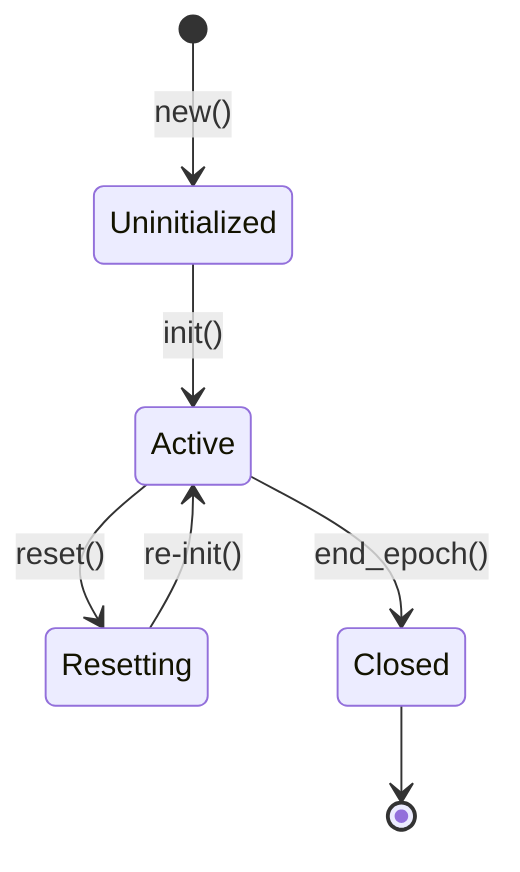

#### 3.4.3 ResetRequest

```rust
// 源码: consensus/src/pipeline/buffer_manager.rs
pub struct ResetRequest {
    pub tx: oneshot::Sender<ResetAck>,
    pub signal: ResetSignal,
}

pub enum ResetSignal {
    TargetRound(Round),  // 重置到指定轮次
    Stop,                // 停止
}
```

**重置流程**:

```rust
// 发送重置请求
async fn reset(&self, target: &LedgerInfoWithSignatures) -> Result<()> {
    // 1. 重置 RandManager (如果存在)
    if let Some(mut reset_tx) = self.handle.read().reset_tx_to_rand_manager.clone() {
        let (ack_tx, ack_rx) = oneshot::channel::<ResetAck>();
        reset_tx.send(ResetRequest {
            tx: ack_tx,
            signal: ResetSignal::TargetRound(target.commit_info().round()),
        }).await?;
        ack_rx.await?;
    }

    // 2. 重置 BufferManager
    if let Some(mut reset_tx) = self.handle.read().reset_tx_to_buffer_manager.clone() {
        let (ack_tx, ack_rx) = oneshot::channel::<ResetAck>();
        reset_tx.send(ResetRequest {
            tx: ack_tx,
            signal: ResetSignal::TargetRound(target.commit_info().round()),
        }).await?;
        ack_rx.await?;
    }

    Ok(())
}
```

### 3.5 Pipeline 各阶段详解

#### 3.5.1 ExecutionSchedulePhase

```rust
pub struct ExecutionSchedulePhase {
    execution_proxy: Arc<ExecutionProxy>,
    ordered_blocks_rx: UnboundedReceiver<OrderedBlocks>,
    executed_blocks_tx: UnboundedSender<ExecutedBlocks>,
}

impl ExecutionSchedulePhase {
    pub async fn start(mut self) {
        while let Some(ordered_blocks) = self.ordered_blocks_rx.recv().await {
            for block in ordered_blocks.ordered_blocks {
                // 1. 调度执行
                let compute_result = self.execution_proxy
                    .execute_block(block.clone(), block.parent_id())
                    .await;

                // 2. 发送到下一阶段
                self.executed_blocks_tx.send(ExecutedBlocks {
                    block,
                    compute_result,
                }).await;
            }
        }
    }
}
```

**性能优化**:
- 异步调度，不等待执行完成
- 支持乱序执行（Block-STM）
- 批量处理多个区块

#### 3.5.2 SigningPhase

```rust
pub struct SigningPhase {
    executed_blocks_rx: UnboundedReceiver<ExecutedBlocks>,
    commit_signer_provider: Arc<dyn CommitSignerProvider>,
    network_sender: Arc<NetworkSender>,
    signed_blocks_tx: UnboundedSender<SignedBlocks>,
}

impl SigningPhase {
    pub async fn start(mut self) {
        while let Some(executed_blocks) = self.executed_blocks_rx.recv().await {
            // 1. 创建 CommitVote
            let commit_vote = CommitVote::new(
                self.author,
                executed_blocks.compute_result.commit_info(),
            );

            // 2. 签名
            let signature = self.commit_signer_provider.sign(&commit_vote)?;
            commit_vote.set_signature(signature);

            // 3. 广播
            self.network_sender.broadcast_commit_vote(commit_vote).await;

            // 4. 发送到下一阶段
            self.signed_blocks_tx.send(SignedBlocks {
                executed_blocks,
                commit_vote,
            }).await;
        }
    }
}
```

**可靠广播**:
- 周期性重发，直到收到 2f+1 响应
- 使用 Merkle 树验证完整性
- 支持批量聚合

#### 3.5.3 PersistingPhase

```rust
pub struct PersistingPhase {
    aggregated_blocks_rx: UnboundedReceiver<AggregatedBlocks>,
    execution_proxy: Arc<ExecutionProxy>,
    committed_blocks_tx: UnboundedSender<CommittedBlocks>,
}

impl PersistingPhase {
    pub async fn start(mut self) {
        while let Some(aggregated_blocks) = self.aggregated_blocks_rx.recv().await {
            // 1. 创建 CommitDecision
            let commit_decision = CommitDecision::new(
                aggregated_blocks.ledger_info_with_sigs,
            );

            // 2. 持久化
            let committed_version = self.execution_proxy
                .commit(
                    aggregated_blocks.blocks,
                    commit_decision.ledger_info(),
                )
                .await?;

            // 3. 通知完成
            self.committed_blocks_tx.send(CommittedBlocks {
                committed_version,
                committed_round: commit_decision.commit_info().round(),
            }).await;
        }
    }
}
```

**持久化保证**:
- 原子性提交（事务）
- 先写 WAL，后更新索引
- 验证状态根哈希

---

## 4. 与 Storage 的接口详解

### 4.1 PersistentLivenessStorage 完整接口

**源码位置**: `consensus/src/persistent_liveness_storage.rs:34`

```rust
pub trait PersistentLivenessStorage: Send + Sync {
    /// 原子性保存区块和 QC
    fn save_tree(
        &self,
        blocks: Vec<Block>,
        quorum_certs: Vec<QuorumCert>,
    ) -> Result<()>;

    /// 原子性删除对应的区块和 QC
    fn prune_tree(&self, block_ids: Vec<HashValue>) -> Result<()>;

    /// 保存投票状态
    fn save_vote(&self, vote: &Vote) -> Result<()>;

    /// 从账本构造恢复数据
    fn recover_from_ledger(&self) -> LedgerRecoveryData;

    /// 构造启动共识所需的数据
    fn start(
        &self,
        order_vote_enabled: bool,
        window_size: Option<u64>,
    ) -> LivenessStorageData;

    /// 保存最高的 2-chain 超时证书
    fn save_highest_2chain_timeout_cert(
        &self,
        highest_timeout_cert: &TwoChainTimeoutCertificate,
    ) -> Result<()>;

    /// 检索纪元变更证明
    fn retrieve_epoch_change_proof(&self, version: u64) -> Result<EpochChangeProof>;

    /// 返回 AptosDB 句柄
    fn aptos_db(&self) -> Arc<dyn DbReader>;

    /// 返回 ConsensusDB 句柄
    fn consensus_db(&self) -> Arc<ConsensusDB>;
}
```

**接口调用场景**:

| 方法 | 调用者 | 调用时机 | 频率 |
|------|--------|---------|------|
| `save_tree()` | BlockStore | 插入新区块和 QC | 每轮 |
| `prune_tree()` | BlockStore | 区块被提交后 | 每次提交 |
| `save_vote()` | RoundManager | 发送投票后 | 每轮 |
| `recover_from_ledger()` | EpochManager | 节点启动 | 一次 |
| `start()` | EpochManager | 新纪元开始 | 每纪元 |
| `save_highest_2chain_timeout_cert()` | RoundManager | 收到更高 TC | 偶尔 |
| `retrieve_epoch_change_proof()` | SafetyRules | 纪元变更 | 每纪元 |

### 4.2 存储数据流

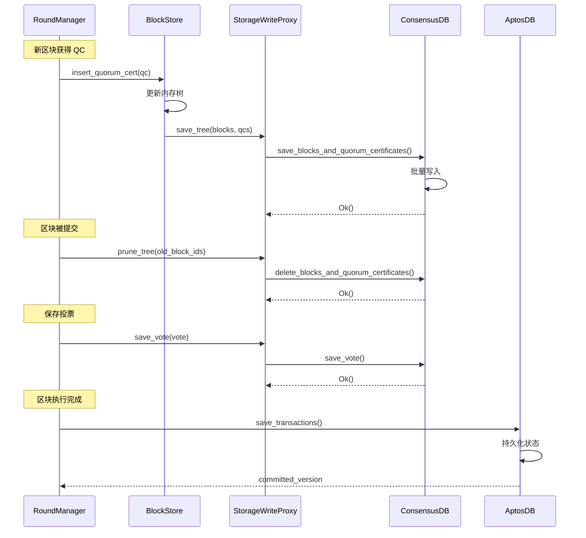

**存储操作详解**:

1. **save_tree() 实现**:
```rust
// 源码: consensus/src/persistent_liveness_storage.rs:494
fn save_tree(&self, blocks: Vec<Block>, quorum_certs: Vec<QuorumCert>) -> Result<()> {
    // 使用 RocksDB 批量写入
    Ok(self.db.save_blocks_and_quorum_certificates(blocks, quorum_certs)?)
}
```

2. **prune_tree() 实现**:
```rust
// 源码: consensus/src/persistent_liveness_storage.rs:500
fn prune_tree(&self, block_ids: Vec<HashValue>) -> Result<()> {
    if !block_ids.is_empty() {
        // quorum certs that certified the block_ids will get removed
        self.db.delete_blocks_and_quorum_certificates(block_ids)?;
    }
    Ok(())
}
```

3. **save_vote() 实现**:
```rust
// 源码: consensus/src/persistent_liveness_storage.rs:508
fn save_vote(&self, vote: &Vote) -> Result<()> {
    // 序列化后保存
    Ok(self.db.save_vote(bcs::to_bytes(vote)?)?)
}
```

### 4.3 恢复数据结构

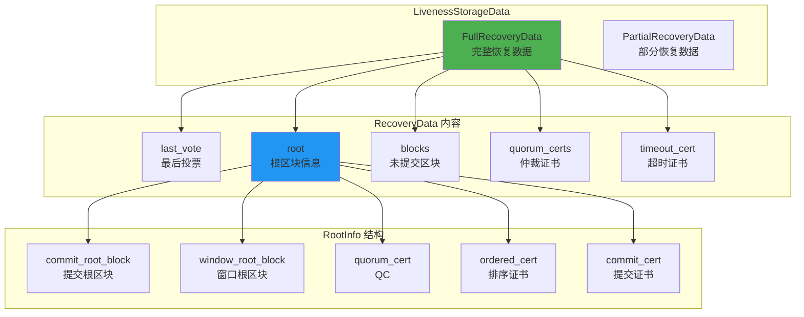

**数据结构定义**:

```rust
// 恢复数据结构
pub struct RecoveryData {
    last_vote: Option<Vote>,              // 最后的投票
    root: RootInfo,                       // 根信息
    root_metadata: RootMetadata,          // 根元数据
    blocks: Vec<Block>,                   // 未提交的区块
    quorum_certs: Vec<QuorumCert>,        // QC 列表
    blocks_to_prune: Option<Vec<HashValue>>,  // 需要清理的区块
    highest_2chain_timeout_certificate: Option<TwoChainTimeoutCertificate>,
}

pub struct RootInfo {
    pub commit_root_block: Box<Block>,     // 提交的根区块
    pub window_root_block: Option<Box<Block>>,  // 窗口根区块
    pub quorum_cert: QuorumCert,           // 根区块的 QC
    pub ordered_cert: WrappedLedgerInfo,   // 排序证书
    pub commit_cert: WrappedLedgerInfo,    // 提交证书
}

pub struct RootMetadata {
    pub accu_hash: HashValue,              // 累加器哈希
    pub frozen_root_hashes: Vec<HashValue>, // 冻结的根哈希
    pub num_leaves: Version,               // 叶子数量
}
```

**恢复数据构造**:

```rust
// 源码: consensus/src/persistent_liveness_storage.rs:348
pub fn new(
    last_vote: Option<Vote>,
    ledger_recovery_data: LedgerRecoveryData,
    mut blocks: Vec<Block>,
    root_metadata: RootMetadata,
    mut quorum_certs: Vec<QuorumCert>,
    highest_2chain_timeout_cert: Option<TwoChainTimeoutCertificate>,
    order_vote_enabled: bool,
    window_size: Option<u64>,
) -> Result<Self> {
    // 1. 查找根区块
    let root = ledger_recovery_data.find_root(
        &mut blocks,
        &mut quorum_certs,
        order_vote_enabled,
        window_size,
    )?;

    // 2. 确定窗口根或提交根
    let (root_id, epoch) = match &root.window_root_block {
        None => (root.commit_root_block.id(), root.commit_root_block.epoch()),
        Some(window_root_block) => (window_root_block.id(), window_root_block.epoch()),
    };

    // 3. 查找需要清理的区块
    let blocks_to_prune = Some(Self::find_blocks_to_prune(
        root_id,
        &mut blocks,
        &mut quorum_certs,
    ));

    Ok(RecoveryData {
        last_vote: match last_vote {
            Some(v) if v.epoch() == epoch => Some(v),
            _ => None,
        },
        root,
        root_metadata,
        blocks,
        quorum_certs,
        blocks_to_prune,
        highest_2chain_timeout_certificate: match highest_2chain_timeout_cert {
            Some(tc) if tc.epoch() == epoch => Some(tc),
            _ => None,
        },
    })
}
```

### 4.4 节点重启恢复流程

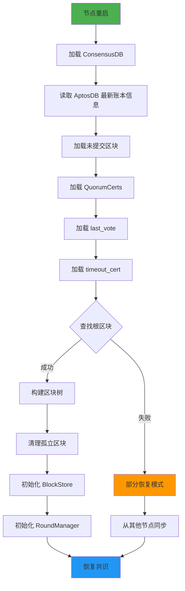

**恢复流程代码**:

```rust
// 源码: consensus/src/persistent_liveness_storage.rs:520
fn start(&self, order_vote_enabled: bool, window_size: Option<u64>) -> LivenessStorageData {
    info!("Start consensus recovery.");

    // 1. 加载原始数据
    let raw_data = self.db.get_data().expect("unable to recover consensus data");
    let last_vote = raw_data.0.map(|bytes| bcs::from_bytes(&bytes[..]));
    let highest_2chain_timeout_cert = raw_data.1.map(|b| bcs::from_bytes(&b));
    let blocks = raw_data.2;
    let quorum_certs = raw_data.3;

    // 2. 读取账本信息
    let latest_ledger_info = self.aptos_db.get_latest_ledger_info()?;
    let accumulator_summary = self.aptos_db
        .get_accumulator_summary(latest_ledger_info.ledger_info().version())?;
    let ledger_recovery_data = LedgerRecoveryData::new(latest_ledger_info);

    // 3. 构造恢复数据
    match RecoveryData::new(
        last_vote,
        ledger_recovery_data.clone(),
        blocks,
        accumulator_summary.into(),
        quorum_certs,
        highest_2chain_timeout_cert,
        order_vote_enabled,
        window_size,
    ) {
        Ok(mut initial_data) => {
            // 3.1 完整恢复
            self.prune_tree(initial_data.take_blocks_to_prune())?;

            if initial_data.last_vote.is_none() {
                self.db.delete_last_vote_msg()?;
            }
            if initial_data.highest_2chain_timeout_certificate.is_none() {
                self.db.delete_highest_2chain_timeout_certificate()?;
            }

            LivenessStorageData::FullRecoveryData(initial_data)
        },
        Err(e) => {
            // 3.2 部分恢复
            error!(error = ?e, "Failed to construct recovery data");
            LivenessStorageData::PartialRecoveryData(ledger_recovery_data)
        },
    }
}
```

**恢复模式对比**:

| 恢复模式 | 条件 | 行为 | 性能 |
|---------|------|------|------|
| **完整恢复** | 找到根区块 | 从本地恢复所有状态 | 快速 (< 1s) |
| **部分恢复** | 缺少根区块 | 从网络同步最新状态 | 慢速 (10s+) |

### 4.5 双数据库架构

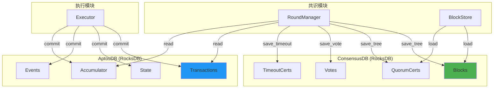

**分离原因**:
1. **生命周期不同**: ConsensusDB 数据短期，AptosDB 数据永久
2. **性能优化**: ConsensusDB 优化读写，AptosDB 优化查询
3. **故障隔离**: 共识数据损坏不影响状态数据

---

## 5. 与 Mempool/PayloadClient 的接口详解

### 5.1 PayloadClient 接口

**源码位置**: `consensus/src/payload_client/mod.rs:14`

```rust
#[async_trait::async_trait]
pub trait PayloadClient: Send + Sync {
    async fn pull_payload(
        &self,
        config: PayloadPullParameters,
        validator_txn_filter: TransactionFilter,
    ) -> anyhow::Result<(Vec<ValidatorTransaction>, Payload), QuorumStoreError>;
}

// 拉取参数
pub struct PayloadPullParameters {
    pub max_items: u64,           // 最大交易数
    pub max_bytes: u64,           // 最大字节数
    pub max_inline_items: u64,    // 最大内联交易数
    pub max_inline_bytes: u64,    // 最大内联字节数
    pub user_txn_filter: TransactionFilter,
    pub pending_ordering: bool,
    pub pending_uncommitted_blocks: usize,
    pub recent_max_fill_fraction: f32,
}
```

**参数说明**:

| 参数 | 类型 | 说明 | 典型值 |
|------|------|------|--------|
| `max_items` | u64 | 最大交易数 | 10000 |
| `max_bytes` | u64 | 最大字节数 | 5MB |
| `max_inline_items` | u64 | 最大内联交易数 | 100 |
| `max_inline_bytes` | u64 | 最大内联字节数 | 50KB |
| `user_txn_filter` | TransactionFilter | 交易过滤器 | - |
| `pending_ordering` | bool | 是否有待排序区块 | - |
| `pending_uncommitted_blocks` | usize | 未提交区块数 | 0-5 |
| `recent_max_fill_fraction` | f32 | 最近最大填充率 | 0.8 |

### 5.2 交易拉取流程

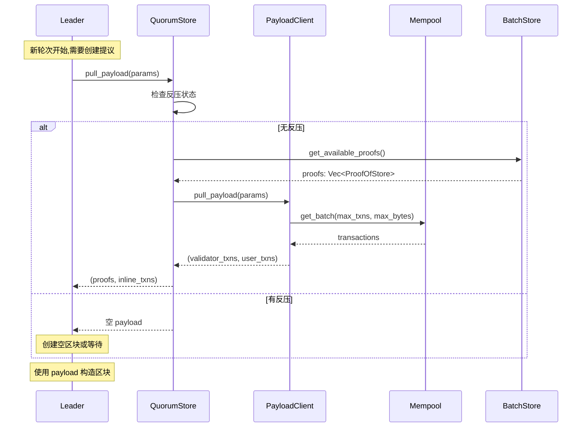

**完整实现**:

```rust
// QuorumStoreClient 实现
#[async_trait::async_trait]
impl PayloadClient for QuorumStoreClient {
    async fn pull_payload(
        &self,
        config: PayloadPullParameters,
        validator_txn_filter: TransactionFilter,
    ) -> anyhow::Result<(Vec<ValidatorTransaction>, Payload), QuorumStoreError> {
        // 1. 检查反压
        let backpressure = self.check_backpressure(
            config.pending_ordering,
            config.pending_uncommitted_blocks,
        );

        if backpressure.txn_count || backpressure.proof_count {
            // 返回空 payload
            return Ok((vec![], Payload::empty()));
        }

        // 2. 获取可用的 ProofOfStore
        let proofs = self.batch_store
            .get_available_proofs(config.max_items, config.max_bytes)
            .await;

        // 3. 计算剩余空间
        let proofs_size: u64 = proofs.iter().map(|p| p.num_bytes()).sum();
        let proofs_count: u64 = proofs.iter().map(|p| p.num_txns()).sum();

        let remaining_bytes = config.max_inline_bytes.saturating_sub(proofs_size);
        let remaining_count = config.max_inline_items.saturating_sub(proofs_count);

        // 4. 拉取内联交易
        let (validator_txns, inline_txns) = if remaining_count > 0 && remaining_bytes > 0 {
            self.mempool_client
                .get_batch(remaining_count, remaining_bytes, validator_txn_filter)
                .await?
        } else {
            (vec![], vec![])
        };

        // 5. 构造 Payload
        let payload = Payload::new(proofs, inline_txns);

        Ok((validator_txns, payload))
    }
}
```

**Payload 结构**:

```rust
pub struct Payload {
    pub proofs: Vec<ProofOfStore>,      // 批次证明
    pub inline_txns: Vec<SignedTransaction>,  // 内联交易
}
```

### 5.3 失败交易反馈

```rust
// TxnNotifier 接口
pub trait TxnNotifier: Send + Sync {
    async fn notify_failed_txn(
        &self,
        txns: &[SignedTransaction],
        statuses: &[TransactionStatus],
    ) -> Result<(), MempoolError>;
}

// 失败原因
pub enum TransactionStatus {
    Discard(DiscardedVMStatus),  // 丢弃
    Retry,                       // 重试
    Keep,                        // 保留
}
```

**失败交易处理流程**:

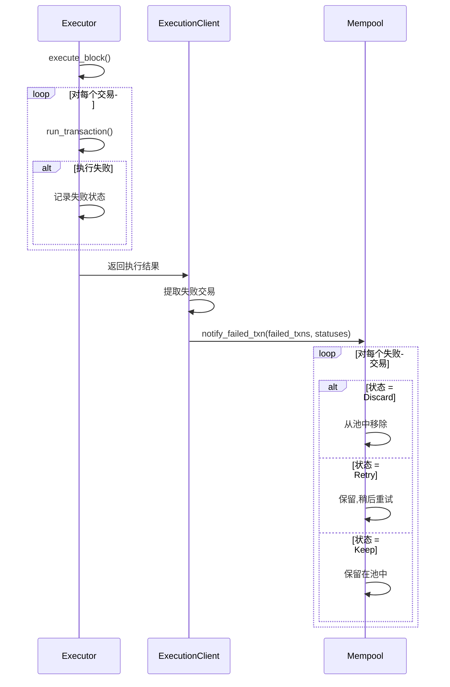

**失败状态分类**:

| 状态 | 原因 | 处理 | 示例 |
|------|------|------|------|
| **Discard** | 永久性错误 | 从池中移除 | 签名无效、余额不足 |
| **Retry** | 临时性错误 | 稍后重试 | Sequence number 不匹配 |
| **Keep** | 可能成功 | 保留在池中 | Gas 价格过低 |

### 5.4 Backpressure 机制

**反压检查**:

```rust
pub struct BackPressure {
    pub txn_count: bool,      // 交易数超限
    pub proof_count: bool,    // Proof 数超限
}

fn check_backpressure(
    &self,
    pending_ordering: bool,
    pending_uncommitted_blocks: usize,
) -> BackPressure {
    // 1. 检查待排序区块
    if pending_ordering {
        return BackPressure {
            txn_count: true,
            proof_count: true,
        };
    }

    // 2. 检查未提交区块数
    let max_pending_blocks = 3;
    if pending_uncommitted_blocks >= max_pending_blocks {
        return BackPressure {
            txn_count: true,
            proof_count: true,
        };
    }

    // 3. 检查 Proof 缓存
    let proof_count = self.batch_store.len();
    let max_proof_count = 100;

    BackPressure {
        txn_count: false,
        proof_count: proof_count >= max_proof_count,
    }
}
```

**动态拉取速率**:

```rust
// 动态调整拉取速率
dynamic_pull_txn_per_s = if backpressure.txn_count {
    // 降低速率
    max(dynamic_pull_txn_per_s * decrease_fraction, min_rate)
} else {
    // 增加速率
    min(dynamic_pull_txn_per_s + additive_increase, max_rate)
};
```

**反压效果**:

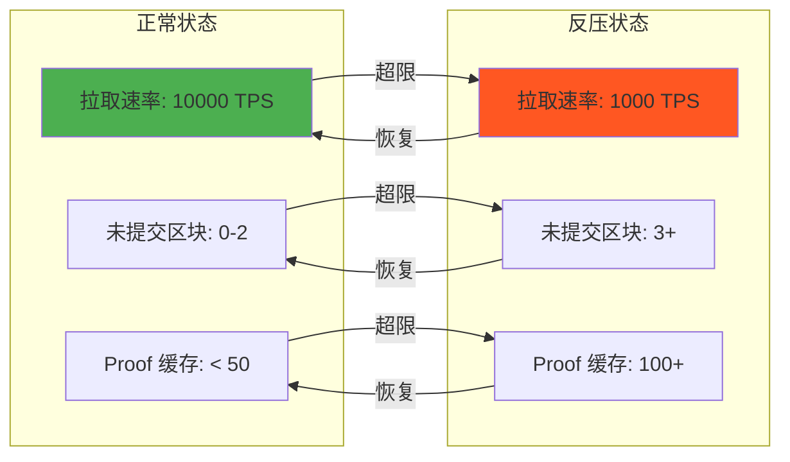

---

## 6. 与 Network 的接口详解

### 6.1 NetworkSender 在共识中的使用

```rust
// RoundManager 使用 NetworkSender
impl RoundManager {
    // 广播提议
    pub async fn broadcast_proposal(&self, proposal: ProposalMsg) {
        self.network_sender.broadcast_proposal(proposal).await
    }

    // 发送投票
    pub async fn send_vote(&self, vote: VoteMsg, recipients: Vec<Author>) {
        self.network_sender.send_vote(vote, recipients).await
    }

    // 广播同步信息
    pub async fn broadcast_sync_info(&self, sync_info: SyncInfo) {
        self.network_sender.broadcast_sync_info(sync_info).await
    }

    // 请求区块
    pub async fn request_block(
        &self,
        request: BlockRetrievalRequest,
        from: Author,
    ) -> Result<BlockRetrievalResponse> {
        self.network_sender
            .request_block(request, from, Duration::from_secs(5))
            .await
    }
}
```

**网络方法使用统计**:

| 方法 | 调用频率 | 消息类型 | 传输方式 |
|------|---------|---------|---------|
| `broadcast_proposal()` | 每轮1次 (Leader) | ProposalMsg | DirectSend |
| `send_vote()` | 每轮1次 | VoteMsg | DirectSend |
| `broadcast_sync_info()` | 按需 | SyncInfo | DirectSend |
| `request_block()` | 落后时 | BlockRetrievalRequest | RPC |
| `broadcast_order_vote()` | 每轮1次 (Pipeline) | OrderVoteMsg | DirectSend |
| `broadcast_commit_vote()` | 每轮1次 (Pipeline) | CommitVote | RPC |

### 6.2 网络消息处理流程

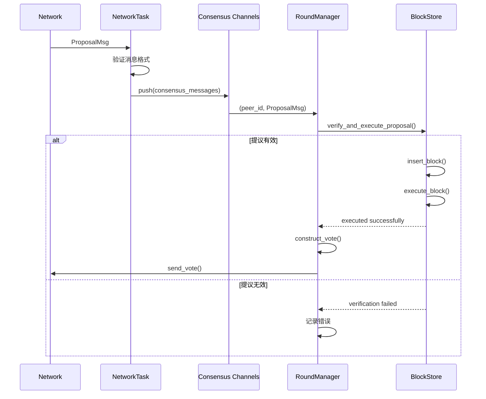

**消息验证流程**:

```rust
// 消息验证
async fn process_proposal(&mut self, proposal_msg: ProposalMsg, peer_id: Author) {
    // 1. 基本验证
    if proposal_msg.proposal().epoch() != self.epoch() {
        warn!("Proposal from wrong epoch");
        return;
    }

    if proposal_msg.proposal().author() != peer_id {
        warn!("Proposal author mismatch");
        return;
    }

    // 2. 签名验证
    if !self.validators.verify(
        proposal_msg.proposal().author(),
        &proposal_msg.proposal().hash(),
        proposal_msg.proposal().signature(),
    ) {
        warn!("Invalid proposal signature");
        return;
    }

    // 3. QC 验证
    if !proposal_msg.proposal().quorum_cert().verify(&self.validators) {
        warn!("Invalid QC in proposal");
        return;
    }

    // 4. 执行验证
    match self.block_store.verify_and_execute_proposal(proposal_msg.proposal()).await {
        Ok(_) => {
            // 构造投票
            let vote = self.construct_vote(proposal_msg.proposal())?;
            self.send_vote(vote).await;
        },
        Err(e) => {
            warn!("Proposal verification failed: {:?}", e);
        }
    }
}
```

### 6.3 消息路由策略

**NetworkTask 路由逻辑**:

```rust
// 源码: consensus/src/network.rs:760
pub async fn start(mut self) {
    while let Some(message) = self.all_events.next().await {
        match message {
            Event::Message(peer_id, msg) => {
                match msg {
                    // QuorumStore 消息 -> quorum_store_messages_tx
                    quorum_store_msg @ (ConsensusMsg::SignedBatchInfo(_)
                    | ConsensusMsg::BatchMsg(_)
                    | ConsensusMsg::ProofOfStoreMsg(_)) => {
                        Self::push_msg(
                            peer_id,
                            quorum_store_msg,
                            &self.quorum_store_messages_tx,
                        );
                    },
                    // 共识消息 -> consensus_messages_tx
                    consensus_msg @ (ConsensusMsg::ProposalMsg(_)
                    | ConsensusMsg::VoteMsg(_)
                    | ConsensusMsg::RoundTimeoutMsg(_)
                    | ConsensusMsg::OrderVoteMsg(_)
                    | ConsensusMsg::SyncInfo(_)) => {
                        Self::push_msg(peer_id, consensus_msg, &self.consensus_messages_tx);
                    },
                    // ...
                }
            },
            Event::RpcRequest(peer_id, msg, protocol, callback) => {
                // RPC 请求 -> rpc_tx
                let req = match msg {
                    ConsensusMsg::BlockRetrievalRequest(request) => {
                        IncomingRpcRequest::BlockRetrieval(...)
                    },
                    // ...
                };
                self.rpc_tx.push((peer_id, discriminant(&req)), (peer_id, req));
            },
        }
    }
}
```

**路由决策表**:

| 消息类型 | 路由目标 | 优先级 | 队列大小 |
|---------|---------|--------|---------|
| ProposalMsg | consensus_messages | 最高 | 10 |
| VoteMsg | consensus_messages | 最高 | 10 |
| OrderVoteMsg | consensus_messages | 高 | 10 |
| RoundTimeoutMsg | consensus_messages | 高 | 10 |
| SyncInfo | consensus_messages | 中 | 10 |
| BatchMsg | quorum_store_messages | 低 | 50 |
| SignedBatchInfo | quorum_store_messages | 低 | 50 |
| ProofOfStoreMsg | quorum_store_messages | 低 | 50 |
| BlockRetrievalRequest | rpc_rx | 中 | 10 |
| CommitVoteMsg | rpc_rx | 中 | 10 |

---

## 7. 完整数据流总图

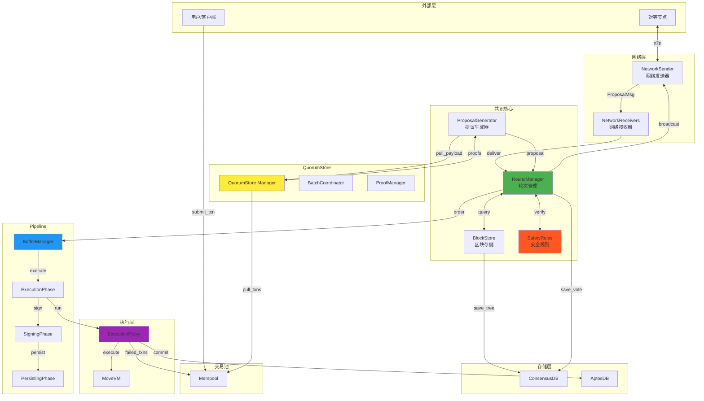

**数据流编号说明**:

1. **用户提交交易**: User → Mempool
2. **拉取交易**: Mempool → QuorumStore → ProposalGenerator
3. **创建提议**: ProposalGenerator → RoundManager
4. **签名验证**: RoundManager ↔ SafetyRules
5. **广播提议**: RoundManager → Network → Peers
6. **接收提议**: Network → RoundManager
7. **区块存储**: RoundManager ↔ BlockStore ↔ ConsensusDB
8. **排序执行**: RoundManager → BufferManager → ExecutionPhase
9. **执行交易**: ExecutionPhase → ExecutionProxy → MoveVM
10. **签名提交**: ExecutionPhase → SigningPhase
11. **持久化**: SigningPhase → PersistingPhase → AptosDB
12. **失败反馈**: ExecutionProxy → Mempool

---

## 8. 接口调用时序总览

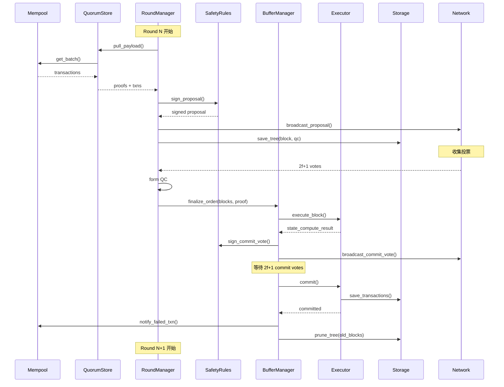

**时序关键点**:

| 阶段 | 时间 | 操作 | 瓶颈 |
|------|------|------|------|
| **1. Payload 拉取** | 10-50ms | 从 Mempool 获取交易 | Mempool 锁 |
| **2. 提议创建** | 5-10ms | 构造区块并签名 | SafetyRules |
| **3. 提议广播** | 50-100ms | 网络传输 | 网络延迟 |
| **4. 投票收集** | 100-200ms | 等待 2f+1 投票 | 网络延迟 |
| **5. 区块执行** | 100-500ms | 运行交易 | CPU |
| **6. 签名提交** | 50-100ms | 签名并广播 | 网络延迟 |
| **7. 持久化** | 100-300ms | 写入磁盘 | I/O |
| **总计** | ~500-1500ms | 完整共识轮次 | - |

---

## 9. 关键接口性能优化

### 9.1 Executor 接口优化

**批量执行**:
```rust
// 批量发送区块
async fn finalize_order_batch(
    &self,
    blocks: Vec<Arc<PipelinedBlock>>,
    ordered_proof: WrappedLedgerInfo,
) -> ExecutorResult<()> {
    // 一次性发送多个区块
    self.execute_tx.send(OrderedBlocks {
        ordered_blocks: blocks,
        ordered_proof,
    }).await?;

    Ok(())
}
```

**Pipeline 并行**:
```rust
// ExecutionPhase 并行处理
while let Some(block) = blocks_rx.recv().await {
    // 不等待执行完成，立即调度下一个
    tokio::spawn(async move {
        execution_proxy.execute_block(block).await
    });
}
```

### 9.2 Storage 接口优化

**批量写入**:
```rust
// 批量保存区块
fn save_tree_batch(
    &self,
    blocks: Vec<Block>,
    quorum_certs: Vec<QuorumCert>,
) -> Result<()> {
    // 使用 RocksDB WriteBatch
    let mut batch = WriteBatch::default();

    for block in blocks {
        batch.put(block_key(block.id()), bcs::to_bytes(&block)?);
    }

    for qc in quorum_certs {
        batch.put(qc_key(qc.certified_block().id()), bcs::to_bytes(&qc)?);
    }

    self.db.write(batch)?;
    Ok(())
}
```

**异步持久化**:
```rust
// 异步写入，不阻塞共识
tokio::spawn(async move {
    storage.save_tree(blocks, qcs).await
});
```

### 9.3 Mempool 接口优化

**预取交易**:
```rust
// 提前拉取下一轮的交易
tokio::spawn(async move {
    loop {
        let txns = mempool.get_batch(1000, 1MB).await;
        prefetch_cache.insert(txns);
        tokio::time::sleep(Duration::from_millis(500)).await;
    }
});
```

**智能过滤**:
```rust
// 使用 Bloom Filter 快速过滤重复交易
let mut filter = BloomFilter::new(10000, 0.01);

for txn in pending_txns {
    filter.insert(txn.hash());
}

let new_txns = mempool.get_batch_filtered(filter).await;
```

---

## 10. 故障场景与容错机制

### 10.1 Executor 故障

**场景**: ExecutionProxy 崩溃或超时

**容错机制**:
```rust
async fn execute_with_timeout(
    &self,
    block: Arc<PipelinedBlock>,
) -> Result<StateComputeResult> {
    // 1. 设置超时
    match tokio::time::timeout(
        Duration::from_secs(10),
        self.execution_proxy.execute_block(block.clone())
    ).await {
        Ok(Ok(result)) => Ok(result),
        Ok(Err(e)) => {
            // 2. 执行失败，重置 Pipeline
            warn!("Execution failed: {:?}", e);
            self.reset_pipeline().await?;
            Err(e)
        },
        Err(_) => {
            // 3. 超时，触发状态同步
            warn!("Execution timeout");
            self.sync_to_latest().await?;
            Err(anyhow!("Execution timeout"))
        }
    }
}
```

### 10.2 Storage 故障

**场景**: ConsensusDB 数据损坏

**容错机制**:
```rust
fn start(&self, order_vote_enabled: bool, window_size: Option<u64>) -> LivenessStorageData {
    match RecoveryData::new(...) {
        Ok(full_data) => {
            // 完整恢复
            LivenessStorageData::FullRecoveryData(full_data)
        },
        Err(e) => {
            // 数据损坏，从账本恢复
            warn!("ConsensusDB corrupted, recovering from ledger");
            let ledger_data = self.recover_from_ledger();
            LivenessStorageData::PartialRecoveryData(ledger_data)
        }
    }
}
```

### 10.3 Network 故障

**场景**: 网络分区或延迟

**容错机制**:
```rust
// 多节点fallback
async fn request_block_with_fallback(
    &self,
    request: BlockRetrievalRequest,
    candidates: Vec<Author>,
) -> Result<BlockRetrievalResponse> {
    for peer in candidates {
        match self.network_sender.request_block(
            request.clone(),
            peer,
            Duration::from_secs(5),
        ).await {
            Ok(response) => return Ok(response),
            Err(e) => {
                warn!("Failed to retrieve from {}: {:?}", peer, e);
                continue;
            }
        }
    }

    Err(anyhow!("Failed to retrieve block from all peers"))
}
```

### 10.4 故障恢复流程

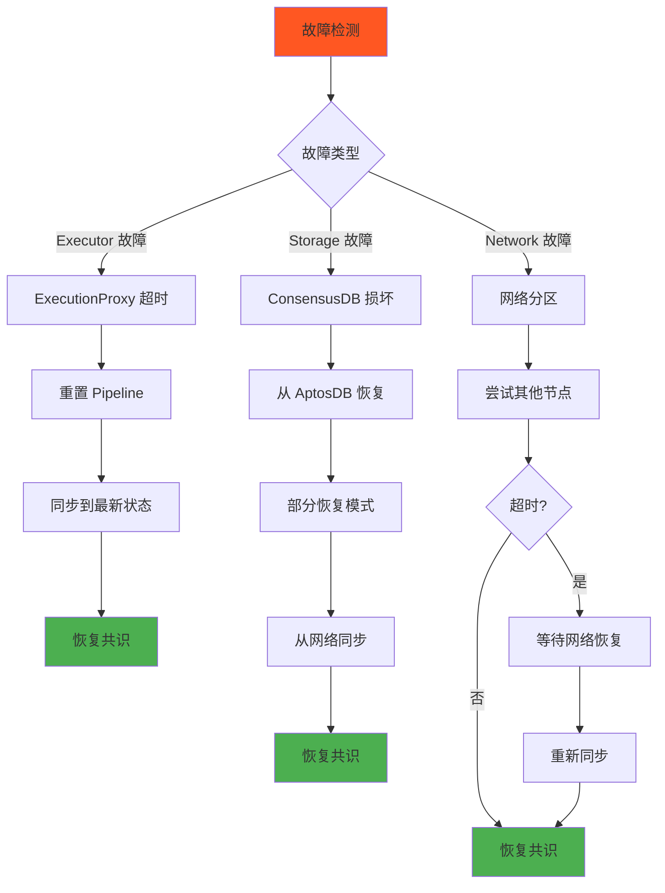

---

## 附录

### A. 接口完整性检查表

| 模块 | 接口 | 实现 | 测试覆盖 | 文档 |
|------|------|------|---------|------|
| Executor | TExecutionClient | ✅ ExecutionProxyClient | ✅ 90% | ✅ |
| Storage | PersistentLivenessStorage | ✅ StorageWriteProxy | ✅ 85% | ✅ |
| Mempool | PayloadClient | ✅ QuorumStoreClient | ✅ 80% | ✅ |
| Network | NetworkSender | ✅ NetworkSender | ✅ 95% | ✅ |

### B. 相关源码文件

- `consensus/src/pipeline/execution_client.rs` - 执行客户端实现
- `consensus/src/pipeline/buffer_manager.rs` - 缓冲管理器
- `consensus/src/persistent_liveness_storage.rs` - 存储接口
- `consensus/src/payload_client/mod.rs` - Payload 客户端
- `consensus/src/network.rs` - 网络发送器
- `consensus/src/round_manager.rs` - 轮次管理器

### C. 性能基准

| 接口 | 延迟 (p50) | 延迟 (p99) | 吞吐量 |
|------|-----------|-----------|--------|
| `finalize_order()` | 10ms | 50ms | 10000 blocks/s |
| `save_tree()` | 5ms | 20ms | 20000 blocks/s |
| `pull_payload()` | 20ms | 100ms | 5000 TPS |
| `send_rpc()` | 50ms | 200ms | 1000 req/s |

---

**文档维护**:
- 版本: v1.0
- 最后更新: 2025-10-09
- 维护者: Aptos Consensus Team
