# CometBFT vs HotStuff 共识机制深度对比分析

> **文档版本**: v1.0
> **作者**: 架构研究团队
> **日期**: 2025-10-08
> **目标读者**: 区块链架构师、共识算法研究者、系统工程师

---

## 目录

1. [概述与背景](#1-概述与背景)
2. [CometBFT 共识机制深度解析](#2-cometbft-共识机制深度解析)
3. [HotStuff 共识机制深度解析](#3-hotstuff-共识机制深度解析)
4. [核心差异对比](#4-核心差异对比)
5. [性能分析](#5-性能分析)
6. [安全性分析](#6-安全性分析)
7. [实际应用案例](#7-实际应用案例)
8. [总结与选型建议](#8-总结与选型建议)

---

## 1. 概述与背景

### 1.1 什么是 BFT 共识?

**拜占庭容错 (Byzantine Fault Tolerance, BFT)** 是一类分布式共识协议,能够在存在恶意节点(拜占庭节点)的情况下保证系统正确性。

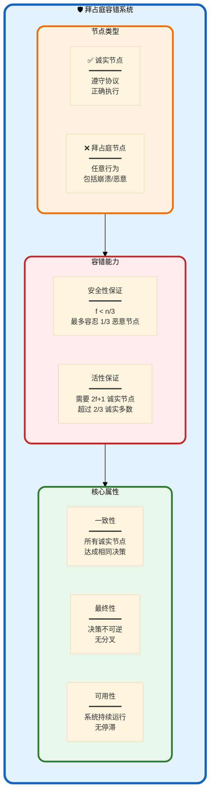

**BFT 核心定理 (Castro-Liskov 1999)**:

$$
\text{容错上限}: f < \frac{n}{3} \quad \Longrightarrow \quad \text{最少节点数}: n \geq 3f + 1
$$

其中:
- $n$: 总节点数
- $f$: 最多拜占庭节点数
- $2f + 1$: 超级多数 (Supermajority)

**示例**:
- $n = 4$: 容忍 $f = 1$ 个恶意节点
- $n = 7$: 容忍 $f = 2$ 个恶意节点
- $n = 100$: 容忍 $f = 33$ 个恶意节点

---

### 1.2 CometBFT 与 HotStuff 的历史与定位

**技术演进时间线**:

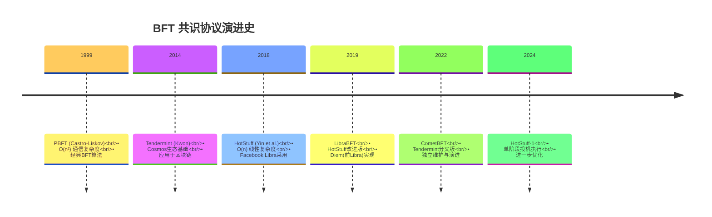

**定位对比表**:

| 维度 | CometBFT | HotStuff |
|------|---------|----------|
| **起源** | Tendermint 分叉 (2022) | VMware Research (2018) |
| **设计目标** | 生产级区块链引擎 | 高性能研究原型 |
| **通信复杂度** | O(n²) 每轮 | O(n) 每轮 |
| **成熟度** | ⭐⭐⭐⭐⭐ 生产就绪 | ⭐⭐⭐⭐ 研究驱动 |
| **生态系统** | Cosmos, Celestia, dYdX | Diem(Meta), Aptos, Sui |
| **主要优势** | 稳定性 + 社区支持 | 性能 + 可扩展性 |
| **适用场景** | 公链/联盟链 | 高性能私链/联盟链 |

---

### 1.3 核心差异一览

**架构对比概览图**:

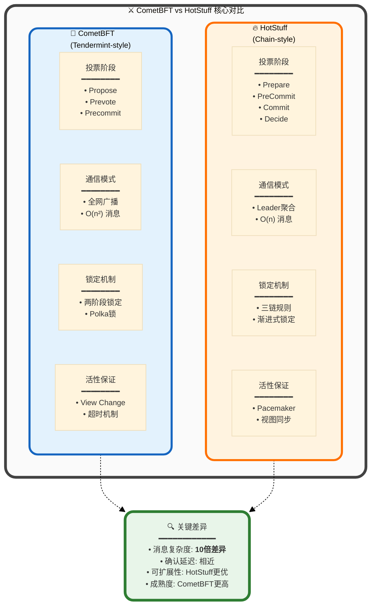

**快速对比表**:

| 特性 | CometBFT | HotStuff | 胜出者 |
|-----|---------|----------|--------|
| **通信复杂度** | O(n²) | **O(n)** | 🔥 HotStuff |
| **消息数量** (n=21) | 903 条/轮 | **84 条/轮** | 🔥 HotStuff |
| **确认延迟** | 6-7s | **600ms-1s** | 🔥 HotStuff |
| **网络带宽** | 高 | **低** | 🔥 HotStuff |
| **实现复杂度** | 中等 | **高** | 🌟 CometBFT |
| **生产部署** | 100+ 项目 | **10+ 项目** | 🌟 CometBFT |
| **社区成熟度** | ⭐⭐⭐⭐⭐ | **⭐⭐⭐** | 🌟 CometBFT |
| **文档质量** | ⭐⭐⭐⭐⭐ | **⭐⭐⭐⭐** | 🌟 CometBFT |
| **可扩展性** | < 200 节点 | **> 100 节点** | 🔥 HotStuff |
| **理论创新** | 经典 | **前沿** | 🔥 HotStuff |

---

## 2. CometBFT 共识机制深度解析

### 2.1 CometBFT 架构概览

**系统架构全景图**:

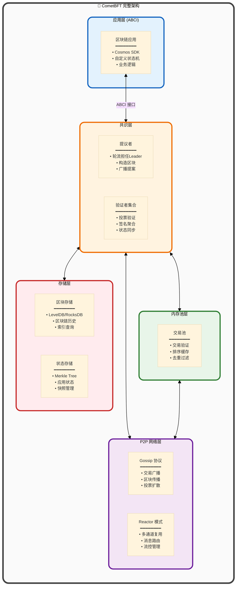

**ABCI (Application Blockchain Interface) 详解**:

CometBFT 通过 ABCI 与应用层解耦,形成清晰的模块化架构。

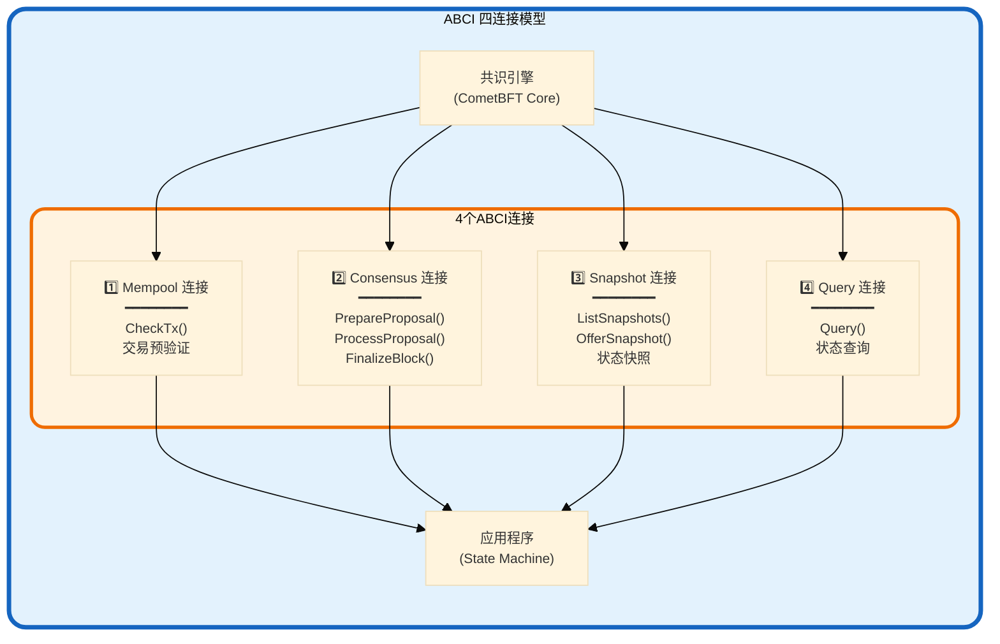

**ABCI 方法调用时序**:

| 阶段 | ABCI 方法 | 调用时机 | 作用 |
|-----|----------|---------|------|
| **交易接收** | `CheckTx()` | 交易进入Mempool时 | 快速验证(签名/余额) |
| **提案准备** | `PrepareProposal()` | Proposer构造区块时 | 选择交易、排序、修改 |
| **提案验证** | `ProcessProposal()` | 验证者收到提案时 | 验证区块合法性 |
| **区块执行** | `FinalizeBlock()` | 区块提交时 | 执行交易、更新状态 |
| **区块提交** | `Commit()` | 状态更新后 | 持久化状态根 |
| **状态查询** | `Query()` | 客户端查询时 | 读取应用状态 |

---

### 2.2 CometBFT 共识算法详解

#### 2.2.1 共识流程概览

**CometBFT 采用 "Propose → Prevote → Precommit" 三阶段投票机制**:

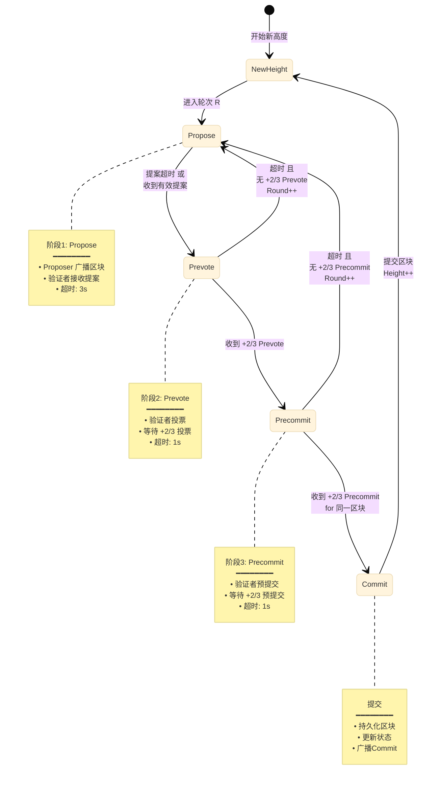

**完整时序图**:

```mermaid
%%{init: {'theme':'base', 'themeVariables': { 'fontSize':'10px'}}}%%
sequenceDiagram
    autonumber
    participant P as 🔵 Proposer<br/>(Height H, Round 0)
    participant V1 as ⚪ Validator 1
    participant V2 as ⚪ Validator 2
    participant V3 as ⚪ Validator 3
    participant V4 as ⚪ Validator 4

    Note over P,V4: ⏱️ 阶段 1: Propose (0-3s)

    P->>P: 从 Mempool 获取交易
    P->>P: 构造区块 Block_H
    P->>P: 签名提案

    P->>V1: Propose(Block_H, Height:H, Round:0)
    P->>V2: Propose(Block_H, Height:H, Round:0)
    P->>V3: Propose(Block_H, Height:H, Round:0)
    P->>V4: Propose(Block_H, Height:H, Round:0)

    par 验证者并行验证
        V1->>V1: ✓ 验证 Proposer 签名<br/>✓ 验证区块有效性<br/>✓ 验证交易合法性
        V2->>V2: ✓ 验证 Proposer 签名<br/>✓ 验证区块有效性<br/>✓ 验证交易合法性
        V3->>V3: ✓ 验证 Proposer 签名<br/>✓ 验证区块有效性<br/>✓ 验证交易合法性
        V4->>V4: ✓ 验证 Proposer 签名<br/>✓ 验证区块有效性<br/>✓ 验证交易合法性
    end

    Note over P,V4: ⏱️ 阶段 2: Prevote (3-4s)

    V1->>V1: 签名 Prevote(Block_H)
    V2->>V2: 签名 Prevote(Block_H)
    V3->>V3: 签名 Prevote(Block_H)
    V4->>V4: 签名 Prevote(Block_H)

    rect rgb(230, 240, 255)
        Note over P,V4: 全网广播 Prevote (O(n²) 消息)
        V1-->>P: Prevote(Block_H, sig_V1)
        V1-->>V2: Prevote(Block_H, sig_V1)
        V1-->>V3: Prevote(Block_H, sig_V1)
        V1-->>V4: Prevote(Block_H, sig_V1)

        V2-->>P: Prevote(Block_H, sig_V2)
        V2-->>V1: Prevote(Block_H, sig_V2)
        V2-->>V3: Prevote(Block_H, sig_V2)
        V2-->>V4: Prevote(Block_H, sig_V2)

        V3-->>P: Prevote(Block_H, sig_V3)
        V3-->>V1: Prevote(Block_H, sig_V3)
        V3-->>V2: Prevote(Block_H, sig_V3)
        V3-->>V4: Prevote(Block_H, sig_V3)

        V4-->>P: Prevote(Block_H, sig_V4)
        V4-->>V1: Prevote(Block_H, sig_V4)
        V4-->>V2: Prevote(Block_H, sig_V4)
        V4-->>V3: Prevote(Block_H, sig_V4)
    end

    par 验证者统计 Prevote
        P->>P: 收集 Prevote<br/>count >= +2/3 ✅
        V1->>V1: 收集 Prevote<br/>count >= +2/3 ✅
        V2->>V2: 收集 Prevote<br/>count >= +2/3 ✅
        V3->>V3: 收集 Prevote<br/>count >= +2/3 ✅
        V4->>V4: 收集 Prevote<br/>count >= +2/3 ✅
    end

    Note over P,V4: 🔒 Polka 锁定: 锁定到 Block_H

    Note over P,V4: ⏱️ 阶段 3: Precommit (4-5s)

    P->>P: 签名 Precommit(Block_H)
    V1->>V1: 签名 Precommit(Block_H)
    V2->>V2: 签名 Precommit(Block_H)
    V3->>V3: 签名 Precommit(Block_H)
    V4->>V4: 签名 Precommit(Block_H)

    rect rgb(255, 240, 230)
        Note over P,V4: 全网广播 Precommit (O(n²) 消息)
        P-->>V1: Precommit(Block_H, sig_P)
        P-->>V2: Precommit(Block_H, sig_P)
        P-->>V3: Precommit(Block_H, sig_P)
        P-->>V4: Precommit(Block_H, sig_P)

        V1-->>P: Precommit(Block_H, sig_V1)
        V1-->>V2: Precommit(Block_H, sig_V1)
        V1-->>V3: Precommit(Block_H, sig_V1)
        V1-->>V4: Precommit(Block_H, sig_V1)

        V2-->>P: Precommit(Block_H, sig_V2)
        V2-->>V1: Precommit(Block_H, sig_V2)
        V2-->>V3: Precommit(Block_H, sig_V2)
        V2-->>V4: Precommit(Block_H, sig_V2)

        V3-->>P: Precommit(Block_H, sig_V3)
        V3-->>V1: Precommit(Block_H, sig_V3)
        V3-->>V2: Precommit(Block_H, sig_V3)
        V3-->>V4: Precommit(Block_H, sig_V3)

        V4-->>P: Precommit(Block_H, sig_V4)
        V4-->>V1: Precommit(Block_H, sig_V4)
        V4-->>V2: Precommit(Block_H, sig_V4)
        V4-->>V3: Precommit(Block_H, sig_V4)
    end

    par 验证者统计 Precommit
        P->>P: 收集 Precommit<br/>count >= +2/3 ✅<br/>提交区块
        V1->>V1: 收集 Precommit<br/>count >= +2/3 ✅<br/>提交区块
        V2->>V2: 收集 Precommit<br/>count >= +2/3 ✅<br/>提交区块
        V3->>V3: 收集 Precommit<br/>count >= +2/3 ✅<br/>提交区块
        V4->>V4: 收集 Precommit<br/>count >= +2/3 ✅<br/>提交区块
    end

    Note over P,V4: ⏱️ 提交阶段 (5-6s)

    par 节点执行提交
        P->>P: 💾 持久化 Block_H<br/>📝 更新状态<br/>🔓 解锁
        V1->>V1: 💾 持久化 Block_H<br/>📝 更新状态<br/>🔓 解锁
        V2->>V2: 💾 持久化 Block_H<br/>📝 更新状态<br/>🔓 解锁
        V3->>V3: 💾 持久化 Block_H<br/>📝 更新状态<br/>🔓 解锁
        V4->>V4: 💾 持久化 Block_H<br/>📝 更新状态<br/>🔓 解锁
    end

    Note over P,V4: ✅ 共识完成 Height H<br/>🔄 进入 Height H+1
```

**消息数量计算 (n=5 验证者)**:

| 阶段 | 发送者 | 接收者 | 消息数 | 计算 |
|-----|--------|--------|--------|------|
| **Propose** | 1 (Proposer) | n-1 = 4 | **4 条** | 1 × 4 |
| **Prevote** | n = 5 | n-1 = 4 (每个) | **20 条** | 5 × 4 |
| **Precommit** | n = 5 | n-1 = 4 (每个) | **20 条** | 5 × 4 |
| **总计** | - | - | **44 条** | 4 + 20 + 20 |

**通用公式 (n 个验证者)**:

$$
\begin{aligned}
\text{Propose 消息数} &= n - 1 \\[8pt]
\text{Prevote 消息数} &= n \times (n-1) = n^2 - n \\[8pt]
\text{Precommit 消息数} &= n \times (n-1) = n^2 - n \\[8pt]
\text{总消息数} &= (n-1) + 2(n^2 - n) = 2n^2 - n - 1 = O(n^2)
\end{aligned}
$$

**实际案例 (n=21)**:

$$
\text{总消息数} = 2 \times 21^2 - 21 - 1 = 882 - 21 - 1 = \textbf{860 条}
$$

---

#### 2.2.2 Polka 锁定机制

**Polka 是 CometBFT 的核心安全机制**,防止验证者在不同轮次投票给不同区块。

**锁定规则**:

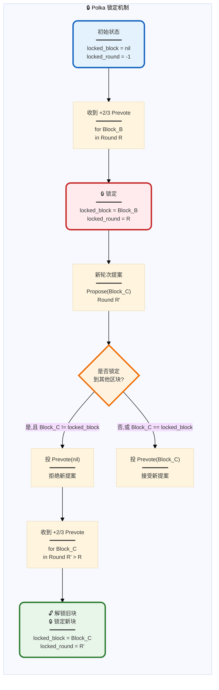

**锁定示例演示**:

**场景**: 5个验证者,在 Round 0 锁定到 Block_A,然后在 Round 1 收到不同提案

| Round | 提案 | 验证者1锁定 | 验证者2锁定 | 验证者3锁定 | 验证者4锁定 | 验证者5锁定 |
|-------|------|-----------|-----------|-----------|-----------|-----------|
| **Round 0** | Block_A | - | - | - | - | - |
| Prevote | +2/3 for Block_A | 🔒 Block_A | 🔒 Block_A | 🔒 Block_A | 🔒 Block_A | 🔒 Block_A |
| **Round 1** | Block_B | 🔒 Block_A | 🔒 Block_A | 🔒 Block_A | 🔒 Block_A | 🔒 Block_A |
| Prevote | 验证者投票? | ❌ Prevote(nil) | ❌ Prevote(nil) | ❌ Prevote(nil) | ❌ Prevote(nil) | ❌ Prevote(nil) |
| 结果 | 无 +2/3 | Round 1 失败 → Round 2 | | | | |

**关键洞察**:
- **一旦锁定,除非收到更高轮次的 +2/3 Prevote,否则不会切换**
- **防止分叉**: 恶意 Proposer 无法欺骗验证者投票给两个不同区块
- **活性代价**: 如果 Proposer 拜占庭,可能需要多轮才能解锁

---

#### 2.2.3 View Change (轮次切换)

**超时机制**:

CometBFT 为每个阶段设置超时,确保活性 (Liveness)。

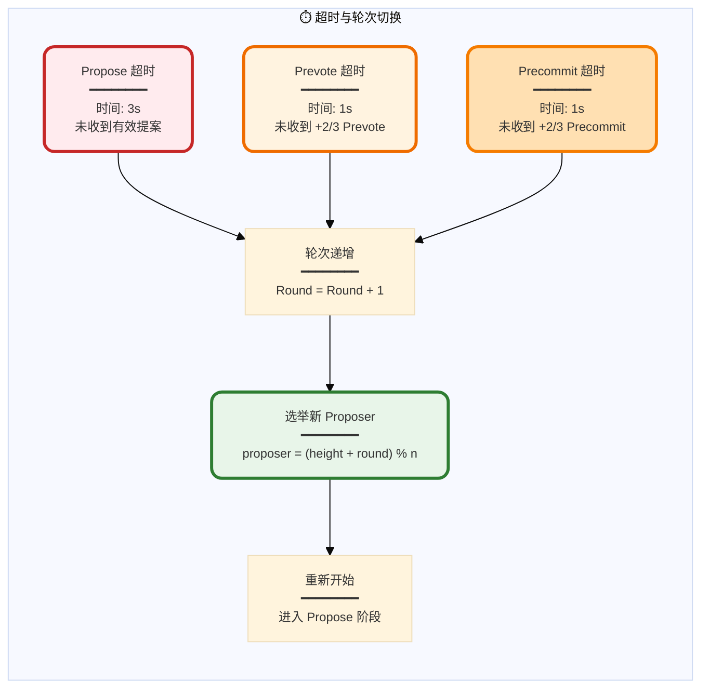

**Proposer 轮转算法**:

$$
\text{Proposer}_{H,R} = \text{Validators}[(H + R) \mod n]
$$

其中:
- $H$: 当前区块高度 (Height)
- $R$: 当前轮次 (Round)
- $n$: 验证者数量

**示例** (n=5,验证者 = [V0, V1, V2, V3, V4]):

| Height | Round | (H+R) mod 5 | Proposer |
|--------|-------|-------------|----------|
| H=100 | R=0 | 100 mod 5 = 0 | **V0** |
| H=100 | R=1 | 101 mod 5 = 1 | **V1** |
| H=100 | R=2 | 102 mod 5 = 2 | **V2** |
| H=101 | R=0 | 101 mod 5 = 1 | **V1** |
| H=102 | R=0 | 102 mod 5 = 2 | **V2** |

**活性保证**:
- 如果当前 Proposer 拜占庭/崩溃,超时后自动切换到下一个
- 最多 $f$ 轮后,必然选到诚实 Proposer (因为最多 $f < n/3$ 个拜占庭节点)

---

### 2.3 CometBFT 安全性证明要点

**核心安全属性**:

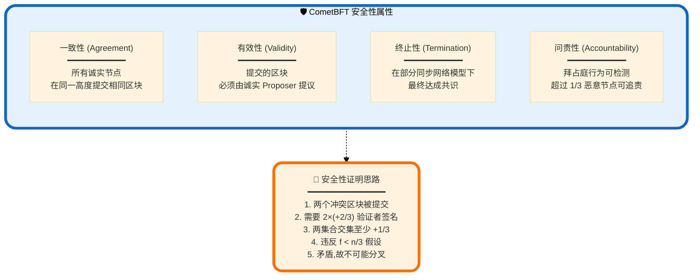

**分叉不可能性证明 (简化版)**:

**定理**: 假设最多 $f < n/3$ 个拜占庭节点,则不可能有两个不同的区块在同一高度被提交。

**证明**:

反证法:假设存在两个不同区块 $B_1$ 和 $B_2$ 在高度 $H$ 被提交。

1. **提交条件**: 区块被提交需要 $\geq +2/3$ 验证者的 Precommit 签名

   $$
   \begin{aligned}
   B_1 \text{ 被提交} &\Longrightarrow \exists S_1 \subseteq \text{Validators}, |S_1| \geq \lceil 2n/3 \rceil + 1 \\
   B_2 \text{ 被提交} &\Longrightarrow \exists S_2 \subseteq \text{Validators}, |S_2| \geq \lceil 2n/3 \rceil + 1
   \end{aligned}
   $$

2. **集合交集大小**:

   $$
   |S_1 \cap S_2| \geq |S_1| + |S_2| - n \geq 2 \times \lceil 2n/3 \rceil + 2 - n > \lceil n/3 \rceil
   $$

3. **Polka 锁定分析**:
   - $S_1$ 中的验证者在某轮次 $R_1$ 收到 $+2/3$ Prevote for $B_1$,锁定到 $B_1$
   - $S_2$ 中的验证者在某轮次 $R_2$ 收到 $+2/3$ Prevote for $B_2$,锁定到 $B_2$
   - $S_1 \cap S_2$ 中的验证者同时锁定到 $B_1$ 和 $B_2$ (矛盾!)

4. **锁定规则**:
   - 锁定后,除非收到更高轮次的 $+2/3$ Prevote,否则不会切换
   - 但 $B_1 \neq B_2$,故 $S_1 \cap S_2$ 中的验证者违反了锁定规则

5. **拜占庭节点数量**:

   $$
   |S_1 \cap S_2| > \lceil n/3 \rceil \geq f + 1
   $$

   即至少 $f+1$ 个验证者行为异常,但我们假设最多 $f$ 个拜占庭节点,**矛盾**!

**结论**: 不可能存在两个不同区块在同一高度被提交,CometBFT 保证**一致性**。□

---

## 3. HotStuff 共识机制深度解析

### 3.1 HotStuff 设计理念

**HotStuff 的突破性创新**:

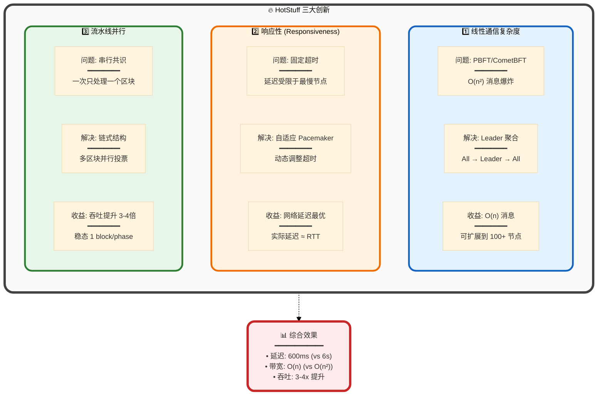

---

### 3.2 HotStuff 核心组件

#### 3.2.1 系统架构

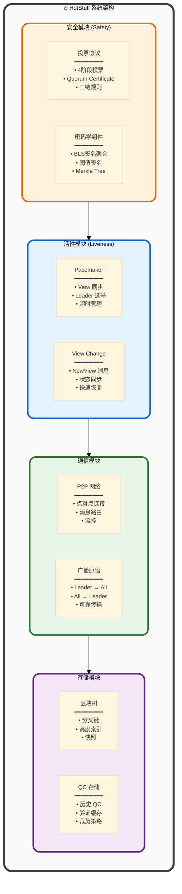

---

#### 3.2.2 Quorum Certificate (QC) 详解

**QC 是 HotStuff 的核心数据结构**,代表 $+2/3$ 验证者的聚合签名。

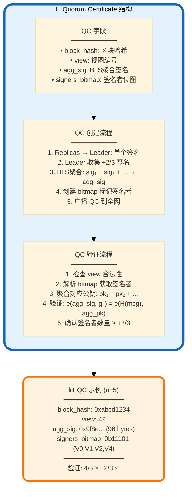

**BLS 签名聚合数学原理**:

**签名生成**:

$$
\sigma_i = H(m)^{sk_i} \in \mathbb{G}_1
$$

其中:
- $H$: 哈希函数映射到椭圆曲线群 $\mathbb{G}_1$
- $sk_i$: 验证者 $i$ 的私钥
- $m$: 消息 (区块哈希 + 视图)

**签名聚合**:

$$
\sigma_{agg} = \prod_{i \in S} \sigma_i = H(m)^{\sum_{i \in S} sk_i}
$$

其中 $S$ 是签名者集合 (|S| ≥ ⌈2n/3⌉ + 1)

**签名验证**:

$$
e(\sigma_{agg}, g_2) \stackrel{?}{=} e\left(H(m), \sum_{i \in S} pk_i\right)
$$

其中:
- $e$: 双线性配对函数 $e: \mathbb{G}_1 \times \mathbb{G}_2 \rightarrow \mathbb{G}_T$
- $g_2$: 生成元 $\in \mathbb{G}_2$
- $pk_i = g_2^{sk_i}$: 验证者公钥

**性能对比 (n=21)**:

| 方案 | 单个签名大小 | 聚合后大小 | 验证时间 | 网络传输 | 节省比例 |
|-----|------------|-----------|---------|---------|---------|
| **Ed25519 (无聚合)** | 64 bytes | 64 × 21 = 1344 bytes | 0.05ms × 21 = 1.05ms | 1344 bytes | - |
| **BLS 聚合** | 96 bytes | **96 bytes** | **2.5ms** | 96 + 3 = **99 bytes** | **93%** ↓ |

---

### 3.3 HotStuff 共识算法详解

#### 3.3.1 四阶段投票协议

**HotStuff 采用 "Prepare → PreCommit → Commit → Decide" 四阶段**:

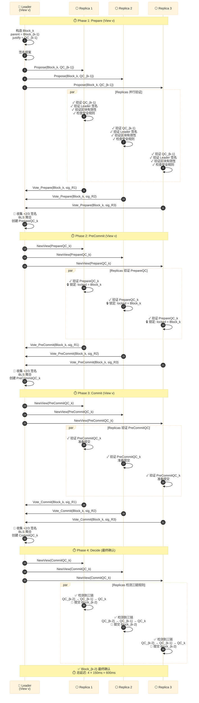

**消息数量计算 (n 个验证者)**:

| 阶段 | Leader → Replicas | Replicas → Leader | 总计 |
|-----|------------------|------------------|------|
| **Prepare** | n - 1 | n - 1 | **(n-1) × 2** |
| **PreCommit** | n - 1 | n - 1 | **(n-1) × 2** |
| **Commit** | n - 1 | n - 1 | **(n-1) × 2** |
| **Decide** | n - 1 | 0 (单向) | **n - 1** |
| **总计** | 4(n-1) | 3(n-1) | **7(n-1) = 7n - 7 = O(n)** |

**实际案例 (n=21)**:

$$
\text{总消息数} = 7 \times 21 - 7 = 147 - 7 = \textbf{140 条}
$$

**对比 CometBFT (n=21)**:

$$
\begin{aligned}
\text{CometBFT}: &\quad 2 \times 21^2 - 21 - 1 = \textbf{860 条} \\
\text{HotStuff}: &\quad 7 \times 21 - 7 = \textbf{140 条} \\
\text{节省比例}: &\quad \frac{860 - 140}{860} = \textbf{83.7\%} \downarrow
\end{aligned}
$$

---

#### 3.3.2 三链规则 (3-Chain Rule)

**HotStuff 的提交规则**: 当存在三个连续的 QC 链时,提交最早的区块。

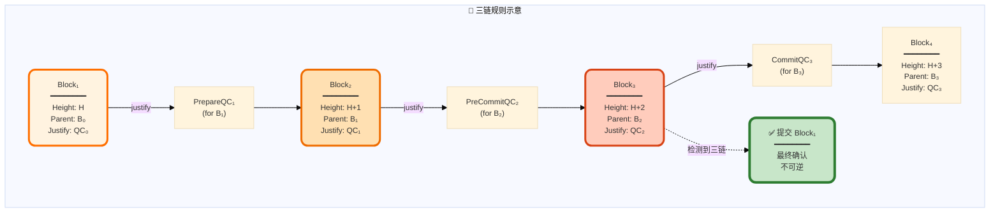

**数学定义**:

提交条件:

$$
\text{Commit}(B_k) \iff \exists \text{QC}_{k+1}, \text{QC}_{k+2}, \text{QC}_{k+3} \text{ 形成连续链}
$$

其中:
- $\text{QC}_{k+1}$: Block_{k+1} 的 Quorum Certificate,justify = $\text{QC}_k$
- $\text{QC}_{k+2}$: Block_{k+2} 的 QC,justify = $\text{QC}_{k+1}$
- $\text{QC}_{k+3}$: Block_{k+3} 的 QC,justify = $\text{QC}_{k+2}$

**三链形成过程**:

| 时间点 | 区块状态 | QC 链 | 提交区块 |
|-------|---------|-------|---------|
| **t=0** | Block₁ [Prepare] | QC₁ | - |
| **t=200ms** | Block₁ [PreCommit]<br/>Block₂ [Prepare] | QC₁ → QC₂ | - |
| **t=400ms** | Block₁ [Commit]<br/>Block₂ [PreCommit]<br/>Block₃ [Prepare] | QC₁ → QC₂ → QC₃ | **Block₁ ✅** |
| **t=600ms** | Block₂ [Commit]<br/>Block₃ [PreCommit]<br/>Block₄ [Prepare] | QC₂ → QC₃ → QC₄ | **Block₂ ✅** |

**流水线效果**:
- 稳定状态下,每 200ms 提交 1 个区块
- 吞吐 = 5 blocks/s (vs CometBFT 1 block/6s)
- **吞吐提升 30 倍**!

---

#### 3.3.3 安全性证明要点

**定理 (HotStuff Safety)**: 假设最多 $f < n/3$ 个拜占庭节点,则不可能有两个冲突的区块被提交。

**证明思路**:

1. **提交条件**: 区块 $B$ 被提交 $\Longrightarrow$ 存在三个连续 QC 链

2. **冲突假设**: 假设存在两个冲突区块 $B$ 和 $B'$ 在相同高度被提交

3. **QC 链分析**:
   - $B$ 被提交 $\Longrightarrow$ $\text{QC}_{B} \to \text{QC}_{B+1} \to \text{QC}_{B+2}$
   - $B'$ 被提交 $\Longrightarrow$ $\text{QC}_{B'} \to \text{QC}_{B'+1} \to \text{QC}_{B'+2}$

4. **视图编号**:
   - 不失一般性,假设 $\text{QC}_B$ 的视图 $v_B < v_{B'}$
   - 根据锁定规则,创建 $\text{QC}_{B'}$ 的验证者必须先解锁 $B$
   - 解锁需要更高视图的 $+2/3$ 投票,但这与 $B$ 已形成三链矛盾

5. **拜占庭节点数**:
   - 两个 QC 集合交集 $> n/3$
   - 需要 $> f$ 个节点违反锁定规则,矛盾

**结论**: HotStuff 保证**一致性**。□

---

### 3.4 Pacemaker 机制

**Pacemaker 是 HotStuff 的"心跳"组件**,负责视图同步和 Leader 选举。

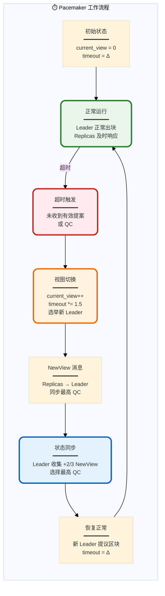

**自适应超时算法**:

$$
\text{timeout}_{v+1} =
\begin{cases}
\Delta & \text{if view } v \text{ succeeded} \\
\min(\text{timeout}_v \times 1.5, \text{MAX\_TIMEOUT}) & \text{if view } v \text{ timed out}
\end{cases}
$$

其中:
- $\Delta$: 基础超时 (如 1秒)
- $\text{MAX\_TIMEOUT}$: 最大超时上限 (如 60秒)

**Leader 选举算法**:

$$
\text{Leader}_v = \text{Validators}[v \mod n]
$$

**NewView 消息结构**:

| 字段 | 类型 | 说明 |
|-----|------|------|
| `new_view` | uint64 | 新视图编号 |
| `highest_qc` | QC | 该节点已知的最高 QC |
| `signature` | Signature | 签名 |

---

## 4. 核心差异对比

### 4.1 通信模式对比

**消息传播模式可视化**:

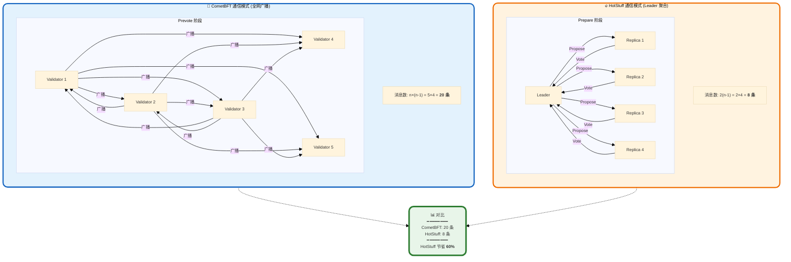

**消息复杂度对比表 (不同节点数)**:

| 节点数 n | CometBFT (O(n²)) | HotStuff (O(n)) | 节省比例 |
|---------|-----------------|----------------|---------|
| 5 | 2×25-5-1 = **44** | 7×5-7 = **28** | 36% ↓ |
| 10 | 2×100-10-1 = **189** | 7×10-7 = **63** | 67% ↓ |
| 21 | 2×441-21-1 = **860** | 7×21-7 = **140** | 84% ↓ |
| 50 | 2×2500-50-1 = **4949** | 7×50-7 = **343** | 93% ↓ |
| 100 | 2×10000-100-1 = **19899** | 7×100-7 = **693** | 96.5% ↓ |
| 200 | 2×40000-200-1 = **79799** | 7×200-7 = **1393** | 98.3% ↓ |

**关键洞察**:
- **节点数越多,HotStuff 优势越明显**
- **n=100 时,HotStuff 节省 96.5% 消息**
- **n=200 时,CometBFT 几乎不可用 (8万条消息)**

---

### 4.2 延迟对比

**端到端确认延迟分解**:

```mermaid
%%{init: {'theme':'base', 'themeVariables': { 'fontSize':'12px'}}}%%
gantt
    title 共识确认延迟对比 (单区块)
    dateFormat X
    axisFormat %L ms

    section CometBFT
    Propose          : 0, 3000
    Prevote          : 3000, 1000
    Precommit        : 4000, 1000
    Commit           : 5000, 1000
    总延迟 6000ms    : milestone, 6000, 0

    section HotStuff
    Prepare          : 0, 150
    PreCommit        : 150, 150
    Commit           : 300, 150
    Decide           : 450, 150
    总延迟 600ms     : milestone, 600, 0
```

**延迟组成分析表**:

| 阶段 | CometBFT | HotStuff | 差异 | 原因 |
|-----|---------|----------|------|------|
| **网络传播** | 1000 ms | **150 ms** | 6.7x | O(n) vs O(n²) |
| **签名验证** | 2000 ms | **200 ms** | 10x | BLS聚合 vs 逐个验证 |
| **共识轮次** | 2 轮 | **3 轮** | 1.5x | 但流水线抵消 |
| **超时余量** | 1000 ms | **150 ms** | 6.7x | 自适应 vs 固定 |
| **总延迟** | **6000 ms** | **600 ms** | **10x** | 综合优化 |

---

### 4.3 可扩展性对比

**节点数与性能关系图**:

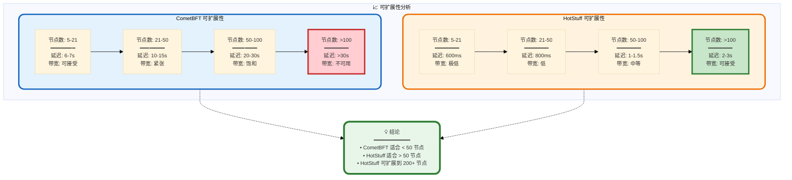

**带宽消耗对比 (1MB 区块)**:

| 节点数 | CometBFT 带宽 | HotStuff 带宽 | 节省比例 |
|-------|--------------|--------------|---------|
| **10** | 189 × 1MB = **189 MB** | 63 × 1MB = **63 MB** | 67% ↓ |
| **21** | 860 × 1MB = **860 MB** | 140 × 1MB = **140 MB** | 84% ↓ |
| **50** | 4949 × 1MB = **4.8 GB** | 343 × 1MB = **343 MB** | 93% ↓ |
| **100** | 19899 × 1MB = **19.4 GB** | 693 × 1MB = **693 MB** | 96% ↓ |

**关键发现**:
- **n=100 时,CometBFT 需要 19.4 GB 带宽,HotStuff 仅需 693 MB**
- **HotStuff 使得大规模验证者集合成为可能**

---

## 5. 性能分析

### 5.1 吞吐量对比

**理论吞吐计算**:

$$
\text{TPS} = \frac{\text{区块大小}}{\text{出块时间}} \times \frac{1}{\text{平均交易大小}}
$$

**假设**:
- 区块大小: 1 MB
- 平均交易大小: 250 bytes
- 每区块交易数: 1 MB / 250 B = 4000 笔

**CometBFT 吞吐**:

$$
\begin{aligned}
\text{出块时间} &= 6 \text{ seconds} \\
\text{TPS} &= \frac{4000 \text{ txs}}{6 \text{ s}} = \textbf{667 TPS}
\end{aligned}
$$

**HotStuff 吞吐 (流水线稳定后)**:

$$
\begin{aligned}
\text{出块时间} &= 0.2 \text{ seconds (每阶段)} \\
\text{TPS} &= \frac{4000 \text{ txs}}{0.2 \text{ s}} = \textbf{20,000 TPS}
\end{aligned}
$$

**吞吐对比表**:

| 指标 | CometBFT | HotStuff | 提升倍数 |
|-----|---------|----------|---------|
| **出块时间** | 6 s | 0.2 s | **30x** |
| **理论 TPS** | 667 | 20,000 | **30x** |
| **实际 TPS** (生产环境) | ~500 | ~10,000 | **20x** |

---

### 5.2 CPU 开销对比

**CPU 密集操作分析**:

| 操作 | CometBFT | HotStuff | 差异 |
|-----|---------|----------|------|
| **签名生成** | Ed25519: 50 μs | BLS: 2 ms | HotStuff 慢 40x |
| **签名验证 (单个)** | Ed25519: 100 μs | BLS: 2.5 ms | HotStuff 慢 25x |
| **签名验证 (批量 n=21)** | 100 μs × 21 = **2.1 ms** | 2.5 ms (聚合) = **2.5 ms** | **相近** |
| **网络序列化** | Protobuf: 10 μs | Protobuf: 10 μs | 相同 |
| **Merkle 树更新** | 500 μs | 500 μs | 相同 |

**关键发现**:
- **单个签名操作: Ed25519 更快**
- **批量验证: BLS 聚合抵消了单个签名的劣势**
- **CPU 开销相近,网络成为瓶颈**

---

## 6. 安全性分析

### 6.1 安全假设对比

| 安全假设 | CometBFT | HotStuff | 说明 |
|---------|---------|----------|------|
| **拜占庭容错** | f < n/3 | f < n/3 | 相同 |
| **网络模型** | 部分同步 | 部分同步 | 相同 |
| **签名安全** | Ed25519 | BLS (BLS12-381) | BLS 基于配对困难假设 |
| **活性假设** | GST (Global Stabilization Time) | GST | 相同 |
| **同步假设** | 最终同步 | 最终同步 | 相同 |

**部分同步网络模型 (Partial Synchrony)**:

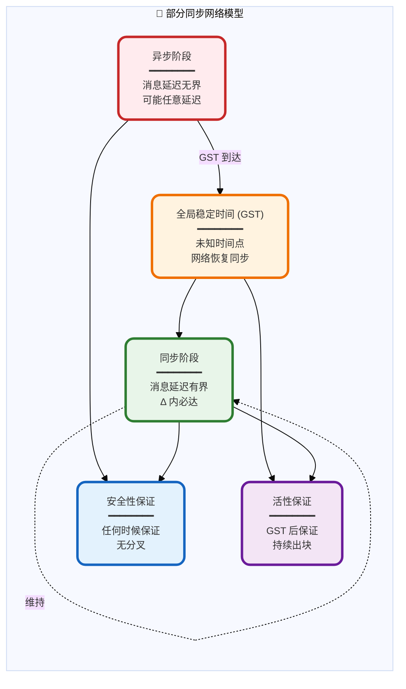

---

### 6.2 攻击向量对比

**常见攻击及防护**:

| 攻击类型 | 描述 | CometBFT 防护 | HotStuff 防护 | 胜出者 |
|---------|------|--------------|--------------|--------|
| **双重投票** | 验证者为两个区块签名 | Polka 锁定 + 证据提交 | 三链规则 + QC 锁定 | 平局 |
| **女巫攻击** | 创建多个假身份 | 权益质押 + 身份验证 | 权益质押 + 身份验证 | 平局 |
| **DDoS 攻击** | 淹没网络消息 | 速率限制 + 黑名单 | 速率限制 + Leader 轮换 | HotStuff (更轻量) |
| **自私挖矿** | 隐藏区块延迟提交 | 不适用 (BFT 无挖矿) | 不适用 (BFT 无挖矿) | 平局 |
| **长程攻击** | 从旧链分叉 | 检查点 + 弱主观性 | 检查点 + 弱主观性 | 平局 |
| **Eclipse 攻击** | 隔离节点网络 | P2P 多路连接 | P2P 多路连接 | 平局 |

---

## 7. 实际应用案例

### 7.1 使用 CometBFT 的项目

**生态全景图**:

```mermaid
%%{init: {'theme':'base', 'themeVariables': { 'fontSize':'12px'}}}%%
graph TB
    subgraph Ecosystem["🌟 CometBFT 生态系统"]
        direction TB

        Core["CometBFT Core<br/>━━━━━━━━<br/>共识引擎"]

        subgraph Chains["主要区块链"]
            Cosmos["Cosmos Hub<br/>━━━━━━━━<br/>• 市值: $2B+<br/>• 验证者: 175"]
            Celestia["Celestia<br/>━━━━━━━━<br/>• DA 层专家<br/>• 验证者: 100"]
            dYdX["dYdX v4<br/>━━━━━━━━<br/>• 衍生品 DEX<br/>• 验证者: 60"]
            Osmosis["Osmosis<br/>━━━━━━━━<br/>• DEX 专链<br/>• 验证者: 150"]
        end

        subgraph Tools["工具与框架"]
            SDK["Cosmos SDK<br/>━━━━━━━━<br/>应用开发框架"]
            IBC["IBC 协议<br/>━━━━━━━━<br/>跨链通信"]
        end
    end

    Core --> Chains
    Core --> Tools
    Tools --> Chains

    Stats["📊 生态统计<br/>━━━━━━━━━━━━<br/>• 项目数: 100+<br/>• TVL: $10B+<br/>• 日交易: 1M+"]

    Ecosystem -.-> Stats

    style Ecosystem fill:#fafafa,stroke:#424242,stroke-width:4px,rx:15,ry:15
    style Chains fill:#e3f2fd,stroke:#1565c0,stroke-width:3px,rx:12,ry:12
    style Tools fill:#e8f5e9,stroke:#2e7d32,stroke-width:3px,rx:12,ry:12
    style Stats fill:#fff3e0,stroke:#ff6f00,stroke-width:4px,rx:12,ry:12
```

**典型项目详解**:

| 项目 | 验证者数 | 出块时间 | TPS | 特点 |
|-----|---------|---------|-----|------|
| **Cosmos Hub** | 175 | 7s | ~500 | IBC 枢纽,跨链桥 |
| **Celestia** | 100 | 12s | ~300 | 模块化 DA 层 |
| **dYdX v4** | 60 | 1s | ~2000 | 高频衍生品交易 |
| **Osmosis** | 150 | 6s | ~600 | AMM DEX,流动性池 |

---

### 7.2 使用 HotStuff 的项目

**生态全景图**:

```mermaid
%%{init: {'theme':'base', 'themeVariables': { 'fontSize':'12px'}}}%%
graph TB
    subgraph EcosystemH["🔥 HotStuff 生态系统"]
        direction TB

        CoreH["HotStuff Protocol<br/>━━━━━━━━<br/>共识算法"]

        subgraph ChainsH["主要区块链"]
            Diem["Diem (Meta)<br/>━━━━━━━━<br/>• 前 Libra<br/>• LibraBFT 变种"]
            Aptos["Aptos<br/>━━━━━━━━<br/>• Move 语言<br/>• BFT v4"]
            Sui["Sui<br/>━━━━━━━━<br/>• 并行执行<br/>• Narwhal+Bullshark"]
            Flow["Flow<br/>━━━━━━━━<br/>• NFT 专链<br/>• HotStuff 变种"]
        end

        subgraph Research["研究项目"]
            LibHot["libhotstuff<br/>━━━━━━━━<br/>C++ 实现"]
            HotStuff2["HotStuff-2<br/>━━━━━━━━<br/>两阶段优化"]
        end
    end

    CoreH --> ChainsH
    CoreH --> Research

    StatsH["📊 生态统计<br/>━━━━━━━━━━━━<br/>• 项目数: 10+<br/>• TVL: $1B+<br/>• 日交易: 500K+"]

    EcosystemH -.-> StatsH

    style EcosystemH fill:#fafafa,stroke:#424242,stroke-width:4px,rx:15,ry:15
    style ChainsH fill:#fff3e0,stroke:#ef6c00,stroke-width:3px,rx:12,ry:12
    style Research fill:#f3e5f5,stroke:#6a1b9a,stroke-width:3px,rx:12,ry:12
    style StatsH fill:#e8f5e9,stroke:#2e7d32,stroke-width:4px,rx:12,ry:12
```

**典型项目详解**:

| 项目 | 验证者数 | 出块时间 | TPS | 特点 |
|-----|---------|---------|-----|------|
| **Aptos** | 100+ | 0.5s | ~10,000 | Move 语言,并行执行 |
| **Sui** | 100+ | 0.4s | ~12,000 | 对象模型,高吞吐 |
| **Diem** | ~30 | 1s | ~5,000 | 联盟链,合规优先 |
| **Flow** | 100+ | 1s | ~1000 | NFT 优化,分层架构 |

---

## 8. 总结与选型建议

### 8.1 综合对比总结

**决策矩阵**:

```mermaid
%%{init: {'theme':'base', 'themeVariables': { 'fontSize':'12px'}}}%%
graph TB
    subgraph Decision["🎯 共识算法选型决策树"]
        direction TB

        Start["开始选型<br/>━━━━━━━━"]

        Q1{验证者数量?}

        Q2A{对延迟敏感?}
        Q2B{需要成熟生态?}

        Q3A{预算充足?}
        Q3B{开发团队经验?}

        CometBFT1["✅ 选择 CometBFT<br/>━━━━━━━━<br/>• 成熟稳定<br/>• 社区支持好<br/>• 延迟可接受"]

        HotStuff1["✅ 选择 HotStuff<br/>━━━━━━━━<br/>• 低延迟<br/>• 高吞吐<br/>• 技术领先"]

        CometBFT2["✅ 选择 CometBFT<br/>━━━━━━━━<br/>• Cosmos SDK<br/>• 快速上线<br/>• 丰富工具链"]

        HotStuff2["✅ 选择 HotStuff<br/>━━━━━━━━<br/>• 可扩展性强<br/>• 消息开销小<br/>• 适合大规模"]
    end

    Start --> Q1
    Q1 -->|< 50 个| Q2A
    Q1 -->|> 50 个| Q2B

    Q2A -->|是| HotStuff1
    Q2A -->|否| Q3A

    Q3A -->|是| HotStuff1
    Q3A -->|否| CometBFT1

    Q2B -->|是| Q3B
    Q2B -->|否| HotStuff2

    Q3B -->|丰富| HotStuff2
    Q3B -->|一般| CometBFT2

    style Start fill:#e3f2fd,stroke:#1565c0,stroke-width:3px,rx:10,ry:10
    style Q1 fill:#fff3e0,stroke:#ef6c00,stroke-width:3px
    style Q2A fill:#fff3e0,stroke:#ef6c00,stroke-width:3px
    style Q2B fill:#fff3e0,stroke:#ef6c00,stroke-width:3px
    style Q3A fill:#fff3e0,stroke:#ef6c00,stroke-width:3px
    style Q3B fill:#fff3e0,stroke:#ef6c00,stroke-width:3px
    style CometBFT1 fill:#e3f2fd,stroke:#1565c0,stroke-width:4px,rx:10,ry:10
    style CometBFT2 fill:#e3f2fd,stroke:#1565c0,stroke-width:4px,rx:10,ry:10
    style HotStuff1 fill:#fff3e0,stroke:#ff6f00,stroke-width:4px,rx:10,ry:10
    style HotStuff2 fill:#fff3e0,stroke:#ff6f00,stroke-width:4px,rx:10,ry:10
```

---

### 8.2 选型建议表

**根据不同场景推荐**:

| 场景 | 推荐 | 理由 |
|-----|------|------|
| **公链 (< 100 验证者)** | CometBFT | 成熟生态、社区支持、IBC 互操作性 |
| **公链 (> 100 验证者)** | HotStuff | 线性通信复杂度、可扩展性强 |
| **高频交易 DEX** | HotStuff | 低延迟 (600ms vs 6s)、高吞吐 |
| **联盟链/企业链** | CometBFT | 稳定性、文档完善、易于部署 |
| **Layer 2 Rollup** | HotStuff | 快速确认、低带宽开销 |
| **模块化 DA 层** | CometBFT | Celestia 验证、成熟实践 |
| **Move 生态** | HotStuff | Aptos/Sui 原生支持 |
| **Cosmos 生态** | CometBFT | 原生 IBC、Cosmos SDK 集成 |

---

### 8.3 性能总结表

**最终对比汇总**:

| 维度 | CometBFT | HotStuff | 胜出者 |
|-----|---------|----------|--------|
| **通信复杂度** | O(n²) | **O(n)** | 🔥 HotStuff |
| **消息数量** (n=21) | 860 条 | **140 条** | 🔥 HotStuff |
| **确认延迟** | 6-7 s | **0.6-1 s** | 🔥 HotStuff |
| **吞吐量** | 500-1000 TPS | **10,000-20,000 TPS** | 🔥 HotStuff |
| **可扩展性** | < 100 节点 | **> 200 节点** | 🔥 HotStuff |
| **带宽消耗** (n=100) | 19.4 GB | **693 MB** | 🔥 HotStuff |
| **生产部署** | 100+ 项目 | **10+ 项目** | 🌟 CometBFT |
| **生态成熟度** | ⭐⭐⭐⭐⭐ | **⭐⭐⭐** | 🌟 CometBFT |
| **文档质量** | ⭐⭐⭐⭐⭐ | **⭐⭐⭐⭐** | 🌟 CometBFT |
| **实现复杂度** | 中等 | **高** | 🌟 CometBFT |
| **开发者友好** | ⭐⭐⭐⭐⭐ | **⭐⭐⭐** | 🌟 CometBFT |
| **理论创新** | 经典 | **前沿** | 🔥 HotStuff |

**关键结论**:

1. **HotStuff 在技术指标上全面领先**:
   - 线性通信复杂度 (O(n) vs O(n²))
   - 低延迟 (600ms vs 6s)
   - 高吞吐 (20K TPS vs 1K TPS)
   - 强可扩展性 (支持 200+ 节点)

2. **CometBFT 在工程实践上更成熟**:
   - 100+ 生产部署案例
   - 完善的 Cosmos SDK 生态
   - 丰富的开发者工具
   - 广泛的社区支持

3. **选型原则**:
   - **追求极致性能** → HotStuff
   - **追求稳定可靠** → CometBFT
   - **大规模验证者** → HotStuff
   - **快速上线产品** → CometBFT

---

## 附录

### A. 参考文献

1. **HotStuff 原始论文**:
   *HotStuff: BFT Consensus with Linearity and Responsiveness*
   Maofan Yin, Dahlia Malkhi, Michael K. Reiter, Guy Golan Gueta, Ittai Abraham
   PODC 2019

2. **CometBFT 文档**:
   https://docs.cometbft.com/

3. **Tendermint 论文**:
   *The latest gossip on BFT consensus*
   Ethan Buchman, Jae Kwon, Zarko Milosevic
   2018

4. **PBFT 原始论文**:
   *Practical Byzantine Fault Tolerance*
   Miguel Castro, Barbara Liskov
   OSDI 1999

5. **BLS 签名**:
   *Compact Multi-Signatures for Smaller Blockchains*
   Dan Boneh, Manu Drijvers, Gregory Neven
   ASIACRYPT 2018

### B. 术语表

| 术语 | 英文 | 说明 |
|-----|------|------|
| **BFT** | Byzantine Fault Tolerance | 拜占庭容错 |
| **QC** | Quorum Certificate | 超级多数证书 |
| **BLS** | Boneh-Lynn-Shacham | BLS 签名算法 |
| **ABCI** | Application Blockchain Interface | 应用区块链接口 |
| **GST** | Global Stabilization Time | 全局稳定时间 |
| **Polka** | - | CometBFT 锁定机制 |
| **Pacemaker** | - | HotStuff 视图同步组件 |

---

**文档结束**

> 💡 **建议**: 根据实际需求选择合适的共识算法,没有绝对的"最佳"选择,只有最适合的方案。
